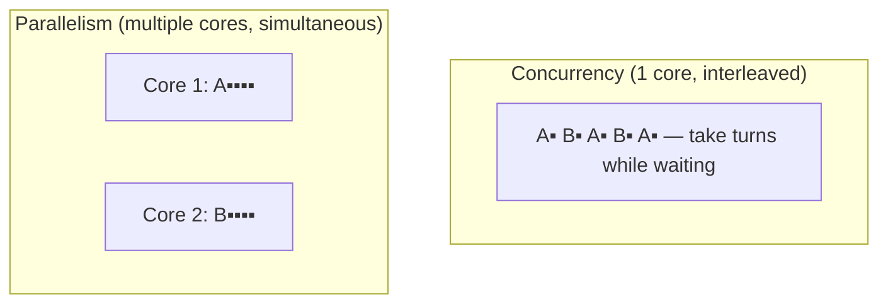
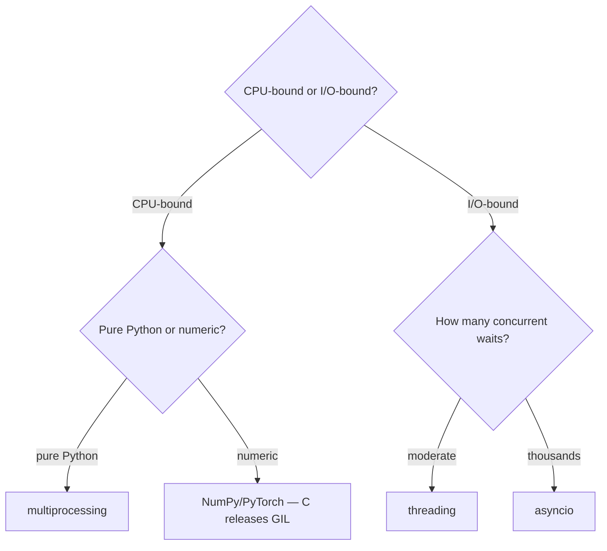
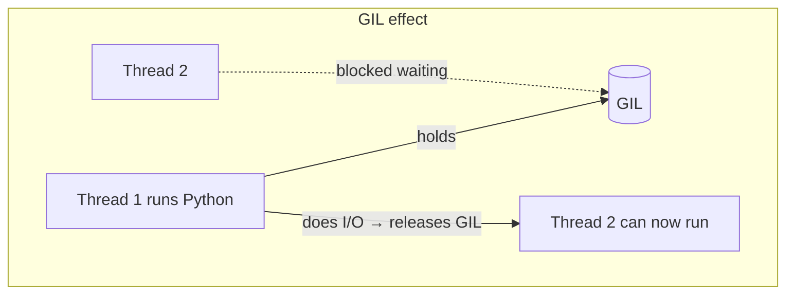
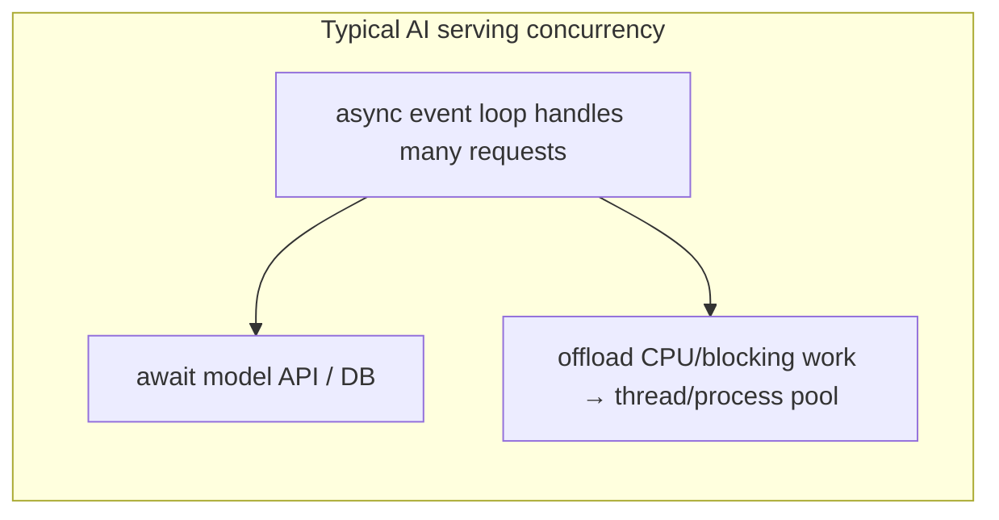

<!-- Module 02 · Lesson 8 — follows ../../../standards/. -->

# 02.8 · Concurrency

[⬅ 02.7 Networking](02.7-networking.md) · [🏠 Module](../README.md) · [🗺 Roadmap](../../../ROADMAP.md) · [Next ➡](02.9-serialization.md)

> Doing many things at once — the CS foundation beneath [Module 01's](../../01-Advanced-Python/weeks/01.11-performance.md) practical guidance. This lesson consolidates threading, multiprocessing, and async into one decision framework, and treats the hard parts: locks, race conditions, and Python's GIL.

| | |
|---|---|
| **Module** | `02 · Computer Science Foundations` |
| **Lesson** | `02.8` |
| **Difficulty** | ⭐⭐⭐⭐ |
| **Estimated study time** | 65 min read · 40 min practice |
| **Status** | 🟢 stable |

---

## 1. Learning Objectives

By the end of this lesson you will be able to:

- [ ] Distinguish **concurrency** from **parallelism** precisely.
- [ ] Compare **threading, multiprocessing,** and **async** and choose correctly.
- [ ] Explain and prevent **race conditions** using **locks** and other primitives.
- [ ] Explain the **GIL** and its exact consequences for each model.
- [ ] Apply the right model to real AI workloads.

## 2. Prerequisites

- [02.6 Operating Systems](02.6-operating-systems.md) (processes/threads/scheduling/races) and [02.7 Networking](02.7-networking.md) (I/O-bound work).
- [Module 01.11 Performance](../../01-Advanced-Python/weeks/01.11-performance.md) & [01.12 Async](../../01-Advanced-Python/weeks/01.12-async.md) — the practical side; this is the unifying CS view.

---

## 3. Why This Topic Exists

AI systems are inherently concurrent: a serving endpoint handles many requests at once; a pipeline fans out thousands of model API calls; preprocessing splits work across CPU cores; training synchronizes across GPUs. Getting concurrency *right* means huge throughput gains; getting it *wrong* means race conditions, deadlocks, and non-deterministic bugs that only appear under load.

This lesson unifies what you've met piecemeal — the OS thread/process model ([02.6](02.6-operating-systems.md)), the network I/O that motivates async ([02.7](02.7-networking.md)), and Python's practical tools ([Module 01.11–01.12](../../01-Advanced-Python/weeks/01.11-performance.md)) — into a single, durable decision framework.

> [!IMPORTANT]
> The one question that decides everything: **is the work CPU-bound or I/O-bound?** CPU-bound (compute) needs *parallelism* (multiprocessing/native code). I/O-bound (waiting on network/disk) needs *concurrency* (async/threads). Misjudge this and you'll pick a model that gives zero speedup. Everything below flows from this distinction.

## 4. Problems It Solves

| Problem | Concurrency solves it by |
|---|---|
| Many API calls take too long sequentially | Overlapping I/O waits (async/threads) |
| CPU-heavy preprocessing is slow | Parallelizing across cores (multiprocessing) |
| Serving must handle concurrent users | Handling requests concurrently |
| Threads corrupt shared data | Locks / avoiding shared state |
| "Why doesn't threading speed up my math?" | Understanding the GIL |

---

## 5. Concurrency vs Parallelism

These are often confused but distinct:

| | Concurrency | Parallelism |
|---|---|---|
| Meaning | *Dealing with* many things at once (interleaved) | *Doing* many things at once (simultaneously) |
| Requires multiple cores? | No (can interleave on one) | Yes (truly simultaneous) |
| Analogy | One chef juggling multiple dishes | Multiple chefs cooking in parallel |
| Best for | I/O-bound (overlap waiting) | CPU-bound (overlap computing) |



> [!IMPORTANT]
> **asyncio gives concurrency, not parallelism** ([Module 01.12](../../01-Advanced-Python/weeks/01.12-async.md)) — one thread interleaving tasks at `await` points. **Multiprocessing gives parallelism** — separate processes on separate cores. Threading in CPython gives *concurrency* but not CPU *parallelism* (the GIL). Naming this precisely prevents the most common concurrency mistake.

---

## 6. The Three Models — Unified Comparison

| | Threading | Multiprocessing | Async (asyncio) |
|---|---|---|---|
| **Unit** | OS threads (shared memory) | OS processes (isolated memory) | Coroutines (one thread) |
| **Parallelism** | ❌ (GIL blocks CPU) | ✅ True (separate GILs) | ❌ (single thread) |
| **Concurrency** | ✅ (GIL released on I/O) | ✅ | ✅✅ (thousands of tasks) |
| **Best for** | I/O-bound, moderate scale | CPU-bound | I/O-bound, high scale |
| **Communication** | Shared vars + locks | IPC (serialize/pickle) | Shared state (single thread) |
| **Overhead** | Low | High (memory + spawn + serialize) | Very low |
| **Main risk** | Races, deadlocks | Serialization cost, memory | Blocking the loop |
| **Scheduling** | Preemptive (OS) | Preemptive (OS) | Cooperative (`await`) |



> [!TIP]
> **AI reality check:** most AI-Engineering concurrency is **I/O-bound** (calling model APIs, DB/vector-store queries, reading data) → **async** dominates. CPU-heavy numeric work is handled by **NumPy/PyTorch/GPU** (which release the GIL and parallelize internally), so you rarely need multiprocessing for the *math* — but you do for **CPU-bound pure-Python preprocessing** (parsing, tokenizing millions of docs). This is the same guidance as [Module 01.11](../../01-Advanced-Python/weeks/01.11-performance.md), now grounded in the CS.

---

## 7. The GIL, Precisely

The **Global Interpreter Lock** is a mutex in CPython ensuring only **one thread executes Python bytecode at a time** ([Module 01.11](../../01-Advanced-Python/weeks/01.11-performance.md), [02.6](02.6-operating-systems.md)). It exists to make CPython's memory management (reference counting, [Module 01.2](../../01-Advanced-Python/weeks/01.2-memory-management.md)) simple and thread-safe.



| Situation | GIL behavior | Consequence |
|---|---|---|
| CPU-bound Python (a compute loop) | Held throughout | Threads **don't** parallelize → no speedup |
| I/O wait (network, disk) | **Released** while waiting | Threads **do** overlap → speedup |
| Inside NumPy/C extension | Often **released** | The heavy math parallelizes |
| Separate processes | Each has its own GIL | True parallelism |

> [!IMPORTANT]
> The GIL is a **CPython implementation detail**, not a Python-language feature — other implementations differ, and recent CPython has an experimental **free-threaded ("no-GIL") build**. But for production today, assume the GIL. Its two practical rules: (1) don't expect threads to speed up CPU-bound Python; (2) do use threads/async for I/O-bound work, since the GIL is released while waiting. NumPy/PyTorch escaping the GIL for numeric kernels is *why* Python remains viable for AI despite the GIL.

---

## 8. Race Conditions and Locks (Deeper)

When threads share mutable state, operations that *look* atomic often aren't. `count += 1` is **read, add, write** — three steps the scheduler can interrupt between ([02.6](02.6-operating-systems.md)).

```python
import threading

counter = 0
lock = threading.Lock()

def worker():
    global counter
    for _ in range(100_000):
        with lock:            # serialize access → no lost updates
            counter += 1

threads = [threading.Thread(target=worker) for _ in range(4)]
[t.start() for t in threads]; [t.join() for t in threads]
# with the lock: exactly 400_000. WITHOUT it: some smaller, non-deterministic number.
```

| Primitive | Use |
|---|---|
| **Lock (mutex)** | Mutual exclusion — one thread in the critical section |
| **RLock** | Re-entrant lock (same thread can re-acquire) |
| **Semaphore** | Allow up to N concurrent (bound concurrency, [Module 01.12](../../01-Advanced-Python/weeks/01.12-async.md)) |
| **Event** | One thread signals others to proceed |
| **Condition** | Wait for a state change (producer/consumer) |
| **Queue** | Thread-safe hand-off (avoids manual locking) |

> [!WARNING]
> The GIL protects a *single* bytecode operation but **not** multi-step sequences — so `count += 1` across threads still races. Don't let "the GIL makes Python thread-safe" fool you (it's a common myth): you still need locks around compound operations on shared state. Better yet, **avoid shared mutable state**: use `queue.Queue` for hand-offs, or process isolation, so you don't need locks at all.

> [!TIP]
> **Prefer higher-level tools over raw locks.** `concurrent.futures.ThreadPoolExecutor`/`ProcessPoolExecutor` and `queue.Queue` handle the tricky synchronization for you. Raw locks are error-prone (deadlocks, forgotten unlocks — though `with lock:` from [Module 01.7](../../01-Advanced-Python/weeks/01.7-context-managers.md) helps). Use the smallest amount of shared mutable state you can.

---

## 9. Applying It to AI Workloads

| AI task | Best model | Why |
|---|---|---|
| Batch of 10k LLM API calls | **async** | I/O-bound, massive concurrency ([Module 01.12](../../01-Advanced-Python/weeks/01.12-async.md)) |
| Preprocessing/tokenizing millions of docs (pure Python) | **multiprocessing** | CPU-bound, needs real parallelism |
| Matrix math / model forward pass | **NumPy/PyTorch/GPU** | Releases GIL; parallel kernels |
| Concurrent request handling in a server | **async** (+ thread pool for blocking bits) | Many I/O waits |
| A background thread reading from a queue | **threading** | Simple I/O-bound producer/consumer |
| Distributed training across GPUs/nodes | **multiprocessing + networking** | Parallel compute + gradient sync ([Module 17](../../17-Cloud/README.md)) |



> [!IMPORTANT]
> Real systems **combine** models: an async server (I/O concurrency) that offloads CPU-bound or blocking work to a `ProcessPoolExecutor`/`ThreadPoolExecutor` via `asyncio.to_thread`/`run_in_executor` ([Module 01.12](../../01-Advanced-Python/weeks/01.12-async.md)). Concurrency isn't "pick one" — it's composing the right model for each part of the workload.

---

## 10. Common Mistakes & Debugging

| Mistake | Consequence | Fix |
|---|---|---|
| Threads for CPU-bound Python | No speedup (GIL) | Multiprocessing / native libs |
| "GIL makes it thread-safe" | Races on compound ops | Locks around shared state |
| Blocking call in async | Freezes the loop | `to_thread`/async libs ([Module 01.12](../../01-Advanced-Python/weeks/01.12-async.md)) |
| Unbounded threads/processes | Resource exhaustion, context-switch thrash | Pools + bounded concurrency |
| Inconsistent lock order | Deadlock | Fixed global lock order ([02.6](02.6-operating-systems.md)) |
| Shared mutable state everywhere | Hard-to-debug races | Message passing / queues / isolation |
| Passing huge data across processes | Serialization overhead | Shared memory / minimize IPC data |

> [!TIP]
> Concurrency bugs are **non-deterministic** — they hide in tests and appear under production load. Debugging them: reproduce with stress/load, add logging with thread/task IDs, use deterministic tests where possible, and *reduce* shared state so there's less to go wrong. Prevention (avoid shared mutable state, use pools/queues) beats debugging here more than anywhere.

## 11. Performance Considerations

| Principle | Takeaway |
|---|---|
| Match model to bound | CPU→parallel, I/O→concurrent |
| Bound concurrency | Semaphores/pools prevent overload ([Module 01.12](../../01-Advanced-Python/weeks/01.12-async.md)) |
| Minimize IPC data | Serialization is costly across processes |
| Fewer, coarser tasks | Avoid context-switch/spawn overhead ([02.6](02.6-operating-systems.md)) |
| Let native code parallelize | NumPy/PyTorch use all cores + release GIL |

## 12. Security Considerations

| Risk | Guidance |
|---|---|
| Race-condition vulnerabilities (TOCTOU) | Exploitable timing bugs — validate atomically ([02.6](02.6-operating-systems.md)) |
| Unbounded concurrency (self-DoS) | Cap with pools/semaphores |
| Shared-memory data leakage | Scope shared state; isolate sensitive data |
| Deadlock as availability risk | Consistent lock order + timeouts |
| Deserializing across process boundaries | `multiprocessing` uses pickle — never with untrusted data ([Module 02.9](02.9-serialization.md)) |

> [!CAUTION]
> `multiprocessing` sends data between processes by **pickling** it ([Module 01.3](../../01-Advanced-Python/weeks/01.3-object-oriented-python.md), and [02.9](02.9-serialization.md)) — never build a system that unpickles data from an untrusted source, as unpickling can execute arbitrary code. Keep IPC within your trust boundary.

---

## 13. Interview Questions

**Beginner**
1. Concurrency vs parallelism — define each with an analogy.
2. Why don't threads speed up CPU-bound Python?

**Intermediate**
1. Compare threading, multiprocessing, and async — when to use each.
2. Why does `count += 1` race across threads despite the GIL, and how do you fix it?

**Advanced**
1. Design the concurrency for an async server that must also do CPU-heavy work per request.
2. Explain the GIL's purpose and precisely when it's held vs released.

**System-design prompt**
- Design a system that ingests a stream of documents, tokenizes them (CPU-heavy), embeds them via an API (I/O), and stores results. Choose concurrency models for each stage. — *Follow-ups:* Where's async vs multiprocessing? How do you bound concurrency and pass data between stages safely?

---

## 14. Summary

| Key idea | Takeaway |
|---|---|
| CPU vs I/O bound | The question that decides the model |
| Concurrency ≠ parallelism | Interleaving vs simultaneous |
| Three models | Threading (I/O), multiprocessing (CPU), async (massive I/O) |
| The GIL | One thread runs Python bytecode; released on I/O / in native code |
| Races need locks | GIL ≠ thread-safe for compound ops; prefer no shared state |
| Compose models | Async server + process pool for CPU work |

## 15. Cheat Sheet

```text
DECIDE: CPU-bound → PARALLELISM (multiprocessing / NumPy-GPU) · I/O-bound → CONCURRENCY (async/threads)
CONCURRENCY (interleave, 1 core ok) ≠ PARALLELISM (simultaneous, needs cores)
THREADING: shared mem, light, I/O-bound, GIL blocks CPU, needs LOCKS
MULTIPROCESSING: isolated mem, heavy, CPU-bound true parallelism, IPC=pickle
ASYNC: 1 thread, coroutines, massive I/O concurrency, cooperative (never block loop)
GIL (CPython): 1 thread runs bytecode at a time; RELEASED on I/O & in C extensions (NumPy)
  → threads don't speed CPU Python; do help I/O. "GIL = thread-safe" is a MYTH for compound ops
RACES: count+=1 = read/add/write (not atomic) → Lock (with lock:) / Queue / avoid shared state
PRIMITIVES: Lock/RLock · Semaphore(N) · Event · Condition · queue.Queue
PREFER: concurrent.futures pools + queue.Queue over raw locks
COMPOSE: async loop + ProcessPool/ThreadPool (asyncio.to_thread) for CPU/blocking parts
```

## 16. Flashcards

- **Q:** Concurrency vs parallelism? — **A:** Concurrency = dealing with many things by interleaving (one core ok); parallelism = doing them simultaneously (needs multiple cores).
- **Q:** Which model for CPU-bound vs I/O-bound? — **A:** CPU-bound → multiprocessing (or NumPy/GPU); I/O-bound → async (high scale) or threading (moderate).
- **Q:** When is the GIL released? — **A:** During I/O waits and inside many C extensions (e.g., NumPy) — which is why threads/async help I/O and native math parallelizes.
- **Q:** Why does `count += 1` race despite the GIL? — **A:** It's three bytecode steps (read/add/write) the scheduler can interrupt between; the GIL only guards a single op.
- **Q:** Best default for AI-Engineering concurrency? — **A:** async — most AI work (API/DB/data I/O) is I/O-bound; heavy math is handled by GIL-releasing native libraries.
- **Q:** Safer alternative to raw locks? — **A:** Avoid shared mutable state — use `queue.Queue` and `concurrent.futures` pools, or process isolation.

## 17. Hands-on Exercises

> Full set in [`../exercises/`](../exercises/).

- [ ] **(⭐ Conceptual)** For six workloads, pick threading/multiprocessing/async and justify via CPU-vs-I/O.
- [ ] **(⭐⭐ Coding)** Show the race: increment a shared counter from 4 threads without a lock (wrong total), then with a lock (correct).
- [ ] **(⭐⭐ Coding)** Compare wall-clock time: 50 simulated API calls sequentially vs with async `gather`; and a CPU task with threads vs processes.
- [ ] **(⭐⭐⭐ Coding)** Build a producer/consumer with `queue.Queue` and multiple worker threads; prove no lost items.
- [ ] **(⭐⭐⭐ Coding)** In an async program, offload a CPU-bound function with `asyncio.to_thread`/executor without blocking the loop.

## 18. Mini Project

> **LRU cache, thread-safe (this module's showcase, v5).** Extend the thread-safe queue idea: implement a Least-Recently-Used cache ([Module 01.6](../../01-Advanced-Python/weeks/01.6-decorators.md) memoization concept) that is safe under concurrent access — O(1) get/put using a hash map + doubly linked list, protected by a lock. Include stress tests with many threads proving correctness and eviction. This combines data structures ([02.3](02.3-data-structures.md)), concurrency, and caching — a classic interview + real infra component.

## 19. References

- Python docs — *`threading`*, *`multiprocessing`*, *`concurrent.futures`*, *`queue`*, *`asyncio`* ([reference standards](../../../standards/reference-standards.md)).
- *Operating Systems: Three Easy Pieces* — concurrency chapters (free online).
- [Module 01.11–01.12](../../01-Advanced-Python/weeks/01.11-performance.md) — the practical Python companion.

## 20. What's Next

Concurrent, networked systems must exchange data in agreed formats. Next: **serialization** — JSON, YAML, Pickle, MessagePack, and Protocol Buffers — with the security pitfalls (like untrusted pickle) that keep recurring.

➡️ **Next:** [02.9 · Serialization](02.9-serialization.md)

---

### 🔁 Revision checklist
- [ ] I can define concurrency vs parallelism
- [ ] I can pick the right model from CPU-vs-I/O
- [ ] I can explain the GIL's exact behavior and the race myth
- [ ] I can prevent races with locks/queues and prefer no shared state

### 🔗 Spaced-repetition callback
> This lesson is the CS synthesis of [02.6 (OS)](02.6-operating-systems.md), [02.7 (networking)](02.7-networking.md), and [Module 01.11–01.12](../../01-Advanced-Python/weeks/01.11-performance.md). The GIL (an OS-level mutex over CPython's memory model), I/O-bound network waits (why async wins), and race conditions (shared-memory threads) all converge here into one framework.
