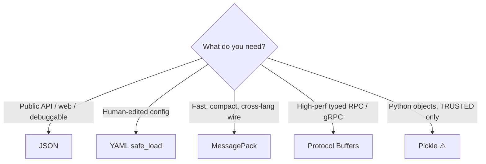
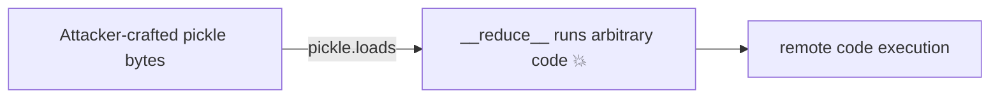

<!-- Module 02 · Lesson 9 — follows ../../../standards/. -->

# 02.9 · Serialization

[⬅ 02.8 Concurrency](02.8-concurrency.md) · [🏠 Module](../README.md) · [🗺 Roadmap](../../../ROADMAP.md) · [Next ➡](02.10-file-systems.md)

> Serialization turns in-memory objects into bytes you can store or send, and back again. Every API payload, saved config, cached embedding, and inter-process message is serialized — and one format (pickle) is a notorious security landmine you must understand.

| | |
|---|---|
| **Module** | `02 · Computer Science Foundations` |
| **Lesson** | `02.9` |
| **Difficulty** | ⭐⭐⭐ |
| **Estimated study time** | 55 min read |
| **Status** | 🟢 stable |

---

## 1. Learning Objectives

By the end of this lesson you will be able to:

- [ ] Explain what **serialization / deserialization** is and why it's needed.
- [ ] Compare **JSON, YAML, Pickle, MessagePack,** and **Protocol Buffers**.
- [ ] Choose the right format for a use case (API, config, IPC, storage).
- [ ] Explain the **critical security risk of untrusted pickle** and safe alternatives.
- [ ] Relate formats to AI systems (payloads, configs, model artifacts).

## 2. Prerequisites

- [02.7 Networking](02.7-networking.md) (data crosses networks) & [02.8 Concurrency](02.8-concurrency.md) (IPC pickles data).
- [Module 01.8 Typing/Pydantic](../../01-Advanced-Python/weeks/01.8-type-hinting.md) (validating deserialized data).

---

## 3. Why This Topic Exists

In-memory objects (a Python dict, a NumPy array, a model) exist only in one process's RAM. To **send** them over a network ([02.7](02.7-networking.md)), **store** them on disk ([02.10](02.10-file-systems.md)), **cache** them, or **pass** them between processes ([02.8](02.8-concurrency.md)), they must be converted to a flat sequence of bytes — **serialization** — and reconstructed on the other side — **deserialization**.

Every AI system does this constantly: JSON request/response bodies to model APIs, YAML config files, cached embeddings, model checkpoints, and inter-process/inter-node messages. Choosing the right format affects speed, size, interoperability, and — critically — **security**.

> [!IMPORTANT]
> The golden rule of this lesson: **deserialization of untrusted data is dangerous.** Some formats (pickle) can execute arbitrary code when loaded. Treating deserialization as a trust boundary — validating what comes in — prevents an entire class of severe vulnerabilities that regularly hit ML systems.

## 4. Problems It Solves

| Problem | Serialization solves it by |
|---|---|
| Send an object over the network | Encode to bytes (JSON/Protobuf) |
| Save config/state to disk | Encode to a file (JSON/YAML) |
| Pass data between processes | IPC serialization (pickle/MessagePack) |
| Cache expensive results | Store serialized bytes |
| Persist a model | Save weights/artifacts (safetensors/etc.) |

---

## 5. Mental Model: Freeze-Dry and Rehydrate

Serialization is **freeze-drying**: you compress a living object into a portable, shelf-stable form (bytes). Deserialization **rehydrates** it back into a usable object elsewhere. The format is the recipe both sides must agree on.

```mermaid
flowchart LR
    OBJ["In-memory object<br/>{'name': 'cat', 'vec': [0.1, 0.2]}"] -->|serialize| BYTES["bytes / text<br/>'{\"name\":\"cat\",\"vec\":[0.1,0.2]}'"]
    BYTES -->|store/send| WIRE["disk / network / other process"]
    WIRE -->|deserialize| OBJ2["reconstructed object"]
```

| Term | Meaning |
|---|---|
| **Serialize / marshal / dump** | Object → bytes |
| **Deserialize / unmarshal / load** | Bytes → object |
| **Schema** | An agreed structure (some formats enforce it) |
| **Text vs binary** | Human-readable vs compact machine bytes |

---

## 6. The Formats Compared

| Format | Type | Human-readable | Size | Speed | Schema | Cross-language | Safe on untrusted? |
|---|---|:--:|:--:|:--:|:--:|:--:|:--:|
| **JSON** | Text | ✅✅ | Medium | Medium | ❌ | ✅✅ | ✅ (data only) |
| **YAML** | Text | ✅✅✅ | Medium | Slow | ❌ | ✅ | ⚠️ (use safe_load) |
| **Pickle** | Binary | ❌ | Medium | Fast | ❌ | ❌ (Python-only) | ❌ **DANGEROUS** |
| **MessagePack** | Binary | ❌ | Small | Fast | ❌ | ✅ | ✅ (data only) |
| **Protocol Buffers** | Binary | ❌ | Smallest | Fastest | ✅ (required) | ✅✅ | ✅ (data only) |



---

## 7. JSON — The Universal Default

**JSON (JavaScript Object Notation)** is the lingua franca of web/AI APIs: text-based, human-readable, supported everywhere.

```python
import json
data = {"name": "cat", "vector": [0.1, 0.2], "active": True}
text = json.dumps(data)                 # object → JSON string
back = json.loads(text)                  # JSON string → dict
```

| ✅ Strengths | ❌ Weaknesses |
|---|---|
| Human-readable, debuggable | Verbose (bigger than binary) |
| Universal language support | Slower to parse than binary |
| Simple, no schema needed | Limited types (no dates/bytes natively) |
| **Safe** (data only, no code execution) | No schema enforcement (validate yourself) |

> [!IMPORTANT]
> **JSON is the default for AI API payloads** ([02.7](02.7-networking.md)) — requests/responses to model providers are JSON. It's safe (it only produces data, never runs code), but it does **no validation**, so pair it with **Pydantic** ([Module 01.8](../../01-Advanced-Python/weeks/01.8-type-hinting.md)) to validate structure — *especially LLM output*, which you hope is valid JSON but must verify. JSON can't natively hold `bytes`, `datetime`, or NumPy arrays; you encode those (e.g., base64, ISO strings, lists).

---

## 8. YAML — Human-Friendly Config

**YAML** is a superset-ish of JSON optimized for humans: indentation-based, supports comments, less punctuation. It dominates **configuration** (CI, Kubernetes, ML experiment configs).

```yaml
model:
  name: gpt-x           # comments allowed!
  temperature: 0.7
  stop: ["\n\n"]
```

| ✅ Strengths | ❌ Weaknesses |
|---|---|
| Very readable; comments | Whitespace-sensitive (error-prone) |
| Great for config | Slower, more complex to parse |
| Anchors/references | Ambiguities ("Norway problem": `no`→False) |

> [!WARNING]
> **Always use `yaml.safe_load()`, never `yaml.load()` on untrusted input.** Plain `yaml.load` (in older/misused configs) can construct arbitrary Python objects — a code-execution risk like pickle. `safe_load` restricts to basic data types. Also beware YAML's type quirks (unquoted `no`, `yes`, `on` become booleans; version numbers like `1.10` may parse oddly) — quote strings when in doubt.

---

## 9. Pickle — Powerful and Dangerous

**Pickle** is Python's native serialization: it can serialize *almost any* Python object (custom classes, functions references, nested structures) with minimal effort. That power is exactly why it's dangerous.

```python
import pickle
data = pickle.dumps(some_object)         # object → bytes (Python-only)
obj = pickle.loads(data)                 # bytes → object  ⚠️ can execute code!
```



> [!CAUTION]
> **NEVER unpickle data from an untrusted or unauthenticated source.** Deserializing a malicious pickle can execute **arbitrary code** (via `__reduce__`) — a critical remote-code-execution vulnerability. This is a *real, frequent* attack vector in ML: **malicious model files** distributed as pickles have compromised systems. Rules:
> - Only unpickle data **you created** and trust the entire path of.
> - For sharing model weights, prefer **`safetensors`** (a safe, pickle-free tensor format) or other non-executable formats.
> - `multiprocessing` uses pickle for IPC ([02.8](02.8-concurrency.md)) — keep it within your trust boundary.

| ✅ Strengths | ❌ Weaknesses |
|---|---|
| Serializes almost any Python object | **Arbitrary code execution on load (untrusted)** |
| Zero schema effort | Python-only (not cross-language) |
| Fast | Version-fragile (breaks across class changes) |

> [!IMPORTANT]
> Historically many ML artifacts (scikit-learn models, some checkpoints) were pickled — which is why loading a model "from the internet" is a genuine security decision. The community has shifted toward **safe formats** (`safetensors` for tensors) precisely because of the pickle RCE risk. When you see `.pkl` from an unknown source, treat it as untrusted executable code.

---

## 10. MessagePack and Protocol Buffers — Efficient Binary

When you need speed and small size over the wire (and JSON is too heavy), reach for binary formats.

### MessagePack

"JSON but binary" — same data model as JSON, encoded compactly. Faster to parse, smaller payloads, cross-language, and **safe** (data only). Great for high-throughput internal messaging and caching.

### Protocol Buffers (Protobuf)

Google's **schema-first** binary format. You define a `.proto` schema; a compiler generates typed classes; data is encoded very compactly and quickly. It underpins **gRPC** ([02.7](02.7-networking.md)).

```protobuf
// message.proto — the schema is the contract
message ChatRequest {
  string model = 1;
  repeated string messages = 2;
  float temperature = 3;
}
```

| | MessagePack | Protobuf |
|---|---|---|
| Schema | None (like JSON) | **Required** (typed contract) |
| Size/speed | Small/fast | Smallest/fastest |
| Evolution | Ad hoc | Versioned via field numbers |
| Best for | Compact JSON replacement | High-perf typed RPC (gRPC) |

> [!IMPORTANT]
> **AI relevance:** high-performance internal AI services (e.g., a serving frontend talking to a model backend) often use **gRPC + Protobuf** for low-latency, strongly-typed communication; public APIs stay on **JSON** for accessibility. **MessagePack** appears in caches and message queues where JSON's size/speed hurt. All three (unlike pickle) are safe against code execution — they produce data, not objects with behavior.

---

## 11. Choosing a Format — Decision Guide

| Use case | Recommended | Why |
|---|---|---|
| Public API request/response | **JSON** | Universal, debuggable, safe |
| Human-edited configuration | **YAML** (`safe_load`) | Readable, comments |
| High-throughput internal RPC | **Protobuf + gRPC** | Fast, compact, typed |
| Compact cross-language messages/cache | **MessagePack** | Small, fast, safe |
| Python objects, fully trusted, internal | **Pickle** (cautiously) | Handles any object |
| Sharing/storing model tensors | **safetensors** / framework formats | Safe, no code execution |
| Untrusted input, ever | **JSON/MessagePack/Protobuf + validation** | Never pickle |

> [!TIP]
> Default to **JSON** for interoperability and safety; upgrade to **binary (Protobuf/MessagePack)** only when profiling shows serialization size/speed is a real bottleneck. Reserve **pickle** for trusted, internal, short-lived data (or avoid it). Always **validate** deserialized data ([Module 01.8](../../01-Advanced-Python/weeks/01.8-type-hinting.md)) before trusting it.

---

## 12. Common Mistakes & Debugging

| Mistake | Consequence | Fix |
|---|---|---|
| Unpickling untrusted data | Remote code execution | Never do it; use JSON/safetensors |
| `yaml.load` on untrusted input | Code execution | `yaml.safe_load` |
| Trusting deserialized data without validation | Bad/malicious data flows in | Validate (Pydantic) |
| Pickling for cross-language/long-term storage | Breaks across langs/versions | Use JSON/Protobuf |
| JSON for huge/high-rate payloads | Size/speed bottleneck | Binary format |
| Serializing non-JSON types (bytes/datetime/NumPy) | Errors | Encode explicitly (base64/ISO/lists) |
| Unbounded deserialization of untrusted input | Memory-exhaustion DoS | Limit sizes |

## 13. Performance Considerations

| Principle | Takeaway |
|---|---|
| Binary < text in size/speed | Protobuf/MessagePack beat JSON when it matters |
| Serialization is real overhead | Big in IPC ([02.8](02.8-concurrency.md)) and high-throughput APIs |
| Schema formats validate + compress | Protobuf: small + typed |
| Avoid re-serializing repeatedly | Cache serialized bytes if reused |
| Streaming for large data | Don't load a giant blob all at once |

## 14. Security Considerations

| Risk | Guidance |
|---|---|
| **Untrusted pickle → RCE** | Never unpickle untrusted data; prefer safe formats |
| **`yaml.load` → RCE** | Always `safe_load` |
| Malicious model files (pickled) | Use `safetensors`; scan/verify model sources |
| Deserialization bombs | Cap input size/depth to prevent DoS |
| Trusting structure of external/LLM data | Validate with a schema before use |
| Sensitive data serialized to logs/disk | Redact; encrypt at rest if needed |

> [!CAUTION]
> This is the security-heaviest lesson in the module for a reason: **deserialization is one of the most common serious vulnerability classes**, and ML's historical reliance on pickle makes it acute. Memorize the rule: *never deserialize untrusted data with a code-executing format (pickle, `yaml.load`); use data-only formats and validate.* A "model file" from the internet is executable code until proven otherwise.

---

## 15. Interview Questions

**Beginner**
1. What is serialization, and why is it needed?
2. Why is JSON the default for web/AI APIs?

**Intermediate**
1. Compare JSON, Protobuf, and pickle across readability, size, speed, and safety.
2. Why is unpickling untrusted data dangerous, and what do you use instead?

**Advanced**
1. When would you choose Protobuf/gRPC over JSON/REST for an AI service, and what do you give up?
2. How do you safely handle a model artifact downloaded from an external source?

**System-design prompt**
- Design the data formats for a system with a public JSON API, internal high-throughput services, human-edited configs, and cached embeddings. — *Follow-ups:* Which format where and why? Where are the deserialization trust boundaries? How do you validate incoming data?

---

## 16. Summary

| Key idea | Takeaway |
|---|---|
| Serialization | Object ↔ bytes for storage/transport/IPC |
| JSON | Universal, safe, debuggable — API default |
| YAML | Human config; use `safe_load` |
| Pickle | Any Python object — **RCE risk on untrusted data** |
| MessagePack | Compact, fast, safe JSON alternative |
| Protobuf | Schema-first binary; powers gRPC |
| Deserialization = trust boundary | Validate; never code-execute untrusted data |

## 17. Cheat Sheet

```text
SERIALIZE (object→bytes) / DESERIALIZE (bytes→object) for store/send/IPC
JSON: text, universal, SAFE, API default — but no validation (add Pydantic) & limited types
YAML: human config, comments — use safe_load() NEVER load() (RCE); watch type quirks
PICKLE: any Python object, FAST — ⚠️ loads() runs arbitrary code on UNTRUSTED data (RCE)
  → only trusted/internal; model weights → use safetensors; multiprocessing IPC uses pickle
MESSAGEPACK: binary "JSON", small+fast+safe → caches, queues
PROTOBUF: schema-first binary, smallest+fastest+typed → gRPC internal services
CHOOSE: API→JSON · config→YAML(safe) · fast RPC→Protobuf/gRPC · compact→MessagePack · tensors→safetensors
GOLDEN RULE: never deserialize untrusted data with code-executing formats (pickle, yaml.load); validate everything
```

## 18. Flashcards

- **Q:** What is serialization and why needed? — **A:** Converting in-memory objects to bytes (and back) to store, transmit over networks, or pass between processes.
- **Q:** Why is JSON the API default? — **A:** Human-readable, universal cross-language support, and safe (data only, no code execution).
- **Q:** Why is unpickling untrusted data dangerous? — **A:** Pickle can execute arbitrary code on load (via `__reduce__`) — a remote-code-execution vulnerability; use JSON/safetensors instead.
- **Q:** How do you safely load YAML? — **A:** `yaml.safe_load()` (never `yaml.load()`), which restricts to basic data types and can't construct arbitrary objects.
- **Q:** Protobuf vs JSON — key trade-off? — **A:** Protobuf is smaller/faster/typed (schema required) — great for internal gRPC; JSON is readable/universal for public APIs.
- **Q:** Safe way to share model tensors? — **A:** Use `safetensors` (or other non-executable formats), not pickle — avoids the RCE risk of malicious model files.

## 19. Hands-on Exercises

> Full set in [`../exercises/`](../exercises/).

- [ ] **(⭐ Coding)** Serialize/deserialize the same object with JSON and MessagePack; compare byte sizes.
- [ ] **(⭐⭐ Coding)** Round-trip a config through YAML `safe_load`; trigger and explain a type quirk (e.g., `no` → False).
- [ ] **(⭐⭐ Coding)** Take LLM-style JSON output and validate it with a Pydantic model; handle a malformed case.
- [ ] **(⭐⭐⭐ Security)** Demonstrate (in a sandbox) how a crafted pickle could run code on load; write a note on why untrusted pickle is banned and what to use instead.

## 20. Mini Project

> **Config manager with safe serialization.** Build a small config system that loads settings from JSON and YAML (`safe_load`), validates them with Pydantic ([Module 01.8](../../01-Advanced-Python/weeks/01.8-type-hinting.md)), supports env-var overrides, and can export back to JSON. Explicitly document the trust boundary (which sources are trusted) and why pickle is not used. Include a diagram of the load→validate→use flow. This is real infrastructure you'll reuse in every project.

## 21. References

- Python docs — *`json`*, *`pickle`* (read its security warning!), *`yaml`* (PyYAML `safe_load`) ([reference standards](../../../standards/reference-standards.md)).
- Protocol Buffers and MessagePack official docs.
- `safetensors` documentation — safe tensor serialization for ML.

## 22. What's Next

Serialized data usually lands on disk. Next: **file systems** — files, directories, permissions, symlinks, compression, and binary vs text — and how datasets and model artifacts are actually stored and managed.

➡️ **Next:** [02.10 · File Systems](02.10-file-systems.md)

---

### 🔁 Revision checklist
- [ ] I can compare JSON/YAML/Pickle/MessagePack/Protobuf
- [ ] I can choose a format for API/config/RPC/storage
- [ ] I can explain the untrusted-pickle RCE risk and safe alternatives
- [ ] I validate deserialized data before trusting it

### 🔗 Spaced-repetition callback
> Recall [Module 01.8's "validate LLM output with Pydantic"](../../01-Advanced-Python/weeks/01.8-type-hinting.md) and [02.8's pickle-in-IPC warning](02.8-concurrency.md): serialization is *where* those meet. JSON from an LLM is deserialized data you must validate; multiprocessing pickles data you must keep trusted. Deserialization is a trust boundary — the recurring theme.
