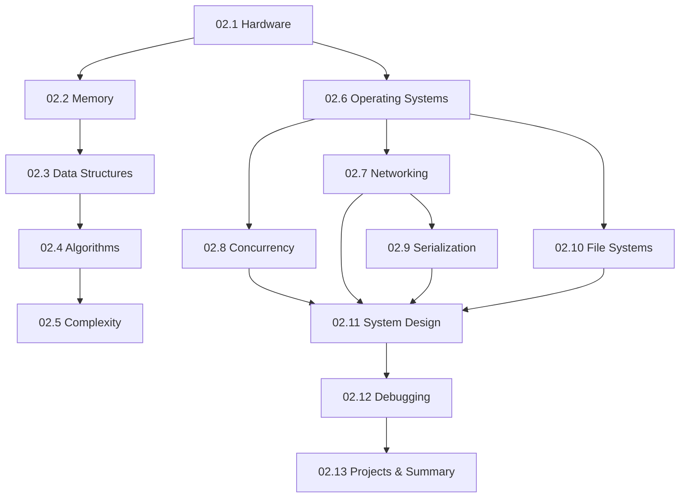

# Module 02 · Computer Science Foundations — Lessons

[⬅ Module home](../README.md) · [🗺 Roadmap](../../../ROADMAP.md) · [📚 Curriculum](../../../CURRICULUM.md)

> This is the map of Module 02. You're a software developer; this module gives you the **computer-science foundations that directly shape how AI systems train, infer, and scale** — from CPU caches to distributed serving. No prior CS degree assumed; taught from first principles at professional depth.

---

## Who this module is for

You can write good Python ([Module 01](../../01-Advanced-Python/README.md)) but may never have formally studied CS. This module fills that gap — not academically, but *practically*: every concept is tied to why it matters for models, data pipelines, and production AI.

> [!IMPORTANT]
> Module 01 taught you *how to write Python well*. Module 02 teaches you *what's actually happening underneath and across the network* — the knowledge that separates someone who can call a model API from someone who can design, scale, and debug a production AI system.

---

## Lessons

| # | Lesson | Section |
|---|---|---|
| 02.1 | [How Computers Actually Work](02.1-how-computers-work.md) | §1 CPU, cache, RAM, instruction cycle, compilers |
| 02.2 | [Memory](02.2-memory.md) | §2 stack/heap, allocation, fragmentation, GC, cache locality |
| 02.3 | [Data Structures](02.3-data-structures.md) | §3 arrays → graphs, with complexity & AI uses |
| 02.4 | [Algorithms](02.4-algorithms.md) | §4 searching, sorting, DP, greedy, graphs, backtracking |
| 02.5 | [Time & Space Complexity](02.5-complexity.md) | §5 Big-O/Ω/Θ analyzed on Python |
| 02.6 | [Operating Systems](02.6-operating-systems.md) | §6 processes, threads, scheduling, virtual memory, filesystems |
| 02.7 | [Networking](02.7-networking.md) | §7 TCP/IP, HTTP(S), REST, WebSockets, gRPC, proxies |
| 02.8 | [Concurrency](02.8-concurrency.md) | §8 threading, multiprocessing, async, locks, races, the GIL |
| 02.9 | [Serialization](02.9-serialization.md) | §9 JSON, YAML, Pickle, MessagePack, Protobuf |
| 02.10 | [File Systems](02.10-file-systems.md) | §10 files, permissions, symlinks, compression, binary vs text |
| 02.11 | [System Design Basics](02.11-system-design-basics.md) | §11 scalability, availability, fault tolerance, caching |
| 02.12 | [Debugging](02.12-debugging.md) | §12 stack traces, profiling, logging, monitoring |
| 02.13 | [Mini Projects & Summary](02.13-projects-summary.md) | Seven projects + module consolidation |

### Companion artifacts
- 🏋️ [Exercises](../exercises/) — conceptual, coding, debugging, and architecture tasks
- 🧠 [Flashcards](../flashcards/deck.md) — spaced-repetition deck
- 📝 [Quiz](../quizzes/quiz-01.md) — self-assessment with answers
- 📄 [Cheat sheet](../cheat-sheets/cs-foundations-cheatsheet.md) — one-page reference

---

## How the lessons connect

**Estimated time:** ~16 hours reading · ~4 hours projects · ~4 hours review (per the [Roadmap](../../../ROADMAP.md)).

> [!TIP]
> This module is a **long-term reference**. You won't memorize it all on the first pass — and you don't need to. Read it once for the mental models, build a couple of projects, then return to specific lessons when a real problem (a slow pipeline, an OOM error, a networking bug) sends you back for depth.
