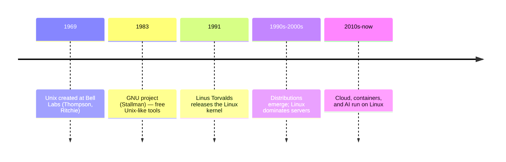
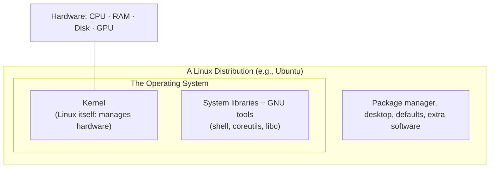
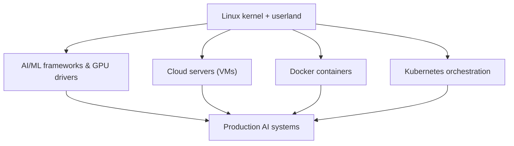

<!-- Module 03 · Lesson 1 — follows ../../../standards/. -->

# 03.1 · Introduction to Linux

[⬅ Module index](README.md) · [🏠 Module](../README.md) · [🗺 Roadmap](../../../ROADMAP.md) · [Next ➡](03.2-architecture.md)

> Linux runs the AI world — nearly every GPU server, cloud instance, container, and Kubernetes node. This lesson explains what Linux *is*, the crucial kernel-vs-OS distinction, and *why* AI infrastructure is built on it, so the rest of the module rests on solid ground.

| | |
|---|---|
| **Module** | `03 · Linux for AI Engineers` |
| **Lesson** | `03.1` |
| **Difficulty** | ⭐⭐ |
| **Estimated study time** | 45 min read |
| **Status** | 🟢 stable |

---

## 1. Learning Objectives

By the end of this lesson you will be able to:

- [ ] Explain what **Linux** is and its brief history.
- [ ] Distinguish the **kernel** from the **operating system** and a **distribution**.
- [ ] Name major **distributions** and when each is used.
- [ ] Explain **why AI, cloud, Docker, and Kubernetes all rely on Linux**.

## 2. Prerequisites

- [Module 02.6 · Operating Systems](../../02-Computer-Science/weeks/02.6-operating-systems.md) — processes, virtual memory, filesystems (the concepts Linux implements).

---

## 3. Why This Topic Exists

You could learn Linux commands without knowing what Linux *is* — and you'd hit a ceiling fast, unable to reason about why things work or fail. More importantly, understanding *why the entire AI industry runs on Linux* is motivating and orienting: this isn't an arbitrary skill, it's the ground every production AI system stands on.

When you train a model, it's almost certainly on a Linux GPU server. When you deploy, it's in a Linux container on a Linux cloud VM. When you debug production, you SSH into Linux. This lesson establishes *why*, so the skills you build across the module have a clear purpose.

> [!IMPORTANT]
> **Linux fluency is non-negotiable for AI Engineering.** You can prototype on any OS, but you *deploy, scale, and debug* on Linux. An AI Engineer who can't work in a Linux terminal is like a pilot who can't fly in bad weather — fine until it matters most. This module removes that limitation.

## 4. What Is Linux?

**Linux** is a free, open-source, Unix-like **operating system kernel** — and, by common usage, the family of complete operating systems built around it. It manages hardware (CPU, memory, disk, GPU) and provides services to programs, exactly as [Module 02.6](../../02-Computer-Science/weeks/02.6-operating-systems.md) described an OS doing.

| Trait | Meaning for you |
|---|---|
| **Open source** | Source is public; anyone can inspect/modify/redistribute it |
| **Free** | No license cost — a major reason cloud/AI economics favor it |
| **Unix-like** | Follows Unix design (files, processes, permissions, the shell) |
| **Multi-user, multitasking** | Many users and processes share one machine safely |
| **Everywhere** | Servers, cloud, phones (Android), embedded, supercomputers |

### A brief history



- **Unix** (1969) established the design philosophy: small composable tools, everything-is-a-file, the shell.
- The **GNU** project built free Unix-compatible tools but lacked a kernel.
- **Linus Torvalds** wrote the **Linux kernel** in 1991; combined with GNU tools it became a complete free OS (hence "GNU/Linux").
- Its openness and reliability made it the default for servers, then cloud, then AI.

> [!NOTE]
> The **Unix philosophy** — "make each program do one thing well; write programs that work together; use text streams as a universal interface" — directly shapes how you'll work in Module 03. The power of piping small commands together ([03.4](03.4-terminal-mastery.md)) is this philosophy in action, and it's why the terminal is so productive.

---

## 5. Kernel vs Operating System vs Distribution

This distinction confuses everyone at first; getting it right clarifies a lot.



| Term | What it is | Example |
|---|---|---|
| **Kernel** | The core that talks to hardware and manages processes/memory/IO | Linux |
| **Operating system** | Kernel + system libraries + core tools (shell, utilities) | GNU/Linux |
| **Distribution ("distro")** | A complete, packaged OS: kernel + tools + package manager + defaults | Ubuntu, Debian, Fedora |

> [!IMPORTANT]
> The **kernel** is the part that actually *is* "Linux" — it's the same core across all distros. A **distribution** bundles that kernel with a package manager, default tools, and configuration to make a usable system. So "Ubuntu" and "Fedora" both *are* Linux (same kernel family) but differ in packaging, defaults, and tooling. You'll learn the kernel/user-space split deeply in [03.2](03.2-architecture.md).

---

## 6. Linux Distributions

Distributions differ in package manager, release cadence, defaults, and target audience. As an AI Engineer you'll mostly meet a handful.

| Distro family | Package manager | Known for | AI relevance |
|---|---|---|---|
| **Ubuntu** (Debian-based) | `apt` | Easy, huge community, LTS stability | **The default for AI/ML** — most tutorials, GPU drivers, cloud images |
| **Debian** | `apt` | Rock-solid, minimal | Base for Ubuntu; servers |
| **Fedora / RHEL / CentOS** | `dnf`/`yum` | Enterprise, cutting-edge (Fedora) | Enterprise AI infra |
| **Amazon Linux** | `dnf`/`yum` | AWS-optimized | AWS deployments |
| **Alpine** | `apk` | Tiny (~5 MB) | Small Docker images |
| **Arch** | `pacman` | Bleeding edge, DIY | Enthusiasts (not typical for prod) |

> [!TIP]
> **Learn Ubuntu first.** It's the de facto standard for AI/ML: NVIDIA GPU drivers target it, most tutorials assume it, and major clouds offer optimized Ubuntu images. The skills transfer to other distros — the main differences are the package manager (`apt` vs `dnf`) and some file locations. This module uses Ubuntu/Debian conventions with notes where others differ.

> [!NOTE]
> **Alpine** matters specifically for **Docker**: its tiny size makes container images small (faster to build, push, and pull, [Module 16](../../16-MLOps/README.md)). It uses `musl` libc instead of `glibc`, which occasionally causes compatibility issues with ML wheels — a real gotcha you'll meet when containerizing AI apps.

---

## 7. Why AI Infrastructure Runs on Linux

Four pillars of modern AI infrastructure — the AI stack itself, cloud, Docker, and Kubernetes — all depend on Linux. Here's why.



### Why the AI/ML ecosystem uses Linux

| Reason | Detail |
|---|---|
| **GPU support** | NVIDIA's CUDA and drivers are best-supported and first-released on Linux |
| **Frameworks target it** | PyTorch/TensorFlow are developed and tested primarily on Linux |
| **Free & scalable** | No per-server license cost — critical when running fleets of machines |
| **Control & scriptability** | Full command-line control enables automation ([03.12](03.12-bash-scripting.md)) |
| **Performance** | Lean, tunable, no mandatory GUI overhead |
| **Stability** | Runs for months/years without reboot — vital for long training |

### Why cloud servers use Linux

Cloud providers (AWS, GCP, Azure) run overwhelmingly on Linux because it's free (no per-VM license), lightweight (more VMs per host), scriptable (infrastructure-as-code), and secure/stable. The overwhelming majority of cloud compute — and essentially all GPU instances for AI — runs Linux. You'll provision and manage these in [Module 17 · Cloud](../../17-Cloud/README.md).

### Why Docker is based on Linux

**Docker containers are a Linux technology.** They're built directly on Linux kernel features — **namespaces** (isolation) and **cgroups** (resource limits) — the exact concepts from [Module 02.6](../../02-Computer-Science/weeks/02.6-operating-systems.md) that you'll study hands-on in [03.16](03.16-docker-preparation.md). A container is essentially an isolated Linux process. (Docker on Mac/Windows actually runs a hidden Linux VM to provide these features.)

### Why Kubernetes depends on Linux

**Kubernetes** orchestrates containers at scale — and since containers are Linux, so is Kubernetes. It schedules Linux containers across fleets of Linux nodes, using Linux networking and storage. Serving AI models at scale ([Module 16](../../16-MLOps/README.md)/[18](../../18-System-Design/README.md)) means Kubernetes, which means Linux all the way down.

> [!IMPORTANT]
> Notice the through-line: **AI → cloud → Docker → Kubernetes are all Linux, and each builds on the one before.** Learning Linux isn't learning one tool — it's learning the *substrate* of the entire production AI stack. Every later infrastructure module ([16 MLOps](../../16-MLOps/README.md), [17 Cloud](../../17-Cloud/README.md), [18 System Design](../../18-System-Design/README.md)) assumes the Linux fluency you build here.

---

## 8. Getting Access to Linux (Practical)

You need a real Linux system to practice. Options:

| Option | Best for | Notes |
|---|---|---|
| **WSL2** (Windows Subsystem for Linux) | Windows users learning | Real Linux kernel inside Windows; excellent for practice |
| **Cloud VM** (AWS/GCP/Azure free tier) | Realistic server experience | Practice SSH, deployment ([03.9](03.9-networking.md)) |
| **Docker container** | Quick, disposable | `docker run -it ubuntu bash` |
| **Virtual machine** (VirtualBox) | Full local Linux | Heavier |
| **Native install / dual-boot** | Full commitment | Overkill for learning |
| **macOS terminal** | Partial | Unix-like but *not* Linux (BSD tools differ subtly) |

> [!TIP]
> On **Windows**, install **WSL2** (`wsl --install`) — it gives you a genuine Ubuntu environment integrated with Windows, ideal for this module. On **macOS**, the terminal is Unix-like but uses BSD versions of tools (some flags differ from Linux/GNU); for authentic practice, use a Linux container or cloud VM. Whatever you choose, **have a terminal open and type every command** as you read.

---

## 9. Common Mistakes & Misconceptions

| Mistake / myth | Reality |
|---|---|
| "Linux and Unix are the same" | Linux is Unix-*like*; Unix is the older family it descends from |
| "The distro is the OS" | The kernel is the core; the distro packages an OS around it |
| "macOS terminal = Linux" | macOS is Unix-like (BSD); many tool flags differ from GNU/Linux |
| "I'll just use a GUI" | Servers have no GUI; production Linux is terminal-only |
| "Linux is only for experts" | It's the everyday environment of every AI Engineer |
| "Any distro is fine to learn" | True eventually, but learn Ubuntu first for AI |

> [!WARNING]
> A subtle trap: practicing on **macOS** and assuming it's identical to Linux. macOS uses **BSD** userland tools (`sed`, `ls`, etc.) whose flags differ from the **GNU** versions on Linux servers. Scripts that work on your Mac can fail on a Linux server. For this module, prefer a real Linux environment (WSL2, container, or VM) to build accurate muscle memory.

---

## 10. Production Relevance

| Scenario | Why this lesson matters |
|---|---|
| Training on a GPU server | It's a Linux box you'll operate via SSH |
| Deploying a model | Into a Linux container on a Linux VM |
| Debugging an outage | SSH into Linux, read logs, inspect processes |
| Building a Docker image | Choosing a base distro (Ubuntu vs Alpine) |
| Orchestrating at scale | Kubernetes on Linux nodes |

## 11. Security Considerations

| Topic | Note |
|---|---|
| Open source ≠ insecure | Public scrutiny tends to *improve* security; it's the backbone of secure infra |
| Multi-user model | Linux's user/permission model (from Unix) is a core security feature ([03.6](03.6-permissions.md)) |
| Keeping it updated | Distros ship security patches; unpatched servers are a top risk ([03.15](03.15-security.md)) |
| Minimal images | Smaller distros (Alpine) = smaller attack surface for containers |

## 12. Interview Questions

**Beginner**
1. What is the difference between the Linux kernel, the operating system, and a distribution?
2. Why does AI infrastructure predominantly use Linux?

**Intermediate**
1. Why are Docker and Kubernetes fundamentally Linux technologies?
2. Which distribution would you choose for an AI GPU server, and why?

**Advanced**
1. Explain the Unix philosophy and how it shapes effective command-line work.
2. What compatibility issues might arise using Alpine Linux for an ML Docker image?

**System-design prompt**
- You're setting up infrastructure to train and serve AI models. Justify the OS choice at each layer (training server, container base image, cloud VMs, orchestration). — *Follow-ups:* Where does distro choice matter? What are the cost and GPU-support implications?

## 13. Summary

| Key idea | Takeaway |
|---|---|
| Linux = kernel + ecosystem | Open-source, Unix-like OS core |
| Kernel vs OS vs distro | Kernel is the core; distro packages a full OS |
| Ubuntu for AI | The de facto standard; learn it first |
| Linux runs AI | GPU support, free, scriptable, stable |
| The stack is Linux | AI → cloud → Docker → Kubernetes all rest on it |

## 14. Cheat Sheet

```text
LINUX = open-source, Unix-LIKE OS kernel (+ ecosystem) · multi-user, multitasking
KERNEL (the core, talks to hardware) ⊂ OS (kernel + libs + tools) ⊂ DISTRO (packaged full OS)
DISTROS: Ubuntu/Debian(apt) ← AI DEFAULT · Fedora/RHEL(dnf/yum) · Alpine(apk, tiny=Docker) · Arch(pacman)
WHY AI: GPU/CUDA support · frameworks target it · free · scriptable · stable · fast
THE STACK IS LINUX: AI frameworks → cloud VMs → Docker(namespaces+cgroups) → Kubernetes
UNIX PHILOSOPHY: small tools, one job each, composed via text streams (pipes)
PRACTICE: WSL2(Windows) · cloud VM · docker run -it ubuntu bash  (macOS = BSD ≠ GNU/Linux!)
```

## 15. Flashcards

- **Q:** Kernel vs OS vs distribution? — **A:** Kernel = the core managing hardware (Linux); OS = kernel + system libraries + tools; distribution = a complete packaged OS (Ubuntu, Fedora) with a package manager and defaults.
- **Q:** Why does AI infrastructure use Linux? — **A:** Best GPU/CUDA support, frameworks target it, free (no license cost at scale), fully scriptable, and stable for long-running jobs.
- **Q:** Why are Docker and Kubernetes Linux technologies? — **A:** Containers are built on Linux kernel features (namespaces + cgroups); Kubernetes orchestrates Linux containers across Linux nodes.
- **Q:** Which distro should an AI Engineer learn first, and why? — **A:** Ubuntu — the de facto AI/ML standard with the best GPU-driver support, tutorials, and cloud images.
- **Q:** What's the Unix philosophy? — **A:** Make each program do one thing well and compose them via text streams — the basis of piping small commands together.

## 16. Hands-on Exercises

> Full set in [`../exercises/`](../exercises/).

- [ ] **(⭐ Setup)** Get a real Linux environment (WSL2, a container, or a cloud VM) and open a terminal.
- [ ] **(⭐ Explore)** Run `uname -a`, `cat /etc/os-release`, `hostnamectl` — identify your kernel version and distribution.
- [ ] **(⭐⭐ Conceptual)** Write a paragraph explaining to a teammate why your AI deployment target is Linux, covering GPU, cost, and containers.
- [ ] **(⭐⭐ Compare)** List which package manager and typical use case applies to Ubuntu, Fedora, and Alpine.

## 17. Mini Project

> **Environment reconnaissance report.** On your Linux environment, write a short script/notes that gathers and explains: the kernel version (`uname -r`), distribution (`/etc/os-release`), CPU/memory (`lscpu`, `free -h`), and (if present) GPU (`nvidia-smi`). Produce a one-page "what am I running on?" report — the exact first thing you'd do after SSHing into an unfamiliar AI server ([03.17](03.17-workflow-projects-summary.md)).

## 18. References

- *The Linux Command Line* by William Shotts (free online) — the canonical, beginner-friendly reference ([reference standards](../../../standards/reference-standards.md)).
- Torvalds & Diamond, *Just for Fun* — the story of Linux's creation.
- Official Ubuntu Server documentation.

## 19. What's Next

You know *what* Linux is and *why* AI runs on it. Next we open the hood: **Linux architecture** — the kernel, user space, shell, and system calls — and trace how a command travels through the OS to the hardware.

➡️ **Next:** [03.2 · Linux Architecture](03.2-architecture.md)

---

### 🔁 Revision checklist
- [ ] I can distinguish kernel, OS, and distribution
- [ ] I can explain why AI/cloud/Docker/Kubernetes use Linux
- [ ] I have a working Linux environment with a terminal open
- [ ] I identified my kernel version and distribution

### 🔗 Spaced-repetition callback
> Recall [Module 02.6's containers-as-processes](../../02-Computer-Science/weeks/02.6-operating-systems.md): "Docker is Linux namespaces + cgroups" is the concept you met there, now revealed as *the reason* the whole AI stack is Linux. Module 02 gave you the OS concepts; Module 03 is where you operate the OS that implements them.
