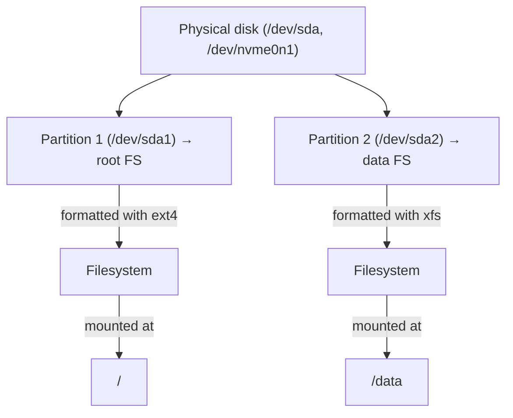
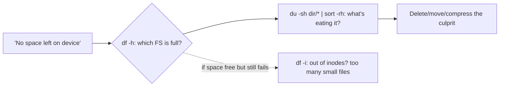
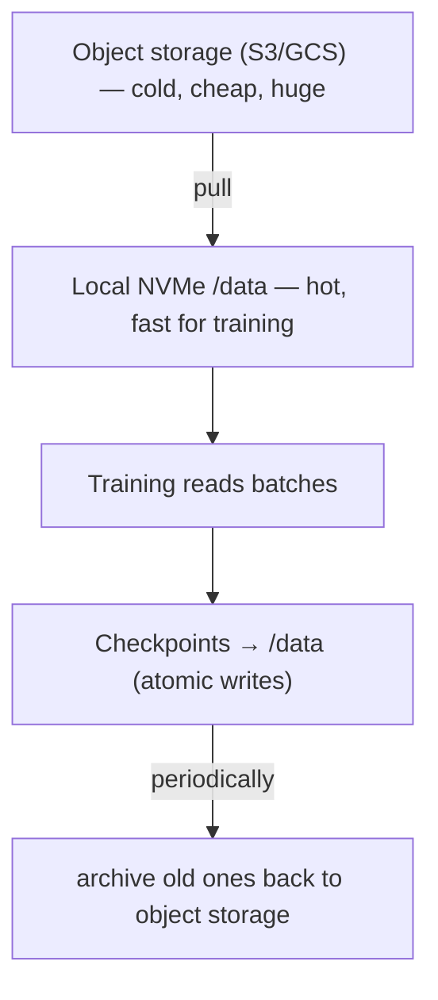

<!-- Module 03 · Lesson 10 — follows ../../../standards/. -->

# 03.10 · Storage

[⬅ 03.9 Networking](03.9-networking.md) · [🏠 Module](../README.md) · [🗺 Roadmap](../../../ROADMAP.md) · [Next ➡](03.11-logs.md)

> Datasets and model checkpoints consume real disk, and "disk full" is one of the most common ways an AI server breaks. This lesson covers partitions, filesystems (ext4/xfs), mounting, and the disk-usage tools you'll use to store, find, and manage AI data on Linux.

| | |
|---|---|
| **Module** | `03 · Linux for AI Engineers` |
| **Lesson** | `03.10` |
| **Difficulty** | ⭐⭐ |
| **Estimated study time** | 45 min read |
| **Status** | 🟢 stable |

---

## 1. Learning Objectives

By the end of this lesson you will be able to:

- [ ] Explain **partitions, filesystems,** and **mounting** on Linux.
- [ ] Compare **ext4** and **xfs** at a practical level.
- [ ] Inspect storage with **`df`, `du`, `lsblk`** (and `fdisk`).
- [ ] Diagnose and prevent "disk full" incidents.
- [ ] Organize **AI datasets and models** on appropriate storage.

## 2. Prerequisites

- [03.3 Filesystem](03.3-filesystem.md) (mounts, inodes) and [Module 02.10 · File Systems](../../02-Computer-Science/weeks/02.10-file-systems.md).

---

## 3. Why This Topic Exists

AI is data-heavy: datasets are gigabytes to terabytes, checkpoints pile up, logs grow. Storage is a *finite, shared* resource, and running out of it is catastrophic — training crashes mid-write, services fail, and a full root partition (`/`) can make a server unbootable ([03.3](03.3-filesystem.md)). Knowing how storage is organized lets you put big data on the right volume, find what's eating space, and avoid the "disk full" 3 a.m. page.

> [!IMPORTANT]
> **"No space left on device" is one of the top causes of AI-server failure.** Datasets, checkpoints written every epoch, and unrotated logs silently fill disks. This lesson gives you the tools (`df`, `du`) to *see* usage and the design knowledge (separate volumes) to *prevent* the failure. Monitoring disk is not optional — it's routine hygiene.

## 4. Mental Model: Disks → Partitions → Filesystems → Mounts



| Layer | What it is |
|---|---|
| **Disk / block device** | Physical storage (`/dev/sda`, `/dev/nvme0n1`) — a "file" in `/dev` ([03.3](03.3-filesystem.md)) |
| **Partition** | A slice of a disk (`/dev/sda1`) |
| **Filesystem** | Structure formatted onto a partition (ext4, xfs) that organizes files ([03.3](03.3-filesystem.md) inodes) |
| **Mount point** | The directory where a filesystem is attached into the tree ([03.3](03.3-filesystem.md)) |

Recall from [03.3](03.3-filesystem.md): Linux has **one tree**; each partition/filesystem is *mounted* into a directory. There are no drive letters — a second disk shows up as, say, `/data` after mounting.

---

## 5. Filesystems: ext4 vs xfs

A **filesystem** determines how files are stored, tracked, and recovered. Two dominate Linux servers:

| | ext4 | xfs |
|---|---|---|
| Default on | Ubuntu/Debian | RHEL/Fedora, many big-data setups |
| Maturity | Rock-solid, universal | Mature, high-performance |
| Strengths | Reliable, good general use | Excellent for **large files & parallel I/O** |
| Journaling | ✅ (crash recovery) | ✅ |
| For AI | Fine default | Often preferred for large datasets/high throughput |

> [!NOTE]
> Both are **journaling** filesystems — they log pending changes so a crash mid-write can be recovered without corruption (related to the atomic-write idea from [Module 02.10](../../02-Computer-Science/weeks/02.10-file-systems.md)). For most AI work the default (**ext4** on Ubuntu) is perfectly fine; **xfs** shines for very large files and heavy parallel I/O (some data-lake/HPC setups use it). You rarely *choose* the filesystem yourself — cloud images and admins do — but know the names and that both handle large AI files well.

---

## 6. Inspecting Storage: `df`, `du`, `lsblk`

The three commands you'll actually use daily:

| Command | Answers |
|---|---|
| `df -h` | How full is each **mounted filesystem**? (disk **f**ree) |
| `df -i` | Are we out of **inodes**? ([03.3](03.3-filesystem.md)) |
| `du -sh <dir>` | How big is this **directory**? (disk **u**sage) |
| `lsblk` | What disks/partitions/mounts exist? (block devices) |
| `fdisk -l` | Detailed partition table (needs sudo) |

```bash
df -h                          # free space per filesystem (the first thing to check!)
du -sh /data/*                 # size of each item in /data (find space hogs)
du -sh /data/* | sort -rh | head   # biggest directories, ranked
lsblk                          # tree of disks → partitions → mount points
df -i                          # inode usage ("disk full" with free space? check here)
```



> [!IMPORTANT]
> **The disk-full debugging drill: `df -h` then `du`.** `df -h` tells you *which* filesystem is full (is it `/`? `/data`?). Then `du -sh /path/* | sort -rh | head` on that filesystem finds the space hog (usually old checkpoints, datasets, or logs). Remember the [03.3](03.3-filesystem.md) trap: if `df -h` shows free space but writes still fail, you're out of **inodes** (`df -i`) — too many tiny files. This drill resolves nearly every storage incident.

> [!TIP]
> `df` measures **filesystems** (mounted volumes); `du` measures **directories/files**. They can disagree usefully: a large deleted file still held open by a process shows in `df` (space used) but not `du` (file gone from the tree) — a classic "df says full but du says empty" puzzle, solved by finding and restarting the process holding the deleted file (`lsof | grep deleted`).

---

## 7. Mounting and `/etc/fstab`

**Mounting** attaches a filesystem into the tree at a directory ([03.3](03.3-filesystem.md)). Cloud VMs often come with an extra data disk you must mount.

```bash
lsblk                          # see the unmounted disk (e.g., /dev/nvme1n1)
sudo mkdir -p /data            # create the mount point
sudo mount /dev/nvme1n1 /data  # mount it there (temporary — lost on reboot)
df -h /data                    # confirm
```

To make a mount **persistent across reboots**, add it to `/etc/fstab`:

```text
# /etc/fstab — device, mount point, filesystem, options, dump, pass
UUID=abc-123   /data   ext4   defaults   0   2
```

> [!IMPORTANT]
> A manual `mount` is **temporary** — it vanishes on reboot. For a data volume that must always be there (where your datasets/models live), add it to **`/etc/fstab`** so it mounts automatically at boot. Use the disk's **UUID** (from `blkid`), not `/dev/sdX`, because device names can change between boots — a subtle cause of "my data disappeared after reboot." A common cloud-AI setup step: attach a large SSD, format it, mount at `/data`, and persist in `fstab`.

> [!WARNING]
> A broken `/etc/fstab` entry can prevent the server from booting (systemd waits on the mount). Test changes carefully (`mount -a` applies fstab without rebooting and surfaces errors). This is a real way to lock yourself out of a cloud instance.

---

## 8. Storage for AI Datasets and Models

Applying [Module 02.10's](../../02-Computer-Science/weeks/02.10-file-systems.md) storage lessons to a real Linux server:

| Data | Where / how |
|---|---|
| Large datasets | Dedicated **data volume** (`/data`), not `/` or `/home` ([03.3](03.3-filesystem.md)) |
| Model checkpoints | Data volume; write **atomically** (temp + rename, [Module 02.10](../../02-Computer-Science/weeks/02.10-file-systems.md)) |
| Format | Sequential/columnar (Parquet, sharded archives) for fast reads ([Module 02.10](../../02-Computer-Science/weeks/02.10-file-systems.md)) |
| Hot data | Fast storage (local NVMe) for training I/O |
| Cold/large data | Object storage (S3/GCS), pulled as needed ([Module 17](../../17-Cloud/README.md)) |
| Old checkpoints/logs | Rotate/delete/compress to reclaim space |



> [!IMPORTANT]
> **Keep big, growing AI data off the root partition (`/`).** Datasets and checkpoints belong on a separate mounted volume (`/data`). If they fill `/`, the whole system destabilizes ([03.3](03.3-filesystem.md)). The professional pattern: cold data lives in cheap object storage, is pulled to fast local NVMe for a training run, checkpoints are written atomically to the data volume, and old checkpoints are archived back to object storage to reclaim space. This keeps fast storage lean and `/` safe.

---

## 9. Common Mistakes & Debugging

| Mistake | Consequence | Fix |
|---|---|---|
| Data on `/` fills root | System instability/unbootable | Separate `/data` volume |
| Manual mount not in fstab | Gone after reboot | Add to `/etc/fstab` (by UUID) |
| Ignoring disk usage | Surprise "disk full" crash | `df -h` monitoring ([03.14](03.14-performance-monitoring.md)) |
| Old checkpoints never cleaned | Slow disk exhaustion | Rotate/prune old artifacts |
| "df full, du empty" | Deleted file held open | Restart the holding process |
| `df -h` fine but writes fail | Out of inodes | `df -i`; fewer files |
| Broken fstab entry | Won't boot | `mount -a` to test before reboot |

## 10. Performance Considerations

| Principle | Takeaway |
|---|---|
| NVMe > SSD > HDD > network | Put hot training data on fastest storage ([Module 02.1](../../02-Computer-Science/weeks/02.1-how-computers-work.md)) |
| Sequential > random I/O | Packed formats beat millions of small files ([Module 02.10](../../02-Computer-Science/weeks/02.10-file-systems.md)) |
| Local > remote for hot data | Copy to local NVMe before heavy training |
| I/O bottlenecks | `D`-state processes ([03.7](03.7-processes.md)); `iostat` ([03.14](03.14-performance-monitoring.md)) |

## 11. Security Considerations

| Risk | Guidance |
|---|---|
| Sensitive data at rest | Encrypt volumes if required; control mount permissions ([03.6](03.6-permissions.md)) |
| Shared volumes | Permissions on mount points; don't world-expose data |
| Disk-full as DoS | Unbounded logs/uploads can fill disk — cap and rotate ([03.11](03.11-logs.md)) |
| Leftover data on decommissioned disks | Securely wipe cloud volumes before release |

> [!CAUTION]
> A **disk-full condition is a denial-of-service** vector and a reliability risk: an attacker (or a runaway log) that fills the disk can crash services and block writes. Bound anything that grows (logs → rotation [03.11](03.11-logs.md); uploads → size limits), monitor with `df` ([03.14](03.14-performance-monitoring.md)), and keep growth off `/`.

## 12. Interview Questions

**Beginner**
1. What's the difference between a partition, a filesystem, and a mount point?
2. What do `df` and `du` each tell you?

**Intermediate**
1. Walk through debugging "no space left on device."
2. Why keep datasets on a separate volume from `/`? How do you make it persist across reboots?

**Advanced**
1. `df` shows a disk is full but `du` on that path shows little usage. What's happening?
2. Design storage for a training pipeline: cold data, hot data, and checkpoints.

**System-design prompt**
- Design the storage layout for a GPU training server processing a 2 TB dataset. — *Follow-ups:* Which volume/filesystem for what? How do you avoid filling `/`? Where do checkpoints go and how are they written safely? How do you monitor disk?

## 13. Summary

| Key idea | Takeaway |
|---|---|
| Disk → partition → filesystem → mount | Storage is layered into the one tree |
| ext4 vs xfs | Both journaling; ext4 default, xfs for big/parallel I/O |
| `df`/`du`/`lsblk` | Check free space, dir sizes, block devices |
| Disk-full drill | `df -h` → `du | sort -rh`; check `df -i` for inodes |
| fstab | Persist mounts by UUID |
| AI storage | Big data on `/data`, off `/`; atomic checkpoints; tiered storage |

## 14. Cheat Sheet

```text
LAYERS: disk(/dev/sda,/dev/nvme0n1) → partition(/dev/sda1) → filesystem(ext4/xfs) → MOUNT(dir in the tree)
FILESYSTEMS: ext4(Ubuntu default, solid) · xfs(RHEL, great for big files/parallel I/O) — both journaling
INSPECT: df -h(free per FS — CHECK FIRST) · du -sh dir/* | sort -rh | head(space hogs) · lsblk(devices tree) · fdisk -l
DISK-FULL DRILL: df -h (which FS?) → du -sh /path/* | sort -rh (what?) → delete/move/compress
  free space but writes fail → df -i (out of INODES, too many small files)
  df full but du empty → deleted file held open (lsof | grep deleted → restart process)
MOUNT: sudo mount /dev/nvme1n1 /data (temporary!) → persist in /etc/fstab by UUID (mount -a to test)
AI STORAGE: datasets/checkpoints on /data (NOT /) · atomic checkpoint writes · sequential formats
  tiered: object storage(cold) → local NVMe(hot) → checkpoints → archive old back
PERF: NVMe>SSD>HDD>network · sequential>random · hot data local
```

## 15. Flashcards

- **Q:** `df` vs `du`? — **A:** `df` shows free space per mounted filesystem; `du` shows the size of directories/files. Check `df -h` first, then `du` to find the hog.
- **Q:** The disk-full debugging drill? — **A:** `df -h` to find the full filesystem, then `du -sh /path/* | sort -rh | head` to find what's using it; if free space but writes fail, `df -i` (out of inodes).
- **Q:** Why keep datasets off `/`? — **A:** Filling the root partition destabilizes or breaks the whole system; put big/growing data on a separate mounted volume (`/data`).
- **Q:** How do you make a mount persist across reboots? — **A:** Add it to `/etc/fstab` (by UUID, not `/dev/sdX`, since device names can change).
- **Q:** ext4 vs xfs? — **A:** Both are journaling filesystems; ext4 is the solid Ubuntu default, xfs excels at very large files and parallel I/O.
- **Q:** `df` says full but `du` says empty — cause? — **A:** A deleted file is still held open by a running process, so its space isn't freed; find and restart that process.

## 16. Hands-on Exercises

> Full set in [`../exercises/`](../exercises/).

- [ ] **(⭐ Inspect)** Run `df -h`, `lsblk`, and `du -sh` on a few directories; identify the largest.
- [ ] **(⭐⭐ Drill)** Simulate finding a space hog: fill a directory, use `du | sort -rh` to locate it, clean it up.
- [ ] **(⭐⭐ Inodes)** Create many tiny files; compare `df -h` vs `df -i` to see inode pressure.
- [ ] **(⭐⭐⭐ Mount)** (In a VM) attach/format a virtual disk, mount it, add it to `/etc/fstab` by UUID, and verify with `mount -a`.

## 17. Mini Project

> **Disk-usage watchdog (extends the [03.7](03.7-processes.md) health checker).** Add storage monitoring to your server health checker: report per-filesystem usage (`df -h`), flag any filesystem above a threshold (e.g., 85%), list the top-5 largest directories under a data path (`du`), and warn on inode pressure (`df -i`). Optionally alert (print/log) when disk is low. This is exactly the check that prevents "disk full" incidents.

## 18. References

- *The Linux Command Line* (Shotts) — storage/filesystem chapters ([reference standards](../../../standards/reference-standards.md)).
- `man df`, `man du`, `man lsblk`, `man fstab`, `man mount`.
- [Module 02.10 · File Systems](../../02-Computer-Science/weeks/02.10-file-systems.md) — storage concepts.

## 19. What's Next

Storage holds your data; logs hold the story of what your systems *did*. Next: **logs** — syslog, journald/`journalctl`, rotation, and using logs to debug production failures.

➡️ **Next:** [03.11 · Logs](03.11-logs.md)

---

### 🔁 Revision checklist
- [ ] I understand disk → partition → filesystem → mount
- [ ] I run the `df -h` → `du` disk-full drill
- [ ] I can persist a mount via `/etc/fstab`
- [ ] I keep AI data off `/` on a dedicated volume

### 🔗 Spaced-repetition callback
> Recall [03.3's mounts/inodes](03.3-filesystem.md) and [Module 02.10's tiered storage & atomic writes](../../02-Computer-Science/weeks/02.10-file-systems.md): this lesson is the Linux operations layer — `df`/`du`/`fstab` are how you *manage* the storage those lessons *conceptualized*. And "disk full" is [Module 02.11's](../../02-Computer-Science/weeks/02.11-system-design-basics.md) reliability failure, live.
