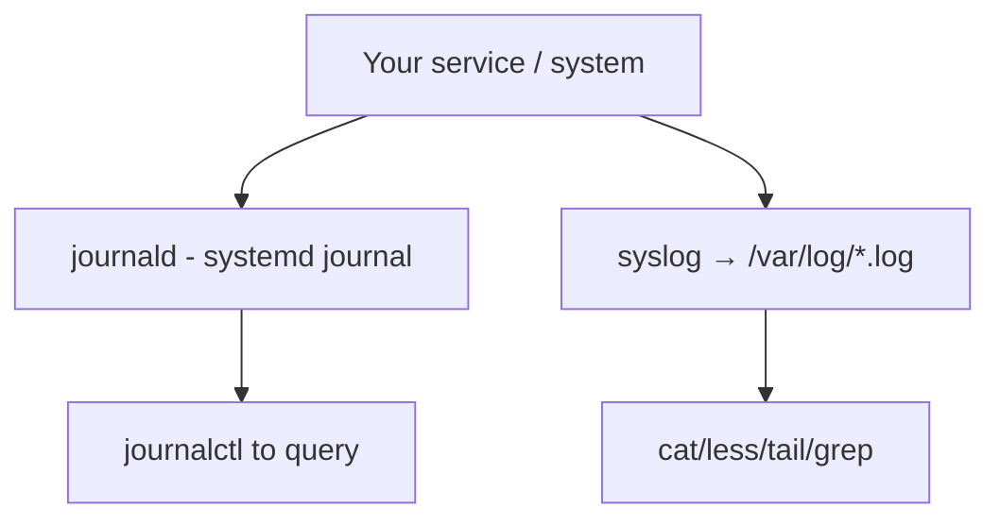
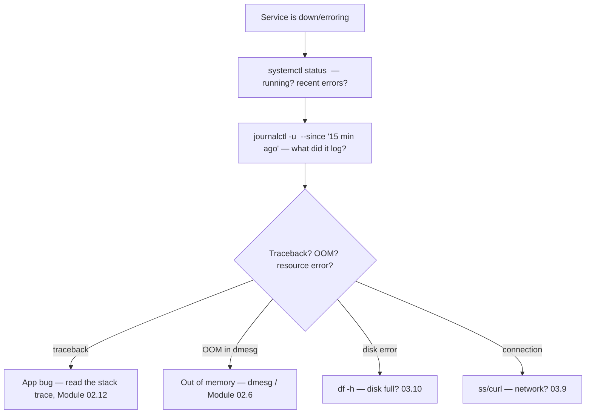

<!-- Module 03 · Lesson 11 — follows ../../../standards/. -->

# 03.11 · Logs

[⬅ 03.10 Storage](03.10-storage.md) · [🏠 Module](../README.md) · [🗺 Roadmap](../../../ROADMAP.md) · [Next ➡](03.12-bash-scripting.md)

> When a production AI service fails, logs are your only witness. This lesson covers where Linux logs live (syslog, journald), how to read and follow them (`journalctl`), how rotation keeps them from filling your disk, and how to use logs to debug real production failures.

| | |
|---|---|
| **Module** | `03 · Linux for AI Engineers` |
| **Lesson** | `03.11` |
| **Difficulty** | ⭐⭐ |
| **Estimated study time** | 45 min read |
| **Status** | 🟢 stable |

---

## 1. Learning Objectives

By the end of this lesson you will be able to:

- [ ] Explain where Linux logs live (**syslog / `/var/log`** and **journald**).
- [ ] Read and follow logs with **`journalctl`** and the text-tools from [03.5](03.5-essential-commands.md).
- [ ] Understand **log rotation** and why it matters.
- [ ] Use logs to **debug production failures** systematically.

## 2. Prerequisites

- [03.8 systemd](03.8-services-systemd.md) (journald), [03.5 Commands](03.5-essential-commands.md) (`tail`/`grep`), [Module 01.9 Logging](../../01-Advanced-Python/weeks/01.9-error-handling-logging.md) & [02.12 Debugging](../../02-Computer-Science/weeks/02.12-debugging.md).

---

## 3. Why This Topic Exists

You can't attach a debugger to a production model server serving thousands of users ([Module 02.12](../../02-Computer-Science/weeks/02.12-debugging.md)) — logs are how you understand what happened. When a service crashes, hangs, or returns errors at 3 a.m., the logs hold the story: the traceback, the last request, the resource that ran out. Knowing where logs live and how to query them turns "the service is down and I don't know why" into a five-minute diagnosis.

This is the Linux operations layer of the observability you learned conceptually in [Module 02.12](../../02-Computer-Science/weeks/02.12-debugging.md) and the structured logging you built in [Module 01.9](../../01-Advanced-Python/weeks/01.9-error-handling-logging.md).

> [!IMPORTANT]
> **Logs are the primary tool for debugging production, and their value is decided *before* the incident** — by whether you logged usefully ([Module 01.9](../../01-Advanced-Python/weeks/01.9-error-handling-logging.md)) and whether logs are still around (rotation, not deleted). When paged, your first move is almost always "read the logs." This lesson makes you fluent at finding and reading them on Linux.

## 4. Where Linux Logs Live

Two systems coexist on modern Linux:

| System | Location | How to read |
|---|---|---|
| **Traditional syslog** | Text files in `/var/log/` | `cat`/`less`/`tail`/`grep` ([03.5](03.5-essential-commands.md)) |
| **systemd journal (journald)** | Binary journal | `journalctl` |



| `/var/log/` file | Contains |
|---|---|
| `syslog` / `messages` | General system messages |
| `auth.log` / `secure` | Authentication (SSH logins, sudo) — security! |
| `dmesg` (`/var/log/kern.log`) | Kernel messages (hardware, OOM kills, GPU driver) |
| `nginx/`, app dirs | Per-application logs |

```bash
tail -f /var/log/syslog          # follow system messages live (03.5)
sudo grep "Failed password" /var/log/auth.log   # SSH brute-force attempts (03.15)
dmesg | grep -i nvidia           # GPU driver messages
dmesg | grep -i "out of memory"  # OOM kills (exit 137, Module 02.6)
```

> [!IMPORTANT]
> **`dmesg` is where you find OOM kills and GPU driver problems.** When a training process "just disappeared," `dmesg | grep -i "killed process"` reveals if the kernel OOM-killer terminated it (out of RAM, [Module 02.6](../../02-Computer-Science/weeks/02.6-operating-systems.md)) — the log that explains the mysterious exit-code-137 death. `dmesg | grep -i nvidia` surfaces GPU driver/kernel-module issues ([03.2](03.2-architecture.md)). And `/var/log/auth.log` records every SSH login attempt — essential for spotting attacks ([03.15](03.15-security.md)).

---

## 5. `journalctl` — Querying the Journal

systemd's journal is a structured, queryable log store. `journalctl` (introduced in [03.8](03.8-services-systemd.md)) is how you read it — far more powerful than grepping text files.

| Command | Shows |
|---|---|
| `journalctl -u <svc>` | All logs for a specific service |
| `journalctl -u <svc> -f` | **Follow** live (like `tail -f`) |
| `journalctl -u <svc> --since "1 hour ago"` | Time-filtered |
| `journalctl -u <svc> -p err` | Only error priority and above |
| `journalctl -b` | Logs from the current boot |
| `journalctl -b -1` | The *previous* boot (diagnose crashes/reboots) |
| `journalctl -k` | Kernel messages (like `dmesg`) |
| `journalctl -u <svc> -n 100` | Last 100 lines |

```bash
journalctl -u model-api -f                          # watch the model API live
journalctl -u model-api --since "09:00" -p err      # errors since 9am
journalctl -u model-api -n 200 | grep -i "traceback"  # find crash tracebacks
journalctl -b -1 -p err                              # what errored before the last reboot?
```

> [!IMPORTANT]
> **`journalctl` beats grepping text files** because it's *structured*: filter by service (`-u`), time (`--since`/`--until`), priority (`-p err`), and boot (`-b`) — combinable. The production-debugging one-liner: `journalctl -u <service> --since "10 min ago" -p warning` shows recent warnings/errors for exactly the failing service. Combine with the text tools from [03.5](03.5-essential-commands.md): `journalctl -u model-api | grep -c ERROR` counts errors. This is [Module 02.12's](../../02-Computer-Science/weeks/02.12-debugging.md) observability, operationalized.

---

## 6. Log Rotation

Logs grow forever if unmanaged — and a full disk ([03.10](03.10-storage.md)) crashes services. **Log rotation** automatically archives old logs, compresses them, and deletes ancient ones, keeping disk usage bounded.


| Mechanism | Role |
|---|---|
| **logrotate** | Cron-driven tool that rotates `/var/log` text files (config in `/etc/logrotate.d/`) |
| **journald limits** | The journal self-caps by size (`SystemMaxUse=` in `/etc/systemd/journald.conf`) |
| Rotation policy | By time (daily/weekly) or size; keep N; compress old ones |

```bash
cat /etc/logrotate.d/nginx         # example rotation config
journalctl --disk-usage            # how much disk the journal uses
sudo journalctl --vacuum-size=500M # cap journal to 500MB (reclaim space)
```

> [!WARNING]
> **Unrotated logs are a top cause of "disk full" ([03.10](03.10-storage.md)).** A chatty service (or debug logging left on) can write gigabytes and fill `/var` or `/`, taking down the whole system. Ensure logs rotate: text logs via `logrotate`, and cap the journal (`journalctl --vacuum-size=`, or `SystemMaxUse=`). When you find a disk full, unrotated/oversized logs in `/var/log` are a prime suspect (`du -sh /var/log/*`). Don't log at DEBUG in production hot paths ([Module 01.9](../../01-Advanced-Python/weeks/01.9-error-handling-logging.md)).

---

## 7. Debugging a Production Failure with Logs

A systematic drill, combining this lesson with [Module 02.12](../../02-Computer-Science/weeks/02.12-debugging.md):



```bash
systemctl status model-api                          # 1. is it running? recent log tail
journalctl -u model-api --since "15 min ago"        # 2. what did it say?
dmesg | tail -20                                     # 3. kernel-level (OOM? GPU?)
df -h; free -h                                       # 4. resource exhaustion? (03.10/03.14)
```

> [!IMPORTANT]
> **The production-debugging sequence: `systemctl status` → `journalctl -u` → `dmesg` → resources.** Ninety percent of incidents are diagnosed here: `status` shows if it's crashing/restarting, `journalctl` shows the app's own logs (including the Python traceback from [Module 01.9](../../01-Advanced-Python/weeks/01.9-error-handling-logging.md)), `dmesg` catches OOM/GPU/kernel issues, and `df -h`/`free -h` catch resource exhaustion. This drill turns panic into method — the [Module 00.10 debugging mindset](../../00-Orientation/weeks/00.10-ai-engineer-mindset.md) applied to a live server.

---

## 8. Common Mistakes & Debugging

| Mistake | Consequence | Fix |
|---|---|---|
| No/unhelpful logs | Blind debugging | Log usefully ([Module 01.9](../../01-Advanced-Python/weeks/01.9-error-handling-logging.md)) |
| Logs not rotated | Disk full | logrotate / journal size cap |
| DEBUG logging in prod | Noise + disk + slowdown | Appropriate levels |
| Grepping when `journalctl` fits | Slow, misses structure | Use `journalctl -u` filters |
| Secrets/PII in logs | Data leak | Redact ([Module 01.9](../../01-Advanced-Python/weeks/01.9-error-handling-logging.md)) |
| Ignoring `dmesg` | Missing OOM/GPU cause | Check it for mysterious deaths |

## 9. Performance Considerations

| Principle | Takeaway |
|---|---|
| Logging has cost | Guard verbose logs; sample high-volume ([Module 01.9](../../01-Advanced-Python/weeks/01.9-error-handling-logging.md)) |
| Journal disk/IO | Cap size; disk writes on hot paths add latency |
| Structured logs | Easier to query/aggregate at scale ([Module 01.9](../../01-Advanced-Python/weeks/01.9-error-handling-logging.md)) |
| Centralized logging | For fleets, ship logs to a central system ([Module 19](../../19-Production-AI/README.md)) |

## 10. Security Considerations

| Risk | Guidance |
|---|---|
| Secrets/PII in logs | Redact — logs are widely readable ([Module 01.9](../../01-Advanced-Python/weeks/01.9-error-handling-logging.md)) |
| Log tampering by attackers | Ship logs off-box; restrict log access ([03.6](03.6-permissions.md)) |
| `auth.log` monitoring | Detect brute-force / intrusions ([03.15](03.15-security.md)) |
| Log-injection | Untrusted input in logs can forge entries — sanitize |

> [!TIP]
> Logs are a **security tool**: `/var/log/auth.log` (or `journalctl -u ssh`) records SSH login attempts, so `grep "Failed password" /var/log/auth.log | wc -l` reveals brute-force activity — the signal Fail2Ban acts on ([03.15](03.15-security.md)). Monitoring auth logs is basic intrusion detection. Conversely, never log secrets ([Module 01.9](../../01-Advanced-Python/weeks/01.9-error-handling-logging.md)) — logs are read by many and shipped elsewhere.

## 11. Interview Questions

**Beginner**
1. Where do Linux logs live, and how do you read systemd service logs?
2. Why does log rotation matter?

**Intermediate**
1. A training process vanished with no error. How do you find out why?
2. Walk through debugging a down production service using logs.

**Advanced**
1. How do you keep logs from filling the disk while retaining enough history to debug?
2. How can logs serve both debugging and security monitoring?

**System-design prompt**
- Design logging/observability for a fleet of model servers. — *Follow-ups:* journald vs centralized logging? Rotation policy? What do you log (and never log)? How do you debug one request across servers ([Module 02.12](../../02-Computer-Science/weeks/02.12-debugging.md))?

## 12. Summary

| Key idea | Takeaway |
|---|---|
| Two systems | `/var/log` text + journald (`journalctl`) |
| `journalctl -u -f` | Read/follow a service's structured logs |
| `dmesg` | OOM kills, GPU/kernel issues |
| Rotation | logrotate + journal caps prevent disk-full |
| Debug drill | status → journalctl → dmesg → resources |
| Logs = debugging + security | auth.log for intrusions; never log secrets |

## 13. Cheat Sheet

```text
TWO SYSTEMS: /var/log/*.log (text: cat/less/tail/grep) + journald (journalctl)
/var/log: syslog/messages(general) · auth.log(SSH/sudo — security) · nginx/app dirs
journalctl -u <svc> [-f follow] [--since "1h ago"] [-p err] [-n 100] [-b/-b -1 boot] [-k kernel]
  e.g. journalctl -u model-api --since "10 min ago" -p warning | grep -i traceback
dmesg: kernel msgs → dmesg | grep -i "killed process"(OOM!) · dmesg | grep -i nvidia(GPU)
ROTATION (prevent disk-full): logrotate (/etc/logrotate.d/) for text · journal cap: journalctl --vacuum-size=500M / SystemMaxUse=
  du -sh /var/log/* to find log hogs
DEBUG DRILL: systemctl status <svc> → journalctl -u <svc> --since → dmesg | tail → df -h/free -h
SECURITY: grep "Failed password" /var/log/auth.log (brute-force) · NEVER log secrets/PII
```

## 14. Flashcards

- **Q:** How do you read a systemd service's logs live? — **A:** `journalctl -u <service> -f` (follow), filterable by `--since`, `-p err`, `-b`.
- **Q:** A process vanished with no app error — where do you look? — **A:** `dmesg` (`dmesg | grep -i "killed process"`) to see if the kernel OOM-killer terminated it (out of memory).
- **Q:** Why does log rotation matter? — **A:** Unrotated logs grow forever and fill the disk, crashing services; rotation archives/compresses/deletes old logs to bound usage.
- **Q:** The production-debugging log sequence? — **A:** `systemctl status` → `journalctl -u` → `dmesg` → `df -h`/`free -h` (service state → app logs → kernel/OOM → resources).
- **Q:** How are logs a security tool? — **A:** `/var/log/auth.log` records SSH/sudo attempts; monitoring "Failed password" reveals brute-force attacks (what Fail2Ban acts on).
- **Q:** Why cap the journal size? — **A:** The systemd journal grows and consumes disk; `journalctl --vacuum-size=` / `SystemMaxUse=` bound it to prevent disk-full.

## 15. Hands-on Exercises

> Full set in [`../exercises/`](../exercises/).

- [ ] **(⭐ Read)** Use `journalctl -u ssh` (or another service) with `--since` and `-p err`; follow a service live with `-f`.
- [ ] **(⭐⭐ dmesg)** Explore `dmesg`; grep for hardware/driver messages; (safely, in a VM) trigger an OOM and find the kill in `dmesg`.
- [ ] **(⭐⭐ Text)** Analyze `/var/log/auth.log` (or a sample) with `grep`/`awk` to count failed SSH attempts by source IP ([03.5](03.5-essential-commands.md)).
- [ ] **(⭐⭐ Rotation)** Check `journalctl --disk-usage`; inspect a `logrotate` config; cap the journal size.
- [ ] **(⭐⭐⭐ Drill)** Given a "down service" scenario, run the full debug drill (status → journalctl → dmesg → resources) and write the diagnosis.

## 16. Mini Project

> **Log analyzer (this module's showcase, v7 — final form).** Turn the [03.4](03.4-terminal-mastery.md) pipeline log analyzer into a proper bash script (foreshadowing [03.12](03.12-bash-scripting.md)) that: parses a log file or `journalctl -u <svc>` output, reports total/error/warning counts, top-N error messages, requests-per-hour, and flags anomalies (error spikes); scans `auth.log` for failed-login sources; and warns if `/var/log` is large. Output a clean report. Include a diagram. This is real production tooling.

## 17. References

- systemd `journalctl` docs; `man journalctl`, `man logrotate`, `man dmesg` ([reference standards](../../../standards/reference-standards.md)).
- [Module 01.9 · Error Handling & Logging](../../01-Advanced-Python/weeks/01.9-error-handling-logging.md) & [Module 02.12 · Debugging](../../02-Computer-Science/weeks/02.12-debugging.md) — the app-side & conceptual companions.

## 18. What's Next

You've been running commands one at a time. Now automate them: **bash scripting** — variables, functions, conditionals, loops, and error handling — to build the reusable tools and deployment scripts an AI Engineer relies on.

➡️ **Next:** [03.12 · Bash Scripting](03.12-bash-scripting.md)

---

### 🔁 Revision checklist
- [ ] I read service logs with `journalctl -u` and follow them live
- [ ] I use `dmesg` to find OOM kills and GPU issues
- [ ] I understand rotation and prevent logs from filling disk
- [ ] I can run the production log-debugging drill

### 🔗 Spaced-repetition callback
> Recall [Module 01.9's structured logging](../../01-Advanced-Python/weeks/01.9-error-handling-logging.md) and [02.12's observability](../../02-Computer-Science/weeks/02.12-debugging.md): those decide *what* your logs contain; this lesson is *where they land and how you read them* on Linux. And `dmesg`'s OOM kills are [Module 02.6's](../../02-Computer-Science/weeks/02.6-operating-systems.md) exit-137 explained. App logging + OS logs + observability form one debugging chain.
