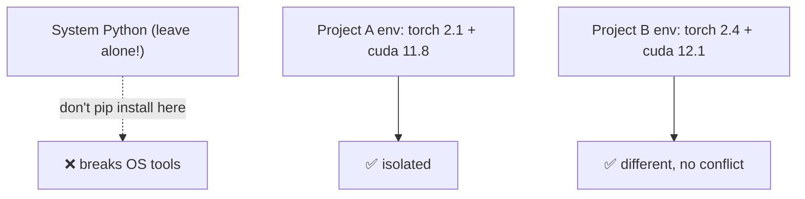
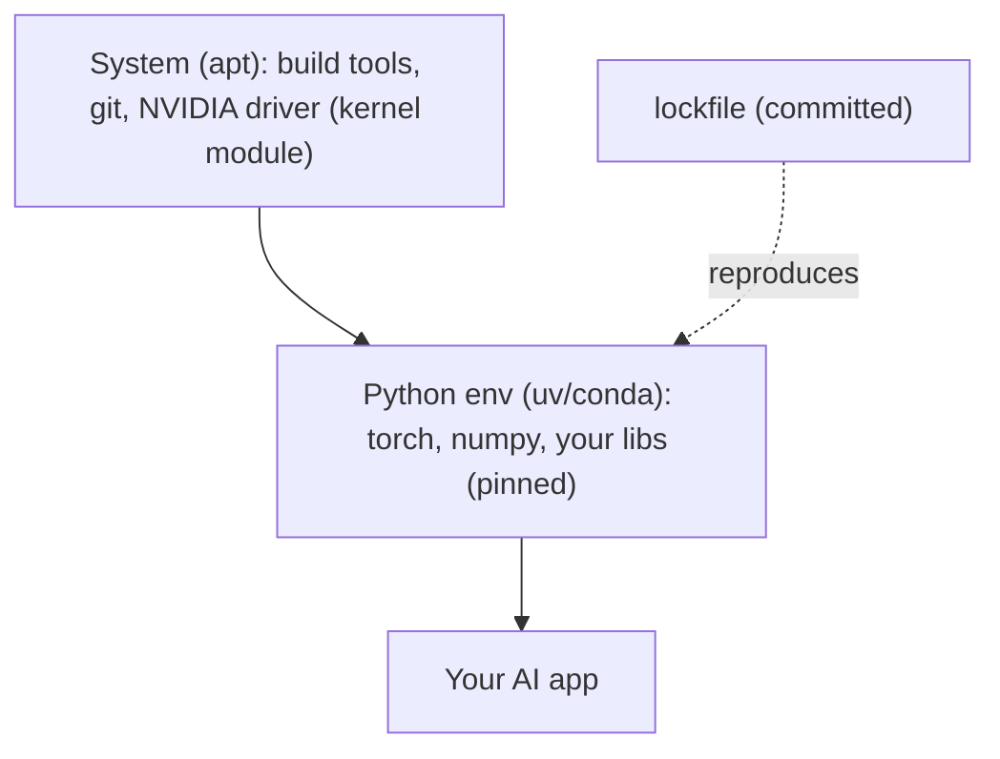

<!-- Module 03 · Lesson 13 — follows ../../../standards/. -->

# 03.13 · Package & Environment Management

[⬅ 03.12 Bash Scripting](03.12-bash-scripting.md) · [🏠 Module](../README.md) · [🗺 Roadmap](../../../ROADMAP.md) · [Next ➡](03.14-performance-monitoring.md)

> Two kinds of "packages" shape an AI system: **system packages** (installed with `apt`/`dnf`) and **Python packages** (isolated in `venv`/`conda`/`uv`). Confusing them causes broken CUDA, dependency hell, and "works on my machine" failures. This lesson makes both crisp, and connects them to reproducible AI environments.

| | |
|---|---|
| **Module** | `03 · Linux for AI Engineers` |
| **Lesson** | `03.13` |
| **Difficulty** | ⭐⭐⭐ |
| **Estimated study time** | 55 min read |
| **Status** | 🟢 stable |

---

## 1. Learning Objectives

By the end of this lesson you will be able to:

- [ ] Use **system package managers** (`apt`, `dnf`/`yum`, `snap`, Homebrew).
- [ ] Explain **package repositories** and dependency resolution.
- [ ] Configure the shell via **`.bashrc`/`.profile`/`.zshrc`**.
- [ ] Isolate Python dependencies with **venv, conda, and uv**.
- [ ] Explain *why* AI projects isolate dependencies (and the CUDA angle).

## 2. Prerequisites

- [03.1 Distributions](03.1-introduction.md) (apt vs dnf), [03.4 PATH/env](03.4-terminal-mastery.md), and [Module 01.13 Packaging](../../01-Advanced-Python/weeks/01.13-packaging-code-quality.md) (the Python side).

---

## 3. Why This Topic Exists

AI projects have famously fragile dependencies: a specific PyTorch version compiled against a specific CUDA version, plus dozens of Python libraries that must not conflict. Two levels of package management are involved — **system-level** (the OS, CUDA drivers) and **Python-level** (your libraries) — and mixing them up is a top source of "it won't install" pain. Understanding both, and isolating per-project, is what makes AI environments reproducible ([Module 00.5](../../00-Orientation/weeks/00.5-development-environment.md)) instead of a house of cards.

> [!IMPORTANT]
> **Two distinct package worlds — don't confuse them.** System packages (`apt install`) manage OS software, libraries, and drivers *for the whole machine*. Python packages (`pip`/`uv`/`conda`) manage your project's libraries *inside an isolated environment*. The #1 environment mistake is `sudo pip install` into the system Python — it can break OS tools that depend on specific versions. Keep the two worlds separate: `apt` for the system, an isolated env for Python.

## 4. System Package Managers

A **package manager** installs, updates, and removes software along with its dependencies, from **repositories** (curated servers of packages). Each distro family has one ([03.1](03.1-introduction.md)).

| Manager | Distro | Common commands |
|---|---|---|
| **`apt`** | Debian/Ubuntu | `apt update`, `apt install`, `apt remove`, `apt search` |
| **`dnf`** (formerly `yum`) | Fedora/RHEL | `dnf install`, `dnf update`, `dnf remove` |
| **`snap`** | Cross-distro | `snap install` (sandboxed, self-contained) |
| **Homebrew** | macOS + Linux | `brew install` (user-level, no sudo) |
| **`apk`** | Alpine | `apk add` (tiny, for Docker) |

```bash
sudo apt update                     # refresh the package index FIRST
sudo apt install -y build-essential git curl   # install tools
sudo apt upgrade                    # update installed packages (security!)
apt list --installed | grep python  # what's installed
```


> [!IMPORTANT]
> **Always `apt update` before `apt install`** — it refreshes the local index of what's available, so you install current versions (and can find the package at all). `build-essential` (compilers), `git`, `curl`/`wget`, and Python dev headers are the common first installs on a fresh AI server. Regular `apt upgrade` applies **security patches** ([03.15](03.15-security.md)) — an unpatched server is a top risk.

> [!NOTE]
> **Repositories are trust boundaries.** Packages come from configured repos; adding a third-party repo (e.g., NVIDIA's CUDA repo, or a PPA) means trusting its maintainers to run code on your system ([Module 02.9](../../02-Computer-Science/weeks/02.9-serialization.md) trust theme). Use official repos; be cautious adding random ones. This is how you install GPU drivers/CUDA on Ubuntu — via NVIDIA's official apt repository.

---

## 5. Shell Configuration: `.bashrc`, `.profile`, `.zshrc`

Your shell's behavior — aliases, `PATH`, environment variables, prompt — is configured by dotfiles in your home directory ([03.3](03.3-filesystem.md)), loaded when a shell starts.

| File | Loaded when | Put here |
|---|---|---|
| `~/.bashrc` | Each **interactive** bash shell | Aliases, functions, prompt, PATH tweaks |
| `~/.profile` / `~/.bash_profile` | **Login** shells | Environment setup (once per login) |
| `~/.zshrc` | Each interactive zsh shell | Same as `.bashrc`, for zsh |

```bash
# ~/.bashrc — persists your setup across sessions (03.4)
export PATH="$HOME/.local/bin:$PATH"        # add a dir to PATH
export CUDA_VISIBLE_DEVICES=0               # (or set per-command instead)
alias gpu='watch -n1 nvidia-smi'            # handy alias (03.7)
alias ll='ls -lah'

source ~/.bashrc                             # reload without re-login
```

> [!IMPORTANT]
> **`~/.bashrc` is where your `PATH`, aliases, and environment persist across sessions** ([03.4](03.4-terminal-mastery.md)). When conda/venv "adds itself to your shell," it appends lines to `.bashrc`. After editing it, run `source ~/.bashrc` (or reopen the terminal) to apply changes. A subtle gotcha: **non-interactive** shells (scripts, systemd, cron) *don't* read `.bashrc` — so relying on `.bashrc` env vars in a systemd service fails ([03.8](03.8-services-systemd.md)); set them explicitly in the unit file. This explains many "works in my terminal, not in the service/cron" bugs.

> [!WARNING]
> **Don't put secrets in `.bashrc`** — it's often not restrictively permissioned and can be backed up/committed ([03.6](03.6-permissions.md)). And avoid setting `CUDA_VISIBLE_DEVICES` globally in `.bashrc` if you share the machine — it forces *every* command to a specific GPU; prefer setting it per-command/per-job ([03.4](03.4-terminal-mastery.md)/[03.7](03.7-processes.md)).

---

## 6. Python Environment Isolation — Why

Recall from [Module 01.13](../../01-Advanced-Python/weeks/01.13-packaging-code-quality.md): each Python project needs its **own isolated environment** so its dependencies don't conflict with others' or the system's. This is *especially* acute in AI, where projects pin exact, incompatible versions.



| Problem without isolation | Isolation solves it by |
|---|---|
| Project A needs torch 2.1, B needs 2.4 | Separate envs, no conflict |
| `sudo pip install` breaks system tools | Never touch system Python |
| "Works on my machine" | Declared, reproducible envs ([Module 00.5](../../00-Orientation/weeks/00.5-development-environment.md)) |
| CUDA/torch version mismatch | Pin compatible versions per env |

> [!IMPORTANT]
> **Never `sudo pip install` into the system Python.** The system Python is used by OS tools; changing its packages can break them ([Module 00.5](../../00-Orientation/weeks/00.5-development-environment.md)). *Every* project gets an isolated environment. This is the OS-level enforcement of the reproducibility principle from Modules 00–01 — the same lesson, now on a real Linux server where breaking system Python is a genuine (and common) way to wreck a machine.

---

## 7. Python Environment Tools: venv, conda, uv

Three tools isolate Python environments; they differ in scope and speed.

| Tool | Isolates | Strengths | Best for |
|---|---|---|---|
| **`venv`** (stdlib) | Python packages only | Built-in, simple, universal | Standard Python projects |
| **conda** | Python **+ non-Python** (CUDA, C libs) | Manages system-level deps too | Complex ML with tricky binary deps |
| **`uv`** | Python packages (fast) | Extremely fast, modern, manages Python versions | The recommended modern default ([Module 01.13](../../01-Advanced-Python/weeks/01.13-packaging-code-quality.md)) |

```bash
# venv (built-in):
python3 -m venv .venv && source .venv/bin/activate   # create + activate
pip install torch numpy                               # installs into the venv
deactivate                                            # leave it

# conda (Anaconda/Miniconda):
conda create -n myenv python=3.11
conda activate myenv
conda install pytorch pytorch-cuda -c pytorch -c nvidia   # can install CUDA libs!

# uv (recommended — fast):
uv venv && source .venv/bin/activate     # or: uv init / uv add torch (Module 01.13)
uv pip install torch numpy
```

> [!IMPORTANT]
> **Why conda is popular in ML specifically:** it can install **non-Python system dependencies** — like CUDA toolkits, cuDNN, and compiled math libraries — *inside the environment*, sidestepping the notorious "system CUDA doesn't match my PyTorch" problem. `venv`/`uv` only manage Python packages, relying on the system for CUDA drivers. Trade-off: conda is heavier and slower; **`uv`** is blazing fast and modern but Python-only. For most AI work, **`uv` + system CUDA drivers** ([03.2](03.2-architecture.md) kernel module) works great; reach for **conda** when binary/CUDA dependencies get thorny. Recall from [03.4](03.4-terminal-mastery.md): "activating" an env just prepends its `bin/` to `PATH`.

> [!TIP]
> **Commit the lockfile, not the environment** ([Module 01.13](../../01-Advanced-Python/weeks/01.13-packaging-code-quality.md)): `uv.lock`/`environment.yml`/`requirements.txt` (pinned) go in Git; the `.venv/`/conda env directory does not. This is what makes the environment *reproducible* on the server, in CI, and in Docker ([03.16](03.16-docker-preparation.md)) — recreate it from the declared file, don't ship the directory.

---

## 8. The Full Picture: System + Python for AI



| Layer | Managed by | Example |
|---|---|---|
| GPU driver / CUDA runtime | `apt` (system) + NVIDIA kernel module ([03.2](03.2-architecture.md)) | `nvidia-driver-xxx` |
| Build tools, git, curl | `apt` (system) | `build-essential` |
| PyTorch, numpy, your libs | `uv`/`conda` (isolated env) | pinned in lockfile |
| Reproducibility | Lockfile in Git | `uv.lock` |

> [!IMPORTANT]
> This layered picture is the AI environment: **system packages** provide the OS foundation and GPU driver; the **isolated Python env** provides your (pinned) libraries; the **lockfile** makes it reproducible. When you containerize ([03.16](03.16-docker-preparation.md)), the Dockerfile literally encodes this: start from a base image (system), `pip install` from the lockfile (Python env) — reproducibility captured in code.

---

## 9. Common Mistakes & Debugging

| Mistake | Consequence | Fix |
|---|---|---|
| `sudo pip install` (system Python) | Breaks OS tools | Use an isolated env |
| Forgetting `apt update` | Stale/missing packages | `apt update` first |
| No environment isolation | Dependency conflicts | venv/conda/uv per project |
| CUDA/torch version mismatch | Import/runtime errors | Match versions; conda for CUDA |
| Env vars in `.bashrc` for services | Not seen by systemd/cron | Set in unit file ([03.8](03.8-services-systemd.md)) |
| Committing the env directory | Bloat, non-portable | Commit the lockfile only |
| Secrets in `.bashrc` | Leak | Use a `chmod 600` file |

## 10. Performance Considerations

| Principle | Takeaway |
|---|---|
| `uv` is very fast | Faster installs/CI than pip/conda ([Module 01.13](../../01-Advanced-Python/weeks/01.13-packaging-code-quality.md)) |
| Lockfiles speed reproducible installs | Deterministic, cacheable |
| Layer caching (Docker) | Install deps in a cached layer ([03.16](03.16-docker-preparation.md)) |
| Minimal base images | Fewer system packages = smaller/faster ([03.1](03.1-introduction.md) Alpine) |

## 11. Security Considerations

| Risk | Guidance |
|---|---|
| Untrusted repos/packages | Installing runs code — vet sources ([Module 01.1](../../01-Advanced-Python/weeks/01.1-python-architecture.md)/[02.9](../../02-Computer-Science/weeks/02.9-serialization.md)) |
| Unpatched system | `apt upgrade` for security fixes ([03.15](03.15-security.md)) |
| Dependency confusion/typosquatting | Pin versions; verify names ([Module 01.13](../../01-Advanced-Python/weeks/01.13-packaging-code-quality.md)) |
| `curl \| sudo bash` installers | Runs untrusted code as root ([03.6](03.6-permissions.md)) |
| Secrets in shell config | Use restricted files, not `.bashrc` |

> [!CAUTION]
> **Installing a package runs code** — from both system repos and PyPI ([Module 01.1](../../01-Advanced-Python/weeks/01.1-python-architecture.md)). A malicious or typosquatted package (`torhc` instead of `torch`) can compromise your machine. Pin versions and use lockfiles ([Module 01.13](../../01-Advanced-Python/weeks/01.13-packaging-code-quality.md)), install from official repos/PyPI, keep the system patched (`apt upgrade`), and never `curl | sudo bash` an untrusted installer. Your dependency list is a supply-chain trust boundary.

## 12. Interview Questions

**Beginner**
1. What's the difference between system packages (`apt`) and Python packages (`pip`)?
2. Why never `sudo pip install` into the system Python?

**Intermediate**
1. venv vs conda vs uv — when would you use each?
2. Why does conda matter specifically for ML/CUDA environments?

**Advanced**
1. How do you make an AI environment reproducible across dev, CI, server, and Docker?
2. Why don't systemd services see your `.bashrc` env vars, and how do you fix it?

**System-design prompt**
- Set up the environment for a GPU training server from scratch (OS packages → GPU driver → Python env → reproducibility). — *Follow-ups:* What's system vs Python level? How do you handle CUDA/torch matching? How do you make it reproducible in Docker?

## 13. Summary

| Key idea | Takeaway |
|---|---|
| Two worlds | System (`apt`/`dnf`) vs Python (venv/conda/uv) — keep separate |
| Never system pip | `sudo pip install` breaks OS tools |
| Repositories | Trusted sources; `apt update` first; patch regularly |
| Shell config | `.bashrc` for interactive; not seen by services |
| Isolate per project | venv/conda/uv; conda for CUDA/binary deps |
| Lockfile = reproducibility | Commit it, not the env directory |

## 14. Cheat Sheet

```text
TWO WORLDS: SYSTEM (apt/dnf/snap/brew — whole machine) vs PYTHON (venv/conda/uv — isolated)
  ⚠️ NEVER sudo pip install into system Python (breaks OS tools)
APT: sudo apt update (FIRST!) → apt install -y build-essential git curl → apt upgrade (security)
  dnf/yum(Fedora/RHEL) · snap(sandboxed) · brew(macOS/Linux, no sudo) · apk(Alpine)
SHELL CONFIG: ~/.bashrc (interactive: aliases/PATH/exports) · ~/.profile (login) · ~/.zshrc (zsh)
  source ~/.bashrc to reload · ⚠️ services/cron DON'T read .bashrc → set env in unit file
PYTHON ENVS: python3 -m venv .venv && source .venv/bin/activate (built-in)
  conda create -n x python=3.11 && conda activate x (installs CUDA/binary deps too!)
  uv venv / uv add torch (FAST, modern default) — Python only
  WHY conda for ML: installs non-Python deps (CUDA/cuDNN) in the env
REPRODUCIBLE: commit lockfile (uv.lock/environment.yml/requirements.txt), NOT the env dir
AI STACK: apt(system + NVIDIA driver) → uv/conda(pinned libs) → lockfile → Docker
SECURITY: installing runs code — pin/lock, official sources, apt upgrade, no curl|sudo bash
```

## 15. Flashcards

- **Q:** System packages vs Python packages? — **A:** `apt`/`dnf` manage OS-wide software/drivers; `pip`/`uv`/`conda` manage a project's Python libraries in an isolated environment — keep the two separate.
- **Q:** Why never `sudo pip install` into system Python? — **A:** OS tools depend on the system Python's packages; changing them can break the operating system.
- **Q:** venv vs conda vs uv? — **A:** venv (built-in, Python-only), conda (Python + non-Python deps like CUDA, heavier), uv (fast modern default, Python-only).
- **Q:** Why is conda popular for ML? — **A:** It can install non-Python system dependencies (CUDA, cuDNN, compiled libs) inside the environment, avoiding system/PyTorch CUDA mismatches.
- **Q:** Why don't systemd/cron see your `.bashrc` env vars? — **A:** `.bashrc` is read only by interactive shells; non-interactive contexts don't load it — set env explicitly in the unit file/crontab.
- **Q:** What makes an environment reproducible? — **A:** Committing the lockfile (uv.lock/environment.yml/pinned requirements) and recreating the env from it — not shipping the env directory.

## 16. Hands-on Exercises

> Full set in [`../exercises/`](../exercises/).

- [ ] **(⭐ System)** `apt update` and install a few tools; list installed packages; explain repositories.
- [ ] **(⭐⭐ Envs)** Create a venv and a uv env; install a package into each; show they're isolated (different `which python`, [03.4](03.4-terminal-mastery.md)).
- [ ] **(⭐⭐ Shell config)** Add an alias and a PATH export to `.bashrc`; `source` it; verify. Explain why a systemd service wouldn't see it.
- [ ] **(⭐⭐⭐ Reproduce)** Create an env, produce a lockfile, delete the env, and recreate it from the lockfile — confirm identical.
- [ ] **(⭐⭐⭐ Conceptual)** Diagram the system vs Python package layers for a CUDA-based training server.

## 17. Mini Project

> **Environment bootstrap script.** Write a robust bash script ([03.12](03.12-bash-scripting.md)) that provisions a fresh AI dev environment: installs system prerequisites (`apt`), sets up a Python env (`uv`/venv), installs pinned dependencies from a lockfile, configures useful shell aliases, and verifies GPU access (`nvidia-smi`) if present. Make it idempotent (safe to re-run) and `shellcheck`-clean. Include a diagram of the provisioning steps. This is real onboarding automation (and a preview of Docker/[Module 16](../../16-MLOps/README.md)).

## 18. References

- Ubuntu/Debian `apt` docs; conda docs; uv docs; pip docs ([reference standards](../../../standards/reference-standards.md)).
- [Module 01.13 · Packaging & Code Quality](../../01-Advanced-Python/weeks/01.13-packaging-code-quality.md) — the Python-packaging companion.
- NVIDIA CUDA installation guide (apt repo method).

## 19. What's Next

Your environment is set up — now make sure it *performs*. Next: **performance monitoring** — `free`, `vmstat`, `iostat`, `sar`, `uptime` — to find CPU, RAM, disk, and network bottlenecks in AI workloads.

➡️ **Next:** [03.14 · Performance Monitoring](03.14-performance-monitoring.md)

---

### 🔁 Revision checklist
- [ ] I keep system packages (`apt`) and Python packages (uv/conda) separate
- [ ] I never `sudo pip install` into system Python
- [ ] I isolate every project and commit lockfiles for reproducibility
- [ ] I know why services don't read `.bashrc`

### 🔗 Spaced-repetition callback
> Recall [Module 01.13's packaging & reproducibility](../../01-Advanced-Python/weeks/01.13-packaging-code-quality.md) and [03.4's PATH](03.4-terminal-mastery.md): "activating an env" is just prepending to PATH, and the lockfile is what makes it reproducible — now on a real Linux server where breaking system Python is a genuine hazard. [Module 00.5's](../../00-Orientation/weeks/00.5-development-environment.md) isolation/declaration/reproducibility trilogy, operationalized.
