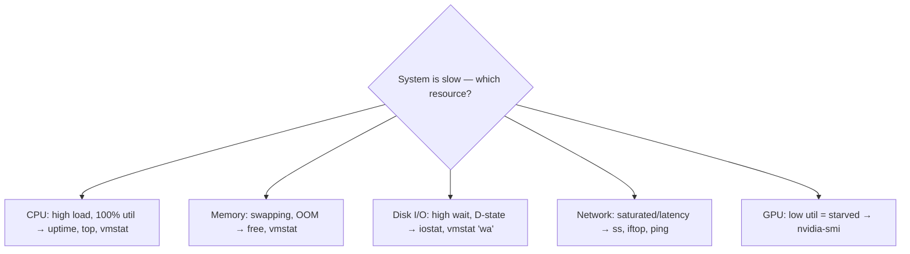
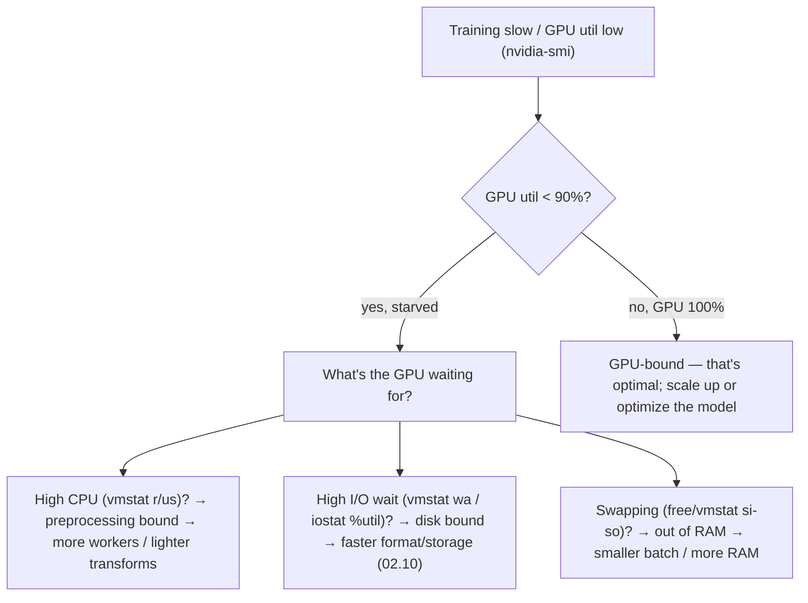

<!-- Module 03 · Lesson 14 — follows ../../../standards/. -->

# 03.14 · Performance Monitoring

[⬅ 03.13 Packages & Envs](03.13-package-environment.md) · [🏠 Module](../README.md) · [🗺 Roadmap](../../../ROADMAP.md) · [Next ➡](03.15-security.md)

> "The training is slow" — but *why*? CPU-bound? Out of RAM? Disk I/O? GPU-starved? This lesson teaches the tools (`free`, `vmstat`, `iostat`, `sar`, `uptime`) and the method to identify which of the four resources — CPU, memory, disk, network — is the bottleneck.

| | |
|---|---|
| **Module** | `03 · Linux for AI Engineers` |
| **Lesson** | `03.14` |
| **Difficulty** | ⭐⭐⭐ |
| **Estimated study time** | 50 min read |
| **Status** | 🟢 stable |

---

## 1. Learning Objectives

By the end of this lesson you will be able to:

- [ ] Interpret **load average** and **`uptime`**.
- [ ] Analyze **memory** with `free` (and swap).
- [ ] Analyze **CPU/memory/swap** with `vmstat`.
- [ ] Analyze **disk I/O** with `iostat`; historical trends with `sar`.
- [ ] Systematically identify the **CPU / RAM / disk / network / GPU** bottleneck.

## 2. Prerequisites

- [03.7 Processes](03.7-processes.md) (`top`/`nvidia-smi`), [Module 02.1 Hardware](../../02-Computer-Science/weeks/02.1-how-computers-work.md) & [02.2 Memory](../../02-Computer-Science/weeks/02.2-memory.md).

---

## 3. Why This Topic Exists

AI workloads are resource-intensive and expensive — GPU time costs real money, and a bottlenecked pipeline wastes it. When training is slow or a server is struggling, you must *diagnose which resource is the constraint* before you can fix it. Guessing wastes time (recall "measure, don't guess," [Module 01.11](../../01-Advanced-Python/weeks/01.11-performance.md)/[02.12](../../02-Computer-Science/weeks/02.12-debugging.md)). These tools give you the numbers.

A recurring, expensive AI scenario: your **GPU is only 30% utilized** during training — the GPU (the pricey resource) is *starved* because a *different* resource (CPU data preprocessing, disk I/O reading data) can't feed it fast enough. Finding that bottleneck can double your training throughput on the same hardware.

> [!IMPORTANT]
> Every performance problem is one of four bottlenecks: **CPU, memory, disk I/O, or network** (plus **GPU** for AI). The skill is identifying *which* — because the fix is completely different for each. A slow-but-idle-CPU process is waiting on I/O; a swapping process is out of RAM; a low-GPU-utilization training is data-starved. This lesson's tools each illuminate one resource.

## 4. Mental Model: The Four Resources (+ GPU)



| Resource | Symptom of bottleneck | Tool |
|---|---|---|
| **CPU** | High load average, 100% CPU | `uptime`, `top`, `vmstat` |
| **Memory** | Swapping, OOM kills | `free`, `vmstat`, `dmesg` ([03.11](03.11-logs.md)) |
| **Disk I/O** | High I/O wait, `D`-state processes ([03.7](03.7-processes.md)) | `iostat`, `vmstat` |
| **Network** | Saturated bandwidth, high latency | `ss` ([03.9](03.9-networking.md)), `iftop` |
| **GPU** | Low utilization = starved by another resource | `nvidia-smi` ([03.7](03.7-processes.md)) |

---

## 5. `uptime` and Load Average

```bash
uptime
# 14:32:01 up 5 days,  load average: 2.15, 1.80, 1.55
```

The three numbers are the **load average** over 1, 5, and 15 minutes — roughly, the average number of processes wanting to run.

> [!IMPORTANT]
> **Interpret load average relative to your CPU core count.** A load of 4.0 on a 4-core machine ≈ fully busy (100%); on a 32-core machine, 4.0 is light. Load *above* the core count means processes are queuing for CPU (a CPU bottleneck) — but load also counts processes in **uninterruptible I/O wait** (`D`-state, [03.7](03.7-processes.md)), so a high load with *low* CPU usage points to an **I/O** bottleneck, not CPU. The three numbers show the trend: rising (2.15 > 1.55) = load increasing. Compare to `nproc` (core count).

---

## 6. `free` — Memory and Swap

```bash
free -h
#               total   used    free    shared  buff/cache  available
# Mem:          62Gi    40Gi    2Gi     1Gi     20Gi        21Gi
# Swap:         8Gi     0Gi     8Gi
```

| Column | Meaning |
|---|---|
| **used** | Memory in active use |
| **free** | Completely unused (often low — that's fine!) |
| **buff/cache** | Used by the OS page cache ([Module 02.6](../../02-Computer-Science/weeks/02.6-operating-systems.md)) — *reclaimable* |
| **available** | The number that matters — how much a new process can get |
| **Swap used** | Memory paged to disk — a **red flag** if high |

> [!IMPORTANT]
> **Look at `available`, not `free`.** Linux deliberately uses "free" RAM for the page cache (buff/cache) to speed file access ([Module 02.6](../../02-Computer-Science/weeks/02.6-operating-systems.md)) — so `free` is often low, and that's *healthy*, not a problem. `available` is the real "how much can I still use" number (it counts reclaimable cache). The genuine red flag is **swap being used**: if the system is paging to disk ([Module 02.6](../../02-Computer-Science/weeks/02.6-operating-systems.md)), it has run low on RAM and performance collapses (disk is ~10⁴× slower, [Module 02.1](../../02-Computer-Science/weeks/02.1-how-computers-work.md)). Heavy swap on a training server means you're near OOM — reduce batch size or add RAM before the OOM-killer strikes ([03.11](03.11-logs.md)).

---

## 7. `vmstat` — CPU, Memory, and I/O at a Glance

`vmstat` shows a broad, continuously-updating snapshot — great for a quick "what's going on?"

```bash
vmstat 2        # update every 2 seconds
# procs -----------memory---------- ---swap-- -----io---- -system-- ------cpu-----
#  r  b   swpd   free   buff  cache   si   so    bi    bo   in   cs us sy id wa st
#  2  1      0  2.1G   500M  20G      0    0   500  1200  ...       30  5 60  5  0
```

Key columns to read:

| Column | Tells you |
|---|---|
| `r` | Processes **running/waiting for CPU** (high = CPU bottleneck) |
| `b` | Processes **blocked on I/O** (high = I/O bottleneck) |
| `si`/`so` | Swap **in/out** (non-zero = swapping = low RAM!) |
| `bi`/`bo` | Blocks **in/out** (disk I/O activity) |
| `wa` | CPU time spent **waiting on I/O** (high = disk bottleneck) |
| `us`/`sy`/`id` | CPU in user / system / idle |

> [!IMPORTANT]
> **`vmstat` triages the bottleneck in one command.** High `r` → CPU-bound. Non-zero `si`/`so` → swapping (out of RAM). High `wa` (I/O wait) with high `b` → disk-bound (the process is idle *because* it's waiting for disk, [03.7](03.7-processes.md) `D`-state). High `us` → your code is CPU-heavy; high `sy` → lots of syscalls/kernel work ([03.2](03.2-architecture.md)). For AI: high `wa` during training means **your GPU is probably starved by slow data loading** — the disk can't feed batches fast enough. That's the signal to use a faster data format/storage ([Module 02.10](../../02-Computer-Science/weeks/02.10-file-systems.md), [03.10](03.10-storage.md)) or more data-loader workers.

---

## 8. `iostat` and `sar` — Disk I/O and History

```bash
iostat -x 2         # extended disk stats, every 2s (from the sysstat package)
# Device   r/s   w/s   rkB/s   wkB/s   %util   await
# nvme0n1  200   50    50000   10000   95.0    5.2
```

| `iostat` column | Meaning |
|---|---|
| `%util` | How busy the disk is (near 100% = saturated) |
| `await` | Average I/O wait time (high = slow disk) |
| `r/s`, `w/s`, `rkB/s`, `wkB/s` | Read/write ops and throughput |

**`sar`** (from the `sysstat` package) records metrics over time, so you can look at **historical** CPU/memory/disk/network — invaluable for "the server was slow at 3 a.m., what happened?"

```bash
sar -u 1 5          # CPU utilization, 5 samples
sar -r              # memory over time
sar -d              # disk over time
sar -n DEV          # network over time
```

> [!IMPORTANT]
> **`iostat -x` diagnoses disk bottlenecks precisely**: `%util` near 100% means the disk is maxed out, and high `await` means requests are queuing. For AI, this confirms a **data-loading bottleneck** — if the disk is saturated while the GPU is idle ([03.7](03.7-processes.md) `nvidia-smi`), your storage can't keep up with training. **`sar`** adds the time dimension: it logs metrics continuously (via a cron job), so you can investigate a *past* incident ("why did latency spike at 3 a.m.?") instead of only the live moment — the historical companion to real-time tools.

---

## 9. The AI Bottleneck Investigation

The signature AI performance problem — **GPU underutilized during training** — investigated systematically:



| Observation | Bottleneck | Fix |
|---|---|---|
| GPU 30%, CPU 100% | CPU (data preprocessing) | More `DataLoader` workers; move preprocessing to GPU |
| GPU 30%, high I/O wait | Disk (data loading) | Faster storage/format; cache data locally ([03.10](03.10-storage.md)) |
| GPU 30%, swapping | RAM | Smaller batch; more RAM ([Module 02.2](../../02-Computer-Science/weeks/02.2-memory.md)) |
| GPU 100% | GPU (optimal!) | Scale hardware or optimize the model |

> [!IMPORTANT]
> **A low GPU-utilization number is money left on the table.** The GPU is the expensive resource; if it's idle 70% of the time, you're paying for hardware you're not using — and the culprit is almost always CPU, disk, or RAM starving it. The diagnostic combo: `nvidia-smi` (is the GPU busy?) + `vmstat`/`iostat` (what's the bottleneck?). Fixing data-loading bottlenecks (more workers, faster storage, better formats, [Module 02.10](../../02-Computer-Science/weeks/02.10-file-systems.md)) is one of the highest-ROI optimizations in practical AI — it can double throughput on the *same* hardware.

---

## 10. Common Mistakes & Debugging

| Mistake | Consequence | Fix |
|---|---|---|
| Panicking at low `free` | Wasted effort | Look at `available` (cache is reclaimable) |
| Ignoring swap usage | Silent performance collapse | Watch `si`/`so`; reduce memory pressure |
| Assuming slow = CPU | Wrong fix | Check `wa` (I/O), swap, GPU util |
| Not checking GPU utilization | Wasted GPU $ | `nvidia-smi` during training |
| Only looking live | Miss past incidents | `sar` for history |
| Load average without core count | Misread severity | Compare to `nproc` |

## 11. Performance Considerations (Meta)

This *is* the performance lesson — the Linux operations layer of [Module 01.11](../../01-Advanced-Python/weeks/01.11-performance.md). Key: **measure to find the constraining resource, fix that, re-measure.** The bottleneck is rarely where you'd guess.

## 12. Security Considerations

| Risk | Guidance |
|---|---|
| Resource exhaustion (DoS) | Monitor for abnormal spikes; set limits (cgroups, [03.16](03.16-docker-preparation.md)) |
| Cryptomining/compromise | Unexpected 100% CPU/GPU can indicate compromise — investigate |
| Monitoring data exposure | Metrics can leak usage patterns; secure dashboards |
| Noisy-neighbor on shared hosts | One tenant's load affects others; limits + isolation |

> [!TIP]
> Performance monitoring doubles as **intrusion detection**: unexplained sustained 100% CPU/GPU (especially at odd hours) can be **cryptomining malware** — a common outcome of a compromised server or leaked cloud credentials. If `top`/`nvidia-smi` shows a process you don't recognize maxing resources, investigate it as a potential compromise ([03.15](03.15-security.md)), not just a performance issue.

## 13. Interview Questions

**Beginner**
1. What does load average mean, and how do you interpret it?
2. Why is low `free` memory usually not a problem on Linux?

**Intermediate**
1. How do you tell if a slow system is CPU-bound vs I/O-bound?
2. Your GPU is only 30% utilized during training. How do you find why?

**Advanced**
1. Walk through diagnosing a data-loading bottleneck with `vmstat`/`iostat`/`nvidia-smi`.
2. How does `sar` help investigate a performance incident that already happened?

**System-design prompt**
- Training throughput is half what the GPU should deliver. Design your investigation. — *Follow-ups:* Which tools for CPU/RAM/disk/GPU? What fixes for each bottleneck? How do you monitor continuously to catch regressions?

## 14. Summary

| Key idea | Takeaway |
|---|---|
| Four (+1) resources | CPU, memory, disk I/O, network (+ GPU) |
| Identify the bottleneck | Different resource → different fix |
| `uptime` load | Relative to core count; high+low-CPU = I/O |
| `free` | Watch `available` and swap, not `free` |
| `vmstat` | One-shot triage: `r`/`wa`/`si`/`so` |
| `iostat`/`sar` | Disk detail / historical trends |
| GPU util | Low = starved = money wasted |

## 15. Cheat Sheet

```text
FOUR BOTTLENECKS (+GPU): CPU · MEMORY · DISK I/O · NETWORK · (GPU: low util = starved)
uptime: load avg (1/5/15 min) — compare to nproc; high load + low CPU = I/O wait (D-state)
free -h: watch AVAILABLE (not free — cache is reclaimable!) · SWAP used = red flag (low RAM → collapse)
vmstat 2: r(CPU queue) · b(I/O blocked) · si/so(SWAP — bad!) · wa(I/O wait) · us/sy/id(cpu)
  → high r=CPU-bound · si/so=out of RAM · high wa+b=disk-bound
iostat -x 2: %util(~100=saturated disk) · await(slow disk) — data-loading bottleneck
sar: HISTORICAL cpu/mem/disk/net (-u/-r/-d/-n DEV) — investigate PAST incidents
GPU: nvidia-smi — low util = starved by CPU/disk/RAM → more dataloader workers / faster storage / smaller batch
DRILL (slow training): nvidia-smi(GPU busy?) → vmstat(CPU? swap? wa?) → iostat(disk?) → fix the constraint
SECURITY: unexplained 100% CPU/GPU = possible cryptomining/compromise
```

## 16. Flashcards

- **Q:** How do you interpret load average? — **A:** Average processes wanting to run over 1/5/15 min; compare to core count (`nproc`) — above core count = queuing; high load with low CPU = I/O-bound.
- **Q:** Why isn't low `free` memory a problem? — **A:** Linux uses "free" RAM as reclaimable page cache; look at `available` (real headroom). The red flag is swap being used.
- **Q:** How does `vmstat` reveal the bottleneck? — **A:** High `r` = CPU-bound; non-zero `si`/`so` = swapping (out of RAM); high `wa`/`b` = disk I/O-bound.
- **Q:** GPU only 30% utilized during training — what's happening? — **A:** The GPU is starved by another resource (CPU preprocessing, disk data-loading, or RAM/swap); diagnose with vmstat/iostat and fix the feeder.
- **Q:** What does `iostat -x` tell you? — **A:** Disk `%util` (near 100 = saturated) and `await` (high = slow/queuing) — confirms a disk/data-loading bottleneck.
- **Q:** What is `sar` for? — **A:** Historical resource metrics (CPU/mem/disk/net over time) to investigate incidents that already happened.

## 17. Hands-on Exercises

> Full set in [`../exercises/`](../exercises/).

- [ ] **(⭐ Read)** Run `uptime`, `free -h`, `vmstat 2`; interpret each against your core count and RAM.
- [ ] **(⭐⭐ CPU/IO)** Generate CPU load (`stress`/a busy loop) and I/O load (`dd`); watch `vmstat` distinguish CPU-bound (`r`/`us`) vs I/O-bound (`wa`/`b`).
- [ ] **(⭐⭐ Memory)** Allocate memory until swap engages; observe `free` and `vmstat si/so`; explain the slowdown.
- [ ] **(⭐⭐ Disk)** Use `iostat -x` while running a heavy read/write; identify `%util` and `await`.
- [ ] **(⭐⭐⭐ GPU)** If a GPU is available, run training and check `nvidia-smi` utilization; if low, diagnose the bottleneck with `vmstat`/`iostat`.

## 18. Mini Project

> **Linux monitoring dashboard (this module's showcase, v9).** Build a script/TUI that samples and displays the key metrics on one screen: load average, memory/`available`/swap, CPU breakdown (`us`/`sy`/`wa`), disk `%util`, and (if present) GPU utilization/memory — refreshing every N seconds, with color-coded warnings (swap in use, high I/O wait, low GPU util, low disk). Optionally log to a file for history (mini-`sar`). Include a diagram. This is a genuinely useful tool for babysitting training runs.

## 19. References

- `sysstat` package docs (`man vmstat`, `man iostat`, `man sar`, `man free`, `man uptime`) ([reference standards](../../../standards/reference-standards.md)).
- Brendan Gregg's *Systems Performance* & USE method (utilization/saturation/errors) — the definitive performance methodology.
- [Module 01.11 · Performance](../../01-Advanced-Python/weeks/01.11-performance.md) & [Module 02.1](../../02-Computer-Science/weeks/02.1-how-computers-work.md)/[02.2](../../02-Computer-Science/weeks/02.2-memory.md).

## 20. What's Next

You can find bottlenecks. Now protect the whole system: **security** — SSH keys, firewalls (UFW), Fail2Ban, permissions, and secrets management — the production hardening every AI server needs.

➡️ **Next:** [03.15 · Security](03.15-security.md)

---

### 🔁 Revision checklist
- [ ] I interpret load average against core count
- [ ] I read `free` (available/swap) and `vmstat` (r/wa/si/so) correctly
- [ ] I diagnose disk bottlenecks with `iostat`
- [ ] I can find why a GPU is underutilized

### 🔗 Spaced-repetition callback
> Recall [Module 02.1's memory hierarchy](../../02-Computer-Science/weeks/02.1-how-computers-work.md) and [02.2's swapping](../../02-Computer-Science/weeks/02.2-memory.md): swap being used is disk-speed memory (catastrophic), and a data-starved GPU is the "moving data is expensive" rule biting in production. And [03.7's `D`-state](03.7-processes.md) is exactly the `wa` (I/O wait) you see in `vmstat`. Measure to find the constraint — [Module 01.11's](../../01-Advanced-Python/weeks/01.11-performance.md) creed, at the OS level.
