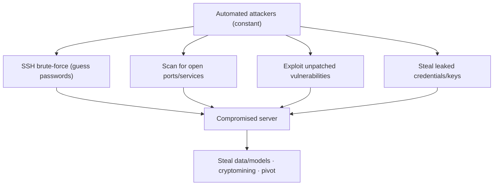
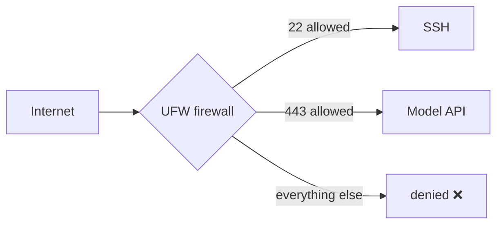
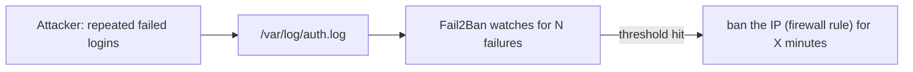

<!-- Module 03 · Lesson 15 — follows ../../../standards/. -->

# 03.15 · Security

[⬅ 03.14 Performance Monitoring](03.14-performance-monitoring.md) · [🏠 Module](../README.md) · [🗺 Roadmap](../../../ROADMAP.md) · [Next ➡](03.16-docker-preparation.md)

> A public AI server is under constant attack — automated bots try SSH logins within minutes of it going online. This lesson covers the essential hardening every production Linux system needs: SSH keys, firewalls (UFW), Fail2Ban, permissions, and secrets management — consolidating the security threads from the whole module.

| | |
|---|---|
| **Module** | `03 · Linux for AI Engineers` |
| **Lesson** | `03.15` |
| **Difficulty** | ⭐⭐⭐ |
| **Estimated study time** | 55 min read |
| **Status** | 🟢 stable |

---

## 1. Learning Objectives

By the end of this lesson you will be able to:

- [ ] Harden **SSH** with key-only auth and sensible settings.
- [ ] Configure a **firewall** with **UFW** to expose only needed ports.
- [ ] Use **Fail2Ban** to block brute-force attackers.
- [ ] Apply **file permissions** and **secrets management** for defense in depth.
- [ ] Follow **production security best practices** for AI systems.

## 2. Prerequisites

- [03.6 Permissions](03.6-permissions.md), [03.9 Networking (SSH)](03.9-networking.md), [03.11 Logs (auth.log)](03.11-logs.md).

---

## 3. Why This Topic Exists

The moment an AI server has a public IP, automated attackers begin probing it — SSH brute-force, port scans, known-vulnerability exploits. These are *constant and automated*, not targeted; any unprotected server is compromised quickly. A compromised AI server is expensive: attackers steal your data and models, rack up GPU bills mining cryptocurrency, or pivot into your network.

Security isn't a separate specialty you can ignore as an AI Engineer — it's basic operational hygiene. This lesson consolidates the security warnings scattered through the module into the concrete hardening steps every server needs. It's the OS-level layer of the security mindset from [Module 00.10](../../00-Orientation/weeks/00.10-ai-engineer-mindset.md) and previews [Module 19 · Production AI](../../19-Production-AI/README.md).

> [!IMPORTANT]
> **Defense in depth** is the guiding principle: no single control is enough, so you layer them. SSH keys *and* a firewall *and* Fail2Ban *and* least-privilege permissions *and* secrets management — so that when one layer is breached, others still protect you. Each control in this lesson is one layer; together they make a server genuinely hard to compromise.

## 4. The Threat Model



| Threat | Defense (this lesson) |
|---|---|
| SSH brute-force | Key-only auth (§5) + Fail2Ban (§7) |
| Exposed services/ports | Firewall (§6) |
| Unpatched vulnerabilities | Regular updates ([03.13](03.13-package-environment.md)) |
| Leaked secrets/keys | Secrets management (§8), permissions ([03.6](03.6-permissions.md)) |
| Privilege escalation | Least privilege, non-root services ([03.6](03.6-permissions.md)/[03.8](03.8-services-systemd.md)) |

---

## 5. Hardening SSH

SSH is the front door ([03.9](03.9-networking.md)) — and the #1 attack target. Harden it:

| Setting (`/etc/ssh/sshd_config`) | Recommended | Why |
|---|---|---|
| `PasswordAuthentication` | `no` | Force key-only auth — no passwords to brute-force |
| `PermitRootLogin` | `no` | Never SSH directly as root |
| `Port` | (optional) non-22 | Reduces automated noise (not real security) |
| `AllowUsers` | specific users | Restrict who can log in |

```bash
# After setting up your SSH key (03.9), disable password auth:
sudo sed -i 's/^#*PasswordAuthentication.*/PasswordAuthentication no/' /etc/ssh/sshd_config
sudo systemctl restart ssh          # apply (keep a session open in case!)
```

> [!IMPORTANT]
> **Key-only auth is the single highest-impact SSH hardening** ([03.9](03.9-networking.md)). Passwords can be brute-forced or phished; SSH keys can't (practically). Set `PasswordAuthentication no` and `PermitRootLogin no`. **Critical safety step: keep an existing SSH session open** while you change SSH config and test a *new* connection before closing it — a misconfiguration can lock you out of a remote server permanently (you'd need console access to recover). Cloud providers require keys by default, so this is often already half-done.

> [!WARNING]
> Restricting SSH source IPs (firewall, §6) and disabling password auth stops the vast majority of attacks. But **never expose SSH to the whole internet with passwords enabled** — that server *will* be compromised, usually within hours. Check `/var/log/auth.log` ([03.11](03.11-logs.md)) on any public server and you'll see the constant brute-force attempts.

---

## 6. Firewalls with UFW

A **firewall** controls which network ports accept connections — the enforcement of "expose only what's needed" ([Module 02.7](../../02-Computer-Science/weeks/02.7-networking.md) load balancers, [03.9](03.9-networking.md)). **UFW** (Uncomplicated Firewall) is Ubuntu's easy front-end.

```bash
sudo ufw default deny incoming      # deny everything inbound by default
sudo ufw default allow outgoing     # allow outbound
sudo ufw allow 22/tcp               # allow SSH (do this BEFORE enabling!)
sudo ufw allow 443/tcp              # allow HTTPS (your model API)
sudo ufw enable                     # turn it on
sudo ufw status                     # verify rules
```



> [!IMPORTANT]
> **Default-deny inbound, then allow only the specific ports you need** — this is the core firewall principle. A model server typically needs only SSH (22) and its API port (443/8000). Everything else stays closed, shrinking the attack surface dramatically ([03.9](03.9-networking.md) "can't connect" ↔ firewall). **Always `ufw allow 22` (SSH) *before* `ufw enable`** — enabling a default-deny firewall without allowing SSH locks you out of a remote server (same lockout risk as §5). On cloud, the provider's **security groups** are a firewall layer *in addition to* UFW ([03.9](03.9-networking.md)/[Module 17](../../17-Cloud/README.md)) — configure both.

---

## 7. Fail2Ban — Blocking Brute-Force

Even with key-only auth, attackers hammer your SSH port. **Fail2Ban** watches logs ([03.11](03.11-logs.md)) for repeated failures and *automatically bans* the offending IPs (via the firewall) for a while.



```bash
sudo apt install -y fail2ban        # (03.13)
sudo systemctl enable --now fail2ban   # (03.8)
sudo fail2ban-client status sshd    # see banned IPs
```

> [!TIP]
> Fail2Ban is a cheap, high-value layer: it reads `auth.log` ([03.11](03.11-logs.md)), and after (say) 5 failed attempts from an IP, bans it for 10 minutes — automatically thwarting brute-force bots without any manual effort. It's the automated response to the attack signal you learned to *spot* in [03.11](03.11-logs.md) (`grep "Failed password"`). Install it on any public server. (With key-only auth it's belt-and-suspenders, but it also cuts log noise and blocks port scanners.)

---

## 8. Secrets Management

AI systems are full of secrets — API keys (for model providers!), database passwords, tokens. Leaking them is one of the most common and damaging incidents. The rules consolidate warnings from across the handbook:

| Do | Don't |
|---|---|
| Store secrets in env vars / `.env` files ([Module 01.9](../../01-Advanced-Python/weeks/01.9-error-handling-logging.md)) | Hard-code them in source ([Module 01.13](../../01-Advanced-Python/weeks/01.13-packaging-code-quality.md)) |
| `chmod 600` secret files, owned by the app user ([03.6](03.6-permissions.md)) | World-readable secrets |
| Use a secrets manager (Vault, cloud KMS) in production | Commit secrets to Git |
| Pass via `EnvironmentFile=` in systemd ([03.8](03.8-services-systemd.md)) | Pass as CLI args (visible in `ps`, [03.7](03.7-processes.md)) |
| Rotate keys; scan repos for leaks ([03.5](03.5-essential-commands.md)) | Log secrets ([Module 01.9](../../01-Advanced-Python/weeks/01.9-error-handling-logging.md)) |

```bash
# A secrets file, locked down:
echo "OPENAI_API_KEY=sk-..." > .env
chmod 600 .env                       # owner-only (03.6)
# Scan a repo for accidentally-committed secrets (03.5):
grep -rniE "api[_-]?key|secret|password|BEGIN.*PRIVATE KEY" . --exclude-dir=.git
```

> [!CAUTION]
> **A leaked API key or SSH private key is a top-severity incident.** Committed to a public Git repo, it's found by bots within *minutes* and abused (huge model-API bills, server takeover). Never commit secrets; use `.gitignore` for `.env` and keys ([Module 01.13](../../01-Advanced-Python/weeks/01.13-packaging-code-quality.md)); scan repos before pushing; and **rotate immediately** if a key is ever exposed. For AI specifically, a leaked model-provider key can cost thousands in fraudulent usage overnight. Treat every secret as radioactive.

---

## 9. Additional Hardening (Checklist)

| Control | Why |
|---|---|
| **Keep it patched** | `apt upgrade` regularly — unpatched CVEs are exploited ([03.13](03.13-package-environment.md)) |
| **Least privilege** | Non-root services ([03.8](03.8-services-systemd.md)); minimal permissions ([03.6](03.6-permissions.md)) |
| **Disable unused services** | Fewer running services = smaller attack surface |
| **Audit SUID binaries** | `find / -perm -4000` ([03.6](03.6-permissions.md)) |
| **Monitor logs** | `auth.log` for intrusions ([03.11](03.11-logs.md)) |
| **Encrypt sensitive data** | At rest and in transit (HTTPS/SSH, [03.9](03.9-networking.md)) |
| **Backups** | Recover from ransomware/mistakes ([03.9](03.9-networking.md) rsync backups) |
| **Container isolation** | Sandbox workloads ([03.16](03.16-docker-preparation.md)) |

> [!IMPORTANT]
> Security is **layered and ongoing**, not a one-time setup. The baseline for any public AI server: key-only SSH + firewall (default-deny) + Fail2Ban + non-root services + secrets in restricted files + regular patching + log monitoring. Each is simple; together they raise the bar high enough that automated attacks fail and you're a hard target. This baseline is what "production-ready" means at the OS layer ([Module 19](../../19-Production-AI/README.md)).

---

## 10. Common Mistakes & Debugging

| Mistake | Consequence | Fix |
|---|---|---|
| Password SSH on public server | Brute-forced & compromised | Key-only + Fail2Ban |
| `ufw enable` without allowing SSH | Locked out of the server | `ufw allow 22` first |
| Changing SSH config without a test session | Locked out | Keep a session open; test new one |
| Secrets in Git / hard-coded | Leaked, abused | `.gitignore`, `.env` (600), rotate |
| Running services as root | Full compromise on breach | Non-root service users |
| Never patching | Exploited CVEs | Regular `apt upgrade` |
| Ignoring `auth.log` | Missed intrusion | Monitor; Fail2Ban |

## 11. Performance Considerations

Security controls have negligible performance cost (a firewall check, a log scan). The relevant trade-off is **operational**: hardening prevents catastrophic, expensive incidents (data theft, cryptomining GPU bills) — vastly cheaper than the breach it prevents.

## 12. Security Considerations

This lesson *is* security; the whole thing is the consideration. The meta-point: **security is everyone's job, including the AI Engineer's.** You'll also face AI-specific security (prompt injection, model theft, SSRF from agents) in [Module 19 · Production AI](../../19-Production-AI/README.md) — but it all sits on the OS hardening foundation built here. A secure model is worthless on an insecure server.

## 13. Interview Questions

**Beginner**
1. Why use key-only SSH auth over passwords?
2. What does a firewall do, and what's "default deny"?

**Intermediate**
1. What is Fail2Ban and what problem does it solve?
2. How do you manage secrets (API keys) securely on a server?

**Advanced**
1. Explain defense in depth with concrete Linux controls.
2. Walk through hardening a fresh public GPU server from scratch.

**System-design prompt**
- Harden a public-facing AI inference server. — *Follow-ups:* SSH? Firewall/ports? Fail2Ban? How do services run (user, privileges)? Where do secrets live? How do you patch and monitor? What if a key leaks?

## 14. Summary

| Key idea | Takeaway |
|---|---|
| Defense in depth | Layer controls; no single one suffices |
| SSH | Key-only, no root login (don't lock yourself out) |
| Firewall (UFW) | Default-deny inbound; allow only needed ports |
| Fail2Ban | Auto-ban brute-force IPs from logs |
| Secrets | `.env` (chmod 600), never in Git/args/logs; rotate |
| Ongoing | Patch, least privilege, monitor logs, backups |

## 15. Cheat Sheet

```text
DEFENSE IN DEPTH: layer SSH keys + firewall + Fail2Ban + least privilege + secrets mgmt + patching
SSH HARDEN (/etc/ssh/sshd_config): PasswordAuthentication no · PermitRootLogin no · AllowUsers
  ★ keep a session open + test a NEW connection before closing (or you lock yourself out!)
FIREWALL (UFW): ufw default deny incoming → ufw allow 22/tcp (BEFORE enable!) → ufw allow 443 → ufw enable
  default-deny inbound, allow only needed ports · cloud also has security groups
FAIL2BAN: apt install fail2ban → auto-bans IPs after N failed logins (reads auth.log) · fail2ban-client status sshd
SECRETS: .env chmod 600 (03.6), owned by app user · EnvironmentFile in systemd · NEVER: hard-code / commit / CLI args / logs
  scan: grep -rniE "api[_-]?key|secret|password|PRIVATE KEY" . --exclude-dir=.git · ROTATE if leaked
BASELINE: key-only SSH · UFW default-deny · Fail2Ban · non-root services · secrets in 600 files · apt upgrade · monitor auth.log
AI SPECIFIC (Module 19): prompt injection · model theft · SSRF from agents — on top of this OS baseline
```

## 16. Flashcards

- **Q:** What is defense in depth? — **A:** Layering multiple security controls so that if one is breached, others still protect the system — no single control is relied upon.
- **Q:** Highest-impact SSH hardening? — **A:** Key-only authentication (`PasswordAuthentication no`) plus no root login — passwords can be brute-forced/phished; keys can't.
- **Q:** What must you do before `ufw enable`? — **A:** `ufw allow 22/tcp` (SSH) — enabling a default-deny firewall without allowing SSH locks you out of a remote server.
- **Q:** What does Fail2Ban do? — **A:** Watches logs (auth.log) for repeated failed logins and automatically bans the offending IPs via the firewall.
- **Q:** How do you handle secrets on a server? — **A:** Store in `.env`/env vars with `chmod 600` owned by the app user (or a secrets manager); never hard-code, commit, pass as CLI args, or log them; rotate if leaked.
- **Q:** What's the security baseline for a public AI server? — **A:** Key-only SSH + default-deny firewall + Fail2Ban + non-root services + least-privilege permissions + secrets in restricted files + regular patching + log monitoring.

## 17. Hands-on Exercises

> Full set in [`../exercises/`](../exercises/).

- [ ] **(⭐ SSH)** (In a VM/cloud instance) set up key-only auth; disable password login; verify you can still connect with the key.
- [ ] **(⭐⭐ Firewall)** Configure UFW: default-deny inbound, allow SSH + one app port; verify with `ufw status` and by testing connectivity.
- [ ] **(⭐⭐ Fail2Ban)** Install Fail2Ban; check `fail2ban-client status sshd`; inspect its jail config.
- [ ] **(⭐⭐ Secrets)** Create a locked-down `.env`; add it to `.gitignore`; write a `grep` command to scan a repo for leaked secrets.
- [ ] **(⭐⭐⭐ Audit)** Run a mini security audit: SUID binaries (`find / -perm -4000`), open ports (`ss -tlnp`), failed logins (`auth.log`), world-writable files.

## 18. Mini Project

> **Server hardening + audit script (this module's showcase, v10).** Extend the [03.6](03.6-permissions.md) permission auditor into a full **server health & security checker**: verify SSH is key-only, firewall is enabled with minimal rules, Fail2Ban is running, no unexpected SUID binaries, no world-readable secrets, and the system is patched — plus the health checks (disk/memory/processes) from earlier lessons. Output a ranked report of issues with remediation hints. This is a genuinely useful production tool and consolidates the whole module's security thread.

## 19. References

- Ubuntu Server Security Guide; `man sshd_config`, `man ufw`, Fail2Ban docs ([reference standards](../../../standards/reference-standards.md)).
- CIS Benchmarks (Linux hardening); the OWASP and cloud provider security best practices.
- [Module 19 · Production AI](../../19-Production-AI/README.md) — AI-specific security (prompt injection, model theft, SSRF).

## 20. What's Next

You can secure a Linux server. The final technical lesson prepares you for the container era: **Docker preparation** — the Linux kernel features (namespaces, cgroups, OverlayFS) that Docker is built on.

➡️ **Next:** [03.16 · Docker Preparation](03.16-docker-preparation.md)

---

### 🔁 Revision checklist
- [ ] I can harden SSH to key-only without locking myself out
- [ ] I configure a default-deny firewall exposing only needed ports
- [ ] I use Fail2Ban and monitor auth logs
- [ ] I manage secrets safely (600 files, never in Git/args/logs)

### 🔗 Spaced-repetition callback
> This lesson consolidates the module's security thread: [03.6's least privilege](03.6-permissions.md), [03.9's SSH keys](03.9-networking.md), [03.11's auth.log monitoring](03.11-logs.md), and [03.13's patching](03.13-package-environment.md) all combine into defense in depth. It's [Module 00.10's security mindset](../../00-Orientation/weeks/00.10-ai-engineer-mindset.md) and [Module 02.9's trust-boundary](../../02-Computer-Science/weeks/02.9-serialization.md) thinking, made operational — the foundation [Module 19](../../19-Production-AI/README.md) builds AI-specific security on.
