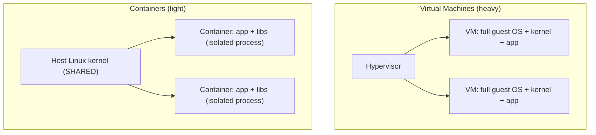
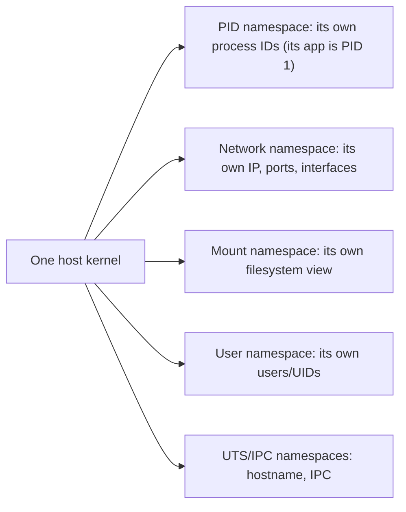
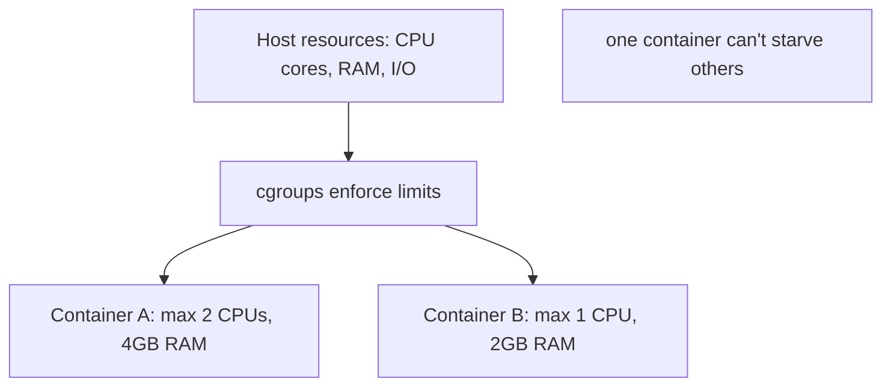
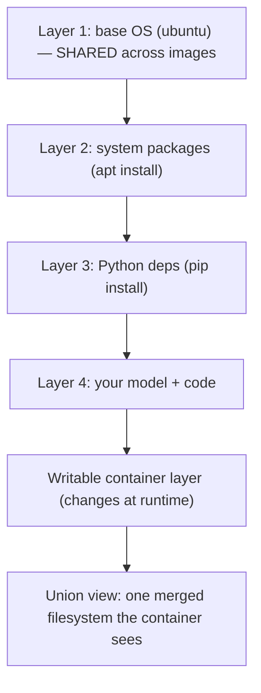
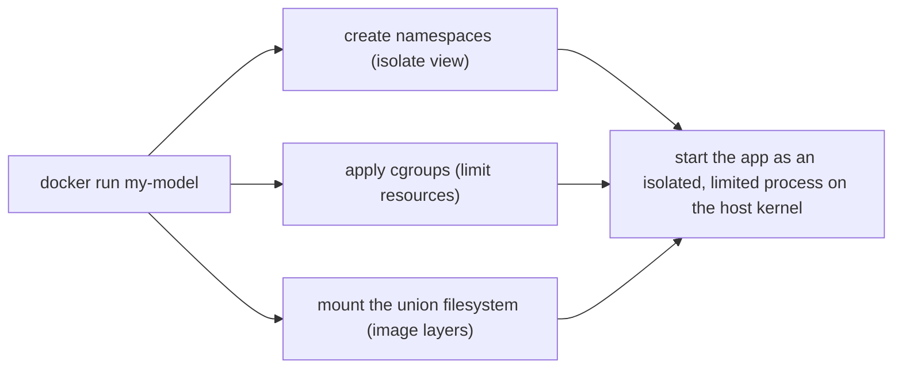

<!-- Module 03 · Lesson 16 — follows ../../../standards/. -->

# 03.16 · Docker Preparation

[⬅ 03.15 Security](03.15-security.md) · [🏠 Module](../README.md) · [🗺 Roadmap](../../../ROADMAP.md) · [Next ➡](03.17-workflow-projects-summary.md)

> Docker isn't magic — it's a clever assembly of Linux kernel features you've already met: **namespaces** (isolation), **cgroups** (resource limits), and **union filesystems** (layers). This lesson reveals what a container *actually is*, so when you learn Docker in [Module 16](../../16-MLOps/README.md), it's obvious rather than mysterious.

| | |
|---|---|
| **Module** | `03 · Linux for AI Engineers` |
| **Lesson** | `03.16` |
| **Difficulty** | ⭐⭐⭐ |
| **Estimated study time** | 45 min read |
| **Status** | 🟢 stable |

---

## 1. Learning Objectives

By the end of this lesson you will be able to:

- [ ] Explain what a **container** actually is (isolated Linux processes).
- [ ] Explain **namespaces** (isolation) and **cgroups** (resource limits).
- [ ] Explain **union/overlay filesystems (OverlayFS)** and Docker layers.
- [ ] Articulate **why Docker depends on Linux internals**.
- [ ] Connect these to how AI models are packaged and deployed.

## 2. Prerequisites

- [03.2 Architecture](03.2-architecture.md) (kernel), [03.7 Processes](03.7-processes.md), [03.6 Permissions](03.6-permissions.md), [03.8 systemd (cgroups)](03.8-services-systemd.md), and [Module 02.6](../../02-Computer-Science/weeks/02.6-operating-systems.md) (containers preview).

---

## 3. Why This Topic Exists

Containers are how modern AI is packaged and deployed: you build a Docker image with your model, code, and dependencies, and it runs identically anywhere ([Module 16 · MLOps](../../16-MLOps/README.md)). But people learn Docker as a set of magic commands (`docker run`, `docker build`) without understanding what a container *is* — and then can't debug why one fails, why an image is huge, or why "it's Linux-only."

This lesson demystifies containers *before* you touch Docker, by showing they're built from Linux primitives you already know ([03.1](03.1-introduction.md) claimed "Docker is Linux" — here's the proof). Understanding the internals makes Docker easy and debuggable rather than mysterious.

> [!IMPORTANT]
> **A container is not a virtual machine — it's an isolated Linux *process*.** A VM emulates a whole machine (its own kernel, huge, slow to start). A container is just regular processes on the *host's* kernel, made to *look* isolated using three Linux kernel features: **namespaces** (what it can see), **cgroups** (what it can use), and a **union filesystem** (what its files look like). That's the whole trick — no magic, just kernel features. This is why containers are lightweight (no extra kernel) and start in milliseconds.

## 4. Container vs Virtual Machine



| | Virtual Machine | Container |
|---|---|---|
| Isolates | A whole machine (own kernel) | Processes (shared host kernel) |
| Size | Gigabytes (full OS) | Megabytes (just app + libs) |
| Startup | Seconds–minutes (boot an OS) | Milliseconds (start a process) |
| Overhead | High | Low |
| Isolation strength | Stronger (full separation) | Lighter (shared kernel) |

> [!NOTE]
> Because containers share the **host kernel**, they must run *Linux* processes — which is why **Docker on Mac/Windows secretly runs a Linux VM** to host the containers ([03.1](03.1-introduction.md)). It also means container isolation is *lighter* than VM isolation (a kernel exploit could cross the boundary), so security-sensitive multi-tenant setups add extra sandboxing ([03.2](03.2-architecture.md) seccomp). For AI, containers' speed and small size win overwhelmingly for packaging and deploying models.

---

## 5. Namespaces — Isolation (What a Container Can *See*)

**Namespaces** are the kernel feature that gives each container its own isolated *view* of the system. A process in a namespace sees only its own processes, its own network, its own filesystem root — as if it were alone on the machine, even though it's sharing the host kernel.



| Namespace | Isolates | Effect |
|---|---|---|
| **PID** | Process IDs | Container sees only its processes (its app is PID 1, [03.7](03.7-processes.md)) |
| **Network** | Network stack | Own IP, ports, interfaces ([03.9](03.9-networking.md)) |
| **Mount** | Filesystem mounts | Own view of the filesystem tree ([03.3](03.3-filesystem.md)) |
| **User** | User/group IDs | Container root ≠ host root ([03.6](03.6-permissions.md)) |
| **UTS / IPC** | Hostname / IPC | Own hostname, isolated inter-process comms |

> [!IMPORTANT]
> **Namespaces create the *illusion* of a separate machine.** Inside a container, `ps` shows only the container's processes (its app is PID 1, [03.7](03.7-processes.md)); `ip addr` shows only the container's network ([03.9](03.9-networking.md)); the root `/` is the container's filesystem, not the host's ([03.3](03.3-filesystem.md)) — all while running as ordinary processes on the host kernel. This is *why* a containerized model server behaves as if it has its own clean environment. Every concept you learned this module (processes, networking, filesystem, users) is what namespaces isolate.

---

## 6. cgroups — Resource Limits (What a Container Can *Use*)

**Control groups (cgroups)** limit and account for a container's resource usage — CPU, memory, I/O. This is the *same feature systemd uses* ([03.8](03.8-services-systemd.md) `MemoryMax=`), now applied to containers.



| cgroup controls | Example |
|---|---|
| CPU | `--cpus=2` (Docker) — max CPU shares |
| Memory | `--memory=4g` — hard RAM limit (OOM-kills the container if exceeded, [Module 02.6](../../02-Computer-Science/weeks/02.6-operating-systems.md)) |
| I/O | Disk read/write bandwidth limits |
| GPU (via NVIDIA runtime) | Assign specific GPUs to a container |

> [!IMPORTANT]
> **cgroups are why containers can't hog the whole machine.** Without limits, one runaway container (or training job) could consume all RAM and crash the host ([03.7](03.7-processes.md) runaway processes). cgroups cap each container's CPU/memory/I/O, enforcing fair sharing and blast-radius limits ([Module 02.11](../../02-Computer-Science/weeks/02.11-system-design-basics.md) fault isolation). For AI, this is how a GPU server runs multiple isolated model containers, each bounded — and how Kubernetes ([03.1](03.1-introduction.md)) schedules containers by their resource requests. When a container hits its `--memory` limit, it's OOM-killed (the exit-137 from [03.11](03.11-logs.md)/[Module 02.6](../../02-Computer-Science/weeks/02.6-operating-systems.md)) — a very common "why did my container die?" cause.

---

## 7. Union/Overlay Filesystems — Layers (What a Container's Files *Look Like*)

Docker images are built in **layers**, stacked with a **union filesystem** (OverlayFS on modern Linux). Each layer is a set of filesystem changes; the union filesystem merges them into one coherent view, and layers are **shared and cached** across images.



| Concept | Meaning |
|---|---|
| **Image layer** | An immutable set of filesystem changes (read-only) |
| **Union/OverlayFS** | Merges layers into one filesystem view ([03.3](03.3-filesystem.md)) |
| **Layer caching** | Unchanged layers are reused → fast builds, small storage |
| **Copy-on-write** | Runtime changes go to a thin writable top layer; the image stays immutable |

> [!IMPORTANT]
> **Layers explain Docker's efficiency and the #1 Dockerfile best practice.** Because layers are cached, if you change only your code (top layer), rebuilding reuses the cached base/dependency layers — fast. This is why you **order a Dockerfile from least- to most-frequently-changed**: install dependencies (rarely change) *before* copying your code (changes constantly), so dependency installation is cached across builds. For AI, where installing PyTorch/CUDA is slow ([03.13](03.13-package-environment.md)), correct layer ordering turns multi-minute rebuilds into seconds. Shared base layers also mean ten model images share one Ubuntu layer on disk — huge storage savings.

---

## 8. Putting It Together: What Docker Actually Does

When you `docker run`, Docker orchestrates these Linux features:



| Docker concept | Underlying Linux feature |
|---|---|
| Container isolation | **Namespaces** (§5) |
| Resource limits (`--memory`, `--cpus`) | **cgroups** (§6) |
| Image layers, small size, fast builds | **Union/OverlayFS** (§7) |
| Syscall restriction | **seccomp** ([03.2](03.2-architecture.md)) |
| Runs Linux processes | The **host kernel** |

> [!IMPORTANT]
> **This is the payoff of the whole module.** Docker is namespaces + cgroups + union filesystems + a nice CLI — every piece is a Linux concept you now understand. A container is an isolated ([03.3](03.3-filesystem.md)/[03.9](03.9-networking.md)), resource-limited ([03.8](03.8-services-systemd.md)) process ([03.7](03.7-processes.md)) with a layered filesystem. When you learn Docker properly in [Module 16](../../16-MLOps/README.md), it won't be magic — you'll know exactly what `docker run` is doing to the kernel, and you'll be able to debug containers (why it can't reach the network, why it OOM-killed, why the image is huge) using the Linux skills from this entire module.

---

## 9. Why AI Uses Containers

| AI need | Containers provide |
|---|---|
| Reproducible environments | Image bundles OS + CUDA + deps + code ([03.13](03.13-package-environment.md)) |
| "Runs anywhere" | Same image on laptop, server, cloud, Kubernetes |
| Isolation | Multiple models/versions on one host, bounded (cgroups) |
| Fast deployment/scaling | Start in ms; scale horizontally ([Module 02.11](../../02-Computer-Science/weeks/02.11-system-design-basics.md)) |
| GPU access | NVIDIA container runtime passes GPUs into containers |

> [!NOTE]
> The reproducibility story comes full circle: [Module 00.5](../../00-Orientation/weeks/00.5-development-environment.md)'s "rebuild the exact environment anywhere" is *perfected* by containers — the image *is* the environment (system + Python deps + code), captured immutably. This is why containerizing is the standard way to ship AI models ([Module 16](../../16-MLOps/README.md)). You've now got the OS-level understanding to do it well.

---

## 10. Common Mistakes & Misconceptions

| Mistake / myth | Reality |
|---|---|
| "A container is a lightweight VM" | It's isolated *processes* on the host kernel, not a VM |
| "Containers are fully isolated like VMs" | Lighter — shared kernel; add sandboxing for hostile workloads |
| "Docker works the same on any OS natively" | Needs a Linux kernel; Mac/Windows run a hidden Linux VM |
| Bad Dockerfile layer order | Slow rebuilds (deps not cached) — order least→most changing |
| Ignoring resource limits | One container can crash the host — set `--memory`/`--cpus` |
| Container OOM-killed, confused | It hit its cgroup memory limit (exit 137, [03.11](03.11-logs.md)) |

## 11. Performance Considerations

| Principle | Takeaway |
|---|---|
| Near-native performance | Containers add minimal overhead (no extra kernel) |
| Small images | Fewer/smaller layers = faster pull/deploy ([03.1](03.1-introduction.md) Alpine) |
| Layer caching | Order Dockerfile least→most changing |
| Resource limits | cgroups protect the host; size them right |
| GPU passthrough | Near-native GPU performance via NVIDIA runtime |

## 12. Security Considerations

| Risk | Guidance |
|---|---|
| Shared kernel | A kernel exploit can escape a container — keep host patched ([03.13](03.13-package-environment.md)/[03.15](03.15-security.md)) |
| Running as root in container | Container root can be dangerous — run as non-root user ([03.6](03.6-permissions.md)) |
| Untrusted images | An image can contain malware — use trusted base images, scan them |
| Excess capabilities | Drop unneeded Linux capabilities; use seccomp ([03.2](03.2-architecture.md)) |
| Secrets baked into images | Layers are inspectable — never bake secrets in ([03.15](03.15-security.md)) |

> [!CAUTION]
> **Never bake secrets into a Docker image** — image layers are inspectable, so a hard-coded API key in any layer is exposed to anyone who pulls the image (even if a later layer "deletes" it, it persists in the earlier layer, [03.15](03.15-security.md)). Pass secrets at *runtime* (env vars / mounted files), not build time. Also **run containers as a non-root user** ([03.6](03.6-permissions.md)) — container root maps toward host root without user namespaces, a real escalation risk. Containers isolate, but the isolation is lighter than a VM's — patch the host and don't run untrusted images.

## 13. Interview Questions

**Beginner**
1. What's the difference between a container and a virtual machine?
2. What is a container, really?

**Intermediate**
1. What do namespaces and cgroups each provide?
2. Why does Dockerfile layer order affect build speed?

**Advanced**
1. Explain how the three Linux features combine when you `docker run`.
2. A container gets OOM-killed — what's happening and how do you fix it?

**System-design prompt**
- Explain how you'd containerize and deploy a GPU-based model server, and how the underlying Linux features support it. — *Follow-ups:* How do namespaces/cgroups isolate and limit it? How does layer caching speed builds? How do you keep it secure (non-root, no baked secrets)?

## 14. Summary

| Key idea | Takeaway |
|---|---|
| Container = isolated process | Not a VM; shares the host kernel |
| Namespaces | Isolate what a container *sees* (PID, net, mount, user) |
| cgroups | Limit what it *uses* (CPU, memory, I/O) |
| Union/OverlayFS | Layered, cached, shared images |
| Docker = these + a CLI | No magic — Linux features you know |
| AI uses containers | Reproducible, portable, isolated, fast |

## 15. Cheat Sheet

```text
CONTAINER = isolated Linux PROCESS on the HOST kernel (NOT a VM: no guest kernel → tiny, ms startup)
  (Docker on Mac/Win runs a hidden Linux VM)
3 KERNEL FEATURES:
  NAMESPACES (isolation — what it SEES): PID(own procs, app=PID1) · Network(own IP/ports) · Mount(own FS) · User(own UIDs) · UTS/IPC
  CGROUPS (limits — what it USES): CPU/memory/IO → --cpus --memory (hit limit = OOM-kill, exit 137)
  UNION/OverlayFS (layers): image = stacked read-only layers + writable top; cached & shared
    ★ Dockerfile: order least→most changing (deps before code) → cache = fast rebuilds
docker run = create namespaces + apply cgroups + mount layered FS → start isolated limited process
AI: image bundles OS+CUDA+deps+code = reproducible, portable, GPU via NVIDIA runtime
SECURITY: run as non-root · NEVER bake secrets (layers inspectable) · trusted images · patch host (shared kernel)
```

## 16. Flashcards

- **Q:** What is a container, really? — **A:** An isolated Linux *process* running on the host's kernel — made to look like a separate machine using namespaces, cgroups, and a union filesystem. Not a VM.
- **Q:** Container vs VM? — **A:** A VM emulates a whole machine with its own kernel (gigabytes, slow); a container is isolated processes sharing the host kernel (megabytes, milliseconds to start).
- **Q:** What do namespaces provide? — **A:** Isolation of what a container *sees* — its own PIDs, network, filesystem mounts, users, hostname — as if alone on the machine.
- **Q:** What do cgroups provide? — **A:** Limits on what a container *uses* — CPU, memory, I/O — so no container can starve the host (hitting the memory limit OOM-kills it).
- **Q:** Why does Dockerfile layer order matter? — **A:** Layers are cached; ordering least- to most-frequently-changed (deps before code) lets slow dependency installs be reused across rebuilds.
- **Q:** Why never bake secrets into an image? — **A:** Image layers are inspectable and persistent — a secret in any layer is exposed to anyone who pulls the image; pass secrets at runtime instead.

## 17. Hands-on Exercises

> Full set in [`../exercises/`](../exercises/).

- [ ] **(⭐ Conceptual)** Explain to a peer how a container differs from a VM, and name the three Linux features Docker uses.
- [ ] **(⭐⭐ Explore)** Run `docker run -it ubuntu bash`; inside, run `ps aux` (see isolated PIDs), `ip addr` (isolated network), `ls /` (isolated FS); compare to the host.
- [ ] **(⭐⭐ cgroups)** Run a container with `--memory=256m` and a program that allocates more; observe the OOM-kill.
- [ ] **(⭐⭐⭐ Layers)** Build a small image two ways (deps before vs after copying code); compare rebuild times after a code change — see layer caching in action.
- [ ] **(⭐⭐⭐ Namespaces)** (Advanced) Use `unshare`/`lsns` to explore namespaces directly, seeing the primitives Docker builds on.

## 18. Mini Project

> **"Container from scratch" explainer.** Write a hands-on report/demo that, using raw Linux tools (`unshare`, `lsns`, `cgcreate`/cgroup files, `chroot`/overlayfs), demonstrates each of the three container primitives *without Docker* — isolating a process's PID namespace, limiting its memory via cgroups, and giving it a separate filesystem root. Document what each step does and map it to what Docker automates. This builds deep, debuggable understanding of containers before Module 16 — few engineers truly grasp this.

## 19. References

- *"What even is a container?"* (Julia Evans) and similar container-internals explainers ([reference standards](../../../standards/reference-standards.md)).
- Docker documentation (architecture); Linux `man namespaces(7)`, `man cgroups(7)`, `man overlayfs`.
- [Module 16 · MLOps](../../16-MLOps/README.md) — where you'll use Docker for real.

## 20. What's Next

You have the full Linux toolkit. The final lesson ties it together into a **realistic AI Engineer's day** (SSH → environment → training → monitoring → deployment), collects the module's six projects, and consolidates everything for review.

➡️ **Next:** [03.17 · The AI Engineer Workflow, Projects & Summary](03.17-workflow-projects-summary.md)

---

### 🔁 Revision checklist
- [ ] I can explain a container as isolated processes (not a VM)
- [ ] I know namespaces (isolation) vs cgroups (limits) vs union FS (layers)
- [ ] I understand why Docker is fundamentally Linux
- [ ] I know Dockerfile layer-caching and the no-secrets rule

### 🔗 Spaced-repetition callback
> This lesson unifies the module: namespaces isolate [03.7 processes](03.7-processes.md)/[03.9 networking](03.9-networking.md)/[03.3 filesystem](03.3-filesystem.md)/[03.6 users](03.6-permissions.md); cgroups are [03.8 systemd's](03.8-services-systemd.md) resource limits; and it fulfills [03.1's](03.1-introduction.md) claim that "Docker is Linux." Everything you learned about operating Linux is what a container isolates and limits — [Module 02.6's](../../02-Computer-Science/weeks/02.6-operating-systems.md) "containers = namespaces + cgroups" fully realized.
