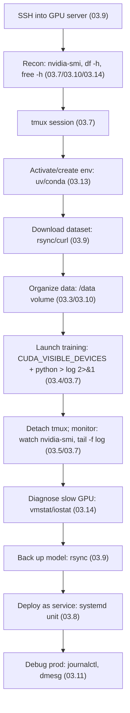
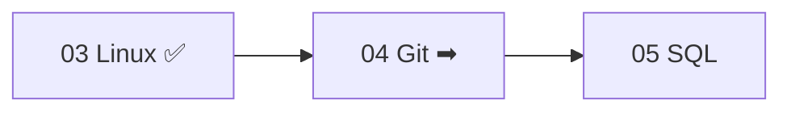

<!-- Module 03 · Lesson 17 — workflow + projects + module consolidation. Follows ../../../standards/. -->

# 03.17 · The AI Engineer Workflow, Projects & Summary

[⬅ 03.16 Docker Preparation](03.16-docker-preparation.md) · [🏠 Module](../README.md) · [🗺 Roadmap](../../../ROADMAP.md) · [Next module ➡](../../04-Git/README.md)

> A realistic day in the life — SSH into a GPU server, set up, train, monitor, deploy — using every skill in this module together. Then the six mini-projects collected, and full module consolidation for review.

| | |
|---|---|
| **Module** | `03 · Linux for AI Engineers` |
| **Lesson** | `03.17` |
| **Difficulty** | ⭐⭐⭐ |
| **Estimated study time** | 40 min read · project time varies |
| **Status** | 🟢 stable |

---

## Part A — A Day in the Life of an AI Engineer

This is where the module's skills stop being separate lessons and become one fluid workflow. Follow a realistic day, with each step linking to the lesson that taught it.



### Step-by-step

**1. SSH into the GPU server** ([03.9](03.9-networking.md))
```bash
ssh gpu-a100                          # via ~/.ssh/config alias, key-based auth
```

**2. Reconnaissance — what am I working with?** ([03.1](03.1-introduction.md)/[03.7](03.7-processes.md)/[03.10](03.10-storage.md)/[03.14](03.14-performance-monitoring.md))
```bash
nvidia-smi                            # which GPUs, how much memory, who's using them?
df -h                                 # is there disk space for the dataset?
free -h                               # available RAM?
uptime                                # current load
```

**3. Start a persistent session** ([03.7](03.7-processes.md)) — so training survives disconnect
```bash
tmux new -s training
```

**4. Set up the environment** ([03.13](03.13-package-environment.md))
```bash
cd /opt/my-project
source .venv/bin/activate             # or: uv sync
```

**5. Download & organize the dataset** ([03.9](03.9-networking.md)/[03.3](03.3-filesystem.md)/[03.10](03.10-storage.md))
```bash
rsync -avz --progress data-server:/datasets/train/ /data/train/   # to the data volume, not /
du -sh /data/train                    # confirm size
wc -l /data/train/*.jsonl             # sanity-check counts (03.5)
```

**6. Launch training on a specific GPU** ([03.4](03.4-terminal-mastery.md)/[03.7](03.7-processes.md))
```bash
CUDA_VISIBLE_DEVICES=0 nohup python train.py --config prod.yaml > run.log 2>&1 &
# (inside tmux, so it survives; logging both streams to a file)
```

**7. Detach and monitor** ([03.5](03.5-essential-commands.md)/[03.7](03.7-processes.md)) — `Ctrl-b d`, then from anywhere:
```bash
tmux attach -t training               # reconnect
watch -n1 nvidia-smi                  # live GPU utilization
tail -f run.log | grep -iE "loss|error"   # live training metrics
```

**8. Diagnose a slow run** ([03.14](03.14-performance-monitoring.md)) — GPU only 40% utilized?
```bash
vmstat 2                              # high 'wa'? → I/O-bound data loading
iostat -x 2                           # disk saturated? → faster storage/more workers
```

**9. Back up the trained model** ([03.9](03.9-networking.md))
```bash
rsync -avz /data/models/v4/ backup-server:/models/v4/   # incremental, resumable
```

**10. Deploy as a production service** ([03.8](03.8-services-systemd.md))
```bash
sudo systemctl enable --now model-api   # self-healing, boot-persistent (unit file from 03.8)
systemctl status model-api
```

**11. Debug a production issue** ([03.11](03.11-logs.md)) — API returning errors?
```bash
journalctl -u model-api --since "10 min ago" -p err   # what did it log?
dmesg | grep -i "killed process"      # OOM? (03.11/Module 02.6)
```

> [!IMPORTANT]
> **This is the real job.** Notice how naturally the skills combine — no single lesson does anything alone. SSH + tmux + environment + GPU assignment + monitoring + systemd + logs is the *daily loop* of building and running AI systems on Linux. If you can execute this flow comfortably, you've achieved the module's goal: **you can work entirely from the terminal on the systems where AI actually runs.**

---

## Part B — Mini Projects (Collected)

Six projects, each introduced in a lesson, that build a real Linux-for-AI toolkit. Follow the [project standards](../../../standards/project-standards.md); build them in your study repo as robust bash scripts ([03.12](03.12-bash-scripting.md)).


| # | Project | Skills | Lesson |
|---|---|---|:--:|
| 1 | **Log Analyzer** | pipes, grep/awk, journalctl, bash | [03.4](03.4-terminal-mastery.md)/[03.11](03.11-logs.md)/[03.12](03.12-bash-scripting.md) |
| 2 | **File Backup Utility** | rsync, symlinks, cron, error handling | [03.9](03.9-networking.md)/[03.3](03.3-filesystem.md) |
| 3 | **Dataset Organizer** | filesystem, find/du, symlinks, permissions | [03.3](03.3-filesystem.md)/[03.5](03.5-essential-commands.md)/[03.6](03.6-permissions.md) |
| 4 | **Monitoring Dashboard** | free/vmstat/iostat/nvidia-smi | [03.14](03.14-performance-monitoring.md) |
| 5 | **Deployment Automation** | systemd, service users, bash | [03.8](03.8-services-systemd.md)/[03.12](03.12-bash-scripting.md) |
| 6 | **Server Health & Security Checker** | processes, disk, security audit | [03.7](03.7-processes.md)/[03.10](03.10-storage.md)/[03.15](03.15-security.md) |

Each should be a proper, robust bash script: `#!/usr/bin/env bash`, `set -euo pipefail`, functions, error handling with `trap`, exit codes, and `shellcheck`-clean ([03.12](03.12-bash-scripting.md)). Detailed briefs are in each project's host lesson.

> [!IMPORTANT]
> These six scripts together form a genuinely useful **Linux-for-AI toolkit** you'd actually keep on a server: analyze logs, back up models, organize datasets, monitor resources, deploy services, and audit health/security. Building them is the ultimate active-recall exercise for the module ([Module 00.9](../../00-Orientation/weeks/00.9-learning-workflow.md)) — and a portfolio piece.

---

## Part C — Module Consolidation

### One-page summary of Module 03

| Lesson | The one thing to remember |
|---|---|
| **03.1 Introduction** | AI/cloud/Docker/K8s all run on Linux; kernel ⊂ OS ⊂ distro |
| **03.2 Architecture** | User space ↔ (syscalls) ↔ kernel ↔ hardware; strace to observe |
| **03.3 Filesystem** | One tree; everything is a file; inodes; symlinks for versioning |
| **03.4 Terminal** | Compose small tools with pipes; PATH/env; quote & preview globs |
| **03.5 Commands** | grep (content) vs find (files); `tail -f`; awk/sed/sort/uniq |
| **03.6 Permissions** | Least privilege; chmod/chown; 600 secrets; never 777; non-root |
| **03.7 Processes** | tmux for long jobs; nvidia-smi; SIGTERM before SIGKILL |
| **03.8 systemd** | enable --now; unit files (absolute paths, non-root, Restart) |
| **03.9 Networking** | SSH keys; rsync for data; ss/curl/dig to debug connectivity |
| **03.10 Storage** | df→du drill; keep data off `/`; ext4/xfs; fstab; atomic writes |
| **03.11 Logs** | journalctl -u; dmesg for OOM/GPU; rotate to avoid disk-full |
| **03.12 Bash** | `set -euo pipefail`; quote vars; exit codes; trap; shellcheck |
| **03.13 Packages/Envs** | System (apt) vs Python (uv/conda); never sudo pip; lockfiles |
| **03.14 Performance** | Find the bottleneck (CPU/RAM/disk/net/GPU); GPU low = starved |
| **03.15 Security** | Defense in depth: SSH keys + firewall + Fail2Ban + secrets |
| **03.16 Docker Prep** | Container = namespaces + cgroups + union FS = isolated process |

> [!IMPORTANT]
> The through-line of Module 03: **you can now operate the Linux systems where AI is built, run, and deployed — entirely from the terminal.** Two recurring themes tie it together: *(1) everything composes* — the shell, processes, services, and containers are all built from the same primitives; and *(2) production hygiene* — least privilege, monitoring, logging, and reproducibility are woven through every topic. This is the substrate every later infrastructure module ([16 MLOps](../../16-MLOps/README.md), [17 Cloud](../../17-Cloud/README.md), [18 System Design](../../18-System-Design/README.md), [19 Production AI](../../19-Production-AI/README.md)) builds on.

### Master cheat sheet

> The full one-pager lives at [`../cheat-sheets/linux-cheatsheet.md`](../cheat-sheets/linux-cheatsheet.md).

### Module interview questions (consolidated)

**Beginner**
1. Kernel vs OS vs distribution; why AI runs on Linux?
2. Explain permissions (`chmod 600` vs `755`) and the risk of `777`.
3. What is a process, and how do you keep a training job alive after disconnect?

**Intermediate**
1. Trace a command through the OS (shell → syscall → kernel → hardware).
2. Debug an unreachable model service (bind address, firewall, `ss`/`curl`).
3. Turn a Python model server into a self-healing systemd service.

**Advanced**
1. Your GPU is 40% utilized during training — diagnose and fix the bottleneck.
2. Harden a public GPU server (SSH, firewall, Fail2Ban, secrets, least privilege).
3. Explain what a Docker container actually is in terms of Linux features.

**System-design prompt**
- Set up, secure, and operate a GPU server for training and serving models, from bare OS to production service. — *Follow-ups:* Environment/storage layout? How do jobs run and survive disconnect? Monitoring/bottlenecks? Deployment (systemd/containers)? Security hardening? Logging/debugging?

---

## Part D — Readiness Check & What's Next

### Module 03 mastery checklist (from memory / on a real system)

- [ ] SSH into a server with key auth and a `~/.ssh/config` alias
- [ ] Navigate the filesystem; use symlinks; know where AI data belongs
- [ ] Compose commands with pipes; wield grep/find/awk/sed
- [ ] Set correct permissions; secure secrets; follow least privilege
- [ ] Run long jobs in tmux; monitor with `nvidia-smi`; kill gracefully
- [ ] Write and manage a systemd service (self-healing, non-root)
- [ ] Transfer data with rsync; debug connectivity with ss/curl/dig
- [ ] Manage storage; run the `df`→`du` disk-full drill
- [ ] Read logs with journalctl/dmesg; understand rotation
- [ ] Write robust bash scripts (`set -euo pipefail`, trap, shellcheck)
- [ ] Isolate Python environments; keep system vs Python packages separate
- [ ] Diagnose CPU/RAM/disk/GPU bottlenecks
- [ ] Harden a server (SSH keys, firewall, Fail2Ban, secrets)
- [ ] Explain a container in terms of namespaces/cgroups/union FS

### Glossary additions

Module 03 terms added to [GLOSSARY.md](../../../GLOSSARY.md): kernel, distribution, shell, system call, `systemd`, daemon, `PATH`, environment variable, pipe/redirection, inode/symlink (Linux), permissions/`chmod`, SSH/SSH key, `rsync`, `journalctl`, `tmux`, `nvidia-smi`, load average, swap, UFW/firewall, Fail2Ban, namespace, cgroup, OverlayFS/container.

### Next module preview — 04 · Git

You can operate Linux servers; next you'll master **version control** — the Git object model, branching, and collaboration workflows — building on the [03.9](03.9-networking.md) SSH and [03.12](03.12-bash-scripting.md) command-line skills you now have.



> [!IMPORTANT]
> Module 04 deepens the Git you met in [Module 00.6](../../00-Orientation/weeks/00.6-github-repository-workflow.md) — now from a Linux command-line fluency you didn't have then. SSH keys ([03.9](03.9-networking.md)) are how you'll authenticate to GitHub; the terminal skills ([03.4](03.4-terminal-mastery.md)/[03.5](03.5-essential-commands.md)) are how you'll wield Git. Linux fluency (Module 03) → version-control mastery (Module 04).

➡️ **Begin:** [Module 04 · Git](../../04-Git/README.md)

---

### 🔁 Final revision checklist
- [ ] I completed the mastery checklist on a real Linux system
- [ ] I built at least the deployment automation (P5) and health/security checker (P6)
- [ ] I can execute the full "day in the life" workflow comfortably
- [ ] I added Module 03 terms to my flashcards
- [ ] I'm ready for Module 04

### 🔗 Spaced-repetition callback
> The "day in the life" retrieves the *entire module* at once — SSH ([03.9](03.9-networking.md)) + tmux/nvidia-smi ([03.7](03.7-processes.md)) + envs ([03.13](03.13-package-environment.md)) + monitoring ([03.14](03.14-performance-monitoring.md)) + systemd ([03.8](03.8-services-systemd.md)) + logs ([03.11](03.11-logs.md)) in one flow. And it rests on Module 02's OS concepts made operational. Executing it fluently is the ultimate active-recall test ([Module 00.9](../../00-Orientation/weeks/00.9-learning-workflow.md)).
