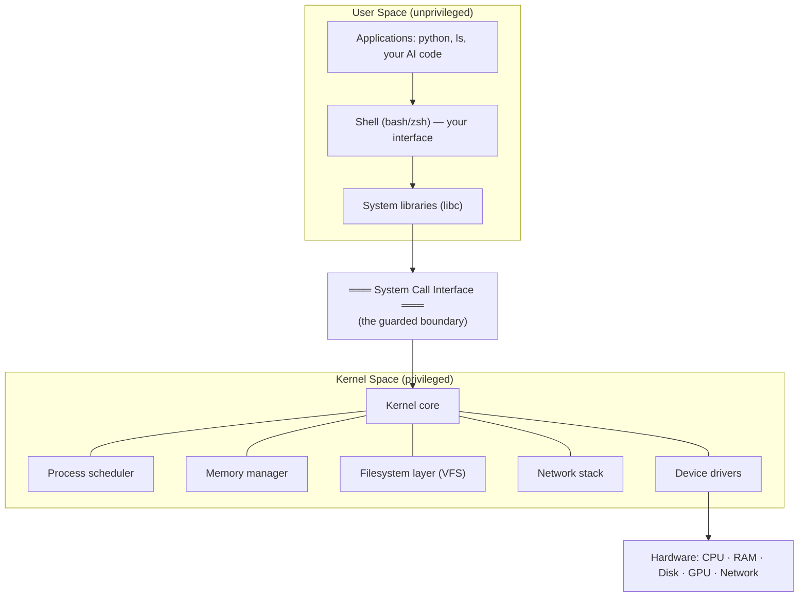
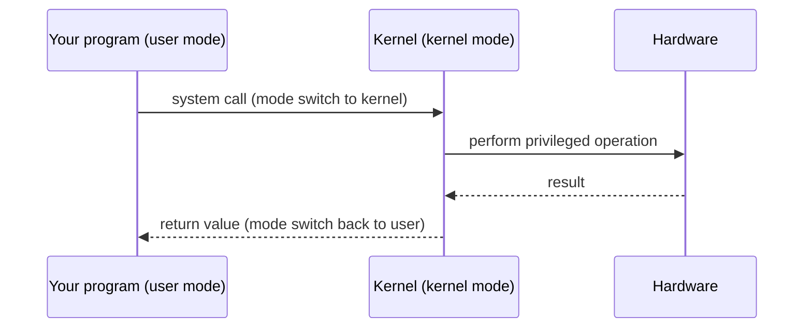
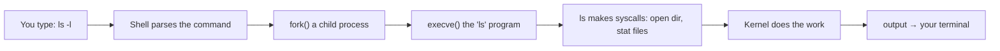
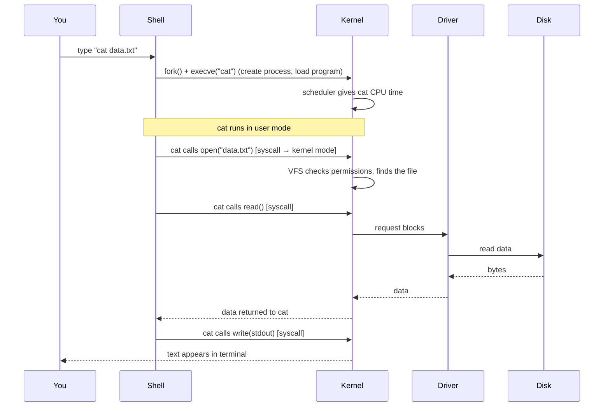

<!-- Module 03 · Lesson 2 — follows ../../../standards/. -->

# 03.2 · Linux Architecture

[⬅ 03.1 Introduction](03.1-introduction.md) · [🏠 Module](../README.md) · [🗺 Roadmap](../../../ROADMAP.md) · [Next ➡](03.3-filesystem.md)

> How Linux is built inside: the kernel and user space, separated by system calls; the shell as your interface; the scheduler and drivers. Trace a single command from your keystroke down to the hardware and back — the mental model that makes everything else in this module make sense.

| | |
|---|---|
| **Module** | `03 · Linux for AI Engineers` |
| **Lesson** | `03.2` |
| **Difficulty** | ⭐⭐⭐ |
| **Estimated study time** | 55 min read |
| **Status** | 🟢 stable |

---

## 1. Learning Objectives

By the end of this lesson you will be able to:

- [ ] Explain the **kernel / user-space** split and why it exists.
- [ ] Describe the roles of the **shell, system calls, device drivers,** and **scheduler**.
- [ ] Trace how a **user command** travels through the OS to hardware and back.
- [ ] Explain **kernel mode vs user mode** and why it matters for stability and security.

## 2. Prerequisites

- [03.1 Introduction](03.1-introduction.md) and [Module 02.6 · Operating Systems](../../02-Computer-Science/weeks/02.6-operating-systems.md) (processes, virtual memory, scheduling).

---

## 3. Why This Topic Exists

If you treat Linux as a bag of commands, you'll memorize a lot and understand little. But Linux has a clean, layered architecture, and once you see it, every command, permission, and error message has a *place* in your mental model. "Why did that need `sudo`?" "Why is the kernel version separate from the OS?" "What actually happens when I run `ls`?" — all answered by the architecture.

For debugging especially, knowing the layers is gold: you can reason about whether a problem is in your program (user space), the shell, a system call, a driver, or the kernel itself — and that tells you where to look.

> [!IMPORTANT]
> The single most important architectural idea: **there's a protected boundary between your programs (user space) and the core that controls hardware (the kernel).** Programs can't touch hardware directly; they *ask* the kernel via **system calls**. This boundary is what makes Linux stable and secure — a buggy program can crash itself without crashing the machine.

## 4. Mental Model: A Restaurant

Think of Linux as a restaurant:

- **You (the user)** place orders via the **shell** (the waiter takes your request in a language you speak).
- The **kernel** is the kitchen — it does the real work and controls the equipment (hardware).
- **System calls** are the order tickets — the strict, formal interface between the dining room (user space) and the kitchen (kernel).
- **Device drivers** are the specialized cooks who know how to operate each specific appliance (GPU, disk, network card).
- The **scheduler** is the kitchen manager deciding which order to work on next.

You never walk into the kitchen and grab the stove — you submit a ticket, and the kitchen serves you back. That controlled boundary is the whole point.



> **Illustration placeholder** — `assets/images/linux-architecture-layers.png`: concentric rings — hardware at the center, then kernel (scheduler/memory/FS/network/drivers), a bold "system call" boundary ring, then user space (libraries, shell, applications) on the outside — emphasizing the guarded boundary.

---

## 5. The Kernel — The Core

The **kernel** is the heart of Linux: a program that boots first, stays resident, and mediates *all* access to hardware. Its responsibilities map exactly to the OS jobs from [Module 02.6](../../02-Computer-Science/weeks/02.6-operating-systems.md):

| Kernel subsystem | Responsibility |
|---|---|
| **Process scheduler** | Decides which process runs on which CPU core, when ([02.6](../../02-Computer-Science/weeks/02.6-operating-systems.md)) |
| **Memory manager** | Virtual memory, paging, per-process address spaces ([02.6](../../02-Computer-Science/weeks/02.6-operating-systems.md)) |
| **Filesystem layer (VFS)** | A uniform interface over many filesystem types ([03.3](03.3-filesystem.md), [03.10](03.10-storage.md)) |
| **Network stack** | TCP/IP, sockets ([03.9](03.9-networking.md), [Module 02.7](../../02-Computer-Science/weeks/02.7-networking.md)) |
| **Device drivers** | Code that operates specific hardware (GPU, disk, NIC) |

> [!NOTE]
> Linux uses a **monolithic kernel** (with loadable modules): the core subsystems run together in kernel space for performance, but drivers and features can be loaded/unloaded as **modules** at runtime (`lsmod`, `modprobe`). This is how, for example, the **NVIDIA GPU driver** is added — it's a kernel module. When a GPU "isn't detected," a missing/mismatched kernel module is a common cause.

---

## 6. Kernel Mode vs User Mode

The CPU itself supports (at least) two privilege levels, and Linux uses them for the user/kernel boundary:

| | User mode | Kernel mode |
|---|---|---|
| Privilege | Restricted | Full hardware access |
| Runs | Your applications, shell | The kernel |
| Can access hardware directly? | ❌ No (must use syscalls) | ✅ Yes |
| A crash here… | Kills just that process | Can crash the whole system (kernel panic) |



> [!IMPORTANT]
> This two-mode design is *why Linux is robust*: a bug in your Python script or a crashing container can't corrupt the kernel or other users' processes — the hardware enforces the boundary. It's also a security cornerstone (privilege separation, [03.6](03.6-permissions.md)). A **kernel panic** (the kernel itself failing) is rare and serious — it takes down the machine, unlike an ordinary process crash.

---

## 7. System Calls — The Guarded Doorway

A **system call (syscall)** is how a user-space program requests a privileged service from the kernel: "open this file," "send these bytes over the network," "create a process," "allocate memory." It's the *only* legitimate way across the boundary.

| Common syscall | What it does | Command that uses it |
|---|---|---|
| `open`, `read`, `write`, `close` | File I/O | `cat`, `cp` ([03.5](03.5-essential-commands.md)) |
| `fork`, `execve`, `exit`, `wait` | Process creation/control | running any program ([03.7](03.7-processes.md)) |
| `mmap`, `brk` | Memory allocation | Python allocating memory ([02.2](../../02-Computer-Science/weeks/02.2-memory.md)) |
| `socket`, `connect`, `send`, `recv` | Networking | `curl`, API calls ([03.9](03.9-networking.md)) |
| `stat` | File metadata | `ls -l` ([03.3](03.3-filesystem.md)) |

```python
# In Python, open() is a thin wrapper over the open/read syscalls:
with open("data.txt") as f:      # → open() syscall
    data = f.read()              # → read() syscall
# Your code never touches the disk directly — the kernel does, via drivers.
```

> [!TIP]
> You can *watch* system calls with **`strace`** — a genuinely useful debugging tool. `strace python script.py` shows every syscall the program makes (files opened, network connections, etc.). When a program mysteriously fails (permission denied? missing file? which config did it read?), `strace` reveals exactly what it *tried* to do at the kernel boundary. This is the [Module 02.6/02.12](../../02-Computer-Science/weeks/02.6-operating-systems.md) `strace` tool, now grounded in why it works.

---

## 8. The Shell — Your Interface to the Kernel

The **shell** is a program that reads your typed commands, interprets them, and asks the kernel to run programs on your behalf. It's your primary interface in this module (deep dive in [03.4](03.4-terminal-mastery.md)).



- The shell is *itself* just a user-space program (`bash`, `zsh`) — not part of the kernel.
- It runs programs by asking the kernel to `fork` a new process and `execve` the program in it ([03.7](03.7-processes.md)).
- Its power comes from **composing** programs (pipes, redirection — [03.4](03.4-terminal-mastery.md)) — the Unix philosophy from [03.1](03.1-introduction.md) in action.

---

## 9. Tracing a Command End-to-End

Let's follow `cat data.txt` all the way down and back — the payoff of this lesson:



Every step touches a concept in this module: the shell ([03.4](03.4-terminal-mastery.md)), process creation ([03.7](03.7-processes.md)), the scheduler ([02.6](../../02-Computer-Science/weeks/02.6-operating-systems.md)), syscalls (this lesson), permissions ([03.6](03.6-permissions.md)), the filesystem/VFS ([03.3](03.3-filesystem.md)), and drivers. **This single trace is the skeleton of the whole module.**

---

## 10. Common Mistakes & Misconceptions

| Mistake / myth | Reality |
|---|---|
| "The shell is part of the kernel" | The shell is an ordinary user-space program |
| "Programs access hardware directly" | Only the kernel does; programs use syscalls |
| "sudo makes me the kernel" | `sudo` runs as the privileged *user* (root); the kernel boundary still applies |
| "A crashed program can crash Linux" | User-mode crashes are isolated; only kernel bugs panic the system |
| "The kernel version is the distro version" | Kernel and distro version independently ([03.1](03.1-introduction.md)) |

> [!WARNING]
> A common confusion: **root (superuser) is not the same as kernel mode.** `root` is a powerful *user* in user space with permission to do almost anything (including load kernel modules), but its programs still run in user mode and still go through syscalls. The kernel/user boundary is enforced by the CPU regardless of which user you are. (Though root *can* load kernel modules that then run in kernel mode — which is why a malicious module is so dangerous, [03.15](03.15-security.md).)

---

## 11. Performance Considerations

| Principle | Takeaway |
|---|---|
| Syscalls have overhead | Each crosses the user↔kernel boundary (a mode switch) — batching I/O reduces them |
| Context switches | The scheduler switching processes costs cache ([02.6](../../02-Computer-Science/weeks/02.6-operating-systems.md)) |
| Kernel bypass (advanced) | High-performance networking/GPU sometimes minimizes syscalls |
| Drivers matter | The right GPU driver/kernel module is essential for AI performance |

> [!NOTE]
> Syscall overhead is why, e.g., reading a file byte-by-byte (one `read` syscall each) is far slower than reading in large chunks (buffering) — a real performance lesson that echoes [Module 01.5's](../../01-Advanced-Python/weeks/01.5-iterators-generators.md) buffered file iteration. The kernel boundary isn't free; cross it deliberately.

## 12. Security Considerations

| Topic | Note |
|---|---|
| Privilege separation | User/kernel + user permissions isolate faults and limit blast radius ([03.6](03.6-permissions.md)) |
| Syscall filtering (seccomp) | Containers restrict which syscalls a process may make — a key sandboxing tool ([03.16](03.16-docker-preparation.md)) |
| Kernel modules | Loading a malicious module = full system compromise; restrict who can |
| Kernel vulnerabilities | Kernel bugs can breach isolation — keep it patched ([03.15](03.15-security.md)) |

> [!IMPORTANT]
> The syscall boundary is a **security control**, not just an architecture. **seccomp** (used by Docker) filters the syscalls a container can make, shrinking the attack surface — if a container can't call dangerous syscalls, an exploit inside it is far more contained. This is a preview of container security in [03.16](03.16-docker-preparation.md).

## 13. Interview Questions

**Beginner**
1. What is the difference between user space and kernel space?
2. What is a system call, and why can't programs skip it?

**Intermediate**
1. Trace what happens when you run a simple command like `ls`.
2. Why does the user/kernel boundary make Linux stable and secure?

**Advanced**
1. What's the difference between `root` and kernel mode?
2. How do syscalls relate to container security (seccomp) and to performance?

**System-design prompt**
- A GPU isn't detected on a Linux training server. Using the architecture (kernel modules, drivers, syscalls), walk through how you'd diagnose it. — *Follow-ups:* Where do drivers fit? How would `strace`/`dmesg` help?

## 14. Summary

| Key idea | Takeaway |
|---|---|
| Layered architecture | User space ↔ (syscalls) ↔ kernel ↔ hardware |
| Kernel | Manages processes, memory, filesystems, network, devices |
| User vs kernel mode | Hardware-enforced boundary → stability & security |
| System calls | The only guarded doorway to privileged services |
| Shell | A user-space program that runs commands via the kernel |
| Drivers | Kernel modules operating specific hardware (e.g., GPU) |

## 15. Cheat Sheet

```text
LAYERS: [user space: apps · shell · libc] —(SYSCALLS)→ [kernel: scheduler·memory·VFS·network·drivers] → hardware
KERNEL: monolithic + loadable MODULES (e.g. NVIDIA driver = kernel module; lsmod/modprobe)
MODES: user mode (restricted, crashes isolated) vs kernel mode (full hw access, panic=whole system)
SYSCALL: only legit way across the boundary — open/read/write, fork/execve, mmap, socket, stat
  watch them: strace <program>   (debug "what did it try to do?")
SHELL: user-space program (bash/zsh) → fork()+execve() to run commands
ROOT ≠ kernel mode: root is a powerful USER; boundary still enforced by CPU
SECURITY: seccomp filters container syscalls · PERF: syscalls cost a mode switch → buffer I/O
TRACE: type cmd → shell fork/exec → scheduler → syscalls (open/read) → VFS/perms → driver → disk → write→ terminal
```

## 16. Flashcards

- **Q:** What separates user space and kernel space, and why? — **A:** The system-call boundary (hardware-enforced privilege levels); it isolates faults and controls hardware access for stability and security.
- **Q:** What is a system call? — **A:** A request from a user-space program to the kernel for a privileged service (file I/O, process creation, networking, memory) — the only legitimate way across the boundary.
- **Q:** How is the NVIDIA GPU driver added to Linux? — **A:** As a loadable **kernel module** — which is why a missing/mismatched module is a common "GPU not detected" cause.
- **Q:** Is `root` the same as kernel mode? — **A:** No — root is a powerful *user* running in user mode; the kernel/user boundary is enforced by the CPU regardless of user.
- **Q:** What does `strace` do and why is it useful? — **A:** Traces every system call a program makes, revealing what it actually tried to do at the kernel boundary — invaluable for debugging permission/file/config issues.
- **Q:** What is the shell, architecturally? — **A:** An ordinary user-space program that parses your commands and asks the kernel (via fork/execve) to run programs.

## 17. Hands-on Exercises

> Full set in [`../exercises/`](../exercises/).

- [ ] **(⭐ Explore)** Run `uname -r` (kernel version) and `lsmod` (loaded modules); identify a few modules and what hardware they support.
- [ ] **(⭐⭐ Observe)** Run `strace -c ls` and read the summary of syscalls; identify `openat`, `read`, `write`, `stat`.
- [ ] **(⭐⭐ Trace)** Draw the user→kernel→hardware path for `cat file.txt` from memory, labeling each syscall.
- [ ] **(⭐⭐⭐ Debug)** Use `strace` on a command that fails with "permission denied" or "no such file"; find the exact failing syscall and fix the cause.

## 18. Mini Project

> **Syscall explorer.** Write notes/a script that runs `strace` on a few common commands (`ls`, `cat`, `python -c 'print(1)'`, a `curl`) and summarizes the *categories* of syscalls each makes (file, process, network, memory). Produce a short report mapping observed syscalls to the architecture layers in this lesson. This builds real intuition for what programs actually ask the kernel to do — and makes you dangerous with `strace` for debugging.

## 19. References

- Robert Love, *Linux Kernel Development* — accessible kernel internals ([reference standards](../../../standards/reference-standards.md)).
- *The Linux Programming Interface* (Kerrisk) — the definitive syscall reference.
- `man syscalls`, `man strace` on any Linux system.

## 20. What's Next

You understand how the OS is structured. Now the most-touched kernel subsystem for an AI Engineer: **the filesystem** — the directory hierarchy, mounts, links, and inodes where datasets and models live.

➡️ **Next:** [03.3 · The Filesystem](03.3-filesystem.md)

---

### 🔁 Revision checklist
- [ ] I can draw the user-space / kernel / hardware layers
- [ ] I can explain system calls and the user/kernel mode boundary
- [ ] I can trace a command end-to-end through the OS
- [ ] I used `strace` to observe real syscalls

### 🔗 Spaced-repetition callback
> Recall [Module 02.6's scheduling and virtual memory](../../02-Computer-Science/weeks/02.6-operating-systems.md): those *are* kernel subsystems shown here in the architecture. And [02.12's `strace`](../../02-Computer-Science/weeks/02.12-debugging.md) now has a "why" — it observes the syscall boundary this lesson defines. Module 02 concepts become Module 03 operational reality.
