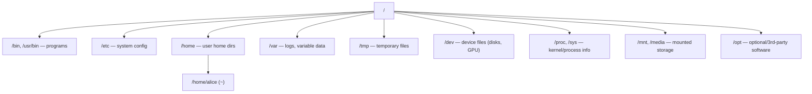
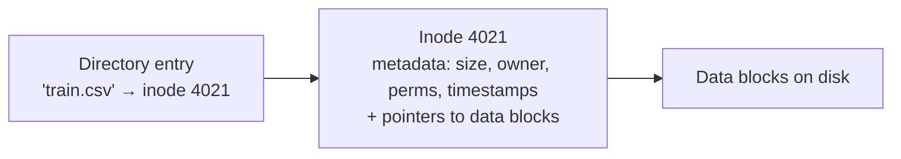

<!-- Module 03 · Lesson 3 — follows ../../../standards/. -->

# 03.3 · The Filesystem

[⬅ 03.2 Architecture](03.2-architecture.md) · [🏠 Module](../README.md) · [🗺 Roadmap](../../../ROADMAP.md) · [Next ➡](03.4-terminal-mastery.md)

> In Linux, *everything is a file* — data, devices, even processes. This lesson maps the directory hierarchy (where datasets, models, configs, and logs live), and explains mounts, links, and inodes so you can organize AI data sanely and never be lost in the filesystem again.

| | |
|---|---|
| **Module** | `03 · Linux for AI Engineers` |
| **Lesson** | `03.3` |
| **Difficulty** | ⭐⭐ |
| **Estimated study time** | 55 min read |
| **Status** | 🟢 stable |

---

## 1. Learning Objectives

By the end of this lesson you will be able to:

- [ ] Navigate the **Linux directory hierarchy** and know what lives where.
- [ ] Distinguish the **root** (`/`) and **home** (`~`) directories.
- [ ] Explain **mount points** and how storage attaches into one tree.
- [ ] Explain **inodes, file metadata,** and **symbolic vs hard links**.
- [ ] Organize **datasets and models** following Linux conventions.

## 2. Prerequisites

- [03.2 Architecture](03.2-architecture.md) (the VFS/filesystem layer) and [Module 02.10 · File Systems](../../02-Computer-Science/weeks/02.10-file-systems.md) (inodes, links, permissions — the CS foundation this makes concrete on Linux).

---

## 3. Why This Topic Exists

You'll spend enormous time navigating and organizing files: finding a dataset, locating a config, checking where logs go, figuring out why `/` is full. Without a map of the filesystem, you'll flail. With one, you move confidently and organize AI projects in ways that scale and that others (and future-you) understand.

The Linux filesystem also embodies a deep design idea — **"everything is a file"** — that unifies data, devices, and even kernel information under one interface. Understanding it demystifies things like `/dev/nvidia0` (your GPU as a file) and `/proc` (process info as files).

> [!IMPORTANT]
> **"Everything is a file"** is Linux's unifying abstraction: regular files, directories, devices (`/dev/sda`, `/dev/nvidia0`), and even running-system state (`/proc`, `/sys`) are all accessed through the same file interface (open/read/write, [03.2](03.2-architecture.md)). This is why the same tools (`cat`, `ls`, redirection) work on data *and* devices *and* system info — a remarkably powerful simplification.

## 4. Problems It Solves

| Problem | Filesystem knowledge solves it by |
|---|---|
| "Where do I put datasets/models/configs?" | Knowing the conventional hierarchy |
| "Where do logs live?" | `/var/log` and journald ([03.11](03.11-logs.md)) |
| "`/` is full — what's eating it?" | Understanding mounts & directories ([03.10](03.10-storage.md)) |
| "How do I access the GPU/devices?" | `/dev` device files |
| "Path works here, not there" | Absolute vs relative paths |

---

## 5. Mental Model: One Unified Tree

Unlike Windows (with separate drives `C:`, `D:`), Linux has **a single tree** rooted at `/`. Every storage device, partition, and even network share is **mounted** into a directory within that one tree. There's no "drive letter" — there's just the tree, and things are attached to it.



> **Illustration placeholder** — `assets/images/linux-fhs-tree.png`: a clean directory tree from `/` showing the standard top-level directories with a one-line purpose label on each, and a mounted extra disk (e.g. a data volume) attached at `/data` to illustrate mounting into the single tree.

---

## 6. The Directory Hierarchy (FHS)

Linux follows the **Filesystem Hierarchy Standard (FHS)** — conventions for what goes where. You don't memorize all of it, but know the ones you'll use constantly.

| Directory | Purpose | AI Engineer relevance |
|---|---|---|
| `/` | Root of everything | The base of the tree |
| `/home/<user>` (`~`) | Personal files, per user | Your code, notebooks, small data |
| `/root` | The **root user's** home (not `/`!) | Admin's home |
| `/etc` | System-wide configuration (text files) | Service configs, `/etc/hosts` ([03.9](03.9-networking.md)) |
| `/var` | Variable data — logs, caches, spools | `/var/log` for logs ([03.11](03.11-logs.md)) |
| `/tmp` | Temporary files (often cleared on reboot) | Scratch space (don't store anything important) |
| `/usr` | User programs & libraries | `/usr/bin` (commands), `/usr/local` (manually installed) |
| `/bin`, `/sbin` | Essential system binaries | Core commands |
| `/opt` | Optional/third-party software | Some ML tools install here |
| `/dev` | Device files | `/dev/nvidia0` (GPU!), `/dev/sda` (disk) |
| `/proc`, `/sys` | Virtual FS: live kernel/process info | `cat /proc/cpuinfo`, `/proc/meminfo` |
| `/mnt`, `/media` | Mount points for extra/removable storage | Attached data volumes |

> [!TIP]
> Where should *AI* data go? Conventionally, **large datasets and models live on a dedicated data volume** (e.g., mounted at `/data` or `/mnt/data`), *not* in `/home` (which is often small) or `/tmp` (ephemeral). Code lives in `/home/<user>/project` or `/opt`. Logs go to `/var/log`. Configs in `/etc` (system) or the project directory. Following these conventions means anyone can find things, and you won't fill up the wrong partition ([03.10](03.10-storage.md)).

> [!WARNING]
> **`/root` is the root user's home directory, not the filesystem root `/`.** Beginners confuse them. And **`/tmp` is not safe storage** — it's often wiped on reboot and shared by all users. Never leave a dataset or checkpoint in `/tmp` expecting it to persist.

---

## 7. Absolute vs Relative Paths

| Path type | Starts from | Example |
|---|---|---|
| **Absolute** | The root `/` | `/home/alice/data/train.csv` |
| **Relative** | Current directory | `data/train.csv`, `../models` |
| **Home shortcut** | `~` = your home dir | `~/project` = `/home/alice/project` |
| **Current / parent** | `.` = here, `..` = up one | `./run.sh`, `../` |

> [!IMPORTANT]
> **Use absolute paths in production scripts, configs, and services** (recall [Module 02.10](../../02-Computer-Science/weeks/02.10-file-systems.md)). A relative path depends on the current working directory, so a script that works when you run it from one folder breaks when a service (like systemd, [03.8](03.8-services-systemd.md)) runs it from another. "Works when I run it, fails as a service" is very often a relative-path bug. Use `pwd` to see where you are.

---

## 8. Inodes and File Metadata

Recall from [Module 02.10](../../02-Computer-Science/weeks/02.10-file-systems.md): a filename is just a label; the actual file is tracked by an **inode** — a structure holding the file's *metadata* and pointers to its data blocks. Crucially, **the filename is not stored in the inode** — a directory is a mapping of names → inode numbers.



**Metadata** an inode holds (view with `ls -l` and `stat`):

| Metadata | Shown by |
|---|---|
| Size | `ls -l`, `stat` |
| Owner & group | `ls -l` ([03.6](03.6-permissions.md)) |
| Permissions | `ls -l` (`-rw-r--r--`) |
| Timestamps (modified/accessed/changed) | `stat` |
| Link count | `ls -l` (number after permissions) |
| Inode number | `ls -i` |

```bash
stat train.csv          # full metadata for a file
ls -li train.csv        # inode number + long listing
```

> [!NOTE]
> Because the name→inode mapping lives in the directory (not the inode), you can have **multiple names for one inode** (hard links, §9), and renaming/moving a file *within a filesystem* is cheap — it just updates a directory entry, not the data. This also explains a classic gotcha: **"disk full" but `df` shows free space** can mean you're out of **inodes** (too many tiny files), not out of blocks — check `df -i` ([03.10](03.10-storage.md)).

---

## 9. Symbolic Links and Hard Links

Two ways to have more than one name for file data ([Module 02.10](../../02-Computer-Science/weeks/02.10-file-systems.md), now with commands):

| | Symbolic (soft) link | Hard link |
|---|---|---|
| Points to | A **path/name** | The **inode** (data) |
| Command | `ln -s target linkname` | `ln target linkname` |
| Across filesystems | ✅ Yes | ❌ No (same FS only) |
| If target deleted | Dangles (broken) | Data survives until all links gone |
| Can link directories | ✅ Yes | ❌ Usually not |
| Shown in `ls -l` | `link -> /path/to/target` | Just a normal file (link count > 1) |

```bash
ln -s /data/models/v3 /home/alice/current-model   # symlink: 'current-model' → v3
ls -l /home/alice/current-model                    # shows: current-model -> /data/models/v3
```

> [!IMPORTANT]
> **The killer AI use of symlinks** (from [Module 02.10](../../02-Computer-Science/weeks/02.10-file-systems.md), now concrete): a `current` symlink pointing at the active model version. Deploy `v4` to a new directory, then atomically repoint the symlink (`ln -sfn /data/models/v4 current`) — instant switch, instant rollback, no copying gigabytes. Package managers, Python environments (`python` → a specific version), and dataset caches all use symlinks to share large files without duplication. A **broken symlink** (`ls` shows a red/dangling `->`) is a common cause of "file not found."

---

## 10. `/proc` and `/dev` — Files That Aren't Really Files

Two special directories showcase "everything is a file":

| Virtual FS | Contains | Example |
|---|---|---|
| `/proc` | Live process & kernel info (generated on read) | `cat /proc/cpuinfo`, `/proc/meminfo`, `/proc/<pid>/status` |
| `/sys` | Kernel/device settings | Hardware config knobs |
| `/dev` | Device files | `/dev/nvidia0` (GPU), `/dev/sda` (disk), `/dev/null` (discard) |

```bash
cat /proc/cpuinfo | grep "model name" | head -1   # CPU model — no special tool needed
cat /proc/meminfo | grep MemTotal                 # total RAM
ls /dev/nvidia*                                    # GPU device files (if present)
echo "junk" > /dev/null                            # /dev/null = the black hole
```

> [!TIP]
> `/dev/null` is the "black hole" — anything written to it vanishes. You'll use it constantly to discard unwanted output: `command > /dev/null 2>&1` runs a command silently ([03.4](03.4-terminal-mastery.md)). And `/proc` is a goldmine for scripting system info without special tools — `cat /proc/meminfo` for memory, `/proc/loadavg` for load. These "files" are the kernel exposing its state through the filesystem interface.

---

## 11. Common Mistakes & Debugging

| Mistake | Consequence | Fix |
|---|---|---|
| Confusing `/` and `/root` | Wrong directory | `/` is the tree root; `/root` is root user's home |
| Storing data in `/tmp` | Lost on reboot | Use `/data` or `~/project` |
| Relative paths in services | "Works manually, fails as a service" | Absolute paths ([03.8](03.8-services-systemd.md)) |
| Filling `/` (root partition) | System instability | Store big data on a separate mount ([03.10](03.10-storage.md)) |
| "Disk full" but `df` shows space | Out of **inodes** (many small files) | `df -i`; pack files ([03.10](03.10-storage.md)) |
| Broken symlink | "No such file" | `ls -l` to see the dangling target; repoint it |

> [!WARNING]
> A production-classic: **filling the root partition (`/`)** — e.g., logs or a dataset written to `/` instead of a data volume — can make the whole system unstable or unbootable. Keep large, growing data on a **separate mounted volume**, and monitor with `df -h` ([03.10](03.10-storage.md), [03.14](03.14-performance-monitoring.md)). Running out of disk on `/` is one of the most common causes of a Linux server "suddenly breaking."

## 12. Performance Considerations

| Principle | Takeaway |
|---|---|
| Many small files are slow | Inode/metadata overhead; pack datasets ([02.10](../../02-Computer-Science/weeks/02.10-file-systems.md)) |
| Data locality | Put hot data on fast storage (NVMe), mounted appropriately ([03.10](03.10-storage.md)) |
| `/tmp` on RAM (tmpfs) | Sometimes `/tmp` is RAM-backed — fast but volatile and RAM-limited |
| Symlinks are cheap | Version-swap via symlink beats copying |

## 13. Security Considerations

| Risk | Guidance |
|---|---|
| World-readable data in shared dirs | Set permissions ([03.6](03.6-permissions.md)); secrets not in world-readable paths |
| Symlink attacks (TOCTOU) | Untrusted symlinks can redirect operations — validate targets ([02.10](../../02-Computer-Science/weeks/02.10-file-systems.md)) |
| Path traversal | Validate user-supplied paths stay within a base ([02.10](../../02-Computer-Science/weeks/02.10-file-systems.md)) |
| Sensitive files in `/tmp` | Shared, world-accessible — never put secrets there |
| Device files (`/dev`) | Access to raw devices = access to raw data; restrict |

> [!CAUTION]
> Never place secrets (API keys, credentials) in world-readable locations or `/tmp`. Keep them in files with restrictive permissions (`chmod 600`, owned by the service user, [03.6](03.6-permissions.md)/[03.15](03.15-security.md)) or a secrets manager. And be wary of following untrusted symlinks in scripts — a classic privilege-escalation vector.

## 14. Interview Questions

**Beginner**
1. What's the difference between `/`, `/root`, and `~`?
2. What does "everything is a file" mean in Linux?

**Intermediate**
1. What is an inode, and why isn't the filename stored in it?
2. Where would you store datasets, models, code, logs, and configs on a Linux server, and why?

**Advanced**
1. You get "disk full" but `df` shows free space. What's likely wrong and how do you confirm?
2. Explain how a `current` symlink enables atomic model deployment and rollback.

**System-design prompt**
- Design the filesystem layout for a GPU server used for training and serving models. — *Follow-ups:* Where do datasets/models/logs live? Why a separate data volume? How do you handle model versioning with symlinks?

## 15. Summary

| Key idea | Takeaway |
|---|---|
| One unified tree | Rooted at `/`; storage is mounted in |
| Everything is a file | Data, devices (`/dev`), kernel info (`/proc`) |
| FHS conventions | `/home`, `/etc`, `/var/log`, `/data`, `/dev` |
| Absolute paths in prod | Relative paths break under services |
| Inodes | Hold metadata; names live in directories |
| Symlinks | Atomic version swaps; don't duplicate big files |

## 16. Cheat Sheet

```text
ONE TREE rooted at / · storage MOUNTED in (no drive letters) · "everything is a file"
KEY DIRS: /home/<you>(~) code · /root(root's home ≠ /) · /etc config · /var/log logs
  /tmp scratch(volatile!) · /usr,/bin programs · /dev devices(/dev/nvidia0 GPU, /dev/null)
  /proc,/sys live kernel/process info · /mnt,/data mounted storage
PATHS: absolute /a/b (use in prod!) · relative a/b · ~ home · . here · .. up
INODE = metadata (size/owner/perms/times/links) + block pointers ; name lives in the DIRECTORY
  stat file · ls -li (inode#) · df -i (inode usage — "disk full" w/ free space!)
LINKS: ln -s target link (SYMLINK → path; atomic version swap: ln -sfn v4 current)
       ln target link (HARD → inode, same FS)
SPECIAL: cat /proc/meminfo · /proc/cpuinfo · echo x >/dev/null (discard) · cmd >/dev/null 2>&1 (silent)
AI LAYOUT: datasets/models → /data (separate volume) · code → ~/project · logs → /var/log · NOT /tmp
```

## 17. Flashcards

- **Q:** How is the Linux filesystem structured vs Windows? — **A:** A single tree rooted at `/`; all storage is mounted into it (no drive letters like `C:`).
- **Q:** What does "everything is a file" mean? — **A:** Data, directories, devices (`/dev`), and kernel/process state (`/proc`) are all accessed through the same file interface.
- **Q:** What is an inode, and where does the filename live? — **A:** The inode holds a file's metadata + block pointers; the filename→inode mapping lives in the directory, not the inode.
- **Q:** Why use absolute paths in production? — **A:** Relative paths depend on the current directory, so scripts/services run from a different directory break; absolute paths are unambiguous.
- **Q:** AI use of a `current` symlink? — **A:** Point it at the active model version; atomically repoint (`ln -sfn`) to deploy/rollback instantly without copying data.
- **Q:** "Disk full" but `df` shows free space — cause? — **A:** Likely out of inodes (too many small files); confirm with `df -i`.

## 18. Hands-on Exercises

> Full set in [`../exercises/`](../exercises/).

- [ ] **(⭐ Explore)** Navigate to `/`, `/etc`, `/var/log`, `/home`, `/proc`; `ls` each and note what's there.
- [ ] **(⭐ Info)** `cat /proc/cpuinfo`, `/proc/meminfo`; `stat` a file and read its metadata; `ls -li` to see inodes.
- [ ] **(⭐⭐ Links)** Create a symlink to a directory with `ln -s`; delete the target and observe the dangling link; repoint it with `ln -sfn`.
- [ ] **(⭐⭐ Organize)** Design and create a sensible directory layout for a fake AI project (data/, models/, code/, logs/); justify each location.
- [ ] **(⭐⭐⭐ Debug)** Simulate the inode-exhaustion scenario conceptually: create many tiny files and observe `df -i` vs `df -h`.

## 19. Mini Project

> **Dataset organizer (this module's showcase, v1).** Build a script that takes a messy directory of data files and organizes them into a clean, conventional layout (by type/date), reports sizes with `du`, uses symlinks for a `latest` pointer, and warns if the target volume is low on space (`df`). Include a diagram of the target structure. This is a real, reusable tool and applies the whole lesson.

## 20. References

- Filesystem Hierarchy Standard (FHS) official specification ([reference standards](../../../standards/reference-standards.md)).
- *The Linux Command Line* (Shotts) — filesystem chapters.
- `man hier` (the filesystem hierarchy), `man inode`, `man ln` on any Linux system.

## 21. What's Next

You can navigate the filesystem. Now master the tool you navigate it *with*: **the terminal and shell** — bash/zsh, environment variables, PATH, pipes, redirection, and wildcards — the productivity multiplier of Linux.

➡️ **Next:** [03.4 · Terminal Mastery](03.4-terminal-mastery.md)

---

### 🔁 Revision checklist
- [ ] I can navigate the hierarchy and know what lives where
- [ ] I understand inodes, metadata, and name→inode mapping
- [ ] I can create and repoint symlinks for versioning
- [ ] I know where AI datasets/models/logs/configs belong

### 🔗 Spaced-repetition callback
> Recall [Module 02.10's file systems](../../02-Computer-Science/weeks/02.10-file-systems.md): inodes, permissions, symlinks, and atomic writes were the *concepts*; here they're the Linux *commands* (`stat`, `ln -s`, `df -i`). And [03.2's "everything is a file"](03.2-architecture.md) explains why `cat /proc/meminfo` works — the kernel exposing state through the file interface.
