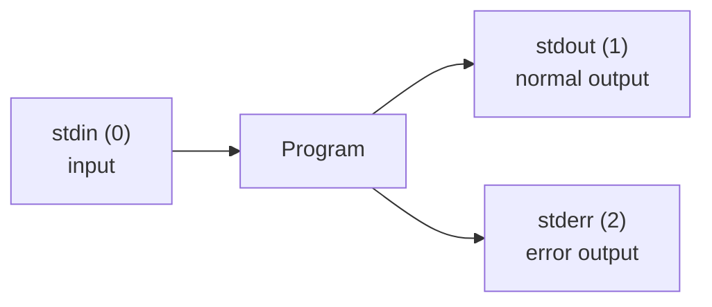
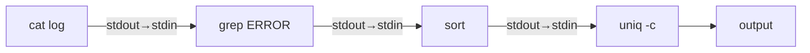
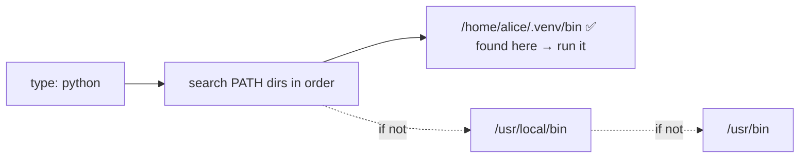

<!-- Module 03 · Lesson 4 — follows ../../../standards/. -->

# 03.4 · Terminal Mastery

[⬅ 03.3 Filesystem](03.3-filesystem.md) · [🏠 Module](../README.md) · [🗺 Roadmap](../../../ROADMAP.md) · [Next ➡](03.5-essential-commands.md)

> The shell isn't a place to type commands — it's a *programming environment for composing tools*. This lesson teaches the mechanics that make the terminal a superpower: the shell itself, environment variables, PATH, pipes, redirection, and wildcards. Master these and simple commands become a data-processing language.

| | |
|---|---|
| **Module** | `03 · Linux for AI Engineers` |
| **Lesson** | `03.4` |
| **Difficulty** | ⭐⭐⭐ |
| **Estimated study time** | 60 min read · 40 min practice |
| **Status** | 🟢 stable |

---

## 1. Learning Objectives

By the end of this lesson you will be able to:

- [ ] Explain what a **shell** is and compare **bash** and **zsh**.
- [ ] Use **environment variables** and understand **PATH**.
- [ ] Compose commands with **pipes** and **redirection**.
- [ ] Use **wildcards (globbing)** to operate on many files.
- [ ] Use **aliases** and **command history** to work faster.

## 2. Prerequisites

- [03.2 Architecture](03.2-architecture.md) (the shell as a user-space program) and [03.3 Filesystem](03.3-filesystem.md) (paths).

---

## 3. Why This Topic Exists

Beginners use the terminal as a slow way to do what a GUI does. Experts use it as a *composition engine*: chaining small, single-purpose tools into pipelines that process gigabytes, automate deployments, and debug production — things a GUI can't do at all. The difference isn't knowing more commands; it's understanding **pipes, redirection, and variables** — the connective tissue that turns commands into programs.

This is the lesson that makes the terminal *fast*. Everything after it (commands in [03.5](03.5-essential-commands.md), scripting in [03.12](03.12-bash-scripting.md)) builds on this composition model.

> [!IMPORTANT]
> The Unix philosophy from [03.1](03.1-introduction.md) — small tools, one job each — only pays off because of **pipes**. `grep` finds lines, `sort` sorts, `uniq` counts, `head` limits — individually modest, but piped together (`grep ERROR log | sort | uniq -c | sort -rn | head`) they become a bespoke log analyzer you wrote in one line. Composition is the terminal's superpower. Learn it and you'll reach for the terminal *first*.

## 4. The Shell: bash and zsh

The **shell** is the program that reads your commands and runs them ([03.2](03.2-architecture.md)). Several exist; two matter.

| | bash | zsh |
|---|---|---|
| Ubiquity | Default on most Linux servers | Default on modern macOS; popular via Oh My Zsh |
| Scripting | The lingua franca — scripts assume bash | Compatible-ish, but scripts should target bash |
| Interactive features | Solid | Better completion, themes, plugins |
| For this module | **Learn bash** | Fine to *use* interactively |

> [!TIP]
> **Learn bash for scripting** — it's what servers, Docker images, and CI run, so your scripts must be bash-compatible ([03.12](03.12-bash-scripting.md)). Use whatever shell you like *interactively* (zsh with plugins is lovely), but write `#!/bin/bash` scripts. A script that relies on zsh-only features will fail on a plain Ubuntu server — a common, avoidable deployment bug.

---

## 5. Standard Streams — The Foundation of Composition

Every Linux program automatically has **three streams**, and understanding them unlocks pipes and redirection.



| Stream | Number | Purpose |
|---|:--:|---|
| **stdin** | 0 | Where a program reads input |
| **stdout** | 1 | Normal output |
| **stderr** | 2 | Error/diagnostic output (separate on purpose!) |

> [!IMPORTANT]
> **stdout and stderr are separate on purpose.** Normal results go to stdout; errors go to stderr. This separation lets you pipe *results* onward while still *seeing errors* — or capture them separately (`> out.log 2> err.log`). It's why a command in a pipeline can succeed at passing data while still printing an error to your screen. This distinction confuses beginners and is essential for scripting and logging ([03.11](03.11-logs.md), [03.12](03.12-bash-scripting.md)).

---

## 6. Redirection — Sending Streams to Files

**Redirection** connects a stream to a file instead of the terminal.

| Operator | Effect |
|---|---|
| `>` | Redirect stdout to a file (**overwrite**) |
| `>>` | Redirect stdout to a file (**append**) |
| `2>` | Redirect stderr to a file |
| `2>&1` | Redirect stderr to wherever stdout is going |
| `< file` | Feed a file as stdin |
| `&> file` | Redirect both stdout and stderr (bash shortcut) |

```bash
python train.py > train.log 2>&1     # capture ALL output (stdout+stderr) to one log
python train.py > out.log 2> err.log # separate normal output and errors
command > /dev/null 2>&1             # run silently (discard everything — /dev/null, 03.3)
echo "note" >> notes.txt            # append a line without overwriting
```

> [!WARNING]
> **`>` overwrites without warning** — `command > important.txt` obliterates `important.txt` instantly. Use `>>` to append. A classic painful mistake is `>` where you meant `>>`, wiping a log or dataset. Also, the order in `> file 2>&1` matters: it means "send stdout to file, then send stderr to where stdout now goes." Writing `2>&1 > file` does *not* do the same thing (stderr still goes to the terminal) — a subtle, common bug.

---

## 7. Pipes — Composing Programs

A **pipe** (`|`) connects one program's **stdout** to the next program's **stdin**, so data flows through a chain of tools — no temporary files needed.



```bash
# A one-line log analyzer built from small tools:
cat app.log | grep "ERROR" | sort | uniq -c | sort -rn | head -10
#   read      | find errors | sort | count dups | rank  | top 10
```

Reading it: find ERROR lines → sort them → count duplicates (`uniq -c`) → sort by count descending (`sort -rn`) → show the top 10. **That's a real log-analysis tool, composed on the fly.** You'll build these constantly.

> [!IMPORTANT]
> Pipes are the heart of terminal productivity. Each stage does one thing; the pipeline does something powerful. Data **streams** through — it's memory-efficient (like generators, [Module 01.5](../../01-Advanced-Python/weeks/01.5-iterators-generators.md)) and works on files larger than RAM. When you find yourself thinking "I need to filter, then transform, then count," reach for a pipeline. You'll master the individual tools (`grep`, `sort`, `awk`, `sed`) in [03.5](03.5-essential-commands.md).

> [!TIP]
> **`tee`** splits a pipeline: it writes to a file *and* passes data onward — `command | tee output.log | grep ERROR` saves everything to `output.log` while still filtering onscreen. Essential when you want to both keep a full log and process it live.

---

## 8. Environment Variables

**Environment variables** are named values available to the shell and the programs it runs. They configure behavior without changing code — how you pass config, secrets, and settings to AI applications.

```bash
echo $HOME                    # print a variable (e.g. /home/alice)
export MODEL_PATH=/data/models/v3   # set an env var (exported = child processes see it)
echo $MODEL_PATH
env                           # list all environment variables
printenv PATH                 # print one
```

| Common variable | Meaning |
|---|---|
| `PATH` | Where the shell looks for programs (§9) |
| `HOME` | Your home directory (`~`) |
| `USER` | Current username |
| `PWD` | Current directory |
| `LANG` | Locale/encoding |
| `CUDA_VISIBLE_DEVICES` | Which GPUs a process may use (AI!) |

> [!IMPORTANT]
> **Environment variables are how AI apps get configuration and secrets** — recall the `.env` pattern from [Module 01.9](../../01-Advanced-Python/weeks/01.9-error-handling-logging.md). You'll set `OPENAI_API_KEY`, database URLs, and model paths as env vars, not hard-coded values ([Module 01.13](../../01-Advanced-Python/weeks/01.13-packaging-code-quality.md)). A crucial AI-specific one: **`CUDA_VISIBLE_DEVICES=0,1`** restricts a training job to specific GPUs — the standard way to assign GPUs to jobs on a multi-GPU server ([03.17](03.17-workflow-projects-summary.md)). `export` makes a variable visible to child processes; without it, only the current shell sees it.

> [!WARNING]
> **`export SECRET=...` puts the secret in your shell's environment and command history.** It's visible to child processes (intended) but also potentially to other tools (`ps e`, `/proc/<pid>/environ`) and logged in history. For real secrets, prefer a `.env` file with restricted permissions (`chmod 600`, [03.6](03.6-permissions.md)) loaded by the app, not typing secrets on the command line. Never `echo $API_KEY` into a log.

---

## 9. PATH — How the Shell Finds Programs

When you type `python`, how does the shell find *which* `python` to run? It searches the directories listed in the **`PATH`** environment variable, in order, and runs the first match.



```bash
echo $PATH                    # colon-separated list of directories
which python                  # show WHICH python will run (first match in PATH)
type python                   # more detail (alias? function? file?)
```

> [!IMPORTANT]
> **PATH resolution explains a huge class of "wrong version" confusion.** When a virtual environment "activates" ([Module 01.13](../../01-Advanced-Python/weeks/01.13-packaging-code-quality.md), [03.13](03.13-package-environment.md)), it simply **prepends its `bin/` to PATH**, so its `python` is found first. "Command not found" means the program's directory isn't on PATH. "Wrong python" means an earlier PATH entry shadows the one you want — diagnose with `which python`. This is the mechanism behind [Module 01.1's](../../01-Advanced-Python/weeks/01.1-python-architecture.md) interpreter-selection confusion, at the shell level.

> [!WARNING]
> **Never put `.` (current directory) at the front of PATH.** It's a security risk: an attacker could drop a malicious `ls` in a directory you `cd` into, and you'd run *it* instead of the real `ls`. Keep system directories first and avoid relative entries in PATH.

---

## 10. Wildcards (Globbing)

**Wildcards** let the shell expand a pattern into matching filenames *before* running the command — so you operate on many files at once.

| Pattern | Matches |
|---|---|
| `*` | Any characters (incl. none) — `*.csv` = all CSV files |
| `?` | Any single character — `file?.txt` |
| `[abc]` | One of the listed characters — `img[12].png` |
| `[0-9]` | A range — `part[0-9].txt` |
| `{a,b}` | Brace expansion (any of) — `file.{csv,json}` |
| `**` | Recursive (with `globstar`/tools) — `**/*.py` |

```bash
ls *.csv                      # all CSVs in the current dir
rm checkpoint_*.pt            # all files starting with 'checkpoint_'
cp data/*.{jpg,png} images/   # all jpg AND png files
python train.py data/part_[0-9].jsonl   # multiple data shards
```

> [!IMPORTANT]
> **The shell expands wildcards, not the command.** `ls *.csv` becomes `ls a.csv b.csv c.csv` *before* `ls` runs — the command never sees the `*`. This matters: (1) if no files match, bash passes the literal `*.csv` (a common surprise); (2) an unquoted `*` in the wrong place can match unintended files. This is why AI data pipelines that process "all shards" use globs — but always double-check what a glob expands to (`echo *.csv`) before a destructive command.

> [!WARNING]
> **Wildcards + `rm` = danger.** `rm *` deletes everything in the directory; a typo like `rm * .pt` (note the space!) deletes *all files* then complains about `.pt`. Before any `rm` with a wildcard, run `ls` with the *same* pattern first to preview what will be deleted. This habit prevents catastrophic mistakes ([03.5](03.5-essential-commands.md)).

---

## 11. Aliases and History — Working Faster

| Feature | Use |
|---|---|
| **Alias** | A shortcut for a longer command: `alias gs='git status'` |
| **History** | `history` lists past commands; `!!` reruns last; `!123` reruns #123 |
| **Ctrl-R** | Reverse-search history (type a fragment) — the biggest speed win |
| **Tab completion** | Auto-complete commands/paths — use it constantly |
| **Ctrl-C / Ctrl-Z / Ctrl-D** | Interrupt / suspend / end-of-input ([03.7](03.7-processes.md)) |

```bash
alias gpustat='watch -n1 nvidia-smi'   # a handy AI alias
# persist aliases/env in ~/.bashrc (03.13)
```

> [!TIP]
> **Ctrl-R (reverse history search) and Tab completion are the two biggest terminal speed-ups** — most experts rarely retype a long command. Put frequently-used aliases and exports in `~/.bashrc` so they persist across sessions ([03.13](03.13-package-environment.md)). A great AI alias: `alias gpu='watch -n1 nvidia-smi'` to live-monitor GPU usage.

---

## 12. Common Mistakes & Debugging

| Mistake | Consequence | Fix |
|---|---|---|
| `>` instead of `>>` | Overwrote a file | Use `>>` to append; back up first |
| `2>&1` misordered | stderr not captured | `> file 2>&1` (redirect stdout first) |
| zsh-only features in a `#!/bin/bash` script | Fails on servers | Target bash for scripts |
| `.` early in PATH | Security risk | Keep system dirs first |
| Unquoted glob with no match | Literal `*` passed | Check with `echo`; quote when needed |
| `rm` with a wildcard typo | Deleted wrong files | `ls` the pattern first |
| Secret via `export` on CLI | Leaked to history/env | Use a `chmod 600` `.env` file |

## 13. Performance Considerations

| Principle | Takeaway |
|---|---|
| Pipes stream data | Memory-efficient; handle files > RAM |
| Avoid temp files | Pipe directly instead of intermediate files |
| Fewer subprocesses | Each `|` stage spawns a process ([03.7](03.7-processes.md)); fine for most, matters at extreme scale |
| Tab/history | Human throughput — the real bottleneck |

## 14. Security Considerations

| Risk | Guidance |
|---|---|
| Secrets in history/env | `.env` files (chmod 600), not CLI exports |
| `.` in PATH | Runs malicious binaries — never do it |
| Unsanitized input in commands | Command injection — never build commands from untrusted strings |
| Redirecting to sensitive paths | `>` can clobber system files (with sudo) — be careful |
| World-readable `.bashrc` with secrets | Don't store secrets in shell config |

> [!CAUTION]
> **Command injection** is the shell's version of the injection risks from earlier modules: never build a shell command by concatenating untrusted input (e.g., `os.system(f"convert {user_filename}")`). A filename like `; rm -rf /` executes as a command. Use parameterized/`subprocess` calls with argument lists, and never let user/LLM output become raw shell commands — a critical risk for AI agents that run shell commands ([Module 14](../../14-AI-Agents/README.md)).

## 15. Interview Questions

**Beginner**
1. What are stdin, stdout, and stderr? Why are stdout and stderr separate?
2. What does a pipe (`|`) do?

**Intermediate**
1. Explain how PATH resolution finds which `python` runs, and how a virtualenv changes it.
2. What's the difference between `>` and `>>`, and why does the order in `> file 2>&1` matter?

**Advanced**
1. Build a one-line pipeline to find the top 5 most frequent error messages in a log file, and explain each stage.
2. Why is `.` in PATH a security risk, and what is command injection?

**System-design prompt**
- You need to process 500 GB of log files to extract and count error patterns, on a machine with 16 GB RAM. Design a shell pipeline approach. — *Follow-ups:* Why do pipes handle this without OOM? Where would you use `tee`? How do you avoid destructive mistakes?

## 16. Summary

| Key idea | Takeaway |
|---|---|
| Shell = composition engine | Compose small tools into powerful pipelines |
| bash for scripts | Target bash; use any shell interactively |
| Three streams | stdin/stdout/stderr — stderr separate on purpose |
| Redirection | `>` overwrite, `>>` append, `2>&1` merge |
| Pipes | Connect stdout→stdin; stream data |
| Env vars & PATH | Config/secrets; PATH resolves which program runs |
| Wildcards | Shell expands globs before the command runs |

## 17. Cheat Sheet

```text
STREAMS: stdin(0) stdout(1) stderr(2) — errors separate from results
REDIRECT: > overwrite · >> append · 2> errors · 2>&1 merge · < input · &> both · >/dev/null 2>&1 silent
  ⚠️ order: `> file 2>&1` (stdout first) not `2>&1 > file`
PIPE: cmd1 | cmd2  (stdout→stdin, streaming) · tee file (save + pass on)
  e.g. cat log | grep ERROR | sort | uniq -c | sort -rn | head
ENV: echo $VAR · export VAR=val (child procs see it) · env / printenv
  AI: CUDA_VISIBLE_DEVICES=0,1 (assign GPUs) · secrets → .env (chmod 600), NOT export on CLI
PATH: dirs searched in order · which python (what runs) · venv PREPENDS its bin
  NEVER put . in PATH (security)
GLOB (shell expands BEFORE cmd): * any · ? one · [abc] set · [0-9] range · {a,b} · **/ recursive
  ⚠️ ls the pattern before rm-ing it!
SPEED: Ctrl-R (history search) · Tab (complete) · alias x='...' in ~/.bashrc · !! rerun last
SECURITY: no . in PATH · no secrets in history · NEVER build shell cmds from untrusted input (injection)
```

## 18. Flashcards

- **Q:** What does a pipe (`|`) connect? — **A:** The stdout of one program to the stdin of the next, streaming data through a chain of tools without temp files.
- **Q:** Why are stdout and stderr separate? — **A:** So you can pipe/redirect normal results independently of errors (e.g., process output while still seeing/logging errors).
- **Q:** `>` vs `>>`? — **A:** `>` overwrites the file; `>>` appends. `>` clobbers without warning.
- **Q:** How does the shell decide which `python` to run? — **A:** It searches the directories in `PATH` in order and runs the first match; `which python` shows it. A virtualenv prepends its `bin/`.
- **Q:** When does the shell expand a wildcard like `*.csv`? — **A:** Before running the command — the command receives the expanded filenames, never the `*`.
- **Q:** How do AI apps get config/secrets and assign GPUs? — **A:** Environment variables — e.g., a `.env` file for secrets, and `CUDA_VISIBLE_DEVICES` to restrict which GPUs a job uses.

## 19. Hands-on Exercises

> Full set in [`../exercises/`](../exercises/).

- [ ] **(⭐ Streams)** Redirect a command's stdout and stderr to separate files; then merge both with `2>&1`.
- [ ] **(⭐⭐ Pipe)** Build a pipeline that finds the 5 most common words in a text file (`cat | tr | sort | uniq -c | sort -rn | head`).
- [ ] **(⭐⭐ Env/PATH)** Set and export an env var; use `which` and `echo $PATH` to explain which `python` runs; activate a venv and observe PATH change.
- [ ] **(⭐⭐ Glob)** Use `echo` to preview several wildcard patterns; then safely operate (copy) on a matched set.
- [ ] **(⭐⭐⭐ Analyze)** Given a sample log, write a one-line pipeline reporting the top error types with counts.

## 20. Mini Project

> **Log analyzer (this module's showcase, v2 — pipeline edition).** Build a shell-pipeline-based log analyzer (a one-liner or short script) that reports: total lines, error/warning counts, the top-N error messages, and requests-per-hour — all via composed tools (`grep`, `awk`, `sort`, `uniq`, `tee`). Save full output with `tee` while displaying a summary. Document each pipeline stage. You'll rebuild this as a bash script in [03.12](03.12-bash-scripting.md); here it's pure composition.

## 21. References

- *The Linux Command Line* (Shotts) — redirection, pipes, expansion chapters ([reference standards](../../../standards/reference-standards.md)).
- Bash manual (`man bash`) — the authoritative reference.
- *The Art of Command Line* (github.com/jlevy/the-art-of-command-line).

## 22. What's Next

You can compose commands. Now learn the tools themselves — the **essential commands** for navigation, file management, and the text-processing powerhouses (`grep`, `awk`, `sed`) that make pipelines sing.

➡️ **Next:** [03.5 · Essential Commands](03.5-essential-commands.md)

---

### 🔁 Revision checklist
- [ ] I understand the three streams and redirection operators
- [ ] I can build multi-stage pipelines with `|` and `tee`
- [ ] I can explain PATH resolution and env vars (incl. CUDA_VISIBLE_DEVICES)
- [ ] I use wildcards safely (preview before destructive ops)

### 🔗 Spaced-repetition callback
> Recall [03.3's `/dev/null`](03.3-filesystem.md) and [Module 01.9's `.env` secrets](../../01-Advanced-Python/weeks/01.9-error-handling-logging.md): redirection to `/dev/null` discards output, and env vars are how those `.env` secrets reach your app. Pipes are the shell embodiment of [Module 01.5's](../../01-Advanced-Python/weeks/01.5-iterators-generators.md) lazy streaming — data flowing stage to stage without loading it all.
