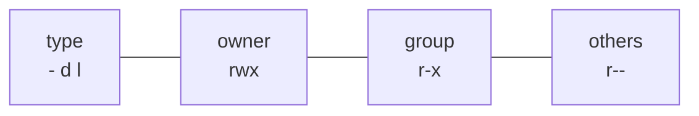
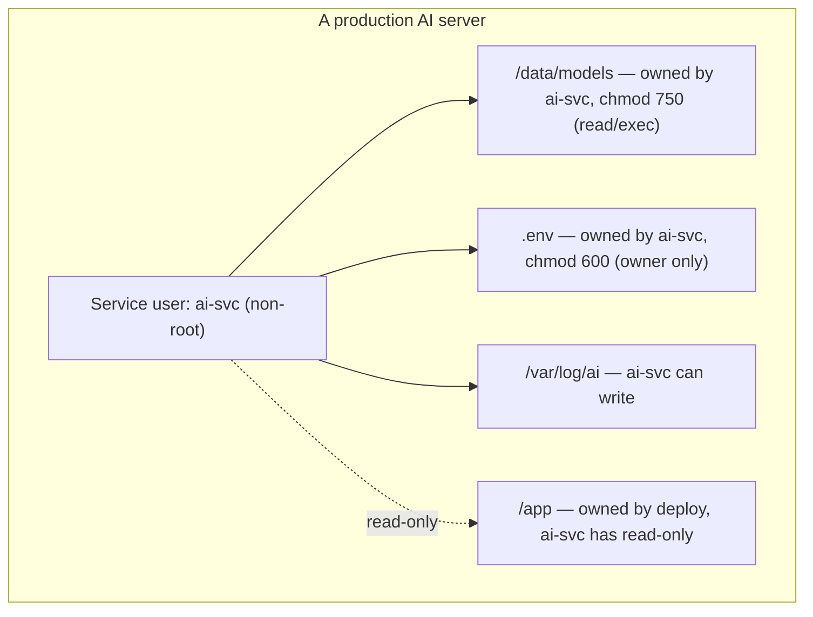

<!-- Module 03 · Lesson 6 — follows ../../../standards/. -->

# 03.6 · Permissions & Ownership

[⬅ 03.5 Essential Commands](03.5-essential-commands.md) · [🏠 Module](../README.md) · [🗺 Roadmap](../../../ROADMAP.md) · [Next ➡](03.7-processes.md)

> Linux's security model rests on a simple, powerful idea: every file has an owner and permissions controlling who can read, write, and execute it. This lesson makes you fluent with users, groups, `chmod`/`chown`, and the special bits — so you can secure secrets, fix "permission denied", and follow least-privilege in production.

| | |
|---|---|
| **Module** | `03 · Linux for AI Engineers` |
| **Lesson** | `03.6` |
| **Difficulty** | ⭐⭐⭐ |
| **Estimated study time** | 55 min read · 30 min practice |
| **Status** | 🟢 stable |

---

## 1. Learning Objectives

By the end of this lesson you will be able to:

- [ ] Explain **users, groups,** and file **ownership**.
- [ ] Read and set permissions with **`chmod`** (symbolic & octal) and change ownership with **`chown`**.
- [ ] Explain **`umask`** (default permissions).
- [ ] Understand the special bits: **SUID, SGID,** and the **sticky bit**.
- [ ] Apply **least privilege** to secure AI systems and secrets.

## 2. Prerequisites

- [03.3 Filesystem](03.3-filesystem.md) (inodes store owner/perms) and [Module 02.10 · File Systems](../../02-Computer-Science/weeks/02.10-file-systems.md) (the permission concept).

---

## 3. Why This Topic Exists

Permissions are where Linux security becomes concrete and where beginners hit walls: "permission denied" on deploy, a service that can't read its config, a leaked secret because a `.env` was world-readable. Understanding the model turns these from mysteries into two-second fixes, and lets you *design* secure systems: the service user can read the model but not modify the code; the secrets file is readable only by its owner.

For AI systems that handle data, models, and API keys, and run as service users in production, permissions are a daily, load-bearing concern — the practical face of the security mindset from [Module 00.10](../../00-Orientation/weeks/00.10-ai-engineer-mindset.md).

> [!IMPORTANT]
> The guiding principle is **least privilege**: grant the *minimum* access needed, no more. A model server needs to *read* the model and *write* logs — it should not be able to modify code, read other users' data, or run as root. Most security incidents involve something having more access than it needed. Permissions are how you enforce least privilege on Linux.

## 4. Users and Groups

Linux is **multi-user** ([03.1](03.1-introduction.md)): many accounts share a machine, isolated by identity.

| Concept | Meaning |
|---|---|
| **User** | An account (human or service) with a numeric UID |
| **Group** | A named set of users (numeric GID) for shared access |
| **root** | The superuser (UID 0) — can do *anything*; bypasses permissions |
| **Service user** | A non-login account a program runs as (e.g., `www-data`) |

```bash
whoami            # current username
id                # your UID, GID, and group memberships
groups            # groups you belong to
sudo command      # run one command as root (requires privilege)
```

> [!IMPORTANT]
> **root bypasses all permission checks** — it can read/write/delete anything. That power is why you *don't* run services as root: if a root process is compromised, the attacker owns the machine. Instead, run each service as a dedicated **non-privileged service user** with only the access it needs ([03.8](03.8-services-systemd.md), [03.15](03.15-security.md)). Use `sudo` to run *single* commands as root when necessary — never live as root.

> [!WARNING]
> `sudo` is a loaded gun. `sudo rm -rf /...`, `sudo chmod -R 777 /`, or piping an untrusted script into `sudo bash` can destroy or compromise a system instantly. Think before every `sudo`, especially with `rm`, `chmod -R`, or `curl | sudo bash` (running unknown code as root — never do this with untrusted sources).

---

## 5. Reading Permissions

`ls -l` shows permissions as a 10-character string. Decode it:

```text
-rwxr-x r--   1  alice  ml-team   4096  ...  train.py
│└┬┘└┬┘ └┬┘         │      │
│ │   │   │         owner  group
│ │   │   └─ others: r--  (read only)
│ │   └───── group:  r-x  (read + execute)
│ └───────── owner:  rwx  (read + write + execute)
└─────────── type:   - file · d dir · l symlink
```



| Permission | On a file | On a directory |
|---|---|---|
| **r** (read) | Read contents | List contents (`ls`) |
| **w** (write) | Modify contents | Create/delete files inside |
| **x** (execute) | Run it as a program | **Enter/traverse** it (`cd`) |

> [!IMPORTANT]
> **Directory permissions work differently — this trips everyone up.** For a directory: `x` means "can enter/traverse it" (needed to `cd` in or access anything inside), and `r` means "can list its names". So a directory can be `x` without `r` (you can access a known file inside but not list them). "Permission denied" when a service can't reach a file deep in a path is often a missing `x` on a *parent* directory, not the file itself.

---

## 6. Octal Permissions

Permissions are commonly written as three octal digits (owner, group, others), where each digit sums r=4, w=2, x=1.

| Octal | Binary | Symbolic | Meaning |
|:--:|:--:|:--:|---|
| 7 | 111 | `rwx` | read + write + execute |
| 6 | 110 | `rw-` | read + write |
| 5 | 101 | `r-x` | read + execute |
| 4 | 100 | `r--` | read only |
| 0 | 000 | `---` | none |

Common patterns:

| Octal | Use case |
|---|---|
| `644` (`rw-r--r--`) | Normal file: owner writes, everyone reads |
| `600` (`rw-------`) | **Secrets** — owner only ([03.15](03.15-security.md)) |
| `755` (`rwxr-xr-x`) | Executable/script or directory everyone can enter |
| `700` (`rwx------`) | Private directory — owner only |
| `777` (`rwxrwxrwx`) | ⚠️ Everyone can do everything — **almost always wrong** |

---

## 7. `chmod` — Changing Permissions

```bash
# Octal (set exact permissions):
chmod 600 .env                # secrets: owner read/write only
chmod 755 deploy.sh           # make a script executable by all
chmod 700 ~/private           # private directory

# Symbolic (add/remove relative):
chmod +x script.sh            # add execute (for everyone)
chmod u+x,go-w file           # user +execute; group/others -write
chmod -R 755 mydir/           # recursive (careful!)
```

| Symbolic part | Meaning |
|---|---|
| `u` / `g` / `o` / `a` | user / group / others / all |
| `+` / `-` / `=` | add / remove / set exactly |
| `r` / `w` / `x` | the permission |

> [!TIP]
> Two everyday moves: **`chmod +x script.sh`** to make a script runnable (a fresh script often lacks execute, giving "permission denied" — this is the fix), and **`chmod 600 .env`** to lock a secrets file to its owner. Use **octal for setting exact modes** (secrets, deploys) and **symbolic for tweaks** (`+x`). Recall the `chmod 750` decode from [Module 02.10](../../02-Computer-Science/weeks/02.10-file-systems.md).

> [!CAUTION]
> **`chmod 777` is a red flag and almost always the wrong fix.** When something says "permission denied," beginners reach for `chmod 777` (everyone can do everything) — which *works* but opens a security hole: any user or compromised process can read/modify/delete the file. The right fix is granting the *specific* needed access to the *specific* user/group (e.g., `chmod 640` + correct group, or `chown` to the service user). `chmod -R 777` on a directory is especially dangerous. Never use 777 in production.

---

## 8. `chown` — Changing Ownership

```bash
chown alice file.txt              # change owner to alice
chown alice:ml-team file.txt      # change owner AND group
chown -R www-data:www-data /app   # recursively give a service user ownership
```

> [!IMPORTANT]
> **`chown` is the real fix for many "permission denied" issues in deployment.** A service running as user `www-data` can't read files owned by `root` unless permissions allow it — so you `chown` the app files to the service user (or add it to the right group). Only root can `chown` to another user. The combination — *own it with the service user, set minimal permissions* — is how you correctly grant a service access without resorting to `777`.

---

## 9. `umask` — Default Permissions

When you create a file, it doesn't get `777` — the **`umask`** *subtracts* permissions from a base to set the default. It defines the permissions new files/directories *don't* get.

```bash
umask                 # show current mask (often 022)
# umask 022 → new files: 666-022 = 644 (rw-r--r--); new dirs: 777-022 = 755
umask 077             # stricter: new files 600, dirs 700 (owner-only) — good for private servers
```

> [!NOTE]
> `umask 022` (common default) makes new files world-*readable* (`644`). On a shared or sensitive server, set a stricter `umask 077` (owner-only) so files aren't accidentally exposed. This is a subtle but real security setting — new files inherit whatever the umask allows, so a lax umask silently creates world-readable data.

---

## 10. Special Permission Bits: SUID, SGID, Sticky

Beyond `rwx`, three special bits change execution/creation behavior. You'll rarely *set* these but must *recognize* them (they're security-relevant).

| Bit | On | Effect | Shown as |
|---|---|---|---|
| **SUID** | Executable file | Runs with the **owner's** privileges, not the runner's | `s` in owner-x (`rwsr-xr-x`) |
| **SGID** | Executable / directory | Runs as owning **group** / new files inherit the dir's group | `s` in group-x |
| **Sticky** | Directory | Only the file's **owner** can delete files in it (e.g., `/tmp`) | `t` in others-x (`rwxrwxrwt`) |

```bash
ls -l /usr/bin/passwd     # -rwsr-xr-x → SUID: lets any user change their password (edits a root-owned file)
ls -ld /tmp               # drwxrwxrwt → sticky: anyone can write, but only delete their OWN files
find / -perm -4000 2>/dev/null   # audit: list all SUID binaries (security review)
```

> [!IMPORTANT]
> **SUID is the most security-critical bit.** A SUID-root program runs as root regardless of who launches it — that's how `passwd` lets you edit the root-owned password file. But a *buggy* SUID-root program is a privilege-escalation vulnerability (an attacker exploits it to gain root). Best practice: minimize SUID binaries, and **audit them** (`find / -perm -4000`). The **sticky bit** on `/tmp` is why users can all write there but can't delete each other's files ([03.3](03.3-filesystem.md)).

> [!WARNING]
> Never add SUID to your own scripts or programs casually — a SUID-root shell script is a classic, gaping security hole. If you find an unexpected SUID binary, treat it as a red flag (possible backdoor). SUID/SGID audits are a standard part of server hardening ([03.15](03.15-security.md)).

---

## 11. Permissions in AI Production — Worked Examples



| Goal | Permission approach |
|---|---|
| Service reads model, can't alter it | `chown ai-svc`, `chmod 750` (or `640`) |
| Secrets locked down | `.env` `chmod 600`, owned by `ai-svc` |
| Service can't modify its own code | Code owned by `deploy`; service has read-only |
| Service writes logs | Log dir owned/writable by `ai-svc` |
| No service runs as root | Dedicated non-privileged users |

> [!TIP]
> This is least privilege made concrete. If the model server is compromised, the attacker gets only what `ai-svc` could do — read the model and write logs, *not* modify code, read other services' secrets, or gain root. Designing permissions this way *limits blast radius*, the core of defense in depth ([03.15](03.15-security.md), [Module 19](../../19-Production-AI/README.md)).

---

## 12. Common Mistakes & Debugging

| Mistake | Consequence | Fix |
|---|---|---|
| `chmod 777` to fix "permission denied" | Security hole | Grant *specific* access; `chown` to the right user |
| Wrong owner for a service | Service can't read files | `chown` to the service user |
| Missing `x` on a parent directory | "Permission denied" traversing a path | `chmod +x` the directory |
| Script not executable | "Permission denied" running `./script.sh` | `chmod +x script.sh` |
| World-readable secrets (`644`) | Key leak | `chmod 600`, owned by the app user |
| Lax `umask` | New files world-readable | `umask 077` on sensitive servers |
| Unaudited SUID binaries | Privilege escalation | `find / -perm -4000`; remove/patch |

## 13. Performance Considerations

Permissions have negligible performance cost (a check on access). The relevant "performance" is **operational**: correct permissions prevent outages ("service can't read config") and incidents — cheaper than debugging them at 3 a.m.

## 14. Security Considerations

| Risk | Guidance |
|---|---|
| Over-permissioned files/services | Least privilege; `chmod 600` secrets; non-root services |
| `curl \| sudo bash` | Runs untrusted code as root — never with untrusted sources |
| SUID/SGID abuse | Audit (`find / -perm -4000`); minimize |
| `sudo` misuse | Restrict who has sudo; think before each use |
| Recursive `chmod`/`chown` mistakes | Can break a system; double-check the path |
| Secrets in world-readable paths | `chmod 600` + correct owner; or secrets manager |

> [!CAUTION]
> **Never `curl <url> | sudo bash`** with an untrusted URL — you're granting an unknown script full root access. Even for trusted sources, download and read the script first. This "curl-pipe-to-shell" pattern is convenient and *extremely* dangerous, and a common malware vector. The same caution applies to running untrusted model files ([Module 02.9](../../02-Computer-Science/weeks/02.9-serialization.md)) — code from strangers is code from strangers.

## 15. Interview Questions

**Beginner**
1. Decode `-rwxr-x---` for owner, group, and others.
2. What does `chmod 600` do, and why use it for secrets?

**Intermediate**
1. What's the difference between `x` on a file vs a directory?
2. A service can't read its config file. Walk through diagnosing and fixing it *without* using 777.

**Advanced**
1. What is SUID, why is it security-critical, and how do you audit for it?
2. Design the users/groups/permissions for a production model server following least privilege.

**System-design prompt**
- Set up secure permissions for a server that trains and serves models, with datasets, model artifacts, code, secrets, and logs. — *Follow-ups:* Which files does the service user own? What's `chmod 600` vs `750`? Why not root? How do you limit blast radius?

## 16. Summary

| Key idea | Takeaway |
|---|---|
| Least privilege | Grant the minimum access needed |
| Owner/group/others × rwx | The permission model |
| Octal | `600` secrets, `755` scripts/dirs, `644` files, avoid `777` |
| `chmod`/`chown` | Set permissions / change ownership (the real deploy fix) |
| Directory `x` | Needed to traverse; different from file `x` |
| Special bits | SUID (runs as owner — audit!), SGID, sticky (`/tmp`) |
| Never run services as root | Limit blast radius |

## 17. Cheat Sheet

```text
IDENTITY: whoami · id · groups · root(UID 0, bypasses ALL) · sudo cmd (one command as root)
READ ls -l: [type][owner rwx][group rwx][others rwx]  e.g. -rwxr-x--- 
  file: r=read w=modify x=RUN · DIR: r=list x=ENTER/traverse w=create/delete inside
OCTAL: r4 w2 x1 → 7rwx 6rw- 5r-x 4r-- 0---
  600 secrets · 644 normal file · 755 script/dir · 700 private dir · 777 ⚠️NEVER
chmod 600 .env · chmod +x script.sh · chmod -R 755 dir · (symbolic: u/g/o/a +/-/= rwx)
chown user:group file · chown -R svc:svc /app   (the real "permission denied" deploy fix)
umask 022→644/755 (default) · umask 077→600/700 (private, sensitive servers)
SPECIAL: SUID(runs as OWNER, e.g. passwd — audit: find / -perm -4000) · SGID(group inherit) · sticky(/tmp: delete own only)
LEAST PRIVILEGE: non-root service user · owns model(750)+logs · read-only code · .env 600
DANGER: chmod 777 · curl|sudo bash (untrusted) · recursive chmod/chown mistakes
```

## 18. Flashcards

- **Q:** Decode `-rw-r-----`. — **A:** A file; owner read+write, group read only, others no access (octal `640`).
- **Q:** What does `x` mean on a directory? — **A:** Permission to enter/traverse it (`cd`, access files inside) — different from `r` (list its contents).
- **Q:** Why `chmod 600` for a `.env`? — **A:** Owner read/write only — no one else can read the secrets it contains.
- **Q:** Why is `chmod 777` almost always wrong? — **A:** It grants everyone full access (read/write/execute) — a security hole; grant specific access to specific users instead.
- **Q:** What is SUID and why is it critical? — **A:** A bit making an executable run with its *owner's* privileges (e.g., root); a buggy SUID-root program is a privilege-escalation vulnerability — audit with `find / -perm -4000`.
- **Q:** Real fix for a service's "permission denied" (not 777)? — **A:** `chown` the files to the service user (and set minimal permissions like 640/750), following least privilege.

## 19. Hands-on Exercises

> Full set in [`../exercises/`](../exercises/).

- [ ] **(⭐ Read)** Decode 6 permission strings/octals for owner/group/others.
- [ ] **(⭐⭐ chmod)** Create files/dirs; set `600` on a fake secret, `755` on a script, `700` on a private dir; verify with `ls -l`.
- [ ] **(⭐⭐ Directory x)** Remove `x` from a directory and observe you can't `cd` into it; restore it.
- [ ] **(⭐⭐ chown)** (With sudo) create a "service user" scenario: change ownership so only that user can read a model file.
- [ ] **(⭐⭐⭐ Audit)** Use `find / -perm -4000` to list SUID binaries; explain why one of them (e.g., `passwd`) needs it.
- [ ] **(⭐⭐⭐ Design)** Write out the permission plan for the AI server in §11; justify each choice.

## 20. Mini Project

> **Permission auditor (this module's showcase, v3).** Build a script that audits a directory tree for security issues: world-writable files, world-readable "secret"-looking files (`.env`, `*.key`, `*.pem` with loose perms), SUID/SGID binaries, and files not owned by the expected user. Output a report ranked by risk. This is a real hardening tool and cements the whole lesson (and previews [03.15](03.15-security.md)).

## 21. References

- *The Linux Command Line* (Shotts) — permissions chapter ([reference standards](../../../standards/reference-standards.md)).
- `man chmod`, `man chown`, `man umask`; the "Linux permissions" section of any server-hardening guide.
- [Module 02.10 · File Systems](../../02-Computer-Science/weeks/02.10-file-systems.md) — the permission concept.

## 22. What's Next

You control access to files. Now control the *programs* themselves: **processes** — their lifecycle, states, and how you manage the training jobs and services that consume your CPU, memory, and GPU.

➡️ **Next:** [03.7 · Processes](03.7-processes.md)

---

### 🔁 Revision checklist
- [ ] I can read/decode permission strings and octals
- [ ] I use `chmod`/`chown` correctly (and never reflexively `777`)
- [ ] I understand directory `x` and the special bits (esp. SUID)
- [ ] I can design least-privilege permissions for an AI service

### 🔗 Spaced-repetition callback
> Recall [Module 02.10's permissions and least privilege](../../02-Computer-Science/weeks/02.10-file-systems.md): the concept is now the Linux commands `chmod`/`chown`. And [Module 00.10's engineer mindset](../../00-Orientation/weeks/00.10-ai-engineer-mindset.md) — limiting blast radius — is exactly what least-privilege permissions achieve. Security is a design choice, expressed here in file modes.
