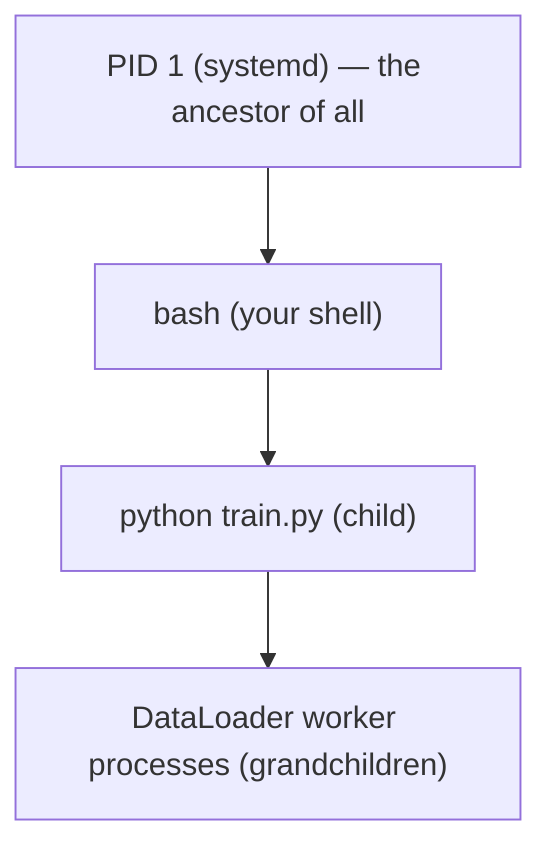
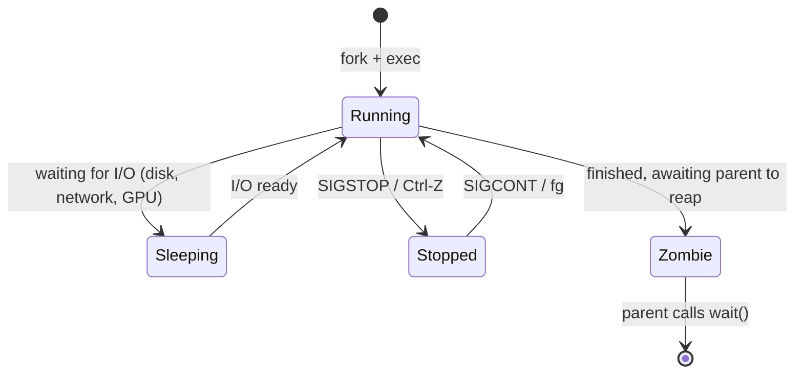
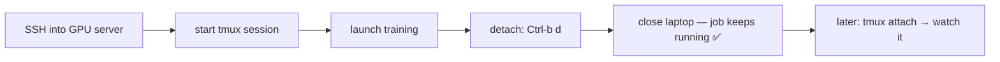
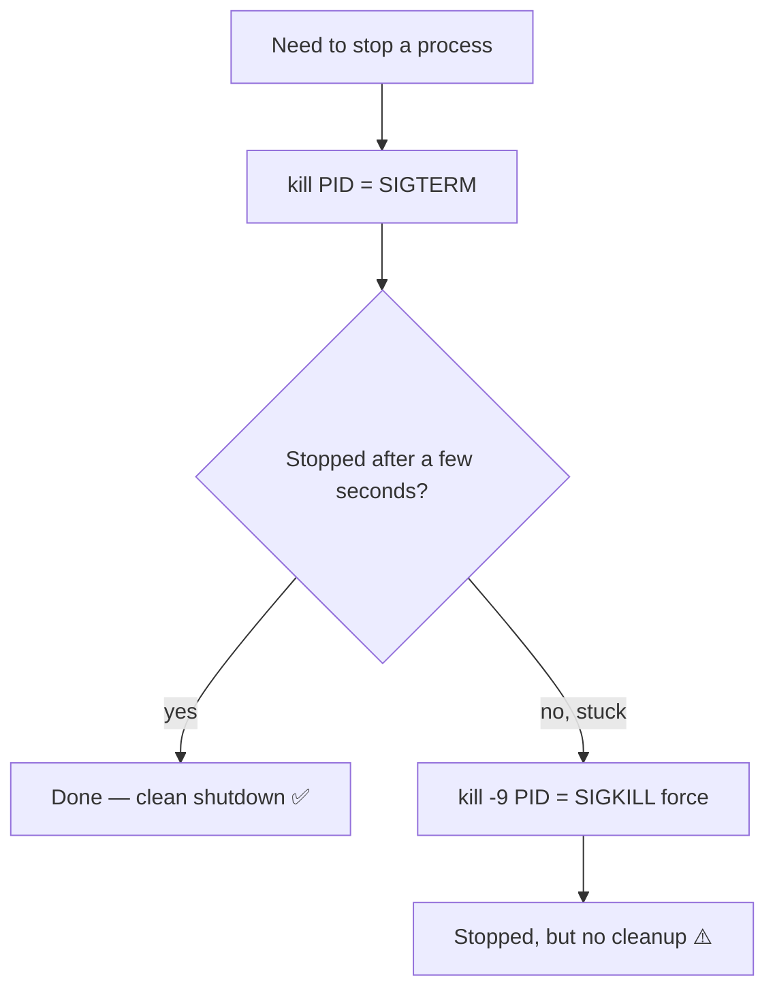
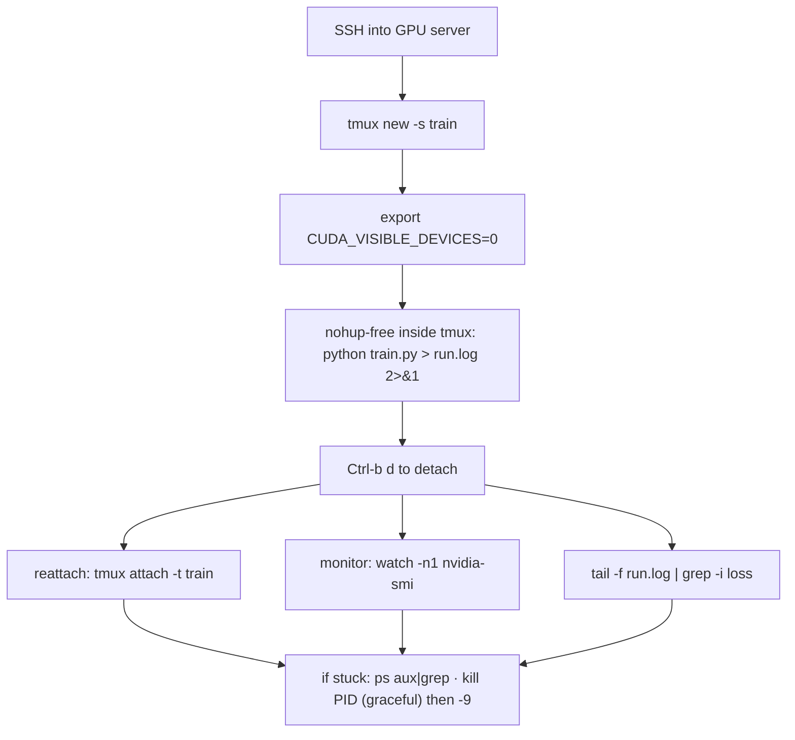

<!-- Module 03 · Lesson 7 — follows ../../../standards/. -->

# 03.7 · Processes

[⬅ 03.6 Permissions](03.6-permissions.md) · [🏠 Module](../README.md) · [🗺 Roadmap](../../../ROADMAP.md) · [Next ➡](03.8-services-systemd.md)

> A training run, a model server, a data pipeline — each is a *process* you must launch, monitor, prioritize, background, and sometimes kill. This lesson makes you fluent at managing the programs that consume your CPU, memory, and GPU, so long-running AI jobs are under your control.

| | |
|---|---|
| **Module** | `03 · Linux for AI Engineers` |
| **Lesson** | `03.7` |
| **Difficulty** | ⭐⭐⭐ |
| **Estimated study time** | 55 min read · 30 min practice |
| **Status** | 🟢 stable |

---

## 1. Learning Objectives

By the end of this lesson you will be able to:

- [ ] Explain the **process lifecycle, states, PIDs,** and parent/child relationships.
- [ ] Understand **daemons** and **foreground vs background** execution.
- [ ] Inspect processes with **`ps`, `top`, `htop`** (and `nvidia-smi` for GPU).
- [ ] Control processes: **`kill`, `killall`,** signals, and **`nice`/`renice`**.
- [ ] Run and manage long AI training jobs reliably.

## 2. Prerequisites

- [03.2 Architecture](03.2-architecture.md) (fork/execve) and [Module 02.6 · Operating Systems](../../02-Computer-Science/weeks/02.6-operating-systems.md) (processes, scheduling).

---

## 3. Why This Topic Exists

AI work is dominated by long-running processes: training that runs for hours or days, inference servers that run forever, data jobs that churn through terabytes. You must be able to start them so they survive your disconnect, watch their resource use, give them the right priority, and stop them cleanly when something's wrong. Fumbling this means killed training runs, runaway processes that hog a shared GPU server, and jobs that die the moment you close your laptop.

This is the operational core of running AI on Linux — the [Module 02.6](../../02-Computer-Science/weeks/02.6-operating-systems.md) process concepts turned into daily control.

> [!IMPORTANT]
> The recurring AI scenario: **you SSH into a GPU server, launch a multi-hour training job, and need it to (a) keep running after you disconnect, (b) not hog resources others need, and (c) be monitorable and killable.** Every tool in this lesson serves that scenario. Getting it right is the difference between a reliable ML engineer and one whose runs keep dying.

## 4. What Is a Process?

A **process** is a running instance of a program ([Module 02.6](../../02-Computer-Science/weeks/02.6-operating-systems.md)) — with its own memory, an ID, an owner, and state. Every process except the very first is created by another process (`fork`, [03.2](03.2-architecture.md)).

| Attribute | Meaning |
|---|---|
| **PID** | Process ID — a unique number identifying it |
| **PPID** | Parent Process ID — who created it |
| **Owner** | The user the process runs as ([03.6](03.6-permissions.md)) |
| **State** | Running, sleeping, stopped, zombie (§5) |
| **Priority / niceness** | How much CPU the scheduler grants it (§9) |
| **Resources** | CPU, memory, open files, GPU it's using |



> [!NOTE]
> Every process descends from **PID 1** (`systemd`, [03.8](03.8-services-systemd.md)), the first process the kernel starts at boot. Your shell is a process; the `python` it launches is its child; PyTorch `DataLoader` workers are children of that ([Module 02.8](../../02-Computer-Science/weeks/02.8-concurrency.md) multiprocessing). This parent/child tree matters: killing a parent can orphan or kill its children, which is why a stuck training job sometimes leaves zombie worker processes.

---

## 5. Process Lifecycle and States



| State | Meaning | In `ps` |
|---|---|---|
| **Running (R)** | Executing or ready to run on a CPU | `R` |
| **Sleeping (S/D)** | Waiting (S: interruptible, D: uninterruptible I/O) | `S`, `D` |
| **Stopped (T)** | Suspended (e.g., Ctrl-Z) | `T` |
| **Zombie (Z)** | Finished but not yet "reaped" by its parent | `Z` |

> [!WARNING]
> Two states to recognize in AI work: **`D` (uninterruptible sleep)** — a process stuck waiting on I/O (often disk or a hung network/GPU call); a process stuck in `D` *can't even be killed* until the I/O completes, and lots of `D` processes signals an I/O bottleneck ([03.14](03.14-performance-monitoring.md)). **`Z` (zombie)** — a finished child whose parent hasn't reaped it; individually harmless but many zombies indicate a buggy parent (common with mismanaged `DataLoader` workers). You can't kill a zombie (it's already dead); you fix or kill its *parent*.

---

## 6. Foreground, Background, and Surviving Disconnects

By default a command runs in the **foreground** — it occupies your terminal until it finishes. For long jobs, you need it in the **background** and, crucially, **surviving your SSH disconnect**.

| Technique | Effect |
|---|---|
| `command &` | Run in the background (still tied to the terminal) |
| `Ctrl-Z` then `bg` | Suspend a running job, then resume it in the background |
| `fg` | Bring a background job to the foreground |
| `jobs` | List this shell's background jobs |
| `nohup command &` | Run detached from the terminal (survives logout, ignores hangup) |
| **`tmux` / `screen`** | A persistent terminal session that survives disconnect ✅ |

```bash
python train.py &                    # background, but dies if the shell closes
nohup python train.py > train.log 2>&1 &   # survives logout; output to a log
jobs                                  # see backgrounded jobs
```

> [!IMPORTANT]
> **Use `tmux` (or `screen`) for long AI training jobs — it's the professional standard.** When you SSH into a server and start training in a plain shell, closing your laptop (or a network blip) sends a hangup signal that **kills the job**. `tmux` creates a persistent session on the server that keeps running independently: start `tmux`, launch training, detach (`Ctrl-b d`), disconnect freely, and reattach later (`tmux attach`) to find it still running. This single habit prevents the heartbreak of a 10-hour run dying at hour 9 because your Wi-Fi dropped. `nohup ... &` is a lighter alternative but `tmux` also lets you *reconnect and watch*.



### Daemons

A **daemon** is a background process that runs continuously, detached from any terminal, providing a service — a web server, a database, your model-inference API. Daemons are typically managed by `systemd` ([03.8](03.8-services-systemd.md)), not launched by hand. Their names often end in `d` (`sshd`, `dockerd`).

---

## 7. Inspecting Processes: `ps`, `top`, `htop`

| Tool | Use |
|---|---|
| `ps` | Snapshot of processes (`ps aux` = all, with details) |
| `top` | Live, updating view of processes + CPU/memory |
| `htop` | Nicer interactive `top` (colors, scrolling, kill) — install it |
| `nvidia-smi` | **GPU** processes, memory, utilization (AI-critical!) |
| `pgrep` / `pidof` | Find a PID by name |

```bash
ps aux | grep python          # find your python processes (PID, CPU%, MEM%)
ps aux --sort=-%mem | head    # top memory consumers
top                           # live view (press 'q' to quit, 'M' sort by mem)
htop                          # interactive (F9 to kill, arrows to select)
nvidia-smi                    # GPU usage, memory, and which processes use the GPU
watch -n1 nvidia-smi          # live GPU monitor (updates every 1s)
```

Reading `ps aux` columns: `USER  PID  %CPU  %MEM  VSZ  RSS  STAT  START  TIME  COMMAND`. Key ones: **PID** (to kill it), **%CPU/%MEM** (resource use), **RSS** (real memory in KB, [Module 02.2](../../02-Computer-Science/weeks/02.2-memory.md)), **STAT** (state, §5).

> [!IMPORTANT]
> **`nvidia-smi` is the AI Engineer's most-checked command.** It shows GPU utilization, memory used/total, temperature, and *which processes* are on each GPU. Use it to confirm your training is actually using the GPU (a common bug: training on CPU because CUDA wasn't detected, [03.2](03.2-architecture.md)), to find who's hogging a shared GPU, and to catch memory leaks. `watch -n1 nvidia-smi` gives a live dashboard. When "CUDA out of memory" hits ([Module 02.2](../../02-Computer-Science/weeks/02.2-memory.md)), this is where you look first.

---

## 8. Controlling Processes: Signals, `kill`, `killall`

You control processes by sending them **signals** — messages the kernel delivers.

| Signal | Number | Meaning | Sent by |
|---|:--:|---|---|
| **SIGTERM** | 15 | Please terminate (graceful — default) | `kill PID` |
| **SIGKILL** | 9 | Force kill (can't be caught/ignored) | `kill -9 PID` |
| **SIGINT** | 2 | Interrupt | Ctrl-C |
| **SIGSTOP / SIGCONT** | 19/18 | Suspend / resume | Ctrl-Z / `bg` |
| **SIGHUP** | 1 | Terminal hangup (kills non-`nohup` jobs on disconnect) | closing the shell |

```bash
kill 12345          # SIGTERM — ask process 12345 to shut down gracefully
kill -9 12345       # SIGKILL — force it (last resort)
killall python      # kill all processes named 'python' (careful!)
pkill -f train.py   # kill by matching the command line
```



> [!IMPORTANT]
> **Try `kill` (SIGTERM) before `kill -9` (SIGKILL).** SIGTERM asks the process to shut down *gracefully* — it can finish writing a checkpoint, close files, and clean up ([Module 01.7 context managers](../../01-Advanced-Python/weeks/01.7-context-managers.md)). SIGKILL (`-9`) is immediate and unstoppable but gives *no chance to clean up* — you might corrupt a half-written checkpoint or leave GPU memory allocated. Reserve `-9` for processes truly stuck (e.g., in `D` state or ignoring SIGTERM). This is the graceful-shutdown principle: for a training job, SIGTERM lets it save progress; SIGKILL loses it.

> [!WARNING]
> **`killall` and `pkill` are blunt instruments.** `killall python` kills *every* Python process — including ones you didn't mean to (other users' jobs, system tools). On a shared server this can be catastrophic. Prefer targeting a specific PID (`kill 12345`) or a precise command match (`pkill -f "train.py --run=42"`). Always `ps aux | grep` first to see exactly what you'd hit.

---

## 9. Priority: `nice` and `renice`

The scheduler ([Module 02.6](../../02-Computer-Science/weeks/02.6-operating-systems.md)) divides CPU time by **priority**, tuned via **niceness** (−20 = highest priority/least "nice", +19 = lowest priority/most "nice" to others).

```bash
nice -n 10 python preprocess.py    # start a job at LOWER priority (nicer to others)
renice -n 5 -p 12345               # change priority of a running process
ionice -c3 python heavy_io.py      # lower I/O priority (disk)
```

| Value | Meaning |
|---|---|
| Negative (−20…−1) | Higher priority (needs privilege to set) |
| 0 | Default |
| Positive (+1…+19) | Lower priority — yields CPU to others |

> [!TIP]
> On a **shared** server, run non-urgent batch jobs (data preprocessing, backfills) with `nice -n 10` so they don't starve interactive or higher-priority work. Note: for *AI* workloads the CPU is often *not* the bottleneck (the GPU is), so `nice` matters most for CPU-heavy preprocessing, not GPU training. GPU sharing is coordinated differently (via `CUDA_VISIBLE_DEVICES`, [03.4](03.4-terminal-mastery.md), or a scheduler like Slurm/Kubernetes, [Module 17](../../17-Cloud/README.md)).

---

## 10. Managing AI Training Jobs — Putting It Together



The professional workflow: **tmux** (survives disconnect) + **`CUDA_VISIBLE_DEVICES`** (GPU assignment) + logging to a file + **`nvidia-smi`/`tail -f`** to monitor + **graceful `kill`** to stop. You'll walk this exact flow in [03.17](03.17-workflow-projects-summary.md).

---

## 11. Common Mistakes & Debugging

| Mistake | Consequence | Fix |
|---|---|---|
| Long job in a plain shell | Dies on disconnect (SIGHUP) | `tmux`/`screen` or `nohup` |
| `kill -9` first | Corrupt checkpoint, no cleanup | `kill` (SIGTERM) first |
| `killall python` on shared server | Kills others' jobs | Target the PID; `ps` first |
| Training on CPU unknowingly | 10–100× slower | Check `nvidia-smi` shows GPU use |
| Zombie/`D` processes | Can't kill them | Fix/kill the *parent* |
| Not monitoring GPU memory | CUDA OOM crash | `watch nvidia-smi` |
| Ignoring runaway process | Hogs shared server | Find with `top`; `nice`/`kill` |

## 12. Performance Considerations

| Principle | Takeaway |
|---|---|
| GPU is usually the bottleneck | Monitor with `nvidia-smi`, not just CPU |
| `nice` for CPU-heavy batch | Don't starve interactive work |
| Context-switch cost | Fewer, coarser processes ([Module 02.6](../../02-Computer-Science/weeks/02.6-operating-systems.md)) |
| `D`-state processes | Signal an I/O bottleneck — investigate storage |
| RSS memory | Watch real memory to avoid OOM ([Module 02.2](../../02-Computer-Science/weeks/02.2-memory.md)) |

## 13. Security Considerations

| Risk | Guidance |
|---|---|
| Killing others' processes | Permissions limit you to your own (unless root) ([03.6](03.6-permissions.md)) |
| Secrets visible in `ps` | Command-line args (incl. secrets) show in `ps aux` — pass secrets via env/files, not args ([03.4](03.4-terminal-mastery.md)) |
| Runaway processes as DoS | Resource limits (`ulimit`, cgroups, [03.16](03.16-docker-preparation.md)) |
| Untrusted code as your user | Runs with all your permissions — sandbox it |

> [!CAUTION]
> **Secrets passed as command-line arguments are visible to any user via `ps aux`** (and in `/proc/<pid>/cmdline`). Never do `python app.py --api-key=sk-...` — the key is exposed to everyone on the box and often logged. Pass secrets through environment variables or a `chmod 600` file ([03.4](03.4-terminal-mastery.md)/[03.6](03.6-permissions.md)). This is a real, common leak.

## 14. Interview Questions

**Beginner**
1. What is a process, a PID, and a parent process?
2. What's the difference between foreground and background execution?

**Intermediate**
1. Why use `tmux` for training jobs, and what problem does it solve?
2. What's the difference between SIGTERM and SIGKILL, and why prefer SIGTERM?

**Advanced**
1. A process is stuck in `D` state and won't die. What does that mean and what do you do?
2. How do you monitor and manage GPU usage for training jobs on a shared server?

**System-design prompt**
- You manage a shared GPU server for a team running training jobs. Design how jobs are launched, isolated, monitored, and stopped. — *Follow-ups:* How do jobs survive disconnects? How do you assign GPUs? How do you prevent one job from starving others or killing another's process?

## 15. Summary

| Key idea | Takeaway |
|---|---|
| Process = running program | PID, owner, state, parent/child tree |
| States | R/S/D/T/Z; watch for `D` (I/O stuck) and `Z` (zombie) |
| Survive disconnect | `tmux`/`screen` for long jobs |
| Inspect | `ps aux`, `top`/`htop`, and `nvidia-smi` for GPU |
| Signals | `kill` (SIGTERM, graceful) before `kill -9` (SIGKILL) |
| Priority | `nice`/`renice` for CPU-heavy batch on shared servers |

## 16. Cheat Sheet

```text
PROCESS: running program · PID(id) · PPID(parent) · owner · STATE · all descend from PID 1(systemd)
STATES: R running · S sleep · D uninterruptible I/O(can't kill!) · T stopped · Z zombie(kill the PARENT)
BACKGROUND/SURVIVE: cmd & · Ctrl-Z then bg · fg · jobs · nohup cmd & (survives logout)
  ★ tmux new -s x → run → Ctrl-b d (detach) → tmux attach (LONG JOBS survive SSH drop)
INSPECT: ps aux | grep python · ps aux --sort=-%mem · top(M=mem,q=quit) · htop(F9 kill)
  ★ nvidia-smi (GPU util/mem/procs) · watch -n1 nvidia-smi (live)
SIGNALS/KILL: kill PID=SIGTERM(graceful, saves checkpoint) → then kill -9=SIGKILL(force, no cleanup)
  killall name / pkill -f "cmd" (⚠️ blunt — ps first!) · Ctrl-C=SIGINT
PRIORITY: nice -n 10 cmd (lower prio) · renice -n 5 -p PID · (GPU sharing → CUDA_VISIBLE_DEVICES / scheduler)
AI FLOW: ssh → tmux → CUDA_VISIBLE_DEVICES=0 → python train.py > log 2>&1 → detach → nvidia-smi / tail -f
SECURITY: secrets NOT in CLI args (visible in ps aux) — use env/files
```

## 17. Flashcards

- **Q:** Why use `tmux` for long training jobs? — **A:** It creates a persistent server-side session that keeps running after you disconnect (a plain shell job dies on SIGHUP); you can detach and reattach to monitor.
- **Q:** SIGTERM vs SIGKILL? — **A:** SIGTERM (`kill`) asks a process to shut down gracefully (finish writing checkpoints, clean up); SIGKILL (`kill -9`) force-kills with no cleanup — use only when stuck.
- **Q:** What does a process in `D` state mean? — **A:** Uninterruptible sleep — stuck waiting on I/O; it can't be killed until the I/O completes, and many `D` processes indicate an I/O bottleneck.
- **Q:** What is `nvidia-smi` and why is it essential? — **A:** It shows GPU utilization/memory and which processes use each GPU — to confirm training uses the GPU, find hogs, and diagnose CUDA OOM.
- **Q:** Why not put secrets in command-line arguments? — **A:** They're visible to all users via `ps aux` and `/proc/<pid>/cmdline`; pass secrets via env vars or a restricted file instead.
- **Q:** What is a zombie process, and how do you clear it? — **A:** A finished child not yet reaped by its parent; you can't kill it (it's dead) — fix or kill the parent.

## 18. Hands-on Exercises

> Full set in [`../exercises/`](../exercises/).

- [ ] **(⭐ Inspect)** Launch a `sleep 1000 &` job; find it with `ps aux | grep`, `jobs`, and `pgrep`; note its PID and state.
- [ ] **(⭐⭐ Background)** Run a long command in `tmux`; detach, "disconnect" (close the pane's shell simulation), reattach and find it still running.
- [ ] **(⭐⭐ Signals)** Send SIGTERM then (if needed) SIGKILL to a process; observe the difference in cleanup.
- [ ] **(⭐⭐ Monitor)** Use `top`/`htop` to find the top CPU and memory consumers; if a GPU is available, watch `nvidia-smi`.
- [ ] **(⭐⭐⭐ Priority)** Start two CPU-heavy jobs, one with `nice -n 15`; observe the CPU-share difference in `htop`.
- [ ] **(⭐⭐⭐ Debug)** Create a zombie (a child that exits while the parent sleeps) and observe it in `ps`; explain why killing it directly doesn't work.

## 19. Mini Project

> **Server health checker (this module's showcase, v4 — process edition).** Build a script that reports the system's process health: top CPU/memory consumers (`ps --sort`), count of processes by state (running/sleeping/zombie), any `D`-state processes, and (if present) GPU utilization/memory (`nvidia-smi`). Flag warnings (high memory, zombies, GPU near-full). Output a clean status report. You'll extend this with disk/network checks in later lessons — it becomes a real server-health tool.

## 20. References

- *The Linux Command Line* (Shotts) — processes chapter ([reference standards](../../../standards/reference-standards.md)).
- `man ps`, `man kill`, `man nice`, `man signal(7)`; tmux documentation.
- NVIDIA `nvidia-smi` documentation.

## 21. What's Next

You can manage processes by hand. But production services must start automatically, restart on failure, and run as daemons — that's **systemd**, the service manager. Next up.

➡️ **Next:** [03.8 · Services with systemd](03.8-services-systemd.md)

---

### 🔁 Revision checklist
- [ ] I understand process states, PIDs, and the parent/child tree
- [ ] I run long jobs in `tmux` so they survive disconnects
- [ ] I inspect with `ps`/`top`/`htop`/`nvidia-smi`
- [ ] I stop processes gracefully (SIGTERM before SIGKILL)

### 🔗 Spaced-repetition callback
> Recall [Module 02.6's processes & scheduling](../../02-Computer-Science/weeks/02.6-operating-systems.md) and [Module 01.7's graceful cleanup](../../01-Advanced-Python/weeks/01.7-context-managers.md): SIGTERM working *because* the process can run its cleanup (context managers, checkpoint save) ties them together. And `fork`/`execve` from [03.2](03.2-architecture.md) is how every process here was born.
