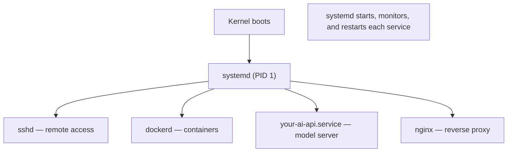

<!-- Module 03 · Lesson 8 — follows ../../../standards/. -->

# 03.8 · Services with systemd

[⬅ 03.7 Processes](03.7-processes.md) · [🏠 Module](../README.md) · [🗺 Roadmap](../../../ROADMAP.md) · [Next ➡](03.9-networking.md)

> A model-inference API must start on boot, restart if it crashes, and run reliably for months — not depend on you keeping a terminal open. **systemd** is how Linux makes that happen. This lesson teaches you to turn your AI service into a managed, self-healing daemon.

| | |
|---|---|
| **Module** | `03 · Linux for AI Engineers` |
| **Lesson** | `03.8` |
| **Difficulty** | ⭐⭐⭐ |
| **Estimated study time** | 55 min read · 30 min practice |
| **Status** | 🟢 stable |

---

## 1. Learning Objectives

By the end of this lesson you will be able to:

- [ ] Explain what **systemd** is and its role as init (PID 1) and service manager.
- [ ] Manage services with **`systemctl`** (start/stop/enable/status).
- [ ] Write a **service unit file** to run an AI application as a daemon.
- [ ] Understand the **boot process** at a high level.
- [ ] Read service logs with **`journalctl`**.

## 2. Prerequisites

- [03.7 Processes](03.7-processes.md) (daemons, PID 1) and [03.6 Permissions](03.6-permissions.md) (service users).

---

## 3. Why This Topic Exists

Running a service by hand (`python server.py` in a `tmux`) is fine for development, but production needs more: the service must **start automatically on boot**, **restart automatically if it crashes**, run as a **non-root service user** ([03.6](03.6-permissions.md)), have its **logs collected**, and be **controllable** with standard commands. Doing this by hand is fragile; `systemd` does it robustly and is the standard on essentially every modern Linux server.

For an AI Engineer, this is how your model-serving API ([Module 16](../../16-MLOps/README.md)) becomes a real, reliable production service instead of a script someone has to babysit.

> [!IMPORTANT]
> The core value of systemd for AI: **your inference service becomes self-healing and boot-persistent.** If it crashes at 3 a.m., systemd restarts it. If the server reboots, systemd brings it back. If you need to check on it, `systemctl status your-api` and `journalctl -u your-api` tell you everything. This is what "productionizing" a model server means at the OS level.

## 4. What Is systemd?

**systemd** is the **init system** and **service manager** on most modern Linux distros. It's the very first process the kernel starts — **PID 1** ([03.7](03.7-processes.md)) — and it's responsible for bringing up the system and managing all services ("units").

| systemd does | Detail |
|---|---|
| **Boots the system** | Starts services in dependency order at boot |
| **Manages services** | Start/stop/restart/enable daemons |
| **Restarts failures** | Auto-restart crashed services |
| **Collects logs** | The `journald` logging system ([03.11](03.11-logs.md)) |
| **Manages resources** | Uses cgroups to limit service CPU/memory ([03.16](03.16-docker-preparation.md)) |
| **Schedules tasks** | Timers (a cron alternative) |



> [!NOTE]
> systemd manages **units** — services (`.service`), timers, sockets, mounts, and more. You'll mostly work with `.service` units. Some engineers criticize systemd's scope (it does a lot for an "init system"), but it's the de facto standard, so fluency with it is essential. It replaced older init systems (SysV init, Upstart).

---

## 5. Managing Services with `systemctl`

`systemctl` is the command to control systemd units. These are the daily commands:

| Command | Effect |
|---|---|
| `systemctl status <svc>` | Show status, recent logs, is-it-running |
| `systemctl start <svc>` | Start it now |
| `systemctl stop <svc>` | Stop it now |
| `systemctl restart <svc>` | Restart it |
| `systemctl reload <svc>` | Reload config without full restart (if supported) |
| `systemctl enable <svc>` | Start automatically **on boot** |
| `systemctl disable <svc>` | Don't start on boot |
| `systemctl enable --now <svc>` | Enable + start in one step |

```bash
sudo systemctl status nginx        # is it running? recent logs?
sudo systemctl restart my-api      # restart after a deploy
sudo systemctl enable --now my-api # start now AND on every boot
systemctl is-active my-api         # scriptable: "active" or not
```

> [!IMPORTANT]
> **`start` vs `enable` is the distinction beginners miss.** `start` runs the service *now* (but it won't come back after a reboot). `enable` makes it start *automatically on boot* (but doesn't start it now). For a production service you almost always want **both** — `systemctl enable --now`. Forgetting `enable` means your carefully-configured service vanishes after the next server reboot, a classic "why is my API down after maintenance?" incident.

---

## 6. Anatomy of a Service Unit File

To run *your* AI app as a service, you write a **unit file** — a declarative config telling systemd how to run it. It lives in `/etc/systemd/system/<name>.service`.

```ini
# /etc/systemd/system/model-api.service
[Unit]
Description=Model Inference API
After=network.target                 # start after networking is up

[Service]
Type=simple                          # a normal long-running process
User=ai-svc                          # run as a NON-ROOT service user (03.6!)
Group=ai-svc
WorkingDirectory=/opt/model-api
Environment=CUDA_VISIBLE_DEVICES=0   # env vars (or EnvironmentFile= for .env)
EnvironmentFile=/opt/model-api/.env  # load secrets from a chmod-600 file
ExecStart=/opt/model-api/.venv/bin/python server.py   # ABSOLUTE paths!
Restart=on-failure                   # auto-restart if it crashes
RestartSec=5                         # wait 5s between restarts
MemoryMax=8G                         # resource limit (cgroups)

[Install]
WantedBy=multi-user.target           # enable = start at normal boot
```


| Section | Purpose |
|---|---|
| `[Unit]` | Metadata + ordering/dependencies (`After=`, `Requires=`) |
| `[Service]` | How to run it: `ExecStart`, `User`, `Restart`, `Environment` |
| `[Install]` | How `enable` hooks it into boot (`WantedBy`) |

After creating/editing a unit file:

```bash
sudo systemctl daemon-reload          # tell systemd to re-read unit files
sudo systemctl enable --now model-api # enable + start
sudo systemctl status model-api       # verify it's running
```

> [!IMPORTANT]
> Three unit-file details that cause real production bugs:
> - **Use absolute paths in `ExecStart`** (and `WorkingDirectory`) — systemd runs from `/` with a minimal environment, so relative paths and "it works in my shell" assumptions break ([03.3](03.3-filesystem.md)). Point at the venv's python explicitly (`/opt/.../.venv/bin/python`), not `python`.
> - **Run as a dedicated non-root `User=`** ([03.6](03.6-permissions.md)) — least privilege; never run your model server as root.
> - **`Restart=on-failure`** is what makes it self-healing — without it, a crash means downtime until someone notices.

> [!WARNING]
> systemd runs services with a **clean, minimal environment** — none of your shell's `PATH`, aliases, or exported variables. So a service that "works when I run it in my terminal" can fail as a service because it can't find `python`, a library, or an env var it silently relied on. Always specify absolute paths, set `Environment=`/`EnvironmentFile=` explicitly, and test with `systemctl start` (not just your shell). Debug failures with `journalctl -u <svc>` (§8).

---

## 7. The Boot Process (High Level)

Understanding boot helps you reason about what starts when, and debug boot failures.


| Stage | What happens |
|---|---|
| Firmware (BIOS/UEFI) | Hardware init; finds the bootloader |
| Bootloader (GRUB) | Loads the Linux kernel |
| Kernel | Initializes hardware, mounts root filesystem ([03.10](03.10-storage.md)) |
| systemd (PID 1) | Starts services in dependency order up to a **target** |
| Targets | `multi-user.target` (server) or `graphical.target` (desktop) |

> [!NOTE]
> A **target** is a grouping/state of services (roughly the successor to "runlevels"). `multi-user.target` is the normal state for a server (networking + services, no GUI). `enable`-ing a service with `WantedBy=multi-user.target` is what wires it to start at that stage. If a server "won't boot" or hangs, the culprit is often a service failing to start — diagnosable via `journalctl -b` (this boot's logs, [03.11](03.11-logs.md)).

---

## 8. Reading Service Logs with `journalctl`

systemd captures each service's stdout/stderr into the **journal** (`journald`), queryable with `journalctl` (full treatment in [03.11](03.11-logs.md)).

```bash
journalctl -u model-api            # all logs for the model-api service
journalctl -u model-api -f         # FOLLOW live (like tail -f, 03.5)
journalctl -u model-api --since "10 min ago"
journalctl -u model-api -p err     # only error-priority messages
journalctl -b                      # logs since the last boot
```

> [!IMPORTANT]
> **`journalctl -u <service> -f` is how you watch a systemd-managed AI service live** — the systemd equivalent of `tail -f` on a log file. When your model API misbehaves, `journalctl -u model-api --since "1 hour ago"` shows exactly what it logged, including crash tracebacks ([Module 01.9](../../01-Advanced-Python/weeks/01.9-error-handling-logging.md)) and restart events. This is your first stop debugging a production service failure.

---

## 9. Common Mistakes & Debugging

| Mistake | Consequence | Fix |
|---|---|---|
| `start` without `enable` | Service gone after reboot | `systemctl enable --now` |
| Relative paths in `ExecStart` | Fails as a service | Absolute paths + venv python |
| Running as root | Security risk | Dedicated `User=` |
| No `Restart=on-failure` | Downtime after a crash | Add it |
| Editing a unit, forgetting `daemon-reload` | Changes ignored | `systemctl daemon-reload` |
| Assuming shell env is present | Missing PATH/vars | Set `Environment=`/`EnvironmentFile=` |
| Not checking `journalctl` | Blind debugging | `journalctl -u <svc>` first |

## 10. Performance Considerations

| Principle | Takeaway |
|---|---|
| Resource limits | `MemoryMax=`/`CPUQuota=` protect the host (cgroups, [03.16](03.16-docker-preparation.md)) |
| Restart storms | Set `RestartSec=` so a crash-loop doesn't hammer the CPU |
| Startup ordering | `After=`/`Requires=` avoid racing dependencies |
| Journal disk use | The journal can grow; cap it ([03.11](03.11-logs.md)) |

## 11. Security Considerations

| Risk | Guidance |
|---|---|
| Service as root | Use a non-root `User=` ([03.6](03.6-permissions.md)) |
| Secrets in the unit file | Use `EnvironmentFile=` (chmod 600), not inline `Environment=` for secrets |
| Excess privileges | systemd sandboxing: `ProtectSystem=`, `NoNewPrivileges=`, `PrivateTmp=` |
| Unbounded resources | `MemoryMax=`/`CPUQuota=` limit blast radius |
| World-readable unit files | Don't put secrets where anyone can read them |

> [!TIP]
> systemd has built-in **sandboxing directives** that harden a service cheaply: `NoNewPrivileges=true` (can't gain privileges), `ProtectSystem=strict` (read-only system dirs), `PrivateTmp=true` (isolated `/tmp`), `ReadWritePaths=` (whitelist writable dirs). Adding these to your model-api unit meaningfully reduces the blast radius if the service is compromised — least privilege ([03.6](03.6-permissions.md)) enforced by the service manager. Keep secrets in an `EnvironmentFile` with `chmod 600`, not inline in the (often world-readable) unit file.

## 12. Interview Questions

**Beginner**
1. What is systemd, and what does PID 1 mean?
2. What's the difference between `systemctl start` and `systemctl enable`?

**Intermediate**
1. Walk through turning a Python model server into a managed systemd service. What goes in the unit file?
2. A service works in your shell but fails under systemd. What are the likely causes?

**Advanced**
1. How do you make a service self-healing and boot-persistent, and how do you limit its resources and privileges?
2. How do you debug a service that fails to start at boot?

**System-design prompt**
- Deploy a model-inference API as a robust production service on a Linux VM. — *Follow-ups:* What's in the unit file (user, paths, restart, env, limits)? How do you ensure it survives reboots and crashes? How do you read its logs and harden it?

## 13. Summary

| Key idea | Takeaway |
|---|---|
| systemd | Init (PID 1) + service manager on modern Linux |
| `systemctl` | start/stop/restart/status/enable |
| start vs enable | Now vs on-boot — usually want both (`enable --now`) |
| Unit file | Declarative: `ExecStart`, `User`, `Restart`, `Environment` |
| Self-healing | `Restart=on-failure` + `enable` = survives crashes & reboots |
| `journalctl -u` | Read/follow a service's logs |

## 14. Cheat Sheet

```text
systemd = PID 1 init + service manager (boots system, manages/restarts services, logs via journald)
systemctl: status/start/stop/restart/reload <svc>
  enable <svc> (start ON BOOT) vs start (start NOW) → usually: systemctl enable --now <svc>
  is-active <svc> (scriptable)
UNIT FILE /etc/systemd/system/name.service:
  [Unit] Description= · After=network.target
  [Service] User=ai-svc(non-root!) · WorkingDirectory= · ExecStart=/abs/path/.venv/bin/python server.py (ABSOLUTE!)
            EnvironmentFile=/opt/app/.env(chmod 600) · Restart=on-failure · RestartSec=5 · MemoryMax=8G
  [Install] WantedBy=multi-user.target
  after editing: systemctl daemon-reload → enable --now → status
LOGS: journalctl -u <svc> [-f follow] [--since "1h ago"] [-p err] · journalctl -b (this boot)
GOTCHA: systemd = clean minimal env (no shell PATH/aliases) → absolute paths + Environment=
HARDEN: NoNewPrivileges=true · ProtectSystem=strict · PrivateTmp=true · non-root User=
BOOT: firmware → GRUB → kernel(mount root) → systemd → multi-user.target → enabled services
```

## 15. Flashcards

- **Q:** What is systemd? — **A:** The init system (PID 1) and service manager on most modern Linux — it boots the system and starts, monitors, restarts, and logs services.
- **Q:** `systemctl start` vs `enable`? — **A:** `start` runs a service now (not after reboot); `enable` makes it start automatically on boot (not now) — production usually wants both (`enable --now`).
- **Q:** What makes a systemd service self-healing and boot-persistent? — **A:** `Restart=on-failure` (auto-restart on crash) plus `enable` (start on boot).
- **Q:** Why does a service work in your shell but fail under systemd? — **A:** systemd runs with a clean, minimal environment (no shell PATH/vars) from `/`; relative paths and assumed env vars break — use absolute paths and `Environment=`.
- **Q:** How do you read a service's logs? — **A:** `journalctl -u <service>` (add `-f` to follow live, `--since` to filter by time).
- **Q:** Where should service secrets go in a unit file? — **A:** In an `EnvironmentFile=` with `chmod 600`, not inline `Environment=` in the (possibly world-readable) unit file.

## 16. Hands-on Exercises

> Full set in [`../exercises/`](../exercises/).

- [ ] **(⭐ Manage)** Use `systemctl status`, `start`, `stop`, `restart` on an existing service (e.g., `ssh`); read its status output.
- [ ] **(⭐⭐ Enable)** Demonstrate the difference between `start` and `enable` (conceptually or in a VM you can reboot).
- [ ] **(⭐⭐⭐ Create)** Write a unit file for a simple Python HTTP server (from [03.9](03.9-networking.md)/[Module 02.7](../../02-Computer-Science/weeks/02.7-networking.md)); run it as a non-root user with `Restart=on-failure`; verify with `status`.
- [ ] **(⭐⭐ Logs)** Use `journalctl -u <your-service> -f` to watch it log; trigger a crash and see the restart.
- [ ] **(⭐⭐⭐ Debug)** Deliberately use a relative path in `ExecStart`, watch it fail, diagnose via `journalctl`, and fix with an absolute path.

## 17. Mini Project

> **Deployment automation script (this module's showcase, v5).** Build a script that "deploys" a Python service: sets up the directory and a service user ([03.6](03.6-permissions.md)), writes a systemd unit file (absolute paths, non-root user, `Restart=on-failure`, `EnvironmentFile`), runs `daemon-reload` + `enable --now`, verifies with `systemctl status`, and tails `journalctl` to confirm health. Include a diagram of the deploy flow. This is a real, reusable deploy tool and a preview of [Module 16 · MLOps](../../16-MLOps/README.md).

## 18. References

- systemd documentation (`man systemd.service`, `man systemctl`, `man journalctl`) ([reference standards](../../../standards/reference-standards.md)).
- *"systemd for Administrators"* series (Lennart Poettering) — the authoritative intro.
- DigitalOcean/Ubuntu systemd tutorials — practical unit-file examples.

## 19. What's Next

Your service runs reliably — now it must *talk*: to clients, other services, and the internet. Next: **networking** — IP, DNS, SSH, and the tools to connect, transfer, and debug, all through the lens of cloud deployment.

➡️ **Next:** [03.9 · Networking](03.9-networking.md)

---

### 🔁 Revision checklist
- [ ] I can manage services with `systemctl` (and know start vs enable)
- [ ] I can write a unit file to run an AI app as a non-root, self-healing daemon
- [ ] I understand the boot process at a high level
- [ ] I read service logs with `journalctl -u`

### 🔗 Spaced-repetition callback
> Recall [03.7's daemons and PID 1](03.7-processes.md) and [03.6's service users](03.6-permissions.md): systemd *is* PID 1, and a good unit file runs the daemon as a least-privilege service user. This is also where [Module 02.11's "design for failure"](../../02-Computer-Science/weeks/02.11-system-design-basics.md) becomes concrete — `Restart=on-failure` is fault tolerance at the OS level.
