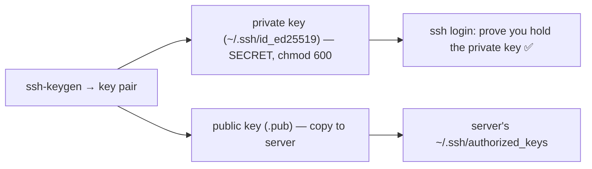
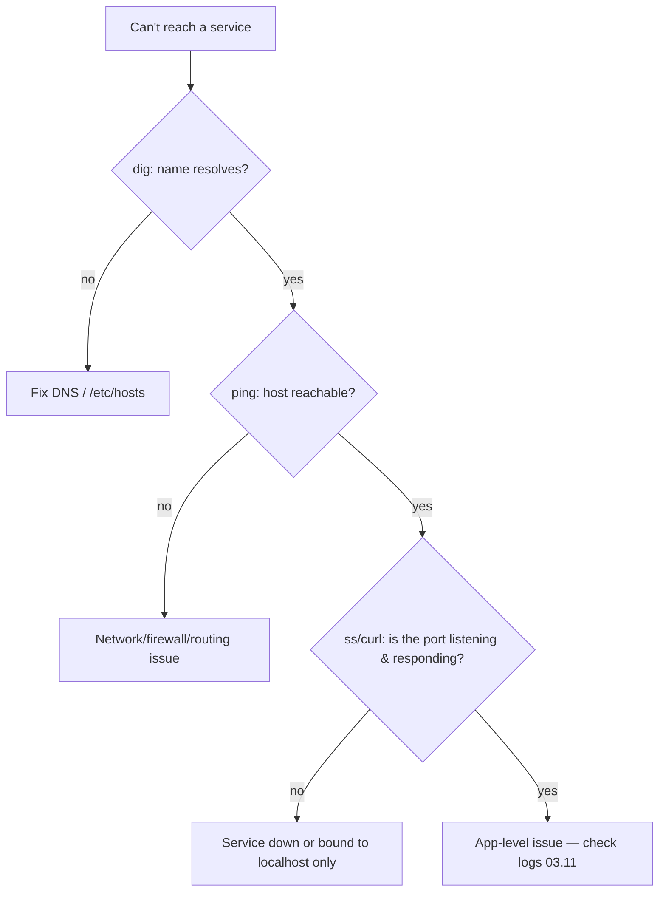

<!-- Module 03 · Lesson 9 — follows ../../../standards/. -->

# 03.9 · Networking

[⬅ 03.8 Services with systemd](03.8-services-systemd.md) · [🏠 Module](../README.md) · [🗺 Roadmap](../../../ROADMAP.md) · [Next ➡](03.10-storage.md)

> You'll spend your AI career connecting to remote servers, moving datasets and models between machines, and debugging why a service can't be reached. This lesson covers Linux networking from the practical angle — IP, DNS, and the essential tools (**SSH, SCP, rsync,** and the diagnostics) — all through the lens of cloud deployment.

| | |
|---|---|
| **Module** | `03 · Linux for AI Engineers` |
| **Lesson** | `03.9` |
| **Difficulty** | ⭐⭐⭐ |
| **Estimated study time** | 60 min read · 30 min practice |
| **Status** | 🟢 stable |

---

## 1. Learning Objectives

By the end of this lesson you will be able to:

- [ ] Understand **IP addresses, interfaces, DNS,** and **routing** on Linux.
- [ ] Connect to remote servers with **SSH** (and set up key auth).
- [ ] Transfer files with **SCP** and **rsync**.
- [ ] Diagnose connectivity with `ping`, `ss`, `dig`, `curl`, `traceroute`.
- [ ] Relate all of it to **cloud deployment** of AI systems.

## 2. Prerequisites

- [Module 02.7 · Networking](../../02-Computer-Science/weeks/02.7-networking.md) (TCP/IP, DNS, HTTP — the concepts) and [03.6 Permissions](03.6-permissions.md) (SSH keys, users).

---

## 3. Why This Topic Exists

The GPU server you train on is *remote* — you reach it over the network via SSH. The dataset you need is on *another* machine or in cloud storage — you transfer it with `scp`/`rsync`. The model API you deploy must be *reachable* — and when it isn't, you debug the network. Networking isn't optional for AI Engineers; it's the daily medium of remote work and deployment.

This lesson turns the [Module 02.7](../../02-Computer-Science/weeks/02.7-networking.md) networking *concepts* into Linux *skills* — especially SSH, the single most-used tool for accessing AI infrastructure.

> [!IMPORTANT]
> **SSH is the front door to nearly every AI server you'll ever use.** Cloud GPU instances, on-prem training boxes, and remote dev environments are all accessed via SSH. Mastering SSH (especially key-based auth and file transfer) is the highest-leverage skill in this lesson — you'll use it every single day.

## 4. IP Addresses, Interfaces, and Routing

Recall from [Module 02.7](../../02-Computer-Science/weeks/02.7-networking.md): every machine has an **IP address**; the network **routes** packets between them. On Linux, `ip` is the modern command to inspect and configure this.

```bash
ip addr                # show network interfaces and their IP addresses
ip route               # show the routing table (where packets go)
hostname -I            # quick: this machine's IP(s)
```

| Concept | Meaning |
|---|---|
| **Interface** | A network device (`eth0`, `ens5`, `lo` loopback, `docker0`) |
| **IP address** | The machine's address (private `10.x`/`192.168.x` or public) |
| **`localhost` / `127.0.0.1`** | The loopback — the machine talking to itself |
| **Routing table** | Rules for which interface/gateway packets take |
| **Port** | Identifies a service on a machine ([Module 02.7](../../02-Computer-Science/weeks/02.7-networking.md)) |

> [!NOTE]
> **Public vs private IPs matter for cloud AI.** A cloud GPU instance typically has a *private* IP (for internal traffic between your services) and may have a *public* IP (to reach it from the internet). You SSH to the public IP (or a bastion host), but your services often talk to each other over private IPs — cheaper, faster, and more secure ([Module 17 · Cloud](../../17-Cloud/README.md)). `127.0.0.1`/`localhost` means "this same machine" — a service bound to `localhost` is *not* reachable from outside (a common "why can't I connect?" cause).

---

## 5. DNS on Linux

DNS translates names to IPs ([Module 02.7](../../02-Computer-Science/weeks/02.7-networking.md)). On Linux you query and configure it with these:

```bash
dig api.example.com          # detailed DNS lookup (the pro tool)
nslookup api.example.com     # simpler DNS lookup
cat /etc/hosts               # local name→IP overrides (checked BEFORE DNS)
cat /etc/resolv.conf         # which DNS servers this machine uses
```

| File / tool | Role |
|---|---|
| `/etc/hosts` | Static local name→IP map (overrides DNS) |
| `/etc/resolv.conf` | Configured DNS resolver(s) |
| `dig` / `nslookup` | Query DNS to resolve a name |

> [!TIP]
> `/etc/hosts` is checked *before* DNS, so it's a handy way to point a hostname at a specific IP for testing (e.g., map `model-api.local` to a dev server) — but a stale `/etc/hosts` entry is also a sneaky cause of "it resolves to the wrong server." When a name won't resolve, `dig <name>` shows you exactly what DNS returns (or fails to). DNS issues are a top cause of "works from one machine, not another" ([Module 02.7](../../02-Computer-Science/weeks/02.7-networking.md)).

---

## 6. SSH — Secure Remote Access

**SSH (Secure Shell)** gives you an encrypted terminal on a remote machine. It's how you operate every remote AI server.

```bash
ssh alice@gpu-server.example.com          # connect (prompts for password/key)
ssh -i ~/.ssh/mykey.pem ubuntu@1.2.3.4    # connect using a specific key file
ssh -p 2222 alice@host                     # non-default port
```

### Key-based authentication (the professional way)

Passwords are weak and clumsy for servers. **SSH keys** are a public/private key pair: you keep the private key secret; the server holds your public key. You authenticate by proving you hold the private key — no password sent.



```bash
ssh-keygen -t ed25519 -C "you@email"      # generate a modern key pair
ssh-copy-id alice@host                      # install your public key on the server
ssh alice@host                              # now logs in with no password
```

> [!IMPORTANT]
> **Use SSH keys, not passwords, for servers** ([03.15](03.15-security.md)). Keys are far more secure (no password to brute-force or phish) and more convenient (no typing). Cloud providers *require* keys for GPU instances — you download a `.pem` key when creating the instance. Critical rules: the **private key stays secret and `chmod 600`** (SSH refuses to use an over-permissive key — a common "permissions too open" error, [03.6](03.6-permissions.md)); the **public key** goes on the server. Never share or commit your private key.

> [!TIP]
> The **`~/.ssh/config`** file saves you enormous typing. Define a host once:
> ```
> Host gpu
>     HostName 1.2.3.4
>     User ubuntu
>     IdentityFile ~/.ssh/mykey.pem
> ```
> Then just `ssh gpu`. You can also set up **port forwarding** (`ssh -L 8888:localhost:8888 gpu`) to access a remote Jupyter/TensorBoard/model-API on your local browser through the encrypted tunnel — a daily AI workflow ([03.17](03.17-workflow-projects-summary.md)).

---

## 7. Transferring Files: SCP and rsync

You constantly move datasets, models, and code between machines.

| Tool | Best for |
|---|---|
| **`scp`** | Simple one-off copies over SSH |
| **`rsync`** | Efficient sync — only transfers *differences*, resumable |

```bash
# scp — copy a file/dir over SSH:
scp model.safetensors alice@host:/data/models/     # local → remote
scp alice@host:/data/results.csv ./                # remote → local
scp -r ./project alice@host:/opt/                   # recursive

# rsync — the workhorse for large/repeated transfers:
rsync -avz --progress ./dataset/ alice@host:/data/dataset/
rsync -avz --partial --append-verify big_model/ host:/models/   # resumable
```

> [!IMPORTANT]
> **Prefer `rsync` over `scp` for datasets and models.** `rsync` transfers only what's *changed* (so re-syncing a mostly-unchanged dataset is fast), compresses in transit (`-z`), shows progress (`--progress`), and can **resume** interrupted transfers (`--partial`) — essential for the multi-gigabyte model/dataset transfers common in AI, where a dropped connection mid-`scp` means starting over. Learn the flags: `-a` (archive: preserve everything, recursive), `-v` (verbose), `-z` (compress), `--progress`. Note the **trailing-slash** subtlety: `rsync src/ dst/` copies the *contents* of `src` into `dst`; `rsync src dst/` copies `src` *itself* into `dst`.

---

## 8. Network Diagnostics

When something can't connect, these tools pinpoint where it breaks — the [Module 02.12](../../02-Computer-Science/weeks/02.12-debugging.md) systematic approach applied to networking.

| Tool | Answers |
|---|---|
| `ping host` | Is the host reachable (basic connectivity)? |
| `ss -tlnp` | What ports are *listening* on this machine? (modern `netstat`) |
| `curl -v url` | Can I make an HTTP request? (see full exchange) |
| `wget url` | Download a file over HTTP |
| `dig` / `nslookup` | Does the name resolve (DNS)? |
| `traceroute host` | What path do packets take? Where do they stall? |

```bash
ping -c4 gpu-server           # 4 pings — reachable?
ss -tlnp                      # which services are listening on which ports?
curl -v http://localhost:8000/health   # is my model API responding?
curl -O https://example.com/dataset.tar.gz   # download a dataset
```



> [!IMPORTANT]
> **`ss -tlnp` and `curl` are your connectivity debuggers.** A frequent AI-deploy bug: your model server is running but *unreachable* — because it bound to `127.0.0.1` (localhost only) instead of `0.0.0.0` (all interfaces), or because a **firewall** blocks the port ([03.15](03.15-security.md)). `ss -tlnp` shows what's listening and on which address; `curl localhost:PORT` tests locally; if local works but remote doesn't, it's a bind-address or firewall issue. This debugging tree ([Module 02.7](../../02-Computer-Science/weeks/02.7-networking.md)) resolves most "can't connect" incidents.

> [!NOTE]
> `netstat` is the classic tool; **`ss`** is its modern, faster replacement (same idea). `ss -tlnp` = **t**cp, **l**istening, **n**umeric, **p**rocess — "what's listening and which process owns it." Memorize this one.

---

## 9. Networking and Cloud Deployment

Everything above powers cloud AI deployment ([Module 17](../../17-Cloud/README.md)):

| Cloud task | Networking concept |
|---|---|
| Access a GPU instance | SSH to its public IP with a key |
| Move a dataset to the instance | `rsync`/`scp` (or pull from object storage with `curl`) |
| Services talk to each other | Private IPs within a VPC |
| Expose a model API | Public IP/load balancer + open the port (security group) |
| Restrict access | Firewall / security groups (only needed ports) ([03.15](03.15-security.md)) |
| Debug "can't reach it" | `ss`, `curl`, `dig`, check firewall/bind address |

> [!TIP]
> A cloud **security group** (or firewall) is the #1 reason a correctly-running cloud model API is unreachable: the port isn't opened to inbound traffic. When "the service runs but I can't reach it from outside," check (1) the service binds to `0.0.0.0` not `localhost`, and (2) the cloud firewall/security group allows inbound on that port. You'll configure these in [Module 17](../../17-Cloud/README.md); recognizing the symptom now saves hours.

---

## 10. Common Mistakes & Debugging

| Mistake | Consequence | Fix |
|---|---|---|
| Password SSH instead of keys | Insecure, tedious | Set up key auth |
| Over-permissive private key | SSH refuses it ("permissions too open") | `chmod 600 ~/.ssh/id_*` |
| `scp` for huge/repeated transfers | Slow, no resume | `rsync -avz --partial` |
| Service bound to `localhost` | Unreachable remotely | Bind `0.0.0.0` |
| Firewall/security group closed | "Can't connect" despite running | Open the port |
| Stale `/etc/hosts` | Resolves to wrong server | Check/clean it |
| Committing a private key | Total compromise | Never; rotate if leaked |

## 11. Performance Considerations

| Principle | Takeaway |
|---|---|
| `rsync` transfers only diffs | Huge win for re-syncing datasets |
| Compression (`-z`) | Faster over slow links; costs CPU |
| Private-network transfers | Faster/cheaper than public ([Module 17](../../17-Cloud/README.md)) |
| Latency ∝ distance | Locate compute near data/users ([Module 02.7](../../02-Computer-Science/weeks/02.7-networking.md)) |
| Object storage for big data | Often better than machine-to-machine copies ([03.10](03.10-storage.md)) |

## 12. Security Considerations

| Risk | Guidance |
|---|---|
| SSH private key exposure | `chmod 600`; never share/commit; use a passphrase |
| Password auth / open SSH to world | Keys only; restrict source IPs; consider non-standard port ([03.15](03.15-security.md)) |
| Open ports to the internet | Firewall: expose only what's needed ([03.15](03.15-security.md)) |
| Plaintext transfers | SSH/SCP/rsync-over-SSH are encrypted — avoid FTP/HTTP for sensitive data |
| SSRF from AI agents | An agent fetching arbitrary URLs can hit internal services ([Module 02.7](../../02-Computer-Science/weeks/02.7-networking.md), [Module 19](../../19-Production-AI/README.md)) |

> [!CAUTION]
> **Your SSH private key is the key to your servers — protect it accordingly.** `chmod 600`, add a passphrase, never commit it (a leaked key in a Git repo is a full server compromise — scan for it, [03.5](03.5-essential-commands.md)), and rotate immediately if exposed. On servers, disable password SSH (keys only) and restrict which IPs can connect — SSH brute-forcing is constant on any public server ([03.15](03.15-security.md) covers Fail2Ban).

## 13. Interview Questions

**Beginner**
1. What is SSH, and why use key-based auth over passwords?
2. What's the difference between `scp` and `rsync`?

**Intermediate**
1. Your model API runs on a cloud server but you can't reach it from your laptop. Walk through debugging it.
2. Why does binding to `localhost` vs `0.0.0.0` matter for a service?

**Advanced**
1. How would you efficiently and resumably transfer a 200 GB dataset to a GPU instance?
2. Explain SSH port forwarding and an AI use case (e.g., remote Jupyter/TensorBoard).

**System-design prompt**
- Design remote access and data movement for a team using cloud GPU instances. — *Follow-ups:* How do people connect (keys, bastion)? How do datasets get to instances? How do services communicate privately? How do you secure and debug it?

## 14. Summary

| Key idea | Takeaway |
|---|---|
| IP/interfaces/routing | `ip addr`, `ip route`; localhost vs public/private |
| DNS | `dig`; `/etc/hosts` overrides |
| SSH | Encrypted remote access; use **keys** (`chmod 600`) |
| SCP vs rsync | rsync for large/repeated/resumable transfers |
| Diagnostics | `ping`, `ss -tlnp`, `curl`, `dig`, `traceroute` |
| Cloud | Security groups + bind address are top "can't connect" causes |

## 15. Cheat Sheet

```text
INSPECT: ip addr (interfaces/IPs) · ip route · hostname -I · localhost=127.0.0.1 (this machine only!)
DNS: dig name (pro) · nslookup name · /etc/hosts (local override, checked FIRST) · /etc/resolv.conf
SSH (front door to every server): ssh user@host · ssh -i key.pem user@ip · ssh -p 2222
  KEYS (not passwords): ssh-keygen -t ed25519 · ssh-copy-id user@host · private key chmod 600 (SECRET!)
  ~/.ssh/config: Host gpu / HostName / User / IdentityFile → just `ssh gpu`
  tunnel: ssh -L 8888:localhost:8888 gpu  (remote Jupyter/TensorBoard in local browser)
TRANSFER: scp file user@host:/path (one-off) · scp -r dir
  ★ rsync -avz --progress --partial src/ host:/dst/  (diffs only, resumable — USE for datasets/models)
  trailing slash: src/ = contents ; src = the dir itself
DIAGNOSE: ping -c4 host · ss -tlnp (what's LISTENING + which proc) · curl -v url · wget · traceroute
  "can't reach service": dig(DNS?) → ping(host?) → ss/curl(port listening? bound 0.0.0.0 not localhost?) → firewall/security group?
CLOUD: SSH public IP · services via private IPs · open ports in security group · bind 0.0.0.0
SECURITY: keys only · chmod 600 key · never commit key · firewall exposes only needed ports
```

## 16. Flashcards

- **Q:** Why use SSH keys instead of passwords? — **A:** Far more secure (no password to brute-force/phish) and convenient (no typing); cloud GPU instances require them. Private key stays secret and `chmod 600`.
- **Q:** `scp` vs `rsync` for a large dataset? — **A:** `rsync` — it transfers only differences, compresses, shows progress, and resumes interrupted transfers; `scp` restarts from scratch on failure.
- **Q:** A service runs but is unreachable remotely — two common causes? — **A:** It bound to `localhost`/`127.0.0.1` (not `0.0.0.0`), or a firewall/security group blocks the port.
- **Q:** What does `ss -tlnp` show? — **A:** TCP ports currently listening, numerically, with the owning process — the go-to for "what's listening here?"
- **Q:** What is SSH port forwarding used for in AI? — **A:** Tunneling a remote service (Jupyter, TensorBoard, model API) to your local machine over the encrypted SSH connection (`ssh -L local:host:remote`).
- **Q:** Where is your SSH private key, and how is it protected? — **A:** `~/.ssh/id_*` (or a `.pem`), `chmod 600`, secret, never committed — a leaked private key is a full server compromise.

## 17. Hands-on Exercises

> Full set in [`../exercises/`](../exercises/).

- [ ] **(⭐ Inspect)** Run `ip addr`, `hostname -I`, `dig example.com`; identify your interfaces and a resolved IP.
- [ ] **(⭐⭐ SSH keys)** Generate an ed25519 key pair; set up key-based login to a server/VM/container; confirm passwordless SSH.
- [ ] **(⭐⭐ Config)** Create a `~/.ssh/config` entry and connect with a short alias; set up a port-forward to a remote service.
- [ ] **(⭐⭐ Transfer)** Copy a directory with `scp -r`, then re-sync it with `rsync -avz --progress`; observe rsync transferring only changes on the second run.
- [ ] **(⭐⭐⭐ Debug)** Start a service bound to `localhost`, confirm it's unreachable from another host, rebind to `0.0.0.0`, and verify with `ss`/`curl`.

## 18. Mini Project

> **File backup utility (this module's showcase, v6).** Build a backup script using `rsync` that syncs a source directory (e.g., models/checkpoints) to a remote server or backup location: incremental (only changes), with `--progress`, timestamped snapshots (via symlinks, [03.3](03.3-filesystem.md)), resumable, and a verification step (checksums/`diff`). Add a dry-run mode (`rsync --dry-run`). Include a diagram of the backup flow. This is a genuinely useful tool — losing a trained model to a disk failure is a real, expensive risk.

## 19. References

- OpenSSH documentation; `man ssh`, `man ssh_config`, `man rsync` ([reference standards](../../../standards/reference-standards.md)).
- *The Linux Command Line* (Shotts) — networking chapters.
- [Module 02.7 · Networking](../../02-Computer-Science/weeks/02.7-networking.md) — the conceptual foundation.

## 20. What's Next

You can connect and transfer. Now understand *where the data lives*: **storage** — partitions, filesystems (ext4/xfs), mounting, and disk usage — and how AI datasets and models are stored on disk.

➡️ **Next:** [03.10 · Storage](03.10-storage.md)

---

### 🔁 Revision checklist
- [ ] I can SSH with key-based auth and use `~/.ssh/config`
- [ ] I transfer data efficiently with `rsync`
- [ ] I diagnose connectivity with `ss`, `curl`, `dig`, `ping`
- [ ] I understand bind address + firewall as "can't connect" causes

### 🔗 Spaced-repetition callback
> Recall [Module 02.7's networking](../../02-Computer-Science/weeks/02.7-networking.md): TCP/IP, DNS, ports, and "can't reach it" debugging are now the Linux tools `ss`/`curl`/`dig`. And [03.6's `chmod 600`](03.6-permissions.md) is exactly what protects your SSH private key. Networking concepts (Module 02) meet permissions (03.6) meet daily remote work — this is where AI Engineering happens.
