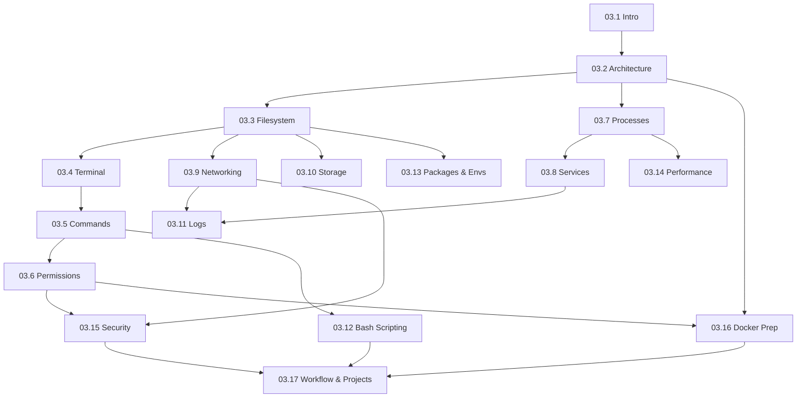

# Module 03 · Linux for AI Engineers — Lessons

[⬅ Module home](../README.md) · [🗺 Roadmap](../../../ROADMAP.md) · [📚 Curriculum](../../../CURRICULUM.md)

> This is the map of Module 03. Almost all AI infrastructure — GPU servers, cloud instances, Docker containers, Kubernetes nodes — runs **Linux**. This module makes you fluent working entirely from the terminal, and teaches Linux as an *operating system*, not a list of commands, so you understand *why* it works and *why* AI depends on it.

---

## Who this module is for

You understand operating systems *conceptually* from [Module 02.6](../../02-Computer-Science/weeks/02.6-operating-systems.md). This module turns that into hands-on fluency: the shell, filesystem, processes, permissions, networking, and services you'll use every day to build, deploy, debug, and maintain production AI systems.

> [!IMPORTANT]
> Module 02 taught you *what* an operating system does. Module 03 teaches you to *operate* one — from the command line, on the exact systems (GPU servers, cloud VMs, containers) where real AI work happens. If you can't work in a Linux terminal, you can't deploy or debug production AI. This module removes that ceiling.

---

## Lessons

| # | Lesson | Sections |
|---|---|---|
| 03.1 | [Introduction to Linux](03.1-introduction.md) | §1 what/why Linux; kernel vs OS; distros; why AI/cloud/Docker/K8s use it |
| 03.2 | [Linux Architecture](03.2-architecture.md) | §2 kernel, user space, shell, system calls, drivers, scheduler |
| 03.3 | [The Filesystem](03.3-filesystem.md) | §3 root/home, hierarchy, mounts, links, inodes, metadata |
| 03.4 | [Terminal Mastery](03.4-terminal-mastery.md) | §4 bash/zsh, env vars, PATH, pipes, redirection, wildcards |
| 03.5 | [Essential Commands](03.5-essential-commands.md) | §5 navigation, files, text processing (grep/awk/sed/…) |
| 03.6 | [Permissions & Ownership](03.6-permissions.md) | §6 users, groups, chmod/chown, umask, SUID/SGID/sticky |
| 03.7 | [Processes](03.7-processes.md) | §7 lifecycle, states, PIDs, daemons, jobs, signals, nice |
| 03.8 | [Services with systemd](03.8-services-systemd.md) | §8 systemd, systemctl, boot, journals |
| 03.9 | [Networking](03.9-networking.md) | §9 IP, DNS, routing, SSH/SCP/rsync, network tools |
| 03.10 | [Storage](03.10-storage.md) | §10 partitions, ext4/xfs, mounting, df/du/lsblk |
| 03.11 | [Logs](03.11-logs.md) | §11 syslog, journalctl, rotation, production debugging |
| 03.12 | [Bash Scripting](03.12-bash-scripting.md) | §12 variables, functions, conditionals, loops, error handling |
| 03.13 | [Package & Environment Management](03.13-package-environment.md) | §13–14 apt/dnf/snap; .bashrc; venv/conda/uv |
| 03.14 | [Performance Monitoring](03.14-performance-monitoring.md) | §15 free/vmstat/iostat/sar; bottleneck analysis |
| 03.15 | [Security](03.15-security.md) | §16 SSH keys, firewalls/UFW, Fail2Ban, secrets |
| 03.16 | [Docker Preparation](03.16-docker-preparation.md) | §17 namespaces, cgroups, OverlayFS/union filesystems |
| 03.17 | [The AI Engineer Workflow, Projects & Summary](03.17-workflow-projects-summary.md) | §18 a real day + six projects + consolidation |

### Companion artifacts
- 🏋️ [Exercises](../exercises/) — terminal, debugging, log analysis, permissions, scripting
- 🧠 [Flashcards](../flashcards/deck.md) — spaced-repetition deck
- 📝 [Quiz](../quizzes/quiz-01.md) — self-assessment with answers
- 📄 [Cheat sheet](../cheat-sheets/linux-cheatsheet.md) — one-page command & concept reference

---

## How the lessons connect

**Estimated time:** ~12 hours reading · ~3 hours projects · ~2 hours review (per the [Roadmap](../../../ROADMAP.md)).

> [!TIP]
> **Linux is learned by doing.** Read a lesson, then immediately try every command on a real Linux system — a cloud VM, WSL on Windows, a container, or a local install. You cannot learn the terminal by reading about it; muscle memory comes from typing. Keep a terminal open beside this handbook the entire module.
