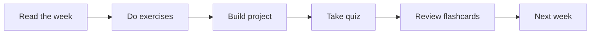

# Module 04 · Git

[⬅ 03 · Linux](../03-Linux/README.md) · [🏠 docs](../README.md) · [🗺 Roadmap](../../ROADMAP.md) · [05 · SQL ➡](../05-SQL/README.md)

> Version control and collaboration workflows for real teams.

---

## Purpose

This module covers **Git**. Version control and collaboration workflows for real teams. It fits into the overall program as described in the [Roadmap](../../ROADMAP.md) and [Curriculum](../../CURRICULUM.md).

## What you'll learn

- The Git object model and branching
- Collaboration workflows and pull requests
- Rebasing, resolving conflicts, and history hygiene
- Git for experiments, data, and large files

## 📖 Lessons (start here)

> ✅ **This module's content is written.** Work through the lessons in order via the [lesson index](weeks/README.md). Keep a **throwaway practice repo** open for the dangerous commands.

| # | Lesson |
|---|---|
| 04.1 | [Git Internals](weeks/04.1-git-internals.md) |
| 04.2 | [Commit History](weeks/04.2-commit-history.md) |
| 04.3 | [Branching Strategies](weeks/04.3-branching-strategies.md) |
| 04.4 | [Advanced Branch Management](weeks/04.4-advanced-branch-management.md) |
| 04.5 | [Merge Conflict Resolution](weeks/04.5-merge-conflicts.md) |
| 04.6 | [Tags & Releases](weeks/04.6-tags-releases.md) |
| 04.7 | [GitHub Collaboration](weeks/04.7-github-collaboration.md) |
| 04.8 | [Repository Management](weeks/04.8-repository-management.md) |
| 04.9 | [Large Files: Git LFS](weeks/04.9-large-files.md) |
| 04.10 | [Automation with Git Hooks](weeks/04.10-automation.md) |
| 04.11 | [GitHub Actions](weeks/04.11-github-actions.md) |
| 04.12 | [Debugging Git](weeks/04.12-debugging-git.md) |
| 04.13 | [AI Project Workflow, Projects & Summary](weeks/04.13-workflow-projects-summary.md) |

**Companion artifacts:** [Exercises](exercises/README.md) · [Quiz](quizzes/quiz-01.md) · [Flashcards](flashcards/deck.md) · [Cheat sheet](cheat-sheets/git-cheatsheet.md)

## How this module is organized

Content is delivered week by week. Each module uses the same subfolders:

| Folder | Contents |
|---|---|
| [`weeks/`](weeks/) | Weekly lesson content, one file per week (`week-01.md`, `week-02.md`, …). |
| [`diagrams/`](diagrams/) | Mermaid sources and exported diagram assets for this module. |
| [`exercises/`](exercises/) | Hands-on practice problems with solutions. |
| [`projects/`](projects/) | Buildable projects that apply this module's skills. |
| [`quizzes/`](quizzes/) | Self-assessment question banks with answer keys. |
| [`flashcards/`](flashcards/) | Spaced-repetition Q/A decks for active recall. |
| [`cheat-sheets/`](cheat-sheets/) | One-page quick references for this module. |
| [`references/`](references/) | Paper summaries and deep-dive notes. |

## Suggested study flow

## File & naming conventions

| Item | Convention | Example |
|---|---|---|
| Weekly lesson | `week-NN.md` | `weeks/week-01.md` |
| Exercise | `exercise-NN.md` (+ `solution-NN.*`) | `exercises/exercise-01.md` |
| Project | `project-NN/` folder with `README.md` | `projects/project-01/` |
| Quiz | `quiz-NN.md` (+ `answers-NN.md`) | `quizzes/quiz-01.md` |
| Flashcards | `deck.md` | `flashcards/deck.md` |
| Diagram | `topic.mmd` / `topic.png` | `diagrams/attention.mmd` |

## Markdown conventions

This file follows the repository Markdown standards — see [CONTRIBUTING.md](../../CONTRIBUTING.md): one H1 per file, tables over prose, GitHub callouts (`> [!NOTE]`), fenced code blocks with a language, Mermaid for diagrams, and relative internal links.

## Related modules

- [Linux](../03-Linux/README.md)
- [MLOps](../16-MLOps/README.md)

---

## Navigation

| Direction | Link |
|---|---|
| ⬆ Parent | [docs/](../README.md) |
| ⬅ Previous | [⬅ 03 · Linux](../03-Linux/README.md) |
| ➡ Next | [05 · SQL ➡](../05-SQL/README.md) |
| 🗺 Roadmap | [ROADMAP.md](../../ROADMAP.md) |
| 📚 Curriculum | [CURRICULUM.md](../../CURRICULUM.md) |
| 🏠 Repo root | [README.md](../../README.md) |
