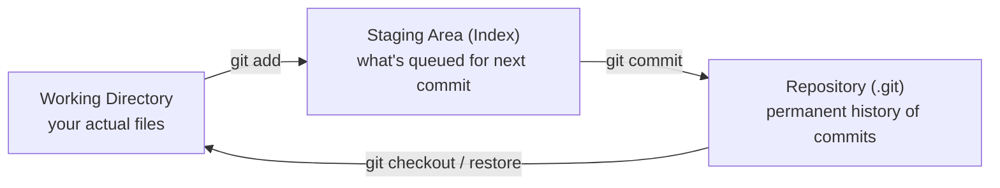
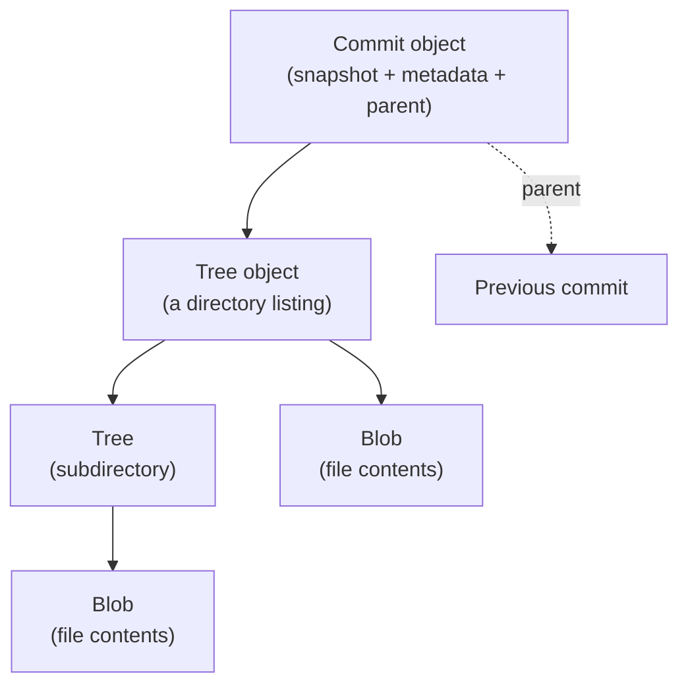
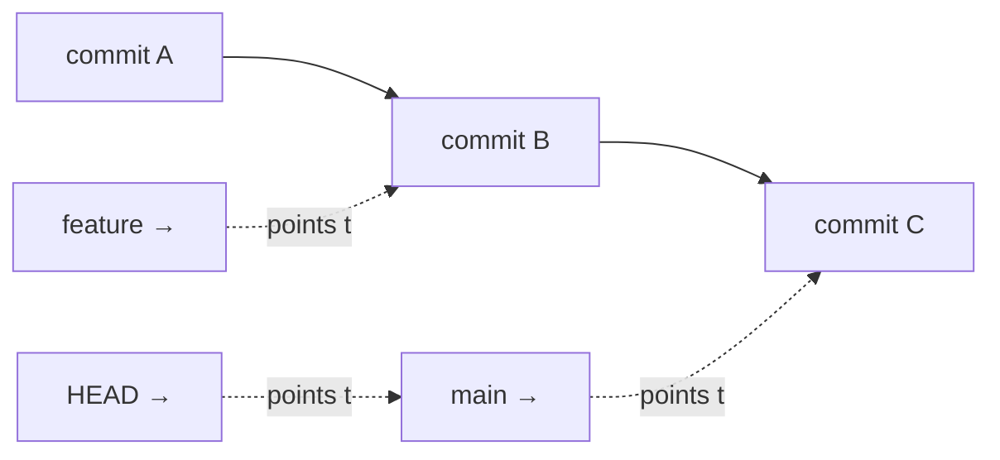
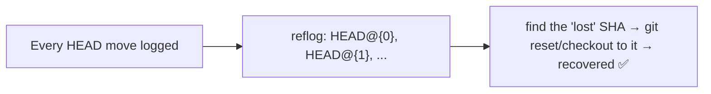

<!-- Module 04 · Lesson 1 — follows ../../../standards/. -->

# 04.1 · Git Internals

[⬅ Module index](README.md) · [🏠 Module](../README.md) · [🗺 Roadmap](../../../ROADMAP.md) · [Next ➡](04.2-commit-history.md)

> Git feels like magic until you see what it actually is: a **content-addressable key-value store** of four simple object types. Once you understand blobs, trees, commits, and refs, every Git command — and every recovery from a mistake — becomes obvious instead of terrifying.

| | |
|---|---|
| **Module** | `04 · Advanced Git & Collaboration` |
| **Lesson** | `04.1` |
| **Difficulty** | ⭐⭐⭐ |
| **Estimated study time** | 60 min read · 30 min practice |
| **Status** | 🟢 stable |

---

## 1. Learning Objectives

By the end of this lesson you will be able to:

- [ ] Explain the three areas: **working directory, staging area (index),** and **repository**.
- [ ] Describe Git's four **object types**: blobs, trees, commits, and tags.
- [ ] Explain **references (branches, HEAD, tags)** as pointers to commits.
- [ ] Understand the **reflog** and why it makes Git nearly loss-proof.
- [ ] Reason about *any* Git command in terms of objects and pointers.

## 2. Prerequisites

- You know basic Git (`add`, `commit`, `push`, `branch`, `merge`) — [Module 00.6](../../00-Orientation/weeks/00.6-github-repository-workflow.md).
- [Module 02.3 Data Structures](../../02-Computer-Science/weeks/02.3-data-structures.md) (hash tables, graphs, trees) — Git *is* these.

---

## 3. Why This Topic Exists

Most people use Git by memorizing command incantations, and it works — until something goes wrong. Then they're lost, because they never understood the *model*. Understanding Git internals transforms it from a scary black box into a simple, predictable system: every command manipulates objects and moves pointers, and almost nothing is ever truly deleted.

This is the single highest-leverage Git lesson. Once you see that commits are just snapshots linked in a graph and branches are just pointers, advanced operations (rebase, reset, cherry-pick) and recovery (reflog) become obvious rather than memorized.

> [!IMPORTANT]
> Git is a **content-addressable filesystem**: it stores objects keyed by the SHA hash of their content, in a key-value store (`.git/objects`). Commits form a graph ([Module 02.3](../../02-Computer-Science/weeks/02.3-data-structures.md)); branches and HEAD are just movable pointers into it. Internalize this one sentence and Git stops being magic. Everything else in this module builds on it.

## 4. The Three Areas

Git has three "places" a file can be, and most Git confusion comes from not knowing which one you're acting on.



| Area | What it is | Command to move into it |
|---|---|---|
| **Working directory** | Your actual files on disk you edit | (edit files) |
| **Staging area (index)** | A snapshot of what will go in the *next* commit | `git add` |
| **Repository (`.git`)** | The permanent, immutable commit history | `git commit` |

> [!IMPORTANT]
> The **staging area (index)** is Git's most under-appreciated feature. It lets you craft a commit deliberately — stage *some* changes, not others (`git add -p` to stage specific hunks) — so each commit is a clean, logical unit ([Module 00.6](../../00-Orientation/weeks/00.6-github-repository-workflow.md)). "Working directory vs staged vs committed" is exactly what `git status` shows you, and knowing which area a change is in resolves most beginner confusion. `git diff` shows working-vs-staged; `git diff --staged` shows staged-vs-committed.

---

## 5. The Four Object Types

Everything in Git's database is one of four object types, each stored by the SHA-1 (or SHA-256) hash of its content. This is the heart of Git.



| Object | Stores | Analogy |
|---|---|---|
| **Blob** | The *contents* of a file (no name, no metadata) | A file's bytes |
| **Tree** | A directory: names → blobs (files) and trees (subdirs) | A folder listing |
| **Commit** | A snapshot (points to one tree) + author, message, and **parent commit(s)** | A saved state + who/when/why |
| **Tag** (annotated) | A named pointer to an object + metadata | A labeled bookmark ([04.6](04.6-tags-releases.md)) |

```bash
# See it for yourself — Git objects are inspectable:
git cat-file -t <hash>       # the object's type (blob/tree/commit)
git cat-file -p <hash>       # pretty-print the object's content
git rev-parse HEAD           # the SHA of the current commit
git ls-tree HEAD             # the tree (files) of the current commit
```

> [!IMPORTANT]
> **A commit is a *snapshot*, not a diff.** This surprises people: Git doesn't store "the changes you made" — each commit points to a complete **tree** (the full state of your project at that moment). It *appears* to store diffs because Git computes them on the fly and deduplicates identical content (two commits with the same file share the same blob — content-addressing). This snapshot model is why branching and switching commits is fast and why Git is so robust. Understanding "commit = snapshot + parent pointer" makes the entire commit graph ([04.2](04.2-commit-history.md)) click.

### Content addressing (why hashes matter)

Each object's "key" is the SHA hash of its content. This means:

- **Identical content → identical hash → stored once** (deduplication).
- **Any change → different hash** — so history is *tamper-evident*: you can't alter a commit without changing its hash (and every descendant's hash).
- **The hash uniquely identifies** a commit forever (`git show a1b2c3d`).

> [!NOTE]
> This is exactly the hash-table idea from [Module 02.3](../../02-Computer-Science/weeks/02.3-data-structures.md): content → hash → storage. It's also why Git can verify integrity (a corrupted object fails its hash) and why a commit's identity is its full snapshot lineage, not just its message.

---

## 6. References — Branches, HEAD, and Tags

If commits are the graph, **references (refs)** are the *pointers* into it. This is the second key insight: **a branch is just a pointer to a commit** — a tiny file containing a SHA.



| Ref | What it is |
|---|---|
| **Branch** (e.g. `main`) | A movable pointer to a commit (`.git/refs/heads/main` = a SHA) |
| **HEAD** | A pointer to *the current branch* (usually) — "where you are now" |
| **Tag** | A pointer to a commit that *doesn't move* (a fixed label, [04.6](04.6-tags-releases.md)) |
| **Remote ref** (`origin/main`) | Your last-known position of a branch on the remote |

```bash
cat .git/HEAD                # e.g. "ref: refs/heads/main" — HEAD points at a branch
cat .git/refs/heads/main     # the SHA that 'main' points to
git branch                   # branches = pointers you can list
git log --oneline --all      # see all commits and where refs point
```

> [!IMPORTANT]
> **Creating a branch is instant and cheap because it's just writing a 40-character SHA to a file** — no copying. When you `commit`, Git creates a new commit object pointing to the current commit as parent, then moves the *current branch pointer* forward to the new commit (HEAD follows). When you `git checkout feature`, HEAD moves to point at `feature`. This "branches and HEAD are movable pointers" model explains **every** branch operation, merge, and reset in this module. Reset ([04.4](04.4-advanced-branch-management.md)) is literally "move the branch pointer to a different commit."

---

## 7. The Reflog — Git's Undo History

Here's the insight that makes you fearless: **Git records every move of HEAD and branch pointers in the reflog.** Even when you "lose" commits (bad reset, deleted branch, botched rebase), the commits still exist in `.git/objects` and the reflog remembers where you were.

```bash
git reflog                   # every position HEAD has been (with SHAs)
# e.g.:
#   a1b2c3d HEAD@{0}: reset: moving to HEAD~3
#   d4e5f6g HEAD@{1}: commit: add feature   ← the "lost" commit is right here!
git reset --hard d4e5f6g     # recover it — move HEAD back to that commit
```



> [!IMPORTANT]
> **The reflog is why you can almost never truly lose committed work in Git.** A "disastrous" `reset --hard`, a deleted branch, a bad rebase — the old commits still exist as objects, and `git reflog` shows you the SHA to recover them (until garbage collection, typically ~30–90 days later). This single fact turns Git from terrifying to safe: *if you committed it, you can get it back.* You'll use the reflog constantly in [04.4](04.4-advanced-branch-management.md) and [04.12](04.12-debugging-git.md). **The golden rule: commit early and often — committed work is recoverable; uncommitted work is not.**

> [!WARNING]
> The reflog is **local and per-repository** — it's not pushed, and a fresh clone has none. It also only tracks *committed* states and HEAD moves. **Uncommitted changes** (working directory / unstaged) are *not* in the reflog and *can* be lost by `reset --hard`, `checkout`, or `stash drop`. This is the core reason to commit frequently: a commit is a save point the reflog protects.

---

## 8. Putting It Together: What `git commit` Really Does

```mermaid
sequenceDiagram
    participant WD as Working Dir
    participant IDX as Index
    participant OBJ as .git/objects
    participant REF as Branch pointer
    WD->>IDX: git add (blobs created for changed files)
    IDX->>OBJ: git commit — write tree object(s) from the index
    OBJ->>OBJ: write commit object (tree + parent + message)
    OBJ->>REF: move current branch pointer → new commit
    Note over REF: HEAD follows the branch; reflog records the move
```

Every Git command is some combination of: **create objects**, **move pointers**, and **update the index/working directory**. Once you see commands this way, Git is deterministic and debuggable.

---

## 9. Common Mistakes & Recovery

| Mistake / confusion | Reality | Recovery |
|---|---|---|
| "Commits are diffs" | They're full snapshots (shared blobs) | — |
| "reset --hard destroyed my work" | Committed work is in the reflog | `git reflog` → `git reset --hard <sha>` |
| "I deleted a branch, lost commits" | Commits still exist as objects | `git reflog` → recreate branch at the SHA |
| Confusing working/staged/committed | Three areas; `git status` shows which | — |
| "The hash changed after rebase" | Rebase creates *new* commits (new hashes) | Old ones remain in reflog ([04.4](04.4-advanced-branch-management.md)) |
| Uncommitted work lost | Not protected by reflog | Commit/stash before risky operations |

## 10. Best Practices

- ✅ **Commit early and often** — commits are the save points the reflog protects.
- ✅ Use the **staging area deliberately** (`git add -p`) for clean, logical commits.
- ✅ Learn to *read* `git status` and `git log --oneline --graph` fluently.
- ✅ When confused, think in terms of **objects and pointers**, not commands.
- ❌ Don't fear "dangerous" commands once you know the reflog exists — but practice on a throwaway repo first.

## 11. Performance Considerations

| Note | Implication |
|---|---|
| Branches are pointers | Creating/switching branches is instant |
| Content deduplication | Identical files stored once (blobs shared) |
| Snapshots + compression | Git packs objects efficiently (`git gc`) |
| Large binaries bloat the store | Blobs of big files are stored forever → use LFS ([04.9](04.9-large-files.md)) |

> [!IMPORTANT]
> A performance/AI caveat from the object model: **every version of every file is stored forever as a blob** ([04.9](04.9-large-files.md)). Committing a 2 GB model checkpoint, then a new version, then another, permanently bloats the repo (each is a full blob — commits are snapshots, but *binary* files don't dedupe usefully across versions). This is *why* AI projects need **Git LFS** and careful `.gitignore` — the object model that makes text history efficient makes binary history catastrophic.

## 12. Security Considerations

| Risk | Guidance |
|---|---|
| Committed secrets persist in history | A deleted secret remains in old commits/objects forever — rotate it; rewrite history if needed ([04.12](04.12-debugging-git.md)) |
| History is tamper-evident (hashes) | Rewriting history changes hashes — detectable |
| Signed commits | GPG/SSH-signed commits verify authorship |
| Reflog leaks | Local reflog may contain sensitive committed states |

> [!CAUTION]
> **A secret committed to Git is in the history *forever*, even after you "delete" it** — the old commit's blob still exists (content-addressed, recoverable via reflog/objects). Simply committing a fix does NOT remove it. If you commit an API key ([Module 03.15](../../03-Linux/weeks/03.15-security.md)), you must **rotate the key immediately** and, if the repo is shared/public, rewrite history to purge it (`git filter-repo`, [04.12](04.12-debugging-git.md)). Prevention (`.gitignore` for `.env`, [04.9](04.9-large-files.md); pre-commit secret scanning, [04.10](04.10-automation.md)) is far easier than removal.

## 13. Interview Questions

**Beginner**
1. What are Git's three areas (working/staging/repository)?
2. Is a commit a diff or a snapshot? Explain.

**Intermediate**
1. What are the four Git object types, and what does each store?
2. What is a branch, internally? What is HEAD?

**Advanced**
1. Explain how content-addressing gives Git deduplication and integrity.
2. How does the reflog let you recover a "lost" commit after `reset --hard`?

**System-design prompt**
- Explain to a junior why they can recover from almost any Git mistake, using the object model and reflog. — *Follow-ups:* What *can't* be recovered? Why do AI repos need LFS given the object model?

## 14. Summary

| Key idea | Takeaway |
|---|---|
| Content-addressable store | Objects keyed by SHA of their content |
| Three areas | Working dir → index (staging) → repository |
| Four objects | Blob (file), tree (dir), commit (snapshot+parent), tag |
| Commit = snapshot | Not a diff; blobs are deduplicated |
| Refs are pointers | Branch = pointer to a commit; HEAD = current branch |
| Reflog | Records HEAD moves → recover "lost" commits |

## 15. Cheat Sheet

```text
3 AREAS: working dir --git add--> INDEX(staging) --git commit--> REPO(.git history)
  git status(which area) · git diff(work vs staged) · git diff --staged(staged vs committed) · git add -p(stage hunks)
4 OBJECTS (content-addressed by SHA): BLOB(file contents) · TREE(directory) · COMMIT(snapshot+parent+meta) · TAG
  inspect: git cat-file -t/-p <hash> · git rev-parse HEAD · git ls-tree HEAD
COMMIT = SNAPSHOT (full tree), NOT a diff · identical content → same hash → stored once (dedup + integrity)
REFS = POINTERS: branch = pointer to a commit (refs/heads/x) · HEAD = pointer to current branch · tag = fixed pointer
  creating a branch = write a SHA to a file (instant) · commit = new object + move branch pointer forward
REFLOG (git reflog): every HEAD move → recover "lost" commits: git reflog → git reset --hard <sha>
  ★ committed work is RECOVERABLE (reflog); uncommitted work is NOT → commit early & often
AI/SECURITY: every file version = a blob forever → big binaries need LFS (04.9) · committed secrets persist forever → rotate + rewrite
```

## 16. Flashcards

- **Q:** Is a Git commit a diff or a snapshot? — **A:** A snapshot — it points to a complete tree (full project state) plus parent(s); diffs are computed on the fly, and identical content is deduplicated as shared blobs.
- **Q:** What are Git's four object types? — **A:** Blob (file contents), tree (a directory), commit (a snapshot + metadata + parent pointer), and tag (a named pointer).
- **Q:** What is a branch, internally? — **A:** Just a movable pointer to a commit — a small file containing a SHA (`refs/heads/<name>`). Creating one is instant.
- **Q:** What is HEAD? — **A:** A pointer to the current branch (hence to the current commit) — "where you are now."
- **Q:** How do you recover a commit after a bad `reset --hard`? — **A:** `git reflog` to find the lost commit's SHA, then `git reset --hard <sha>` — the commit still exists as an object.
- **Q:** Why does a committed secret persist even after deletion? — **A:** The old commit's blob is content-addressed and stays in history/objects; you must rotate the secret and rewrite history to purge it.

## 17. Hands-on Exercises

> Full set in [`../exercises/`](../exercises/).

- [ ] **(⭐ Inspect)** In a repo, use `git cat-file -t` and `-p` on the HEAD commit's SHA, then its tree, then a blob — walk the object graph by hand.
- [ ] **(⭐⭐ Areas)** Modify a file; observe it in `git status` and `git diff`; `git add` it; observe the change in `git diff --staged`. Explain each state.
- [ ] **(⭐⭐ Pointers)** `cat .git/HEAD` and `.git/refs/heads/main`; make a commit; re-check them — see the pointer move.
- [ ] **(⭐⭐⭐ Reflog recovery)** On a **throwaway** repo: make 3 commits, `git reset --hard HEAD~2` (lose 2), then recover them via `git reflog`.
- [ ] **(⭐⭐⭐ Dedup)** Create two files with identical content; commit; use `git ls-tree` + `cat-file` to confirm they share one blob.

## 18. Mini Project

> **Git object-model explorer.** Write a script/notes that, given a repo, walks and explains the object graph: start at `HEAD` (`rev-parse`), show its commit object (`cat-file -p`), its tree, and the blobs — annotating each object type and how they link. Demonstrate content-addressing (identical files → shared blob) and reflog recovery. Deliverable: a hands-on report that makes Git's internals concrete. Understanding this deeply is what separates confident Git users from the rest.

## 19. References

- *Pro Git* (Chacon & Straub), Ch. 10 "Git Internals" — free online, the definitive explanation ([reference standards](../../../standards/reference-standards.md)).
- "Git from the inside out" (Mary Rose Cook) — an excellent internals walkthrough.
- `man gitcore-tutorial`, `git help cat-file`.

## 20. What's Next

You understand the objects. Now see how they connect: **commit history** — the commit graph, parents, merge commits, detached HEAD, and fast-forward merges — the structure you'll navigate and manipulate for the rest of the module.

➡️ **Next:** [04.2 · Commit History](04.2-commit-history.md)

---

### 🔁 Revision checklist
- [ ] I can explain the three areas and read `git status`
- [ ] I can name the four object types and what each stores
- [ ] I understand branches/HEAD as pointers to commits
- [ ] I recovered a "lost" commit with the reflog

### 🔗 Spaced-repetition callback
> Recall [Module 02.3's hash tables, trees, and graphs](../../02-Computer-Science/weeks/02.3-data-structures.md): Git literally *is* these — a hash-map of content-addressed objects, trees for directories, and a commit graph. And [Module 03.15's "secrets persist forever"](../../03-Linux/weeks/03.15-security.md) is explained here by the object model. Git internals are CS data structures made into a tool you use daily.
