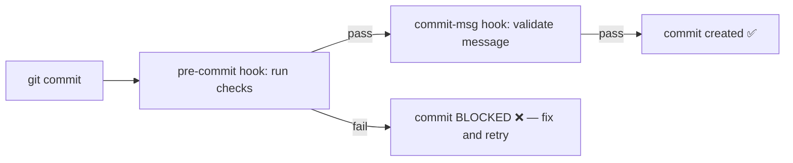
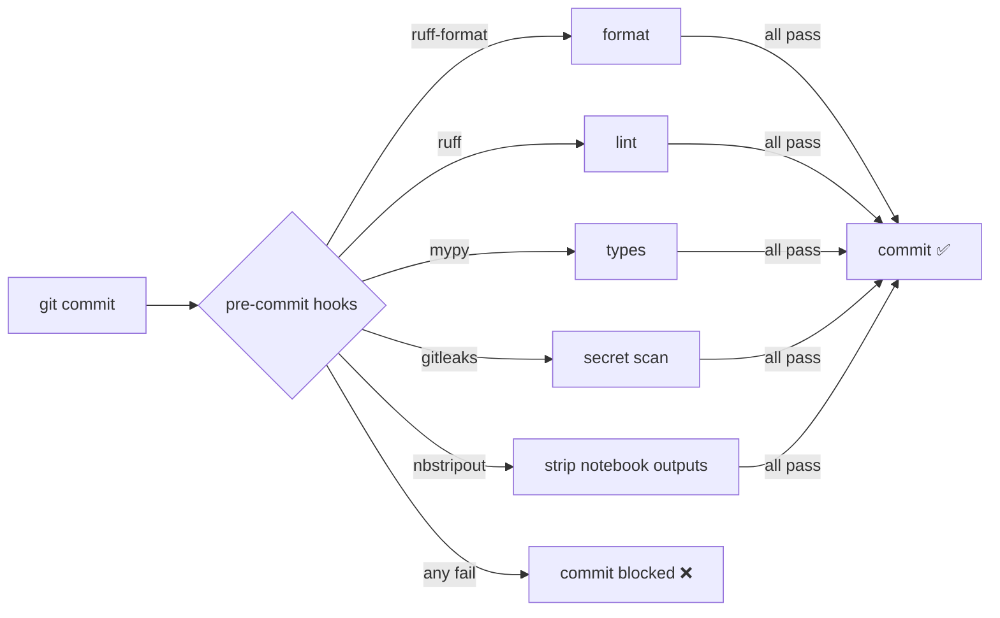
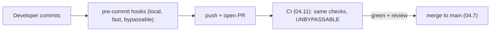

<!-- Module 04 · Lesson 10 — follows ../../../standards/. -->

# 04.10 · Automation with Git Hooks

[⬅ 04.9 Large Files](04.9-large-files.md) · [🏠 Module](../README.md) · [🗺 Roadmap](../../../ROADMAP.md) · [Next ➡](04.11-github-actions.md)

> Humans forget to format, lint, test, and check for secrets — so automate it. **Git hooks** (via the `pre-commit` framework) run quality checks automatically at commit time, blocking bad code and leaked secrets *before* they ever enter history. This is the local half of the quality-gate you complete with CI ([04.11](04.11-github-actions.md)).

| | |
|---|---|
| **Module** | `04 · Advanced Git & Collaboration` |
| **Lesson** | `04.10` |
| **Difficulty** | ⭐⭐⭐ |
| **Estimated study time** | 45 min read · 30 min practice |
| **Status** | 🟢 stable |

---

## 1. Learning Objectives

By the end of this lesson you will be able to:

- [ ] Explain **Git hooks** and the events they fire on.
- [ ] Use the **`pre-commit` framework** to run checks automatically.
- [ ] Automate **formatting, linting, testing,** and **secret scanning**.
- [ ] Enforce **commit-message conventions**.
- [ ] Understand how local hooks + CI form a two-layer quality gate.

## 2. Prerequisites

- [Module 01.13 Packaging & Code Quality](../../01-Advanced-Python/weeks/01.13-packaging-code-quality.md) (Ruff/mypy/pre-commit — you met this) and [04.7](04.7-github-collaboration.md).

---

## 3. Why This Topic Exists

Quality standards you have to *remember* to follow get skipped under deadline pressure — someone commits unformatted code, or forgets to run tests, or (worst) commits a secret ([04.1](04.1-git-internals.md)/[04.9](04.9-large-files.md)). **Automation removes the human from the loop**: the checks run automatically on every commit, so standards are enforced consistently by machines, not memory. This keeps the codebase clean, catches bugs early, and prevents disasters — freeing humans to review *logic* ([04.7](04.7-github-collaboration.md)) instead of style.

You already met this in [Module 01.13](../../01-Advanced-Python/weeks/01.13-packaging-code-quality.md); this lesson explains the Git mechanism (hooks) beneath it and extends it to the team.

> [!IMPORTANT]
> **Automated checks are the cheapest, most reliable quality control available** — they never forget, never get tired, and apply the same standard to everyone. The principle: *catch problems as early as possible*, because a bug/secret caught at **commit time** costs seconds; the same issue caught in **CI** costs minutes; in **code review** costs an hour; in **production** costs a disaster ([Module 02.12](../../02-Computer-Science/weeks/02.12-debugging.md)). Hooks are the earliest, cheapest catch point.

## 4. Git Hooks — Scripts That Fire on Events

**Git hooks** are scripts Git runs automatically at specific points in the Git lifecycle. They live in `.git/hooks/` and fire on events like committing or pushing.



| Hook | Fires | Common use |
|---|---|---|
| **pre-commit** | Before a commit is created | Format, lint, test, scan for secrets |
| **commit-msg** | After the message is written | Enforce message conventions |
| **pre-push** | Before pushing to a remote | Run tests before sharing |
| **post-merge** | After a merge | Refresh dependencies |

> [!NOTE]
> Raw Git hooks (shell scripts in `.git/hooks/`) work but have a big flaw: **they're not committed to the repo** (`.git/` is local, [04.1](04.1-git-internals.md)), so they aren't shared with the team. That's why the **`pre-commit` framework** (§5) exists — it stores hook *config* in a committed file, so everyone gets the same checks. Use the framework, not hand-written `.git/hooks/` scripts.

---

## 5. The `pre-commit` Framework

**`pre-commit`** (a tool, confusingly named after the hook) manages hooks via a committed config file, so the whole team runs identical checks. You met it in [Module 01.13](../../01-Advanced-Python/weeks/01.13-packaging-code-quality.md); here's the full picture.

```yaml
# .pre-commit-config.yaml — committed to the repo (shared with everyone)
repos:
  - repo: https://github.com/astral-sh/ruff-pre-commit
    rev: v0.6.0
    hooks:
      - id: ruff          # lint + autofix (04 / Module 01.13)
      - id: ruff-format   # format
  - repo: https://github.com/pre-commit/mirrors-mypy
    rev: v1.11.0
    hooks:
      - id: mypy          # type-check
  - repo: https://github.com/gitleaks/gitleaks
    rev: v8.18.0
    hooks:
      - id: gitleaks      # 🔒 scan for secrets!
  - repo: https://github.com/kynan/nbstripout
    rev: 0.7.1
    hooks:
      - id: nbstripout    # strip notebook outputs (04.5/04.9)
```

```bash
pip install pre-commit        # or: uv add --dev pre-commit
pre-commit install            # install the git hook (once per clone)
# now every `git commit` runs the configured checks automatically
pre-commit run --all-files    # run on the whole repo manually
```



> [!IMPORTANT]
> **The `pre-commit` framework stores its config in a committed `.pre-commit-config.yaml`, so every developer runs the same checks** — unlike raw hooks. On each commit it runs your pipeline (format, lint, types, tests, secret-scan, notebook-strip) and *blocks the commit if anything fails*, printing what to fix. For AI teams, the killer additions beyond code quality are **`gitleaks`** (secret scanning — stops the API-key-in-history disaster from [04.1](04.1-git-internals.md)/[04.9](04.9-large-files.md) *before* it happens) and **`nbstripout`** (strips notebook outputs, preventing the merge-conflict/bloat problems from [04.5](04.5-merge-conflicts.md)/[04.9](04.9-large-files.md)).

---

## 6. What to Automate

| Check | Tool | Prevents |
|---|---|---|
| **Formatting** | Ruff format / Black | Style debates, noisy diffs ([Module 01.13](../../01-Advanced-Python/weeks/01.13-packaging-code-quality.md)) |
| **Linting** | Ruff / flake8 | Bugs, bad patterns |
| **Type checking** | mypy | Type errors ([Module 01.8](../../01-Advanced-Python/weeks/01.8-type-hinting.md)) |
| **Secret scanning** | gitleaks / detect-secrets | Leaked credentials 🔒 |
| **Notebook stripping** | nbstripout | Bloat + conflicts ([04.5](04.5-merge-conflicts.md)) |
| **Tests** | pytest (often in pre-push/CI) | Regressions ([Module 01.10](../../01-Advanced-Python/weeks/01.10-testing.md)) |
| **Large-file check** | check-added-large-files | Accidental big commits ([04.9](04.9-large-files.md)) |
| **Commit message** | commitlint / conventional | Inconsistent history (§7) |

> [!TIP]
> **Put *fast* checks in pre-commit, *slow* ones in CI** ([04.11](04.11-github-actions.md)). Formatting, linting, type-check, and secret-scan are near-instant — perfect for pre-commit (instant feedback). A full test suite might take minutes — too slow to run on every commit, so it goes in CI (or a `pre-push` hook). This keeps committing snappy while still gating everything before merge. Don't make pre-commit so slow that people bypass it (`git commit --no-verify`).

---

## 7. Commit Message Linting

Enforcing a commit-message convention (like **Conventional Commits**, [Module 00.6](../../00-Orientation/weeks/00.6-github-repository-workflow.md)) via a `commit-msg` hook keeps history readable and even enables automated changelogs/releases ([04.6](04.6-tags-releases.md)).

```text
feat(retriever): add hybrid search       ✅ passes
fixed stuff                              ❌ rejected (no type, vague)
```

| Benefit | How |
|---|---|
| Consistent, scannable history | `type(scope): summary` enforced |
| Automated changelog | Tools parse conventional commits → release notes ([04.6](04.6-tags-releases.md)) |
| Automated version bumping | `feat` → MINOR, `fix` → PATCH, `BREAKING` → MAJOR (SemVer, [04.6](04.6-tags-releases.md)) |

> [!NOTE]
> Conventional-commit linting is optional but powerful: tools like `commitlint` (a `commit-msg` hook) reject non-conforming messages, and downstream tools (`semantic-release`) can then *auto-generate* the changelog and version bump from the commit types ([04.6](04.6-tags-releases.md)). Even without full automation, a message convention makes `git log` far more useful ([04.2](04.2-commit-history.md)/[Module 00.6](../../00-Orientation/weeks/00.6-github-repository-workflow.md)).

---

## 8. Two-Layer Quality Gate: Hooks + CI

Local hooks are fast feedback but *bypassable* (`--no-verify`); CI ([04.11](04.11-github-actions.md)) is the *unbypassable* enforcement. Together they form defense in depth.



> [!IMPORTANT]
> **Run the *same* checks in pre-commit (local) and CI (server)** ([04.11](04.11-github-actions.md)). Hooks give developers instant feedback and catch most issues before they're even pushed; CI *guarantees* the checks ran (since a developer can skip hooks with `--no-verify`, and a fresh clone might not have hooks installed). Protected branches ([04.7](04.7-github-collaboration.md)) require CI to pass before merge — so nothing bad reaches `main` regardless of local setup. This is the same two-layer pattern from [Module 01.13](../../01-Advanced-Python/weeks/01.13-packaging-code-quality.md), now understood as hooks (fast/local) + CI (authoritative/remote).

---

## 9. Common Mistakes & Best Practices

| Mistake | Better |
|---|---|
| Hand-written `.git/hooks/` (not shared) | Use the `pre-commit` framework (committed config) |
| Slow checks in pre-commit | Fast checks local; slow (tests) in CI/pre-push |
| No secret scanning | Add `gitleaks` — prevents leaked-key disasters |
| Committing notebook outputs | `nbstripout` hook ([04.5](04.5-merge-conflicts.md)) |
| Relying only on hooks | Also enforce in CI (hooks are bypassable) |
| Hooks so annoying people `--no-verify` | Keep them fast and useful |
| No commit-message convention | `commitlint` / Conventional Commits |

## 10. Performance / Operational Considerations

| Principle | Takeaway |
|---|---|
| Pre-commit runs on changed files only | Fast local feedback |
| Fast local, slow in CI | Don't block committing on long tests |
| Cache pre-commit environments | First run is slow; subsequent are fast |
| Consistency | Same config for everyone = predictable |

## 11. Security Considerations

| Risk | Guidance |
|---|---|
| **Committed secrets** | `gitleaks`/`detect-secrets` pre-commit hook 🔒 ([04.1](04.1-git-internals.md)/[04.9](04.9-large-files.md)) |
| Malicious hook code | Review third-party hooks before adding (they run on your machine) |
| Bypassed hooks | Enforce the same checks in CI ([04.11](04.11-github-actions.md)) |
| Large/sensitive files committed | `check-added-large-files` hook ([04.9](04.9-large-files.md)) |

> [!CAUTION]
> **A secret-scanning pre-commit hook (`gitleaks`) is one of the highest-value automations for AI teams** — it blocks a commit that contains an API key, password, or private key *before* it enters history ([04.1](04.1-git-internals.md): where secrets persist forever). This single hook prevents the most common and damaging Git security incident ([Module 03.15](../../03-Linux/weeks/03.15-security.md)). But note: hooks are *local and bypassable*, so also run secret scanning in CI ([04.11](04.11-github-actions.md)) and use GitHub's push-protection/secret-scanning as backstops. Defense in depth ([Module 03.15](../../03-Linux/weeks/03.15-security.md)).

## 12. Interview Questions

**Beginner**
1. What are Git hooks, and what does a pre-commit hook do?
2. Why use the `pre-commit` framework instead of raw `.git/hooks/`?

**Intermediate**
1. What checks belong in pre-commit vs CI, and why?
2. How do you prevent secrets from being committed?

**Advanced**
1. Why do you run the same checks in both hooks and CI?
2. How can commit-message linting enable automated changelogs and releases?

**System-design prompt**
- Design the automated quality pipeline for an AI team's repo. — *Follow-ups:* Which checks in pre-commit vs CI? How do you handle secrets and notebooks? How do hooks + protected branches + CI combine?

## 13. Summary

| Key idea | Takeaway |
|---|---|
| Automate quality | Machines enforce standards consistently |
| Catch early = cheap | Commit-time < CI < review < production |
| `pre-commit` framework | Committed config → shared checks |
| Automate | Format, lint, types, secret-scan, notebook-strip |
| Fast local, slow CI | Keep committing snappy |
| Hooks + CI | Two-layer gate (bypassable + authoritative) |

## 14. Cheat Sheet

```text
GIT HOOKS = scripts Git runs on events (.git/hooks/, but NOT shared → use the framework)
  pre-commit(before commit) · commit-msg(validate message) · pre-push(before push) · post-merge
PRE-COMMIT FRAMEWORK (shared, committed config): .pre-commit-config.yaml
  pip/uv add pre-commit → pre-commit install (once/clone) → runs on every commit, BLOCKS on failure
  pre-commit run --all-files (manual)
AUTOMATE: ruff-format(style) · ruff(lint) · mypy(types) · GITLEAKS(secrets 🔒) · nbstripout(notebook outputs) ·
  check-added-large-files(04.9) · pytest(usually CI/pre-push)
FAST checks → pre-commit (instant) · SLOW checks (full tests) → CI/pre-push (don't block commits)
COMMIT MSG: commitlint enforces type(scope): summary → enables auto changelog + version bump (04.6)
TWO-LAYER GATE: hooks(local, fast, BYPASSABLE via --no-verify) + CI(remote, authoritative, 04.11) + protected branches(04.7)
CATCH EARLY: commit(seconds) < CI(minutes) < review(hour) < production(disaster)
SECURITY: gitleaks hook = highest-value (blocks secrets before history) + CI scan backstop
```

## 15. Flashcards

- **Q:** What is a pre-commit hook? — **A:** A script Git runs before creating a commit; it can format, lint, test, and scan for secrets, and *block the commit* if checks fail.
- **Q:** Why use the `pre-commit` framework over raw `.git/hooks/`? — **A:** Raw hooks live in `.git/` and aren't shared; the framework's config is committed (`.pre-commit-config.yaml`), so the whole team runs identical checks.
- **Q:** What belongs in pre-commit vs CI? — **A:** Fast checks (format, lint, types, secret-scan) in pre-commit for instant feedback; slow checks (full test suite) in CI so committing stays fast.
- **Q:** How do you prevent secrets from being committed? — **A:** A secret-scanning pre-commit hook (e.g., `gitleaks`) blocks commits containing keys/passwords before they enter history — backed by CI scanning.
- **Q:** Why run the same checks in hooks AND CI? — **A:** Hooks give fast local feedback but are bypassable (`--no-verify`) and may not be installed; CI guarantees the checks ran (unbypassable, enforced by protected branches).
- **Q:** How does commit-message linting help releases? — **A:** Conventional-commit messages can be parsed to auto-generate changelogs and auto-bump the SemVer version (feat→minor, fix→patch).

## 16. Hands-on Exercises

> Full set in [`../exercises/`](../exercises/).

- [ ] **(⭐ Setup)** Add a `.pre-commit-config.yaml` with Ruff + mypy; `pre-commit install`; watch a failing commit get blocked.
- [ ] **(⭐⭐ Secrets)** Add the `gitleaks` hook; try to commit a fake API key; watch it get blocked.
- [ ] **(⭐⭐ Notebooks)** Add `nbstripout`; commit a notebook with outputs; confirm outputs are stripped.
- [ ] **(⭐⭐ Manual run)** Run `pre-commit run --all-files` on a repo; fix what it flags.
- [ ] **(⭐⭐⭐ Commit-msg)** Add a `commit-msg` hook enforcing Conventional Commits; test a passing and failing message.

## 17. Mini Project

> **Build a CI pipeline (this module's showcase, v5 — local half).** Configure the *local* quality automation for a Python AI repo: a `.pre-commit-config.yaml` with formatting, linting, type-checking, secret scanning, notebook stripping, and large-file checks, plus commit-message linting. Document what runs when and why. Then in [04.11](04.11-github-actions.md) you'll add the *remote* CI half (same checks, unbypassable) — together a complete quality gate. Deliverable: a reusable pre-commit config for every AI project.

## 18. References

- pre-commit framework docs (pre-commit.com); gitleaks; nbstripout ([reference standards](../../../standards/reference-standards.md)).
- *Pro Git*, Ch. 8.3 "Git Hooks"; Conventional Commits (conventionalcommits.org).
- [Module 01.13 · Packaging & Code Quality](../../01-Advanced-Python/weeks/01.13-packaging-code-quality.md) — where you first met pre-commit.

## 19. What's Next

Local hooks are the fast, bypassable layer. Now build the authoritative one: **GitHub Actions** — CI/CD workflows that run tests, lint, and deploy automatically on the server, gating every merge to `main`.

➡️ **Next:** [04.11 · GitHub Actions](04.11-github-actions.md)

---

### 🔁 Revision checklist
- [ ] I understand Git hooks and why to use the `pre-commit` framework
- [ ] I can configure format/lint/type/secret/notebook checks
- [ ] I know which checks go in pre-commit vs CI
- [ ] I added a secret-scanning hook

### 🔗 Spaced-repetition callback
> Recall [Module 01.13's pre-commit + Ruff/mypy](../../01-Advanced-Python/weeks/01.13-packaging-code-quality.md): you met the tool there; now you understand the *hook mechanism* beneath it and extended it with secret-scanning and notebook-stripping for AI. And [04.9's "secrets persist forever"](04.9-large-files.md) is *why* the gitleaks hook is so valuable — prevention at the earliest possible point.
