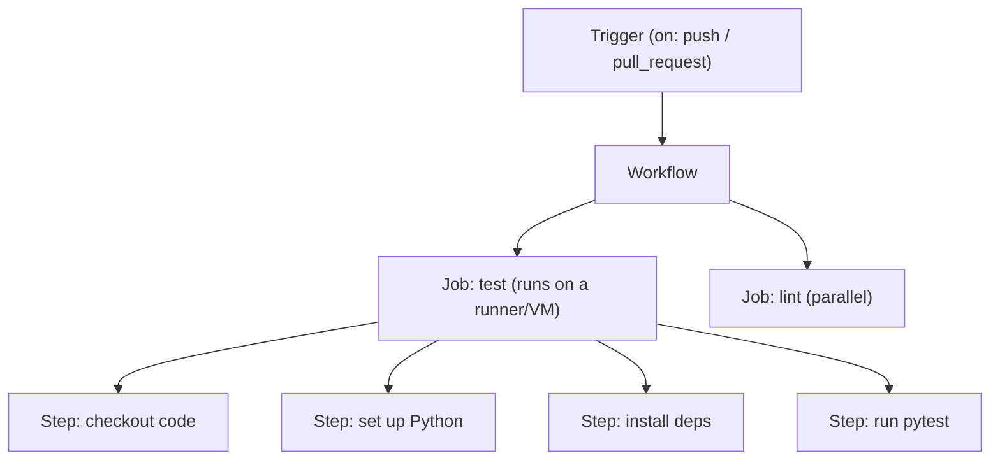
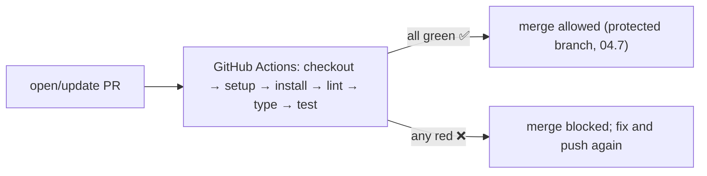

<!-- Module 04 · Lesson 11 — follows ../../../standards/. -->

# 04.11 · GitHub Actions

[⬅ 04.10 Automation](04.10-automation.md) · [🏠 Module](../README.md) · [🗺 Roadmap](../../../ROADMAP.md) · [Next ➡](04.12-debugging-git.md)

> CI/CD is how professional teams guarantee quality: every push runs tests, lint, and type-checks automatically on a server, and merges are blocked until they pass. **GitHub Actions** is the built-in way to build these pipelines. This lesson teaches you to write CI workflows for AI/Python projects — the authoritative, unbypassable half of the quality gate.

| | |
|---|---|
| **Module** | `04 · Advanced Git & Collaboration` |
| **Lesson** | `04.11` |
| **Difficulty** | ⭐⭐⭐ |
| **Estimated study time** | 55 min read · 40 min practice |
| **Status** | 🟢 stable |

---

## 1. Learning Objectives

By the end of this lesson you will be able to:

- [ ] Explain **CI/CD** and how GitHub Actions implements it.
- [ ] Write a **workflow file**: triggers, jobs, steps, runners.
- [ ] Use **secrets**, **caching**, and **matrix builds**.
- [ ] Build a CI pipeline that tests and lints a Python AI project.
- [ ] Connect CI to **protected branches** as a merge gate.

## 2. Prerequisites

- [04.10 Automation](04.10-automation.md) (same checks, local), [04.7 Collaboration](04.7-github-collaboration.md) (protected branches), [Module 01.10 Testing](../../01-Advanced-Python/weeks/01.10-testing.md).

---

## 3. Why This Topic Exists

Local hooks ([04.10](04.10-automation.md)) are fast but *bypassable* and depend on each developer's setup. **CI (Continuous Integration)** runs your checks on a clean server for *every* push and PR — guaranteeing that tests pass, code lints, and nothing broken merges, regardless of what developers do locally. **CD (Continuous Deployment)** extends this to automatically deploy passing code. Together, CI/CD is the backbone of modern software delivery and a defining practice of high-performing teams (DORA research).

For AI Engineers, CI is how you keep a shared model/service codebase reliable, and CD is how model updates reach production safely ([Module 16 · MLOps](../../16-MLOps/README.md)). GitHub Actions is the most accessible way to build it — it's built into GitHub, free for public repos, and configured with simple YAML.

> [!IMPORTANT]
> **CI is the *unbypassable* quality gate** ([04.10](04.10-automation.md)): a developer can skip local hooks with `--no-verify`, but they can't skip CI — it runs on GitHub's servers, and **protected branches** ([04.7](04.7-github-collaboration.md)) block merging until it passes. This is what *guarantees* "main is always deployable" ([04.3](04.3-branching-strategies.md)) rather than merely hoping. CI turns "we should run tests" into "broken code cannot merge."

## 4. Anatomy of a Workflow

GitHub Actions runs **workflows** — YAML files in `.github/workflows/` that define what happens on which events.



| Concept | Meaning |
|---|---|
| **Workflow** | A YAML file defining an automated process (`.github/workflows/ci.yml`) |
| **Trigger (`on`)** | The event that starts it (push, pull_request, tag, schedule) |
| **Job** | A set of steps that run on one **runner**; jobs run in parallel by default |
| **Runner** | The VM/container executing a job (GitHub-hosted Ubuntu, or self-hosted) |
| **Step** | A single command or reusable **action** |
| **Action** | A reusable unit (e.g., `actions/checkout`, `actions/setup-python`) |

---

## 5. A Real CI Workflow for a Python AI Project

```yaml
# .github/workflows/ci.yml
name: CI

on:                                  # TRIGGERS
  push:
    branches: [main]
  pull_request:                      # run on every PR (the merge gate, 04.7)

jobs:
  test:                              # a JOB
    runs-on: ubuntu-latest           # the RUNNER (Linux, Module 03!)
    steps:
      - uses: actions/checkout@v4    # STEP: get the code (an ACTION)
      - uses: actions/setup-python@v5
        with:
          python-version: "3.11"
      - name: Install deps
        run: |                       # STEP: run commands (Module 03.12 bash)
          pip install uv
          uv sync                    # reproducible install from lockfile (04.9/Module 01.13)
      - name: Lint
        run: uv run ruff check .     # same check as pre-commit (04.10)
      - name: Type check
        run: uv run mypy src
      - name: Test
        run: uv run pytest --cov     # tests (Module 01.10)
```



> [!IMPORTANT]
> **This workflow runs the *same checks as your pre-commit hooks* ([04.10](04.10-automation.md)), but authoritatively on a clean server for every PR.** The runner is a fresh Linux VM ([Module 03](../../03-Linux/README.md) — CI runs on Linux!), so it also verifies your project installs from scratch reproducibly ([Module 01.13 lockfiles](../../01-Advanced-Python/weeks/01.13-packaging-code-quality.md)) — catching "works on my machine" bugs. Combined with a protected branch requiring this check ([04.7](04.7-github-collaboration.md)), a PR *cannot merge* unless lint, types, and tests all pass. That's the whole game: automated, guaranteed quality on `main`.

---

## 6. Secrets, Caching, and Matrix Builds

Three features you'll use constantly:

### Secrets

Workflows often need credentials (API keys to run integration tests, deploy tokens). **Never hard-code them** ([Module 03.15](../../03-Linux/weeks/03.15-security.md)) — store them in GitHub **Secrets** and reference them as env vars.

```yaml
      - name: Run integration test
        env:
          API_KEY: ${{ secrets.API_KEY }}   # from repo/org Settings → Secrets
        run: uv run pytest tests/integration
```

### Caching

Installing dependencies (especially heavy ML libraries) is slow. **Cache** them so subsequent runs are fast.

```yaml
      - uses: actions/setup-python@v5
        with:
          python-version: "3.11"
          cache: pip                 # cache dependencies between runs (speeds CI up a lot)
```

### Matrix builds

Test across multiple versions/OSes in parallel with a **matrix** — essential for libraries that must support several Python versions.

```yaml
    strategy:
      matrix:
        python-version: ["3.10", "3.11", "3.12"]
    steps:
      - uses: actions/setup-python@v5
        with:
          python-version: ${{ matrix.python-version }}
      # → runs the whole job once per Python version, in parallel
```

> [!IMPORTANT]
> Three practical essentials: **(1) Secrets** — CI needs credentials for integration tests/deploys; store them in GitHub Secrets (encrypted, injected as env vars), *never* in the workflow file ([Module 03.15](../../03-Linux/weeks/03.15-security.md)). **(2) Caching** — ML dependencies are huge and slow to install; caching turns multi-minute installs into seconds, making CI fast enough that people don't resent it. **(3) Matrix** — run the same job across Python versions/OSes in parallel (recall [Module 02.4 divide-and-conquer](../../02-Computer-Science/weeks/02.4-algorithms.md)/[02.8 parallelism](../../02-Computer-Science/weeks/02.8-concurrency.md)) — vital for SDKs/libraries that must work everywhere.

---

## 7. CI vs CD, and AI-Specific Pipelines

| | Continuous Integration (CI) | Continuous Deployment/Delivery (CD) |
|---|---|---|
| Does | Test/lint every change automatically | Auto-deploy passing changes |
| Trigger | push / PR | merge to `main` / a tag ([04.6](04.6-tags-releases.md)) |
| Gate | Blocks bad merges | Ships good code |

For **AI projects**, CI/CD extends beyond code tests:

| AI CI/CD step | Purpose |
|---|---|
| Lint / type / unit tests | Standard code quality ([Module 01.10](../../01-Advanced-Python/weeks/01.10-testing.md)) |
| **Model evaluation** | Run eval on a held-out set; block if metrics regress ([Module 19](../../19-Production-AI/README.md)) |
| **Data validation** | Check dataset schema/quality ([Module 02.9](../../02-Computer-Science/weeks/02.9-serialization.md)) |
| Build & push Docker image | Package the model service ([Module 03.16](../../03-Linux/weeks/03.16-docker-preparation.md)/[Module 16](../../16-MLOps/README.md)) |
| Deploy | Ship to staging/production |

> [!NOTE]
> AI CI/CD adds **evaluation gates** — CI can run a model against an eval set and *block the merge if quality drops* (like a test, but for model behavior, [Module 01.10 testing vs evaluation](../../01-Advanced-Python/weeks/01.10-testing.md)/[Module 19](../../19-Production-AI/README.md)). This is a preview of **MLOps** ([Module 16](../../16-MLOps/README.md)): the CI/CD you learn here is the foundation, extended with model/data-specific steps. For now, focus on solid *code* CI (test/lint/type) — that's the universal base.

---

## 8. Common Mistakes & Best Practices

| Mistake | Better |
|---|---|
| Secrets in the workflow file | GitHub Secrets, referenced as env |
| No caching → slow CI | Cache dependencies |
| CI checks ≠ local hook checks | Keep them in sync ([04.10](04.10-automation.md)) |
| Not requiring CI on protected branches | Require the check to merge ([04.7](04.7-github-collaboration.md)) |
| Flaky tests in CI | Fix or quarantine — flaky CI erodes trust ([Module 01.10](../../01-Advanced-Python/weeks/01.10-testing.md)) |
| Giant monolithic workflow | Split into focused jobs (parallel) |
| Running everything on every trigger | Scope triggers/paths appropriately |

- ✅ **Require CI on protected `main`** — it's only a gate if merging depends on it.
- ✅ Keep CI **fast** (cache, parallelize) so it doesn't bottleneck delivery.
- ✅ Mirror local hooks ([04.10](04.10-automation.md)) in CI for consistency.
- ✅ Fail fast and clearly — a red CI should point straight at the problem.

## 9. Performance / Operational Considerations

| Principle | Takeaway |
|---|---|
| Cache dependencies | Turns minutes into seconds |
| Parallel jobs / matrix | Faster feedback |
| Scope triggers (paths) | Don't run everything on doc-only changes |
| Fast CI = fast delivery | Slow CI bottlenecks the whole team |
| Self-hosted runners for GPU | AI eval/training may need GPU runners ([Module 17](../../17-Cloud/README.md)) |

## 10. Security Considerations

| Risk | Guidance |
|---|---|
| Secrets in logs/workflow | Use GitHub Secrets; they're masked in logs |
| Malicious third-party actions | Pin actions to a SHA/version; use trusted publishers |
| Fork PRs accessing secrets | GitHub restricts secrets on fork PRs by default — don't override carelessly |
| CI with production access | Least privilege for deploy credentials ([Module 03.15](../../03-Linux/weeks/03.15-security.md)) |
| Supply-chain via CI | CI runs code — a compromised dependency/action runs in your pipeline ([Module 02.9](../../02-Computer-Science/weeks/02.9-serialization.md)) |

> [!CAUTION]
> **CI is a privileged execution environment** — it runs code with access to your secrets and possibly deploy credentials. Treat it as a security-sensitive surface: **pin third-party actions** to specific versions/SHAs (an action that changes under you can steal secrets), grant deploy credentials **least privilege** ([Module 03.15](../../03-Linux/weeks/03.15-security.md)), and be careful with workflows triggered by **fork PRs** (GitHub restricts secret access there for good reason — a malicious PR could otherwise exfiltrate your secrets). Add secret scanning ([04.10 gitleaks](04.10-automation.md)) as a CI step too — the unbypassable backstop.

## 11. Interview Questions

**Beginner**
1. What is CI/CD, and how does GitHub Actions implement it?
2. What are triggers, jobs, steps, and runners in a workflow?

**Intermediate**
1. Write a CI workflow that lints and tests a Python project on every PR.
2. How do you handle secrets and speed up CI (caching)?

**Advanced**
1. How do CI + protected branches + local hooks form a complete quality gate?
2. What's a matrix build, and when is it essential? What AI-specific CI steps exist?

**System-design prompt**
- Design the CI/CD pipeline for an AI model service. — *Follow-ups:* What runs on PR vs on merge vs on tag? Where do model evaluation and Docker build fit? How do you gate `main`? How do you keep it fast and secure?

## 12. Summary

| Key idea | Takeaway |
|---|---|
| CI = unbypassable gate | Runs on the server for every push/PR |
| Workflow anatomy | Triggers → jobs → steps on runners |
| Same checks as hooks | Authoritative version of [04.10](04.10-automation.md) |
| Secrets/cache/matrix | Credentials safely, fast installs, parallel versions |
| Gate `main` | Protected branch requires CI to pass ([04.7](04.7-github-collaboration.md)) |
| AI CI/CD | Adds eval/data gates + Docker build ([Module 16](../../16-MLOps/README.md)) |

## 13. Cheat Sheet

```text
CI = run tests/lint/types on the SERVER for every push/PR (UNBYPASSABLE, unlike local hooks 04.10)
CD = auto-deploy passing code · together = CI/CD backbone of modern delivery
WORKFLOW (.github/workflows/ci.yml):
  on: push/pull_request/tag/schedule   (TRIGGERS)
  jobs: <name>: runs-on: ubuntu-latest (RUNNER — Linux!) · run in parallel
    steps: - uses: actions/checkout@v4 · actions/setup-python@v5 · run: <commands>
CHECKS (mirror pre-commit 04.10): ruff check · mypy src · pytest --cov · (+ install from lockfile = reproducibility)
SECRETS: ${{ secrets.API_KEY }} (GitHub Settings→Secrets — NEVER in the file, masked in logs)
CACHE: setup-python with cache: pip → fast dep installs (ML deps are huge!)
MATRIX: strategy.matrix.python-version: ["3.10","3.11","3.12"] → job runs once per version, parallel
GATE: protected branch (04.7) requires CI green → PR can't merge until it passes → "main always deployable" (04.3)
AI CI/CD adds: model EVALUATION gate · data validation · build+push Docker (03.16) · deploy (→ Module 16 MLOps)
SECURITY: pin third-party actions · least-privilege deploy creds · careful with fork-PR secrets · secret-scan in CI
```

## 14. Flashcards

- **Q:** Why is CI the "unbypassable" quality gate? — **A:** It runs on GitHub's servers for every push/PR (developers can't skip it like local hooks), and protected branches block merging until it passes.
- **Q:** What are the parts of a workflow? — **A:** Triggers (`on:`), jobs (run on runners, parallel by default), and steps (commands or reusable actions).
- **Q:** How do you handle secrets in Actions? — **A:** Store them in GitHub Secrets and reference as `${{ secrets.NAME }}` (injected as env vars, masked in logs) — never hard-code them in the workflow.
- **Q:** What is a matrix build, and when is it essential? — **A:** Running the same job across multiple versions/OSes in parallel — essential for libraries/SDKs that must support several Python versions.
- **Q:** How do local hooks + CI + protected branches combine? — **A:** Hooks give fast local feedback (bypassable); CI authoritatively re-runs the checks; protected branches require CI to pass before merge — a two-layer, guaranteed gate.
- **Q:** What AI-specific step does CI/CD add? — **A:** A model-evaluation gate (run eval on a held-out set, block if metrics regress) plus data validation and Docker build/deploy.

## 15. Hands-on Exercises

> Full set in [`../exercises/`](../exercises/).

- [ ] **(⭐ Basic)** Write a CI workflow that runs `ruff check` and `pytest` on every push/PR to a Python repo.
- [ ] **(⭐⭐ Cache)** Add dependency caching; observe the speedup between runs.
- [ ] **(⭐⭐ Secrets)** Add a step that uses a GitHub Secret as an env var (e.g., a fake API key for a test).
- [ ] **(⭐⭐⭐ Matrix)** Add a matrix testing across Python 3.10/3.11/3.12; confirm parallel jobs.
- [ ] **(⭐⭐⭐ Gate)** Configure the branch protection to require your CI check; try to merge a PR with failing tests and confirm it's blocked.

## 16. Mini Project

> **Build a CI pipeline (this module's showcase, v5 — completes [04.10](04.10-automation.md)).** For a Python AI repo, build a complete GitHub Actions CI pipeline: checkout → setup Python → install from lockfile → lint (Ruff) → type-check (mypy) → test (pytest with coverage) → secret scan (gitleaks) — with caching and a version matrix. Wire it to a protected `main` so merges require it to pass. Combined with the pre-commit config from [04.10](04.10-automation.md), you now have the *complete* two-layer quality gate. Include a diagram. This is a template you'll reuse on every project ([Module 16](../../16-MLOps/README.md) extends it to deployment).

## 17. References

- GitHub Actions documentation (docs.github.com/actions) — the authoritative reference ([reference standards](../../../standards/reference-standards.md)).
- `actions/checkout`, `actions/setup-python` marketplace pages.
- *Accelerate* (Forsgren, Humble, Kim) — the research case for CI/CD.

## 18. What's Next

You can build clean pipelines — but mistakes still happen. The next lesson is your safety net: **debugging Git** — recovering from lost commits, wrong branches, bad force-pushes, and broken history, using everything you've learned.

➡️ **Next:** [04.12 · Debugging Git](04.12-debugging-git.md)

---

### 🔁 Revision checklist
- [ ] I can write a CI workflow (triggers/jobs/steps/runners)
- [ ] I use secrets, caching, and matrix builds
- [ ] I connect CI to protected branches as a merge gate
- [ ] I understand CI as the unbypassable layer over local hooks

### 🔗 Spaced-repetition callback
> Recall [04.10's two-layer gate](04.10-automation.md) and [04.7's protected branches](04.7-github-collaboration.md): CI is the authoritative layer that makes those checks unbypassable. And it runs on a Linux runner ([Module 03](../../03-Linux/README.md)) installing from a lockfile ([Module 01.13](../../01-Advanced-Python/weeks/01.13-packaging-code-quality.md)) — CI is where Python packaging, Linux, and testing converge into a guarantee.
