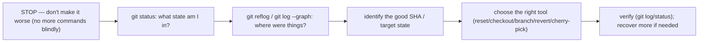
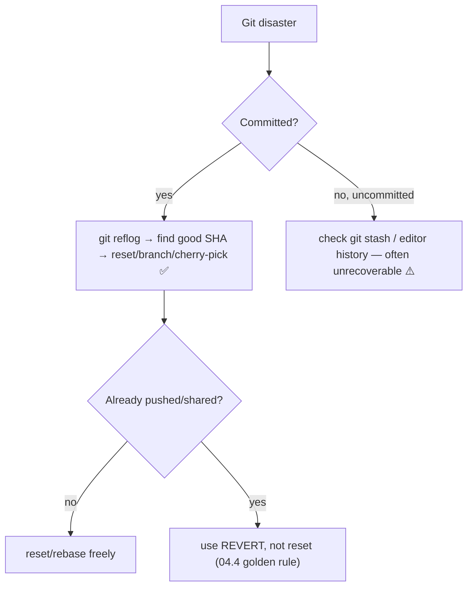
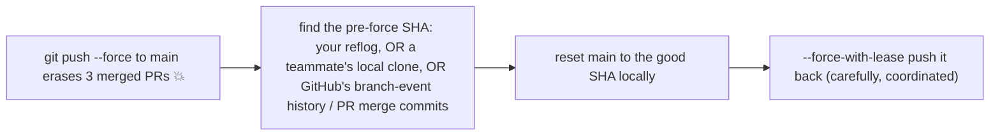

<!-- Module 04 · Lesson 12 — follows ../../../standards/. -->

# 04.12 · Debugging Git

[⬅ 04.11 GitHub Actions](04.11-github-actions.md) · [🏠 Module](../README.md) · [🗺 Roadmap](../../../ROADMAP.md) · [Next ➡](04.13-workflow-projects-summary.md)

> Everyone breaks their Git at some point — lost commits, work on the wrong branch, an accidental force-push, a bad merge. This lesson is your recovery playbook: a systematic approach and step-by-step walkthroughs so that "I ruined my repo" becomes "I'll fix it in 30 seconds." This is where you become truly fearless.

| | |
|---|---|
| **Module** | `04 · Advanced Git & Collaboration` |
| **Lesson** | `04.12` |
| **Difficulty** | ⭐⭐⭐⭐ |
| **Estimated study time** | 55 min read · 45 min practice |
| **Status** | 🟢 stable |

---

## 1. Learning Objectives

By the end of this lesson you will be able to:

- [ ] Apply a **systematic approach** to any Git problem.
- [ ] Recover **lost commits**, a **deleted branch**, and **detached-HEAD** work.
- [ ] Fix **committing to the wrong branch** and **bad merges**.
- [ ] Recover from an **accidental force-push** and **broken history**.
- [ ] Use `reflog`, `fsck`, `bisect`, and `filter-repo` for diagnosis and repair.

## 2. Prerequisites

- [04.1 Internals + reflog](04.1-git-internals.md), [04.4 reset/rebase/revert](04.4-advanced-branch-management.md) — recovery *is* those tools applied.

---

## 3. Why This Topic Exists

Git mistakes are inevitable, and they cause disproportionate panic because people don't know that **almost everything committed is recoverable** ([04.1 reflog](04.1-git-internals.md)). The engineers who stay calm and fix problems in seconds aren't lucky — they have a *recovery playbook*. This lesson gives you that playbook: the systematic mindset ([Module 02.12 debugging](../../02-Computer-Science/weeks/02.12-debugging.md)) plus the specific recovery for each common disaster.

Confidence here is transformative: once you *know* you can recover, you use Git's powerful tools (rebase, reset) without fear, work faster, and never lose sleep over a botched operation.

> [!IMPORTANT]
> **The foundational truth of Git recovery: if it was committed, it's almost certainly recoverable** ([04.1](04.1-git-internals.md)) — the reflog and object store remember, even after "destructive" commands (for ~30–90 days). Uncommitted work is the exception (not protected). So the two rules that make you unbreakable: **(1) commit frequently** (save points the reflog protects), and **(2) before any recovery, `git status` + `git reflog`** to see the current state and history. Panic is the only thing that actually loses work.

## 4. The Systematic Recovery Approach

Apply the debugging mindset from [Module 02.12](../../02-Computer-Science/weeks/02.12-debugging.md) to Git:



| Step | Command |
|---|---|
| Understand current state | `git status`, `git log --oneline --graph --all` |
| Find where things were | `git reflog` ([04.1](04.1-git-internals.md)) |
| Find unreferenced objects | `git fsck --lost-found` |
| Abort an in-progress operation | `git merge/rebase --abort` ([04.5](04.5-merge-conflicts.md)) |

> [!WARNING]
> **The #1 recovery mistake is panicking and running more commands** — trying random fixes that make it worse (a bad reset followed by a force-push...). *Stop.* Run `git status` and `git reflog` first to *understand* before acting. Almost every situation is recoverable if you diagnose calmly; almost none survive frantic guessing. This is exactly [Module 02.12's](../../02-Computer-Science/weeks/02.12-debugging.md) "reproduce and observe before hypothesizing" — applied to your repo.

---

## 5. Recovery Walkthroughs

### Lost commits (after a bad reset/rebase)

```bash
git reflog                              # find the SHA of the good state
#   d4e5f6g HEAD@{2}: commit: my work   ← there it is
git reset --hard d4e5f6g                # restore (or: git branch rescue d4e5f6g)
```

### Committed to the wrong branch

```bash
# You committed to main but meant a feature branch:
git branch feature-x                    # create the branch here (keeps your commits)
git reset --hard HEAD~1                 # move main back (removes the commit from main)
git switch feature-x                    # your work is safe on feature-x
# (or cherry-pick the commit to the right branch, then reset the wrong one)
```

### Deleted a branch

```bash
git reflog                              # or: git fsck --lost-found
git branch recovered-branch <sha>       # recreate it at its last commit
```

### Work stuck in detached HEAD ([04.2](04.2-commit-history.md))

```bash
git reflog                              # find your detached-HEAD commit's SHA
git branch saved <sha>                  # give it a branch → recovered
```

### Bad merge

```bash
git merge --abort                       # if still mid-merge (conflicts unresolved)
# if already committed the bad merge:
git reset --hard HEAD~1                 # (LOCAL only) undo the merge commit
# if already pushed/shared:
git revert -m 1 <merge-sha>             # SAFE: revert the merge (04.4)
```

### Accidentally amended/lost a commit

```bash
git reflog                              # the pre-amend commit is here
git reset --hard HEAD@{1}               # or cherry-pick the lost SHA
```



---

## 6. Accidental Force-Push — The Team Disaster

The scariest scenario: someone force-pushes to a shared branch and *erases* others' commits ([04.4](04.4-advanced-branch-management.md) golden rule).



| Recovery source | How |
|---|---|
| **Your local reflog** | `git reflog` may still show the pre-force SHA |
| **A teammate's clone** | Their local `main` still has the erased commits — get the SHA from them |
| **GitHub** | Merged-PR pages, the Activity/branch-events, or `git fsck` on a fresh clone |
| Restore | Reset `main` to the good SHA, `push --force-with-lease` |

> [!CAUTION]
> **Recovering from a force-push disaster relies on the erased commits existing *somewhere*** — your reflog, a teammate's local copy, or GitHub's records. This is why the *prevention* matters most: **protected branches** ([04.7](04.7-github-collaboration.md)) block force-pushes to `main` entirely, and **`--force-with-lease`** ([04.4](04.4-advanced-branch-management.md)) refuses if someone else has pushed. If disaster strikes, don't panic — poll teammates for a clone that still has the commits, get the SHA, and restore. The commits are usually recoverable; the lesson is to *prevent* it with branch protection.

---

## 7. `git bisect` — Finding the Commit That Broke Something

Not a "mistake" recovery, but a debugging superpower: **`git bisect`** does a binary search ([Module 02.4](../../02-Computer-Science/weeks/02.4-algorithms.md)) through history to find the exact commit that introduced a bug.

```bash
git bisect start
git bisect bad                          # current commit is broken
git bisect good v1.3                    # this old version worked
# Git checks out the midpoint; you test, then:
git bisect good   # or   git bisect bad # ... Git narrows it down (log n steps!)
git bisect reset                        # done — it names the culprit commit
```

> [!IMPORTANT]
> **`git bisect` finds a regression's cause in O(log n) commits** ([Module 02.4 binary search](../../02-Computer-Science/weeks/02.4-algorithms.md)) — for 1000 commits, ~10 tests instead of checking each. You mark a known-good and known-bad commit; Git bisects, you test each midpoint, and it pinpoints the breaking commit. It can even be *automated* (`git bisect run ./test.sh`). This is the fastest way to answer "which change broke this?" — a direct application of the CS binary search you learned in [Module 02.4](../../02-Computer-Science/weeks/02.4-algorithms.md), and why *small, atomic commits* ([04.7](04.7-github-collaboration.md)) make debugging easy (the culprit commit is small and clear).

---

## 8. Rewriting History to Remove Secrets/Big Files

Sometimes you *must* rewrite history — a committed secret ([04.1](04.1-git-internals.md)/[04.9](04.9-large-files.md)) or a giant file bloating the repo. This is a heavy, coordinated operation.

```bash
# Remove a file from ALL history (using git-filter-repo, the modern tool):
git filter-repo --path secrets.env --invert-paths
# then force-push (coordinated!) and everyone re-clones
```

> [!CAUTION]
> **Rewriting history is a last resort, not a routine fix.** It changes every affected commit's hash ([04.1](04.1-git-internals.md)), so *everyone must re-clone* and any open PRs break — a major coordination cost. For a **leaked secret**, the *first* action is always **rotate the credential immediately** (assume it's compromised the moment it was pushed, [Module 03.15](../../03-Linux/weeks/03.15-security.md)) — rewriting history removes it from the repo but not from anywhere it was already cloned/cached. Prevention ([04.10 gitleaks](04.10-automation.md), [04.9 .gitignore](04.9-large-files.md)) is vastly cheaper. Use `git filter-repo` (not the old `filter-branch`) for the rewrite itself.

---

## 9. Common Mistakes & Recovery Reference

| Disaster | Recovery |
|---|---|
| Lost commits (bad reset/rebase) | `git reflog` → `git reset --hard <sha>` |
| Committed to wrong branch | `git branch <right>`; `reset --hard HEAD~n` on the wrong one |
| Deleted branch | `git reflog`/`fsck` → `git branch <name> <sha>` |
| Detached-HEAD work | `git branch <name> <sha>` |
| Bad merge (local) | `git reset --hard HEAD~1` or `git merge --abort` |
| Bad merge (shared) | `git revert -m 1 <merge-sha>` |
| Force-push erased commits | Recover SHA (reflog/teammate/GitHub) → restore |
| Committed a secret | **Rotate it**; `git filter-repo`; force-push (coordinated) |
| Which commit broke it? | `git bisect` |
| Uncommitted work lost | Check `git stash`/editor history — often unrecoverable |

## 10. Best Practices (Prevention)

- ✅ **Commit often** — the reflog only protects committed states.
- ✅ **Protect `main`** (no force-push, require PR/CI, [04.7](04.7-github-collaboration.md)).
- ✅ Use **`--force-with-lease`**, never bare `--force` ([04.4](04.4-advanced-branch-management.md)).
- ✅ **Secret scanning** in pre-commit + CI ([04.10](04.10-automation.md)/[04.11](04.11-github-actions.md)).
- ✅ Keep a **recovery playbook** (your [04.4 mini-project](04.4-advanced-branch-management.md)).
- ❌ Don't panic and run random commands — `status`/`reflog` first.

## 11. Performance / Operational Considerations

Recovery is local and fast. The operational point: **prevention (protected branches, hooks) turns rare disasters into non-events**, and a *readable* history with small commits ([04.7](04.7-github-collaboration.md)) makes `bisect` and reverts trivial — history hygiene is debugging speed.

## 12. Security Considerations

| Risk | Guidance |
|---|---|
| Committed secret in history | Rotate immediately; rewrite history; prevent with hooks ([04.10](04.10-automation.md)) |
| Force-push destroying audit trail | Protected branches; signed commits |
| Recovering exposes old sensitive states | Reflog/objects may hold sensitive committed data |
| `filter-repo` incomplete | Secret may persist in forks/caches/CI logs — rotation is the real fix |

## 13. Interview Questions

**Beginner**
1. You did a bad `reset --hard` and lost commits. How do you recover?
2. Why is `git status` + `git reflog` your first move in any Git problem?

**Intermediate**
1. You committed to the wrong branch. Walk through the fix.
2. How do you undo a bad merge that's already been pushed?

**Advanced**
1. A teammate force-pushed to `main` and erased three PRs. Walk through recovery and prevention.
2. Explain `git bisect` and how it uses binary search.

**System-design prompt**
- Design your team's "Git safety net": prevention + recovery. — *Follow-ups:* Protected branches? Hooks/CI? A recovery playbook? How do you handle a leaked secret in history?

## 14. Summary

| Key idea | Takeaway |
|---|---|
| Committed = recoverable | Reflog/objects remember (~30–90 days) |
| Don't panic | `git status` + `git reflog` first |
| Recovery = tools applied | reset/branch/cherry-pick/revert ([04.4](04.4-advanced-branch-management.md)) |
| Shared history | Revert, don't reset ([04.4](04.4-advanced-branch-management.md)) |
| Force-push disaster | Recover the SHA from reflog/teammate/GitHub; prevent with protection |
| bisect | Binary-search history for a regression ([Module 02.4](../../02-Computer-Science/weeks/02.4-algorithms.md)) |

## 15. Cheat Sheet

```text
RULE: committed → almost always RECOVERABLE (reflog/objects, ~30-90 days) · uncommitted → NOT · commit often!
FIRST MOVE (don't panic!): git status + git reflog + git log --oneline --graph --all → understand BEFORE acting
LOST COMMITS: git reflog → git reset --hard <good-sha>  (or git branch rescue <sha>)
WRONG BRANCH: git branch <right>  → git reset --hard HEAD~n (on the wrong branch) → switch
DELETED BRANCH: git reflog / git fsck --lost-found → git branch <name> <sha>
DETACHED-HEAD WORK: git branch <name> <sha>
BAD MERGE: local → git merge --abort / git reset --hard HEAD~1 · SHARED → git revert -m 1 <merge-sha>
FORCE-PUSH ERASED: get pre-force SHA (your reflog / teammate's clone / GitHub PR pages) → reset → push --force-with-lease
  PREVENT: protected branches (no force-push, 04.7) + --force-with-lease (04.4)
FIND THE BREAKING COMMIT: git bisect start / bad / good <old> → test midpoints → culprit (O(log n), binary search 02.4)
  automate: git bisect run ./test.sh
REMOVE SECRET/BIG FILE FROM HISTORY: git filter-repo --path X --invert-paths (heavy! everyone re-clones)
  LEAKED SECRET: ROTATE the credential FIRST (compromised on push) — rewriting ≠ enough
ABORT anything mid-op: git merge --abort / git rebase --abort
```

## 16. Flashcards

- **Q:** First move when you've broken your Git? — **A:** Don't panic — run `git status` and `git reflog` to understand the current state and history *before* acting; frantic commands make it worse.
- **Q:** How do you recover lost commits after a bad reset? — **A:** `git reflog` to find the good state's SHA, then `git reset --hard <sha>` (or `git branch rescue <sha>`).
- **Q:** You committed to the wrong branch — fix? — **A:** Create the correct branch at the current commit (`git branch feature-x`), then `git reset --hard HEAD~1` on the wrong branch to remove it there.
- **Q:** Undo a bad merge that's already pushed? — **A:** `git revert -m 1 <merge-sha>` (safe for shared history) — don't reset shared history.
- **Q:** How do you recover from a force-push that erased commits? — **A:** Find the pre-force SHA (your reflog, a teammate's clone, or GitHub's records) and restore it; prevent with protected branches + `--force-with-lease`.
- **Q:** What is `git bisect`? — **A:** A binary search through history (mark good/bad, test midpoints) that pinpoints the commit that introduced a bug in O(log n) steps.

## 17. Hands-on Exercises

> Full set in [`../exercises/`](../exercises/). **All on a throwaway repo.**

- [ ] **(⭐⭐ Lost commits)** Do a bad `reset --hard HEAD~3`; recover via reflog.
- [ ] **(⭐⭐ Wrong branch)** Commit to `main` by mistake; move the commit to a feature branch and clean up `main`.
- [ ] **(⭐⭐ Deleted branch)** Delete a branch, then recover it from reflog/fsck.
- [ ] **(⭐⭐⭐ Bad merge)** Make a bad merge; undo it locally (reset) and, in another case, safely (revert).
- [ ] **(⭐⭐⭐ Bisect)** Introduce a bug at a known commit; use `git bisect` to find it; try `git bisect run` with a test script.
- [ ] **(⭐⭐⭐ Force-push sim)** Simulate a force-push disaster with two clones; recover the erased commits from the other clone.

## 18. Mini Project

> **The Git recovery playbook (this module's showcase, v6 — extends [04.4](04.4-advanced-branch-management.md)).** Produce a polished, tested "Git disaster recovery" reference: for each disaster in §9, a reproduction + the exact recovery commands, verified on a throwaway repo, plus the *prevention* for each. Include the systematic approach (§4) and a decision flowchart. Deliverable: a one-page playbook you (and your team) keep handy — the thing that turns a panicked incident into a calm 30-second fix. Genuinely valuable and reusable.

## 19. References

- *Pro Git*, Ch. 7 "Reset Demystified" & Ch. 2 "Undoing Things"; the reflog docs ([reference standards](../../../standards/reference-standards.md)).
- "Oh Shit, Git!?!" (ohshitgit.com) — a practical recovery cheat sheet.
- `git-filter-repo` docs; `git help bisect`.

## 20. What's Next

You're now fearless with Git. The final lesson ties everything into a **complete AI project workflow** (branch → PR → review → merge → tag → release), collects the module's projects, and consolidates for review.

➡️ **Next:** [04.13 · AI Project Workflow, Projects & Summary](04.13-workflow-projects-summary.md)

---

### 🔁 Revision checklist
- [ ] I diagnose with `status`/`reflog` before acting
- [ ] I can recover lost commits, deleted branches, wrong-branch work
- [ ] I undo bad merges safely (revert on shared history)
- [ ] I can use `git bisect` to find a regression

### 🔗 Spaced-repetition callback
> This lesson is [04.1's reflog](04.1-git-internals.md) + [04.4's reset/revert/rebase](04.4-advanced-branch-management.md) applied under pressure, with [Module 02.12's debugging mindset](../../02-Computer-Science/weeks/02.12-debugging.md) ("understand before acting") and [Module 02.4's binary search](../../02-Computer-Science/weeks/02.4-algorithms.md) (bisect). Every recovery is a tool you already learned — recovery is just knowing *which* tool for *which* disaster.
