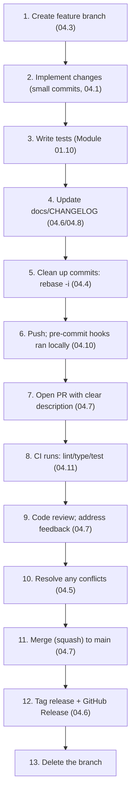
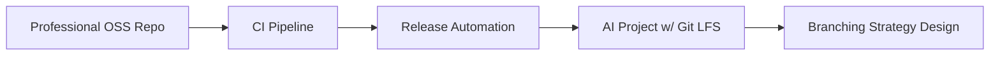
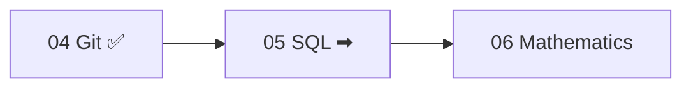

<!-- Module 04 · Lesson 13 — AI workflow + projects + module consolidation. Follows ../../../standards/. -->

# 04.13 · AI Project Workflow, Projects & Summary

[⬅ 04.12 Debugging Git](04.12-debugging-git.md) · [🏠 Module](../README.md) · [🗺 Roadmap](../../../ROADMAP.md) · [Next module ➡](../../05-SQL/README.md)

> Every skill in this module, assembled into the **complete workflow** for shipping a change to an AI project — from feature branch to tagged release. Then the module's five projects collected, and full consolidation for review.

| | |
|---|---|
| **Module** | `04 · Advanced Git & Collaboration` |
| **Lesson** | `04.13` |
| **Difficulty** | ⭐⭐⭐ |
| **Estimated study time** | 40 min read · project time varies |
| **Status** | 🟢 stable |

---

## Part A — The Complete AI Project Git Workflow

This is where the module's lessons stop being separate topics and become one professional flow — how a change actually goes from your idea to a released version on a real AI team.



### Step-by-step

**1. Create a feature branch** ([04.3](04.3-branching-strategies.md))
```bash
git switch -c feat/hybrid-retriever    # descriptive name; main stays deployable
```

**2. Implement, with small logical commits** ([04.1](04.1-git-internals.md)/[Module 00.6](../../00-Orientation/weeks/00.6-github-repository-workflow.md))
```bash
git add -p                              # stage deliberately (04.1)
git commit -m "feat(retriever): add hybrid search skeleton"
```

**3–4. Write tests and update docs/CHANGELOG** ([Module 01.10](../../01-Advanced-Python/weeks/01.10-testing.md), [04.6](04.6-tags-releases.md)/[04.8](04.8-repository-management.md))
```bash
git commit -m "test(retriever): cover hybrid ranking"
git commit -m "docs: update CHANGELOG + README for hybrid search"
```

**5. Clean up history before sharing** ([04.4](04.4-advanced-branch-management.md))
```bash
git rebase -i main                      # squash "wip"/"fix typo" into logical commits
```

**6. Push** — pre-commit hooks already ran locally ([04.10](04.10-automation.md))
```bash
git push -u origin feat/hybrid-retriever
```

**7. Open a PR** with a clear what/why/how-to-test description ([04.7](04.7-github-collaboration.md)).

**8. CI runs** automatically — lint, type-check, tests ([04.11](04.11-github-actions.md)); merge is blocked until green ([04.7](04.7-github-collaboration.md)).

**9. Code review** — teammates comment; you respond and push fixes ([04.7](04.7-github-collaboration.md)).

**10. Resolve conflicts** if `main` moved ([04.5](04.5-merge-conflicts.md))
```bash
git switch feat/hybrid-retriever && git merge main   # (or rebase); resolve; test
```

**11. Merge** (squash) once approved + green ([04.7](04.7-github-collaboration.md)) — one clean commit on `main`.

**12. Tag the release** when shipping a version ([04.6](04.6-tags-releases.md))
```bash
git switch main && git pull
git tag -a v1.5.0 -m "Release 1.5.0: hybrid retrieval"
git push origin v1.5.0                  # → GitHub Release (auto via Action, 04.11)
```

**13. Delete the merged branch** — keep the repo tidy.

> [!IMPORTANT]
> **This is the real, professional workflow — and notice every lesson appears in it.** Branching strategy ([04.3](04.3-branching-strategies.md)), clean commits ([04.1](04.1-git-internals.md)/[04.4](04.4-advanced-branch-management.md)), PRs and review ([04.7](04.7-github-collaboration.md)), conflict resolution ([04.5](04.5-merge-conflicts.md)), CI ([04.11](04.11-github-actions.md)), tagging ([04.6](04.6-tags-releases.md)) — all one fluid loop. If you can execute this comfortably, you can contribute to any professional AI team's codebase from day one. This is the module's real deliverable.

---

## Part B — Mini Projects (Collected)

Five projects, each introduced in a lesson, that build a complete professional Git toolkit. Follow the [project standards](../../../standards/project-standards.md).



| # | Project | Skills | Lessons |
|---|---|---|:--:|
| 1 | **Professional open-source repository** | structure, README, CONTRIBUTING, CODEOWNERS, templates, protected branches | [04.7](04.7-github-collaboration.md)/[04.8](04.8-repository-management.md) |
| 2 | **CI pipeline** | pre-commit hooks + GitHub Actions (test/lint/type/secret-scan) | [04.10](04.10-automation.md)/[04.11](04.11-github-actions.md) |
| 3 | **Release automation** | tags + SemVer + Action-triggered GitHub Releases | [04.6](04.6-tags-releases.md)/[04.11](04.11-github-actions.md) |
| 4 | **AI project with Git LFS** | LFS, `.gitignore`, DVC-style data handling, notebook stripping | [04.9](04.9-large-files.md) |
| 5 | **Branching strategy design** | choose + document a team branching model | [04.3](04.3-branching-strategies.md) |

Plus the **Git recovery playbook** ([04.4](04.4-advanced-branch-management.md)/[04.12](04.12-debugging-git.md)) — a reference you'll keep for your career.

> [!IMPORTANT]
> Together, projects 1–3 form a **template repository** you can clone for every future project: professionally structured, CI-gated, and release-automated. Building it once means every new AI project starts with production-quality Git hygiene ([Module 16 · MLOps](../../16-MLOps/README.md) builds on exactly this). This is a genuine, reusable, portfolio-worthy asset.

---

## Part C — Module Consolidation

### One-page summary of Module 04

| Lesson | The one thing to remember |
|---|---|
| **04.1 Internals** | Git = content-addressed objects (blob/tree/commit); branches are pointers; reflog saves you |
| **04.2 Commit History** | History is a DAG; merge commits have 2 parents; detached HEAD → branch to keep work |
| **04.3 Branching Strategies** | GitHub Flow (default); keep `main` deployable + branches short-lived |
| **04.4 Advanced Branch Mgmt** | Rebase to clean *private* history; revert for shared; reflog recovers anything committed |
| **04.5 Merge Conflicts** | Not errors — Git asking you to decide; abort freely; prevent by integrating often |
| **04.6 Tags & Releases** | Annotated tags + SemVer; version code+model+config+data together |
| **04.7 GitHub Collaboration** | Small PRs; review the code not the coder; protected branches enforce quality |
| **04.8 Repository Management** | README/CONTRIBUTING/CODEOWNERS/templates = a self-governing repo |
| **04.9 Large Files** | Git bloats on binaries; `.gitignore` + LFS/DVC; never commit secrets/data |
| **04.10 Automation** | pre-commit hooks: format/lint/type/secret-scan before commit |
| **04.11 GitHub Actions** | CI = unbypassable gate; test/lint on every PR; require it to merge |
| **04.12 Debugging Git** | Don't panic — `status`/`reflog` first; committed = recoverable |

> [!IMPORTANT]
> The through-line of Module 04: **you now understand Git deeply enough to never lose work, and you can collaborate on any professional AI team.** Two themes tie it together: *(1) the object model + reflog make Git safe* — every operation is "objects and pointers," and committed work is always recoverable; and *(2) automation + review + CI enforce quality* — humans review logic while machines enforce standards. Combined with Module 03 (Linux/CI runners) and Module 01 (packaging/testing), you have the complete engineering-workflow foundation the rest of the handbook assumes.

### Master cheat sheet

> The full one-pager lives at [`../cheat-sheets/git-cheatsheet.md`](../cheat-sheets/git-cheatsheet.md).

### Module interview questions (consolidated)

**Beginner**
1. Is a commit a diff or a snapshot? What's a branch, internally?
2. Fast-forward vs three-way merge; what is detached HEAD?
3. Why keep PRs small and `main` always deployable?

**Intermediate**
1. Rebase vs merge vs revert — when each? What are the reset modes?
2. Compare GitHub Flow, Git Flow, and trunk-based development.
3. How do local hooks + CI + protected branches form a quality gate?

**Advanced**
1. Recover from a bad reset, a deleted branch, and a force-push disaster.
2. How do you handle large models/datasets and a leaked secret in Git?
3. Design a CI/CD pipeline gating merges to `main` for an AI service.

**System-design prompt**
- Design the complete Git workflow + tooling for a 15-person AI team. — *Follow-ups:* Branching strategy? PR/review/merge policy? CI/CD gates? Large-file/secret handling? Release process? Recovery/prevention?

---

## Part D — Readiness Check & What's Next

### Module 04 mastery checklist (from memory / on a repo)

- [ ] Explain the object model (blob/tree/commit) and branches-as-pointers
- [ ] Read the commit graph; handle detached HEAD
- [ ] Choose and follow a branching strategy
- [ ] Rebase/squash private history; revert shared history
- [ ] Resolve and prevent merge conflicts
- [ ] Tag releases with SemVer; create GitHub Releases
- [ ] Write small PRs; give/receive reviews; configure protected branches
- [ ] Set up README/CONTRIBUTING/CODEOWNERS/templates
- [ ] Handle large files (`.gitignore`/LFS) and never commit secrets
- [ ] Configure pre-commit hooks and a GitHub Actions CI pipeline
- [ ] Recover from any committed-state Git disaster via reflog
- [ ] Execute the full feature-branch → PR → merge → release workflow

### Glossary additions

Module 04 terms added to [GLOSSARY.md](../../../GLOSSARY.md): blob/tree/commit object, HEAD, reflog, detached HEAD, fast-forward/three-way merge, rebase, interactive rebase, cherry-pick, reset (soft/mixed/hard), revert, merge conflict, annotated tag, GitHub Flow/Git Flow/trunk-based, pull request, code review, protected branch, squash merge, CODEOWNERS, Git LFS, `.gitignore`, Git hook/pre-commit, GitHub Actions/CI-CD, `git bisect`.

### Next module preview — 05 · SQL

You can version and collaborate on code; next you'll master **SQL** — relational data modeling and querying — the way AI applications store and retrieve structured data, built on the CS foundations from Module 02.



> [!IMPORTANT]
> Module 05 shifts from *code management* to *data management*. You'll apply the same engineering discipline (versioned schema migrations use Git!, [04.6](04.6-tags-releases.md)) to relational databases — how AI apps persist users, metadata, embeddings' references, and results. The Git + Linux + Python foundation (Modules 01–04) is now complete; the data and ML journey begins.

➡️ **Begin:** [Module 05 · SQL](../../05-SQL/README.md)

---

### 🔁 Final revision checklist
- [ ] I completed the mastery checklist from memory / on a repo
- [ ] I built the template repo (projects 1–3) with CI and release automation
- [ ] I can execute the full AI-project Git workflow comfortably
- [ ] I added Module 04 terms to my flashcards
- [ ] I'm ready for Module 05

### 🔗 Spaced-repetition callback
> The full workflow retrieves the *entire module* at once — branch ([04.3](04.3-branching-strategies.md)) → clean commits ([04.1](04.1-git-internals.md)/[04.4](04.4-advanced-branch-management.md)) → PR/review ([04.7](04.7-github-collaboration.md)) → CI ([04.11](04.11-github-actions.md)) → tag ([04.6](04.6-tags-releases.md)) — and rests on Module 01 (testing/packaging), Module 02 (graphs/binary search), and Module 03 (Linux CI runners). Executing it fluently is the ultimate active-recall test ([Module 00.9](../../00-Orientation/weeks/00.9-learning-workflow.md)).
