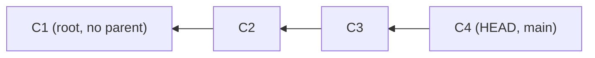
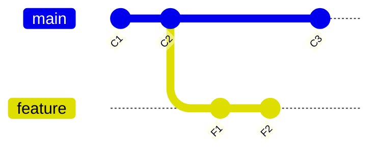
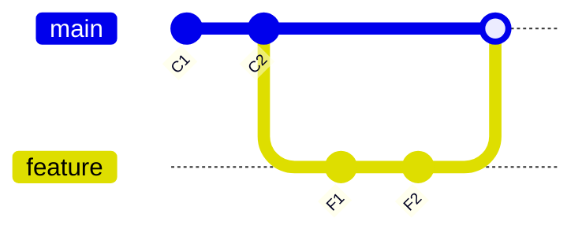
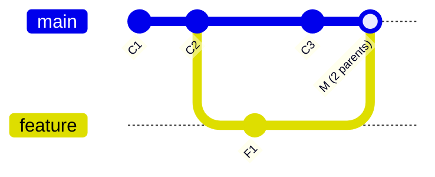
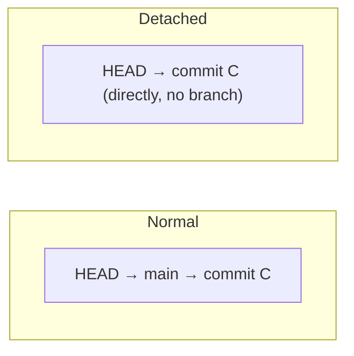

<!-- Module 04 · Lesson 2 — follows ../../../standards/. -->

# 04.2 · Commit History

[⬅ 04.1 Git Internals](04.1-git-internals.md) · [🏠 Module](../README.md) · [🗺 Roadmap](../../../ROADMAP.md) · [Next ➡](04.3-branching-strategies.md)

> Commits form a **graph**, not a line. Understanding that graph — parents, merges, fast-forwards, and detached HEAD — is what lets you read history, understand what merge and rebase *do*, and never be confused by "you are in detached HEAD state" again.

| | |
|---|---|
| **Module** | `04 · Advanced Git & Collaboration` |
| **Lesson** | `04.2` |
| **Difficulty** | ⭐⭐⭐ |
| **Estimated study time** | 50 min read |
| **Status** | 🟢 stable |

---

## 1. Learning Objectives

By the end of this lesson you will be able to:

- [ ] Read the **commit graph** and explain parent relationships.
- [ ] Distinguish **merge commits** (two parents) from regular commits.
- [ ] Explain **fast-forward** vs **three-way** merges.
- [ ] Understand **detached HEAD** — what it is and how to get out safely.
- [ ] Navigate history with `git log`, `git show`, and references like `HEAD~2`.

## 2. Prerequisites

- [04.1 Git Internals](04.1-git-internals.md) — commits, parents, refs, HEAD.
- [Module 02.3 Data Structures (graphs)](../../02-Computer-Science/weeks/02.3-data-structures.md).

---

## 3. Why This Topic Exists

Every Git operation that matters — merging, rebasing, reverting, bisecting — is a manipulation of the commit graph. If you picture history as a flat list of commits, these operations are baffling. If you picture it as a **directed graph** where each commit points to its parent(s), they become obvious: merge joins two lines, rebase replays commits onto a new base, fast-forward just slides a pointer.

Reading history fluently is also a daily skill: "what changed and when," "which commit introduced this bug," "how did these branches diverge." This lesson gives you the mental model and the navigation tools.

> [!IMPORTANT]
> **Commit history is a Directed Acyclic Graph (DAG):** each commit points *backward* to its parent(s), forming a graph that only grows forward in time (no cycles — [Module 02.3](../../02-Computer-Science/weeks/02.3-data-structures.md)). A normal commit has one parent; a merge commit has two (or more). Branches are pointers into this graph ([04.1](04.1-git-internals.md)). Once you see history as a DAG of snapshots, every advanced operation is just "rearranging or replaying nodes."

## 4. The Commit Graph

Each commit records its **parent** — the commit that came before it. Following parent links backward *is* the history.



```bash
git log --oneline --graph --all    # THE command — visualize the whole graph
git log --oneline -5               # last 5 commits, compact
git show HEAD                       # the current commit's changes
```

| Reference | Means |
|---|---|
| `HEAD` | The current commit |
| `HEAD~1`, `HEAD~2` | 1, 2 commits *back* (first-parent) |
| `HEAD^` | The first parent (`HEAD^2` = second parent of a merge) |
| `<branch>` | The commit that branch points to |
| `<sha>` | A specific commit by hash ([04.1](04.1-git-internals.md)) |

> [!TIP]
> **`git log --oneline --graph --all` is the single most useful history command** — it draws the ASCII commit graph showing all branches, merges, and divergences at once. Alias it (`git lg`, [Module 03.4](../../03-Linux/weeks/03.4-terminal-mastery.md)). `HEAD~n` (n commits back) and `HEAD^` (parent) are how you *reference* commits relative to now — essential for `reset`, `rebase`, and `diff` ([04.4](04.4-advanced-branch-management.md)).

---

## 5. Branching Creates Divergence

When you branch and commit on both branches, the graph *diverges* — two lines of history from a common ancestor.



Here `main` and `feature` share ancestor `C2`, then diverge: `main` has `C3`, `feature` has `F1`/`F2`. Merging (§6) or rebasing ([04.4](04.4-advanced-branch-management.md)) reconciles them.

> [!NOTE]
> The **common ancestor** (`C2` here) — the "merge base" — is what Git uses to figure out what each side changed during a merge ([04.5](04.5-merge-conflicts.md)). `git merge-base main feature` finds it. Divergence is normal and healthy; it's how parallel work happens ([04.3](04.3-branching-strategies.md)).

---

## 6. Merges: Fast-Forward vs Three-Way

Merging combines two lines of history. *How* it happens depends on whether the branches diverged.

### Fast-forward merge

If the target branch hasn't moved since you branched (no divergence), Git can just **slide the pointer forward** — no merge commit needed.



Before: `main` → C2, `feature` → F2. A fast-forward merge just moves `main` → F2. No new commit; history stays linear.

### Three-way (true) merge

If *both* branches have new commits (they diverged), Git creates a **merge commit** with **two parents**, joining the histories.



| | Fast-forward | Three-way merge |
|---|---|---|
| When | Target branch didn't diverge | Both branches have new commits |
| Result | Pointer slides forward | New **merge commit** (2 parents) |
| History shape | Linear | Branching + join |
| `--no-ff` | Force a merge commit even if FF possible | (default when diverged) |

> [!IMPORTANT]
> **The fast-forward vs merge-commit distinction shapes your history's readability** ([04.3](04.3-branching-strategies.md)/[04.7](04.7-github-collaboration.md)). A **merge commit** (two parents) explicitly records "these two lines came together here" — good for preserving branch context. A **fast-forward** keeps history linear — cleaner but loses the branch boundary. Teams choose: `--no-ff` always makes merge commits (preserves feature-branch structure); squash/rebase merges keep it linear ([04.7](04.7-github-collaboration.md)). Knowing *which* your team uses, and why, is a real collaboration skill.

---

## 7. Detached HEAD — The Scary-Sounding State

Normally HEAD points to a *branch* ([04.1](04.1-git-internals.md)). **Detached HEAD** means HEAD points *directly* to a commit, not a branch — you're "looking at" a commit without being on any branch.



```bash
git checkout <sha>          # → detached HEAD (viewing a specific commit)
git checkout v1.0           # → detached HEAD (tags aren't branches, 04.6)
# to get out:
git switch -                # back to your previous branch
git switch -c newbranch     # or: keep your work by making a branch here
```

> [!IMPORTANT]
> **Detached HEAD is not an error — it's a valid state, just an easy place to lose work.** You're viewing a commit directly (e.g., after `git checkout <sha>` or a tag). You can look around and even commit — *but* those commits aren't on any branch, so if you switch away they become "unreachable" and are eventually garbage-collected (though recoverable via reflog, [04.1](04.1-git-internals.md)/[04.12](04.12-debugging-git.md)). **The fix if you did useful work in detached HEAD:** create a branch to keep it (`git switch -c newbranch`) *before* switching away. If you just wanted to look, `git switch -` returns you safely. This state confuses everyone once; now it won't confuse you.

> [!WARNING]
> The classic detached-HEAD mistake: check out an old commit or tag, make commits, then `git checkout main` — and your work seems to "vanish." It's not gone (reflog!), but you must recover it. **Rule: if you commit in detached HEAD, immediately make a branch.**

---

## 8. Reading History Effectively

| Task | Command |
|---|---|
| Visualize the graph | `git log --oneline --graph --all` |
| See a commit's changes | `git show <ref>` |
| What changed between two points | `git diff A B` |
| Who last changed a line | `git blame <file>` ([Module 03.5](../../03-Linux/weeks/03.5-essential-commands.md)) |
| Search commit messages | `git log --grep="fix"` |
| Search code changes ("pickaxe") | `git log -S "function_name"` |
| History of one file | `git log --oneline -- path/to/file` |
| Find a bug's introducing commit | `git bisect` ([04.12](04.12-debugging-git.md)) |

> [!TIP]
> Two underused power tools: **`git log -S "text"`** (the "pickaxe") finds commits that *added or removed* a specific string — perfect for "when did this function/config appear or vanish?" And **`git blame file`** shows who last touched each line and in which commit — then `git show <that-commit>` reveals *why* (the commit message). This blame→show chain is how you understand unfamiliar code's history ([Module 03.5 reading code](../../03-Linux/weeks/03.5-essential-commands.md), [Module 01.14](../../01-Advanced-Python/weeks/01.14-reading-open-source.md)).

---

## 9. Common Mistakes & Recovery

| Mistake | Consequence | Recovery |
|---|---|---|
| Committing in detached HEAD, then switching | Commits seem lost | `git reflog` → make a branch at the SHA |
| Confusing `HEAD~2` and `HEAD^2` | Wrong commit referenced | `~` = n back; `^` = nth parent |
| Expecting linear history after a diverged merge | Merge commit appears | Understand FF vs three-way |
| Misreading a tangled graph | Wrong assumptions | `git log --graph --all` to see clearly |
| `git checkout <sha>` then editing, surprised | Detached HEAD | `git switch -c branch` to keep work |

## 10. Best Practices

- ✅ Use `git log --oneline --graph --all` (aliased) to *see* history before acting.
- ✅ When you land in detached HEAD intentionally, branch immediately if you'll commit.
- ✅ Keep history *readable* — the team's merge strategy ([04.3](04.3-branching-strategies.md)/[04.7](04.7-github-collaboration.md)) should be deliberate.
- ✅ Write good commit messages ([Module 00.6](../../00-Orientation/weeks/00.6-github-repository-workflow.md)) — history is documentation.
- ❌ Don't panic at "detached HEAD" — it's a state, not an error.

## 11. Performance Considerations

Reading history is fast (it's local graph traversal). The relevant note: a *readable* history (thoughtful merges, good messages) makes debugging and `git bisect` ([04.12](04.12-debugging-git.md)) dramatically faster — history quality is a productivity multiplier, not a runtime concern.

## 12. Security Considerations

| Note | Guidance |
|---|---|
| History reveals everything | Every commit's content is inspectable — never commit secrets ([04.1](04.1-git-internals.md)/[04.9](04.9-large-files.md)) |
| `blame`/`log` expose authorship | Useful for accountability; also PII-aware |
| Merge commits can hide changes | Review the *full* diff of a merge, not just the merge commit message |

## 13. Interview Questions

**Beginner**
1. What does it mean that commit history is a graph? What's a commit's parent?
2. What is a merge commit, and how many parents does it have?

**Intermediate**
1. Fast-forward vs three-way merge — when does each happen?
2. What is detached HEAD, and how do you safely get out of it?

**Advanced**
1. How would you find which commit introduced a specific line of code (or removed it)?
2. Explain `HEAD~2` vs `HEAD^2` and when you'd use each.

**System-design prompt**
- Your team wants a *readable* history on `main`. Discuss how merge strategy (FF vs merge-commit vs squash) shapes the graph and what you'd choose. — *Follow-ups:* Tradeoffs? How does it affect `git bisect` and reverts?

## 14. Summary

| Key idea | Takeaway |
|---|---|
| History is a DAG | Commits point backward to parent(s) |
| Merge commit | Two parents; joins diverged lines |
| Fast-forward | Pointer slides; linear history |
| Three-way merge | New merge commit when both diverged |
| Detached HEAD | HEAD on a commit, not a branch — branch to keep work |
| Navigation | `log --graph`, `HEAD~n`/`^`, `blame`, `log -S` |

## 15. Cheat Sheet

```text
HISTORY = DAG: each commit → parent(s) · normal=1 parent · MERGE=2 parents · grows forward (acyclic)
VISUALIZE: git log --oneline --graph --all  (★ alias it: git lg)
REFS: HEAD(now) · HEAD~n(n back) · HEAD^(1st parent, ^2=2nd parent of merge) · branch · <sha>
MERGE TYPES:
  FAST-FORWARD (target didn't diverge): pointer slides forward, linear, no merge commit
  THREE-WAY (both diverged): new MERGE COMMIT (2 parents); --no-ff forces one always
  merge base = common ancestor: git merge-base A B
DETACHED HEAD (HEAD → commit directly, not a branch): after checkout <sha>/<tag>
  ★ commit here → make a branch (git switch -c x) BEFORE leaving, or reflog to recover
  just looking? git switch - (back to previous branch)
NAVIGATE: git show <ref> · git diff A B · git blame file · git log --grep="x" · git log -S "text"(pickaxe) · git log -- file
```

## 16. Flashcards

- **Q:** How many parents does a merge commit have? — **A:** Two (or more) — it joins two diverged lines of history; a normal commit has one parent.
- **Q:** Fast-forward vs three-way merge? — **A:** Fast-forward slides the branch pointer forward (target didn't diverge, linear history); three-way creates a merge commit when both branches have new commits.
- **Q:** What is detached HEAD? — **A:** HEAD pointing directly at a commit instead of a branch (e.g., after checking out a SHA/tag); commits made there aren't on a branch and can be lost if you switch away without branching.
- **Q:** `HEAD~2` vs `HEAD^2`? — **A:** `HEAD~2` = two commits back (first-parent); `HEAD^2` = the second parent of a merge commit.
- **Q:** Most useful command to see history? — **A:** `git log --oneline --graph --all` — draws the ASCII commit graph with all branches and merges.
- **Q:** How do you find when a string was added/removed? — **A:** `git log -S "text"` (the pickaxe) finds commits that changed the count of that string.

## 17. Hands-on Exercises

> Full set in [`../exercises/`](../exercises/).

- [ ] **(⭐ Read)** In any repo, run `git log --oneline --graph --all`; identify a merge commit and trace its two parents.
- [ ] **(⭐⭐ Diverge)** Create two branches, commit on both, and visualize the divergence in the graph.
- [ ] **(⭐⭐ Merge types)** Trigger a fast-forward merge, then a three-way merge (`--no-ff`); compare the resulting graphs.
- [ ] **(⭐⭐⭐ Detached HEAD)** `git checkout` an old commit, make a commit, switch to main (watch it "vanish"), then recover it via reflog + branch.
- [ ] **(⭐⭐ Navigate)** Use `git blame` on a file, then `git show` the commit it points to; use `git log -S` to find when a function appeared.

## 18. Mini Project

> **History visualizer & explainer.** On a real repo (e.g., a small open-source project), produce a report that: renders the commit graph (`git log --graph`), identifies merge commits and their parents, traces one feature's development across branches, and demonstrates detached-HEAD recovery. Include a Mermaid `gitGraph` reproducing part of the history. This builds fluency in *reading* history — a skill you'll use to understand any codebase ([Module 01.14](../../01-Advanced-Python/weeks/01.14-reading-open-source.md)).

## 19. References

- *Pro Git*, Ch. 3 "Git Branching" — the graph model ([reference standards](../../../standards/reference-standards.md)).
- *Learn Git Branching* (learngitbranching.js.org) — interactive graph visualization, excellent for this lesson.
- `git help revisions` (the `HEAD~`/`^` syntax).

## 20. What's Next

You can read the graph. Now learn how teams *organize* branching — **branching strategies** (Git Flow, GitHub Flow, trunk-based) — to collaborate without chaos.

➡️ **Next:** [04.3 · Branching Strategies](04.3-branching-strategies.md)

---

### 🔁 Revision checklist
- [ ] I can read `git log --graph` and identify merges/parents
- [ ] I understand fast-forward vs three-way merges
- [ ] I can safely enter and exit detached HEAD
- [ ] I navigate with `HEAD~n`/`^`, `blame`, `log -S`

### 🔗 Spaced-repetition callback
> Recall [04.1's "commit = snapshot + parent pointer"](04.1-git-internals.md): the commit graph is just those parent pointers followed backward, and a merge is a commit with two of them. And [Module 02.3's DAG/topological order](../../02-Computer-Science/weeks/02.3-data-structures.md) is exactly what Git traverses — the CS graph, made into your version history.
