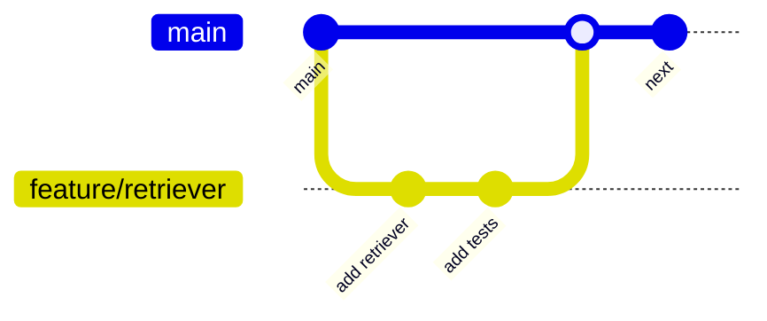
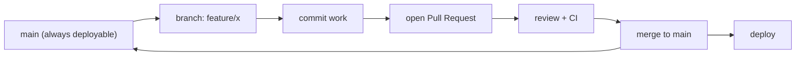
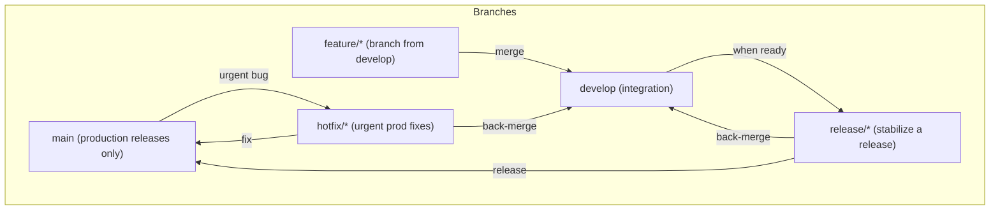
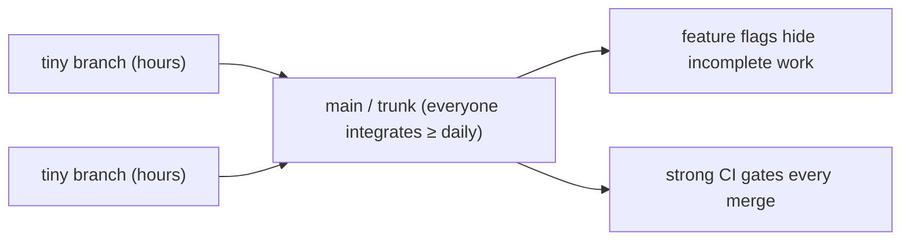
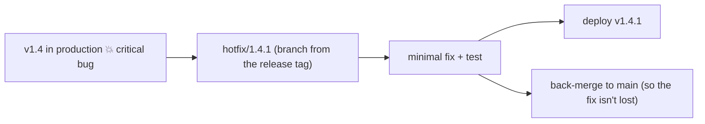
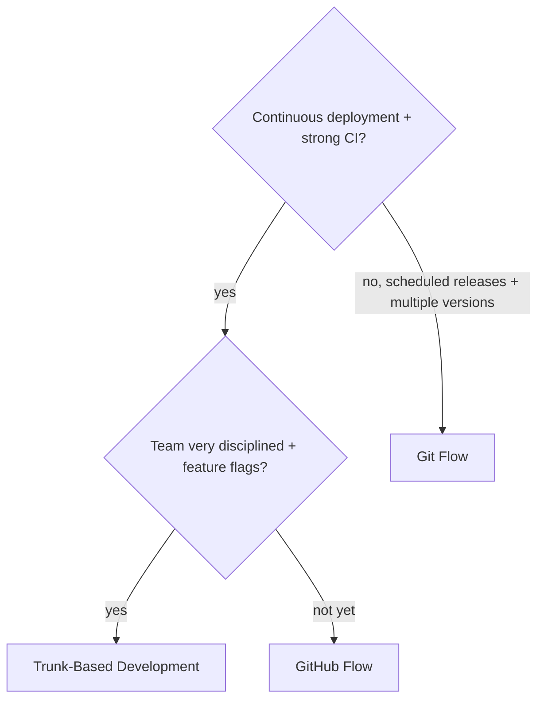

<!-- Module 04 · Lesson 3 — follows ../../../standards/. -->

# 04.3 · Branching Strategies

[⬅ 04.2 Commit History](04.2-commit-history.md) · [🏠 Module](../README.md) · [🗺 Roadmap](../../../ROADMAP.md) · [Next ➡](04.4-advanced-branch-management.md)

> How does a team of engineers work on one codebase without chaos? With a **branching strategy** — an agreed convention for how branches are created, named, and merged. This lesson compares the major strategies (Git Flow, GitHub Flow, trunk-based) so you can pick and follow the right one for your team.

| | |
|---|---|
| **Module** | `04 · Advanced Git & Collaboration` |
| **Lesson** | `04.3` |
| **Difficulty** | ⭐⭐ |
| **Estimated study time** | 50 min read |
| **Status** | 🟢 stable |

---

## 1. Learning Objectives

By the end of this lesson you will be able to:

- [ ] Explain **feature branching** and why teams branch at all.
- [ ] Compare **Git Flow, GitHub Flow,** and **trunk-based development**.
- [ ] Explain **release branches** and **hotfix branches**.
- [ ] Choose an appropriate strategy for a given team/project.

## 2. Prerequisites

- [04.2 Commit History](04.2-commit-history.md) (branches, merges) and [Module 00.6](../../00-Orientation/weeks/00.6-github-repository-workflow.md) (basic branch workflow).

---

## 3. Why This Topic Exists

When one person works on a repo, branching is optional. When ten people do, *unstructured* branching is chaos — conflicting changes, broken `main`, unclear what's ready to ship. A **branching strategy** is the team's shared agreement that turns parallel work into orderly collaboration: everyone knows where to branch from, what `main` means, and how work reaches production.

Different strategies suit different teams and release cadences. Knowing them lets you fit into any team's workflow immediately and argue for the right one. This is a *collaboration* skill as much as a Git skill.

> [!IMPORTANT]
> There's no universally "best" branching strategy — it's a **tradeoff between structure and speed** matched to your team size, release cadence, and risk tolerance ([Module 02.11 tradeoffs](../../02-Computer-Science/weeks/02.11-system-design-basics.md)). Heavy processes (Git Flow) give control but slow you down; light ones (trunk-based) move fast but demand strong testing/CI ([04.11](04.11-github-actions.md)). The skill is picking the right point on that spectrum — and *following the team's convention consistently*.

## 4. The Common Foundation: Feature Branching

Nearly every strategy rests on **feature branching**: don't commit directly to `main`; create a short-lived branch for each unit of work, then merge it back via a pull request ([04.7](04.7-github-collaboration.md)).



| Principle | Why |
|---|---|
| `main` is always deployable | Broken code lives on branches, not `main` |
| One branch per feature/fix | Isolated, reviewable units of work ([04.7](04.7-github-collaboration.md)) |
| Short-lived branches | Less divergence → fewer conflicts ([04.5](04.5-merge-conflicts.md)) |
| Merge via PR + review | Quality gate before code hits `main` ([04.7](04.7-github-collaboration.md)) |
| Descriptive names | `feat/add-rag`, `fix/oom-crash` ([Module 00.6](../../00-Orientation/weeks/00.6-github-repository-workflow.md)) |

> [!IMPORTANT]
> **`main` should always be deployable** — this is the invariant every strategy protects. Risky, in-progress, or unreviewed work stays on branches; only reviewed, tested code merges to `main`. This is what makes it safe for ten people to share one repo: nobody's half-finished work breaks everyone else. Enforce it with **protected branches** ([04.7](04.7-github-collaboration.md)) and CI ([04.11](04.11-github-actions.md)).

---

## 5. GitHub Flow — Simple and Common

**GitHub Flow** is the simplest practical strategy: `main` is always deployable; you branch, work, open a PR, review, and merge back. That's it.



| ✅ Strengths | ❌ Weaknesses |
|---|---|
| Simple, easy to learn | Less structure for complex releases |
| Fast — continuous delivery friendly | Assumes strong CI + frequent deploys |
| Great for web apps, small–mid teams | No formal release/hotfix separation |

> [!TIP]
> **GitHub Flow is the right default for most teams and nearly all AI/startup projects** — it's simple, encourages small PRs and frequent merges, and pairs perfectly with CI/CD ([04.11](04.11-github-actions.md)). If you're unsure which strategy to use, use this. It's also what this handbook's own workflow follows ([Module 00.6](../../00-Orientation/weeks/00.6-github-repository-workflow.md)).

---

## 6. Git Flow — Structured Releases

**Git Flow** is a heavier, more structured model with multiple long-lived branches, designed for projects with **scheduled releases** and multiple versions in support.



| Branch | Purpose |
|---|---|
| `main` | Production — only tagged releases ([04.6](04.6-tags-releases.md)) |
| `develop` | Integration branch for the next release |
| `feature/*` | New features (branch from/to `develop`) |
| `release/*` | Stabilize a release (bugfixes only) before merging to `main` |
| `hotfix/*` | Urgent production fixes (branch from `main`, merge to both) |

| ✅ Strengths | ❌ Weaknesses |
|---|---|
| Clear structure for releases | Complex; lots of branches to manage |
| Supports multiple versions | Slow; merge overhead; long-lived branches diverge |
| Explicit release/hotfix flow | Overkill for continuous-delivery web apps |

> [!NOTE]
> **Git Flow is now considered overkill for most modern projects** (even its author has noted it fits scheduled-release software, not continuous delivery). It shines for **versioned, released software** — desktop apps, libraries, on-prem products where multiple versions are supported simultaneously. For AI services deployed continuously, its long-lived branches cause painful divergence and conflicts. Know it (you'll encounter it), but don't reach for it by default.

---

## 7. Trunk-Based Development — Fast and Modern

**Trunk-based development** minimizes branching: everyone commits to `main` ("the trunk") frequently — via *very* short-lived branches (hours, not days) or even directly — relying on strong CI and feature flags to keep `main` releasable.



| ✅ Strengths | ❌ Weaknesses |
|---|---|
| Minimal divergence → few conflicts | Requires excellent CI + test discipline |
| Fast integration; true CI/CD | Needs feature flags for incomplete work |
| Used by many high-performing orgs | Less isolation; discipline-dependent |

> [!IMPORTANT]
> **Trunk-based development is what most elite engineering orgs (Google, etc.) use** and what research (DORA) associates with high performance. The core idea: **integrate constantly** so branches never diverge far ([04.5](04.5-merge-conflicts.md) — long-lived branches cause the worst conflicts). Incomplete features hide behind **feature flags** (runtime toggles) rather than living on a branch. It demands strong automated testing ([04.10](04.10-automation.md)/[04.11](04.11-github-actions.md)) — but delivers the fastest, safest flow. It's essentially GitHub Flow taken to its logical extreme (even shorter branches).

---

## 8. Release and Hotfix Branches

Two branch *types* appear across strategies (formally in Git Flow, informally elsewhere):

| Branch type | Purpose | When |
|---|---|---|
| **Release branch** (`release/1.4`) | Stabilize a version (only bugfixes) while `main`/`develop` keeps moving | Preparing a scheduled release |
| **Hotfix branch** (`hotfix/1.4.1`) | Urgent fix to a production version, fast-tracked to prod | A critical bug in production |



> [!IMPORTANT]
> **The hotfix pattern is universal, even in simple strategies:** when production is broken, you branch from the *released* commit (a tag, [04.6](04.6-tags-releases.md)), make the *minimal* fix, deploy it, then **merge it back into `main`** so the fix isn't lost in the next release (a classic mistake: hotfix prod, forget to back-merge, reintroduce the bug next deploy). For AI systems, a "hotfix" might be reverting a bad model version or fixing a prompt that broke — same discipline: minimal, fast, back-merged.

---

## 9. Choosing a Strategy



| Team / project | Recommended |
|---|---|
| Startup / AI service / web app | **GitHub Flow** (default) |
| Elite CI/CD, high velocity | **Trunk-based** |
| Versioned/released software, multiple supported versions | **Git Flow** |
| Solo / learning | Feature branches + GitHub Flow |

> [!TIP]
> For **AI Engineering specifically**, GitHub Flow (or trunk-based as you mature) fits best: AI services deploy continuously, experiments are short-lived branches, and you want fast iteration with CI gating quality ([04.11](04.11-github-actions.md)). Reserve Git Flow's structure for shipping *versioned* model releases or SDKs. Whatever the team uses, **the most important thing is consistency** — follow the convention, don't invent your own.

---

## 10. Common Mistakes & Best Practices

| Mistake | Better |
|---|---|
| Committing directly to `main` | Feature branch + PR |
| Long-lived branches (weeks) | Short-lived; integrate often ([04.5](04.5-merge-conflicts.md)) |
| Inconsistent branch naming | Convention: `feat/`, `fix/`, `hotfix/` |
| Over-engineering (Git Flow for a small app) | Match strategy to team size/cadence |
| Forgetting to back-merge a hotfix | Reintroduced bug — always back-merge |
| Fighting the team's convention | Follow it; propose changes via discussion |

- ✅ **Keep branches short-lived** — the #1 way to avoid merge pain ([04.5](04.5-merge-conflicts.md)).
- ✅ **Protect `main`** with reviews + CI ([04.7](04.7-github-collaboration.md)/[04.11](04.11-github-actions.md)).
- ✅ **Consistent naming** so branches are self-documenting.

## 11. Performance / Operational Considerations

| Principle | Takeaway |
|---|---|
| Short branches | Fewer/smaller conflicts; faster reviews |
| Frequent integration | Trunk-based/GitHub Flow reduce merge debt |
| CI on every branch | Catches breakage before merge ([04.11](04.11-github-actions.md)) |
| Simpler strategy | Less process overhead; faster delivery |

## 12. Security Considerations

| Risk | Guidance |
|---|---|
| Unreviewed code on `main` | Require PR review + protected branches ([04.7](04.7-github-collaboration.md)) |
| Hotfix bypassing review under pressure | Even hotfixes need a (fast) review + CI |
| Long-lived branches accumulating vulns | Short branches get scanned/updated sooner |
| Secrets in a feature branch | History persists after merge — scan all branches ([04.1](04.1-git-internals.md)) |

## 13. Interview Questions

**Beginner**
1. Why do teams use feature branches instead of committing to `main`?
2. What does "`main` is always deployable" mean?

**Intermediate**
1. Compare GitHub Flow, Git Flow, and trunk-based development.
2. What are release and hotfix branches for?

**Advanced**
1. When would you choose trunk-based over GitHub Flow, and what does it require?
2. Why are long-lived branches problematic, and how do strategies mitigate it?

**System-design prompt**
- Choose and justify a branching strategy for a 15-person team building an AI product deployed continuously. — *Follow-ups:* How do you protect `main`? How do you handle a production hotfix? How do short branches + CI work together?

## 14. Summary

| Key idea | Takeaway |
|---|---|
| Strategy = shared convention | Turns parallel work into order |
| Feature branching | The common foundation; `main` always deployable |
| GitHub Flow | Simple default; branch → PR → merge → deploy |
| Git Flow | Structured, for versioned/released software (often overkill) |
| Trunk-based | Fast, elite; needs strong CI + feature flags |
| Hotfix | Branch from prod, minimal fix, back-merge |

## 15. Cheat Sheet

```text
FOUNDATION: FEATURE BRANCHING — never commit to main directly; branch → work → PR → review → merge
  INVARIANT: main is ALWAYS DEPLOYABLE (risky work stays on branches) · short-lived branches (hours-days)
GITHUB FLOW (default!): main deployable → branch → PR + CI → merge → deploy · simple, fast, most teams/AI
GIT FLOW (structured, often overkill): main(releases) + develop(integration) + feature/* + release/* + hotfix/*
  → for VERSIONED/released software with multiple supported versions
TRUNK-BASED (elite/fast): everyone integrates into main ≥ daily via tiny branches + feature flags + strong CI
  → fastest, fewest conflicts, needs test discipline
RELEASE branch: stabilize a version (bugfixes only) · HOTFIX branch: urgent prod fix from a tag → deploy → BACK-MERGE to main
CHOOSE: startup/AI/web → GitHub Flow · high-velocity+CI → trunk · versioned software → Git Flow
KEY: short branches (avoid conflicts) · protect main · consistent naming (feat/ fix/ hotfix/) · FOLLOW the team's convention
```

## 16. Flashcards

- **Q:** What invariant do all branching strategies protect? — **A:** `main` (the trunk) is always deployable — risky/unreviewed work stays on branches.
- **Q:** What is GitHub Flow? — **A:** The simple default: `main` is always deployable; branch → work → PR + review/CI → merge → deploy. Best for most teams and AI projects.
- **Q:** When is Git Flow appropriate, and what's its downside? — **A:** For versioned/released software with multiple supported versions; downside is complexity and long-lived branches that diverge — overkill for continuous delivery.
- **Q:** What does trunk-based development require? — **A:** Strong CI/testing and feature flags — everyone integrates into `main` frequently via very short-lived branches, hiding incomplete work behind flags.
- **Q:** What's the hotfix pattern (and the classic mistake)? — **A:** Branch from the released commit, make the minimal fix, deploy — then **back-merge into `main`** (forgetting to back-merge reintroduces the bug next release).
- **Q:** Why keep branches short-lived? — **A:** Less divergence from `main` means fewer and smaller merge conflicts and faster reviews.

## 17. Hands-on Exercises

> Full set in [`../exercises/`](../exercises/).

- [ ] **(⭐ Conceptual)** For three scenarios (startup web app, versioned SDK, elite CI/CD team), choose a strategy and justify.
- [ ] **(⭐⭐ Practice)** Simulate GitHub Flow: branch, commit, "PR" (merge), on a practice repo; keep `main` deployable throughout.
- [ ] **(⭐⭐ Naming)** Design a branch-naming convention for a team; apply it to 5 example tasks.
- [ ] **(⭐⭐⭐ Hotfix)** Simulate a hotfix: tag a release, branch from the tag, fix, "deploy", and back-merge to main; show the graph.

## 18. Mini Project

> **Design a branching strategy for a team (this module's showcase, v1).** Write a `CONTRIBUTING`-style document ([04.8](04.8-repository-management.md)) defining your team's branching strategy: which model, branch naming, how `main` is protected ([04.7](04.7-github-collaboration.md)), how features/releases/hotfixes flow, and the CI gates ([04.11](04.11-github-actions.md)). Include a Mermaid diagram of the flow. This is a real artifact teams maintain — clarity here prevents endless workflow confusion.

## 19. References

- "A successful Git branching model" (Vincent Driessen — the original Git Flow) + his 2020 note on when it fits ([reference standards](../../../standards/reference-standards.md)).
- GitHub Flow guide; "Trunk Based Development" (trunkbaseddevelopment.com); DORA/*Accelerate* research.
- Atlassian's Git workflow comparison.

## 20. What's Next

You know how to *organize* branches. Now master the powerful tools to *manipulate* them — **rebase, cherry-pick, reset, revert, and reflog recovery** — the operations that make you fearless with Git history.

➡️ **Next:** [04.4 · Advanced Branch Management](04.4-advanced-branch-management.md)

---

### 🔁 Revision checklist
- [ ] I can compare GitHub Flow, Git Flow, and trunk-based
- [ ] I know why `main` must stay deployable and branches short-lived
- [ ] I understand release and hotfix branches (and back-merging)
- [ ] I can choose a strategy for a given team

### 🔗 Spaced-repetition callback
> Recall [04.2's divergence and merges](04.2-commit-history.md): branching strategy is *policy* for how much divergence you allow before merging. Short-lived branches (trunk-based) minimize the diverged graph; long-lived branches (Git Flow) maximize it — which is why the latter causes more conflicts ([04.5](04.5-merge-conflicts.md)). Strategy is graph management as a team agreement.
