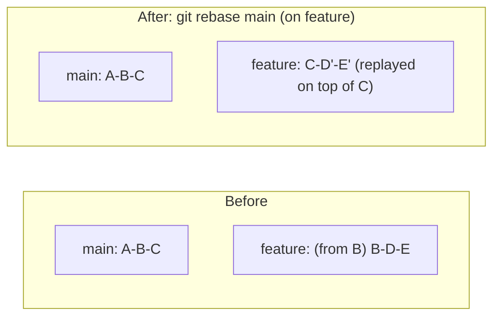
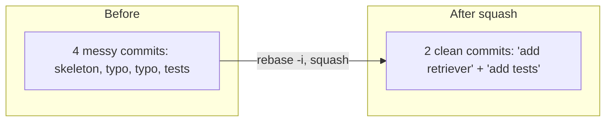
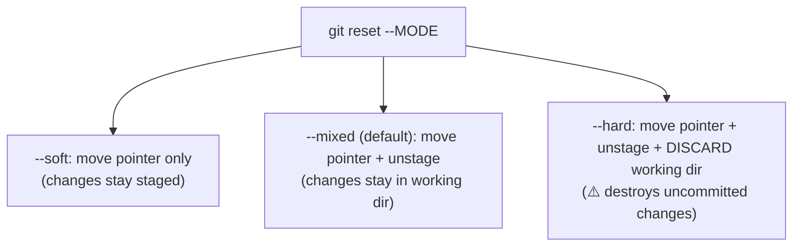
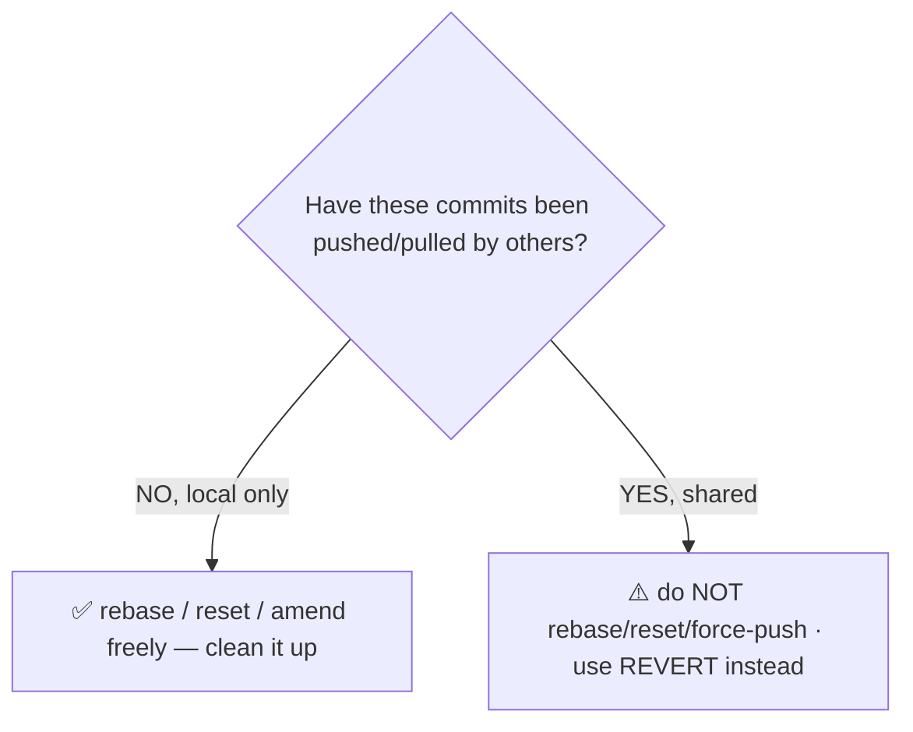

<!-- Module 04 · Lesson 4 — follows ../../../standards/. -->

# 04.4 · Advanced Branch Management

[⬅ 04.3 Branching Strategies](04.3-branching-strategies.md) · [🏠 Module](../README.md) · [🗺 Roadmap](../../../ROADMAP.md) · [Next ➡](04.5-merge-conflicts.md)

> The power tools: **rebase** to rewrite history cleanly, **interactive rebase** to reshape commits, **cherry-pick** to grab a single commit, **reset** to move branch pointers, **revert** to safely undo, and **reflog** to recover from any of the above. This is the lesson that makes you *fearless* with Git.

| | |
|---|---|
| **Module** | `04 · Advanced Git & Collaboration` |
| **Lesson** | `04.4` |
| **Difficulty** | ⭐⭐⭐⭐ |
| **Estimated study time** | 70 min read · 50 min practice |
| **Status** | 🟢 stable |

---

## 1. Learning Objectives

By the end of this lesson you will be able to:

- [ ] Explain **rebase** vs merge and when to use each.
- [ ] Use **interactive rebase** to squash, reorder, edit, and drop commits.
- [ ] **Cherry-pick** a specific commit onto another branch.
- [ ] Use **reset** (soft/mixed/hard) and **revert** correctly, knowing the difference.
- [ ] **Recover** from mistakes with the reflog.

## 2. Prerequisites

- [04.1 Internals](04.1-git-internals.md) (objects/pointers/reflog) and [04.2 Commit History](04.2-commit-history.md) (the graph).

---

## 3. Why This Topic Exists

Basic Git (`add`/`commit`/`merge`) gets you working; *these* tools make you a *professional*. They let you present clean, reviewable history (rebase, squash), fix mistakes surgically (revert, reset), grab a fix from another branch (cherry-pick), and — crucially — **recover from disasters** (reflog). Engineers who fear these tools work slowly and sloppily; engineers who master them move fast and keep history pristine.

Every one of these operations is just "create objects, move pointers" ([04.1](04.1-git-internals.md)) — so they're not scary once you see them that way, and every "mistake" is recoverable.

> [!IMPORTANT]
> The mindset shift this lesson delivers: **Git history is malleable *before you share it*, and every operation is recoverable via the reflog.** You can reshape your local commits into a clean story before pushing, and if you botch it, `git reflog` gets you back. The *one* rule that keeps this safe: **never rewrite history that others have pulled** (§9). Master that boundary and you can use every tool here with confidence.

## 4. Rebase — Replaying Commits

**Rebase** moves your commits to a new base — it *replays* them, one by one, on top of another commit. It produces a **linear history** (no merge commit), as if you'd started your work from the newer base.



```bash
git switch feature
git rebase main            # replay feature's commits on top of main's tip
# now feature's history is linear on top of the latest main
```

| | Merge | Rebase |
|---|---|---|
| History | Preserves branches (merge commit) | Linear (rewritten) |
| Commits | Original, unchanged | **New commits** (new hashes!) |
| Merge commit | Yes | No |
| When | Integrating shared branches | Cleaning up *your* local branch before sharing |

> [!IMPORTANT]
> **Rebase creates *new* commits with new hashes** ([04.1](04.1-git-internals.md)) — it doesn't move the originals, it copies them onto a new base (the old ones linger in the reflog). This is why rebase gives clean, linear history but is *dangerous on shared branches*: if others have the original commits, rebasing rewrites them into different commits, causing chaos (§9). Use rebase to tidy *your own unpushed* work (`git rebase main` to update your feature branch, or `git pull --rebase` to avoid merge commits when pulling); use merge to integrate *shared* branches.

---

## 5. Interactive Rebase — Reshaping History

**Interactive rebase** (`git rebase -i`) is the power tool for curating commits *before* you share them: squash several commits into one, reorder them, edit messages, or drop them entirely.

```bash
git rebase -i HEAD~4        # edit the last 4 commits interactively
```

This opens an editor with a "todo" list:

```text
pick   a1b2c3d add retriever skeleton
squash d4e5f6g fix typo               ← fold into previous
squash 7h8i9j0 fix another typo       ← fold into previous
reword b2c3d4e add tests              ← change the message
# Commands: pick / reword / edit / squash / fixup / drop / (reorder lines)
```

| Command | Effect |
|---|---|
| `pick` | Keep the commit as-is |
| `reword` | Keep it, edit the message |
| `edit` | Pause to amend the commit's *content* |
| `squash` | Merge into the previous commit (combine messages) |
| `fixup` | Like squash, but discard this commit's message |
| `drop` | Delete the commit entirely |
| (reorder) | Change the order of commits |



> [!IMPORTANT]
> **Interactive rebase is how professionals present clean, reviewable history.** Your local work is messy — "wip", "fix typo", "actually fix it" — and that's fine *while working*. Before opening a PR ([04.7](04.7-github-collaboration.md)), `git rebase -i` to **squash** those into a few logical, well-described commits ([Module 00.6](../../00-Orientation/weeks/00.6-github-repository-workflow.md)). Reviewers see a clean story, not your fumbling. `fixup` is perfect for folding "fix typo" commits into the commit they fix. (Many teams instead use "squash merge" on the PR, [04.7](04.7-github-collaboration.md), which achieves the same result at merge time — either way, the reviewed history is clean.)

---

## 6. Cherry-pick — Grabbing One Commit

**Cherry-pick** copies a *single* commit from one branch onto your current branch — useful when you need one specific fix without merging a whole branch.


```bash
git switch main
git cherry-pick d4e5f6g    # apply commit d4e5f6g here (as a new commit)
```

> [!TIP]
> Cherry-pick is the tool for the **hotfix back-port** ([04.3](04.3-branching-strategies.md)): a critical fix was made on one branch, and you need *just that commit* on `main` or a release branch — without dragging along unrelated work. Like rebase, it creates a *new* commit (new hash) with the same changes. Use it sparingly and deliberately; overusing cherry-pick (instead of proper merging) fragments history and can cause duplicate-change conflicts later.

---

## 7. Reset — Moving the Branch Pointer

**Reset** moves the current branch pointer to a different commit ([04.1](04.1-git-internals.md): a branch is just a pointer). Its three modes differ in what they do to the **staging area** and **working directory**.



| Mode | Branch pointer | Staging area | Working directory | Use for |
|---|:--:|:--:|:--:|---|
| `--soft` | Moves | Kept | Kept | Undo commits but keep changes staged (re-commit differently) |
| `--mixed` (default) | Moves | Reset | Kept | Undo commits + unstage (keep the edits) |
| `--hard` | Moves | Reset | **Discarded** | Throw away commits *and* uncommitted changes ⚠️ |

```bash
git reset --soft HEAD~1     # undo last commit, keep changes staged
git reset HEAD~1            # (mixed) undo last commit, keep changes unstaged
git reset --hard HEAD~1     # undo last commit AND discard the changes ⚠️
git reset --hard origin/main   # make local branch exactly match remote ⚠️
```

> [!WARNING]
> **`git reset --hard` is the most dangerous everyday Git command** — it discards uncommitted working-directory changes *permanently* (they're not in the reflog, [04.1](04.1-git-internals.md)!). Committed work it "removes" is recoverable via reflog, but **uncommitted edits are gone**. Before *any* `reset --hard`, ensure your work is committed or stashed (`git stash`). Use `--soft`/`--mixed` when you want to keep your changes (the common case — "undo the commit but keep my code"). Reserve `--hard` for deliberately throwing work away.

---

## 8. Revert — Safe Undo for Shared History

**Revert** undoes a commit by creating a *new* commit that applies the inverse changes. Unlike reset, it **doesn't rewrite history** — making it the *safe* way to undo something already pushed/shared.


```bash
git revert d4e5f6g         # create a new commit that undoes d4e5f6g
```

| | Reset | Revert |
|---|---|---|
| Mechanism | Moves pointer back (rewrites history) | Adds an inverse commit (preserves history) |
| Safe on shared branches? | ❌ No (rewrites) | ✅ **Yes** |
| History | Removes commits | Keeps them + adds the undo |
| Use for | Local, unpushed cleanup | Undoing *public* commits |

> [!IMPORTANT]
> **The rule: `reset` for private/local history, `revert` for public/shared history.** If a bad commit is already on `main` (others have it), *never* reset — that rewrites shared history (§9). Instead `git revert` it: a new commit that cleanly undoes it, safe for everyone. Reverting is how you roll back a bad deploy on `main` — for AI, that's reverting a broken model/config change without disturbing the team's history. (Reverting a *merge commit* needs `-m` to pick which parent line to keep — a known gotcha.)

---

## 9. The Golden Rule: Don't Rewrite Shared History



> [!CAUTION]
> **Never rewrite history that others have based work on.** Rebasing, resetting, or amending *pushed* commits changes their hashes ([04.1](04.1-git-internals.md)); when teammates who have the old commits try to sync, Git sees divergent histories, causing painful conflicts and confusion — and a `git push --force` can *erase* their commits. The safe boundary: **rewrite freely while commits are local/unpushed; once shared, only add (merge/revert), never rewrite.** If you *must* force-push a shared branch (rare, coordinated), use `git push --force-with-lease` (refuses if someone else pushed) — never bare `--force`. Force-pushing to `main` is a fireable-offense-level mistake on most teams; protected branches ([04.7](04.7-github-collaboration.md)) prevent it.

---

## 10. Reflog Recovery — Undo Anything

Everything above is recoverable because of the **reflog** ([04.1](04.1-git-internals.md)) — Git's record of every HEAD move.

```bash
git reflog                            # every HEAD position with SHAs
# Recover from a bad rebase/reset/merge:
git reset --hard HEAD@{3}             # jump HEAD back to a known-good state
# Recover a deleted branch:
git branch recovered <sha-from-reflog>
```

| Disaster | Recovery |
|---|---|
| Bad `reset --hard` (committed work) | `git reflog` → `git reset --hard <good-sha>` |
| Botched rebase | `git reflog` → reset to the pre-rebase SHA |
| Deleted branch | `git reflog`/`git fsck` → `git branch <name> <sha>` |
| Amended the wrong commit | `git reflog` → recover the original |
| Lost commit from detached HEAD | `git reflog` → make a branch at the SHA |

> [!IMPORTANT]
> **The reflog turns every operation in this lesson from scary to safe.** Rebase gone wrong? Reset back. Deleted the wrong branch? Recreate it at its old SHA. This is *why* you can experiment fearlessly — as long as work was **committed**, the reflog remembers it (~30–90 days). Combine with the golden rule (§9) and you have the complete professional Git skillset: reshape private history freely, recover from any mistake, and never rewrite shared history. You'll drill these recoveries in [04.12](04.12-debugging-git.md).

---

## 11. Common Mistakes & Recovery

| Mistake | Consequence | Recovery |
|---|---|---|
| `reset --hard` with uncommitted work | Work lost (not in reflog) | Unrecoverable — commit/stash first! |
| Rebasing a shared branch | Team conflicts, lost commits | Coordinate; recover via reflog/backups |
| Bare `git push --force` on shared branch | Erased others' commits | `--force-with-lease`; recover from teammates' local copies |
| Reverting a merge without `-m` | Error/wrong result | `git revert -m 1 <merge-sha>` |
| Botched interactive rebase | Messy/lost commits | `git rebase --abort`, or reflog |
| Cherry-pick overuse | Duplicate-change conflicts | Prefer proper merges |

## 12. Best Practices

- ✅ **Commit before any risky operation** (reset/rebase) so the reflog can save you.
- ✅ **Rebase/squash *before* pushing** to present clean history; never after sharing.
- ✅ Use `--force-with-lease`, never bare `--force`.
- ✅ `git rebase --abort` / `git merge --abort` to safely bail out mid-operation.
- ✅ Prefer `revert` for anything already on a shared branch.
- ❌ Don't `reset --hard` without checking `git status` for uncommitted work.

## 13. Performance / Operational Considerations

These are local, fast operations. The "performance" is *team velocity*: clean history speeds reviews and `git bisect` ([04.12](04.12-debugging-git.md)); safe undo means mistakes cost minutes, not hours.

## 14. Security Considerations

| Risk | Guidance |
|---|---|
| Force-push erasing audit trail | Protected branches ([04.7](04.7-github-collaboration.md)); `--force-with-lease` |
| Rewriting history to hide changes | Reviewable via reflog/backups; sign commits |
| Removing a leaked secret needs history rewrite | `git filter-repo` + rotate the secret ([04.1](04.1-git-internals.md)/[04.12](04.12-debugging-git.md)) |
| Rebase dropping a security fix | Careful interactive-rebase review |

## 15. Interview Questions

**Beginner**
1. What's the difference between merge and rebase?
2. What does `git revert` do, and how does it differ from `git reset`?

**Intermediate**
1. Explain the three `reset` modes (soft/mixed/hard).
2. When would you use interactive rebase, and what can it do?

**Advanced**
1. Why is rebasing a shared branch dangerous? What's the safe alternative?
2. Walk through recovering from a bad `reset --hard` and from a deleted branch.

**System-design prompt**
- A teammate accidentally reset `main` and force-pushed, erasing three merged PRs. Walk through recovery. — *Follow-ups:* How does the reflog help (and whose)? How do protected branches prevent this? `--force` vs `--force-with-lease`?

## 16. Summary

| Key idea | Takeaway |
|---|---|
| Rebase | Replays commits → linear history (new hashes) |
| Interactive rebase | Squash/reorder/edit/drop — clean up before sharing |
| Cherry-pick | Copy one commit onto another branch |
| Reset | Move branch pointer; soft/mixed/hard differ in staging/working |
| Revert | New inverse commit — safe undo for shared history |
| Golden rule | Rewrite private history freely; never shared history |
| Reflog | Recover from any committed-state mistake |

## 17. Cheat Sheet

```text
REBASE (linear history, NEW hashes): git rebase main (replay your commits on main) · git pull --rebase
  ⚠️ only on LOCAL/unpushed work — never shared branches
INTERACTIVE REBASE: git rebase -i HEAD~N → pick/reword/edit/squash/fixup/drop/reorder
  → clean up messy commits into a logical story BEFORE opening a PR · fixup folds "fix typo" commits
CHERRY-PICK: git cherry-pick <sha> (copy ONE commit here — hotfix back-port) · new hash
RESET (moves branch pointer):
  --soft  → keep staged (undo commit, re-commit)
  --mixed → keep in working dir, unstaged (default)
  --hard  → ⚠️ DISCARD uncommitted changes (NOT in reflog — gone!)
REVERT: git revert <sha> → new commit undoing it · SAFE for shared/public history (revert -m 1 for merges)
GOLDEN RULE: rewrite PRIVATE history freely (rebase/reset/amend); once SHARED → only add (merge/revert), never rewrite
  must force? git push --force-with-lease (never bare --force)
RECOVER ANYTHING (committed): git reflog → git reset --hard HEAD@{n} · deleted branch: git branch x <sha>
  --abort to bail: git rebase --abort / git merge --abort
```

## 18. Flashcards

- **Q:** Merge vs rebase? — **A:** Merge preserves branches with a merge commit; rebase replays commits onto a new base for linear history (creating new commit hashes). Rebase only on local/unpushed work.
- **Q:** What are the three reset modes? — **A:** `--soft` (move pointer, keep changes staged), `--mixed`/default (move pointer, unstage, keep in working dir), `--hard` (move pointer and discard uncommitted changes).
- **Q:** Reset vs revert — which for shared history? — **A:** `revert` (adds an inverse commit, preserves history — safe for shared/public); `reset` rewrites history (only for local/private).
- **Q:** What is interactive rebase for? — **A:** Reshaping local commits before sharing — squash, reorder, reword, edit, or drop — to present clean, reviewable history.
- **Q:** The golden rule of rewriting history? — **A:** Rewrite private/unpushed history freely; never rewrite history others have pulled — once shared, only add (merge/revert).
- **Q:** How do you recover a deleted branch? — **A:** Find its last commit SHA in `git reflog` (or `git fsck`), then `git branch <name> <sha>`.

## 19. Hands-on Exercises

> Full set in [`../exercises/`](../exercises/). **Do these on a throwaway repo.**

- [ ] **(⭐⭐ Rebase)** Create a feature branch, add commits to main, then `git rebase main`; compare the graph to a merge.
- [ ] **(⭐⭐⭐ Interactive)** Make 4 messy commits; `git rebase -i` to squash them into 2 clean ones with good messages.
- [ ] **(⭐⭐ Cherry-pick)** Cherry-pick one commit from a branch onto main.
- [ ] **(⭐⭐ Reset modes)** Demonstrate soft/mixed/hard reset and observe the staging/working differences (with committed test data only!).
- [ ] **(⭐⭐ Revert)** Revert a commit; show history is preserved plus an undo commit.
- [ ] **(⭐⭐⭐ Recovery drill)** Do a bad `reset --hard HEAD~3`, then recover via reflog. Delete a branch, then recover it.

## 20. Mini Project

> **Recovery drill lab.** Build a documented "Git disaster & recovery" playbook on a throwaway repo: for each disaster (bad reset, botched rebase, deleted branch, wrong-branch commits, accidental amend), reproduce it and script the recovery via reflog. Deliverable: a reference doc of "if X happens, run Y" — the thing you'll be grateful for when a real mistake happens under pressure. This directly prepares [04.12](04.12-debugging-git.md).

## 21. References

- *Pro Git*, Ch. 3.6 "Rebasing" & Ch. 7 "Reset Demystified" (Scott Chacon's classic explanation) ([reference standards](../../../standards/reference-standards.md)).
- *Learn Git Branching* (interactive rebase/reset levels).
- `git help rebase`, `git help reset`, `git help revert`, `git help reflog`.

## 22. What's Next

Rebasing and merging both hit **merge conflicts** eventually. Next: understanding *why* conflicts happen, reading conflict markers, resolving them confidently, and preventing them.

➡️ **Next:** [04.5 · Merge Conflict Resolution](04.5-merge-conflicts.md)

---

### 🔁 Revision checklist
- [ ] I use rebase for local cleanup, merge/revert for shared branches
- [ ] I can squash/reorder with interactive rebase
- [ ] I know the three reset modes and `--hard`'s danger
- [ ] I can recover from any committed-state mistake via reflog

### 🔗 Spaced-repetition callback
> Recall [04.1's "branch = pointer" and reflog](04.1-git-internals.md): reset is literally moving that pointer; rebase/cherry-pick create new objects; and the reflog records every move so you can undo anything. And [Module 03.7's SIGTERM-before-SIGKILL](../../03-Linux/weeks/03.7-processes.md) mirrors reset's soft→hard escalation — prefer the gentle, reversible option first.
