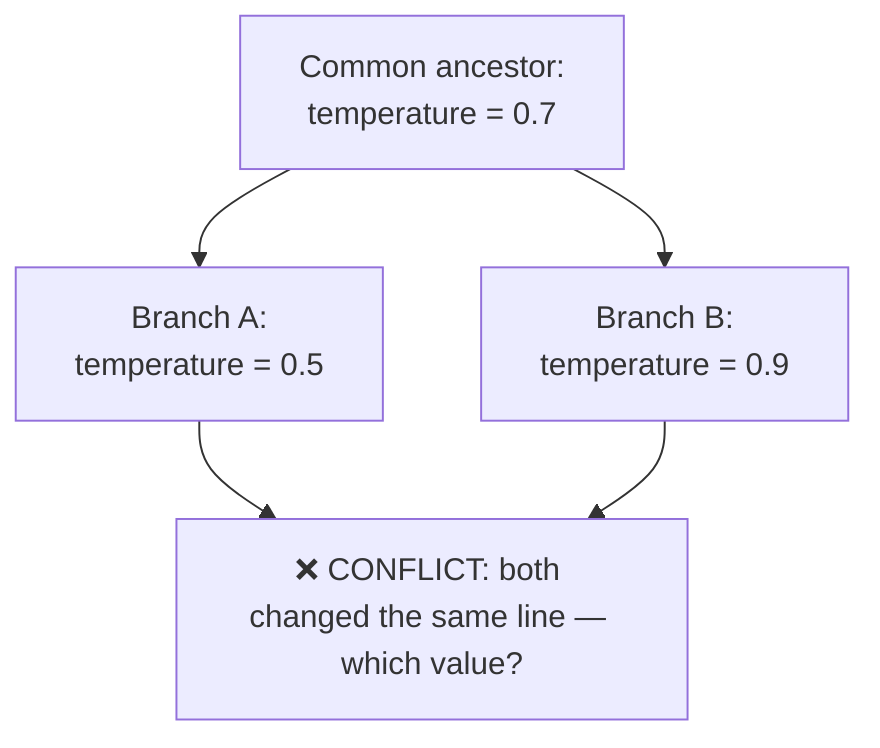
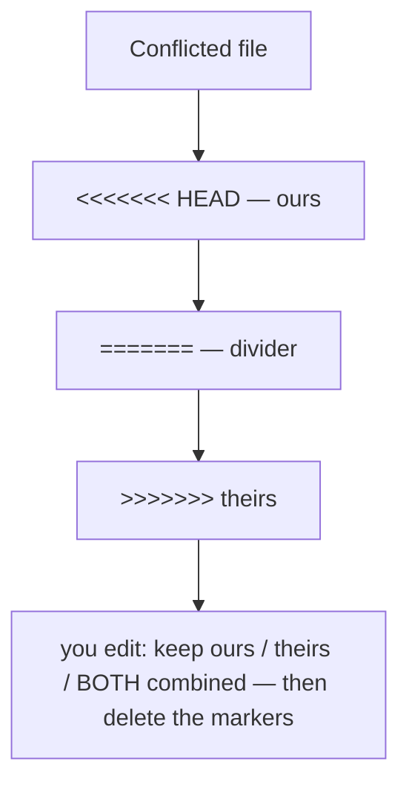
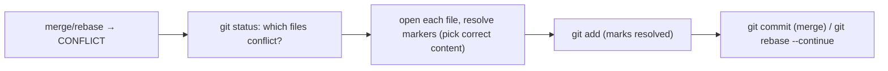

<!-- Module 04 · Lesson 5 — follows ../../../standards/. -->

# 04.5 · Merge Conflict Resolution

[⬅ 04.4 Advanced Branch Management](04.4-advanced-branch-management.md) · [🏠 Module](../README.md) · [🗺 Roadmap](../../../ROADMAP.md) · [Next ➡](04.6-tags-releases.md)

> Conflicts feel scary but are *routine* — they just mean two people changed the same lines and Git needs *you* to decide. This lesson demystifies why conflicts happen, how to read the markers, how to resolve them confidently, and — most valuably — how to prevent most of them.

| | |
|---|---|
| **Module** | `04 · Advanced Git & Collaboration` |
| **Lesson** | `04.5` |
| **Difficulty** | ⭐⭐⭐ |
| **Estimated study time** | 45 min read · 40 min practice |
| **Status** | 🟢 stable |

---

## 1. Learning Objectives

By the end of this lesson you will be able to:

- [ ] Explain **why** merge conflicts happen (and why they're not errors).
- [ ] Read and interpret **conflict markers**.
- [ ] **Resolve** a conflict confidently, step by step.
- [ ] Use **merge tools** and `git status` during a conflict.
- [ ] **Prevent** conflicts through workflow habits.

## 2. Prerequisites

- [04.2 Commit History](04.2-commit-history.md) (merges, common ancestor) and [04.4](04.4-advanced-branch-management.md) (merge/rebase).

---

## 3. Why This Topic Exists

Merge conflicts are the #1 thing that makes beginners fear collaboration — they hit one, panic, and sometimes make it worse. But conflicts are **normal and expected**: whenever two branches change the *same lines* of the *same file*, Git can't know which version is right, so it *asks you*. That's not a failure — it's Git being careful. Learning to resolve conflicts calmly is a core collaboration skill; learning to *prevent* most of them is what separates smooth teams from thrashing ones.

> [!IMPORTANT]
> **A merge conflict is not an error — it's Git asking you a question it can't answer.** When two branches modify the same lines differently (relative to their common ancestor, [04.2](04.2-commit-history.md)), Git safely stops and says "you decide." Your job is to pick the right combination of both changes. Understanding this removes the fear: you're not fixing a bug, you're making an editorial decision. Git resolves *most* changes automatically (different files, different lines) — conflicts only arise on genuinely overlapping edits.

## 4. Why Conflicts Happen

Git merges by comparing both branches to their **common ancestor** (merge base, [04.2](04.2-commit-history.md)). If each side changed *different* lines, Git combines them automatically. A conflict happens only when **both sides changed the same lines differently** — Git can't choose, so it flags it.



| Situation | Git's behavior |
|---|---|
| Branches changed *different* files | Auto-merge ✅ |
| Branches changed *different* lines of the same file | Auto-merge ✅ |
| Both changed the *same* lines | **Conflict** — you resolve |
| One deleted a file, the other edited it | Conflict (delete/modify) |

> [!NOTE]
> This is why **short-lived branches cause fewer conflicts** ([04.3](04.3-branching-strategies.md)): the longer a branch lives, the more both it and `main` change, and the higher the chance of overlapping edits. A branch that lives an hour rarely conflicts; one that lives three weeks almost certainly will. Prevention (§8) is mostly about *reducing overlap and divergence*.

---

## 5. Reading Conflict Markers

When a conflict occurs, Git edits the file in place, inserting **conflict markers** showing both versions:

```text
<<<<<<< HEAD
temperature = 0.5          ← YOUR version (current branch, "ours")
=======
temperature = 0.9          ← THEIR version (incoming branch, "theirs")
>>>>>>> feature/tuning
```

| Marker | Meaning |
|---|---|
| `<<<<<<< HEAD` | Start of *your* current branch's version ("ours") |
| `=======` | Divider between the two versions |
| `>>>>>>> branch` | End; above is the *incoming* version ("theirs") |



> [!IMPORTANT]
> **To resolve: edit the file so it contains the correct final content, then delete all three marker lines.** You choose ours, theirs, or (most often) a *thoughtful combination* of both. The markers are just Git showing you the two candidates — the resolution is whatever the code *should* be. A critical, common mistake: leaving a marker (`<<<<<<<`) in the file and committing it — that ships broken, un-parseable code. Always search for leftover markers before committing (`grep -rn "<<<<<<<"`, [Module 03.5](../../03-Linux/weeks/03.5-essential-commands.md)).

---

## 6. Resolving a Conflict — Step by Step



```bash
git merge feature              # → CONFLICT in config.py
git status                     # lists "both modified" files
# ... edit config.py: resolve the markers, delete markers ...
git add config.py              # stage the resolved file (tells Git it's done)
git commit                     # complete the merge (or: git merge --continue)
# for rebase conflicts:
git rebase --continue          # after resolving each conflicted step
# to bail out entirely:
git merge --abort              # or: git rebase --abort
```

| During a conflict | Command |
|---|---|
| See conflicted files | `git status` |
| See the conflict in context | open the file / `git diff` |
| Mark a file resolved | `git add <file>` |
| Finish the merge | `git commit` (or `--continue` for rebase) |
| Give up and restore | `git merge --abort` / `git rebase --abort` |

> [!TIP]
> **`git merge --abort` (and `git rebase --abort`) are your safety net** — if a conflict is bigger than expected or you're confused, abort and you're back exactly where you started, no harm done. There's *no penalty* for aborting and trying again with a clearer head (or after asking the other author). This removes all pressure: you can never "break" the repo by starting a merge. Resolve calmly, `git add` each file as you finish it, and complete when `git status` shows no more conflicts.

---

## 7. Merge Tools

For complex conflicts, a visual **three-way merge tool** shows *ours*, *theirs*, and the *base* side by side, making it easier to see what each side changed.

```bash
git mergetool                  # launch your configured merge tool
git config --global merge.conflictstyle zdiff3   # show the base too (very helpful!)
```

| Tool | Notes |
|---|---|
| VS Code | Built-in merge editor (Accept Current/Incoming/Both) — most common today |
| `vimdiff`, Meld, Beyond Compare | Dedicated three-way merge UIs |
| `merge.conflictstyle = zdiff3` | Adds the *common ancestor* to the markers — hugely clarifying |

> [!TIP]
> Set **`merge.conflictstyle = zdiff3`** — it adds a `||||||| base` section to the markers showing the *original* (ancestor) version, so you can see what *each* side changed rather than guessing. This turns "which of these two do I want?" into "I can see A removed X and B added Y, so I want both." For AI Engineers, **VS Code's merge editor** is the pragmatic default (clear buttons for each side). Whatever the tool, the *decision* is still yours — tools just make the two versions easier to compare.

---

## 8. Preventing Conflicts

The best conflict is the one that never happens. Prevention is mostly workflow discipline:

| Prevention habit | Why it works |
|---|---|
| **Short-lived branches** ([04.3](04.3-branching-strategies.md)) | Less divergence = less overlap |
| **Pull/rebase from `main` frequently** | Stay current; resolve small conflicts early |
| **Small, focused PRs** ([04.7](04.7-github-collaboration.md)) | Fewer changed lines = fewer collisions |
| **Communicate** who's working on what | Avoid two people editing the same code |
| **Modular code** (small files/functions) | Less chance of touching the same lines |
| **Consistent formatting** (auto-format, [04.10](04.10-automation.md)) | Prevents whitespace/style "conflicts" |

> [!IMPORTANT]
> **Frequent integration is the master prevention technique.** If you merge/rebase from `main` into your branch *daily*, conflicts are small and fresh (you remember the context). If you wait three weeks, you face a giant, confusing conflict against code that's changed a lot ([04.3 trunk-based](04.3-branching-strategies.md) exists precisely to enforce this). Two AI-specific tips: (1) **auto-format code** ([Module 01.13](../../01-Advanced-Python/weeks/01.13-packaging-code-quality.md)/[04.10](04.10-automation.md)) so style differences never cause conflicts; (2) **notebooks conflict horribly** (JSON with embedded outputs) — clear outputs before committing or use tools like `nbdime`/`jupytext` ([04.9](04.9-large-files.md)).

---

## 9. The Notebook Conflict Problem (AI-Specific)

> [!WARNING]
> **Jupyter notebooks (`.ipynb`) are a merge-conflict nightmare** — they're JSON files containing code, outputs, *and* execution metadata, so even trivial changes produce huge, unreadable diffs and near-guaranteed conflicts. AI teams handle this with: **clearing outputs before committing** (a pre-commit hook, [04.10](04.10-automation.md)), **`nbdime`** (notebook-aware diff/merge), or **`jupytext`** (pairing notebooks with plain `.py` files that diff cleanly). Never merge a raw `.ipynb` conflict by hand if you can avoid it. This is a real, daily pain point unique to AI work ([04.9](04.9-large-files.md) covers notebook/data handling).

---

## 10. Common Mistakes & Recovery

| Mistake | Consequence | Fix |
|---|---|---|
| Leaving conflict markers in a file | Broken, un-parseable code shipped | `grep -rn "<<<<<<<"` before committing |
| Panicking and force-pushing | Made it worse | `git merge --abort`, start over calmly |
| Blindly "accept theirs/ours" | Lost the other side's needed change | Read both; combine thoughtfully |
| Resolving without understanding | Reintroduced a bug | Understand *why* each side changed |
| Long-lived branch, giant conflict | Painful, error-prone | Integrate frequently |
| Notebook conflicts by hand | Corrupted notebook | Clear outputs / `nbdime`/`jupytext` |

## 11. Best Practices

- ✅ Run `git status` first — know exactly which files conflict.
- ✅ **Abort freely** if confused (`--abort`) — no penalty.
- ✅ Combine both sides thoughtfully; don't reflexively pick one.
- ✅ Search for leftover markers before committing.
- ✅ Prevent: short branches, frequent integration, small PRs, auto-format.
- ✅ Test after resolving — a resolved merge can still be logically wrong.

## 12. Performance / Operational Considerations

Conflicts are a *human* cost, not a compute one. Their real expense is time and risk of introducing bugs — which is why *prevention* (short branches, frequent integration) has such high ROI for team velocity.

## 13. Security Considerations

| Risk | Guidance |
|---|---|
| Resolving away a security fix | Understand each side; test after resolving |
| Merge markers hiding malicious code | Review the *full* resolved diff, not just markers |
| Auto-resolving a conflict on a sensitive file | Review carefully; require PR review ([04.7](04.7-github-collaboration.md)) |

## 14. Interview Questions

**Beginner**
1. Why do merge conflicts happen? Are they errors?
2. What do the conflict markers (`<<<<<<<`, `=======`, `>>>>>>>`) mean?

**Intermediate**
1. Walk through resolving a conflict, from `git merge` to completion.
2. How do you abort a merge/rebase if a conflict is too complex?

**Advanced**
1. How would you *prevent* most merge conflicts on a team?
2. Why are Jupyter notebooks especially conflict-prone, and how do AI teams handle it?

**System-design prompt**
- Your team keeps hitting painful conflicts on a shared file. Diagnose and design a prevention strategy. — *Follow-ups:* Branch lifetime? Integration frequency? Code modularity? Formatting? Notebooks?

## 15. Summary

| Key idea | Takeaway |
|---|---|
| Conflicts aren't errors | Git asking you to decide overlapping edits |
| Why they happen | Both sides changed the same lines |
| Markers | `<<<<<<<` ours / `=======` / `>>>>>>>` theirs |
| Resolve | Edit to correct content, delete markers, `git add`, complete |
| Abort freely | `--abort` returns you safely — no penalty |
| Prevent | Short branches, frequent integration, small PRs, auto-format |
| Notebooks | Special pain — clear outputs / `nbdime`/`jupytext` |

## 16. Cheat Sheet

```text
CONFLICT = both branches changed the SAME lines differently (vs common ancestor) — Git asks YOU (not an error)
  auto-merges: different files or different lines · conflicts: overlapping edits, delete/modify
MARKERS:  <<<<<<< HEAD (OURS) ... ======= ... >>>>>>> branch (THEIRS)   [+ ||||||| base with zdiff3]
RESOLVE: git status(which files) → edit to correct content + DELETE all markers → git add <file> → git commit
  rebase: git rebase --continue after each · BAIL OUT: git merge --abort / git rebase --abort (no penalty!)
  ⚠️ never commit leftover markers: grep -rn "<<<<<<<" before committing
TOOLS: git mergetool · VS Code merge editor · git config merge.conflictstyle zdiff3 (shows base — do this!)
PREVENT (best!): short-lived branches · pull/rebase from main FREQUENTLY · small PRs · communicate · auto-format · modular code
NOTEBOOKS (.ipynb): conflict nightmare (JSON+outputs) → clear outputs (pre-commit hook) / nbdime / jupytext
AFTER RESOLVING: TEST — a resolved merge can still be logically wrong
```

## 17. Flashcards

- **Q:** Is a merge conflict an error? — **A:** No — it's Git asking you to decide when two branches changed the same lines differently (relative to their common ancestor); Git safely stops rather than guessing.
- **Q:** What do `<<<<<<< HEAD` and `>>>>>>> branch` mark? — **A:** The start of *your* version ("ours") and the end of the *incoming* version ("theirs"), separated by `=======`.
- **Q:** How do you finish resolving a conflict? — **A:** Edit the file to the correct final content, delete all markers, `git add` each resolved file, then complete the merge (`git commit`) or `git rebase --continue`.
- **Q:** What if a conflict is too complex? — **A:** `git merge --abort` / `git rebase --abort` — returns you exactly to before you started, with no penalty.
- **Q:** Best way to *prevent* conflicts? — **A:** Frequent integration + short-lived branches + small PRs (plus auto-formatting and modular code) — minimize divergence and overlap.
- **Q:** Why are notebooks conflict-prone, and the fix? — **A:** They're JSON with embedded outputs/metadata, producing huge unreadable diffs; clear outputs before committing or use `nbdime`/`jupytext`.

## 18. Hands-on Exercises

> Full set in [`../exercises/`](../exercises/).

- [ ] **(⭐ Create)** Deliberately create a conflict: two branches edit the same line; merge and observe the markers.
- [ ] **(⭐⭐ Resolve)** Resolve the conflict by combining both changes; verify no markers remain (`grep`); complete the merge.
- [ ] **(⭐⭐ Abort)** Start a merge with a conflict, then `git merge --abort`; confirm you're back to the start.
- [ ] **(⭐⭐ Tool)** Enable `zdiff3` conflict style and/or use VS Code's merge editor on a conflict; compare to hand-editing.
- [ ] **(⭐⭐⭐ Rebase conflict)** Trigger a conflict during a rebase; resolve step-by-step with `git rebase --continue`.
- [ ] **(⭐⭐ Prevent)** Demonstrate that a short-lived branch conflicts less than a long-diverged one (same edit, different timing).

## 19. Mini Project

> **Merge conflict lab & playbook.** Build a documented lab on a practice repo that reproduces each conflict type (same-line edit, delete/modify, rebase conflict, notebook conflict) and shows the resolution for each — plus a one-page "conflict resolution playbook" (the steps, the abort escape hatch, prevention habits). Include screenshots/markers. This turns conflict-panic into conflict-routine, and is a reference you'll actually use.

## 20. References

- *Pro Git*, Ch. 3.2 "Basic Merging" & conflict resolution ([reference standards](../../../standards/reference-standards.md)).
- `nbdime` and `jupytext` documentation (notebook-aware Git).
- `git help merge`; VS Code merge-conflict docs.

## 21. What's Next

You can collaborate on branches. Now learn to *mark and ship versions*: **tags and releases** — lightweight vs annotated tags, SemVer, and GitHub Releases — to version your AI project over time.

➡️ **Next:** [04.6 · Tags & Releases](04.6-tags-releases.md)

---

### 🔁 Revision checklist
- [ ] I understand conflicts as decisions, not errors
- [ ] I can read markers and resolve by combining thoughtfully
- [ ] I abort freely when confused, and never commit leftover markers
- [ ] I prevent conflicts with short branches + frequent integration

### 🔗 Spaced-repetition callback
> Recall [04.3's short-lived branches](04.3-branching-strategies.md): the branching-strategy advice ("integrate often") exists *specifically* to make this lesson's conflicts rare and small. And [Module 03.5's `grep`](../../03-Linux/weeks/03.5-essential-commands.md) is how you catch leftover conflict markers before committing. Conflict resolution is where branching strategy meets the command line.
