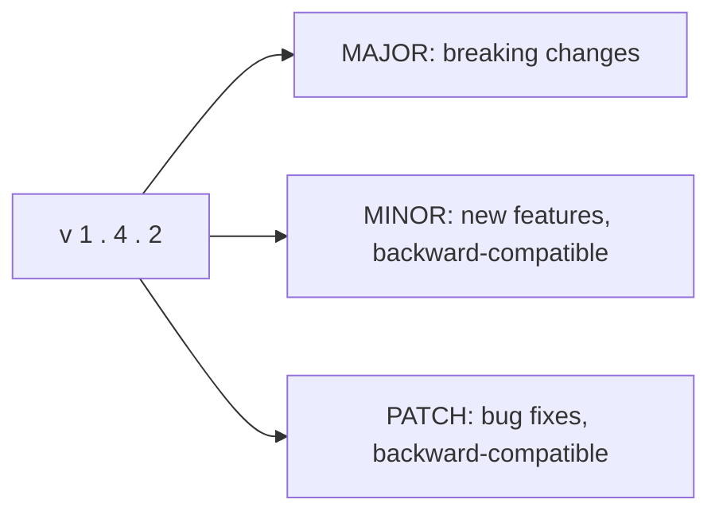
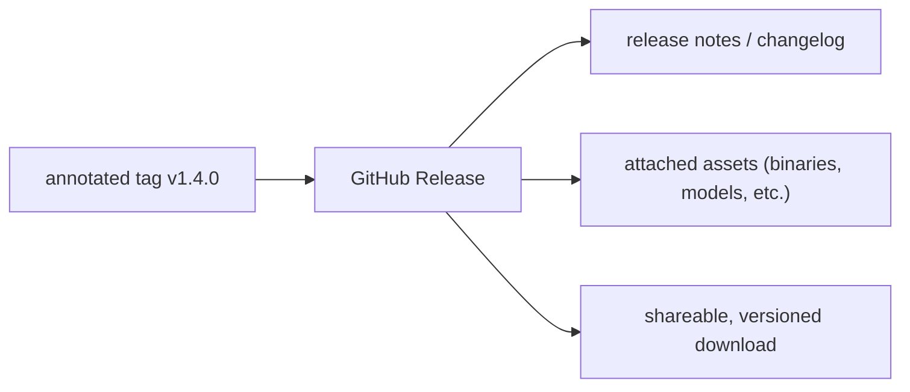
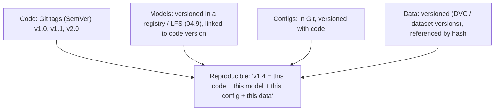

<!-- Module 04 · Lesson 6 — follows ../../../standards/. -->

# 04.6 · Tags & Releases

[⬅ 04.5 Merge Conflicts](04.5-merge-conflicts.md) · [🏠 Module](../README.md) · [🗺 Roadmap](../../../ROADMAP.md) · [Next ➡](04.7-github-collaboration.md)

> A commit says "this is the code"; a **tag** says "this is *version 1.4.0*." This lesson covers tags, Semantic Versioning, and GitHub Releases — how you mark, name, and ship versions of an AI project so you (and everyone) can reproduce, roll back, and track exactly what's deployed.

| | |
|---|---|
| **Module** | `04 · Advanced Git & Collaboration` |
| **Lesson** | `04.6` |
| **Difficulty** | ⭐⭐ |
| **Estimated study time** | 40 min read |
| **Status** | 🟢 stable |

---

## 1. Learning Objectives

By the end of this lesson you will be able to:

- [ ] Distinguish **lightweight** and **annotated** tags.
- [ ] Apply **Semantic Versioning (SemVer)** to a project.
- [ ] Create **GitHub Releases** from tags.
- [ ] Version an **AI project** over time (code, models, configs).

## 2. Prerequisites

- [04.1 Internals](04.1-git-internals.md) (tags as pointers), [Module 00.6](../../00-Orientation/weeks/00.6-github-repository-workflow.md) (SemVer intro).

---

## 3. Why This Topic Exists

Commits identify code by hash — great for machines, useless for humans ("deploy `a1b2c3d`"?). **Tags** give commits human-meaningful names (`v1.4.0`), and **releases** bundle a tagged version with notes and artifacts. This is how you answer critical production questions: *what version is deployed? how do I roll back to the last good one? what changed between v1.3 and v1.4?*

For AI systems specifically, versioning matters enormously: you must know exactly which code + config + model produced a result (reproducibility, [Module 00.5](../../00-Orientation/weeks/00.5-development-environment.md)), and be able to roll back a bad model release instantly.

> [!IMPORTANT]
> A **tag is a permanent, human-readable name for a specific commit** ([04.1](04.1-git-internals.md): a pointer that doesn't move). Unlike a branch (which moves as you commit), a tag stays fixed on its commit forever — `v1.4.0` will always mean *that exact snapshot*. This is what makes releases reproducible and rollbacks precise: "deploy `v1.3.2`" is unambiguous and permanent.

## 4. Lightweight vs Annotated Tags

Git has two kinds of tags:

| | Lightweight tag | Annotated tag |
|---|---|---|
| What it is | Just a pointer to a commit (a name) | A full **object** ([04.1](04.1-git-internals.md)): pointer + tagger, date, message |
| Metadata | None | Author, timestamp, message, (optional GPG signature) |
| Use for | Temporary/private markers | **Releases** — the professional choice |
| Command | `git tag v1.0` | `git tag -a v1.0 -m "message"` |

```bash
git tag -a v1.4.0 -m "Release 1.4.0: add RAG retriever"   # annotated (recommended)
git tag v1.4.0-tmp                                          # lightweight (quick marker)
git tag                                                     # list tags
git show v1.4.0                                             # tag details + the commit
git push origin v1.4.0                                      # tags aren't pushed by default!
git push origin --tags                                     # push all tags
```

> [!IMPORTANT]
> **Use annotated tags for releases** (`git tag -a`). They're real objects storing *who* tagged, *when*, and *why* (and can be GPG-signed for authenticity) — a proper, auditable release record. Lightweight tags are just bookmarks with no metadata. **Two gotchas:** (1) tags are **not pushed automatically** — you must `git push origin <tag>` or `--tags`; a common surprise is tagging locally and wondering why the release isn't on GitHub. (2) Checking out a tag puts you in **detached HEAD** ([04.2](04.2-commit-history.md)) — expected, since a tag isn't a branch.

---

## 5. Semantic Versioning (SemVer)

Recall from [Module 00.6](../../00-Orientation/weeks/00.6-github-repository-workflow.md): **SemVer** is the standard `MAJOR.MINOR.PATCH` scheme that communicates *what kind* of change a version contains.



| Increment | When | Example |
|---|---|---|
| **MAJOR** | Incompatible/breaking changes | `1.4.2 → 2.0.0` |
| **MINOR** | New backward-compatible functionality | `1.4.2 → 1.5.0` |
| **PATCH** | Backward-compatible bug fixes | `1.4.2 → 1.4.3` |

Pre-release and build suffixes: `2.0.0-rc.1` (release candidate), `1.4.0-beta`.

> [!IMPORTANT]
> **SemVer is a *communication contract*** — the version number tells users the risk of upgrading. A PATCH bump is safe; a MAJOR bump warns "this will break your code, read the migration guide." For **libraries/SDKs** (an AI SDK, a shared model wrapper), following SemVer strictly is essential — downstream users pin versions based on it ([Module 01.13](../../01-Advanced-Python/weeks/01.13-packaging-code-quality.md) lockfiles). For **applications/services** (a deployed model API), SemVer is looser but still valuable for tracking releases. This handbook itself uses SemVer ([CHANGELOG.md](../../../CHANGELOG.md), [Module 00.6](../../00-Orientation/weeks/00.6-github-repository-workflow.md)).

---

## 6. GitHub Releases

A **GitHub Release** turns a tag into a first-class, shareable artifact: it attaches release notes, downloadable files (binaries, model weights), and appears prominently on the repo's page.



| Release includes | Purpose |
|---|---|
| A tag (the version) | The exact code ([04.1](04.1-git-internals.md)) |
| Release notes | What changed (often from [CHANGELOG.md](../../../CHANGELOG.md)) |
| Attached assets | Compiled binaries, model files, datasets |
| Auto-generated notes | GitHub can list merged PRs since the last release |

> [!TIP]
> GitHub Releases can be **automated** ([04.11](04.11-github-actions.md)): a GitHub Action can trigger on a pushed tag, build artifacts, generate release notes from merged PRs, and publish the release — the "release automation" you'll build as a mini-project. GitHub can also auto-generate release notes from PR titles/labels, which is why good PR titles ([04.7](04.7-github-collaboration.md)) and a maintained [CHANGELOG](../../../CHANGELOG.md) pay off at release time.

---

## 7. Versioning an AI Project Over Time

AI projects have more than code to version — models, configs, and data all evolve. Here's a coherent approach:



| What | How to version |
|---|---|
| Code + configs | Git tags with SemVer (this lesson) |
| Model weights | Model registry or Git LFS ([04.9](04.9-large-files.md)), tied to a code version |
| Datasets | Data-versioning tools (DVC) or immutable dataset snapshots ([Module 02.10](../../02-Computer-Science/weeks/02.10-file-systems.md)) |
| The whole system | A release that pins *all* of the above |

> [!IMPORTANT]
> **AI reproducibility requires versioning code AND model AND config AND data together** — a result is only reproducible if you can recover the exact combination that produced it ([Module 00.5](../../00-Orientation/weeks/00.5-development-environment.md)). Git tags version the *code and config* cleanly; models and data are too large for Git ([04.9](04.9-large-files.md)) so they live in registries/LFS/DVC, *referenced* by the code version. A good release ties them together: "`v1.4.0` uses model `rag-v3` and dataset `docs-2026-06`." You'll build full ML versioning in [Module 16 · MLOps](../../16-MLOps/README.md); tags are the code-side foundation.

---

## 8. Common Mistakes & Best Practices

| Mistake | Fix |
|---|---|
| Lightweight tags for releases | Use annotated (`-a`) — metadata matters |
| Forgetting to push tags | `git push origin <tag>` / `--tags` |
| Inconsistent versioning | Follow SemVer strictly |
| No release notes | Maintain [CHANGELOG.md](../../../CHANGELOG.md); auto-generate |
| Versioning code but not model/data | Version all together for reproducibility |
| Moving/deleting a published tag | Tags should be immutable — never re-tag a released version |

- ✅ **Annotated tags for releases**, pushed to the remote.
- ✅ **SemVer** consistently; document breaking changes.
- ✅ Keep a **[CHANGELOG](../../../CHANGELOG.md)** in sync with releases.
- ✅ For AI: **tie model/data versions to the code release**.
- ❌ Never move a published tag — reproducibility depends on its permanence.

## 9. Performance / Operational Considerations

Tags are tiny pointers — zero performance cost. The operational value is *reliability*: precise rollbacks ("deploy `v1.3.2`"), reproducibility, and clear communication of what's running — which prevent expensive production incidents.

## 10. Security Considerations

| Risk | Guidance |
|---|---|
| Unauthenticated releases | GPG/SSH-sign tags for verifiable authenticity |
| Tampered release assets | Publish checksums; sign artifacts |
| A tag pointing to unreviewed code | Tag only from reviewed, tested commits on `main` |
| Secrets in a release artifact | Never bundle secrets ([Module 03.16](../../03-Linux/weeks/03.16-docker-preparation.md)/[04.9](04.9-large-files.md)) |

> [!TIP]
> **Sign your release tags** (`git tag -s`) for security-sensitive projects — a signed tag proves the release genuinely came from you and wasn't tampered with (supply-chain integrity, [Module 02.9](../../02-Computer-Science/weeks/02.9-serialization.md)). And always tag from a **reviewed, CI-passing commit on `main`** — a release is a promise that this exact code is production-ready.

## 11. Interview Questions

**Beginner**
1. What's the difference between a lightweight and an annotated tag?
2. Explain SemVer (`MAJOR.MINOR.PATCH`).

**Intermediate**
1. Why must you push tags explicitly, and why does checking out a tag detach HEAD?
2. What is a GitHub Release, and what does it add over a tag?

**Advanced**
1. How do you version an AI project's code, model, config, and data for reproducibility?
2. Why sign release tags, and what does it protect against?

**System-design prompt**
- Design a versioning + release scheme for an AI model API so you can always identify and roll back what's deployed. — *Follow-ups:* How do tags/SemVer fit? How do you tie model/data versions to code? How do you automate releases ([04.11](04.11-github-actions.md))?

## 12. Summary

| Key idea | Takeaway |
|---|---|
| Tag | Permanent human name for a commit |
| Annotated tags | For releases — carry metadata; push explicitly |
| SemVer | `MAJOR.MINOR.PATCH` = a communication contract |
| GitHub Release | Tag + notes + assets, shareable |
| AI versioning | Version code + model + config + data together |
| Immutable | Never move a published tag |

## 13. Cheat Sheet

```text
TAG = permanent human name for a commit (unlike a branch, doesn't move) → reproducible/rollback
LIGHTWEIGHT: git tag v1.0 (just a pointer) · ANNOTATED (releases!): git tag -a v1.4.0 -m "msg" (object + tagger/date/msg, signable)
  ⚠️ tags NOT pushed by default: git push origin v1.4.0  (or --tags) · checkout tag = detached HEAD (expected)
  git tag(list) · git show v1.4.0 · git tag -s (signed)
SEMVER MAJOR.MINOR.PATCH: MAJOR=breaking · MINOR=backward-compat feature · PATCH=backward-compat fix
  suffixes: -rc.1, -beta · a COMMUNICATION CONTRACT (esp. for libraries/SDKs — users pin versions)
GITHUB RELEASE: tag + release notes (from CHANGELOG) + attached assets (binaries/models) → shareable, automatable (04.11)
AI VERSIONING: code+config → Git tags · models → registry/LFS(04.9) · data → DVC/snapshots · TIE them together in a release
BEST: annotated + pushed · SemVer consistently · CHANGELOG in sync · tag reviewed/CI-passing main · NEVER move a published tag
```

## 14. Flashcards

- **Q:** Lightweight vs annotated tag? — **A:** Lightweight is just a pointer (a name); annotated is a full object with tagger, date, message, and optional signature — use annotated for releases.
- **Q:** Explain SemVer. — **A:** `MAJOR.MINOR.PATCH`: MAJOR = breaking change, MINOR = backward-compatible feature, PATCH = backward-compatible fix — a contract communicating upgrade risk.
- **Q:** Why must you push tags explicitly? — **A:** Git doesn't push tags by default; use `git push origin <tag>` or `--tags` — otherwise the release exists only locally.
- **Q:** Why does checking out a tag detach HEAD? — **A:** A tag is a fixed pointer, not a branch, so HEAD points directly at the commit (detached HEAD) — expected.
- **Q:** What does a GitHub Release add over a tag? — **A:** Release notes, downloadable assets (binaries/models), and a prominent, shareable, versioned page — and it can be automated.
- **Q:** What must be versioned together for AI reproducibility? — **A:** Code, config, model weights, and data — a result is only reproducible if you can recover the exact combination.

## 15. Hands-on Exercises

> Full set in [`../exercises/`](../exercises/).

- [ ] **(⭐ Tag)** Create a lightweight and an annotated tag; `git show` each; note the metadata difference.
- [ ] **(⭐ Push)** Push a tag to a remote; confirm it appears (and that it didn't push automatically before).
- [ ] **(⭐⭐ SemVer)** Given 5 change descriptions, decide the correct version bump for each.
- [ ] **(⭐⭐ Release)** On GitHub, create a Release from a tag with notes; (optionally) attach an asset.
- [ ] **(⭐⭐⭐ AI versioning)** Design a scheme tying a code tag to a model version and dataset version; document it.

## 16. Mini Project

> **Release automation (this module's showcase, v2).** Set up a repo where pushing an annotated version tag (`v*`) triggers a GitHub Action ([04.11](04.11-github-actions.md)) that: verifies the tag matches SemVer, generates release notes from merged PRs / [CHANGELOG](../../../CHANGELOG.md), and publishes a GitHub Release. Document the flow with a diagram. This is real release engineering — one command (`git push origin v1.4.0`) produces a full, noted release.

## 17. References

- Semantic Versioning spec (semver.org); *Pro Git* Ch. 2.6 "Tagging" ([reference standards](../../../standards/reference-standards.md)).
- GitHub Releases documentation; Keep a Changelog (keepachangelog.com).
- [Module 16 · MLOps](../../16-MLOps/README.md) — full model/data versioning.

## 18. What's Next

You can version and ship. Now the heart of team collaboration: **GitHub collaboration** — pull requests, code reviews, protected branches, and merge strategies — how code actually gets from a branch to `main` on a real team.

➡️ **Next:** [04.7 · GitHub Collaboration](04.7-github-collaboration.md)

---

### 🔁 Revision checklist
- [ ] I use annotated tags for releases and push them explicitly
- [ ] I apply SemVer as a communication contract
- [ ] I can create a GitHub Release with notes
- [ ] I version AI code/model/config/data together

### 🔗 Spaced-repetition callback
> Recall [Module 00.6's SemVer + CHANGELOG](../../00-Orientation/weeks/00.6-github-repository-workflow.md) and [04.1's "tag = fixed pointer"](04.1-git-internals.md): tags are the permanent names that make releases reproducible, and SemVer is the versioning discipline you first met in Module 00 — now the code-side foundation of the full ML versioning you'll build in [Module 16](../../16-MLOps/README.md).
