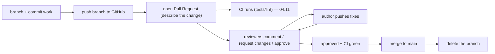
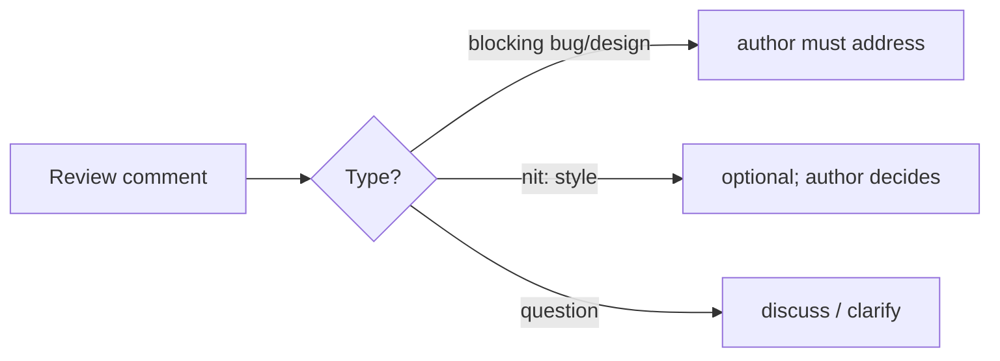
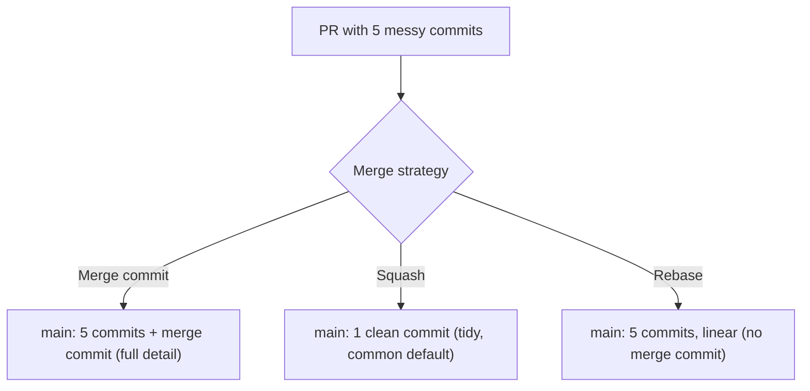
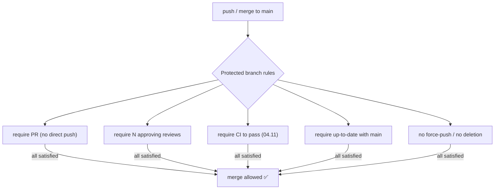

<!-- Module 04 · Lesson 7 — follows ../../../standards/. -->

# 04.7 · GitHub Collaboration

[⬅ 04.6 Tags & Releases](04.6-tags-releases.md) · [🏠 Module](../README.md) · [🗺 Roadmap](../../../ROADMAP.md) · [Next ➡](04.8-repository-management.md)

> Code doesn't reach `main` by magic — it flows through **pull requests, code reviews, and protected branches**. This lesson teaches how professional teams collaborate on GitHub: opening effective PRs, giving and receiving reviews, and the merge strategies and safeguards that keep `main` healthy.

| | |
|---|---|
| **Module** | `04 · Advanced Git & Collaboration` |
| **Lesson** | `04.7` |
| **Difficulty** | ⭐⭐⭐ |
| **Estimated study time** | 50 min read |
| **Status** | 🟢 stable |

---

## 1. Learning Objectives

By the end of this lesson you will be able to:

- [ ] Open effective **pull requests (PRs)** with good descriptions.
- [ ] Give and receive **code reviews** professionally.
- [ ] Configure **protected branches** and **branch permissions**.
- [ ] Choose among **merge strategies** (merge commit, squash, rebase).
- [ ] Use **draft PRs** and review comments effectively.

## 2. Prerequisites

- [04.3 Branching Strategies](04.3-branching-strategies.md), [04.4 Advanced Branch Mgmt](04.4-advanced-branch-management.md) (squash/rebase), and [Module 00.6](../../00-Orientation/weeks/00.6-github-repository-workflow.md).

---

## 3. Why This Topic Exists

The **pull request** is the center of modern software collaboration — it's where code is proposed, reviewed, discussed, tested (CI), and merged. Mastering PRs and code review isn't optional; it's *the* daily interface with your team, and how you build trust and reputation as an engineer. Good PR/review practice catches bugs, spreads knowledge, and keeps `main` healthy; bad practice causes friction, missed defects, and broken deploys.

This is as much a *human* skill (communication, giving/receiving feedback) as a technical one — and it's where junior engineers most visibly become senior.

> [!IMPORTANT]
> A **pull request is a request to merge your branch into another (usually `main`), plus a space to review and discuss it before merging.** It's the quality gate ([04.3 "main always deployable"](04.3-branching-strategies.md)): code is reviewed by a human and checked by CI ([04.11](04.11-github-actions.md)) *before* it becomes part of the shared codebase. The PR — not the commit — is the unit of collaboration on real teams.

## 4. The Pull Request Lifecycle



| Stage | What happens |
|---|---|
| Open PR | Propose the merge; write *what* and *why* |
| CI | Automated tests/lint run ([04.11](04.11-github-actions.md)) |
| Review | Teammates read, comment, approve or request changes |
| Iterate | Author addresses feedback, pushes updates |
| Merge | When approved + CI green, merge to `main` |
| Cleanup | Delete the merged branch |

---

## 5. Writing an Effective PR

A good PR makes reviewing *easy* — which gets your code merged faster and with better feedback.

| Element | Do |
|---|---|
| **Title** | Clear, specific (`feat: add RAG retriever with reranking`) — feeds release notes ([04.6](04.6-tags-releases.md)) |
| **Description** | *What* changed, *why*, *how to test*, and any tradeoffs |
| **Size** | **Small!** — the single biggest factor in review quality |
| **Self-review** | Read your own diff first; catch obvious issues |
| **Linked issue** | Reference the issue it closes (`Closes #42`) |
| **Screenshots/output** | For UI/behavior changes |

> [!IMPORTANT]
> **Keep PRs small — it's the #1 lever on review quality and speed.** A 50-line PR gets a thorough review in minutes; a 2,000-line PR gets a rubber-stamp "LGTM" because no human can review it well ([Module 00.6 small commits](../../00-Orientation/weeks/00.6-github-repository-workflow.md)). Small PRs catch more bugs, merge faster, and are easier to revert if wrong. If a feature is large, break it into a *series* of small PRs. Write the description for the reviewer: they should understand *what* and *why* without reading every line. A great PR description is a gift to your reviewer — and to future-you reading the history.

---

## 6. Code Review — Giving and Receiving

Code review is where quality and knowledge-sharing happen. It's a skill with etiquette.

### Giving a review

| Do | Don't |
|---|---|
| Be kind and specific ("consider X because Y") | Be harsh or vague ("this is wrong") |
| Distinguish blocking issues from nits (prefix "nit:") | Block on personal style preferences |
| Explain *why*, suggest alternatives | Just criticize without helping |
| Approve when it's good enough (not perfect) | Endlessly bikeshed |
| Review promptly (unblock your teammate) | Sit on PRs for days |

### Receiving a review

| Do | Don't |
|---|---|
| Assume good intent; it's about the code | Take it personally |
| Respond to every comment (fix or discuss) | Silently ignore feedback |
| Ask for clarification if unclear | Argue defensively |
| Thank reviewers | — |



> [!IMPORTANT]
> **Code review is about the *code*, not the *coder*** — this framing prevents almost all review friction. As a reviewer, be kind, specific, and helpful; separate must-fix issues (bugs, design flaws, security) from optional preferences (mark those "nit:"). As an author, assume good intent, respond to every comment, and don't take feedback personally. Reviews also *spread knowledge* — you learn the codebase by reviewing, and teach by having your code reviewed. This is where team culture is made or broken; being a generous, prompt reviewer builds enormous goodwill.

---

## 7. Merge Strategies

When a PR is approved, *how* it merges shapes `main`'s history ([04.2 FF vs merge](04.2-commit-history.md)/[04.4 squash](04.4-advanced-branch-management.md)). GitHub offers three:

| Strategy | Result on `main` | Best for |
|---|---|---|
| **Merge commit** (`--no-ff`) | All the branch's commits + a merge commit (2 parents) | Preserving full branch context |
| **Squash and merge** | *One* commit combining the whole PR | Clean, linear history — **most common today** |
| **Rebase and merge** | The branch's commits replayed onto `main` (linear, no merge commit) | Linear history, preserving individual commits |



> [!IMPORTANT]
> **Squash-and-merge is the popular default** because it makes each PR *one* clean commit on `main` — history reads as a list of features/fixes, not thousands of "wip"/"fix typo" commits ([04.4 interactive rebase](04.4-advanced-branch-management.md) achieves the same but squash-merge does it automatically at merge time). It also makes reverting a whole feature trivial (revert one commit, [04.4](04.4-advanced-branch-management.md)). The tradeoff: you lose the individual commits' granularity. Teams pick one strategy and apply it consistently — know which your team uses. For AI projects, squash-merge keeps the noisy experimental history off `main`.

---

## 8. Protected Branches & Permissions

**Protected branches** are rules GitHub enforces on important branches (usually `main`) to prevent accidents and enforce quality.



| Protection | Prevents |
|---|---|
| **Require pull request** | Direct pushes to `main` (all changes reviewed) |
| **Require approvals** | Merging unreviewed code (e.g., 1–2 approvals) |
| **Require status checks** | Merging code that fails CI ([04.11](04.11-github-actions.md)) |
| **Require up-to-date branch** | Merging stale branches |
| **No force-push / no delete** | The [04.4](04.4-advanced-branch-management.md) force-push disaster |
| **CODEOWNERS review** | Merging without the relevant owner's approval ([04.8](04.8-repository-management.md)) |

> [!IMPORTANT]
> **Protected branches are how "main is always deployable" ([04.3](04.3-branching-strategies.md)) is *enforced*, not just hoped for.** They make it *impossible* to push directly to `main`, merge without review, merge failing CI, or force-push away history ([04.4](04.4-advanced-branch-management.md) golden rule). Every serious repo protects `main`. As an AI Engineer joining a team, you'll work within these rules — and when you set up a repo, configuring branch protection is step one of professional hygiene ([04.8](04.8-repository-management.md)).

---

## 9. Draft PRs & Review Comments

| Feature | Use |
|---|---|
| **Draft PR** | Open a PR that's *not ready* — get early feedback, run CI, signal "in progress" without requesting review |
| **Line comments** | Comment on specific lines/hunks |
| **Suggested changes** | Propose an exact edit the author can accept with one click |
| **Review summary** | Approve / Request changes / Comment, with an overall note |
| **Resolve conversation** | Mark a comment thread as handled |

> [!TIP]
> **Draft PRs** are underused and valuable: open one early to run CI on your work-in-progress, share direction with the team, or ask "am I on the right track?" *before* investing days — without pulling reviewers in prematurely. **Suggested changes** (a reviewer proposing exact code) speed up trivial fixes. And always **resolve conversations** as you address them so the PR shows clear progress. These small habits make collaboration smooth.

---

## 10. Common Mistakes & Best Practices

| Mistake | Better |
|---|---|
| Giant PRs | Small, focused PRs (biggest lever) |
| No PR description | Explain what/why/how-to-test |
| Harsh/vague reviews | Kind, specific, "nit:" for preferences |
| Ignoring review comments | Respond to every one |
| Sitting on reviews | Review promptly to unblock teammates |
| Unprotected `main` | Protect it (PR + review + CI required) |
| Inconsistent merge strategy | Team picks one, applies it |
| Merging your own unreviewed PR | Require others' approval |

## 11. Performance / Operational Considerations

The "performance" here is **team throughput**. Small PRs + prompt reviews + CI = fast, safe merging. Large PRs + slow reviews = bottlenecked delivery. Review latency is often a team's biggest hidden cost — being a fast, generous reviewer is high-leverage.

## 12. Security Considerations

| Risk | Guidance |
|---|---|
| Malicious/accidental bad code on `main` | Required review + CI ([04.11](04.11-github-actions.md)) |
| Force-push erasing history | Protected branches block it ([04.4](04.4-advanced-branch-management.md)) |
| Secrets in a PR diff | Reviewers + automated scanning ([04.10](04.10-automation.md)) catch them |
| Compromised contributor account | Require signed commits; 2FA; CODEOWNERS ([04.8](04.8-repository-management.md)) |
| PRs from forks running CI with secrets | Restrict secrets on fork PRs ([04.11](04.11-github-actions.md)) |

> [!CAUTION]
> **Code review is a security control.** A required review means two people see every change before it hits `main` — catching accidentally-committed secrets ([Module 03.15](../../03-Linux/weeks/03.15-security.md)), injected vulnerabilities, and risky logic. Combined with automated secret scanning ([04.10](04.10-automation.md)) and CI security checks, the PR gate is a primary defense. Never disable required reviews "just this once" for a rushed change — that's exactly when mistakes slip through.

## 13. Interview Questions

**Beginner**
1. What is a pull request, and why do teams use them?
2. Why keep PRs small?

**Intermediate**
1. Merge commit vs squash vs rebase merge — differences and when to use each?
2. What do protected branches enforce, and why?

**Advanced**
1. Describe how to give an effective, kind, high-signal code review.
2. How is the PR/review process a security control?

**System-design prompt**
- Design the collaboration workflow for a 10-person AI team: how code goes from branch to production. — *Follow-ups:* PR size/review policy? Protected-branch rules? Merge strategy? How does CI gate it? How do you keep review latency low?

## 14. Summary

| Key idea | Takeaway |
|---|---|
| PR = quality gate | Review + CI before code hits `main` |
| Small PRs | The #1 lever on review quality/speed |
| Review the code, not the coder | Kind, specific; distinguish blocking from nits |
| Merge strategies | Squash (common), merge commit, rebase |
| Protected branches | *Enforce* review + CI + no force-push |
| Draft PRs & suggestions | Early feedback; frictionless fixes |

## 15. Cheat Sheet

```text
PULL REQUEST = request to merge a branch + space to review/discuss before it hits main (the collaboration unit)
LIFECYCLE: branch → push → open PR → CI(04.11) + review → iterate → approved+green → merge → delete branch
GOOD PR: clear TITLE (feeds release notes) · description (what/why/how-to-test) · SMALL (#1 lever!) · self-review · "Closes #42"
REVIEW: about the CODE not the coder · kind + specific · "nit:" for optional · blocking = bugs/design/security · review PROMPTLY
  author: respond to every comment · assume good intent · don't take it personally
MERGE STRATEGIES: squash(1 clean commit — common default) · merge commit(full detail + merge commit) · rebase(linear commits)
PROTECTED BRANCHES (enforce "main deployable"): require PR · require N approvals · require CI green · no force-push/delete · CODEOWNERS
DRAFT PR (early feedback/CI, not ready) · suggested changes (1-click fixes) · resolve conversations
SECURITY: required review + secret scanning = a defense · never disable review for a "rushed" change
```

## 16. Flashcards

- **Q:** What is a pull request? — **A:** A request to merge your branch into another (usually `main`), plus a space to review, discuss, and CI-check the change before merging — the quality gate and unit of team collaboration.
- **Q:** Why keep PRs small? — **A:** Small PRs get thorough reviews (catching more bugs), merge faster, and are easier to revert; large PRs get rubber-stamped because no one can review them well.
- **Q:** Squash vs merge-commit vs rebase merge? — **A:** Squash = one clean commit per PR (common default); merge commit = all commits + a merge commit (full detail); rebase = replay the branch's commits linearly (no merge commit).
- **Q:** What do protected branches enforce? — **A:** They can require PRs (no direct push), N approvals, passing CI, up-to-date branches, and block force-push/deletion — enforcing "main is always deployable."
- **Q:** Core principle of good code review? — **A:** Review the code, not the coder — be kind, specific, and helpful; distinguish blocking issues from optional "nit" preferences.
- **Q:** What's a draft PR for? — **A:** Opening a not-yet-ready PR to get early feedback and run CI without formally requesting review — signals "work in progress."

## 17. Hands-on Exercises

> Full set in [`../exercises/`](../exercises/).

- [ ] **(⭐ PR)** Open a small PR on a practice repo with a clear title and a what/why/how-to-test description.
- [ ] **(⭐⭐ Review)** Review a teammate's (or a sample) PR: leave one blocking comment, one "nit", and a suggested change; then approve.
- [ ] **(⭐⭐ Merge strategies)** Merge three PRs three ways (merge/squash/rebase); compare the resulting `main` history.
- [ ] **(⭐⭐ Protection)** On a GitHub repo, enable branch protection requiring a PR + review + passing check; try (and fail) to push directly to `main`.
- [ ] **(⭐⭐⭐ Draft)** Open a draft PR, push updates, see CI run, then mark it ready for review.

## 18. Mini Project

> **Set up a professional open-source repository (this module's showcase, v3 — collaboration half).** Configure a GitHub repo for team collaboration: protected `main` (require PR + review + CI), a PR template ([04.8](04.8-repository-management.md)), a defined merge strategy, and CODEOWNERS. Then run the full flow: branch → PR → self-review + a review → merge. Document the collaboration rules. This is exactly how you'd set up a real team repo ([04.8](04.8-repository-management.md) completes the repo-hygiene half).

## 19. References

- GitHub docs — Pull Requests, Reviews, Protected Branches ([reference standards](../../../standards/reference-standards.md)).
- Google's "Code Review Developer Guide" (eng-practices) — the gold standard.
- "How to write the perfect pull request" (GitHub blog).

## 20. What's Next

You can collaborate through PRs. Now make the *repository itself* professional: **repository management** — structure, README, CONTRIBUTING, CODEOWNERS, and templates — the hygiene that makes a repo healthy and welcoming.

➡️ **Next:** [04.8 · Repository Management](04.8-repository-management.md)

---

### 🔁 Revision checklist
- [ ] I write small, well-described PRs
- [ ] I give and receive reviews professionally (code, not coder)
- [ ] I know the three merge strategies and when to use each
- [ ] I understand protected branches as enforcement of quality

### 🔗 Spaced-repetition callback
> Recall [04.3's "main always deployable"](04.3-branching-strategies.md) and [04.4's force-push golden rule](04.4-advanced-branch-management.md): protected branches are how those become *enforced* rather than hoped-for. And squash-merge automates the [04.4 interactive-rebase](04.4-advanced-branch-management.md) cleanup. The PR is where branching strategy, history hygiene, and team trust all converge.
