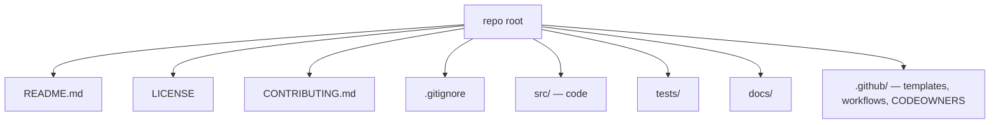
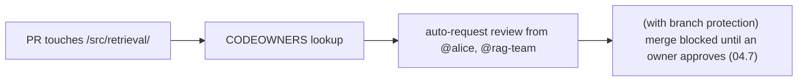

<!-- Module 04 · Lesson 8 — follows ../../../standards/. -->

# 04.8 · Repository Management

[⬅ 04.7 GitHub Collaboration](04.7-github-collaboration.md) · [🏠 Module](../README.md) · [🗺 Roadmap](../../../ROADMAP.md) · [Next ➡](04.9-large-files.md)

> A healthy repository is *self-explanatory and self-governing*: newcomers understand it in minutes, contributors know the rules, and the right people review the right code automatically. This lesson covers the files and conventions — README, CONTRIBUTING, CODEOWNERS, templates — that make a repo professional.

| | |
|---|---|
| **Module** | `04 · Advanced Git & Collaboration` |
| **Lesson** | `04.8` |
| **Difficulty** | ⭐⭐ |
| **Estimated study time** | 45 min read |
| **Status** | 🟢 stable |

---

## 1. Learning Objectives

By the end of this lesson you will be able to:

- [ ] Structure a repository so it's navigable and professional.
- [ ] Write an effective **README** and **CONTRIBUTING** guide.
- [ ] Use **CODEOWNERS** to route reviews automatically.
- [ ] Set up **issue** and **pull-request templates**.
- [ ] Maintain a healthy open-source repository.

## 2. Prerequisites

- [04.7 GitHub Collaboration](04.7-github-collaboration.md) (PRs/reviews) and [Module 00.6](../../00-Orientation/weeks/00.6-github-repository-workflow.md)/[Module 03.5](../../03-Linux/weeks/03.5-essential-commands.md) (structure).

---

## 3. Why This Topic Exists

A repository is not just code — it's a *project that people join, use, and contribute to*. The difference between a repo people can use and one they abandon is often not the code quality but the **documentation and conventions**: a clear README, a contribution guide, and templates that make participating obvious. This is doubly true for AI projects, which mix code, notebooks, models, and configs that newcomers won't understand without guidance.

You've already lived this — this entire handbook is a carefully-managed repository ([REPOSITORY_STRUCTURE.md](../../../REPOSITORY_STRUCTURE.md), [CONTRIBUTING.md](../../../CONTRIBUTING.md)). This lesson makes those practices explicit.

> [!IMPORTANT]
> **A repository's non-code files are its user interface.** The README is the front door; CONTRIBUTING is the house rules; templates are the forms that keep contributions consistent; CODEOWNERS routes reviews. Together they make a repo *self-explanatory and self-governing* — people can understand, use, and contribute without asking a maintainer basic questions. Investing here scales your project far more than one more feature.

## 4. Repository Structure

Recall from [Module 03.5](../../03-Linux/weeks/03.5-essential-commands.md)/[REPOSITORY_STRUCTURE.md](../../../REPOSITORY_STRUCTURE.md): a repo should be **navigable in 60 seconds**. A conventional layout signals professionalism and helps everyone (including future-you) find things.



| Item | Purpose |
|---|---|
| `README.md` | What it is, how to use it, how it's organized |
| `LICENSE` | Legal terms (essential for open source) |
| `CONTRIBUTING.md` | How to contribute (setup, standards, workflow) |
| `.gitignore` | What not to track ([04.9](04.9-large-files.md)) |
| `.github/` | PR/issue templates, CODEOWNERS, GitHub Actions ([04.11](04.11-github-actions.md)) |
| `src/`, `tests/`, `docs/` | Standard code/test/doc separation ([Module 01.13](../../01-Advanced-Python/weeks/01.13-packaging-code-quality.md)) |

---

## 5. The README — The Front Door

The README is the *most-read file* in any repo — often the *only* file people read before deciding to use or contribute. It must answer, fast: **what is this, why should I care, and how do I start?**

| A great README has | Example |
|---|---|
| **A one-line description** | "A production RAG system for document Q&A" |
| **What & why** | The problem it solves |
| **Quickstart** | Install + run in a few commands ([Module 01.13](../../01-Advanced-Python/weeks/01.13-packaging-code-quality.md)) |
| **Usage examples** | Minimal working example |
| **Structure overview** | Where things live |
| **Links** | Docs, contributing, license |
| **Badges** (optional) | CI status, version, coverage |

> [!IMPORTANT]
> **Optimize the README for a first-time visitor who has 60 seconds.** They should immediately grasp what the project does and how to try it. Put the quickstart *near the top* — nothing frustrates a potential user more than scrolling past paragraphs to find "how do I run this?" For AI projects, be explicit about prerequisites (GPU? which model? API keys? [Module 03.13](../../03-Linux/weeks/03.13-package-environment.md)) since setup is often nontrivial. This handbook's [README.md](../../../README.md) and [documentation standards](../../../standards/documentation-philosophy.md) model this.

---

## 6. CONTRIBUTING.md — The House Rules

**CONTRIBUTING.md** tells contributors *how* to participate: how to set up, the coding standards, the branch/PR workflow ([04.7](04.7-github-collaboration.md)), and how to run tests. It prevents the same questions being asked repeatedly and keeps contributions consistent.

| CONTRIBUTING covers | Why |
|---|---|
| Dev environment setup | Get contributors running fast ([Module 01.13](../../01-Advanced-Python/weeks/01.13-packaging-code-quality.md)) |
| Coding standards / formatting | Consistency ([04.10](04.10-automation.md) automates it) |
| Branch & commit conventions | Aligned with the team's strategy ([04.3](04.3-branching-strategies.md)) |
| PR process & review expectations | Smooth collaboration ([04.7](04.7-github-collaboration.md)) |
| How to run tests | So contributions come tested ([Module 01.10](../../01-Advanced-Python/weeks/01.10-testing.md)) |
| Code of conduct (link) | A welcoming community |

> [!TIP]
> A good CONTRIBUTING guide is the difference between a contributor's PR "just working" and them getting frustrated and leaving. This handbook's [CONTRIBUTING.md](../../../CONTRIBUTING.md) is a living example: it defines voice, structure, naming, and the authoring workflow. For a team repo, it also encodes your branching strategy ([04.3](04.3-branching-strategies.md)) and CI expectations ([04.11](04.11-github-actions.md)) so everyone works the same way.

---

## 7. CODEOWNERS — Automatic Review Routing

A **CODEOWNERS** file (in `.github/`) maps files/directories to the people or teams responsible for them. GitHub then **automatically requests review** from the right owners when a PR touches their code.

```text
# .github/CODEOWNERS — path → required reviewer(s)
*                       @team-leads          # default owner for everything
/src/retrieval/         @alice @rag-team      # retrieval code
/src/serving/           @bob                  # serving code
*.md                    @docs-team            # documentation
/infra/                 @platform-team        # deployment/infra
```



> [!IMPORTANT]
> **CODEOWNERS + protected branches = the right people review the right code, automatically** ([04.7](04.7-github-collaboration.md)). Without it, PRs sit unreviewed or get reviewed by whoever's around (missing domain expertise). With it, a change to the retrieval code *must* be approved by the retrieval owners before merging. This scales review quality on large teams/codebases — a change can't slip into a subsystem without its expert seeing it. Essential for any repo with distinct areas of ownership.

---

## 8. Issue & PR Templates

**Templates** standardize the information people provide, so issues are actionable and PRs are reviewable.

| Template | Ensures |
|---|---|
| **Issue template** (bug) | Repro steps, expected vs actual, environment |
| **Issue template** (feature) | Problem, proposed solution, alternatives |
| **PR template** | What/why, testing done, checklist ([04.7](04.7-github-collaboration.md)) |

```text
# .github/pull_request_template.md
## What & why
<what this changes and why>
## How to test
<steps>
## Checklist
- [ ] Tests pass (CI)
- [ ] Docs updated
- [ ] No secrets committed
```

> [!TIP]
> A **PR template with a checklist** nudges every contributor toward good practice — "tests pass, docs updated, no secrets" — without a maintainer having to remind them each time ([04.7](04.7-github-collaboration.md)). **Issue templates** turn vague "it's broken" reports into actionable ones with repro steps and environment info. These small files dramatically improve the *quality* of contributions and reports at scale. GitHub also supports issue *forms* (structured fields) for even more consistency.

---

## 9. Other Health Signals

| File / feature | Purpose |
|---|---|
| `LICENSE` | Legal permission to use the code (no license = all rights reserved!) |
| `CHANGELOG.md` | History of changes per release ([04.6](04.6-tags-releases.md)/[Module 00.6](../../00-Orientation/weeks/00.6-github-repository-workflow.md)) |
| `CODE_OF_CONDUCT.md` | Community behavior standards |
| `SECURITY.md` | How to report vulnerabilities responsibly |
| `.github/dependabot.yml` | Automated dependency updates (security) |
| Good `.gitignore` | Keeps junk/secrets/large files out ([04.9](04.9-large-files.md)) |

> [!NOTE]
> For **open-source** specifically, a `LICENSE` is non-negotiable — without one, others legally *cannot* use your code, no matter how public. A `SECURITY.md` gives researchers a responsible way to report vulnerabilities. GitHub even shows a "community profile" score based on the presence of these files — a quick health check for any repo you're evaluating ([Module 01.14](../../01-Advanced-Python/weeks/01.14-reading-open-source.md)).

---

## 10. Common Mistakes & Best Practices

| Mistake | Better |
|---|---|
| No/poor README | Clear README with quickstart on top |
| No CONTRIBUTING | Document setup, standards, workflow |
| No CODEOWNERS on a big repo | Route reviews to domain experts |
| No templates | Standardize issues/PRs |
| No LICENSE (open source) | Add one — legally required for reuse |
| Unmaintained CHANGELOG | Keep it in sync with releases |
| Junk/secrets/big files committed | Strong `.gitignore` ([04.9](04.9-large-files.md)) |

- ✅ Treat non-code files as first-class ([documentation standards](../../../standards/documentation-philosophy.md)).
- ✅ Automate what you can (templates, Dependabot, CI [04.11](04.11-github-actions.md)).
- ✅ Keep the README's quickstart current — it's the first thing that breaks and the first thing people try.

## 11. Performance / Operational Considerations

These files have no runtime cost; their "performance" is *contributor throughput and onboarding speed*. A well-managed repo onboards a new engineer in an hour instead of a week — a massive, recurring productivity return.

## 12. Security Considerations

| Risk | Guidance |
|---|---|
| No `SECURITY.md` | Add one so vulns are reported responsibly, not publicly |
| Missing CODEOWNERS on sensitive code | Require expert review on security-critical paths |
| Committed secrets/config | `.gitignore` + scanning ([04.9](04.9-large-files.md)/[04.10](04.10-automation.md)) |
| Stale dependencies | Dependabot / automated updates ([Module 01.13](../../01-Advanced-Python/weeks/01.13-packaging-code-quality.md)) |
| Missing LICENSE | Legal risk (undefined usage rights) |

## 13. Interview Questions

**Beginner**
1. What should a good README contain, and what goes first?
2. What is CONTRIBUTING.md for?

**Intermediate**
1. What does CODEOWNERS do, and how does it combine with protected branches?
2. Why do issue/PR templates matter on a team?

**Advanced**
1. How would you set up a healthy open-source AI repo from scratch (files + conventions)?
2. Which repo files are security-relevant, and why?

**System-design prompt**
- Design the repository management for a growing open-source AI project. — *Follow-ups:* What files/conventions? How do you route reviews (CODEOWNERS)? How do templates + CI keep contributions high-quality? What signals a healthy repo?

## 14. Summary

| Key idea | Takeaway |
|---|---|
| Non-code files = the UI | README, CONTRIBUTING, templates, CODEOWNERS |
| README | Front door — quickstart on top, for a 60-second visitor |
| CONTRIBUTING | House rules — setup, standards, workflow |
| CODEOWNERS | Auto-route reviews to domain experts |
| Templates | Standardize issues/PRs → higher-quality contributions |
| Health files | LICENSE, CHANGELOG, SECURITY, Dependabot |

## 15. Cheat Sheet

```text
NON-CODE FILES = the repo's UI (self-explanatory + self-governing)
README (most-read; quickstart ON TOP): what/why · install+run · usage · structure · links · (AI: GPU/model/keys prereqs)
CONTRIBUTING.md: dev setup · coding standards/format · branch+PR workflow(04.3/04.7) · how to run tests · code of conduct
CODEOWNERS (.github/): path → owner(s) → auto-requests their review; + protected branches = must-approve (04.7)
  e.g.  /src/retrieval/  @rag-team   ·   *.md  @docs-team
TEMPLATES (.github/): pull_request_template.md (what/why/test/checklist) · ISSUE_TEMPLATE/ (bug: repro/expected/env)
HEALTH: LICENSE (REQUIRED for OSS reuse!) · CHANGELOG.md(04.6) · SECURITY.md · CODE_OF_CONDUCT.md · dependabot · strong .gitignore(04.9)
STRUCTURE: README/LICENSE/CONTRIBUTING/.gitignore + src/ tests/ docs/ .github/ (navigable in 60s)
```

## 16. Flashcards

- **Q:** What should go near the top of a README? — **A:** The quickstart (install + run) — optimize for a first-time visitor with 60 seconds who wants to know what it is and how to try it.
- **Q:** What does CODEOWNERS do? — **A:** Maps files/paths to responsible owners so GitHub auto-requests their review; with protected branches, their approval becomes required before merge.
- **Q:** What is CONTRIBUTING.md for? — **A:** Telling contributors how to participate — dev setup, coding standards, branch/PR workflow, and how to run tests — so contributions are consistent and questions aren't repeated.
- **Q:** Why do PR/issue templates matter? — **A:** They standardize the information provided (checklists, repro steps), improving the quality of contributions and bug reports at scale without maintainer reminders.
- **Q:** Why is a LICENSE essential for open source? — **A:** Without a license, others legally cannot use/modify/redistribute the code (all rights reserved by default), no matter how public it is.
- **Q:** Which repo files are security-relevant? — **A:** `SECURITY.md` (responsible disclosure), CODEOWNERS (expert review of sensitive code), `.gitignore` (no secrets), Dependabot (dependency updates).

## 17. Hands-on Exercises

> Full set in [`../exercises/`](../exercises/).

- [ ] **(⭐ README)** Write a README for a sample AI project with quickstart-on-top, prerequisites, and usage.
- [ ] **(⭐⭐ CONTRIBUTING)** Draft a CONTRIBUTING.md covering setup, standards, branch/PR workflow, and testing.
- [ ] **(⭐⭐ CODEOWNERS)** Write a CODEOWNERS mapping directories to owners; explain what reviews it would trigger.
- [ ] **(⭐⭐ Templates)** Create a PR template (with a checklist) and a bug-report issue template.
- [ ] **(⭐⭐⭐ Audit)** Evaluate a real open-source repo's "community profile" (README/LICENSE/CONTRIBUTING/templates); note what's missing.

## 18. Mini Project

> **Set up a professional open-source repository (this module's showcase, v3 — completes [04.7](04.7-github-collaboration.md)).** Build a fully-managed repo: strong README (quickstart on top), CONTRIBUTING, LICENSE, CODEOWNERS, PR + issue templates, `.gitignore` ([04.9](04.9-large-files.md)), CHANGELOG ([04.6](04.6-tags-releases.md)), SECURITY.md, protected `main` ([04.7](04.7-github-collaboration.md)), and CI ([04.11](04.11-github-actions.md)). Include a diagram of the structure. Deliverable: a template repo you can clone for every future project — genuinely reusable and portfolio-worthy.

## 19. References

- GitHub docs — "Setting up your project for healthy contributions", CODEOWNERS, templates ([reference standards](../../../standards/reference-standards.md)).
- opensource.guide (GitHub) — running an open-source project.
- This handbook's [CONTRIBUTING.md](../../../CONTRIBUTING.md) / [REPOSITORY_STRUCTURE.md](../../../REPOSITORY_STRUCTURE.md) as living examples.

## 20. What's Next

Your repo is well-managed — but AI projects have a special problem: **large files**. Next: Git LFS, handling datasets and models, and `.gitignore` best practices, so you don't bloat your repo with gigabytes.

➡️ **Next:** [04.9 · Large Files: Git LFS](04.9-large-files.md)

---

### 🔁 Revision checklist
- [ ] I can write a README with quickstart-on-top
- [ ] I know what CONTRIBUTING, CODEOWNERS, and templates do
- [ ] I understand CODEOWNERS + protected branches for review routing
- [ ] I can list the files that signal a healthy repo

### 🔗 Spaced-repetition callback
> Recall [04.7's protected branches](04.7-github-collaboration.md) and [Module 01.14's "read a repo's health"](../../01-Advanced-Python/weeks/01.14-reading-open-source.md): CODEOWNERS makes review routing automatic, and the health files (README/LICENSE/tests) are exactly what you *evaluated* when assessing a dependency. Managing a repo well is the flip side of reading one well.
