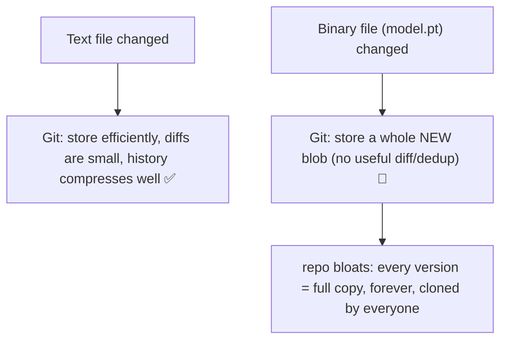
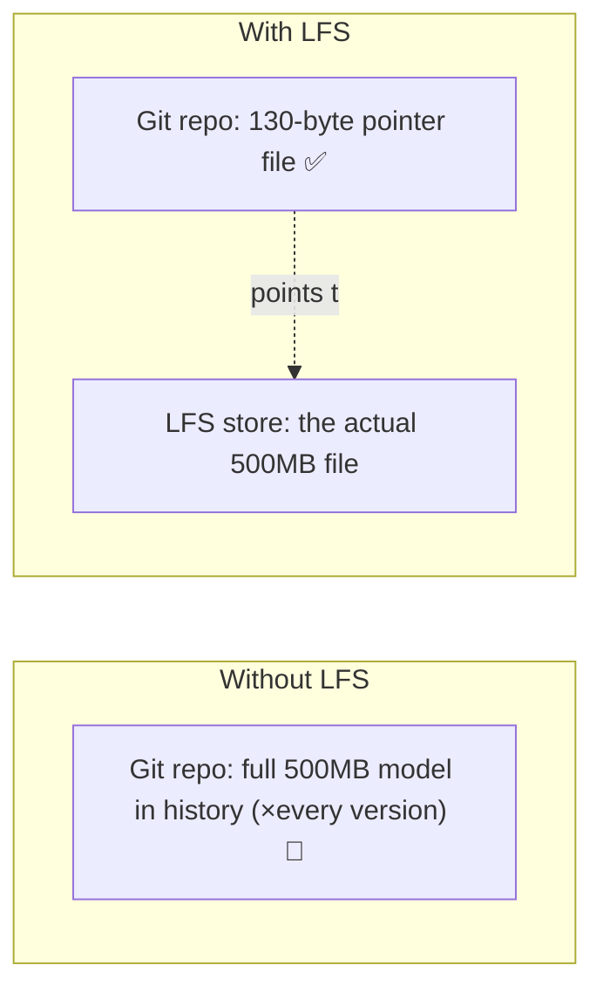
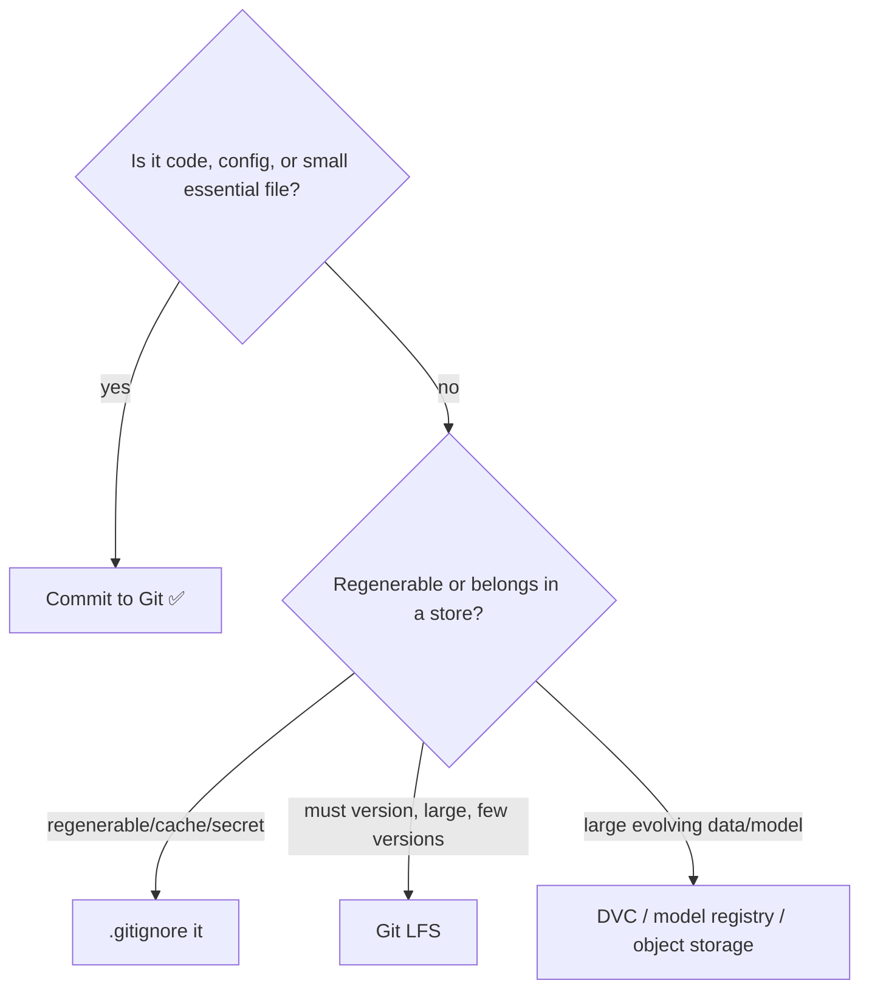

<!-- Module 04 · Lesson 9 — follows ../../../standards/. -->

# 04.9 · Large Files: Git LFS

[⬅ 04.8 Repository Management](04.8-repository-management.md) · [🏠 Module](../README.md) · [🗺 Roadmap](../../../ROADMAP.md) · [Next ➡](04.10-automation.md)

> Git was built for *text*, and it stores every version of every file forever ([04.1](04.1-git-internals.md)) — which is catastrophic for the gigabyte datasets, models, and checkpoints that fill AI projects. This lesson covers Git LFS, `.gitignore` discipline, and *what to version and what not to*, so your AI repo stays fast instead of bloating to hundreds of gigabytes.

| | |
|---|---|
| **Module** | `04 · Advanced Git & Collaboration` |
| **Lesson** | `04.9` |
| **Difficulty** | ⭐⭐⭐ |
| **Estimated study time** | 45 min read |
| **Status** | 🟢 stable |

---

## 1. Learning Objectives

By the end of this lesson you will be able to:

- [ ] Explain *why* Git handles large binary files poorly.
- [ ] Use **Git LFS** to version large files without bloating the repo.
- [ ] Decide **what to commit, what to LFS, and what to ignore** in AI projects.
- [ ] Write effective **`.gitignore`** files.
- [ ] Reason about storage/versioning tradeoffs for datasets and models.

## 2. Prerequisites

- [04.1 Git Internals](04.1-git-internals.md) (blobs stored forever) and [Module 02.10 File Systems](../../02-Computer-Science/weeks/02.10-file-systems.md) (binary vs text, storage).

---

## 3. Why This Topic Exists

AI projects are full of large binary files: multi-gigabyte datasets, trained model checkpoints, images, embeddings. Committing these directly to Git is a disaster — because of Git's object model ([04.1](04.1-git-internals.md)), *every version of every file is stored forever*, so a repo with a few model checkpoints quickly balloons to tens or hundreds of gigabytes that everyone must download on clone, forever. This is one of the most common ways AI teams wreck their repos.

The solution is a mix of tools and discipline: **don't version what you don't need to** (`.gitignore`), **use Git LFS** for large files you *do* need to track, and use dedicated tools (registries, DVC) for models/data. This lesson gives you that discipline.

> [!IMPORTANT]
> **Git stores every version of every file forever, and binary files don't deduplicate** ([04.1](04.1-git-internals.md)). Commit a 500 MB model, tweak it, commit again — now the repo has 1 GB (two full blobs, not a diff). Do this weekly and your repo is unusable within months, and *you can't easily remove the history* (it requires rewriting history + everyone re-cloning, [04.12](04.12-debugging-git.md)). **The cardinal rule of AI Git: think carefully before committing any large binary — prevention is vastly easier than cleanup.**

## 4. Why Git Struggles with Large Binaries



| Problem | Consequence |
|---|---|
| Every version stored as a full blob | Repo size explodes ([04.1](04.1-git-internals.md)) |
| No useful binary diffs | Can't compress across versions |
| History is permanent | Old huge files bloat clones forever |
| Everyone clones everything | Slow clones; wasted bandwidth/disk |
| Removal requires history rewrite | Painful, coordinated cleanup ([04.12](04.12-debugging-git.md)) |

---

## 5. Git LFS — Large File Storage

**Git LFS (Large File Storage)** solves this: instead of storing the large file *in* Git, it stores a tiny **text pointer** in Git and keeps the actual file in a separate LFS store, downloaded on demand.



```bash
git lfs install                       # one-time setup
git lfs track "*.safetensors"         # track a file type via LFS (writes to .gitattributes)
git lfs track "*.pt" "*.bin"          # models
git add .gitattributes                # commit the tracking config
git add model.safetensors             # now stored via LFS (Git sees a pointer)
git commit -m "add model"
git push                              # pushes the pointer to Git + file to LFS store
```

| Concept | Meaning |
|---|---|
| **Pointer file** | A ~130-byte text file in Git referencing the real content by hash |
| **`.gitattributes`** | Config declaring which paths use LFS |
| **LFS store** | Separate storage (GitHub LFS, S3, etc.) for the actual bytes |
| **On-demand fetch** | LFS files download when checked out (not on every clone by default) |

> [!IMPORTANT]
> **Git LFS keeps your *repo* small by replacing large files with tiny pointers**, while still version-controlling them. The Git history stays lean (pointers, not gigabytes); the actual files live in a dedicated store and download only when needed. **Caveats:** LFS storage/bandwidth often costs money (GitHub charges beyond a quota), and everyone needs `git lfs install`. LFS is best for large files you *must* version alongside code (e.g., a small essential model, test fixtures). For *large, evolving* datasets and models, dedicated tools (**DVC**, model registries) are often better — see §7.

---

## 6. `.gitignore` — Don't Version What You Don't Need

The first line of defense is *not tracking* generated, large, or secret files at all. **`.gitignore`** lists patterns Git should ignore ([Module 01.13](../../01-Advanced-Python/weeks/01.13-packaging-code-quality.md) / this handbook's [.gitignore](../../../.gitignore)).

```gitignore
# Data & models (usually NOT in Git — too large / regenerable)
data/
*.csv
*.parquet
*.pt
*.safetensors
*.ckpt
checkpoints/
wandb/
mlruns/

# Python artifacts
__pycache__/
*.pyc
.venv/

# Secrets (NEVER commit!)
.env
*.key
*.pem

# Notebooks' noisy outputs (or clear them — 04.5)
# (handled via nbstripout/pre-commit, 04.10)

# OS / editor junk
.DS_Store
.ipynb_checkpoints/
```

> [!IMPORTANT]
> **`.gitignore` is your primary tool for keeping AI repos clean** ([Module 01.13](../../01-Advanced-Python/weeks/01.13-packaging-code-quality.md)). The default stance for AI projects: **ignore data, models, checkpoints, caches, and secrets** — commit code, configs, and small essential files. Most large files in an AI project are *regenerable* (you can retrain/redownload) or belong in dedicated stores, so they don't need to be in Git at all. **Critical:** always ignore secrets (`.env`, keys) — a `.gitignore` entry prevents the catastrophic "committed an API key" ([04.1](04.1-git-internals.md) — it persists forever!). Add `.gitignore` *before* your first commit so junk never enters history.

> [!WARNING]
> `.gitignore` only ignores files that **aren't already tracked**. If you already committed `model.pt`, adding it to `.gitignore` does *not* remove it — you must `git rm --cached model.pt` (untrack but keep locally) and commit. And it's still in history ([04.1](04.1-git-internals.md)/[04.12](04.12-debugging-git.md)). Ignore *before* committing.

---

## 7. What to Version, LFS, or Store Elsewhere

The decision that keeps AI repos healthy:



| Artifact | Recommendation |
|---|---|
| Source code, configs (`.py`, `.yaml`) | **Git** (text, diffs well) |
| Small essential files (a small tokenizer, test fixtures) | **Git** or **LFS** |
| Large model checkpoints | **LFS**, **model registry**, or object storage ([Module 16](../../16-MLOps/README.md)) |
| Datasets | **DVC** / object storage ([Module 02.10](../../02-Computer-Science/weeks/02.10-file-systems.md)); `.gitignore` from Git |
| Caches, logs, `.venv`, `wandb/` | **`.gitignore`** (regenerable) |
| Secrets (`.env`, keys) | **`.gitignore`** — never version |
| Notebooks (`.ipynb`) | Git, but **strip outputs** ([04.5](04.5-merge-conflicts.md)/[04.10](04.10-automation.md)) |

> [!IMPORTANT]
> **The professional AI-repo pattern: code + configs in Git; models/data referenced by version but stored elsewhere.** Tools like **DVC** (Data Version Control) put a small pointer in Git and the actual data in object storage ([Module 02.10](../../02-Computer-Science/weeks/02.10-file-systems.md)) — like LFS but designed for ML data pipelines, integrating with model/data versioning ([04.6](04.6-tags-releases.md)). This keeps Git fast while making experiments reproducible (code version → data version → model version, [Module 00.5](../../00-Orientation/weeks/00.5-development-environment.md)). You'll build full ML versioning in [Module 16 · MLOps](../../16-MLOps/README.md); the Git-side discipline is: *keep big binaries out of Git's history*.

---

## 8. Common Mistakes & Recovery

| Mistake | Consequence | Recovery |
|---|---|---|
| Committed a huge model directly | Repo bloat forever | `git rm --cached` + rewrite history ([04.12](04.12-debugging-git.md)); use LFS/DVC going forward |
| `.gitignore` added *after* tracking | File still tracked | `git rm --cached <file>` + commit |
| Committed a secret | Leaked forever ([04.1](04.1-git-internals.md)) | Rotate the secret; `git filter-repo` to purge ([04.12](04.12-debugging-git.md)) |
| LFS not installed by a teammate | They get pointer files, not content | `git lfs install`, `git lfs pull` |
| Notebook outputs bloating history | Huge diffs, conflicts | Strip outputs (`nbstripout`, [04.10](04.10-automation.md)) |
| Versioning regenerable data | Wasted space | `.gitignore` it |

## 9. Best Practices

- ✅ Add a **thorough `.gitignore` before the first commit** (data, models, caches, secrets).
- ✅ Use **LFS** only for large files you truly must version; prefer **DVC/registries** for evolving data/models.
- ✅ **Strip notebook outputs** before committing ([04.5](04.5-merge-conflicts.md)/[04.10](04.10-automation.md)).
- ✅ Think "regenerable?" — if yes, don't commit it.
- ✅ Scan for accidentally-committed large files (`git rev-list --objects --all | ...`) and secrets ([04.10](04.10-automation.md)).
- ❌ Never `git add .` blindly in an AI repo — you'll sweep in caches/data.

## 10. Performance / Storage Considerations

| Principle | Takeaway |
|---|---|
| Small repo = fast clone/fetch | Keep binaries out of history |
| LFS costs money/bandwidth | Use it deliberately, not for everything |
| Object storage for big data | Cheaper, scalable ([Module 02.10](../../02-Computer-Science/weeks/02.10-file-systems.md)/[Module 17](../../17-Cloud/README.md)) |
| History bloat is permanent | Prevention >> cleanup ([04.12](04.12-debugging-git.md)) |

## 11. Security Considerations

| Risk | Guidance |
|---|---|
| Secrets committed | `.gitignore` `.env`/keys; scan; rotate if leaked ([04.1](04.1-git-internals.md)/[04.10](04.10-automation.md)) |
| Sensitive data in datasets | Don't commit PII-laden data to shared repos |
| LFS store access control | Secure the LFS/object-storage backend ([Module 03.15](../../03-Linux/weeks/03.15-security.md)) |
| Model files as attack vectors | Untrusted model files can execute code ([Module 02.9](../../02-Computer-Science/weeks/02.9-serialization.md)) |

> [!CAUTION]
> The most common (and severe) large-file mistake is **committing a secret** — and it's the same object-model problem ([04.1](04.1-git-internals.md)): once committed, the secret's blob is in history *forever*, even after "deletion." The fix chain: `.gitignore` secrets *before* committing (prevention), scan in pre-commit ([04.10](04.10-automation.md)), and if one slips through, **rotate the credential immediately** and rewrite history ([04.12](04.12-debugging-git.md)). Never rely on "I'll delete it in the next commit" — that doesn't work.

## 12. Interview Questions

**Beginner**
1. Why is committing large binary files to Git problematic?
2. What does `.gitignore` do, and what should an AI repo ignore?

**Intermediate**
1. How does Git LFS work? What's the tradeoff?
2. What should be in Git vs LFS vs an external store vs ignored?

**Advanced**
1. You already committed a 2 GB model months ago. How do you fix the repo bloat?
2. How do you version code, data, and models together for reproducibility (Git + DVC/LFS)?

**System-design prompt**
- Design version control for an AI project with code, 50 GB of datasets, and 5 GB model checkpoints. — *Follow-ups:* What's in Git, LFS, DVC, or object storage? How do you keep clones fast? How do you tie versions together ([04.6](04.6-tags-releases.md))?

## 13. Summary

| Key idea | Takeaway |
|---|---|
| Git stores binaries forever | Every version = full blob; repo bloats |
| Git LFS | Store a pointer in Git, the file in a separate store |
| `.gitignore` first | Ignore data/models/caches/secrets before first commit |
| Regenerable? | If yes, don't commit it |
| DVC/registries | Better for large evolving data/models |
| Secrets | Never commit — they persist forever; rotate if leaked |

## 14. Cheat Sheet

```text
PROBLEM: Git stores EVERY version of EVERY file forever; binaries don't dedup → repo bloats catastrophically (04.1)
GIT LFS: git lfs install → git lfs track "*.safetensors" → commit .gitattributes → add file (stored as ~130B POINTER)
  actual file → separate LFS store, downloaded on demand · ⚠️ costs $/bandwidth; teammates need git lfs install
.gitignore (add BEFORE first commit!): data/ *.csv *.parquet *.pt *.safetensors checkpoints/ wandb/ mlruns/
  __pycache__/ .venv/ · .env *.key *.pem (SECRETS — never commit!) · .ipynb_checkpoints/ .DS_Store
  ⚠️ .gitignore only ignores UNTRACKED files → already committed? git rm --cached <file>
WHAT GOES WHERE: code/config → Git · small essential → Git/LFS · big models → LFS/registry · datasets → DVC/object storage · caches/secrets → IGNORE
DECIDE: regenerable? → ignore it. must version + large? → LFS. large + evolving data? → DVC/registry.
NOTEBOOKS: strip outputs before commit (nbstripout/pre-commit 04.10)
SECRET COMMITTED = forever (04.1) → rotate immediately + rewrite history (04.12). NEVER git add . blindly.
```

## 15. Flashcards

- **Q:** Why is committing large binaries to Git bad? — **A:** Git stores every version as a full blob forever (binaries don't diff/dedup), so the repo bloats permanently and everyone must download the history on clone.
- **Q:** How does Git LFS work? — **A:** It stores a tiny (~130-byte) text pointer in Git and keeps the actual large file in a separate LFS store, downloaded on demand — keeping the repo small.
- **Q:** What should an AI repo's `.gitignore` include? — **A:** Data, models/checkpoints, caches (`wandb/`, `mlruns/`, `.venv/`, `__pycache__/`), and secrets (`.env`, keys) — commit code and configs.
- **Q:** You added a file to `.gitignore` but it's still tracked — why? — **A:** `.gitignore` only ignores untracked files; already-committed files need `git rm --cached` to untrack (and it remains in history).
- **Q:** LFS vs DVC for AI data? — **A:** LFS for large files you must version alongside code; DVC (or a model registry) for large, evolving datasets/models — it stores a pointer in Git and data in object storage, integrating with ML versioning.
- **Q:** What to do if you committed a secret? — **A:** Rotate the credential immediately (it's in history forever) and rewrite history to purge it; prevent with `.gitignore` + pre-commit scanning.

## 16. Hands-on Exercises

> Full set in [`../exercises/`](../exercises/).

- [ ] **(⭐ Ignore)** Write a thorough `.gitignore` for an AI project; verify it ignores data/models/caches/secrets.
- [ ] **(⭐⭐ Untrack)** Commit a file, add it to `.gitignore`, observe it's still tracked, then `git rm --cached` it.
- [ ] **(⭐⭐ LFS)** Set up Git LFS, track a large file type, commit a large file, and inspect the pointer file Git stores.
- [ ] **(⭐⭐ Decide)** For 8 AI artifacts (code, config, 10 GB dataset, model, `.env`, cache, notebook, test fixture), decide Git/LFS/DVC/ignore.
- [ ] **(⭐⭐⭐ Bloat)** On a practice repo, commit a large binary a few times; measure repo growth with `du -sh .git` ([Module 03.10](../../03-Linux/weeks/03.10-storage.md)); demonstrate the problem.

## 17. Mini Project

> **Manage an AI project with Git LFS (this module's showcase, v4).** Build a realistic AI repo: code + configs in Git, a small model tracked via **LFS**, large data referenced (DVC-style pointer or a documented external-store convention) and `.gitignore`-d from Git, notebooks with outputs stripped, and secrets ignored. Include a `.gitattributes` and a diagram showing what lives where. Deliverable: a template for structuring any AI project's version control without bloat. This is a daily-relevant, real skill.

## 18. References

- Git LFS documentation (git-lfs.com); *Pro Git* on `.gitignore` ([reference standards](../../../standards/reference-standards.md)).
- DVC (Data Version Control) docs (dvc.org); `nbstripout`/`jupytext`.
- GitHub's `gitignore` templates repo; [Module 16 · MLOps](../../16-MLOps/README.md).

## 19. What's Next

You keep your repo clean manually — now automate quality enforcement: **Git hooks and pre-commit** — running formatting, linting, tests, and secret-scanning automatically so bad code (and secrets) never even get committed.

➡️ **Next:** [04.10 · Automation with Git Hooks](04.10-automation.md)

---

### 🔁 Revision checklist
- [ ] I understand why Git bloats with large binaries
- [ ] I can set up Git LFS and read the pointer file
- [ ] I write thorough `.gitignore` files (before first commit)
- [ ] I know what to Git / LFS / DVC / ignore in AI projects

### 🔗 Spaced-repetition callback
> Recall [04.1's object model](04.1-git-internals.md) ("every file version is a blob forever") and [Module 02.10's binary-vs-text + object storage](../../02-Computer-Science/weeks/02.10-file-systems.md): this lesson is the direct consequence — Git's brilliant text history is terrible for binaries, so AI data lives in stores *referenced* by Git. And [Module 03.15's secrets warning](../../03-Linux/weeks/03.15-security.md) is why `.gitignore`-ing `.env` is non-negotiable.
