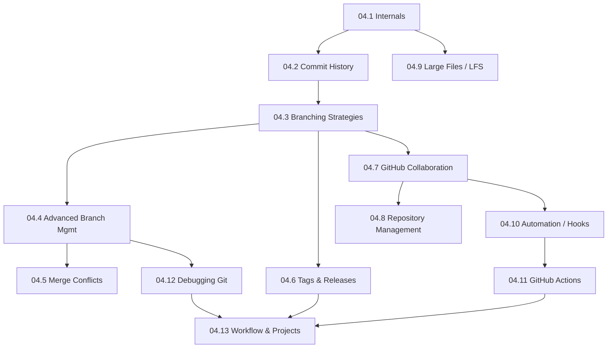

# Module 04 · Advanced Git & Collaboration — Lessons

[⬅ Module home](../README.md) · [🗺 Roadmap](../../../ROADMAP.md) · [📚 Curriculum](../../../CURRICULUM.md)

> This is the map of Module 04. You already know `add`/`commit`/`push`/`branch`/`merge` — this module makes you *fluent and fearless*: understanding Git's internals, recovering from any mistake, collaborating on large teams, managing releases, and handling AI projects full of code, notebooks, datasets, and models.

---

## Who this module is for

You know the Git basics ([Module 00.6](../../00-Orientation/weeks/00.6-github-repository-workflow.md) introduced the daily workflow). This module goes *deep*: the object model, interactive rebase, reflog recovery, branching strategies, PRs & reviews, Git LFS for models, hooks, and GitHub Actions CI — the version-control skills of a professional AI engineer on a real team.

> [!IMPORTANT]
> The two superpowers this module gives you: **(1) you'll never lose work again** — once you understand Git's object model and reflog, "I ruined my repo" becomes "I'll recover it in 30 seconds"; and **(2) you'll collaborate like a senior** — PRs, reviews, branching strategy, and CI are how real teams ship. These are daily, career-long skills that basic Git tutorials never teach.

---

## Lessons

| # | Lesson | Section |
|---|---|---|
| 04.1 | [Git Internals](04.1-git-internals.md) | §1 objects, blobs/trees/commits, refs, HEAD, reflog |
| 04.2 | [Commit History](04.2-commit-history.md) | §2 commit graph, parents, merges, detached HEAD, fast-forward |
| 04.3 | [Branching Strategies](04.3-branching-strategies.md) | §3 feature/Git Flow/GitHub Flow/trunk-based, release/hotfix |
| 04.4 | [Advanced Branch Management](04.4-advanced-branch-management.md) | §4 rebase, interactive rebase, cherry-pick, reset, revert, reflog |
| 04.5 | [Merge Conflict Resolution](04.5-merge-conflicts.md) | §5 why conflicts happen, markers, resolving, prevention |
| 04.6 | [Tags & Releases](04.6-tags-releases.md) | §6 lightweight/annotated tags, SemVer, GitHub Releases |
| 04.7 | [GitHub Collaboration](04.7-github-collaboration.md) | §7 PRs, reviews, protected branches, merge strategies, draft PRs |
| 04.8 | [Repository Management](04.8-repository-management.md) | §8 structure, README, CONTRIBUTING, CODEOWNERS, templates |
| 04.9 | [Large Files: Git LFS](04.9-large-files.md) | §9 Git LFS, datasets, models, `.gitignore` best practices |
| 04.10 | [Automation with Git Hooks](04.10-automation.md) | §10 hooks, pre-commit, message linting, formatting, testing |
| 04.11 | [GitHub Actions](04.11-github-actions.md) | §11 workflows, triggers, jobs, runners, secrets, caching, matrix |
| 04.12 | [Debugging Git](04.12-debugging-git.md) | §12 lost commits, wrong branch, bad force-push, recovery |
| 04.13 | [AI Project Workflow, Projects & Summary](04.13-workflow-projects-summary.md) | §13 full workflow + five projects + consolidation |

### Companion artifacts
- 🏋️ [Exercises](../exercises/) — branching, merge-conflict labs, rebase, recovery drills, CI
- 🧠 [Flashcards](../flashcards/deck.md) — spaced-repetition deck
- 📝 [Quiz](../quizzes/quiz-01.md) — self-assessment with answers
- 📄 [Cheat sheet](../cheat-sheets/git-cheatsheet.md) — one-page command & concept reference

---

## How the lessons connect

**Estimated time:** ~10 hours reading · ~4 hours projects · ~2 hours review (per the [Roadmap](../../../ROADMAP.md)).

> [!TIP]
> Git is learned by *breaking things safely*. Create a throwa(`git init /tmp/gitlab`) practice repo and try every dangerous command — `reset --hard`, `rebase`, force-push, delete branches — then recover them with reflog. You cannot learn Git recovery by reading; you learn it by breaking a *practice* repo (never a real one) and fixing it. Keep one open all module.
