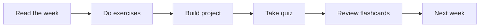

# Module 05 · SQL

[⬅ 04 · Git](../04-Git/README.md) · [🏠 docs](../README.md) · [🗺 Roadmap](../../ROADMAP.md) · [06 · Mathematics ➡](../06-Mathematics/README.md)

> Relational data modeling and querying for AI applications.

---

## Purpose

This module covers **SQL**. Relational data modeling and querying for AI applications. It fits into the overall program as described in the [Roadmap](../../ROADMAP.md) and [Curriculum](../../CURRICULUM.md).

## What you'll learn

- Relational modeling and normalization
- Querying: joins, aggregation, window functions
- Indexing and query optimization
- SQL in data and ML pipelines

## 📖 Lessons (start here)

> ✅ **This module's content is written.** Work through the lessons in order via the [lesson index](weeks/README.md). **Run a real PostgreSQL** and execute every query.

| # | Lesson |
|---|---|
| 05.1 | [Introduction to Databases](weeks/05.1-introduction.md) |
| 05.2 | [Relational Databases](weeks/05.2-relational-databases.md) |
| 05.3 | [SQL Fundamentals](weeks/05.3-sql-fundamentals.md) |
| 05.4 | [Advanced SQL](weeks/05.4-advanced-sql.md) |
| 05.5 | [Query Optimization](weeks/05.5-query-optimization.md) |
| 05.6 | [Transactions](weeks/05.6-transactions.md) |
| 05.7 | [NoSQL Databases](weeks/05.7-nosql.md) |
| 05.8 | [Data Modeling](weeks/05.8-data-modeling.md) |
| 05.9 | [Data Warehouses & Lakes](weeks/05.9-warehouses-lakes.md) |
| 05.10 | [ETL & ELT](weeks/05.10-etl-elt.md) |
| 05.11 | [Data Pipelines](weeks/05.11-data-pipelines.md) |
| 05.12 | [AI Data Workflows](weeks/05.12-ai-data-workflows.md) |
| 05.13 | [Database Security](weeks/05.13-database-security.md) |
| 05.14 | [Performance & Scaling](weeks/05.14-performance-scaling.md) |
| 05.15 | [Vector Database Preview](weeks/05.15-vector-databases.md) |
| 05.16 | [Projects & Summary](weeks/05.16-projects-summary.md) |

**Companion artifacts:** [Exercises](exercises/README.md) · [Quiz](quizzes/quiz-01.md) · [Flashcards](flashcards/deck.md) · [Cheat sheet](cheat-sheets/databases-cheatsheet.md)

## How this module is organized

Content is delivered week by week. Each module uses the same subfolders:

| Folder | Contents |
|---|---|
| [`weeks/`](weeks/) | Weekly lesson content, one file per week (`week-01.md`, `week-02.md`, …). |
| [`diagrams/`](diagrams/) | Mermaid sources and exported diagram assets for this module. |
| [`exercises/`](exercises/) | Hands-on practice problems with solutions. |
| [`projects/`](projects/) | Buildable projects that apply this module's skills. |
| [`quizzes/`](quizzes/) | Self-assessment question banks with answer keys. |
| [`flashcards/`](flashcards/) | Spaced-repetition Q/A decks for active recall. |
| [`cheat-sheets/`](cheat-sheets/) | One-page quick references for this module. |
| [`references/`](references/) | Paper summaries and deep-dive notes. |

## Suggested study flow

## File & naming conventions

| Item | Convention | Example |
|---|---|---|
| Weekly lesson | `week-NN.md` | `weeks/week-01.md` |
| Exercise | `exercise-NN.md` (+ `solution-NN.*`) | `exercises/exercise-01.md` |
| Project | `project-NN/` folder with `README.md` | `projects/project-01/` |
| Quiz | `quiz-NN.md` (+ `answers-NN.md`) | `quizzes/quiz-01.md` |
| Flashcards | `deck.md` | `flashcards/deck.md` |
| Diagram | `topic.mmd` / `topic.png` | `diagrams/attention.mmd` |

## Markdown conventions

This file follows the repository Markdown standards — see [CONTRIBUTING.md](../../CONTRIBUTING.md): one H1 per file, tables over prose, GitHub callouts (`> [!NOTE]`), fenced code blocks with a language, Mermaid for diagrams, and relative internal links.

## Related modules

- [Data Analysis](../07-Data-Analysis/README.md)
- [RAG](../13-RAG/README.md)

---

## Navigation

| Direction | Link |
|---|---|
| ⬆ Parent | [docs/](../README.md) |
| ⬅ Previous | [⬅ 04 · Git](../04-Git/README.md) |
| ➡ Next | [06 · Mathematics ➡](../06-Mathematics/README.md) |
| 🗺 Roadmap | [ROADMAP.md](../../ROADMAP.md) |
| 📚 Curriculum | [CURRICULUM.md](../../CURRICULUM.md) |
| 🏠 Repo root | [README.md](../../README.md) |
