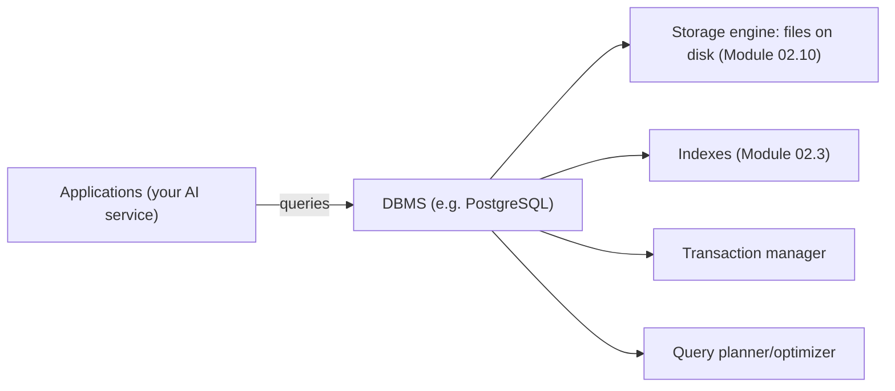
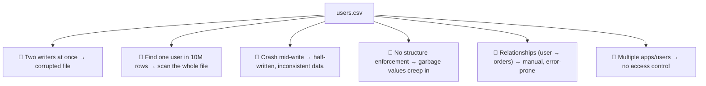
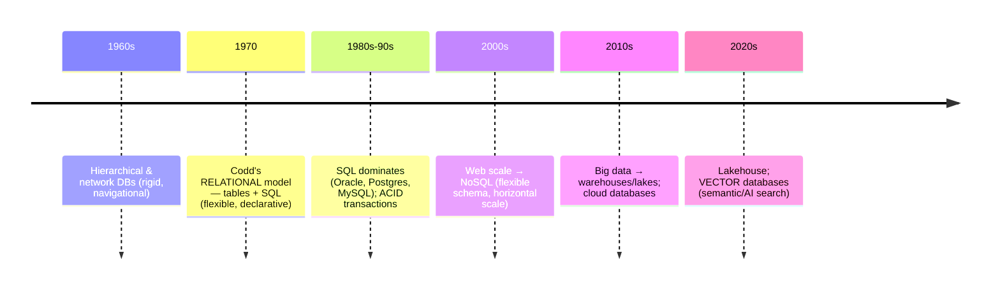
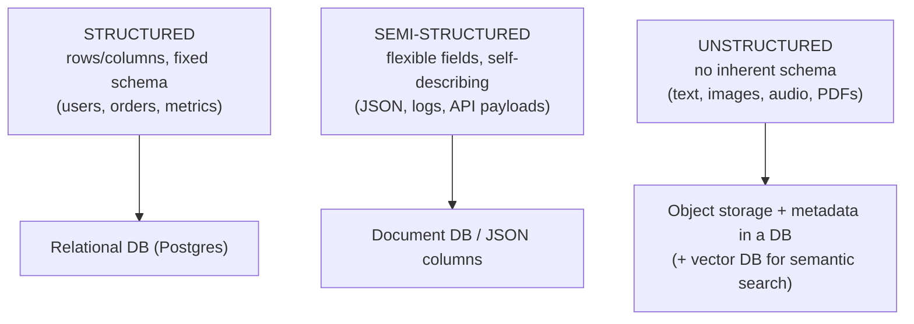
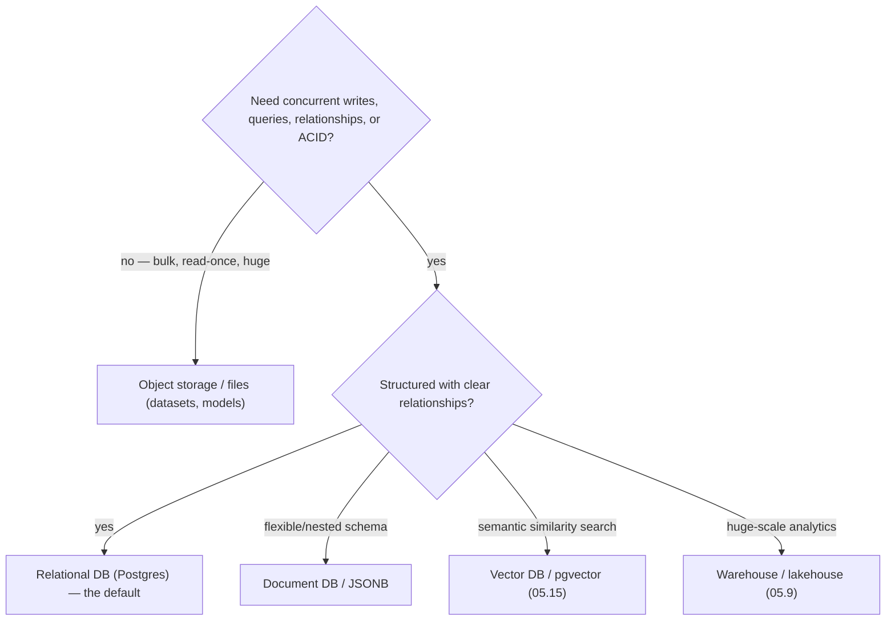

<!-- Module 05 · Lesson 1 — follows ../../../standards/. -->

# 05.1 · Introduction to Databases

[⬅ Module index](README.md) · [🏠 Module](../README.md) · [🗺 Roadmap](../../../ROADMAP.md) · [Next ➡](05.2-relational-databases.md)

> Why not just store everything in files? This lesson answers that from first principles — what a database actually *is*, the problems it solves that files can't, how databases evolved, and how structured vs unstructured data shapes every storage decision in an AI system.

| | |
|---|---|
| **Module** | `05 · Databases & Data Engineering` |
| **Lesson** | `05.1` |
| **Difficulty** | ⭐⭐ |
| **Estimated study time** | 45 min read |
| **Status** | 🟢 stable |

---

## 1. Learning Objectives

By the end of this lesson you will be able to:

- [ ] Define what a **database** and a **DBMS** are, from first principles.
- [ ] Explain the problems databases solve that **files cannot**.
- [ ] Trace the **evolution** of databases and why each generation appeared.
- [ ] Distinguish **structured, semi-structured,** and **unstructured** data.
- [ ] Decide, for AI data, what belongs in a database vs a file/object store.

## 2. Prerequisites

- [Module 02.10 File Systems](../../02-Computer-Science/weeks/02.10-file-systems.md) (how files are stored) and [Module 02.3 Data Structures](../../02-Computer-Science/weeks/02.3-data-structures.md) (indexes are these).

---

## 3. Why This Topic Exists

You already know how to store data in a file ([Module 02.10](../../02-Computer-Science/weeks/02.10-file-systems.md)). So why does a whole industry exist around databases? Because files break down the moment you have *many users*, *concurrent writes*, *queries over large data*, *relationships*, and *a need for correctness under failure*. A database is a system engineered to solve exactly those problems.

For AI Engineers this matters constantly: you must decide where user data, document metadata, evaluation results, and embeddings live — and picking wrong (a CSV where you needed Postgres, or Postgres where you needed object storage) causes pain that compounds for years.

> [!IMPORTANT]
> **A database is not "a place to put data" — it's a system that guarantees properties files can't**: concurrent access without corruption, fast queries over huge datasets, enforced structure and relationships, and durability under crashes. Every feature you'll study (indexes, transactions, query planners) exists to deliver one of those guarantees. Understanding *which guarantee you need* is how you choose the right storage.

## 4. What Is a Database?

| Term | Meaning |
|---|---|
| **Database** | An organized, persistent collection of data |
| **DBMS** (Database Management System) | The *software* that stores, retrieves, and manages that data (PostgreSQL, MongoDB) |
| **Query language** | How you ask for data (SQL) |
| **Schema** | The structure/rules the data must follow |



> [!NOTE]
> A DBMS is ultimately *a program that manages files on disk* ([Module 02.10](../../02-Computer-Science/weeks/02.10-file-systems.md)) — but with a query planner, indexes ([Module 02.3](../../02-Computer-Science/weeks/02.3-data-structures.md)), a transaction manager, and a concurrency system layered on top. Everything in this module is one of those layers. Databases aren't magic; they're carefully engineered applications of the CS you already know.

---

## 5. Files vs Databases — What Files Can't Do

Imagine storing your app's users in `users.csv`. It works for 10 users. Now scale it:



| Problem with files | How a database solves it |
|---|---|
| **Concurrency** — simultaneous writes corrupt data | Transactions + locking/MVCC ([05.6](05.6-transactions.md)) |
| **Slow search** — must scan everything (O(n), [Module 02.5](../../02-Computer-Science/weeks/02.5-complexity.md)) | **Indexes** → O(log n) lookups ([05.5](05.5-query-optimization.md)) |
| **Crash safety** — partial writes corrupt | **Durability/ACID** ([05.6](05.6-transactions.md)) |
| **No structure** — any garbage can be written | **Schema** + constraints ([05.2](05.2-relational-databases.md)) |
| **No relationships** | **Foreign keys** + JOINs ([05.2](05.2-relational-databases.md)/[05.3](05.3-sql-fundamentals.md)) |
| **Ad-hoc queries** — write code for each question | **SQL** — declarative querying ([05.3](05.3-sql-fundamentals.md)) |
| **No access control** | Users, roles, permissions ([05.13](05.13-database-security.md)) |

> [!IMPORTANT]
> The five properties a database gives you that a file doesn't: **(1) concurrency** (many readers/writers safely), **(2) speed at scale** (indexes, not full scans), **(3) durability** (survive crashes), **(4) structure** (schema enforcement), and **(5) queryability** (ask questions declaratively). If you need *any* of these, you need a database. If you need *none* — e.g., a static training dataset read once — a file/object store is simpler and cheaper ([Module 02.10](../../02-Computer-Science/weeks/02.10-file-systems.md)).

> [!TIP]
> **This is why AI systems use both.** Training datasets and model weights → **files/object storage** (huge, read sequentially, no concurrent writes, no queries). Users, documents, metadata, experiment results, evaluations → **a database** (concurrent, queried, related, must not corrupt). Knowing *which* is the first architectural decision of any AI system ([05.12](05.12-ai-data-workflows.md)).

---

## 6. Evolution of Databases

Each generation appeared to solve the previous one's limitations — understanding *why* tells you when each is still appropriate.



| Era | Driver | Result |
|---|---|---|
| Pre-relational | Hardware limits | Rigid, navigational databases |
| **Relational (1970)** | Need for flexibility & ad-hoc queries | Tables + SQL — a *declarative* revolution |
| **NoSQL (2000s)** | Web-scale, flexible schemas | Document/KV/wide-column/graph ([05.7](05.7-nosql.md)) |
| **Warehouses/Lakes** | Analytics on huge data | OLAP systems ([05.9](05.9-warehouses-lakes.md)) |
| **Vector DBs (2020s)** | Semantic search for AI | Embedding similarity ([05.15](05.15-vector-databases.md)) |

> [!IMPORTANT]
> **The relational model's key insight (Codd, 1970) was *declarative* querying**: you describe *what* data you want, not *how* to fetch it — and the database's optimizer figures out the fastest way ([05.5](05.5-query-optimization.md)). That separation (what vs how) is why SQL survived 50+ years of hardware change: your query stays the same while the engine gets smarter. NoSQL didn't *replace* relational — it added options for cases relational handles poorly (extreme scale, flexible schemas). Modern systems use both.

---

## 7. Structured, Semi-Structured, and Unstructured Data

The *shape* of your data drives where it should live — a crucial AI decision, since AI works with all three.



| Type | Examples | Typically stored in |
|---|---|---|
| **Structured** | Users, transactions, metrics, labels | Relational DB ([05.2](05.2-relational-databases.md)) |
| **Semi-structured** | JSON, logs, API responses, configs | Document DB, or JSON columns in Postgres ([05.7](05.7-nosql.md)) |
| **Unstructured** | Text documents, images, audio, video, model weights | Object storage ([Module 02.10](../../02-Computer-Science/weeks/02.10-file-systems.md)) + metadata in a DB |

> [!IMPORTANT]
> **AI is unique in that it works heavily with *unstructured* data** (text, images, audio) — which traditional databases handle poorly. The standard pattern: **store the raw unstructured object in object storage** (S3/GCS), **store its metadata in a relational DB** (id, path, source, timestamps, labels), and — for AI semantic search — **store its *embedding* in a vector database** ([05.15](05.15-vector-databases.md)/[Module 13](../../13-RAG/README.md)). That three-way split (object + metadata + embedding) is the backbone of virtually every RAG system, and this module builds toward it.

> [!NOTE]
> Postgres blurs the lines usefully: it has a **`JSONB`** column type that stores semi-structured JSON *with indexing*, and the **`pgvector`** extension adds vector similarity search ([05.15](05.15-vector-databases.md)). So a single Postgres instance can handle structured + semi-structured + embeddings — often the right pragmatic choice for an early-stage AI product before you add specialized systems ([05.7](05.7-nosql.md)).

---

## 8. Choosing Storage for AI Data — First Decision Tree



> [!TIP]
> **Default to PostgreSQL** for AI application data unless you have a specific reason not to. It's free, extremely capable, handles structured + JSON + (via `pgvector`) embeddings, has excellent tooling, and scales far further than most teams expect. Reach for specialized systems (Redis, Mongo, a dedicated vector DB, a warehouse) when you hit a *specific* limitation you can articulate ([05.7](05.7-nosql.md)/[05.14](05.14-performance-scaling.md)) — not preemptively. Premature database sprawl is a classic, costly mistake.

---

## 9. Common Mistakes & Best Practices

| Mistake | Better |
|---|---|
| Using CSVs as an app's database | Use a real DB (concurrency, integrity) |
| Storing model weights/datasets *in* the DB | Object storage; DB holds metadata/paths |
| Choosing NoSQL by default ("it's modern") | Default to relational; justify alternatives |
| Adopting 5 databases early | Start with Postgres; add when justified |
| No schema (dumping raw JSON everywhere) | Structure what you can; schema catches bugs |
| Ignoring where unstructured data goes | Object store + metadata + embeddings pattern |

## 10. Performance Considerations

| Principle | Takeaway |
|---|---|
| Files: O(n) scans | Databases use indexes → O(log n) ([Module 02.5](../../02-Computer-Science/weeks/02.5-complexity.md)) |
| Databases add overhead | For pure bulk sequential reads, files/Parquet win ([Module 02.10](../../02-Computer-Science/weeks/02.10-file-systems.md)) |
| Right tool per workload | OLTP (app) vs OLAP (analytics) differ hugely ([05.9](05.9-warehouses-lakes.md)) |
| Network hop | A DB query crosses the network ([Module 02.7](../../02-Computer-Science/weeks/02.7-networking.md)) — batch and cache |

## 11. Security Considerations

| Risk | Guidance |
|---|---|
| Data in files with loose permissions | DBs offer users/roles/auth ([05.13](05.13-database-security.md)) |
| Sensitive data (PII) in training sets | Classify data; control access; anonymize |
| Credentials to the DB | Secrets management ([Module 03.15](../../03-Linux/weeks/03.15-security.md)/[05.13](05.13-database-security.md)) |
| Unencrypted data at rest/in transit | Encryption ([05.13](05.13-database-security.md)) |

> [!CAUTION]
> AI systems accumulate **sensitive data** — user queries, documents, conversation histories, possibly PII. The moment you store it, you inherit legal and ethical obligations (access control, encryption, retention, deletion rights). Deciding *where* data lives ([§8](#8-choosing-storage-for-ai-data--first-decision-tree)) is also deciding *how it's protected* — databases give you the controls that loose files don't ([05.13](05.13-database-security.md)).

## 12. Interview Questions

**Beginner**
1. What is a database, and what does a DBMS do?
2. Name three things a database gives you that a plain file doesn't.

**Intermediate**
1. When *should* you use files/object storage instead of a database?
2. Structured vs semi-structured vs unstructured — where does each belong in an AI system?

**Advanced**
1. Why did the relational model succeed, and what did NoSQL add?
2. Design the storage layout for a RAG application's data (documents, metadata, embeddings, users).

**System-design prompt**
- You're building an AI document-QA product. Decide where every piece of data lives. — *Follow-ups:* Raw PDFs? Extracted text? Metadata? Embeddings? User accounts? Query logs? Why each choice?

## 13. Summary

| Key idea | Takeaway |
|---|---|
| Database = guarantees | Concurrency, speed, durability, structure, queryability |
| Files fall short | No concurrency/indexes/ACID/schema/relationships |
| Declarative SQL | Say *what*, not *how*; the optimizer decides |
| Data shapes | Structured → relational; semi → document/JSONB; unstructured → object store |
| AI pattern | Object storage + metadata DB + vector DB |
| Default | PostgreSQL until you can justify otherwise |

## 14. Cheat Sheet

```text
DATABASE = organized persistent data · DBMS = the software managing it (Postgres) · SQL = query language · SCHEMA = structure
5 THINGS A DB GIVES YOU (that files don't):
  1 CONCURRENCY (safe simultaneous writes) 2 SPEED (indexes → O(log n) not O(n) scans)
  3 DURABILITY (ACID, crash-safe) 4 STRUCTURE (schema + constraints) 5 QUERYABILITY (declarative SQL) [+ access control]
EVOLUTION: hierarchical → RELATIONAL(1970, declarative: what not how) → NoSQL(scale/flex) → warehouses/lakes → VECTOR(AI)
DATA SHAPES: STRUCTURED(rows/cols)→relational · SEMI(JSON/logs)→document/JSONB · UNSTRUCTURED(text/img/audio)→object storage
AI PATTERN (the big one): raw object → OBJECT STORAGE · metadata → RELATIONAL DB · embedding → VECTOR DB (05.15/RAG)
DEFAULT: PostgreSQL (handles structured + JSONB + pgvector) — add specialized DBs only for a specific justified limitation
FILES still win for: bulk sequential reads (datasets, model weights) — no concurrency/queries needed
```

## 15. Flashcards

- **Q:** Name five things a database provides that a plain file doesn't. — **A:** Safe concurrency, fast indexed queries (not O(n) scans), durability/crash-safety (ACID), schema/structure enforcement, and declarative queryability (plus access control).
- **Q:** What was the relational model's key insight? — **A:** *Declarative* querying — you say *what* data you want, and the optimizer decides *how* to get it, so queries survive decades of hardware change.
- **Q:** Where do structured, semi-structured, and unstructured data belong? — **A:** Structured → relational DB; semi-structured (JSON/logs) → document DB or JSONB; unstructured (text/images/audio) → object storage (with metadata in a DB).
- **Q:** The standard AI storage pattern for documents? — **A:** Raw object in object storage, metadata in a relational DB, and the embedding in a vector DB — the backbone of RAG systems.
- **Q:** What should be your default database, and why? — **A:** PostgreSQL — free, capable, handles structured + JSON + (via pgvector) embeddings; add specialized systems only for a specific, articulable limitation.
- **Q:** When are files better than a database? — **A:** For bulk, read-once, huge data with no concurrency/query/relationship needs — e.g., training datasets and model weights.

## 16. Hands-on Exercises

> Full set in [`../exercises/`](../exercises/).

- [ ] **(⭐ Setup)** Run PostgreSQL (Docker or local); connect with `psql`; create a database.
- [ ] **(⭐ Conceptual)** List five failures of using a CSV as an app's user store; map each to the DB feature that solves it.
- [ ] **(⭐⭐ Classify)** For 10 AI artifacts (PDFs, embeddings, user accounts, model weights, eval results, logs…), decide the storage type and justify.
- [ ] **(⭐⭐ Compare)** Time a full-file scan (Python, [Module 01.5](../../01-Advanced-Python/weeks/01.5-iterators-generators.md)) vs an indexed DB lookup on the same data; explain the complexity difference.

## 17. Mini Project

> **Storage architecture design.** For an AI document-QA product, produce a one-page design specifying where every piece of data lives (raw PDFs, extracted text, chunks, embeddings, metadata, users, conversations, eval results) and *why* — with a Mermaid architecture diagram. Justify each choice against the five database guarantees. This decision doc is exactly what you'd write at the start of a real AI project, and you'll refine it across this module.

## 18. References

- Kleppmann, *Designing Data-Intensive Applications*, Ch. 1–2 — the definitive modern text ([reference standards](../../../standards/reference-standards.md)).
- Codd, "A Relational Model of Data for Large Shared Data Banks" (1970) — the founding paper.
- PostgreSQL documentation (postgresql.org/docs).

## 19. What's Next

You know *why* databases exist. Next, the model that dominates them: **relational databases** — tables, keys, relationships, and the normalization discipline that keeps data correct.

➡️ **Next:** [05.2 · Relational Databases](05.2-relational-databases.md)

---

### 🔁 Revision checklist
- [ ] I can explain the five guarantees a database provides
- [ ] I know when files/object storage beat a database
- [ ] I can classify data as structured/semi/unstructured and place it
- [ ] I have PostgreSQL running

### 🔗 Spaced-repetition callback
> Recall [Module 02.10's file systems](../../02-Computer-Science/weeks/02.10-file-systems.md) and [02.3's hash tables/trees](../../02-Computer-Science/weeks/02.3-data-structures.md): a database is *files on disk* plus *indexes* (those very data structures) plus a transaction manager. Databases don't defy the CS you know — they're a masterclass application of it.
