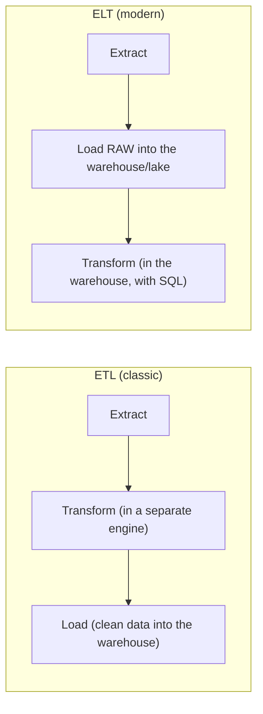
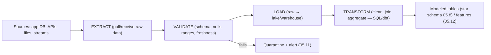
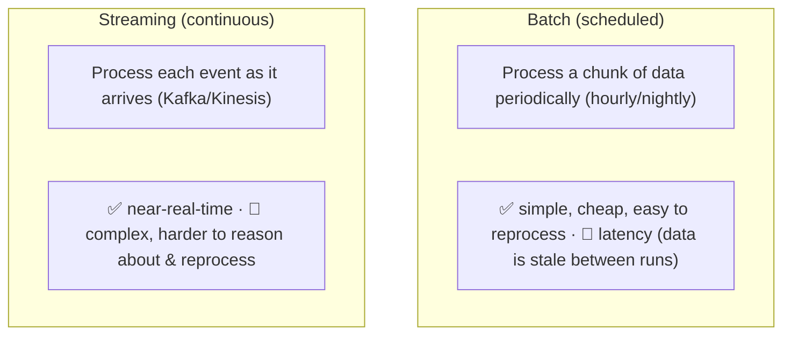
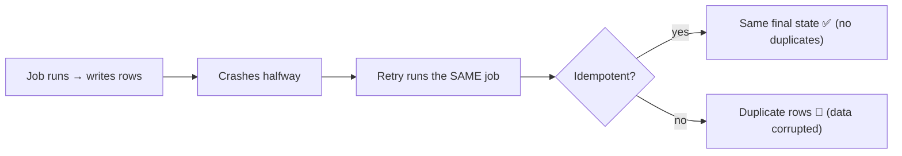
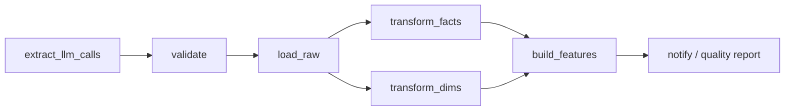

<!-- Module 05 · Lesson 10 — follows ../../../standards/. -->

# 05.10 · ETL & ELT

[⬅ 05.9 Warehouses & Lakes](05.9-warehouses-lakes.md) · [🏠 Module](../README.md) · [🗺 Roadmap](../../../ROADMAP.md) · [Next ➡](05.11-data-pipelines.md)

> Data doesn't move itself. **ETL/ELT** is the discipline of getting data *from* where it's produced *to* where it's useful — extracting, transforming, validating, and loading it. This lesson covers both patterns, batch vs streaming, and the orchestration (Airflow) that makes it reliable.

| | |
|---|---|
| **Module** | `05 · Databases & Data Engineering` |
| **Lesson** | `05.10` |
| **Difficulty** | ⭐⭐⭐ |
| **Estimated study time** | 55 min read |
| **Status** | 🟢 stable |

---

## 1. Learning Objectives

By the end of this lesson you will be able to:

- [ ] Explain **ETL** vs **ELT** and why ELT became dominant.
- [ ] Design **ingestion**, **transformation**, and **validation** stages.
- [ ] Compare **batch** and **streaming** processing.
- [ ] Explain **idempotency** and why it's non-negotiable.
- [ ] Understand **Apache Airflow** conceptually (DAGs, tasks, scheduling).

## 2. Prerequisites

- [05.9 Warehouses & Lakes](05.9-warehouses-lakes.md) (the destination) and [05.3](05.3-sql-fundamentals.md) (upserts).

---

## 3. Why This Topic Exists

Data is produced in one place (your app's Postgres, an API, log files, a scraper) and needed in another (a warehouse, a training set, a feature table). Moving it *reliably* — handling failures, schema changes, duplicates, and late-arriving data — is the core of data engineering, and it's where AI projects most often break: the model is fine, but the data feeding it is stale, duplicated, or silently wrong.

> [!IMPORTANT]
> **The hardest part of data engineering isn't the transformation — it's making the pipeline *reliable*.** Networks fail, APIs rate-limit, jobs crash halfway, data arrives late, and schemas change without warning. A pipeline that works once is easy; one that runs correctly every day for a year, recovers from failures, and never silently corrupts data is engineering. **Idempotency** (§7) is the property that makes that possible.

## 4. ETL vs ELT

Both move data; they differ in *where* the transformation happens.



| | **ETL** | **ELT** |
|---|---|---|
| Transform happens | Before loading, in a separate system | **After** loading, inside the warehouse |
| Raw data kept? | Often not | ✅ Yes — reprocess anytime |
| Compute | Separate ETL servers | The warehouse's (elastic) compute |
| Flexibility | Fixed at load time | Re-transform without re-extracting |
| Modern default | Legacy | ✅ **Dominant** (dbt, cloud warehouses) |

> [!IMPORTANT]
> **ELT won because cloud warehouses made compute cheap and elastic ([05.9](05.9-warehouses-lakes.md)), and because *keeping the raw data* is enormously valuable.** If you transform *before* loading (ETL), a bug in your transform means re-extracting from the source (which may be slow, rate-limited, or gone). With ELT, raw data sits in the warehouse/lake, so you fix the SQL and re-run — no re-extraction. For AI especially, raw data is the asset: you'll want to reprocess it in ways you haven't thought of yet (new features, new chunking strategy). **Load raw, transform later.**

> [!TIP]
> **dbt** (data build tool) is the standard ELT transformation framework: you write transformations as **SQL SELECT statements**, and dbt handles dependency ordering, materialization (tables/views), testing, and documentation — bringing software-engineering practice (version control [Module 04](../../04-Git/README.md), tests [Module 01.10](../../01-Advanced-Python/weeks/01.10-testing.md), CI [Module 04.11](../../04-Git/weeks/04.11-github-actions.md)) to SQL transformations. If you do ELT, you'll almost certainly use dbt.

---

## 5. The Stages



### Extraction

| Method | Use |
|---|---|
| **Full load** | Small tables — re-copy everything |
| **Incremental** | Only new/changed rows (by `updated_at` or an id watermark) |
| **CDC** (Change Data Capture) | Read the DB's WAL/replication log for real-time changes ([05.6](05.6-transactions.md)) |
| API pull | Paginated, rate-limited fetches ([Module 01.12](../../01-Advanced-Python/weeks/01.12-async.md)) |

> [!TIP]
> **Incremental extraction is essential at scale** — you can't re-copy a 500M-row table nightly. Track a **watermark** (the max `updated_at` or id from the last run) and fetch only rows beyond it. Beware two classic bugs: (1) **late-arriving data** (rows inserted with an older timestamp after your watermark passed — use a lookback window), and (2) rows updated *without* touching `updated_at` (enforce it with a trigger, [05.4](05.4-advanced-sql.md)). **CDC** (e.g., Debezium reading Postgres's WAL) avoids both by streaming actual changes.

### Validation

| Check | Example |
|---|---|
| **Schema** | Expected columns/types present ([Module 01.8 Pydantic](../../01-Advanced-Python/weeks/01.8-type-hinting.md)) |
| **Nulls** | Required fields not null ([05.3](05.3-sql-fundamentals.md)) |
| **Ranges** | `0 ≤ score ≤ 1`, no negative counts |
| **Uniqueness** | No duplicate primary keys |
| **Freshness** | Data arrived within the expected window |
| **Volume** | Row count within expected bounds (a 90% drop = alarm) |

> [!IMPORTANT]
> **Validate at ingestion, not after the damage.** A silently-corrupted upstream feed (a column becomes null, an API changes format, row counts collapse) will poison every downstream table, dashboard, and model — often unnoticed for weeks. Validation checks at the boundary ([Module 01.8](../../01-Advanced-Python/weeks/01.8-type-hinting.md)) catch it immediately, quarantine the bad batch, and alert. **Volume checks** (today's rows vs the 7-day average) catch the failures that schema checks miss. This is the data equivalent of testing ([Module 01.10](../../01-Advanced-Python/weeks/01.10-testing.md)), and it's covered further in [05.11](05.11-data-pipelines.md).

---

## 6. Batch vs Streaming



| | Batch | Streaming |
|---|---|---|
| Latency | Minutes–hours | Seconds |
| Complexity | Low | **High** |
| Cost | Lower | Higher |
| Reprocessing | Easy (re-run the job) | Harder |
| Tools | Airflow, dbt, Spark | Kafka, Flink, Spark Streaming |
| Use for | Training sets, analytics, reports | Fraud detection, live dashboards, real-time features |

> [!IMPORTANT]
> **Default to batch.** Streaming is genuinely harder — ordering, late/out-of-order events, exactly-once semantics, state management, and debugging a continuous system are all substantially more complex ([Module 02.8](../../02-Computer-Science/weeks/02.8-concurrency.md)). Most AI workloads (building training sets, computing daily metrics, generating embeddings for a corpus) are perfectly served by **hourly or nightly batch**. Adopt streaming only when the business genuinely needs sub-minute freshness (real-time fraud, live personalization). "We might want real-time someday" is not a reason to pay the complexity tax now.

---

## 7. Idempotency — The Non-Negotiable Property

An operation is **idempotent** if running it twice has the same effect as running it once. Pipelines *will* be re-run (retries, backfills, manual reruns) — so every stage must be idempotent, or you'll get duplicates and corruption.



| Technique | How |
|---|---|
| **Upsert** | `INSERT ... ON CONFLICT DO UPDATE` ([05.3](05.3-sql-fundamentals.md)) |
| **Delete-then-insert by partition** | Replace a whole day/partition atomically |
| **Deterministic IDs** | Derive the PK from the content (hash) so re-inserts collide |
| **Transactional writes** | All-or-nothing per batch ([05.6](05.6-transactions.md)) |
| **Watermarks** | Reprocess a bounded window safely |

> [!IMPORTANT]
> **Idempotency is what makes retries safe — and retries are inevitable** ([Module 01.9](../../01-Advanced-Python/weeks/01.9-error-handling-logging.md)). A non-idempotent pipeline that half-completes and retries *duplicates* data, and duplicated training data silently biases your model. The two workhorse patterns: **upsert** on a stable key, or **delete-then-insert the partition** you're rebuilding (e.g., "delete all rows for 2026-07-09, then insert them") — both make a re-run converge to the same state. **Design every pipeline task to be safely re-runnable from the start**; retrofitting idempotency is painful.

---

## 8. Orchestration — Apache Airflow (Conceptually)

Pipelines have **dependencies** (transform after load, aggregate after transform), **schedules**, and **failure handling**. An **orchestrator** manages all of it. **Airflow** is the most common.



| Airflow concept | Meaning |
|---|---|
| **DAG** | The pipeline: a directed acyclic graph of tasks ([Module 02.3](../../02-Computer-Science/weeks/02.3-data-structures.md)!) |
| **Task** | One unit of work (a node) |
| **Dependencies** | Edges — task B runs after task A |
| **Schedule** | When the DAG runs (cron-like: `@daily`) |
| **Retries** | Automatic re-runs on failure ([Module 01.9](../../01-Advanced-Python/weeks/01.9-error-handling-logging.md)) |
| **Backfill** | Re-run the DAG for past dates |

```python
# Conceptual Airflow DAG — Python defining the graph
with DAG("llm_usage_pipeline", schedule="@daily", catchup=True) as dag:
    extract   = PythonOperator(task_id="extract",   python_callable=extract_calls, retries=3)
    validate  = PythonOperator(task_id="validate",  python_callable=validate_batch)
    load      = PythonOperator(task_id="load_raw",  python_callable=load_to_warehouse)
    transform = PythonOperator(task_id="transform", python_callable=run_dbt)
    extract >> validate >> load >> transform      # dependencies
```

> [!IMPORTANT]
> **A pipeline is a DAG** — literally the directed acyclic graph from [Module 02.3](../../02-Computer-Science/weeks/02.3-data-structures.md), executed in topological order ([Module 02.4](../../02-Computer-Science/weeks/02.4-algorithms.md)). Airflow gives you scheduling, dependency management, **automatic retries**, **backfills** (re-run for a past date range — only safe if tasks are **idempotent**!), monitoring, and alerting. Alternatives (Dagster, Prefect) improve on the developer experience, but the *concepts* — DAG, task, schedule, retry, backfill — are universal. Understanding those concepts matters far more than the specific tool.

---

## 9. Common Mistakes & Best Practices

| Mistake | Better |
|---|---|
| Non-idempotent tasks | Upsert / delete-insert partition |
| Transform before load (ETL) | ELT — keep raw data, re-transform freely |
| No validation at ingestion | Schema/null/range/volume checks + quarantine |
| Full reload of huge tables | Incremental extraction with watermarks |
| Streaming when batch suffices | Default to batch |
| Ignoring late-arriving data | Lookback window / CDC |
| Silent failures | Alerting on failure *and* on anomalies ([05.11](05.11-data-pipelines.md)) |
| Pipelines not in version control | Code + SQL in Git ([Module 04](../../04-Git/README.md)), tested, CI'd |

## 10. Performance Considerations

| Principle | Takeaway |
|---|---|
| Incremental > full loads | Process only what changed |
| Bulk/batched writes | Far faster than row-by-row ([05.6](05.6-transactions.md)) |
| Parallelize independent tasks | The DAG makes this explicit ([Module 02.8](../../02-Computer-Science/weeks/02.8-concurrency.md)) |
| Push transformation to the warehouse | Elastic compute (ELT) |
| Partition by date | Cheap reprocessing of one day ([05.14](05.14-performance-scaling.md)) |

## 11. Security Considerations

| Risk | Guidance |
|---|---|
| Pipeline credentials | Secrets manager, not code ([Module 03.15](../../03-Linux/weeks/03.15-security.md)/[05.13](05.13-database-security.md)) |
| PII flowing into the warehouse | Mask/pseudonymize during transformation |
| Broad pipeline DB permissions | Least privilege — read-only on sources |
| Untrusted external data | Validate before it touches production tables |
| Logs leaking data | Never log raw records with PII ([Module 01.9](../../01-Advanced-Python/weeks/01.9-error-handling-logging.md)) |

> [!TIP]
> The **transformation stage is the right place to enforce privacy**: pseudonymize user identifiers, drop or hash PII columns, and apply retention rules as data moves from raw into modeled tables. Doing it here means the analytical layer (which many people can query, [05.9](05.9-warehouses-lakes.md)) never contains raw PII — a far stronger control than access rules alone.

## 12. Interview Questions

**Beginner**
1. What's the difference between ETL and ELT?
2. What is idempotency, and why do pipelines need it?

**Intermediate**
1. Why did ELT become dominant?
2. Batch vs streaming — when do you need streaming?

**Advanced**
1. How do you handle incremental extraction and late-arriving data?
2. What is an Airflow DAG, and why does backfilling require idempotent tasks?

**System-design prompt**
- Design a pipeline that ingests LLM API call logs daily into a warehouse for cost/quality analytics. — *Follow-ups:* ETL or ELT? Incremental or full? What validation? How do you make it idempotent and handle a failed run? Batch or streaming?

## 13. Summary

| Key idea | Takeaway |
|---|---|
| ELT > ETL | Load raw, transform in the warehouse — keep raw data |
| Stages | Extract → validate → load → transform |
| Validate at ingestion | Schema, nulls, ranges, freshness, **volume** |
| Batch by default | Streaming only for genuine real-time needs |
| **Idempotency** | Non-negotiable — upsert or delete-insert partition |
| Orchestration | A pipeline is a DAG: tasks, deps, schedule, retries, backfill |

## 14. Cheat Sheet

```text
ETL: extract → TRANSFORM (separate engine) → load clean data   [legacy]
ELT: extract → LOAD RAW → TRANSFORM in the warehouse (SQL/dbt) [★ MODERN DEFAULT]
  why ELT won: cheap elastic warehouse compute + KEEPING RAW DATA (fix a bug → re-transform, no re-extract)
  dbt = the ELT transform framework (SQL SELECTs + deps + tests + docs; Git/CI like code)
STAGES: EXTRACT → VALIDATE → LOAD → TRANSFORM → modeled tables/features
EXTRACT: full(small) · INCREMENTAL(watermark on updated_at/id — essential at scale) · CDC(stream the WAL)
  ⚠️ late-arriving data (use a lookback window) · updates that don't bump updated_at
VALIDATE AT INGESTION (not after the damage!): schema · nulls · ranges · uniqueness · freshness · ★ VOLUME (row count vs 7-day avg)
  → fail = QUARANTINE + ALERT (a silently corrupted feed poisons every downstream model)
BATCH (★ default: simple, cheap, easy reprocess; hourly/nightly) vs STREAMING (Kafka/Flink; complex — only for real real-time needs)
★ IDEMPOTENCY (non-negotiable — retries/backfills WILL re-run tasks):
  UPSERT (INSERT ... ON CONFLICT DO UPDATE) · DELETE-then-INSERT the partition · deterministic IDs (content hash) · transactional batch
  non-idempotent + retry = DUPLICATE data = silently biased models
ORCHESTRATION (Airflow): DAG(= the graph, Module 02.3) · tasks · dependencies · schedule(@daily) · RETRIES · BACKFILL(needs idempotency!)
  alternatives: Dagster, Prefect — concepts are universal
SECURITY: pseudonymize/mask PII IN THE TRANSFORM (so the analytical layer never holds raw PII) · secrets in a manager
```

## 15. Flashcards

- **Q:** ETL vs ELT, and why did ELT win? — **A:** ETL transforms before loading; ELT loads raw then transforms in the warehouse. ELT won because cloud-warehouse compute is cheap/elastic and keeping raw data lets you fix a transform bug and re-run without re-extracting.
- **Q:** What is idempotency and why is it non-negotiable? — **A:** Running an operation twice has the same effect as once. Retries and backfills inevitably re-run tasks — a non-idempotent pipeline duplicates data, silently corrupting downstream models.
- **Q:** Two workhorse idempotency patterns? — **A:** Upsert on a stable key (`ON CONFLICT DO UPDATE`), or delete-then-insert the whole partition you're rebuilding.
- **Q:** Which validation check catches failures that schema checks miss? — **A:** Volume checks — today's row count vs the recent average (a 90% drop signals a broken upstream feed even if the schema is valid).
- **Q:** Batch or streaming by default? — **A:** Batch — streaming is far more complex (ordering, late events, exactly-once, state) and most AI workloads (training sets, daily metrics, embeddings) are fine hourly/nightly.
- **Q:** What is an Airflow DAG? — **A:** The pipeline as a directed acyclic graph of tasks with dependencies, a schedule, automatic retries, and backfill support (which requires idempotent tasks).

## 16. Hands-on Exercises

> Full set in [`../exercises/`](../exercises/).

- [ ] **(⭐ Conceptual)** Redesign a given ETL pipeline as ELT; explain what you gain.
- [ ] **(⭐⭐ Idempotency)** Write a load that duplicates rows on re-run; fix it with an upsert; prove re-running is safe.
- [ ] **(⭐⭐ Incremental)** Implement watermark-based incremental extraction; demonstrate the late-arriving-data bug and a lookback fix.
- [ ] **(⭐⭐ Validation)** Add schema/null/range/volume checks that quarantine a bad batch and alert.
- [ ] **(⭐⭐⭐ DAG)** Model a 5-task pipeline as a DAG with dependencies; implement it (Airflow or a simple scheduler); trigger a retry and a backfill.

## 17. Mini Project

> **ETL/ELT Pipeline (this module's showcase, v5).** Build a working pipeline that ingests LLM API call logs (simulated) into a warehouse-style schema: incremental extraction with a watermark, validation (schema/nulls/ranges/volume) with quarantine, idempotent load (upsert), SQL transformation into the star schema from [05.8](05.8-data-modeling.md), and orchestration as a DAG with retries. Include folder structure, architecture diagram, and tests proving idempotency (run it twice → identical state). This is the core data-engineering deliverable of the module.

## 18. References

- Reis & Housley, *Fundamentals of Data Engineering* — the modern standard text ([reference standards](../../../standards/reference-standards.md)).
- Apache Airflow documentation; dbt documentation.
- Kleppmann, *DDIA* Ch. 10–11 (batch and stream processing).

## 19. What's Next

You can move data. Now make it **reliable in production**: **data pipelines** — architecture, scheduling, retries, monitoring, lineage, and data quality.

➡️ **Next:** [05.11 · Data Pipelines](05.11-data-pipelines.md)

---

### 🔁 Revision checklist
- [ ] I can explain ETL vs ELT and why ELT dominates
- [ ] I design every task to be idempotent
- [ ] I validate at ingestion (including volume checks)
- [ ] I understand DAGs, schedules, retries, and backfills

### 🔗 Spaced-repetition callback
> Recall [Module 01.9's retries](../../01-Advanced-Python/weeks/01.9-error-handling-logging.md) and [05.3's upsert](05.3-sql-fundamentals.md): idempotency is what makes those retries *safe* — `ON CONFLICT DO UPDATE` is the pattern. And a pipeline DAG is [Module 02.3's directed acyclic graph](../../02-Computer-Science/weeks/02.3-data-structures.md) executed in topological order.
