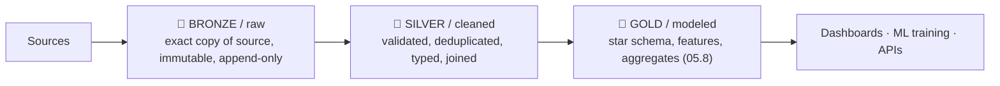
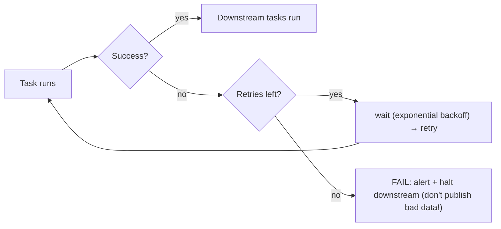
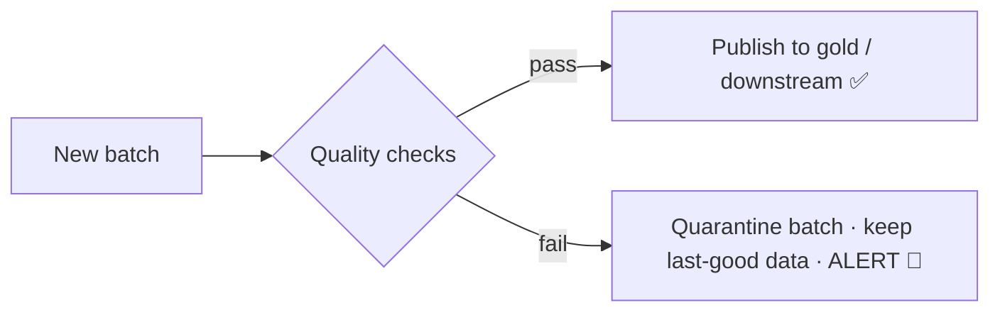
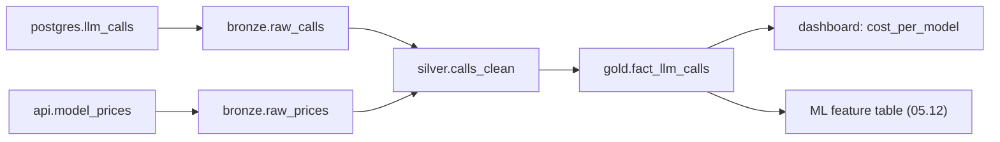
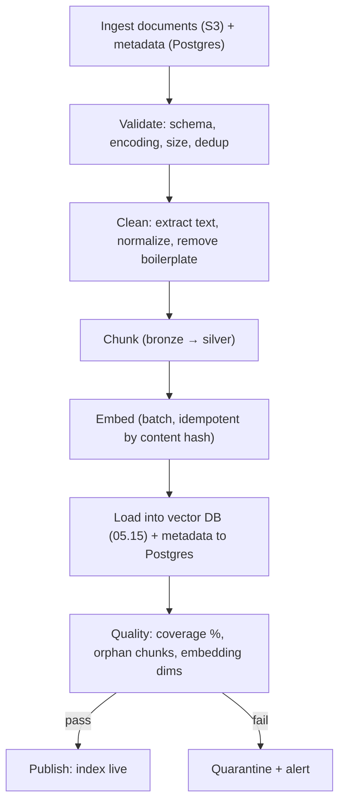

<!-- Module 05 · Lesson 11 — follows ../../../standards/. -->

# 05.11 · Data Pipelines

[⬅ 05.10 ETL & ELT](05.10-etl-elt.md) · [🏠 Module](../README.md) · [🗺 Roadmap](../../../ROADMAP.md) · [Next ➡](05.12-ai-data-workflows.md)

> A pipeline that works once is a script; one that runs correctly every day for a year — recovering from failures, catching bad data, and telling you *why* a number changed — is production data engineering. This lesson covers pipeline architecture, scheduling, retries, monitoring, **lineage**, and **data quality**.

| | |
|---|---|
| **Module** | `05 · Databases & Data Engineering` |
| **Lesson** | `05.11` |
| **Difficulty** | ⭐⭐⭐ |
| **Estimated study time** | 55 min read |
| **Status** | 🟢 stable |

---

## 1. Learning Objectives

By the end of this lesson you will be able to:

- [ ] Design a **pipeline architecture** with clear stages and boundaries.
- [ ] Configure **scheduling**, **retries**, and failure handling.
- [ ] **Monitor** pipelines (freshness, volume, failures) and alert usefully.
- [ ] Explain **data lineage** and why it's essential for debugging.
- [ ] Implement **data quality** checks that catch silent corruption.

## 2. Prerequisites

- [05.10 ETL & ELT](05.10-etl-elt.md) (stages, idempotency, DAGs) and [Module 02.12 Debugging](../../02-Computer-Science/weeks/02.12-debugging.md)/[Module 01.9](../../01-Advanced-Python/weeks/01.9-error-handling-logging.md).

---

## 3. Why This Topic Exists

Data pipelines fail *silently*, and that's what makes them dangerous. An application crash is loud — users complain immediately. A pipeline that quietly ingests half the rows, or joins on a stale dimension, produces *plausible-looking numbers that are wrong*. Dashboards look fine. Models train on corrupted data. Nobody notices for weeks.

Production data engineering is therefore mostly about **observability and quality**: knowing the pipeline ran, knowing the data is right, and being able to trace any number back to its source.

> [!IMPORTANT]
> **The defining danger of data systems is *silent* failure.** A model trained on duplicated or truncated data doesn't crash — it just performs worse, mysteriously. A dashboard fed by a broken join shows confident, wrong numbers that people make decisions on. This is why data quality checks ([§7](#7-data-quality--catching-silent-corruption)) and freshness monitoring aren't optional extras — they're the *primary* engineering work, exactly like tests are for code ([Module 01.10](../../01-Advanced-Python/weeks/01.10-testing.md)).

## 4. Pipeline Architecture

A well-structured pipeline separates concerns into **layers**, each with a clear contract — the "medallion" pattern (bronze/silver/gold) is the common convention.



| Layer | Contains | Rule |
|---|---|---|
| **Bronze (raw)** | Exactly what the source gave you | **Never modify** — it's your safety net |
| **Silver (cleaned)** | Validated, deduplicated, typed, conformed | Business-agnostic cleaning |
| **Gold (modeled)** | Star schema, features, aggregates ([05.8](05.8-data-modeling.md)) | Business/ML-ready |

> [!IMPORTANT]
> **Never overwrite or "fix" the raw (bronze) layer** — it's an immutable record of what the source actually sent. When you discover a transformation bug (and you will), you re-derive silver/gold *from bronze* rather than re-extracting from a source that may have changed or lost the data. This layering is what makes ELT's "keep raw data" promise ([05.10](05.10-etl-elt.md)) operational, and it's the single most valuable structural decision in a data platform.

---

## 5. Scheduling and Retries

| Concern | Approach |
|---|---|
| **Schedule** | Cron-like (`@daily`, `0 * * * *`); align to data availability, not arbitrary times |
| **Retries** | Automatic, with **exponential backoff** ([Module 01.9](../../01-Advanced-Python/weeks/01.9-error-handling-logging.md)) |
| **Idempotency** | Required for retries to be safe ([05.10](05.10-etl-elt.md)) |
| **Timeouts** | Kill hung tasks (don't block the DAG forever) |
| **SLA** | "This table must be fresh by 6 a.m." — alert if breached |
| **Backfill** | Re-run for a past date range (needs idempotency) |
| **Dependencies** | Don't run transform if extract failed (the DAG enforces this) |



> [!IMPORTANT]
> **A failed task must *stop* downstream tasks — never let a partial failure publish incomplete data.** The worst outcome isn't a failed pipeline (that's visible and fixable); it's a *partially succeeded* pipeline that publishes half a day's data as if it were complete. The DAG's dependency edges enforce this: if extract fails, transform doesn't run, and yesterday's (complete) data remains in place. **Fail loudly, publish nothing, alert a human.**

---

## 6. Monitoring & Observability

You must know: *did it run? did it finish? is the data right? is it fresh?*

| Signal | What it tells you | Alert when |
|---|---|---|
| **Run status** | Did the DAG succeed? | Task failed |
| **Freshness** | When was the table last updated? | Stale beyond SLA |
| **Volume** | How many rows arrived? | ±X% vs the recent average |
| **Duration** | How long did it take? | Much longer than usual (degrading) |
| **Quality checks** | Did validations pass? | Any check failed |
| **Cost** | Warehouse spend | Spike ([05.9](05.9-warehouses-lakes.md)) |

> [!IMPORTANT]
> **Freshness and volume are the two highest-value alerts** ([Module 02.12 observability](../../02-Computer-Science/weeks/02.12-debugging.md)). "The table hasn't updated in 26 hours" catches a silently-dead pipeline. "Today's row count is 8% of the 7-day average" catches an upstream API that started returning empty pages — a failure no schema check would notice, and one that would otherwise poison every downstream model. Monitor the *data*, not just the *job*: a job can succeed while producing garbage.

---

## 7. Data Quality — Catching Silent Corruption

Data quality checks are **tests for data** ([Module 01.10](../../01-Advanced-Python/weeks/01.10-testing.md)) — assertions that run every pipeline execution.

| Dimension | Check | Example |
|---|---|---|
| **Completeness** | No unexpected nulls | `user_id IS NOT NULL` |
| **Uniqueness** | No duplicate keys | `COUNT(*) = COUNT(DISTINCT id)` |
| **Validity** | Values in range/set | `0 ≤ score ≤ 1`; `status IN (...)` |
| **Consistency** | Cross-table agreement | Every `fact.user_key` exists in `dim_user` |
| **Freshness** | Recent data present | `MAX(created_at) > now() - 1 day` |
| **Accuracy/Volume** | Plausible magnitudes | Row count within expected bounds |

```sql
-- A data test (dbt-style): this query should return ZERO rows
SELECT id FROM fact_llm_calls
WHERE cost_usd < 0                        -- impossible value
   OR user_key NOT IN (SELECT user_key FROM dim_user)   -- orphaned FK
   OR input_tokens IS NULL;
```



> [!IMPORTANT]
> **Treat data quality checks exactly like unit tests** ([Module 01.10](../../01-Advanced-Python/weeks/01.10-testing.md)): they run automatically on every pipeline execution, and a failure **blocks publication**. Tools like **dbt tests** and **Great Expectations** make these declarative. The critical design decision: on failure, **do not publish** — quarantine the bad batch and leave the last-known-good data in place. Publishing corrupt data is far worse than publishing *stale* data, because stale data is obviously old while corrupt data looks fine.

---

## 8. Data Lineage

**Lineage** tracks where each table/column came from — which sources, which transformations, which upstream tables.



| Lineage answers | Why it matters |
|---|---|
| "Where did this number come from?" | Debugging a wrong dashboard figure |
| "What breaks if I change this column?" | **Impact analysis** before a schema change |
| "Which models used this corrupted table?" | Blast-radius assessment after a data incident |
| "Is this data compliant/PII-derived?" | Governance and GDPR |

> [!IMPORTANT]
> **Lineage is what makes data incidents debuggable.** When a dashboard shows an impossible number, lineage lets you walk *backwards* through the transformations to the source ([Module 02.12's systematic debugging](../../02-Computer-Science/weeks/02.12-debugging.md)). And when you discover a source was corrupted for three days, lineage tells you *forward*: which tables, dashboards, and **trained models** consumed it — the blast radius. Without lineage, both questions require archaeology. Tools (dbt, OpenLineage, Databricks Unity Catalog) derive it automatically from your transformation code — another reason to define transformations as code in Git ([Module 04](../../04-Git/README.md)).

---

## 9. Pipelines for AI Datasets — Worked Example



| AI-pipeline concern | Why |
|---|---|
| **Idempotent embedding** | Re-running mustn't re-embed everything (costs money!) — key by content hash ([05.10](05.10-etl-elt.md)) |
| **Dedup before embedding** | Duplicate chunks waste money and skew retrieval |
| **Coverage check** | Every document produced ≥1 chunk with an embedding |
| **Lineage to the model** | Which corpus version trained/served which model ([Module 04.6](../../04-Git/weeks/04.6-tags-releases.md)/[Module 16](../../16-MLOps/README.md)) |
| **Cost monitoring** | Embedding a corpus has a real $ cost |

> [!TIP]
> **Idempotency has a direct financial impact in AI pipelines**: embedding is a *paid API call*. A non-idempotent embedding job that retries re-embeds everything and bills you twice. Key embeddings by a **content hash** — if the chunk's text is unchanged, skip it ([05.10](05.10-etl-elt.md)). This single design choice can save thousands of dollars on a large corpus, and it makes backfills safe.

---

## 10. Common Mistakes & Best Practices

| Mistake | Better |
|---|---|
| Modifying the raw/bronze layer | Keep it immutable — re-derive downstream |
| Publishing on partial failure | Fail loudly; keep last-good data |
| No freshness/volume alerts | Monitor the *data*, not just the job |
| No data quality tests | Assertions that block publication |
| No lineage | Can't debug or assess blast radius |
| Non-idempotent embedding | Wasted money on retries |
| Alerting on everything | Alert fatigue → real alerts ignored |
| Pipeline code not in Git/tested | Version + test it like software |

## 11. Performance Considerations

| Principle | Takeaway |
|---|---|
| Partition by date | Reprocess one day cheaply ([05.14](05.14-performance-scaling.md)) |
| Incremental processing | Don't recompute history every run |
| Parallelize independent tasks | The DAG makes this explicit |
| Batch external API calls | Embeddings/LLM calls: batch + concurrency ([Module 01.12](../../01-Advanced-Python/weeks/01.12-async.md)) |
| Cache expensive steps | Skip unchanged work (content hash) |

## 12. Security Considerations

| Risk | Guidance |
|---|---|
| Pipeline credentials | Secrets manager; least privilege ([05.13](05.13-database-security.md)) |
| PII propagating downstream | Mask/pseudonymize in silver; lineage proves where it went |
| Quarantined bad data | Store securely; it may contain sensitive records |
| Alerts leaking data | Don't include raw records in alert payloads ([Module 01.9](../../01-Advanced-Python/weeks/01.9-error-handling-logging.md)) |
| Untrusted source data | Validate before it enters production tables |

> [!TIP]
> **Lineage is a compliance tool, not just a debugging one.** When a user requests deletion (GDPR), lineage tells you every downstream table and model that derived from their data. Without it, you can't honestly claim to have deleted it — a real legal exposure for AI companies whose training data derives from user content ([05.13](05.13-database-security.md)).

## 13. Interview Questions

**Beginner**
1. What are the bronze/silver/gold layers, and why is bronze immutable?
2. What should happen when a pipeline task fails?

**Intermediate**
1. Why are freshness and volume the highest-value alerts?
2. What is data lineage, and what two questions does it answer?

**Advanced**
1. Why is silent failure the defining danger of data systems, and how do you defend against it?
2. Design an idempotent, cost-efficient embedding pipeline for a large corpus.

**System-design prompt**
- Design a production pipeline that keeps a RAG system's index fresh as documents change. — *Follow-ups:* Layers? Idempotency (embedding cost!)? Quality checks? What alerts? How do you trace a bad answer back to a bad chunk?

## 14. Summary

| Key idea | Takeaway |
|---|---|
| Silent failure | The defining data-systems danger |
| Bronze/silver/gold | Immutable raw → cleaned → modeled |
| Fail loudly | Never publish partial/corrupt data |
| Monitor the data | Freshness + volume, not just job status |
| Data quality tests | Assertions that block publication |
| Lineage | Debug backwards; assess blast radius forwards |
| AI pipelines | Idempotent embedding by content hash = real money |

## 15. Cheat Sheet

```text
★ DEFINING DANGER: SILENT FAILURE (corrupt data looks fine; models degrade mysteriously; dashboards lie confidently)
ARCHITECTURE (medallion): 🥉BRONZE/raw (exact source copy, IMMUTABLE — never modify!) →
  🥈SILVER/cleaned (validated, deduped, typed) → 🥇GOLD/modeled (star schema, features 05.8) → consumers
  bug in transform? re-derive from BRONZE (no re-extraction)
SCHEDULING/RETRIES: cron schedule · retries w/ exponential backoff (needs IDEMPOTENCY 05.10) · timeouts · SLA · backfill
  ★ a FAILED task must HALT downstream — NEVER publish partial data (stale > corrupt!)
MONITORING (monitor the DATA, not just the job — a job can succeed producing garbage):
  ★ FRESHNESS (last update vs SLA) + ★ VOLUME (rows vs 7-day avg) = highest-value alerts
  + run status · duration · quality checks · cost
DATA QUALITY = TESTS FOR DATA (dbt tests / Great Expectations) — run every execution, BLOCK publication on failure:
  completeness(nulls) · uniqueness(dupe keys) · validity(ranges/sets) · consistency(orphan FKs) · freshness · volume
  fail → QUARANTINE batch + keep last-good + ALERT
LINEAGE (source → transforms → tables → dashboards/models):
  ← backwards: "where did this wrong number come from?" (debug)
  → forwards: "what breaks / which models used this corrupt table?" (BLAST RADIUS) + GDPR deletion
AI PIPELINES: ★ IDEMPOTENT EMBEDDING keyed by CONTENT HASH (embedding = PAID API — a retry that re-embeds costs $$$)
  dedup before embedding · coverage checks · cost monitoring · lineage corpus-version → model
```

## 16. Flashcards

- **Q:** What is the defining danger of data pipelines? — **A:** Silent failure — corrupted data doesn't crash anything; it produces plausible but wrong numbers and quietly degrades models.
- **Q:** What are bronze/silver/gold, and why is bronze immutable? — **A:** Raw (exact source copy) → cleaned/validated → modeled. Bronze stays immutable so you can re-derive downstream layers after fixing a transform bug, without re-extracting from the source.
- **Q:** What must happen when a pipeline task fails? — **A:** Halt downstream tasks, publish nothing, keep the last-known-good data, and alert — never publish partial data (stale beats corrupt).
- **Q:** The two highest-value pipeline alerts? — **A:** Freshness (table hasn't updated within its SLA) and volume (row count far off the recent average) — they catch silent failures schema checks miss.
- **Q:** What is data lineage used for? — **A:** Debugging backwards (where did this number come from?) and assessing blast radius forwards (which tables/dashboards/models used this corrupt data?), plus GDPR deletion.
- **Q:** Why does idempotency have a financial impact in AI pipelines? — **A:** Embedding is a paid API call — a non-idempotent job that retries re-embeds the whole corpus and bills you again; key by content hash to skip unchanged chunks.

## 17. Hands-on Exercises

> Full set in [`../exercises/`](../exercises/).

- [ ] **(⭐ Layers)** Restructure a flat pipeline into bronze/silver/gold; explain what each layer guarantees.
- [ ] **(⭐⭐ Quality)** Write SQL data tests (nulls, dupes, ranges, orphan FKs) that return zero rows when healthy; make one fail and quarantine the batch.
- [ ] **(⭐⭐ Monitoring)** Implement freshness and volume checks with alerting thresholds; simulate a broken upstream feed and catch it.
- [ ] **(⭐⭐ Retries)** Add retries with backoff and a downstream halt on failure; prove no partial publication.
- [ ] **(⭐⭐⭐ Lineage)** Produce a lineage diagram for your pipeline; use it to answer "which outputs are affected if source X was corrupt for 3 days?"
- [ ] **(⭐⭐⭐ Idempotent embedding)** Build an embedding step keyed by content hash; re-run it and show zero re-embedding (and zero extra cost).

## 18. Mini Project

> **AI Dataset Pipeline (this module's showcase, v6).** Build the pipeline that keeps a RAG corpus fresh: ingest documents → validate → clean/extract text → chunk → **idempotently embed (content-hash keyed)** → load to vector store + metadata to Postgres → quality gates (coverage, orphans, dimensions) → publish or quarantine. Include bronze/silver/gold layering, a DAG with retries, freshness/volume monitoring, a lineage diagram, and a cost report. Tests must prove: re-running costs nothing extra, and a corrupt batch never publishes. This is the flagship data-engineering project of the module and directly feeds [Module 13 · RAG](../../13-RAG/README.md).

## 19. References

- Reis & Housley, *Fundamentals of Data Engineering* — pipelines, quality, orchestration ([reference standards](../../../standards/reference-standards.md)).
- dbt tests; Great Expectations; OpenLineage documentation.
- [Module 02.12 · Debugging](../../02-Computer-Science/weeks/02.12-debugging.md) — observability principles.

## 20. What's Next

Now assemble everything into the picture that matters most: **AI data workflows** — how data flows from raw source through features, training, evaluation, deployment, and monitoring.

➡️ **Next:** [05.12 · AI Data Workflows](05.12-ai-data-workflows.md)

---

### 🔁 Revision checklist
- [ ] I structure pipelines as bronze/silver/gold with immutable raw
- [ ] I fail loudly and never publish partial data
- [ ] I monitor freshness and volume, not just job status
- [ ] I write data quality tests and maintain lineage

### 🔗 Spaced-repetition callback
> Recall [Module 01.10's tests](../../01-Advanced-Python/weeks/01.10-testing.md) and [Module 02.12's observability](../../02-Computer-Science/weeks/02.12-debugging.md): data quality checks *are* tests (they block bad data from shipping), and freshness/volume alerts *are* the metrics pillar. Data engineering applies software-engineering discipline to data — that's the whole insight.
