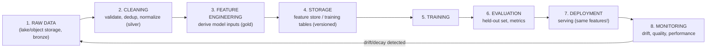
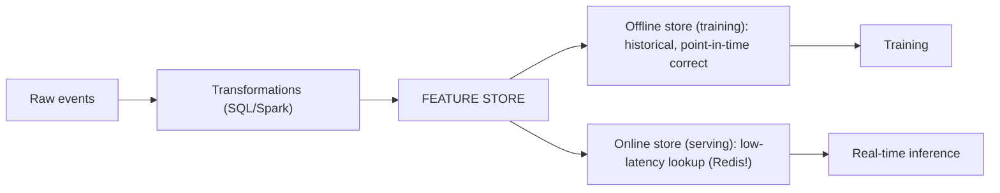
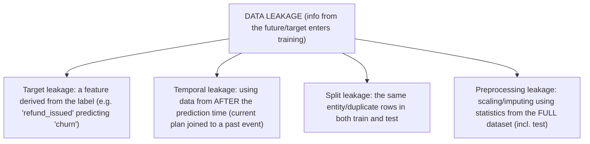
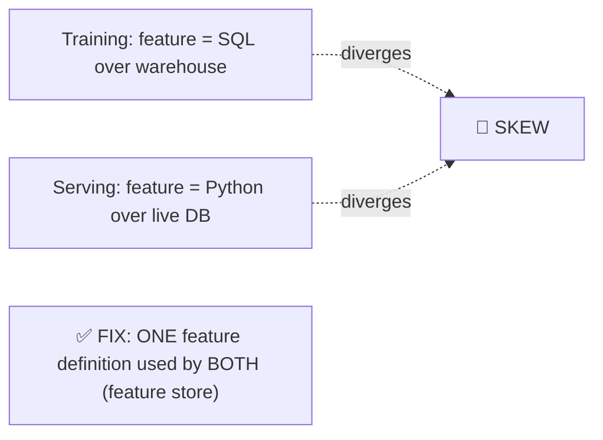
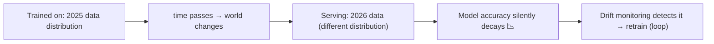

<!-- Module 05 · Lesson 12 — follows ../../../standards/. -->

# 05.12 · AI Data Workflows

[⬅ 05.11 Data Pipelines](05.11-data-pipelines.md) · [🏠 Module](../README.md) · [🗺 Roadmap](../../../ROADMAP.md) · [Next ➡](05.13-database-security.md)

> The full journey: **Raw Data → Cleaning → Feature Engineering → Storage → Training → Evaluation → Deployment → Monitoring**. This lesson assembles everything in the module into the end-to-end data flow of a real AI system — and names the data problems (leakage, drift, skew) that silently destroy models.

| | |
|---|---|
| **Module** | `05 · Databases & Data Engineering` |
| **Lesson** | `05.12` |
| **Difficulty** | ⭐⭐⭐ |
| **Estimated study time** | 55 min read |
| **Status** | 🟢 stable |

---

## 1. Learning Objectives

By the end of this lesson you will be able to:

- [ ] Trace data through the **full AI lifecycle**, stage by stage.
- [ ] Explain **feature engineering** and the role of a **feature store**.
- [ ] Identify and prevent **data leakage** and **training/serving skew**.
- [ ] Explain **data drift** and how monitoring catches it.
- [ ] Design **reproducible** AI datasets (versioning code + data + model).

## 2. Prerequisites

- [05.8 Data Modeling](05.8-data-modeling.md), [05.10 ETL/ELT](05.10-etl-elt.md), [05.11 Pipelines](05.11-data-pipelines.md).

---

## 3. Why This Topic Exists

Most AI failures are **data failures**, not model failures. The model architecture is rarely the problem; the data is leaked, drifted, duplicated, stale, or subtly different between training and serving. These failures are silent ([05.11](05.11-data-pipelines.md)) — the model trains fine, scores well offline, and then underperforms in production for reasons nobody can explain.

This lesson maps the whole data lifecycle so you can see *where* each failure enters — and place the guardrails that catch it. It's the bridge from data engineering into ML ([Module 08](../../08-Machine-Learning/README.md)) and MLOps ([Module 16](../../16-MLOps/README.md)).

> [!IMPORTANT]
> **"Garbage in, garbage out" is not a cliché — it's the dominant failure mode of applied AI.** A mediocre model on excellent data beats an excellent model on flawed data, every time. The three data bugs that destroy models most often — **leakage** (§6), **training/serving skew** (§7), and **drift** (§8) — are all *data-engineering* problems, invisible to the modeling code. That's why this module exists before the ML modules.

## 4. The Full AI Data Lifecycle



| Stage | Data concern | Covered in |
|---|---|---|
| **1. Raw** | Immutable, catalogued, governed | [05.9](05.9-warehouses-lakes.md)/[05.11](05.11-data-pipelines.md) |
| **2. Cleaning** | Validate, dedup, handle nulls | [05.10](05.10-etl-elt.md)/[05.11](05.11-data-pipelines.md) |
| **3. Features** | Derive inputs; **point-in-time correctness** | [05.8](05.8-data-modeling.md) |
| **4. Storage** | Versioned, reproducible datasets | [Module 04.9](../../04-Git/weeks/04.9-large-files.md) |
| **5. Training** | Correct splits; no leakage | [Module 08](../../08-Machine-Learning/README.md) |
| **6. Evaluation** | Held-out data the model never saw | [Module 08](../../08-Machine-Learning/README.md)/[Module 19](../../19-Production-AI/README.md) |
| **7. Deployment** | Same feature logic as training (no skew) | [Module 16](../../16-MLOps/README.md) |
| **8. Monitoring** | Drift, data quality, performance decay | [Module 19](../../19-Production-AI/README.md) |

> [!IMPORTANT]
> **Notice the loop**: monitoring feeds back to raw data. Models decay because the *world* changes ([§8](#8-data-drift--why-models-decay)), so the lifecycle is a cycle, not a line — you continuously ingest fresh data, retrain, and redeploy. Designing for that loop from the start (versioned data, reproducible pipelines, drift monitoring) is what separates a demo from a production AI system.

---

## 5. Feature Engineering & Feature Stores

**Features** are the model's inputs — derived from raw data (a user's average session length, a document's token count, an embedding).



| Feature-store role | Why |
|---|---|
| **Single definition** of each feature | The *same* logic for training and serving (prevents skew, §7) |
| **Offline store** | Historical features for training (columnar/warehouse) |
| **Online store** | Millisecond lookups at inference (Redis/KV, [05.7](05.7-nosql.md)) |
| **Point-in-time joins** | Features as they were *at event time* ([05.8](05.8-data-modeling.md)) |
| **Reuse/discovery** | Teams share features instead of re-deriving them |

> [!NOTE]
> A **feature store** (Feast, Tecton, Databricks) solves a real problem: without one, feature logic gets written *twice* — once in the training pipeline (SQL over the warehouse) and once in the serving code (Python against the live DB) — and the two inevitably diverge, causing **training/serving skew** (§7). You don't need a formal feature store to start; you *do* need one definition of each feature, used by both paths.

---

## 6. Data Leakage — The Silent Model Killer

**Leakage** is when information that wouldn't be available at prediction time sneaks into training — producing amazing offline scores and a model that fails in production.



| Leakage type | Example | Prevention |
|---|---|---|
| **Target leakage** | A feature that's a proxy for the label | Ask: "would I know this *before* the event?" |
| **Temporal leakage** | Joining *current* dimension values to past facts | **Point-in-time joins** ([05.8](05.8-data-modeling.md)) |
| **Split leakage** | Duplicates or the same user in train *and* test | Dedup; split by entity/time, not randomly |
| **Preprocessing leakage** | Fitting a scaler on train+test together | Fit on train only |

> [!CAUTION]
> **Leakage is the most dangerous bug in applied ML because it *looks like success*** — your offline accuracy is suspiciously excellent, everyone celebrates, and the model collapses in production. **The diagnostic question for every feature: "at prediction time, would this value actually be available, with this value?"** If a feature is computed *after* or *from* the outcome, it's leakage. And note the data-engineering root: leakage is usually a **JOIN bug** ([05.3](05.3-sql-fundamentals.md)) — joining a dimension without respecting time ([05.8](05.8-data-modeling.md)). Suspiciously good results should trigger a leakage hunt, not a celebration.

---

## 7. Training/Serving Skew

**Skew** is when the features at *serving* time differ from those at *training* time — even subtly — so the model sees inputs it wasn't trained on.

| Cause | Example |
|---|---|
| **Different code paths** | Training features in SQL; serving features in Python — logic diverges |
| **Different data sources** | Training from the warehouse (cleaned); serving from the live DB (raw) |
| **Timing differences** | A feature is complete in the warehouse but only partially available live |
| **Preprocessing mismatch** | Different tokenization/scaling/null-handling at serve time |



> [!IMPORTANT]
> **Training/serving skew is the second-biggest silent model killer**, and it's fundamentally a *data-engineering* failure: the same feature is computed two ways. The fix is architectural — **one definition, both paths** (a feature store, or shared transformation code). A concrete guard: **log the actual features used at serving time**, then compare their distribution to the training set — a mismatch reveals skew immediately ([Module 19](../../19-Production-AI/README.md)).

---

## 8. Data Drift — Why Models Decay

Even a perfect model degrades over time because **the world changes** — the incoming data no longer looks like the training data.

| Drift type | Meaning | Example |
|---|---|---|
| **Data drift** (covariate shift) | Input distribution changes | Users start asking about a new topic |
| **Concept drift** | The input→output relationship changes | What counts as "spam" evolves |
| **Label drift** | The target distribution changes | Class balance shifts |



> [!IMPORTANT]
> **Models decay in production even with no code change** — this surprises people. Monitoring must therefore track the *data*, not just uptime: compare the live input distribution to the training distribution (statistical tests, PSI, KL divergence) and alert when they diverge ([Module 19](../../19-Production-AI/README.md)). Drift detection is what triggers **retraining** — closing the lifecycle loop (§4). This is why the monitoring→raw-data arrow exists in the diagram; an AI system that never retrains is slowly getting worse.

---

## 9. Reproducibility — Versioning Data + Code + Model

An AI result is reproducible only if you can recover the **exact combination** that produced it ([Module 00.5](../../00-Orientation/weeks/00.5-development-environment.md)/[Module 04.6](../../04-Git/weeks/04.6-tags-releases.md)).

| Version | How |
|---|---|
| **Code** | Git tag ([Module 04.6](../../04-Git/weeks/04.6-tags-releases.md)) |
| **Data** | DVC / lakehouse time travel / immutable snapshot ([05.9](05.9-warehouses-lakes.md)) |
| **Features** | Versioned transformation code (dbt in Git) |
| **Model** | Model registry + artifact in object storage ([Module 04.9](../../04-Git/weeks/04.9-large-files.md)) |
| **Environment** | Lockfile ([Module 01.13](../../01-Advanced-Python/weeks/01.13-packaging-code-quality.md)) |

> [!TIP]
> **"Which data trained this model?" must have a precise answer.** Use immutable, versioned datasets (a lakehouse snapshot, a DVC-tracked commit, or a partitioned table you never overwrite) and record the dataset version *in the model's metadata*. Without this, you cannot reproduce a result, debug a regression, or comply with an audit. This is [Module 04.6's](../../04-Git/weeks/04.6-tags-releases.md) "version code + model + config + data together," made operational — and it's the heart of [Module 16 · MLOps](../../16-MLOps/README.md).

---

## 10. Common Mistakes & Best Practices

| Mistake | Better |
|---|---|
| Suspiciously great offline scores | Hunt for leakage |
| Random train/test split with duplicates | Dedup; split by entity/time |
| Feature logic written twice | One definition (feature store/shared code) |
| Joining current dims to past facts | Point-in-time joins |
| No drift monitoring | Track input distributions; retrain |
| Unversioned training data | Immutable snapshots + recorded version |
| Fitting preprocessing on all data | Fit on train only |
| Assuming a deployed model stays good | Models decay — monitor and retrain |

## 11. Performance Considerations

| Principle | Takeaway |
|---|---|
| Offline vs online stores | Columnar for training; KV (Redis) for serving latency |
| Precompute features | Don't recompute at inference time |
| Batch embedding | Idempotent, content-hash keyed ([05.11](05.11-data-pipelines.md)) |
| Partition training data by time | Cheap incremental retraining |

## 12. Security Considerations

| Risk | Guidance |
|---|---|
| PII in training data | Minimize/pseudonymize; models can memorize and leak it |
| User data used for training without consent | Legal/ethical requirement — track consent in the data |
| GDPR deletion vs trained models | Deleting a row doesn't remove its influence from a model — plan retraining |
| Lineage for compliance | Prove what data trained what model ([05.11](05.11-data-pipelines.md)) |
| Feature store access | Features can encode sensitive attributes |

> [!CAUTION]
> **Models can memorize and regurgitate their training data** — including PII. Combined with GDPR's right to erasure, this creates a hard problem: deleting a user's *row* doesn't remove their influence from an already-trained model. Mitigate by minimizing PII in training data (pseudonymize early, in the silver layer, [05.11](05.11-data-pipelines.md)), tracking consent, maintaining lineage, and planning periodic retraining. Treat "what data trained this model" as a compliance-critical question, not just an engineering one.

## 13. Interview Questions

**Beginner**
1. Walk through the AI data lifecycle from raw data to monitoring.
2. What is feature engineering, and what does a feature store provide?

**Intermediate**
1. What is data leakage? Name three types and how to prevent each.
2. What is training/serving skew and its architectural fix?

**Advanced**
1. Why do models decay in production, and how do you detect it?
2. How do you make an AI dataset reproducible, and why does GDPR complicate it?

**System-design prompt**
- Design the data workflow for a production ML model: raw → features → training → serving → monitoring. — *Follow-ups:* Where can leakage enter? How do you prevent skew? How do you version the dataset? What triggers retraining?

## 14. Summary

| Key idea | Takeaway |
|---|---|
| Most AI failures are data failures | Not model failures |
| The lifecycle is a loop | Monitoring → retrain → redeploy |
| Feature store | One definition for training *and* serving |
| **Leakage** | Looks like success; usually a time-unaware JOIN |
| **Skew** | Feature logic written twice → diverges |
| **Drift** | The world changes; models decay; monitor and retrain |
| Reproducibility | Version code + data + features + model + env |

## 15. Cheat Sheet

```text
★ MOST AI FAILURES ARE DATA FAILURES (not model failures) — garbage in, garbage out
LIFECYCLE (a LOOP): RAW(bronze/lake) → CLEAN(silver) → FEATURES(gold, point-in-time!) → STORE(versioned) →
  TRAIN → EVALUATE(held-out) → DEPLOY(same features!) → MONITOR(drift) →(retrain)→ RAW
FEATURE STORE: ONE definition of each feature used by BOTH paths
  offline store(training: historical, point-in-time) + online store(serving: low-latency, Redis)
★ DATA LEAKAGE (looks like SUCCESS — suspiciously great scores = hunt for it!):
  TARGET(feature derived from the label) · TEMPORAL(current dim joined to past fact → POINT-IN-TIME JOINS) ·
  SPLIT(duplicates/same entity in train & test → dedup, split by entity/time) · PREPROCESSING(fit scaler on train ONLY)
  ★ diagnostic: "at prediction time, would this value actually be available, with this value?"  (usually a JOIN bug!)
★ TRAINING/SERVING SKEW: feature computed 2 ways (SQL for training, Python for serving) → they diverge
  FIX: ONE definition, both paths (feature store) · GUARD: log serving features, compare distribution to training
★ DRIFT (models decay with NO code change — the world changes):
  data drift(inputs shift) · concept drift(input→output relation changes) · label drift
  → monitor input distributions (PSI/KL) → alert → RETRAIN (closes the loop)
REPRODUCIBILITY: version CODE(git tag) + DATA(DVC/lakehouse time travel/immutable snapshot) + FEATURES(dbt in git) +
  MODEL(registry) + ENV(lockfile) — record the dataset version IN the model's metadata
SECURITY: models MEMORIZE PII · GDPR deletion ≠ removing influence from a trained model → minimize PII early + lineage + retrain plan
```

## 16. Flashcards

- **Q:** What is data leakage, and why is it so dangerous? — **A:** Information unavailable at prediction time entering training — dangerous because it *looks like success* (excellent offline scores) and then the model fails in production.
- **Q:** The diagnostic question for leakage? — **A:** "At prediction time, would this value actually be available, with this value?" — if a feature is derived from or computed after the outcome, it's leakage.
- **Q:** What is training/serving skew and its fix? — **A:** Features computed differently at training vs serving (two code paths that diverge); fix architecturally with one feature definition used by both (a feature store/shared code).
- **Q:** Why do models decay without any code change? — **A:** Data/concept drift — the real-world input distribution or the input→output relationship changes over time, so the model's training distribution no longer matches reality.
- **Q:** What must be versioned for a reproducible AI result? — **A:** Code (git tag), data (immutable snapshot/DVC/time travel), feature logic, the model artifact, and the environment (lockfile) — with the dataset version recorded in the model metadata.
- **Q:** Why does GDPR deletion complicate ML? — **A:** Deleting a user's row doesn't remove their influence from an already-trained model (which may have memorized it) — mitigate by minimizing PII, keeping lineage, and planning retraining.

## 17. Hands-on Exercises

> Full set in [`../exercises/`](../exercises/).

- [ ] **(⭐ Trace)** Diagram the full data lifecycle for a given AI product; label the storage system at each stage.
- [ ] **(⭐⭐⭐ Leakage)** Deliberately create target and temporal leakage in a dataset; show the inflated score; fix with point-in-time joins and re-measure.
- [ ] **(⭐⭐ Skew)** Implement a feature twice (SQL + Python) and introduce a subtle divergence; detect it by comparing distributions.
- [ ] **(⭐⭐ Split)** Show how a random split with duplicate rows leaks; fix with entity/time-based splitting.
- [ ] **(⭐⭐⭐ Drift)** Simulate input drift; implement a distribution-comparison check that alerts.
- [ ] **(⭐⭐ Reproducibility)** Version a dataset snapshot; record its version with a trained model; reproduce the exact result.

## 18. Mini Project

> **Point-in-time-correct feature pipeline.** Build a feature pipeline for a prediction task where naive joins cause leakage: implement (a) the *naive* version (join current dimension values) showing an inflated offline score, and (b) the *correct* version with point-in-time joins ([05.8](05.8-data-modeling.md)) showing the honest score. Add a serving path that reuses the *same* feature definition (no skew), log serving features, and implement a drift check. Deliverable: a report quantifying how much leakage inflated the metric — the most instructive experiment in applied ML.

## 19. References

- Kapoor & Narayanan, "Leakage and the Reproducibility Crisis in ML" — essential reading ([reference standards](../../../standards/reference-standards.md)).
- Huyen, *Designing Machine Learning Systems* Ch. 4–8 — the definitive treatment of ML data workflows.
- Feast / feature-store documentation; [Module 16 · MLOps](../../16-MLOps/README.md).

## 20. What's Next

The data flows correctly — now protect it: **database security** — authentication, authorization, encryption, backups, disaster recovery, and secrets.

➡️ **Next:** [05.13 · Database Security](05.13-database-security.md)

---

### 🔁 Revision checklist
- [ ] I can trace the full AI data lifecycle (and its loop)
- [ ] I can identify and prevent the four leakage types
- [ ] I understand training/serving skew and its architectural fix
- [ ] I monitor drift and version data for reproducibility

### 🔗 Spaced-repetition callback
> Recall [05.8's point-in-time correctness](05.8-data-modeling.md) and [05.11's silent failure](05.11-data-pipelines.md): leakage *is* a time-unaware JOIN, and drift *is* a silent failure that only data monitoring catches. And [Module 04.6's "version code + model + config + data together"](../../04-Git/weeks/04.6-tags-releases.md) is exactly the reproducibility requirement here. The module's threads converge into the AI lifecycle.
