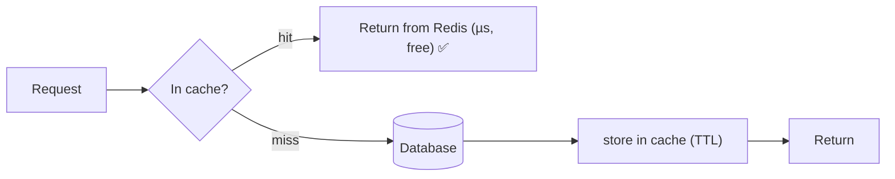
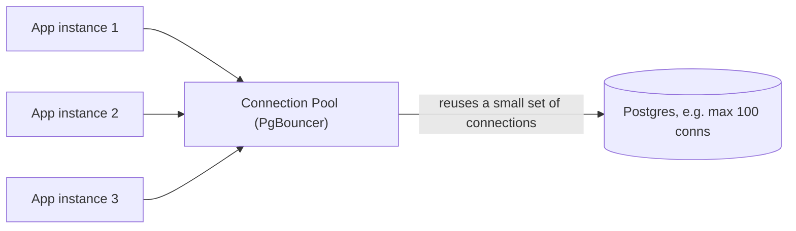
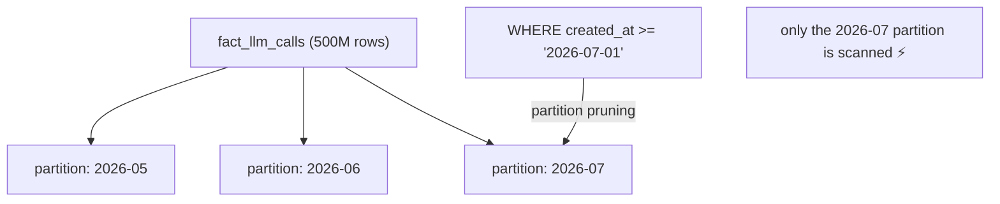
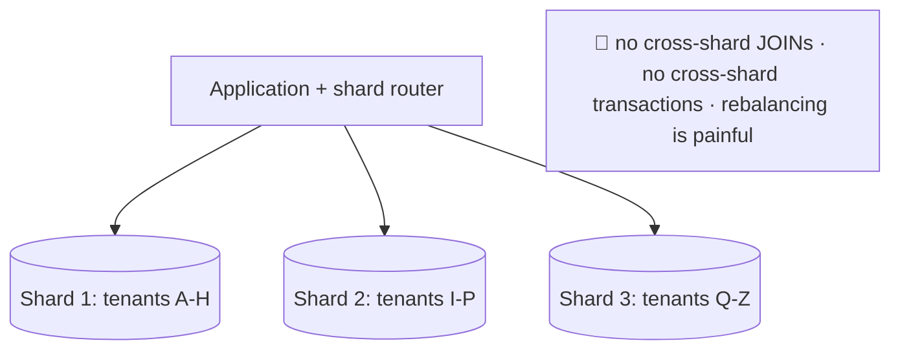

<!-- Module 05 · Lesson 14 — follows ../../../standards/. -->

# 05.14 · Performance & Scaling

[⬅ 05.13 Database Security](05.13-database-security.md) · [🏠 Module](../README.md) · [🗺 Roadmap](../../../ROADMAP.md) · [Next ➡](05.15-vector-databases.md)

> Your database is the bottleneck long before your application is. This lesson covers the scaling toolkit — **caching, connection pooling, read replicas, partitioning, sharding, replication** — in the order you should actually apply them, with the trade-offs each one costs you.

| | |
|---|---|
| **Module** | `05 · Databases & Data Engineering` |
| **Lesson** | `05.14` |
| **Difficulty** | ⭐⭐⭐⭐ |
| **Estimated study time** | 55 min read |
| **Status** | 🟢 stable |

---

## 1. Learning Objectives

By the end of this lesson you will be able to:

- [ ] Apply the scaling techniques **in the right order** (cheapest/safest first).
- [ ] Configure **connection pooling** and explain why it's essential.
- [ ] Use **read replicas** and understand replication lag.
- [ ] Explain **partitioning** vs **sharding** and when each applies.
- [ ] Reason about the trade-offs each scaling step imposes.

## 2. Prerequisites

- [05.5 Query Optimization](05.5-query-optimization.md), [05.6 Transactions](05.6-transactions.md); [Module 02.11 System Design](../../02-Computer-Science/weeks/02.11-system-design-basics.md).

---

## 3. Why This Topic Exists

Application servers scale easily — they're stateless, so you add more ([Module 02.11](../../02-Computer-Science/weeks/02.11-system-design-basics.md)). The **database is stateful**, and that makes it the hardest thing to scale and the usual bottleneck. Scaling it badly (jumping straight to sharding) adds enormous complexity for problems that indexes and caching would have solved.

The professional skill is applying the techniques **in the right order** — each step is more powerful and more costly than the last.

> [!IMPORTANT]
> **The scaling ladder — climb it in order:**
> **1. Optimize queries/indexes** ([05.5](05.5-query-optimization.md)) → **2. Cache** ([Module 02.11](../../02-Computer-Science/weeks/02.11-system-design-basics.md)) → **3. Connection pooling** → **4. Scale up** (bigger machine) → **5. Read replicas** → **6. Partitioning** → **7. Sharding** (last resort).
> Each rung is more complex and less reversible. **Most teams that shard should have added an index.** Sharding is the nuclear option — it fragments your data, breaks JOINs and transactions across shards, and permanently complicates every query. Exhaust the earlier rungs first.

## 4. Rungs 1–2: Indexes and Caching

Already covered, but they're the *first* answers and solve most problems:

| Technique | Impact |
|---|---|
| **Indexes** ([05.5](05.5-query-optimization.md)) | O(n) → O(log n); often 100–1000× on a single query |
| **Caching** (Redis, [05.7](05.7-nosql.md)) | Eliminates the query entirely — the cheapest "database work" is work you don't do |



> [!TIP]
> **For AI systems, caching is the highest-ROI scaling move** ([Module 02.11](../../02-Computer-Science/weeks/02.11-system-design-basics.md)): cache identical LLM prompts, embeddings, and retrieval results, plus hot DB reads. A cache hit costs microseconds and $0; the alternative is a database query *and* possibly a paid model call. Also consider **materialized views** ([05.4](05.4-advanced-sql.md)) — an in-database cache for expensive aggregations.

---

## 5. Rung 3: Connection Pooling (Do This Early)

Every database connection is expensive — Postgres forks a **process** per connection ([Module 02.6](../../02-Computer-Science/weeks/02.6-operating-systems.md)), each consuming memory. Opening a connection per request exhausts the server fast.



| Without pooling | With pooling |
|---|---|
| A connection per request | Connections reused from a pool |
| Connection setup cost per request | Setup paid once |
| Hundreds of idle processes | A small, bounded set |
| Server hits `max_connections` → outage | Bounded, stable |

> [!IMPORTANT]
> **Connection pooling is mandatory, not optional — and it's the #1 forgotten scaling step.** Postgres handles a few hundred connections well; a serverless or async app ([Module 01.12](../../01-Advanced-Python/weeks/01.12-async.md)) can trivially try to open thousands, hitting `max_connections` and taking the database down. Use a pooler (**PgBouncer**, or your framework's built-in pool). This is also why you must **never hold a connection during a slow external call** (an LLM API! [05.6](05.6-transactions.md)) — it starves the pool. Bound your concurrency ([Module 01.12](../../01-Advanced-Python/weeks/01.12-async.md)) to what the pool can serve.

---

## 6. Rung 4–5: Scale Up, Then Read Replicas

### Scale up (vertical)

The simplest step: a bigger machine (more RAM/CPU/faster disk). Databases benefit *enormously* from RAM (more of the working set cached in memory). **Do this before anything architectural** — it's a config change, not a redesign ([Module 02.11](../../02-Computer-Science/weeks/02.11-system-design-basics.md)).

### Read replicas (scale reads horizontally)

Most workloads are **read-heavy**. Replicate the primary to read-only copies and send reads there.

```mermaid
flowchart LR
    APP[Application] -->|writes| P[(PRIMARY)]
    P -->|streaming replication (WAL, 05.6)| R1[(Replica 1)]
    P -->|replication| R2[(Replica 2)]
    APP -->|reads| R1
    APP -->|reads / analytics| R2
```

| ✅ Gains | 🔴 Costs |
|---|---|
| Scales read throughput | **Replication lag** — replicas are slightly stale |
| Isolates analytics from production traffic | Writes still go to the single primary |
| High availability (failover target) | Application must route reads/writes |

> [!WARNING]
> **Replication lag causes the classic "read-your-own-write" bug**: a user updates their profile (write → primary), the app immediately reads it back (read → replica, which hasn't caught up), and the user sees their *old* data — "my change didn't save!" Fix by routing reads that must be fresh to the **primary**, and only sending lag-tolerant reads (analytics, dashboards, listings) to replicas. This is [Module 02.11's eventual consistency](../../02-Computer-Science/weeks/02.11-system-design-basics.md) biting in practice.

> [!TIP]
> **A read replica is the right way to run analytics without hurting production** ([05.9](05.9-warehouses-lakes.md)) — point your heavy dashboard queries at a replica so a runaway aggregation can't slow down live users. For many teams, this postpones the need for a warehouse considerably.

---

## 7. Rung 6: Partitioning (Split a Table, One Database)

**Partitioning** splits one large table into smaller physical pieces (usually by date) *within the same database* — transparent to queries.



| ✅ Gains | 🔴 Costs |
|---|---|
| **Partition pruning** — scan only relevant partitions | Some query/DDL complexity |
| Drop old data instantly (`DROP PARTITION` vs a slow `DELETE`) | Partition key must suit your queries |
| Smaller indexes per partition | Doesn't scale *writes* beyond one machine |

> [!IMPORTANT]
> **Partition huge, time-series-like tables by date** — which describes most AI data (LLM call logs, events, evaluations, [05.8](05.8-data-modeling.md)). Two big wins: queries filtered by date scan only the relevant partitions (**pruning**), and **data retention becomes instant** — dropping last year's data is a `DROP TABLE` on a partition, not a `DELETE` of 200M rows that bloats the table ([05.6 MVCC](05.6-transactions.md)). Partitioning stays within one database, so it keeps JOINs and transactions intact — a huge advantage over sharding.

---

## 8. Rung 7: Sharding (Split Across Machines — Last Resort)

**Sharding** splits data across *multiple databases* by a shard key (e.g., `tenant_id`). It's the only way to scale **writes** beyond one machine — and it's expensive in complexity.



| ✅ Gains | 🔴 Costs (severe) |
|---|---|
| Scales writes and storage horizontally | **No cross-shard JOINs** |
| No single-machine limit | **No cross-shard transactions/ACID** ([05.6](05.6-transactions.md)) |
| | Application must route every query |
| | Rebalancing/resharding is hard and risky |
| | Operational complexity multiplies |

> [!CAUTION]
> **Sharding is a last resort, and choosing a bad shard key is nearly irreversible.** It fragments your data model: queries spanning shards become application-level scatter-gather, JOINs across shards are impossible, and transactions can't span shards ([05.6](05.6-transactions.md)). Pick a shard key that keeps related data together (usually `tenant_id`/`customer_id` — so one customer's data lives on one shard) and distributes evenly (avoid **hot shards** where one huge tenant overloads a machine). **Before sharding, verify you've truly exhausted indexes, caching, pooling, vertical scaling, replicas, and partitioning** — the vast majority of teams never need it, and modern Postgres on a big machine goes remarkably far.

---

## 9. Replication (Beyond Read Scaling)

**Replication** copies data to other servers — for read scaling (§6), **high availability** (failover if the primary dies), and **disaster recovery** ([05.13](05.13-database-security.md)).

| Mode | Trade-off |
|---|---|
| **Asynchronous** | Fast writes; small risk of data loss on failover; replicas lag |
| **Synchronous** | No data loss; slower writes (waits for the replica to confirm) |

> [!NOTE]
> This is the **CAP** trade-off ([05.7](05.7-nosql.md)) and the durability/latency tension made concrete: synchronous replication guarantees a committed write exists on two machines (safe) but every commit waits for the network round-trip ([Module 02.7](../../02-Computer-Science/weeks/02.7-networking.md)); asynchronous is fast but a primary crash can lose the last few transactions. Choose based on your **RPO** ([05.13](05.13-database-security.md)) — for financial/credit data, synchronous; for logs/analytics, asynchronous.

---

## 10. Common Mistakes & Best Practices

| Mistake | Better |
|---|---|
| Sharding before indexing | Climb the ladder in order |
| No connection pooling | Use PgBouncer / framework pool |
| Reads on replicas that need freshness | Route critical reads to the primary |
| Analytics on the production primary | Read replica (or warehouse, [05.9](05.9-warehouses-lakes.md)) |
| `DELETE` of old rows on a huge table | Partition by date; `DROP` the partition |
| Bad shard key (hot shards) | Choose an even, locality-preserving key |
| Holding a connection during an LLM call | Do external work outside; bound concurrency |
| Ignoring autovacuum/bloat | Monitor it ([05.6](05.6-transactions.md)) |

## 11. Performance Considerations

| Principle | Takeaway |
|---|---|
| The cheapest query is the one you don't run | Cache ([Module 02.11](../../02-Computer-Science/weeks/02.11-system-design-basics.md)) |
| RAM is king | More RAM = more of the working set in memory |
| Reads scale easily; writes don't | Replicas scale reads; only sharding scales writes |
| Partition pruning | Scan less data ([Module 02.1](../../02-Computer-Science/weeks/02.1-how-computers-work.md)) |
| Bounded concurrency | Match app concurrency to the pool ([Module 01.12](../../01-Advanced-Python/weeks/01.12-async.md)) |

## 12. Security Considerations

| Risk | Guidance |
|---|---|
| Replicas as an expanded attack surface | Secure every replica like the primary ([05.13](05.13-database-security.md)) |
| Pooler in the network path | Secure PgBouncer; TLS end-to-end |
| Cache holding sensitive data | Scope keys per tenant; TTL; don't cache secrets |
| Connection exhaustion as DoS | Pooling + rate limits + statement timeouts |
| Cross-tenant leakage in a shared cache | Include tenant in the cache key ([05.13](05.13-database-security.md) RLS) |

> [!CAUTION]
> **A shared cache is a cross-tenant leak waiting to happen** — if your cache key is just the query text and not the *tenant*, one customer's cached result can be served to another. Always include the tenant/user in cache keys, mirroring the RLS boundary ([05.13](05.13-database-security.md)). This bug is subtle, silent, and severe.

## 13. Interview Questions

**Beginner**
1. Why is the database usually the bottleneck rather than the app servers?
2. What is connection pooling and why is it necessary?

**Intermediate**
1. What is replication lag, and what bug does it cause?
2. Partitioning vs sharding — what's the difference?

**Advanced**
1. Give the scaling ladder in order and justify the ordering.
2. Why is sharding a last resort, and how do you choose a shard key?

**System-design prompt**
- Your AI product's Postgres is at 90% CPU with growing latency. Design the scaling plan. — *Follow-ups:* What do you check first? Where does caching/pooling fit? When would you add a replica, partition, or shard? What breaks if you shard?

## 14. Summary

| Key idea | Takeaway |
|---|---|
| Climb the ladder in order | Index → cache → pool → scale up → replicas → partition → shard |
| Caching | Highest ROI, especially for AI |
| Connection pooling | Mandatory; the #1 forgotten step |
| Read replicas | Scale reads; beware replication lag |
| Partitioning | Split a table by date — pruning + instant retention |
| Sharding | Last resort; breaks JOINs/transactions |
| Replication | Read scaling + HA + DR; sync vs async trade-off |

## 15. Cheat Sheet

```text
★ THE SCALING LADDER (climb IN ORDER — each rung is more complex & less reversible):
  1 INDEXES/query optimization (05.5) → 2 CACHE (Redis/materialized views — highest ROI!) →
  3 CONNECTION POOLING (mandatory!) → 4 SCALE UP (bigger machine — RAM is king) →
  5 READ REPLICAS → 6 PARTITIONING → 7 SHARDING (LAST RESORT)
  ⚠️ "most teams that shard should have added an index"
CONNECTION POOLING (PgBouncer): Postgres = 1 PROCESS per connection → serverless/async apps exhaust max_connections
  ⚠️ NEVER hold a connection during a slow LLM/network call (starves the pool) · bound app concurrency to pool size
READ REPLICAS: primary(writes) → streaming replication (WAL) → replicas(reads/analytics)
  ⚠️ REPLICATION LAG → "read-your-own-write" bug (user's update seems lost) → route fresh-critical reads to the PRIMARY
  ✅ run heavy analytics on a replica (protects production)
PARTITIONING (one DB, split a table — usually BY DATE): partition PRUNING (scan only relevant) +
  ★ instant retention (DROP the partition vs a slow bloating DELETE) · keeps JOINs/transactions intact
SHARDING (across machines, by shard key — the ONLY way to scale WRITES):
  🔴 NO cross-shard JOINs · NO cross-shard transactions · app routes queries · rebalancing is painful
  shard key: keep related data together (tenant_id) + even distribution (avoid HOT SHARDS) · nearly irreversible
REPLICATION modes: ASYNC(fast writes, small data-loss risk, lag) vs SYNC(no loss, slower) → choose by RPO (05.13)
SECURITY: ⚠️ include TENANT in cache keys (shared cache = cross-tenant leak!) · secure replicas like the primary
```

## 16. Flashcards

- **Q:** State the scaling ladder in order. — **A:** Indexes/query optimization → caching → connection pooling → scale up → read replicas → partitioning → sharding (last resort).
- **Q:** Why is connection pooling mandatory? — **A:** Postgres forks a process per connection; without a pool, an async/serverless app opens thousands, exhausts `max_connections`, and takes the database down.
- **Q:** What bug does replication lag cause? — **A:** "Read-your-own-write" — a user writes to the primary, immediately reads from a lagging replica, and sees stale data ("my change didn't save").
- **Q:** Partitioning vs sharding? — **A:** Partitioning splits one table into pieces *within one database* (keeps JOINs/transactions, enables pruning and instant retention); sharding splits data *across machines* (scales writes but breaks cross-shard JOINs and transactions).
- **Q:** Why is sharding a last resort? — **A:** It fragments the data model — no cross-shard JOINs or transactions, the app must route every query, rebalancing is risky, and a bad shard key is nearly irreversible.
- **Q:** What's the cache-key trap in multi-tenant systems? — **A:** Keying the cache only by query text lets one tenant's cached result be served to another — always include the tenant in the cache key.

## 17. Hands-on Exercises

> Full set in [`../exercises/`](../exercises/).

- [ ] **(⭐ Pooling)** Run an app without pooling and exhaust connections; add PgBouncer/a pool and show stability under the same load.
- [ ] **(⭐⭐ Replica)** Set up a read replica; measure replication lag; reproduce the read-your-own-write bug and fix the routing.
- [ ] **(⭐⭐⭐ Partitioning)** Partition a large table by month; show partition pruning in `EXPLAIN`; drop an old partition instantly vs a slow `DELETE`.
- [ ] **(⭐⭐ Cache)** Add a Redis cache in front of a hot query; measure hit-rate and latency; include the tenant in the key.
- [ ] **(⭐⭐⭐ Ladder)** For a slow system, write the diagnosis and the ordered plan (which rung, why, what it costs).

## 18. Mini Project

> **Scale a slow AI backend.** Given a Postgres-backed AI service under load (simulate with a load generator): profile it, then climb the ladder — add missing indexes ([05.5](05.5-query-optimization.md)), a Redis cache (tenant-scoped keys), connection pooling, and a read replica for analytics; partition the events table by date. Measure p95 latency and throughput at each step and document what each rung bought you and what it cost. Deliverable: a scaling report with before/after numbers — exactly the artifact you'd present after a real capacity incident.

## 19. References

- Kleppmann, *DDIA* Ch. 5–6 (replication, partitioning) — the definitive treatment ([reference standards](../../../standards/reference-standards.md)).
- PostgreSQL docs — partitioning, streaming replication; PgBouncer docs.
- [Module 02.11 · System Design Basics](../../02-Computer-Science/weeks/02.11-system-design-basics.md).

## 20. What's Next

One thing relational databases genuinely *can't* do well: semantic similarity search. The final concept lesson previews **vector databases** — embeddings, similarity search, and why SQL isn't enough — the bridge to RAG.

➡️ **Next:** [05.15 · Vector Database Preview](05.15-vector-databases.md)

---

### 🔁 Revision checklist
- [ ] I climb the scaling ladder in order (never shard first)
- [ ] I always use connection pooling
- [ ] I understand replication lag and route reads accordingly
- [ ] I know partitioning vs sharding and their trade-offs

### 🔗 Spaced-repetition callback
> Recall [Module 02.11's horizontal scaling and caching](../../02-Computer-Science/weeks/02.11-system-design-basics.md): stateless app servers scale trivially, which is *why* the stateful database becomes the bottleneck — and why caching (the same "biggest win" from Module 02) tops the ladder. Replication lag is eventual consistency ([05.7 CAP](05.7-nosql.md)) in daily practice.
