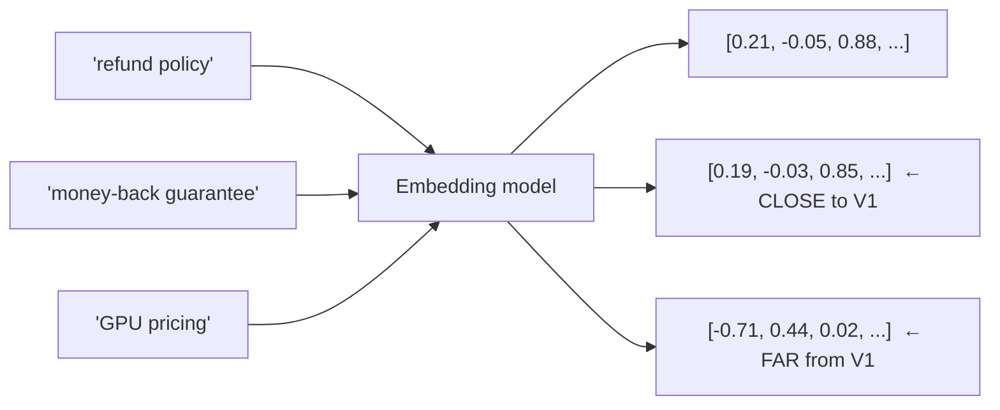
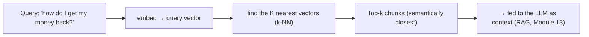
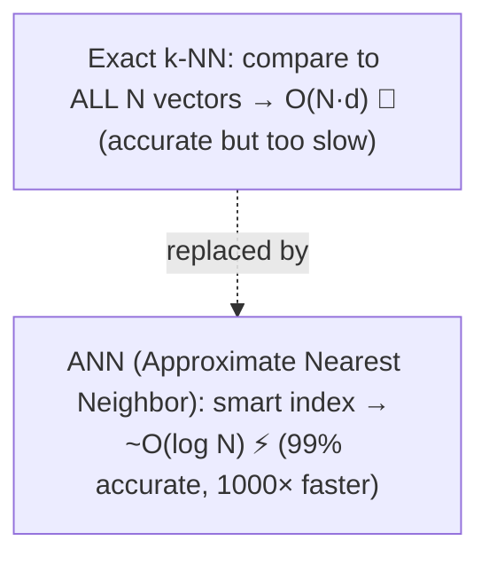
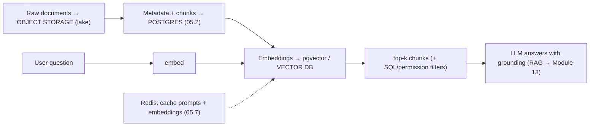

<!-- Module 05 · Lesson 15 — follows ../../../standards/. -->

# 05.15 · Vector Database Preview

[⬅ 05.14 Performance & Scaling](05.14-performance-scaling.md) · [🏠 Module](../README.md) · [🗺 Roadmap](../../../ROADMAP.md) · [Next ➡](05.16-projects-summary.md)

> There's one thing relational databases genuinely cannot do: find text that *means* the same thing. This lesson introduces **embeddings** and **similarity search**, explains why SQL's exact-match model fails at semantics, and previews **vector databases** — the bridge from this module to [RAG](../../13-RAG/README.md).

| | |
|---|---|
| **Module** | `05 · Databases & Data Engineering` |
| **Lesson** | `05.15` |
| **Difficulty** | ⭐⭐⭐ |
| **Estimated study time** | 40 min read |
| **Status** | 🟢 stable |

---

## 1. Learning Objectives

By the end of this lesson you will be able to:

- [ ] Explain what an **embedding** is, conceptually.
- [ ] Explain **similarity search** and the metrics used (cosine distance).
- [ ] Articulate **why SQL/keyword search is insufficient** for semantic search.
- [ ] Describe what a **vector database** does and how **ANN indexes** (HNSW) work at a high level.
- [ ] Place vector search in the AI data stack — and know what's coming in [Module 13](../../13-RAG/README.md).

> [!NOTE]
> **This is a *preview*, deliberately.** Embeddings are covered properly in [Module 10 · NLP](../../10-NLP/README.md), and retrieval systems in depth in [Module 13 · RAG](../../13-RAG/README.md). Here we only establish *what problem vector databases solve* and *why they belong in your data architecture* — completing the storage picture this module has been building.

## 2. Prerequisites

- [05.1 Introduction](05.1-introduction.md) (structured vs unstructured data) and [05.5 Query Optimization](05.5-query-optimization.md) (indexes).

---

## 3. Why This Topic Exists

Everything in this module so far assumes you can *describe* what you want: `WHERE status = 'active'`, `WHERE title LIKE '%invoice%'`. But the defining AI use case is different: *"find the documents that are **about** refund policies"* — where the relevant document might say "money-back guarantee" and never contain the word "refund" at all.

No `WHERE` clause can express that, because meaning isn't a string match. Solving it requires representing *semantics* numerically — **embeddings** — and a database that can search that numeric space efficiently.

> [!IMPORTANT]
> **Relational databases match *exact values*; AI needs to match *meaning*.** `LIKE '%refund%'` finds the literal characters; it misses "money-back," "reimbursement," and "return my payment" — and it happily matches "refund" in an irrelevant context. Semantic search requires a fundamentally different mechanism: convert text into a vector that captures *meaning*, then find the vectors that are *closest*. That's the entire idea, and it's why a new database category exists.

## 4. Embeddings — Meaning as Coordinates

An **embedding** is a list of numbers (a vector, e.g. 1,536 dimensions) produced by a model, positioned so that **semantically similar things land near each other** in that space.



| Property | Meaning |
|---|---|
| **Dense vector** | Hundreds–thousands of floats |
| **Semantic proximity** | Similar meaning → nearby vectors |
| **Deterministic** | Same text + same model → same vector (so it's cacheable! [05.11](05.11-data-pipelines.md)) |
| **Model-specific** | Vectors from different models are *not* comparable |

> **Illustration placeholder** — `assets/images/embedding-space.png`: a 2-D projection of an embedding space showing clusters — "refund/money-back/reimbursement" tightly grouped, "GPU/pricing/hardware" in a distant cluster — with a query vector landing inside the first cluster, illustrating semantic proximity.

> [!IMPORTANT]
> The key intuition: **an embedding turns meaning into geometry.** "Find documents about refunds" becomes "find the vectors nearest to the query's vector" — a *distance* computation, not a string comparison. This is what lets you retrieve "money-back guarantee" for a "refund" query. (*How* models produce these vectors is [Module 10 · NLP](../../10-NLP/README.md); that they're **deterministic** matters here — it's why you cache and content-hash them, [05.11](05.11-data-pipelines.md).)

---

## 5. Similarity Search

To find similar items, you measure the **distance** between vectors.

| Metric | Meaning |
|---|---|
| **Cosine similarity** | The angle between vectors — the most common for text embeddings |
| **Euclidean (L2)** | Straight-line distance |
| **Dot product** | Related to cosine (identical for normalized vectors) |



> [!IMPORTANT]
> This is the core of **RAG** ([Module 13](../../13-RAG/README.md)): embed the user's question, find the **top-k** nearest document chunks, and give those to the LLM as grounding context. Note that "top-k nearest" is exactly the **top-k problem** from [Module 02.3](../../02-Computer-Science/weeks/02.3-data-structures.md) — a heap-based selection — but over *vector distances* instead of scalar scores.

---

## 6. Why Exact Search Doesn't Scale (and ANN Does)

Comparing a query vector to **every** stored vector is **O(N·d)** — for 10 million chunks × 1,536 dimensions, that's ~15 billion multiplications *per query*. Far too slow ([Module 02.5](../../02-Computer-Science/weeks/02.5-complexity.md)).



| Index | How it works |
|---|---|
| **HNSW** (Hierarchical Navigable Small World) | A **graph** ([Module 02.3](../../02-Computer-Science/weeks/02.3-data-structures.md)) you greedily traverse toward nearer neighbors — the dominant method |
| **IVF** (inverted file) | Cluster vectors; search only the nearest clusters |
| **Product quantization** | Compress vectors to save memory (with some accuracy loss) |

> [!IMPORTANT]
> **The "A" in ANN is the whole trick: you accept ~99% accuracy to gain a ~1000× speedup.** Missing the 10th-best match occasionally is irrelevant for RAG (the LLM gets 5 good chunks either way), but a 200 ms query instead of 200 s is the difference between a product and a science experiment. And note what **HNSW** actually is — a **graph** that you traverse greedily toward closer neighbors ([Module 02.3](../../02-Computer-Science/weeks/02.3-data-structures.md)/[02.4 greedy search](../../02-Computer-Science/weeks/02.4-algorithms.md)). The exotic-sounding vector index is a CS data structure you already know.

---

## 7. Vector Databases — and pgvector

A **vector database** stores embeddings with an ANN index and supports similarity queries (usually with metadata filtering).

| Option | Notes |
|---|---|
| **pgvector** (Postgres extension) | ✅ Vectors *in Postgres* — one database, ACID, JOINs, filters, HNSW index |
| Dedicated (Pinecone, Weaviate, Qdrant, Milvus) | Purpose-built; scale to billions; more infrastructure |
| Library (FAISS) | In-process index; no server (great for offline/batch) |

```sql
-- pgvector: semantic search INSIDE Postgres, with normal SQL filters
CREATE EXTENSION vector;
ALTER TABLE chunks ADD COLUMN embedding vector(1536);
CREATE INDEX ON chunks USING hnsw (embedding vector_cosine_ops);   -- ANN index

SELECT id, content
FROM chunks
WHERE document_id IN (SELECT id FROM documents WHERE user_id = 42)  -- ✅ normal SQL filter!
ORDER BY embedding <=> $1                                          -- <=> = cosine distance
LIMIT 5;                                                            -- top-k
```

> [!IMPORTANT]
> **Start with `pgvector`.** It puts vector search *inside the database you already run*, so you get similarity search **plus** SQL filters, JOINs, transactions, and RLS ([05.13](05.13-database-security.md)) — all in one query, one system to operate, one source of truth. That last point is decisive for security: with a dedicated vector DB, you must **re-implement tenant/permission filtering** in a second system, or your RAG retrieval will happily pull another tenant's documents into the prompt. Move to a dedicated vector DB only when scale (hundreds of millions of vectors) or specialized features demand it — the same "don't adopt prematurely" discipline as [05.7](05.7-nosql.md)/[05.9](05.9-warehouses-lakes.md).

---

## 8. Where Vectors Fit in the AI Data Stack

This completes the picture the module has been building since [05.1](05.1-introduction.md):



| Data | Home | Lesson |
|---|---|---|
| Raw documents/files | Object storage | [05.1](05.1-introduction.md)/[05.9](05.9-warehouses-lakes.md) |
| Metadata, chunks, users, permissions | **Postgres** | [05.2](05.2-relational-databases.md) |
| **Embeddings** | pgvector / vector DB | **This lesson** |
| Cached prompts/embeddings | Redis | [05.7](05.7-nosql.md) |
| Usage/eval analytics | Warehouse | [05.9](05.9-warehouses-lakes.md) |

---

## 9. Common Mistakes & Best Practices

| Mistake | Better |
|---|---|
| Expecting SQL `LIKE` to do semantic search | Use embeddings |
| Mixing vectors from different models | Vectors are model-specific — re-embed on model change |
| Adopting a dedicated vector DB immediately | Start with `pgvector` |
| Losing permission filtering in the vector store | Keep filters/RLS with the vectors (pgvector) |
| Re-embedding unchanged content | Content-hash cache — embeddings are deterministic & *paid* ([05.11](05.11-data-pipelines.md)) |
| Ignoring keyword search entirely | **Hybrid search** (vector + keyword) usually beats either alone ([Module 13](../../13-RAG/README.md)) |

## 10. Performance Considerations

| Principle | Takeaway |
|---|---|
| Exact k-NN is O(N·d) | Use an ANN index (HNSW) |
| ANN trades ~1% recall for ~1000× speed | Nearly always the right trade |
| Vectors are large | 1536 floats × 4 bytes ≈ 6 KB/vector — memory matters at scale |
| Embedding is a paid API call | Batch + cache by content hash ([05.11](05.11-data-pipelines.md)) |
| Filter + search together | pgvector does both in one query |

## 11. Security Considerations

| Risk | Guidance |
|---|---|
| **Retrieval bypassing permissions** | Apply the user's access filters/RLS to vector search ([05.13](05.13-database-security.md)) |
| Sensitive content in embeddings | Embeddings can leak information about their source text |
| Cross-tenant retrieval | Scope by tenant in the query *and* the index |
| Prompt injection via retrieved content | A malicious document can carry instructions into the LLM ([Module 19](../../19-Production-AI/README.md)) |

> [!CAUTION]
> **The #1 security bug in RAG systems: retrieval that ignores permissions.** If your vector search returns the top-k *globally* similar chunks without filtering by the requesting user's access rights, your AI assistant will cheerfully summarize another customer's confidential document. Enforce the same authorization boundary on retrieval as on any other data access — which is far easier when vectors live *in* the database that already has RLS ([05.13](05.13-database-security.md)/[Module 13](../../13-RAG/README.md)).

## 12. Interview Questions

**Beginner**
1. What is an embedding, and what does "similar meaning → nearby vectors" mean?
2. Why can't SQL `LIKE` do semantic search?

**Intermediate**
1. What is ANN, and what trade-off does it make?
2. Why start with `pgvector` rather than a dedicated vector database?

**Advanced**
1. What is HNSW, structurally, and why is it fast?
2. What's the biggest security risk in vector retrieval, and how do you prevent it?

**System-design prompt**
- Design the storage and retrieval layer for a multi-tenant RAG product. — *Follow-uses:* Where do documents/chunks/embeddings live? How do you enforce per-tenant permissions on retrieval? How do you avoid re-embedding on every pipeline run? pgvector or dedicated?

## 13. Summary

| Key idea | Takeaway |
|---|---|
| Embedding | Meaning as coordinates — similar text → nearby vectors |
| Similarity search | Find the top-k nearest vectors (cosine distance) |
| SQL can't do it | Exact matching ≠ semantic matching |
| ANN (HNSW) | ~99% accuracy for ~1000× speed; HNSW is a graph |
| pgvector first | Vectors + SQL filters + RLS in one system |
| Security | Retrieval **must** respect the user's permissions |

## 14. Cheat Sheet

```text
PROBLEM: SQL matches EXACT VALUES; AI needs to match MEANING ("refund" must find "money-back guarantee")
EMBEDDING = a dense vector (e.g. 1536 floats) from a model, placed so SIMILAR MEANING → NEARBY VECTORS (meaning as geometry)
  deterministic (same text+model → same vector → CACHEABLE/content-hash!) · model-specific (don't mix models!)
SIMILARITY SEARCH: embed the query → find the TOP-K NEAREST vectors (cosine distance most common) → feed to the LLM = RAG
EXACT k-NN = O(N·d) 🐌 (10M × 1536 = 15B multiplies/query) → ★ ANN (Approximate NN): ~99% recall for ~1000× SPEED
  HNSW = a GRAPH you greedily traverse toward nearer neighbors (Module 02.3/02.4!) · IVF(clusters) · quantization(compress)
VECTOR STORES: ★ pgvector (IN Postgres — vectors + SQL filters + JOINs + ACID + RLS in ONE query/system — START HERE)
  dedicated (Pinecone/Weaviate/Qdrant/Milvus — for hundreds of millions+) · FAISS (in-process library, offline/batch)
  pgvector: CREATE INDEX ... USING hnsw (embedding vector_cosine_ops); ORDER BY embedding <=> $1 LIMIT 5;
AI DATA STACK (complete): raw docs→OBJECT STORAGE · metadata/chunks/users→POSTGRES · embeddings→pgvector/vector DB ·
  cache→REDIS · analytics→WAREHOUSE
★ #1 RAG SECURITY BUG: retrieval that IGNORES PERMISSIONS → returns another tenant's docs into the prompt!
  → apply the user's filters/RLS to vector search (easiest when vectors live in the DB that has RLS)
COST: embedding = a PAID API call → batch + cache by content hash (05.11) · hybrid (vector + keyword) usually beats either
→ FULL TREATMENT: Module 10 (NLP/embeddings) & Module 13 (RAG)
```

## 15. Flashcards

- **Q:** What is an embedding? — **A:** A dense vector produced by a model, positioned so semantically similar text lands nearby — turning meaning into geometry so "closest vectors" = "most similar meaning."
- **Q:** Why can't SQL do semantic search? — **A:** SQL matches exact values/patterns (`LIKE '%refund%'`), so it misses "money-back guarantee" — meaning isn't a string match.
- **Q:** What is ANN and what trade-off does it make? — **A:** Approximate Nearest Neighbor search — it accepts ~99% recall instead of exact results to gain roughly a 1000× speedup over the O(N·d) exhaustive comparison.
- **Q:** What is HNSW, structurally? — **A:** A navigable graph you traverse greedily toward closer neighbors — the dominant ANN index (a CS graph algorithm, not magic).
- **Q:** Why start with pgvector? — **A:** Vectors live in the Postgres you already run, so similarity search combines with SQL filters, JOINs, transactions, and RLS in one system — no second store to secure and sync.
- **Q:** The #1 security bug in RAG retrieval? — **A:** Retrieval that ignores the user's permissions — returning another tenant's confidential chunks into the LLM's context.

## 16. Hands-on Exercises

> Full set in [`../exercises/`](../exercises/).

- [ ] **(⭐ Conceptual)** Explain why `LIKE '%refund%'` fails on a document saying "money-back guarantee"; describe how embeddings fix it.
- [ ] **(⭐⭐ pgvector)** Install `pgvector`; store a few embeddings; run a cosine-distance top-k query.
- [ ] **(⭐⭐ Hybrid/filter)** Combine a vector search with a SQL `WHERE` filter (e.g., only this user's documents) in one query.
- [ ] **(⭐⭐ Index)** Create an HNSW index; compare query latency with and without it (`EXPLAIN`, [05.5](05.5-query-optimization.md)).
- [ ] **(⭐⭐⭐ Security)** Demonstrate the permission-bypass bug (global top-k returning another tenant's chunk), then fix it with a tenant filter/RLS.

## 17. Mini Project

> **Semantic search over your own documents (pgvector).** Build a minimal semantic-search service: chunk a small document set, embed the chunks (**cached by content hash** — [05.11](05.11-data-pipelines.md)), store them in Postgres with `pgvector` + an HNSW index, and expose a top-k similarity query **with a tenant/user permission filter**. Compare results against a keyword (`LIKE`/full-text) baseline on queries where wording differs from the documents. Deliverable: a working search + a short writeup of where semantic search won, where keyword won, and why hybrid is better — the perfect on-ramp to [Module 13 · RAG](../../13-RAG/README.md).

## 18. References

- `pgvector` documentation (github.com/pgvector/pgvector) ([reference standards](../../../standards/reference-standards.md)).
- "Efficient and robust approximate nearest neighbor search using HNSW" (Malkov & Yashunin) — the HNSW paper.
- [Module 10 · NLP](../../10-NLP/README.md) (embeddings) and [Module 13 · RAG](../../13-RAG/README.md) (full retrieval systems).

## 19. What's Next

The concepts are complete. The final lesson assembles the module's **six projects** and consolidates everything for review.

➡️ **Next:** [05.16 · Projects & Summary](05.16-projects-summary.md)

---

### 🔁 Revision checklist
- [ ] I can explain embeddings and similarity search
- [ ] I know why SQL exact-matching can't do semantics
- [ ] I understand ANN/HNSW's accuracy-for-speed trade
- [ ] I'd start with pgvector and enforce permissions on retrieval

### 🔗 Spaced-repetition callback
> Recall [Module 02.3's graphs and top-k heaps](../../02-Computer-Science/weeks/02.3-data-structures.md) and [02.4's greedy search](../../02-Computer-Science/weeks/02.4-algorithms.md): HNSW *is* a graph traversed greedily, and "top-k nearest" *is* the top-k problem. And [05.13's RLS](05.13-database-security.md) is exactly what keeps RAG retrieval from leaking across tenants. The exotic AI database is the CS you already know, plus the security you already learned.
