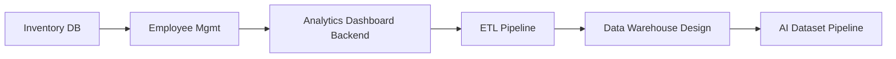
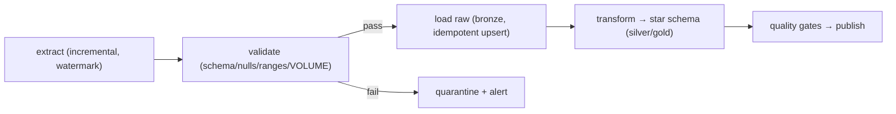
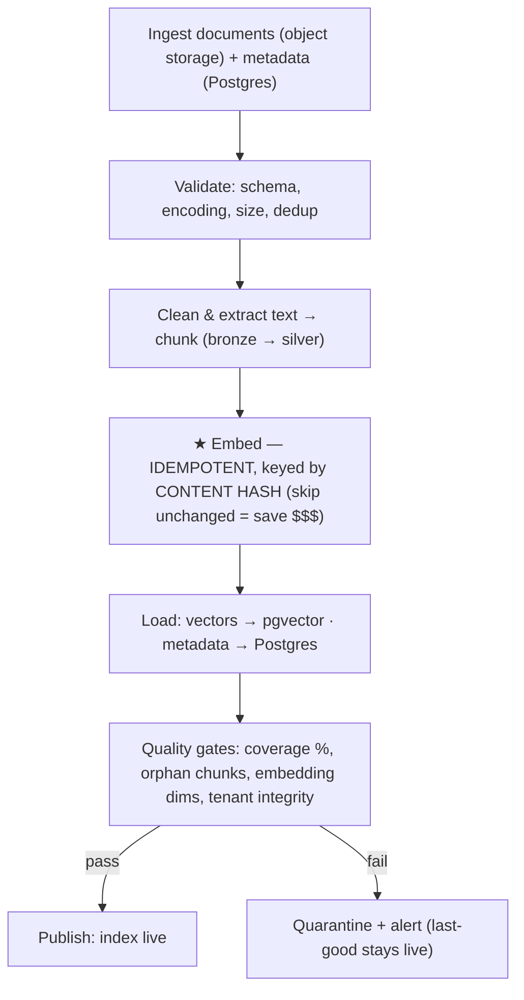
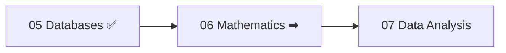

<!-- Module 05 · Lesson 16 — projects + module consolidation. Follows ../../../standards/. -->

# 05.16 · Projects & Module Summary

[⬅ 05.15 Vector Databases](05.15-vector-databases.md) · [🏠 Module](../README.md) · [🗺 Roadmap](../../../ROADMAP.md) · [Next module ➡](../../06-Mathematics/README.md)

> Six projects that turn this module's theory into working data systems, followed by full consolidation: one-page summary, master cheat sheet, interview prep, and your readiness check for Module 06.

| | |
|---|---|
| **Module** | `05 · Databases & Data Engineering` |
| **Lesson** | `05.16` |
| **Difficulty** | ⭐⭐⭐⭐ |
| **Estimated study time** | project time varies · 45 min review |
| **Status** | 🟢 stable |

---

## Part A — Mini Projects

Each project follows the [project standards](../../../standards/project-standards.md) and must include: **folder structure, architecture diagram, database schema (DDL), and a testing strategy.**



| # | Project | Core skills | Lessons |
|---|---|---|:--:|
| 1 | **Inventory Management Database** | schema design, constraints, analytical queries | [05.2](05.2-relational-databases.md)/[05.3](05.3-sql-fundamentals.md) |
| 2 | **Employee Management System** | 3NF normalization, self-referencing FKs, many-to-many | [05.2](05.2-relational-databases.md) |
| 3 | **Analytics Dashboard Backend** | window functions, CTEs, materialized views | [05.4](05.4-advanced-sql.md)/[05.5](05.5-query-optimization.md) |
| 4 | **ETL/ELT Pipeline** | ingestion, validation, idempotency, DAG orchestration | [05.10](05.10-etl-elt.md)/[05.11](05.11-data-pipelines.md) |
| 5 | **Data Warehouse Design** | star schema, facts/dimensions, SCD Type 2 | [05.8](05.8-data-modeling.md)/[05.9](05.9-warehouses-lakes.md) |
| 6 | **AI Dataset Pipeline** ⭐ | end-to-end: chunk → embed (idempotent) → vector store → quality gates | [05.11](05.11-data-pipelines.md)/[05.12](05.12-ai-data-workflows.md)/[05.15](05.15-vector-databases.md) |

---

### Project 1 · Inventory Management Database ⭐⭐

**Goal:** A normalized inventory system with the analytical queries a business actually needs.

```text
inventory-db/
├── schema/           # 01_tables.sql, 02_constraints.sql, 03_indexes.sql
├── seed/             # sample data
├── queries/          # business queries, each with a comment explaining the approach
├── tests/            # assert query results on seed data
└── README.md         # ER diagram + how to run
```

| Requirement | Lesson |
|---|---|
| Products, categories, suppliers, stock movements (3NF) | [05.2](05.2-relational-databases.md) |
| Full constraints (PK/FK/CHECK/UNIQUE) | [05.2](05.2-relational-databases.md) |
| Queries: current stock, below reorder threshold (HAVING), suppliers with no recent deliveries (anti-join), top categories | [05.3](05.3-sql-fundamentals.md) |
| Indexes on filter/join columns; `EXPLAIN` each query | [05.5](05.5-query-optimization.md) |

**Stretch:** stock movements as an append-only ledger; a materialized view for current stock.

---

### Project 2 · Employee Management System ⭐⭐

**Goal:** The classic normalization exercise — and a direct interview rehearsal.

| Requirement | Lesson |
|---|---|
| Employees, departments, roles, salary history | [05.2](05.2-relational-databases.md) |
| **Self-referencing FK** for managers; recursive CTE for the org chart | [05.4](05.4-advanced-sql.md) |
| **Many-to-many** employees ↔ projects (join table) | [05.2](05.2-relational-databases.md) |
| Document the anomalies your 3NF design prevents | [05.2](05.2-relational-databases.md) |

---

### Project 3 · Analytics Dashboard Backend ⭐⭐⭐

**Goal:** The SQL layer for an **AI evaluation dashboard**.

| Requirement | Lesson |
|---|---|
| Schema: models, runs, metrics | [05.2](05.2-relational-databases.md) |
| **Top-N per group** (latest run per model) | [05.4](05.4-advanced-sql.md) |
| `LAG()` for metric deltas; rankings | [05.4](05.4-advanced-sql.md) |
| **Materialized view** for the expensive daily rollup + refresh strategy | [05.4](05.4-advanced-sql.md) |
| Every query `EXPLAIN`ed and indexed | [05.5](05.5-query-optimization.md) |

---

### Project 4 · ETL/ELT Pipeline ⭐⭐⭐⭐

**Goal:** Ingest LLM API call logs into a warehouse schema — reliably.



| Requirement | Lesson |
|---|---|
| Incremental extraction with a watermark (+ lookback for late data) | [05.10](05.10-etl-elt.md) |
| Validation with quarantine on failure | [05.10](05.10-etl-elt.md)/[05.11](05.11-data-pipelines.md) |
| **Idempotent** load (upsert / delete-insert partition) | [05.10](05.10-etl-elt.md) |
| DAG with retries, backfill, freshness/volume monitoring | [05.11](05.11-data-pipelines.md) |
| **Test: run it twice → identical state** | [Module 01.10](../../01-Advanced-Python/weeks/01.10-testing.md) |

---

### Project 5 · Data Warehouse Design ⭐⭐⭐

**Goal:** The analytical model for an AI product's usage.

| Requirement | Lesson |
|---|---|
| Star schema: `fact_llm_calls`, `fact_evaluations` + dims (user, model, prompt version, `dim_date`) | [05.8](05.8-data-modeling.md) |
| **SCD Type 2** on the user dimension | [05.8](05.8-data-modeling.md) |
| Partitioning by date | [05.14](05.14-performance-scaling.md) |
| The 6 key business queries (cost/model, p95 latency/day, quality trend, top users) | [05.4](05.4-advanced-sql.md) |
| A written note on **point-in-time correctness** | [05.12](05.12-ai-data-workflows.md) |

---

### Project 6 · AI Dataset Pipeline ⭐⭐⭐⭐⭐ (flagship)

**Goal:** The end-to-end pipeline that keeps a RAG corpus fresh, correct, and cheap.



| Requirement | Lesson |
|---|---|
| Bronze/silver/gold layering; immutable raw | [05.11](05.11-data-pipelines.md) |
| **Idempotent, content-hash-keyed embedding** (re-run costs $0) | [05.11](05.11-data-pipelines.md) |
| Vectors in `pgvector` with an HNSW index + **tenant permission filter** | [05.15](05.15-vector-databases.md)/[05.13](05.13-database-security.md) |
| Quality gates that block publication | [05.11](05.11-data-pipelines.md) |
| Lineage diagram + cost report | [05.11](05.11-data-pipelines.md) |
| **Tests:** re-run costs nothing; a corrupt batch never publishes; cross-tenant retrieval returns nothing | [Module 01.10](../../01-Advanced-Python/weeks/01.10-testing.md) |

> [!IMPORTANT]
> **Project 6 is the module's flagship and the most directly reusable thing you'll build here.** It combines every thread — schema, pipelines, idempotency, quality, security, and vector search — into the exact data backbone a RAG product needs. You will use this architecture in [Module 13 · RAG](../../13-RAG/README.md) and your capstone ([Module 21](../../21-Capstone-Projects/README.md)).

---

## Part B — Module Consolidation

### One-page summary of Module 05

| Lesson | The one thing to remember |
|---|---|
| **05.1 Introduction** | A DB gives you concurrency, indexed speed, durability, structure, queryability — files don't |
| **05.2 Relational** | Each fact stored **once**; normalize to 3NF; denormalize deliberately |
| **05.3 SQL Fundamentals** | Think in sets; INNER *drops* unmatched rows; WHERE (rows) vs HAVING (groups); parameterize |
| **05.4 Advanced SQL** | CTEs for readability; **window functions** for top-N-per-group and running calcs |
| **05.5 Query Optimization** | `EXPLAIN ANALYZE` first; B-trees; leftmost-prefix; indexes cost writes |
| **05.6 Transactions** | ACID; Read Committed allows the **lost update**; MVCC; never call an API inside a txn |
| **05.7 NoSQL** | Specialized trade-offs; Postgres + Redis + object storage covers most AI needs |
| **05.8 Data Modeling** | OLTP normalizes; OLAP star-schemas; point-in-time correctness prevents leakage |
| **05.9 Warehouses & Lakes** | Columnar storage is the innovation; lakehouse = lake economics + ACID |
| **05.10 ETL & ELT** | Load raw, transform later; **idempotency is non-negotiable** |
| **05.11 Data Pipelines** | Silent failure is the danger; monitor freshness + volume; lineage; quality gates |
| **05.12 AI Data Workflows** | Most AI failures are data failures: **leakage, skew, drift** |
| **05.13 Security** | Never internet-facing; least privilege; RLS; **tested** backups; LLM SQL is untrusted |
| **05.14 Performance & Scaling** | Climb the ladder in order: index → cache → pool → scale up → replica → partition → shard |
| **05.15 Vector DBs** | Embeddings = meaning as geometry; ANN/HNSW; start with pgvector; **retrieval must respect permissions** |

> [!IMPORTANT]
> The through-line of Module 05: **you can now design, query, optimize, secure, and scale the data systems that power AI — and build the pipelines that feed them.** Two themes tie it together: *(1) correctness is engineered, not assumed* (constraints, transactions, idempotency, quality gates, point-in-time joins), and *(2) most AI failures are data failures* (leakage, skew, drift, silent pipeline corruption). Everything in [Module 13 · RAG](../../13-RAG/README.md) and [Module 16 · MLOps](../../16-MLOps/README.md) is built on this foundation.

### Master cheat sheet

> The full one-pager lives at [`../cheat-sheets/databases-cheatsheet.md`](../cheat-sheets/databases-cheatsheet.md).

### Module interview questions (consolidated)

**Beginner**
1. What does a database give you that a file doesn't? Explain normalization to 3NF.
2. INNER vs LEFT JOIN; WHERE vs HAVING.
3. What does ACID guarantee?

**Intermediate**
1. Why is a query slow, and how do you diagnose and fix it (`EXPLAIN`, indexes, leftmost-prefix)?
2. What is the lost update and how do you prevent it?
3. OLTP vs OLAP modeling; star vs snowflake.

**Advanced**
1. Explain data leakage, training/serving skew, and drift — and how each is a data-engineering failure.
2. Give the scaling ladder and justify why sharding is last.
3. How do you safely let an LLM agent query a multi-tenant database?

**System-design prompt**
- Design the complete data architecture for a multi-tenant RAG product: users, documents, chunks, embeddings, conversations, evaluations, analytics. — *Follow-ups:* What lives where (Postgres/object storage/Redis/pgvector/warehouse)? Schema? How do pipelines stay idempotent and monitored? How do you enforce tenant isolation on retrieval? How do you scale it?

---

## Part C — Readiness Check & What's Next

### Module 05 mastery checklist (from memory / on a real database)

- [ ] Explain the five guarantees a database provides
- [ ] Design a normalized (3NF) schema with keys, constraints, and relationships
- [ ] Write JOINs (incl. anti-joins), aggregations, CTEs, and window functions
- [ ] Solve "top-N per group"
- [ ] Read `EXPLAIN ANALYZE` and fix a slow query with the right index
- [ ] Explain ACID, isolation levels, the lost update, deadlocks, and MVCC
- [ ] Compare the NoSQL families and justify a database choice
- [ ] Design a star schema with facts, dimensions, and SCD Type 2
- [ ] Compare warehouse / lake / lakehouse and columnar storage
- [ ] Build an idempotent, validated, monitored pipeline
- [ ] Identify and prevent leakage, skew, and drift
- [ ] Secure a DB (least privilege, RLS, encryption, tested backups, LLM-SQL safety)
- [ ] Apply the scaling ladder in order
- [ ] Explain embeddings, ANN/HNSW, and pgvector — with permission-aware retrieval

### Glossary additions

Module 05 terms added to [GLOSSARY.md](../../../GLOSSARY.md): DBMS, schema, primary/foreign key, normalization (3NF), denormalization, JOIN (inner/left/anti), CTE, window function, materialized view, execution plan, B-tree index, composite/covering index, ACID, isolation level, lost update, MVCC, deadlock, document/key-value/wide-column/graph DB, CAP theorem, OLTP/OLAP, star/snowflake schema, fact/dimension table, SCD Type 2, data warehouse, data lake, lakehouse, columnar storage, ETL/ELT, idempotency, DAG orchestration, data lineage, data quality, data leakage, training/serving skew, data drift, feature store, row-level security, PITR, connection pooling, read replica, partitioning, sharding, embedding, ANN/HNSW, vector database, pgvector.

### Next module preview — 06 · Mathematics

You can engineer the data systems that feed AI. Next you'll build the **mathematical intuition** — linear algebra, calculus, probability, and optimization — that explains what models actually *do* with that data.



> [!IMPORTANT]
> Module 05 completes the **engineering foundations** (Python, CS, Linux, Git, Databases). From Module 06 onward the handbook pivots to **the ML journey** — math → data analysis → machine learning → deep learning → LLMs. You now have every engineering skill needed to *build and ship* AI systems; the next phase teaches you what's *inside* the models.

➡️ **Begin:** [Module 06 · Mathematics](../../06-Mathematics/README.md)

---

### 🔁 Final revision checklist
- [ ] I completed the mastery checklist from memory
- [ ] I built the flagship AI Dataset Pipeline (Project 6)
- [ ] I added Module 05 terms to my flashcards
- [ ] I can design the full data architecture for a RAG product
- [ ] I'm ready for Module 06

### 🔗 Spaced-repetition callback
> Project 6 retrieves the entire module at once — schema ([05.2](05.2-relational-databases.md)), pipelines ([05.11](05.11-data-pipelines.md)), idempotency ([05.10](05.10-etl-elt.md)), quality gates, security/RLS ([05.13](05.13-database-security.md)), and vector search ([05.15](05.15-vector-databases.md)) — and rests on Module 01 (testing, async), Module 02 (B-trees, complexity, races), and Module 04 (versioning data). Building it is the ultimate active-recall exercise ([Module 00.9](../../00-Orientation/weeks/00.9-learning-workflow.md)).
