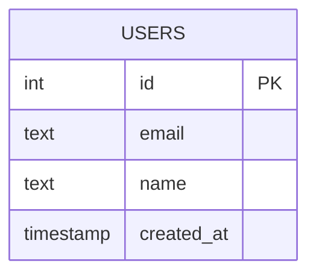
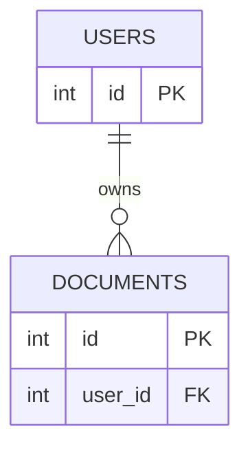
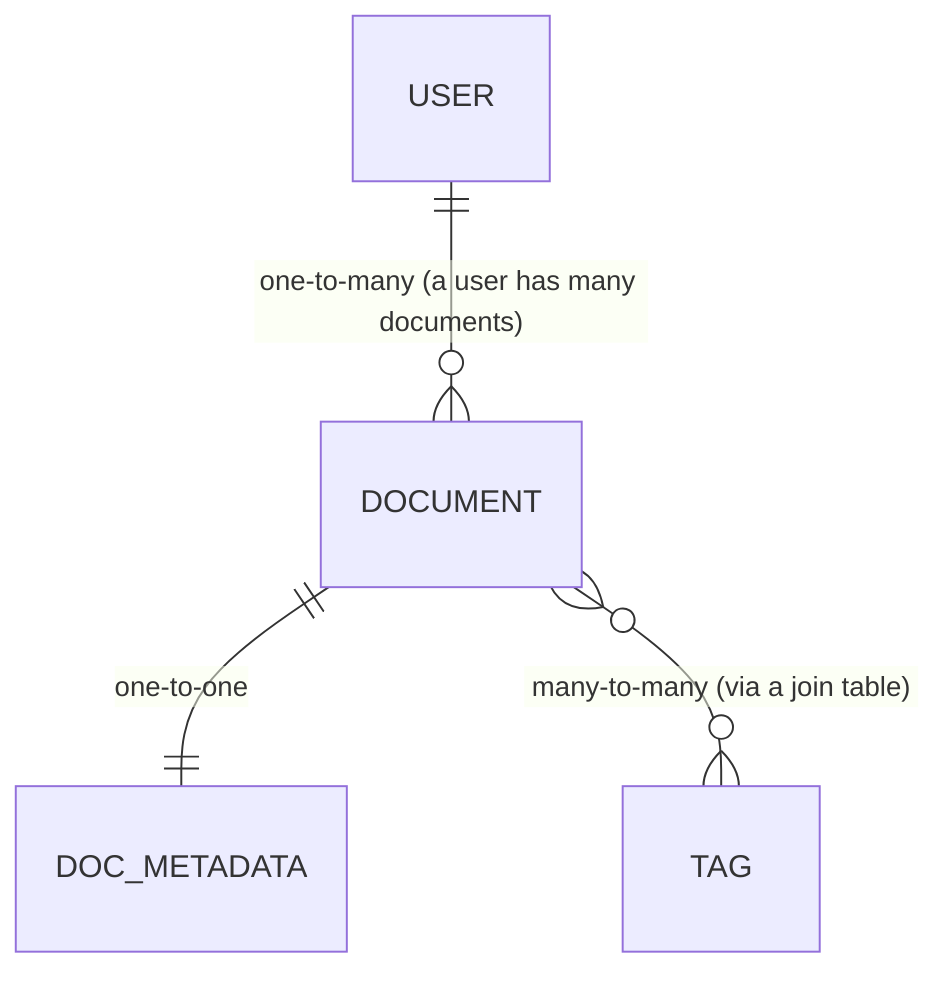
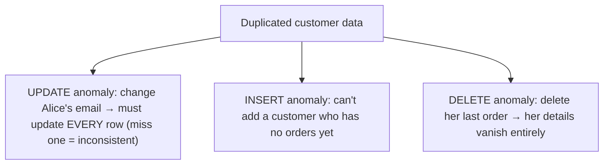
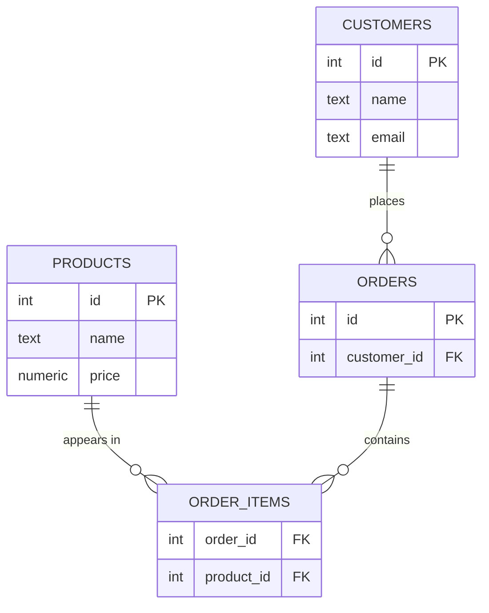
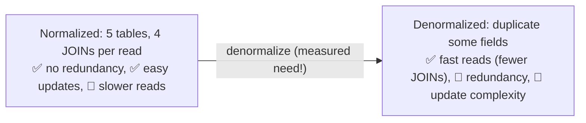

<!-- Module 05 · Lesson 2 — follows ../../../standards/. -->

# 05.2 · Relational Databases

[⬅ 05.1 Introduction](05.1-introduction.md) · [🏠 Module](../README.md) · [🗺 Roadmap](../../../ROADMAP.md) · [Next ➡](05.3-sql-fundamentals.md)

> Tables, keys, and relationships — the model that has powered serious data systems for 50 years. This lesson teaches relational design from first principles, including **normalization** (the discipline that prevents data corruption) and when to deliberately **denormalize** for speed.

| | |
|---|---|
| **Module** | `05 · Databases & Data Engineering` |
| **Lesson** | `05.2` |
| **Difficulty** | ⭐⭐⭐ |
| **Estimated study time** | 60 min read · 30 min practice |
| **Status** | 🟢 stable |

---

## 1. Learning Objectives

By the end of this lesson you will be able to:

- [ ] Explain **tables, rows, columns,** and **data types**.
- [ ] Use **primary keys, foreign keys,** and **constraints** correctly.
- [ ] Model **one-to-one, one-to-many,** and **many-to-many** relationships.
- [ ] Apply **normalization** (1NF → 3NF) and explain the anomalies it prevents.
- [ ] Decide when to **denormalize** and what it costs.

## 2. Prerequisites

- [05.1 Introduction](05.1-introduction.md) and [Module 02.3 Data Structures](../../02-Computer-Science/weeks/02.3-data-structures.md).

---

## 3. Why This Topic Exists

The relational model is the *lingua franca* of data. Get the schema right and everything downstream — queries, performance, integrity — is easier. Get it wrong and you fight your own data forever: duplicated values that drift out of sync, impossible-to-answer queries, and corruption that no amount of application code can fix.

**Normalization** is the formal discipline for getting it right: a set of rules that eliminate redundancy so each fact lives in exactly one place. It sounds academic; it is intensely practical.

> [!IMPORTANT]
> The single organizing principle of relational design: **each fact should be stored exactly once, in exactly one place.** Duplicate a fact (a customer's email in 5 tables) and the copies *will* drift apart — updates miss some, and now your data lies. Normalization is the systematic elimination of that duplication; foreign keys are how you link facts instead of copying them. Almost every relational-design mistake is a violation of this one principle.

## 4. Tables, Rows, Columns

A **table** (relation) is a set of **rows** (records/tuples), each with the same **columns** (fields/attributes), each column having a **type**.



```sql
CREATE TABLE users (
    id          SERIAL PRIMARY KEY,          -- auto-incrementing unique id
    email       TEXT NOT NULL UNIQUE,        -- constraint: required + unique
    name        TEXT NOT NULL,
    created_at  TIMESTAMPTZ NOT NULL DEFAULT now()
);
```

| Concept | Meaning |
|---|---|
| **Table** | A collection of rows with a fixed structure |
| **Row** | One record (one user, one document) |
| **Column** | One attribute, with a **data type** |
| **Data type** | `INT`, `TEXT`, `BOOLEAN`, `TIMESTAMPTZ`, `NUMERIC`, `JSONB`, … |
| **Constraint** | A rule the data must satisfy (`NOT NULL`, `UNIQUE`, `CHECK`) |

> [!TIP]
> **Choose types deliberately** — they're both documentation and enforcement. Use `TIMESTAMPTZ` (timezone-aware) not `TIMESTAMP` for real-world times; `NUMERIC` (exact) not `FLOAT` for money; `TEXT` in Postgres (no perf penalty vs `VARCHAR(n)`); and `JSONB` for genuinely flexible fields ([05.1](05.1-introduction.md)). Constraints (`NOT NULL`, `CHECK (score BETWEEN 0 AND 1)`) catch bad data **at the database**, the last line of defense your application code can't bypass — the same "validate at the boundary" principle as [Module 01.8's Pydantic](../../01-Advanced-Python/weeks/01.8-type-hinting.md).

---

## 5. Keys — Identity and Links

Keys are what make the relational model *relational*.

| Key | Purpose |
|---|---|
| **Primary key (PK)** | Uniquely identifies each row (`id`) — required, unique, never null |
| **Foreign key (FK)** | A column referencing another table's PK — creates the *relationship* |
| **Unique key** | Enforces uniqueness (e.g., `email`) without being the PK |
| **Composite key** | A PK made of multiple columns |
| **Surrogate vs natural key** | Artificial `id` vs a real-world value (email) as PK |

```sql
CREATE TABLE documents (
    id          SERIAL PRIMARY KEY,
    user_id     INT NOT NULL REFERENCES users(id) ON DELETE CASCADE,  -- FOREIGN KEY
    title       TEXT NOT NULL,
    s3_path     TEXT NOT NULL             -- the file lives in object storage (05.1)
);
```



> [!IMPORTANT]
> **Foreign keys enforce *referential integrity*** — the database *guarantees* that `documents.user_id` always points to a real user. You cannot insert a document for a nonexistent user, and `ON DELETE CASCADE` defines what happens when the user is deleted. This is a correctness guarantee your application code cannot provide reliably (race conditions, bugs, other clients). **Prefer surrogate keys** (an auto-increment/UUID `id`) over natural keys (email) as PKs — natural values change (people change emails), and changing a PK means updating every FK that references it.

---

## 6. Relationships

Three relationship cardinalities cover almost everything:



| Relationship | Implementation |
|---|---|
| **One-to-many** (user → documents) | FK on the "many" side (`documents.user_id`) |
| **One-to-one** (document → metadata) | FK + `UNIQUE` constraint |
| **Many-to-many** (documents ↔ tags) | A **join table** with FKs to both |

```sql
-- Many-to-many requires a join (junction) table:
CREATE TABLE document_tags (
    document_id INT NOT NULL REFERENCES documents(id) ON DELETE CASCADE,
    tag_id      INT NOT NULL REFERENCES tags(id) ON DELETE CASCADE,
    PRIMARY KEY (document_id, tag_id)          -- composite PK prevents duplicates
);
```

> [!IMPORTANT]
> **Many-to-many always needs a third (join) table** — you cannot represent it with a column on either side. This is one of the most common design questions in interviews and real work ("a document has many tags, a tag has many documents"). The join table holds one row per relationship, with a **composite primary key** of the two FKs (preventing duplicate links). Recognizing "this is many-to-many" and reaching for a join table is a core modeling reflex ([05.8](05.8-data-modeling.md)).

---

## 7. Normalization — Eliminating Redundancy

**Normalization** progressively removes redundancy so each fact lives once. Consider this *bad* table:

| order_id | customer_name | customer_email | product | price |
|---|---|---|---|---|
| 1 | Alice | a@x.com | Laptop | 1000 |
| 2 | Alice | a@x.com | Mouse | 25 |

The customer's data is **duplicated**, causing three classic **anomalies**:



### The normal forms

| Form | Rule | Fixes |
|---|---|---|
| **1NF** | Atomic values (no lists in a cell); each row unique | "tags: 'a,b,c'" in one column |
| **2NF** | 1NF + no partial dependency on part of a composite key | Columns depending on only part of the key |
| **3NF** | 2NF + no transitive dependency (non-key → non-key) | `customer_email` depends on `customer_name`, not the order |

Normalized to 3NF:



Now Alice's email exists in **exactly one row**. Change it once, and every order sees the new value.

> [!IMPORTANT]
> **In practice, "normalize to 3NF" is the working rule** — it eliminates the update/insert/delete anomalies without excessive complexity. The informal mnemonic for 3NF: *"every non-key column depends on **the key, the whole key, and nothing but the key**."* Higher normal forms (BCNF, 4NF) exist but rarely matter in application design. Start normalized; denormalize *deliberately* later (§8) if measurements justify it.

---

## 8. Denormalization — Trading Purity for Speed

Normalization optimizes for **correctness and write efficiency**; it costs **read performance** (you must JOIN many tables, [05.3](05.3-sql-fundamentals.md)). **Denormalization** deliberately reintroduces redundancy to make reads faster.



| | Normalized | Denormalized |
|---|---|---|
| Redundancy | None | Deliberate duplication |
| Reads | Slower (JOINs) | Faster (fewer JOINs) |
| Writes/updates | Simple, safe | Must update all copies |
| Risk | — | Data drift/inconsistency |
| Typical use | **OLTP** (apps) | **OLAP** (analytics, [05.9](05.9-warehouses-lakes.md)) |

> [!IMPORTANT]
> **Normalize by default; denormalize only with measured justification** ([Module 01.11 "measure, don't guess"](../../01-Advanced-Python/weeks/01.11-performance.md)). Denormalization is a *performance optimization* that trades away integrity guarantees — you accept redundancy (and the burden of keeping copies in sync) to avoid expensive JOINs. It's routine in **analytics/warehouses** (star schemas are deliberately denormalized, [05.8](05.8-data-modeling.md)/[05.9](05.9-warehouses-lakes.md)) where data is read-heavy and written in bulk. It's a *last resort* in transactional apps — try indexes ([05.5](05.5-query-optimization.md)) and caching ([05.14](05.14-performance-scaling.md)) first.

---

## 9. Why Relational Databases Won

| Reason | Detail |
|---|---|
| **Declarative queries** | Say *what*, not *how* ([05.1](05.1-introduction.md)); the optimizer adapts ([05.5](05.5-query-optimization.md)) |
| **Data integrity** | Constraints + FKs + ACID ([05.6](05.6-transactions.md)) guarantee correctness |
| **Flexibility** | Ad-hoc queries answer questions you didn't anticipate |
| **Mature ecosystem** | 50 years of tooling, expertise, optimization |
| **Standardization** | SQL is portable knowledge |

> [!NOTE]
> The relational model's *flexibility* is underrated: because data is normalized into general-purpose tables, you can answer **questions nobody anticipated** with a new query — no schema migration, no re-modeling. Systems optimized for one access pattern (some NoSQL designs, [05.7](05.7-nosql.md)) are fast for *that* pattern but rigid for new ones. For AI products where the questions keep changing, that flexibility is valuable.

---

## 10. Common Mistakes & Best Practices

| Mistake | Better |
|---|---|
| Duplicating facts across tables | Normalize to 3NF |
| No foreign keys ("we'll handle it in code") | FKs enforce integrity the app can't |
| Natural key (email) as PK | Surrogate key (`id`) — natural values change |
| Storing lists in a column (`"a,b,c"`) | 1NF violation → use a join table |
| Denormalizing prematurely | Measure first; try indexes/caching |
| No constraints (`NOT NULL`, `CHECK`) | Let the DB enforce validity |
| Storing files/blobs in the DB | Object storage + a path column ([05.1](05.1-introduction.md)) |

## 11. Performance Considerations

| Principle | Takeaway |
|---|---|
| More normalization → more JOINs | Costly on read-heavy paths ([05.5](05.5-query-optimization.md)) |
| FKs add write overhead (a check) | Almost always worth the integrity |
| Denormalization speeds reads | At the cost of write complexity/drift |
| Right types & constraints | Smaller rows, better plans |

## 12. Security Considerations

| Risk | Guidance |
|---|---|
| Missing constraints → garbage/injected data | Enforce at the DB ([05.13](05.13-database-security.md)) |
| PII duplicated everywhere | Normalization *reduces* PII sprawl (one place to protect/delete) |
| `ON DELETE CASCADE` surprises | Understand cascade behavior (accidental mass deletion) |
| Over-permissive schema access | Roles/permissions per table ([05.13](05.13-database-security.md)) |

> [!TIP]
> Normalization has a **privacy benefit**: if a user's PII exists in exactly one row, honoring a "delete my data" request (GDPR) is one `DELETE` — whereas denormalized copies scattered across tables make compliance a nightmare. Data-protection law rewards good schema design ([05.13](05.13-database-security.md)).

## 13. Interview Questions

**Beginner**
1. What are primary and foreign keys? What is referential integrity?
2. How do you model a many-to-many relationship?

**Intermediate**
1. Explain 1NF, 2NF, 3NF and the anomalies they prevent.
2. When would you denormalize, and what do you give up?

**Advanced**
1. Why prefer surrogate keys over natural keys?
2. Design a schema for a document-QA app (users, documents, chunks, tags).

**System-design prompt**
- Design the relational schema for an AI product: users, documents, chunks, embeddings-metadata, conversations, evaluations. — *Follow-ups:* Which relationships? Where do FKs go? Normalized or denormalized, and why? Where do the actual files/vectors live?

## 14. Summary

| Key idea | Takeaway |
|---|---|
| One fact, one place | The organizing principle of relational design |
| Keys | PK = identity; FK = relationship + integrity |
| Relationships | 1:many (FK), 1:1 (FK+unique), many:many (join table) |
| Normalization (3NF) | Eliminates update/insert/delete anomalies |
| Denormalization | Faster reads, at the cost of redundancy — measure first |
| Constraints | The DB is the last line of defense for data validity |

## 15. Cheat Sheet

```text
PRINCIPLE: each fact stored EXACTLY ONCE (duplication → drift → data lies)
TABLE(rows × typed columns) · types: TEXT · INT · NUMERIC(money!) · TIMESTAMPTZ(times!) · BOOLEAN · JSONB
CONSTRAINTS (DB = last line of defense): NOT NULL · UNIQUE · CHECK(...) · PRIMARY KEY · REFERENCES(FK)
KEYS: PK(identity — use SURROGATE id, not natural/email) · FK(relationship + REFERENTIAL INTEGRITY) · composite PK
RELATIONSHIPS: 1:MANY → FK on the many side · 1:1 → FK + UNIQUE · MANY:MANY → JOIN TABLE (composite PK of both FKs)
NORMALIZATION (fixes UPDATE/INSERT/DELETE anomalies):
  1NF atomic values (no "a,b,c" in a cell) · 2NF no partial dependency on part of a composite key
  3NF no transitive dependency → "the key, the WHOLE key, and NOTHING BUT the key"
  → NORMALIZE TO 3NF BY DEFAULT (OLTP/apps)
DENORMALIZE (deliberately, measured): duplicate fields → fewer JOINs → faster reads; costs redundancy + update complexity
  → routine in ANALYTICS/warehouses (star schema 05.8), last resort in apps (try indexes 05.5 / caching 05.14 first)
FILES/BLOBS → object storage; store the PATH in the DB (05.1)
```

## 16. Flashcards

- **Q:** The organizing principle of relational design? — **A:** Each fact should be stored exactly once, in exactly one place — duplication leads to copies drifting out of sync.
- **Q:** Primary key vs foreign key? — **A:** PK uniquely identifies a row; FK references another table's PK, creating the relationship and enforcing referential integrity.
- **Q:** How do you model many-to-many? — **A:** With a third "join table" holding FKs to both sides (typically with a composite primary key preventing duplicates).
- **Q:** What three anomalies does normalization prevent? — **A:** Update (change a duplicated fact and miss a copy), insert (can't add data without unrelated data), and delete (deleting a row destroys unrelated facts) anomalies.
- **Q:** State 3NF informally. — **A:** Every non-key column depends on "the key, the whole key, and nothing but the key."
- **Q:** When do you denormalize? — **A:** Deliberately, with measured justification — to speed reads by avoiding JOINs (routine in analytics/warehouses; a last resort in transactional apps).

## 17. Hands-on Exercises

> Full set in [`../exercises/`](../exercises/).

- [ ] **(⭐ Create)** Create `users` and `documents` tables with PKs, an FK, and constraints; insert data; try to violate each constraint.
- [ ] **(⭐⭐ Many-to-many)** Model documents ↔ tags with a join table; insert and query the links.
- [ ] **(⭐⭐ Normalize)** Given a denormalized orders table, normalize it to 3NF; identify the anomalies you eliminated.
- [ ] **(⭐⭐⭐ Design)** Design the schema for an AI document-QA app (users, documents, chunks, conversations); draw the ER diagram.
- [ ] **(⭐⭐ Integrity)** Demonstrate referential integrity: try to insert a document for a nonexistent user; observe the FK rejection.

## 18. Mini Project

> **Employee Management System schema (this module's showcase, v1).** Design and implement a normalized (3NF) schema: employees, departments, roles, projects (many-to-many with employees), salaries (history), and managers (self-referencing FK). Include an ER diagram, `CREATE TABLE` statements with full constraints, seed data, and a list of the anomalies your normalization prevents. This is the classic database-design exercise and a direct interview rehearsal ([05.16](05.16-projects-summary.md)).

## 19. References

- Kleppmann, *Designing Data-Intensive Applications*, Ch. 2 ([reference standards](../../../standards/reference-standards.md)).
- PostgreSQL docs — data types, constraints, DDL.
- *Database Design for Mere Mortals* (Hernandez) — practical normalization.

## 20. What's Next

You can design tables. Now query them: **SQL fundamentals** — SELECT, JOINs, aggregation, and filtering — the language you'll use every day.

➡️ **Next:** [05.3 · SQL Fundamentals](05.3-sql-fundamentals.md)

---

### 🔁 Revision checklist
- [ ] I use PKs, FKs, and constraints correctly
- [ ] I can model 1:1, 1:many, and many:many
- [ ] I can normalize to 3NF and name the anomalies prevented
- [ ] I know when (and when not) to denormalize

### 🔗 Spaced-repetition callback
> Recall [Module 01.8's "validate at the boundary"](../../01-Advanced-Python/weeks/01.8-type-hinting.md): database constraints are that principle at the *data* layer — the last line of defense no buggy application code can bypass. And [Module 02.11's tradeoffs](../../02-Computer-Science/weeks/02.11-system-design-basics.md) reappear as normalization (correctness) vs denormalization (read speed).
