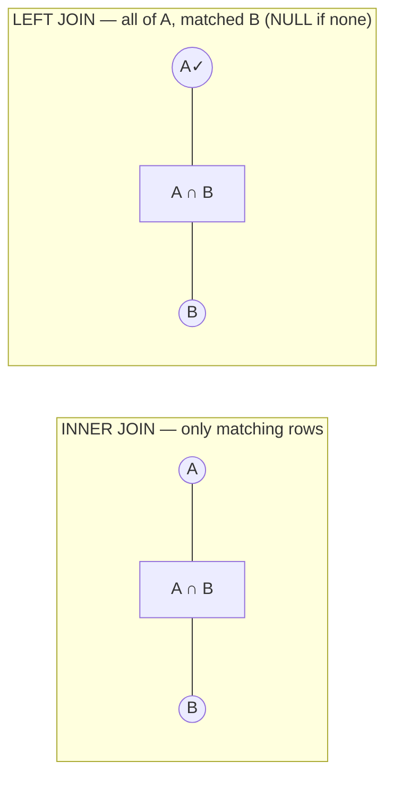
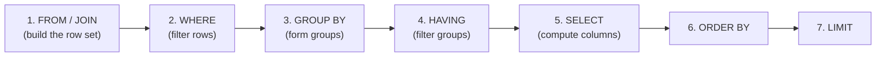

<!-- Module 05 · Lesson 3 — follows ../../../standards/. -->

# 05.3 · SQL Fundamentals

[⬅ 05.2 Relational Databases](05.2-relational-databases.md) · [🏠 Module](../README.md) · [🗺 Roadmap](../../../ROADMAP.md) · [Next ➡](05.4-advanced-sql.md)

> SQL is **declarative**: you describe the result you want, and the database figures out how to get it. This lesson covers the working core — SELECT, INSERT/UPDATE/DELETE, **JOINs**, and aggregation (GROUP BY/HAVING/ORDER BY) — with PostgreSQL examples you should run as you read.

| | |
|---|---|
| **Module** | `05 · Databases & Data Engineering` |
| **Lesson** | `05.3` |
| **Difficulty** | ⭐⭐⭐ |
| **Estimated study time** | 70 min read · 60 min practice |
| **Status** | 🟢 stable |

---

## 1. Learning Objectives

By the end of this lesson you will be able to:

- [ ] Query with **SELECT** (filtering, ordering, limiting).
- [ ] Modify data with **INSERT, UPDATE, DELETE**.
- [ ] Combine tables with **JOINs** (inner, left, right, full).
- [ ] Aggregate with **GROUP BY**, filter groups with **HAVING**.
- [ ] Understand SQL's **logical execution order** (why HAVING ≠ WHERE).

## 2. Prerequisites

- [05.2 Relational Databases](05.2-relational-databases.md) (tables, keys, relationships). A running PostgreSQL.

---

## 3. Why This Topic Exists

SQL is the most durable, portable skill in data — 50 years old and still the way you talk to virtually every database, warehouse, and lakehouse ([05.9](05.9-warehouses-lakes.md)). For an AI Engineer, SQL is how you pull training data, inspect label distributions, join predictions to ground truth, and power your application's queries.

Its power is **declarativeness**: you state *what* you want; the query planner ([05.5](05.5-query-optimization.md)) decides *how*. That means learning SQL is learning to *describe results* — a different (and initially unfamiliar) mode of thinking from imperative Python.

> [!IMPORTANT]
> **Think in *sets*, not loops.** The instinct from Python is "for each row, do X" ([Module 01.5](../../01-Advanced-Python/weeks/01.5-iterators-generators.md)); SQL wants "here is the *set* of rows I want, described by conditions." A `JOIN` isn't a loop over two tables — it's a declaration of how two sets relate. Making this mental shift is the single biggest hurdle in learning SQL, and once it clicks, complex queries become natural.

## 4. SELECT — Reading Data

```sql
-- The workhorse:
SELECT id, email, created_at        -- which columns (avoid SELECT * in production)
FROM users                          -- from which table
WHERE created_at > '2026-01-01'     -- filter rows
  AND email LIKE '%@company.com'    -- pattern match
ORDER BY created_at DESC            -- sort
LIMIT 10;                           -- cap the result
```

| Clause | Purpose |
|---|---|
| `SELECT` | Which columns (or expressions) to return |
| `FROM` | Which table(s) |
| `WHERE` | Filter **rows** (before grouping) |
| `ORDER BY` | Sort (`ASC`/`DESC`) |
| `LIMIT` / `OFFSET` | Pagination |
| `DISTINCT` | Deduplicate rows |

| Operator | Example |
|---|---|
| Comparison | `=`, `<>`, `<`, `>=` |
| `IN` | `WHERE status IN ('active','trial')` |
| `BETWEEN` | `WHERE score BETWEEN 0.5 AND 1.0` |
| `LIKE` / `ILIKE` | Pattern (`%` = any chars); `ILIKE` = case-insensitive (Postgres) |
| `IS NULL` | **Not** `= NULL` (see §8) |

> [!TIP]
> **Avoid `SELECT *` in production code** — it fetches columns you don't need (wasting network/memory, [Module 02.7](../../02-Computer-Science/weeks/02.7-networking.md)), breaks when the schema changes, and prevents *covering-index* optimizations ([05.5](05.5-query-optimization.md)). Name your columns explicitly. `SELECT *` is fine for interactive exploration.

---

## 5. INSERT, UPDATE, DELETE — Writing Data

```sql
-- INSERT
INSERT INTO users (email, name) VALUES ('a@x.com', 'Alice')
RETURNING id;                       -- Postgres: get the generated id back

-- INSERT multiple + handle conflicts (upsert)
INSERT INTO users (email, name) VALUES ('a@x.com', 'Alice2')
ON CONFLICT (email) DO UPDATE SET name = EXCLUDED.name;   -- upsert!

-- UPDATE (⚠️ ALWAYS use WHERE)
UPDATE documents SET title = 'New title' WHERE id = 42;

-- DELETE (⚠️ ALWAYS use WHERE)
DELETE FROM documents WHERE created_at < '2020-01-01';
```

> [!CAUTION]
> **An `UPDATE` or `DELETE` without a `WHERE` clause modifies/destroys EVERY ROW in the table.** This is the classic career-defining database mistake — `DELETE FROM users;` empties your user table instantly. **Safety habits:** (1) write the `WHERE` clause *first*; (2) run it as a `SELECT` first to see exactly which rows match; (3) wrap in a **transaction** so you can `ROLLBACK` ([05.6](05.6-transactions.md)); (4) never run ad-hoc writes on production without review. This is the SQL equivalent of `rm -rf` ([Module 03.5](../../03-Linux/weeks/03.5-essential-commands.md)).

```sql
BEGIN;                                          -- transaction (05.6)
DELETE FROM documents WHERE created_at < '2020-01-01';
-- check the row count! if wrong:
ROLLBACK;                                       -- undo
-- if right:
COMMIT;
```

> [!TIP]
> **`ON CONFLICT ... DO UPDATE` (upsert)** is invaluable in AI pipelines: re-running an ingestion job shouldn't duplicate rows or crash — it should insert new records and update existing ones. This makes pipelines **idempotent** (safe to re-run, [05.11](05.11-data-pipelines.md)) — a critical property when jobs retry after failures.

---

## 6. JOINs — Combining Tables

JOINs are how you reassemble the data that normalization separated ([05.2](05.2-relational-databases.md)) — the heart of relational querying.



| Join | Returns |
|---|---|
| **INNER JOIN** | Only rows with a match in **both** tables |
| **LEFT JOIN** | **All** left rows + matching right (NULLs where no match) |
| **RIGHT JOIN** | All right rows + matching left |
| **FULL OUTER JOIN** | All rows from both (NULLs where no match) |
| **CROSS JOIN** | Cartesian product (every combination) ⚠️ |

```sql
-- Every document with its owner's email (only docs that HAVE an owner):
SELECT d.id, d.title, u.email
FROM documents d
INNER JOIN users u ON d.user_id = u.id;

-- Every user, with their documents — INCLUDING users with zero documents:
SELECT u.email, d.title
FROM users u
LEFT JOIN documents d ON d.user_id = u.id;

-- Find users with NO documents (the "anti-join" pattern):
SELECT u.email
FROM users u
LEFT JOIN documents d ON d.user_id = u.id
WHERE d.id IS NULL;                       -- no match → NULL → these users have none
```

> [!IMPORTANT]
> **INNER vs LEFT is the distinction that matters most in practice.** `INNER JOIN` *drops* rows without a match — so if you inner-join users to documents, users with zero documents **disappear from your results** (a silent, extremely common bug when counting or reporting). `LEFT JOIN` keeps all left-side rows, filling NULLs. The **anti-join** (`LEFT JOIN ... WHERE right.id IS NULL`) is the idiomatic way to find "rows with no match" — e.g., documents that were never embedded, users who never queried. Master these two and you cover 90% of real JOINs.

> [!WARNING]
> **A missing/incorrect JOIN condition produces a CROSS JOIN** — every row of A paired with every row of B (10k × 10k = 100 million rows). This is the classic "my query hung / returned billions of rows" disaster. Always ensure your `ON` clause correctly links the keys.

---

## 7. Aggregation — GROUP BY & HAVING

Aggregation collapses many rows into summary values — how you compute counts, averages, and distributions (e.g., **label distributions** in a training set).

```sql
-- How many documents per user? (only users with more than 5)
SELECT u.email,
       COUNT(d.id)  AS doc_count,       -- aggregate functions
       MAX(d.created_at) AS latest
FROM users u
LEFT JOIN documents d ON d.user_id = u.id
GROUP BY u.email                        -- one output row per group
HAVING COUNT(d.id) > 5                  -- filter GROUPS (after aggregation)
ORDER BY doc_count DESC;
```

| Aggregate | Does |
|---|---|
| `COUNT(*)` / `COUNT(col)` | Rows / non-NULL values |
| `SUM`, `AVG`, `MIN`, `MAX` | Standard aggregates |
| `COUNT(DISTINCT col)` | Unique values |

| Clause | Filters | When |
|---|---|---|
| **`WHERE`** | Individual **rows** | *Before* grouping |
| **`HAVING`** | **Groups** | *After* aggregation |

> [!IMPORTANT]
> **`WHERE` filters rows *before* grouping; `HAVING` filters groups *after* aggregating.** This is a top interview question and a constant source of confusion. You cannot use an aggregate (`COUNT(*) > 5`) in `WHERE` (the aggregate doesn't exist yet); you must use `HAVING`. Conversely, filter rows in `WHERE` when you can — it's cheaper (fewer rows to aggregate). Rule: *row conditions → WHERE; aggregate conditions → HAVING.*

### SQL's logical execution order (why this matters)



> [!TIP]
> This **logical order** (not the written order!) explains SQL's quirks: you can't reference a `SELECT` alias in `WHERE` (WHERE runs first), but you *can* in `ORDER BY` (it runs after SELECT). And `HAVING` can use aggregates because grouping already happened. Internalizing this order turns SQL from a bag of rules into a system you can reason about.

---

## 8. NULL — The Three-Valued Logic Trap

`NULL` means *unknown*, not "zero" or "empty" — and it behaves surprisingly.

```sql
SELECT NULL = NULL;          -- NULL (not TRUE!) — unknown = unknown is unknown
SELECT * FROM t WHERE col = NULL;      -- ❌ returns NOTHING, ever
SELECT * FROM t WHERE col IS NULL;     -- ✅ correct
SELECT COUNT(col) FROM t;              -- ignores NULLs; COUNT(*) counts all rows
SELECT 1 + NULL;                       -- NULL (NULL poisons arithmetic)
COALESCE(col, 0)                       -- ✅ replace NULL with a default
```

> [!WARNING]
> **`= NULL` never matches anything** — you must use `IS NULL` / `IS NOT NULL`. SQL uses *three-valued logic* (TRUE/FALSE/**UNKNOWN**), and any comparison with NULL yields UNKNOWN, which `WHERE` treats as "don't include." NULLs also silently skew aggregates (`AVG` ignores them, `COUNT(col)` skips them) and turn arithmetic into NULL. In AI data work, NULLs are *everywhere* (missing labels, failed extractions) — handle them explicitly with `IS NULL` and `COALESCE`, or they'll silently corrupt your statistics.

---

## 9. Common Mistakes & Best Practices

| Mistake | Consequence | Better |
|---|---|---|
| `UPDATE`/`DELETE` without `WHERE` | Destroys the whole table | Write WHERE first; SELECT first; use a transaction |
| `INNER JOIN` when you needed `LEFT` | Silently drops rows (users with 0 docs) | Choose deliberately |
| Missing JOIN condition | Cartesian explosion | Always specify `ON` correctly |
| `= NULL` | Matches nothing | `IS NULL` |
| Aggregate in `WHERE` | Error | Use `HAVING` |
| `SELECT *` in production | Waste, fragility | Name columns |
| Ignoring NULLs in aggregates | Skewed statistics | `COALESCE`, explicit handling |

- ✅ Format queries readably (uppercase keywords, one clause per line).
- ✅ Use table aliases (`users u`) for readable JOINs.
- ✅ Test destructive statements as `SELECT` first, inside a transaction.

## 10. Performance Considerations

| Principle | Takeaway |
|---|---|
| Filter early (`WHERE`) | Fewer rows to join/aggregate |
| JOIN on indexed keys | FKs/PKs should be indexed ([05.5](05.5-query-optimization.md)) |
| Avoid `SELECT *` | Less I/O; enables covering indexes |
| `LIMIT` for exploration | Don't pull 10M rows into your client |
| Aggregations scan a lot | Indexes and partitioning help ([05.14](05.14-performance-scaling.md)) |

## 11. Security Considerations

| Risk | Guidance |
|---|---|
| **SQL injection** | **Never** build SQL by string concatenation — use parameterized queries |
| Over-broad SELECT of PII | Query only what you need; column-level permissions ([05.13](05.13-database-security.md)) |
| Destructive ad-hoc writes | Restrict production write access; use transactions |

```python
# ❌ SQL INJECTION — never do this
cur.execute(f"SELECT * FROM users WHERE email = '{user_input}'")
#    user_input = "x'; DROP TABLE users; --"  → catastrophe

# ✅ Parameterized query — the driver escapes it safely
cur.execute("SELECT * FROM users WHERE email = %s", (user_input,))
```

> [!CAUTION]
> **SQL injection is one of the oldest and most damaging vulnerabilities** — and it's trivially prevented: *always* use **parameterized queries** (placeholders), never string interpolation/f-strings, for any value that comes from a user, an API, or **an LLM**. This is critical for AI: if an agent or LLM generates SQL or supplies values ([Module 14](../../14-AI-Agents/README.md)), treat that output as untrusted input ([Module 01.8](../../01-Advanced-Python/weeks/01.8-type-hinting.md), [Module 02.9](../../02-Computer-Science/weeks/02.9-serialization.md)) — parameterize it, restrict DB permissions, and never let raw model output become executable SQL.

## 12. Interview Questions

**Beginner**
1. What's the difference between `WHERE` and `HAVING`?
2. INNER JOIN vs LEFT JOIN — when does each drop rows?

**Intermediate**
1. Write a query for "users with no documents."
2. Why doesn't `WHERE col = NULL` work?

**Advanced**
1. Explain SQL's logical execution order and one quirk it explains.
2. How do you prevent SQL injection, and why does it matter for LLM-generated queries?

**System-design prompt**
- Write the queries an AI app needs: label distribution of a training set, documents never embedded, per-user usage counts. — *Follow-ups:* Which JOINs? Where do NULLs bite? How do you keep it fast?

## 13. Summary

| Key idea | Takeaway |
|---|---|
| SQL is declarative | Describe the result; think in sets, not loops |
| SELECT/WHERE/ORDER/LIMIT | The reading workhorse |
| Write ops need `WHERE` | Missing WHERE destroys the table |
| INNER vs LEFT JOIN | INNER drops unmatched rows (silent bug) |
| GROUP BY + HAVING | Aggregate, then filter groups |
| Logical order | FROM→WHERE→GROUP→HAVING→SELECT→ORDER→LIMIT |
| NULL is *unknown* | `IS NULL`, not `= NULL` |
| Parameterize | Never build SQL from strings (injection) |

## 14. Cheat Sheet

```text
SELECT cols FROM t WHERE cond GROUP BY cols HAVING aggcond ORDER BY col DESC LIMIT n;
  operators: = <> < >= · IN (...) · BETWEEN a AND b · LIKE/ILIKE '%x%' · IS NULL
WRITE: INSERT INTO t (cols) VALUES (...) RETURNING id;
  UPSERT: INSERT ... ON CONFLICT (key) DO UPDATE SET c = EXCLUDED.c  → IDEMPOTENT pipelines (05.11)
  ⚠️ UPDATE/DELETE ALWAYS WITH WHERE — no WHERE = whole table! (SELECT first; BEGIN...ROLLBACK/COMMIT)
JOINS (reassemble what normalization split):
  INNER = only matches (⚠️ DROPS unmatched rows — silent bug!) · LEFT = all left + NULLs
  ANTI-JOIN (rows with no match): LEFT JOIN b ON ... WHERE b.id IS NULL
  ⚠️ missing ON condition = CROSS JOIN = cartesian explosion
AGGREGATE: COUNT(*)/COUNT(col)/SUM/AVG/MIN/MAX/COUNT(DISTINCT)
  WHERE filters ROWS (before grouping) · HAVING filters GROUPS (after aggregation)
LOGICAL ORDER: FROM/JOIN → WHERE → GROUP BY → HAVING → SELECT → ORDER BY → LIMIT
NULL = UNKNOWN: NULL = NULL is NULL! → use IS NULL / IS NOT NULL · COALESCE(col, default) · NULLs skew aggregates
SECURITY: ALWAYS parameterized queries (%s), NEVER f-string SQL → injection (esp. LLM-generated values!)
```

## 15. Flashcards

- **Q:** `WHERE` vs `HAVING`? — **A:** `WHERE` filters individual rows *before* grouping; `HAVING` filters groups *after* aggregation (aggregates like `COUNT(*)` can only be used in HAVING).
- **Q:** INNER vs LEFT JOIN? — **A:** INNER returns only rows matching in both tables (silently dropping unmatched rows); LEFT returns all left rows, with NULLs where there's no match.
- **Q:** How do you find rows with no match (anti-join)? — **A:** `LEFT JOIN` the other table and filter `WHERE other.id IS NULL`.
- **Q:** Why does `WHERE col = NULL` return nothing? — **A:** NULL means *unknown*; any comparison with NULL yields UNKNOWN (not TRUE), so no rows match — use `IS NULL`.
- **Q:** SQL's logical execution order? — **A:** FROM/JOIN → WHERE → GROUP BY → HAVING → SELECT → ORDER BY → LIMIT.
- **Q:** How do you prevent SQL injection? — **A:** Always use parameterized queries (placeholders); never build SQL via string interpolation — especially with user or LLM-supplied values.

## 16. Hands-on Exercises

> Full set in [`../exercises/`](../exercises/).

- [ ] **(⭐ SELECT)** Query users created this year, sorted, limited to 10, with specific columns.
- [ ] **(⭐⭐ JOIN)** Write an INNER and a LEFT JOIN of users↔documents; explain the row-count difference.
- [ ] **(⭐⭐ Anti-join)** Find all users with zero documents, and all documents with no tags.
- [ ] **(⭐⭐ Aggregate)** Compute a label distribution (`GROUP BY label, COUNT(*)`) and filter to labels with > 100 examples (`HAVING`).
- [ ] **(⭐⭐⭐ Safety)** Wrap a `DELETE` in a transaction, verify the affected count, and `ROLLBACK`.
- [ ] **(⭐⭐ NULL)** Demonstrate `= NULL` failing and `IS NULL` working; show how NULLs affect `AVG`/`COUNT`.

## 17. Mini Project

> **Inventory Management Database (this module's showcase, v2 — query half).** Extend your schema work ([05.2](05.2-relational-databases.md)) into a working inventory system: products, categories, suppliers, stock movements. Then write the *queries the business needs*: current stock per product (aggregation), products below reorder threshold (HAVING), suppliers with no recent deliveries (anti-join), and top-selling categories. Deliverable: a `queries.sql` with a comment explaining each query's JOIN/aggregation choice. This mirrors real analytical SQL work.

## 18. References

- PostgreSQL documentation — SELECT, JOIN, aggregate functions ([reference standards](../../../standards/reference-standards.md)).
- *SQL for Data Scientists* / *Practical SQL* — applied SQL books.
- Use *pgexercises.com* or *sqlzoo.net* for drills.

## 19. What's Next

You can query and join. Now the professional tools: **advanced SQL** — subqueries, CTEs, **window functions**, views, stored procedures, and triggers — that turn SQL from a query language into an analytical powerhouse.

➡️ **Next:** [05.4 · Advanced SQL](05.4-advanced-sql.md)

---

### 🔁 Revision checklist
- [ ] I think in sets, not loops
- [ ] I choose INNER vs LEFT deliberately and can write an anti-join
- [ ] I know WHERE vs HAVING and the logical execution order
- [ ] I handle NULLs correctly and always parameterize queries

### 🔗 Spaced-repetition callback
> Recall [05.2's normalization](05.2-relational-databases.md): JOINs are how you *reassemble* the facts normalization deliberately separated — the read-time cost of write-time correctness. And [Module 01.8's input validation](../../01-Advanced-Python/weeks/01.8-type-hinting.md) reappears as parameterized queries: never trust external (or LLM) input as code.
