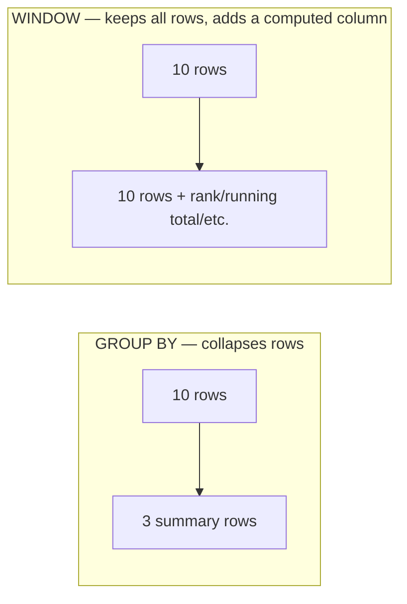

<!-- Module 05 · Lesson 4 — follows ../../../standards/. -->

# 05.4 · Advanced SQL

[⬅ 05.3 SQL Fundamentals](05.3-sql-fundamentals.md) · [🏠 Module](../README.md) · [🗺 Roadmap](../../../ROADMAP.md) · [Next ➡](05.5-query-optimization.md)

> The tools that separate a SQL user from a SQL *engineer*: **CTEs** for readable composition, **window functions** for ranking and running calculations (a superpower for analytics), plus views, stored procedures, and triggers. This is where SQL becomes genuinely powerful.

| | |
|---|---|
| **Module** | `05 · Databases & Data Engineering` |
| **Lesson** | `05.4` |
| **Difficulty** | ⭐⭐⭐⭐ |
| **Estimated study time** | 70 min read · 60 min practice |
| **Status** | 🟢 stable |

---

## 1. Learning Objectives

By the end of this lesson you will be able to:

- [ ] Use **subqueries** (scalar, `IN`, correlated) appropriately.
- [ ] Write readable, composable queries with **CTEs** (`WITH`), including recursive ones.
- [ ] Use **window functions** for ranking, running totals, and row comparisons.
- [ ] Create **views** (and materialized views) to encapsulate logic.
- [ ] Know when **stored procedures** and **triggers** are appropriate — and when they're not.

## 2. Prerequisites

- [05.3 SQL Fundamentals](05.3-sql-fundamentals.md) (JOINs, aggregation, logical order).

---

## 3. Why This Topic Exists

Basic SQL answers simple questions. Real analytical questions are *compositional*: "for each user, rank their documents by score, take the top 3, and compare each to that user's average." Doing this with basic SQL requires convoluted self-joins and temp tables; with **CTEs and window functions** it's clean, readable, and fast.

For AI Engineers, these tools are how you build training sets ("take the most recent N examples per class"), analyze evaluations ("rank model versions by metric, show the delta vs previous"), and deduplicate data — all common, all painful without this lesson.

> [!IMPORTANT]
> **Window functions are the highest-leverage advanced SQL skill.** They let you compute a value *for each row* based on a *window* of related rows — ranking, running totals, previous/next row comparisons — **without collapsing rows** the way `GROUP BY` does. Most engineers never learn them and write slow, convoluted alternatives. Learning them will genuinely change how you write analytical SQL.

## 4. Subqueries

A **subquery** is a query nested inside another.

```sql
-- Scalar subquery (returns one value):
SELECT title, (SELECT COUNT(*) FROM chunks c WHERE c.doc_id = d.id) AS chunk_count
FROM documents d;

-- IN subquery (a set):
SELECT * FROM documents
WHERE user_id IN (SELECT id FROM users WHERE plan = 'pro');

-- EXISTS (often faster than IN for "has any match"):
SELECT * FROM users u
WHERE EXISTS (SELECT 1 FROM documents d WHERE d.user_id = u.id);
```

| Type | Returns | Note |
|---|---|---|
| **Scalar** | One value | Used in `SELECT`/`WHERE` |
| **`IN` / `NOT IN`** | A set | ⚠️ `NOT IN` breaks with NULLs! |
| **`EXISTS`** | Boolean | Often faster; NULL-safe |
| **Correlated** | Re-evaluated per outer row | Can be slow (like a nested loop) |

> [!WARNING]
> **`NOT IN` with NULLs silently returns nothing.** If the subquery returns any NULL, `x NOT IN (1, 2, NULL)` evaluates to UNKNOWN for every row (three-valued logic, [05.3](05.3-sql-fundamentals.md)) — so the query returns zero rows and you think "there's no data." Use **`NOT EXISTS`** (NULL-safe) or an anti-join ([05.3](05.3-sql-fundamentals.md)) instead. This bug is subtle, common, and burns everyone once.

---

## 5. CTEs — Common Table Expressions (`WITH`)

A **CTE** names a subquery, letting you build complex queries as readable, composable steps — like naming intermediate variables in Python.

```sql
WITH recent_docs AS (                      -- step 1: name a result set
    SELECT * FROM documents
    WHERE created_at > now() - interval '30 days'
),
doc_scores AS (                            -- step 2: build on step 1
    SELECT d.user_id, d.id, AVG(e.score) AS avg_score
    FROM recent_docs d
    JOIN evaluations e ON e.doc_id = d.id
    GROUP BY d.user_id, d.id
)
SELECT u.email, s.id, s.avg_score          -- step 3: final query
FROM doc_scores s
JOIN users u ON u.id = s.user_id
WHERE s.avg_score > 0.8;
```


| ✅ CTEs give you | Detail |
|---|---|
| **Readability** | Complex logic as named, linear steps |
| **Reuse** | Reference a CTE multiple times in the query |
| **Composition** | Each CTE builds on the previous |
| **Recursion** | `WITH RECURSIVE` for hierarchies (§6) |

> [!IMPORTANT]
> **CTEs are the single best tool for readable SQL.** A 50-line query with nested subqueries is unmaintainable; the same logic as 4 named CTEs reads top-to-bottom like a Python function with well-named variables ([Module 01.13 readability](../../01-Advanced-Python/weeks/01.13-packaging-code-quality.md)). Prefer CTEs over nested subqueries for anything nontrivial. (Historical note: in older Postgres, CTEs were an *optimization fence*; since PG12 they're inlined and optimized like subqueries, so readability is now free.)

---

## 6. Recursive CTEs — Hierarchies and Graphs

`WITH RECURSIVE` traverses hierarchical/graph data (org charts, category trees, document lineage) — a graph traversal ([Module 02.4 BFS/DFS](../../02-Computer-Science/weeks/02.4-algorithms.md)) expressed in SQL.

```sql
-- All employees under a manager (org chart traversal):
WITH RECURSIVE subordinates AS (
    SELECT id, name, manager_id FROM employees WHERE id = 1   -- base case
    UNION ALL
    SELECT e.id, e.name, e.manager_id                          -- recursive step
    FROM employees e
    JOIN subordinates s ON e.manager_id = s.id
)
SELECT * FROM subordinates;
```

> [!NOTE]
> Recursive CTEs are how you query **self-referencing relationships** ([05.2](05.2-relational-databases.md)) — an employee's `manager_id` pointing at another employee, a category's parent, a document's derivation chain (**data lineage**, [05.11](05.11-data-pipelines.md)). It's BFS/DFS ([Module 02.4](../../02-Computer-Science/weeks/02.4-algorithms.md)) inside the database. For deeply graph-shaped data, a **graph database** ([05.7](05.7-nosql.md)) may be a better fit.

---

## 7. Window Functions — The Superpower

A **window function** computes a value for each row using a "window" of related rows — **without collapsing them** (unlike `GROUP BY`).



```sql
SELECT
    user_id,
    doc_id,
    score,
    -- rank documents within each user (partition), by score
    ROW_NUMBER() OVER (PARTITION BY user_id ORDER BY score DESC) AS rank,
    -- each doc's score vs that user's average
    AVG(score)  OVER (PARTITION BY user_id)                     AS user_avg,
    -- running total over time
    SUM(score)  OVER (PARTITION BY user_id ORDER BY created_at) AS running_total,
    -- compare to the previous row
    LAG(score)  OVER (PARTITION BY user_id ORDER BY created_at) AS prev_score
FROM evaluations;
```

| Function | Computes |
|---|---|
| `ROW_NUMBER()` | Sequential number within the partition |
| `RANK()` / `DENSE_RANK()` | Ranking (with/without gaps for ties) |
| `LAG()` / `LEAD()` | Value from the previous/next row |
| `SUM/AVG/COUNT() OVER (...)` | Running/partitioned aggregates |
| `NTILE(n)` | Bucket rows into n groups (quartiles) |

| `OVER` clause part | Meaning |
|---|---|
| `PARTITION BY x` | Restart the window for each distinct `x` (like GROUP BY, but keeps rows) |
| `ORDER BY y` | Order within the window (needed for running totals, LAG) |

### The killer pattern: top-N per group

```sql
-- Get the top 3 highest-scoring documents PER USER (a classic, hard without windows):
WITH ranked AS (
    SELECT *, ROW_NUMBER() OVER (PARTITION BY user_id ORDER BY score DESC) AS rn
    FROM evaluations
)
SELECT * FROM ranked WHERE rn <= 3;
```

> [!IMPORTANT]
> **"Top N per group" is *the* canonical window-function problem** — and it appears constantly in AI work: the top-3 retrieved chunks per query, the latest evaluation per model, the most recent N examples per class when building a balanced training set. Without window functions it requires ugly correlated subqueries or self-joins; with `ROW_NUMBER() OVER (PARTITION BY ... ORDER BY ...)` it's four lines. Learn this pattern — it's also one of the most-asked SQL interview questions.

---

## 8. Views and Materialized Views

A **view** is a saved query that behaves like a table — encapsulating complex logic behind a simple name.

```sql
CREATE VIEW active_user_stats AS
SELECT u.id, u.email, COUNT(d.id) AS doc_count
FROM users u LEFT JOIN documents d ON d.user_id = u.id
WHERE u.status = 'active'
GROUP BY u.id, u.email;

SELECT * FROM active_user_stats WHERE doc_count > 10;   -- query it like a table

-- MATERIALIZED view: stores the RESULT (fast reads, but must be refreshed)
CREATE MATERIALIZED VIEW daily_metrics AS SELECT ...;
REFRESH MATERIALIZED VIEW daily_metrics;
```

| | View | Materialized view |
|---|---|---|
| Stores | Just the query (runs each time) | The **result** (precomputed) |
| Freshness | Always current | Stale until refreshed |
| Read speed | Same as the query | **Fast** (it's a table) |
| Use for | Encapsulating logic, security | Expensive aggregations read often |

> [!IMPORTANT]
> **Materialized views are a caching mechanism inside the database** ([Module 02.11 caching](../../02-Computer-Science/weeks/02.11-system-design-basics.md)) — precompute an expensive aggregation once, read it instantly many times, refresh periodically. Perfect for dashboards and analytics where slightly-stale data is fine ([05.14](05.14-performance-scaling.md)). Plain **views** are for *abstraction* (hide complex logic, expose only permitted columns — a security tool, [05.13](05.13-database-security.md)), not performance.

---

## 9. Stored Procedures and Triggers (Use Sparingly)

**Stored procedures/functions** are code stored *in* the database; **triggers** run automatically when data changes.

```sql
-- Trigger: automatically maintain an updated_at timestamp
CREATE FUNCTION set_updated_at() RETURNS TRIGGER AS $$
BEGIN
    NEW.updated_at = now();
    RETURN NEW;
END; $$ LANGUAGE plpgsql;

CREATE TRIGGER docs_updated
BEFORE UPDATE ON documents
FOR EACH ROW EXECUTE FUNCTION set_updated_at();
```

| | Good for | Risks |
|---|---|---|
| **Stored procedures** | Data-heavy logic close to the data; enforcing invariants | Hard to version-control/test ([Module 04](../../04-Git/README.md)/[Module 01.10](../../01-Advanced-Python/weeks/01.10-testing.md)); language lock-in |
| **Triggers** | Audit logs, `updated_at`, enforcing invariants | **Hidden side effects** — hard to debug; surprise behavior |

> [!WARNING]
> **Use triggers and stored procedures sparingly.** They create *hidden, implicit behavior*: a developer inserts a row and something else silently happens — invisible in application code, hard to test ([Module 01.10](../../01-Advanced-Python/weeks/01.10-testing.md)), hard to version ([Module 04](../../04-Git/README.md)), and a nightmare to debug ([Module 02.12](../../02-Computer-Science/weeks/02.12-debugging.md)). Modern practice keeps business logic in the *application* (testable, versioned, reviewable) and reserves triggers for narrow, mechanical concerns (`updated_at`, audit trails). If you *do* use them, version the definitions in Git as **migrations** ([05.16](05.16-projects-summary.md)).

---

## 10. Common Mistakes & Best Practices

| Mistake | Better |
|---|---|
| `NOT IN` with possible NULLs | `NOT EXISTS` / anti-join |
| Deeply nested subqueries | CTEs (readable, composable) |
| Self-joins for ranking | Window functions (`ROW_NUMBER`) |
| Business logic in triggers | Keep it in the (testable) application |
| Materialized view assumed fresh | Refresh it; know the staleness |
| Correlated subquery in a hot path | Rewrite as a JOIN (can be O(n²)) |

## 11. Performance Considerations

| Principle | Takeaway |
|---|---|
| Window functions are efficient | Usually beat self-joins/correlated subqueries |
| Correlated subqueries | Re-run per row — can be very slow |
| Materialized views | Trade freshness for speed ([05.14](05.14-performance-scaling.md)) |
| CTEs (modern PG) | Inlined/optimized — readability is free |
| `EXISTS` vs `IN` | `EXISTS` often better for large subquery sets |

## 12. Security Considerations

| Risk | Guidance |
|---|---|
| Views as a security layer | Expose only permitted columns/rows to a role ([05.13](05.13-database-security.md)) |
| Triggers with side effects | Can hide malicious/unexpected behavior — review carefully |
| Stored procs with elevated rights | `SECURITY DEFINER` runs as the owner — audit these |
| Dynamic SQL inside procedures | Injection risk ([05.3](05.3-sql-fundamentals.md)) — parameterize |

> [!TIP]
> **Views are a legitimate security tool**: create a view exposing only non-PII columns (or only a user's own rows) and grant a role access to the *view*, not the underlying table ([05.13](05.13-database-security.md)). This gives fine-grained access control without changing your schema.

## 13. Interview Questions

**Beginner**
1. What is a CTE, and why use it over a nested subquery?
2. What's the difference between a view and a materialized view?

**Intermediate**
1. Write a query for the top 3 items per group (window function).
2. Why can `NOT IN` with NULLs return nothing?

**Advanced**
1. Explain window functions vs GROUP BY. When do you need `PARTITION BY`?
2. When would you use a trigger, and what are the risks?

**System-design prompt**
- Build the analytics queries for an AI eval dashboard: latest eval per model, rank models per metric, running win-rate over time. — *Follow-ups:* Which windows? Where's a materialized view useful? How do you keep it fresh?

## 14. Summary

| Key idea | Takeaway |
|---|---|
| CTEs (`WITH`) | Readable, composable query steps |
| Recursive CTEs | Traverse hierarchies/graphs |
| Window functions | Per-row computations over a window — no row collapse |
| Top-N per group | `ROW_NUMBER() OVER (PARTITION BY ... ORDER BY ...)` |
| Views | Abstraction + security; materialized = cached result |
| Triggers/procs | Powerful but hidden — use sparingly |

## 15. Cheat Sheet

```text
SUBQUERIES: scalar · IN(set) · EXISTS(bool, NULL-safe, often faster) · correlated(slow — per row)
  ⚠️ NOT IN with any NULL → returns NOTHING (3-valued logic) → use NOT EXISTS / anti-join
CTE (★ readability): WITH a AS (...), b AS (SELECT ... FROM a) SELECT ... FROM b;  → named, composable steps
RECURSIVE CTE (hierarchies/graphs — BFS in SQL):
  WITH RECURSIVE x AS (base UNION ALL recursive-step JOIN x) SELECT * FROM x;
WINDOW FUNCTIONS (★★ superpower — compute per row WITHOUT collapsing rows):
  fn() OVER (PARTITION BY grp ORDER BY col)
  ROW_NUMBER/RANK/DENSE_RANK · LAG/LEAD(prev/next row) · SUM/AVG OVER(running) · NTILE
  ★ TOP-N PER GROUP: WITH r AS (SELECT *, ROW_NUMBER() OVER (PARTITION BY g ORDER BY s DESC) rn FROM t) SELECT * FROM r WHERE rn<=3;
VIEW = saved query (abstraction + SECURITY: expose only allowed columns)
MATERIALIZED VIEW = stored RESULT (fast reads, must REFRESH — a cache inside the DB)
TRIGGERS/STORED PROCS: use SPARINGLY (hidden side effects, hard to test/version/debug)
  ok: updated_at, audit logs · NOT ok: business logic (keep it in the app)
```

## 16. Flashcards

- **Q:** Why use a CTE over nested subqueries? — **A:** Readability and composition — named, linear steps you can build on and reuse (and in modern Postgres they're optimized the same, so readability is free).
- **Q:** What do window functions do that GROUP BY doesn't? — **A:** They compute a value per row using a window of related rows *without collapsing the rows* — enabling ranking, running totals, and prev/next comparisons alongside the original data.
- **Q:** How do you get the top 3 per group? — **A:** `ROW_NUMBER() OVER (PARTITION BY group ORDER BY score DESC)` in a CTE, then filter `WHERE rn <= 3`.
- **Q:** Why can `NOT IN` return zero rows unexpectedly? — **A:** If the subquery contains any NULL, every comparison becomes UNKNOWN (three-valued logic), so nothing matches — use `NOT EXISTS` instead.
- **Q:** View vs materialized view? — **A:** A view stores only the query (always fresh, no speedup); a materialized view stores the precomputed result (fast reads, but stale until refreshed) — a cache inside the DB.
- **Q:** Why use triggers sparingly? — **A:** They create hidden, implicit side effects that are hard to test, version, and debug — keep business logic in the application.

## 17. Hands-on Exercises

> Full set in [`../exercises/`](../exercises/).

- [ ] **(⭐⭐ CTE)** Rewrite a nested-subquery query using CTEs; compare readability.
- [ ] **(⭐⭐⭐ Window)** Compute, per user: rank of each document by score, the user's average, and a running total.
- [ ] **(⭐⭐⭐ Top-N)** Get the top 3 scoring items per category using `ROW_NUMBER()`.
- [ ] **(⭐⭐ LAG)** Use `LAG()` to compute the change in a metric between consecutive evaluations.
- [ ] **(⭐⭐⭐ Recursive)** Build an org chart with a self-referencing FK; traverse it with `WITH RECURSIVE`.
- [ ] **(⭐⭐ Views)** Create a view exposing non-PII columns; create a materialized view for an expensive aggregation and refresh it.
- [ ] **(⭐⭐ Debug)** Reproduce the `NOT IN` + NULL bug; fix with `NOT EXISTS`.

## 18. Mini Project

> **Analytics Dashboard Backend (this module's showcase, v3).** Build the SQL layer for an AI evaluation dashboard: schema for models, runs, metrics; then the analytical queries — latest run per model (top-N per group), metric trends with `LAG` (deltas), rankings, and a **materialized view** for the expensive daily rollup with a refresh strategy. Include folder structure, ER diagram, and a testing approach (assert query results on seed data, [Module 01.10](../../01-Advanced-Python/weeks/01.10-testing.md)). This is real, high-value analytical engineering.

## 19. References

- PostgreSQL docs — CTEs, window functions (the tutorial is excellent) ([reference standards](../../../standards/reference-standards.md)).
- *Practical SQL* / *SQL Cookbook* (Molinaro) — window-function recipes.
- Use *pgexercises.com* window-function section for drills.

## 20. What's Next

Your queries work — but are they *fast*? Next: **query optimization** — execution plans, indexes, B-trees — why queries become slow and how to fix them.

➡️ **Next:** [05.5 · Query Optimization](05.5-query-optimization.md)

---

### 🔁 Revision checklist
- [ ] I use CTEs for readable, composable queries
- [ ] I can write window functions (rank, running total, LAG)
- [ ] I can solve "top-N per group"
- [ ] I know when views/materialized views/triggers are appropriate

### 🔗 Spaced-repetition callback
> Recall [Module 02.3's heaps for top-k](../../02-Computer-Science/weeks/02.3-data-structures.md) and [02.4's BFS](../../02-Computer-Science/weeks/02.4-algorithms.md): "top-N per group" is top-k *inside the database*, and `WITH RECURSIVE` is graph traversal in SQL. And a materialized view is [Module 02.11's caching](../../02-Computer-Science/weeks/02.11-system-design-basics.md) — trade freshness for speed. Same CS, new syntax.
