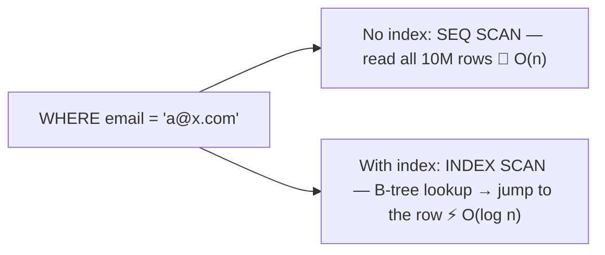
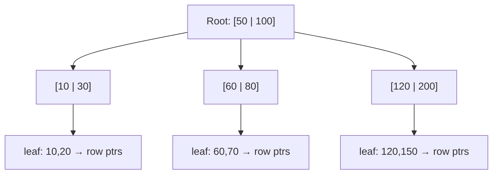
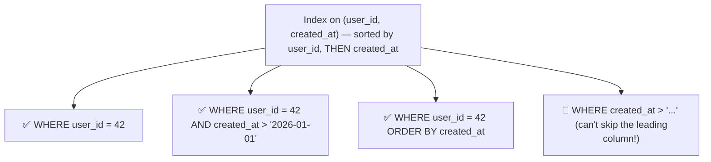
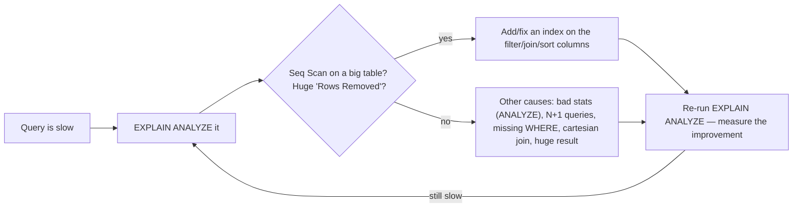

<!-- Module 05 · Lesson 5 — follows ../../../standards/. -->

# 05.5 · Query Optimization

[⬅ 05.4 Advanced SQL](05.4-advanced-sql.md) · [🏠 Module](../README.md) · [🗺 Roadmap](../../../ROADMAP.md) · [Next ➡](05.6-transactions.md)

> A query that runs in 5 ms on 1,000 rows can take 5 minutes on 10 million. This lesson explains **why queries get slow** (full scans), how to **see what the database is doing** (execution plans), and how **indexes** — B-trees, composite, covering — turn O(n) scans into O(log n) lookups.

| | |
|---|---|
| **Module** | `05 · Databases & Data Engineering` |
| **Lesson** | `05.5` |
| **Difficulty** | ⭐⭐⭐⭐ |
| **Estimated study time** | 65 min read · 45 min practice |
| **Status** | 🟢 stable |

---

## 1. Learning Objectives

By the end of this lesson you will be able to:

- [ ] Read an **execution plan** (`EXPLAIN ANALYZE`) and spot the problem.
- [ ] Explain how a **B-tree index** works and why it gives O(log n) lookups.
- [ ] Design **composite** and **covering** indexes correctly.
- [ ] Know when indexes **don't** help (and when they hurt).
- [ ] Systematically diagnose and fix a slow query.

## 2. Prerequisites

- [05.3 SQL Fundamentals](05.3-sql-fundamentals.md); [Module 02.3 Data Structures](../../02-Computer-Science/weeks/02.3-data-structures.md) (B-trees/hash tables) and [02.5 Complexity](../../02-Computer-Science/weeks/02.5-complexity.md).

---

## 3. Why This Topic Exists

Slow queries are the #1 cause of slow applications. As data grows, a query without an index degrades from instant to unusable — and the difference is *complexity* ([Module 02.5](../../02-Computer-Science/weeks/02.5-complexity.md)): a **full table scan** is O(n); an **indexed lookup** is O(log n). At 10 million rows that's ~10 million operations vs ~24.

The professional skill isn't memorizing tricks — it's *measuring* (execution plans) and *reasoning* (which index makes this access pattern fast). This is [Module 01.11's](../../01-Advanced-Python/weeks/01.11-performance.md) "measure, don't guess" applied to databases.

> [!IMPORTANT]
> **Queries are slow for one dominant reason: the database is reading far more rows than it needs to** — a *sequential scan* over the whole table instead of jumping straight to the relevant rows via an index. Almost all query optimization is: *look at the plan, find the scan, add the index that eliminates it, re-measure.* Everything in this lesson serves that loop.

## 4. Mental Model: The Index Is a Book's Index

To find "PostgreSQL" in a 1,000-page book you could read every page (a **sequential scan**, O(n)) — or use the index at the back to jump to page 412 (an **index scan**, O(log n)). A database index is exactly that: a separate, sorted structure that maps values → row locations.



| | Sequential scan | Index scan |
|---|---|---|
| Reads | Every row | Only matching rows (via the index) |
| Complexity | O(n) | O(log n) |
| Good when | Reading most of the table | Selecting few rows |

---

## 5. Execution Plans — See What the Database Does

The database's **query planner** decides *how* to execute your declarative SQL ([05.1](05.1-introduction.md)). `EXPLAIN ANALYZE` shows you that plan **and the actual timings** — your primary diagnostic tool.

```sql
EXPLAIN ANALYZE
SELECT * FROM documents WHERE user_id = 42;
```

```text
Seq Scan on documents  (cost=0.00..18334.00 rows=12 width=64)
                       (actual time=0.021..152.3 rows=12 loops=1)
  Filter: (user_id = 42)
  Rows Removed by Filter: 999988          ← 🔴 read 1M rows to return 12!
Planning Time: 0.1 ms
Execution Time: 152.5 ms
```

After adding an index:

```text
Index Scan using idx_documents_user_id on documents  (actual time=0.02..0.05 rows=12)
  Index Cond: (user_id = 42)
Execution Time: 0.08 ms                   ← ✅ ~2000× faster
```

| Plan node | Meaning |
|---|---|
| **Seq Scan** | Reading the whole table 🔴 (fine for small tables) |
| **Index Scan** | Using an index ✅ |
| **Index Only Scan** | Answered entirely from the index — fastest ✅✅ (§8) |
| **Bitmap Heap Scan** | Index used, many rows — a middle ground |
| **Nested Loop / Hash Join / Merge Join** | How tables are joined |
| **rows / actual time** | Estimated vs actual — big gaps mean bad statistics |

> [!IMPORTANT]
> **`EXPLAIN ANALYZE` is the single most important database-performance tool** ([Module 01.11 profiling](../../01-Advanced-Python/weeks/01.11-performance.md)/[Module 02.12](../../02-Computer-Science/weeks/02.12-debugging.md)). Read it for two things: **(1) a `Seq Scan` on a large table** where you expected an index (the smoking gun), and **(2) "Rows Removed by Filter"** being huge (you read a million rows to return twelve). Also watch for a big mismatch between *estimated* `rows` and *actual* rows — that means the planner's statistics are stale (`ANALYZE table;` refreshes them) and it's choosing bad plans. **Never optimize a query you haven't EXPLAINed.**

---

## 6. How Indexes Work — B-Trees

The default index type is a **B-tree** ([Module 02.3](../../02-Computer-Science/weeks/02.3-data-structures.md)) — a balanced tree optimized for disk: wide, shallow, and keeping values *sorted*.



| Property | Consequence |
|---|---|
| **Balanced** | O(log n) lookups always ([Module 02.3](../../02-Computer-Science/weeks/02.3-data-structures.md)) |
| **Sorted** | Supports `=`, `<`, `>`, `BETWEEN`, `ORDER BY`, prefix `LIKE 'abc%'` |
| **Wide/shallow** | Few disk reads per lookup (disk-optimized, [Module 02.1](../../02-Computer-Science/weeks/02.1-how-computers-work.md)) |

```sql
CREATE INDEX idx_documents_user_id ON documents(user_id);
```

| Index type | Best for |
|---|---|
| **B-tree** (default) | Equality **and** ranges, sorting — use this ~95% of the time |
| **Hash** | Equality only (`=`); no ranges/sorting — rarely worth it |
| **GIN** | Full-text search, `JSONB`, array containment |
| **GiST / IVFFlat / HNSW** | Geometric data; **vector similarity** ([05.15](05.15-vector-databases.md)) |

> [!IMPORTANT]
> **Use B-trees unless you have a specific reason not to.** They handle equality *and* ranges *and* sorting, whereas a **hash index** only does `=` (no `<`, no `ORDER BY`) — recall [Module 02.3](../../02-Computer-Science/weeks/02.3-data-structures.md): hash tables are O(1) but unordered; B-trees are O(log n) but *sorted*, and that ordering is what makes range queries and sorted output possible. In practice the B-tree's versatility wins. GIN matters for JSONB/full-text, and specialized vector indexes (HNSW — a *graph*, [Module 02.3](../../02-Computer-Science/weeks/02.3-data-structures.md)) power semantic search ([05.15](05.15-vector-databases.md)).

---

## 7. Composite Indexes — Order Matters

A **composite index** covers multiple columns. Its column *order* determines which queries it can serve.

```sql
CREATE INDEX idx_docs_user_created ON documents(user_id, created_at);
```



> [!IMPORTANT]
> **The leftmost-prefix rule:** a composite index on `(a, b, c)` can serve queries filtering on `a`, `(a, b)`, or `(a, b, c)` — but **not** on `b` alone or `c` alone. It's sorted by `a` first, so without a value for `a` the index can't be traversed usefully (like a phone book sorted by last-then-first name: useless for finding all "John"s). **Rule of thumb: put the column used for *equality* first, and the *range/sort* column second.** Getting composite-index order right is one of the highest-impact optimizations and a classic interview question.

---

## 8. Covering Indexes — Index-Only Scans

If an index contains **all the columns the query needs**, the database can answer entirely from the index without touching the table — an **Index Only Scan**, the fastest possible plan.

```sql
-- Query needs only user_id and created_at:
SELECT created_at FROM documents WHERE user_id = 42;

-- This index "covers" it (both columns are IN the index):
CREATE INDEX idx_cover ON documents(user_id, created_at);
-- → Index Only Scan: never reads the table at all ⚡⚡

-- Postgres: INCLUDE adds payload columns without affecting the sort key:
CREATE INDEX idx_cover2 ON documents(user_id) INCLUDE (title);
```

> [!TIP]
> **Covering indexes are why `SELECT *` hurts** ([05.3](05.3-sql-fundamentals.md)): if you select only the columns you need, an index can cover the query and skip the table entirely (an *Index Only Scan*); `SELECT *` forces a table lookup for every matching row. This is a concrete performance reason to name your columns.

---

## 9. When Indexes Don't Help (or Hurt)

Indexes are not free — this is the crucial nuance most people miss.

| Cost / limitation | Detail |
|---|---|
| **Slows writes** | Every `INSERT`/`UPDATE`/`DELETE` must update every index |
| **Uses disk space** | Indexes can rival the table's size |
| **Not used for low selectivity** | If a query returns most of the table, a seq scan is *faster* |
| **Functions defeat them** | `WHERE lower(email) = 'x'` won't use an index on `email` (use an expression index) |
| **Leading wildcard** | `LIKE '%abc'` can't use a B-tree (only prefix `'abc%'` works) |
| **Too many indexes** | Write amplification; planner confusion |

```sql
-- ❌ Index on email NOT used (function applied to the column):
SELECT * FROM users WHERE lower(email) = 'a@x.com';
-- ✅ Fix: an expression index
CREATE INDEX idx_users_lower_email ON users(lower(email));
```

> [!WARNING]
> **Indexes trade write speed and disk for read speed** — they are *not* free, and "index everything" is a real anti-pattern that slows every write ([05.14](05.14-performance-scaling.md)). Index the columns you actually **filter, join, and sort on** (especially **foreign keys** — an unindexed FK makes JOINs and cascading deletes slow, a very common oversight). Also note the planner will *correctly ignore* an index when a query returns a large fraction of the table — a seq scan is genuinely faster then (sequential I/O beats random, [Module 02.1](../../02-Computer-Science/weeks/02.1-how-computers-work.md)). Trust the plan, not your assumptions.

---

## 10. The Optimization Workflow



| Common cause | Fix |
|---|---|
| Missing index on filter/join column | Create it |
| Wrong composite-index order | Reorder (equality first) |
| Function on an indexed column | Expression index |
| Stale statistics | `ANALYZE table;` |
| **N+1 queries** (a query per row in app code) | One JOIN/`IN` query instead |
| Selecting too much data | `LIMIT`, narrower columns |
| Unindexed foreign key | Index the FK |

> [!IMPORTANT]
> The **N+1 query problem** is an application-side killer that no index fixes: your code fetches 100 users, then loops issuing one query per user for their documents (101 queries, each a network round-trip, [Module 02.7](../../02-Computer-Science/weeks/02.7-networking.md)). The fix is a single JOIN or `WHERE user_id IN (...)` query. ORMs cause this constantly (lazy loading). It's the database equivalent of [Module 02.5's accidental O(n²)](../../02-Computer-Science/weeks/02.5-complexity.md) — always check how many queries your code *actually* issues.

---

## 11. Common Mistakes & Best Practices

| Mistake | Better |
|---|---|
| Optimizing without `EXPLAIN` | Always measure first |
| Indexing everything | Index filter/join/sort columns only |
| Unindexed foreign keys | Index FKs |
| Wrong composite order | Equality column first, range/sort second |
| Function on indexed column | Expression index |
| N+1 queries | JOIN or `IN` |
| `SELECT *` | Name columns (enables covering indexes) |
| Stale statistics | `ANALYZE` (usually automatic) |

## 12. Performance Considerations

Summarized: **reads** get faster with the right indexes (O(log n)); **writes** get slower with each index; **space** grows. Optimize the queries that matter (measured), not every query.

## 13. Security Considerations

| Risk | Guidance |
|---|---|
| Slow queries as DoS | An unindexed query on user input can be forced into O(n) scans — index and add limits ([Module 02.5](../../02-Computer-Science/weeks/02.5-complexity.md) complexity attacks) |
| Query plans leaking structure | `EXPLAIN` reveals schema — restrict in multi-tenant contexts |
| Resource exhaustion | Set statement timeouts; cap result sizes |

> [!CAUTION]
> An **unbounded, unindexed query driven by user input is a denial-of-service vector** ([Module 02.5](../../02-Computer-Science/weeks/02.5-complexity.md)): an attacker crafts a request that forces a full scan on a huge table, consuming CPU/IO and starving other users. Defend with indexes, `LIMIT`s, and **statement timeouts** (`SET statement_timeout = '5s'`).

## 14. Interview Questions

**Beginner**
1. Why is a query slow without an index? What complexity does an index give you?
2. What does `EXPLAIN ANALYZE` tell you, and what's the red flag?

**Intermediate**
1. Explain the leftmost-prefix rule for composite indexes.
2. Name three situations where an index is *not* used.

**Advanced**
1. What is a covering index / index-only scan, and how does `SELECT *` prevent it?
2. What is the N+1 query problem and how do you fix it?

**System-design prompt**
- A dashboard query takes 30 seconds on 50M rows. Walk through diagnosing and fixing it. — *Follow-ups:* What's in the plan? Which index? What are the write-side costs? When would you denormalize or materialize instead?

## 15. Summary

| Key idea | Takeaway |
|---|---|
| Slow = reading too many rows | Seq scan instead of index scan |
| `EXPLAIN ANALYZE` | The essential diagnostic — measure, don't guess |
| B-tree | O(log n); handles equality, ranges, sorting |
| Composite indexes | Leftmost-prefix rule; equality column first |
| Covering index | Index-only scan — the fastest plan |
| Indexes cost writes/space | Index what you filter/join/sort on (esp. FKs) |
| N+1 queries | An app-side killer no index fixes |

## 16. Cheat Sheet

```text
WHY SLOW: reading far more rows than needed → SEQ SCAN (O(n)) instead of INDEX SCAN (O(log n))
★ EXPLAIN ANALYZE <query>  — ALWAYS measure first (never optimize blind)
  RED FLAGS: "Seq Scan" on a big table · huge "Rows Removed by Filter" · estimated rows ≠ actual (→ ANALYZE table)
  GOOD: Index Scan · BEST: Index Only Scan (covering)
INDEX TYPES: B-TREE(default — equality + RANGES + sorting; use 95% of time) · HASH(= only, rarely worth it)
  GIN(JSONB/full-text) · HNSW/IVFFlat(vector similarity — 05.15)
CREATE INDEX idx ON t(col);  CREATE INDEX idx ON t(a, b);  CREATE INDEX idx ON t(a) INCLUDE (b);
COMPOSITE (a,b,c) — LEFTMOST-PREFIX RULE: serves a · (a,b) · (a,b,c) — NOT b alone!
  → put EQUALITY column FIRST, range/sort column SECOND
COVERING INDEX → INDEX ONLY SCAN (never touches the table) — this is why SELECT * hurts!
INDEXES AREN'T FREE: slow every write · use disk · not used when returning most of the table
  DEFEATED BY: function on column (WHERE lower(x)=... → use an EXPRESSION INDEX) · LIKE '%abc' (leading wildcard)
INDEX: filter + join + sort columns — ESPECIALLY FOREIGN KEYS (commonly forgotten!)
N+1 PROBLEM (app-side, no index fixes it): 1 query + 1 per row → use ONE JOIN or WHERE id IN (...)
SECURITY: unindexed query on user input = DoS → indexes + LIMIT + statement_timeout
```

## 17. Flashcards

- **Q:** Why is an unindexed query slow, and what does an index give you? — **A:** It does a sequential scan reading every row (O(n)); an index (B-tree) allows O(log n) lookups straight to the matching rows.
- **Q:** What's the red flag in an `EXPLAIN ANALYZE` output? — **A:** A `Seq Scan` on a large table (and/or a huge "Rows Removed by Filter") where you expected an index.
- **Q:** State the leftmost-prefix rule. — **A:** A composite index on `(a,b,c)` can serve filters on `a`, `(a,b)`, or `(a,b,c)` — but not `b` or `c` alone; put the equality column first.
- **Q:** What is a covering index? — **A:** One containing all columns a query needs, so it's answered entirely from the index (Index Only Scan) without reading the table — which is why `SELECT *` hurts.
- **Q:** Name three cases where an index isn't used. — **A:** A function applied to the column (`lower(email)`), a leading wildcard (`LIKE '%x'`), and low selectivity (the query returns most of the table, so a seq scan is faster).
- **Q:** What is the N+1 query problem? — **A:** Application code issuing one query per row (101 queries for 100 users) instead of a single JOIN/`IN` query — a killer no index fixes.

## 18. Hands-on Exercises

> Full set in [`../exercises/`](../exercises/).

- [ ] **(⭐⭐ Measure)** Load 1M rows; `EXPLAIN ANALYZE` a filtered query (seq scan); add an index; re-run and compare timings.
- [ ] **(⭐⭐ Composite)** Create a composite index; show it serves `(a)` and `(a,b)` but not `(b)` alone (via EXPLAIN).
- [ ] **(⭐⭐⭐ Covering)** Construct a query + index that achieves an *Index Only Scan*; break it by using `SELECT *`.
- [ ] **(⭐⭐ Defeated)** Show an index being ignored due to `lower(col)`; fix with an expression index.
- [ ] **(⭐⭐⭐ N+1)** Write Python code that issues N+1 queries; rewrite as one JOIN; measure the difference.
- [ ] **(⭐⭐ FK)** Show that an unindexed foreign key makes a JOIN slow; index it and re-measure.

## 19. Mini Project

> **Query optimization lab.** Take a realistically-sized dataset (≥1M rows) and a set of 5 slow queries. For each: capture the `EXPLAIN ANALYZE` plan, diagnose the cause, apply a fix (index/rewrite/materialize), and record the before/after timings and the write-side cost of any index added. Deliverable: an optimization report with the methodology — the exact artifact you'd produce for a real performance incident ([Module 02.12](../../02-Computer-Science/weeks/02.12-debugging.md)).

## 20. References

- *Use The Index, Luke!* (use-the-index-luke.com) — the best free resource on SQL indexing ([reference standards](../../../standards/reference-standards.md)).
- PostgreSQL docs — indexes, `EXPLAIN`, planner.
- Kleppmann, *DDIA* Ch. 3 (storage & retrieval — B-trees/LSM-trees).

## 21. What's Next

Fast queries are useless if the data is *wrong*. Next: **transactions** — ACID, isolation levels, locks, deadlocks, and MVCC — the guarantees that keep data correct under concurrency.

➡️ **Next:** [05.6 · Transactions](05.6-transactions.md)

---

### 🔁 Revision checklist
- [ ] I always `EXPLAIN ANALYZE` before optimizing
- [ ] I can read a plan and spot seq scans / row-removal
- [ ] I design composite indexes with the leftmost-prefix rule
- [ ] I know indexes cost writes and when they aren't used

### 🔗 Spaced-repetition callback
> Recall [Module 02.3's B-trees](../../02-Computer-Science/weeks/02.3-data-structures.md) ("used for DB indexes — disk-friendly") and [02.5's O(n) vs O(log n) cliff](../../02-Computer-Science/weeks/02.5-complexity.md): this lesson *is* those, applied. And [Module 01.11's "profile, don't guess"](../../01-Advanced-Python/weeks/01.11-performance.md) becomes `EXPLAIN ANALYZE`. The N+1 problem is accidental O(n²) at the network layer.
