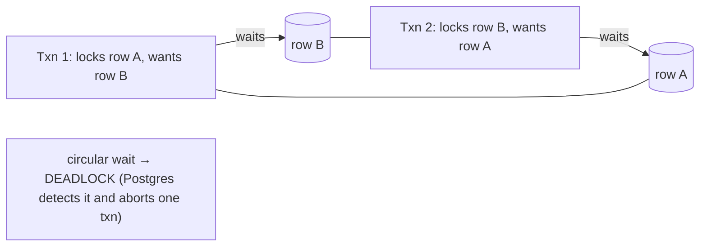
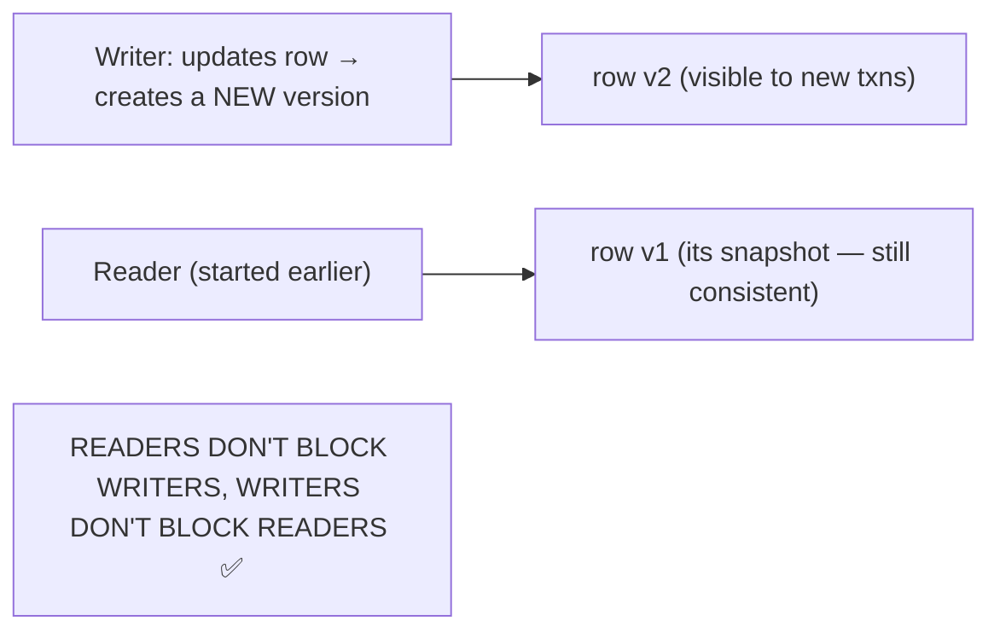

<!-- Module 05 · Lesson 6 — follows ../../../standards/. -->

# 05.6 · Transactions

[⬅ 05.5 Query Optimization](05.5-query-optimization.md) · [🏠 Module](../README.md) · [🗺 Roadmap](../../../ROADMAP.md) · [Next ➡](05.7-nosql.md)

> What stops two simultaneous requests from corrupting your data? **Transactions** — the ACID guarantees that make a database trustworthy. This lesson covers ACID, isolation levels, locks, deadlocks, and MVCC, with the production scenarios where each one bites.

| | |
|---|---|
| **Module** | `05 · Databases & Data Engineering` |
| **Lesson** | `05.6` |
| **Difficulty** | ⭐⭐⭐⭐ |
| **Estimated study time** | 60 min read |
| **Status** | 🟢 stable |

---

## 1. Learning Objectives

By the end of this lesson you will be able to:

- [ ] Explain **ACID** (Atomicity, Consistency, Isolation, Durability).
- [ ] Compare **isolation levels** and the anomalies each prevents.
- [ ] Explain **locks**, **deadlocks**, and how to avoid them.
- [ ] Explain **MVCC** and why Postgres readers don't block writers.
- [ ] Use transactions correctly in production AI applications.

## 2. Prerequisites

- [05.3 SQL Fundamentals](05.3-sql-fundamentals.md); [Module 02.6 OS](../../02-Computer-Science/weeks/02.6-operating-systems.md) (races, deadlocks) and [02.8 Concurrency](../../02-Computer-Science/weeks/02.8-concurrency.md).

---

## 3. Why This Topic Exists

A database serves many clients **simultaneously**. Without coordination, two concurrent operations interleave and corrupt data — the classic race condition ([Module 02.6](../../02-Computer-Science/weeks/02.6-operating-systems.md)): two requests read a balance of 100, both subtract 50, both write 50 — money vanishes. **Transactions** are the mechanism that makes concurrent access safe, and **ACID** is the set of guarantees they provide.

This is *the* reason databases exist ([05.1](05.1-introduction.md)) and can't be replaced by files. For AI systems, transactions protect credit/quota deductions, job-state updates, and any multi-step operation that must be all-or-nothing.

> [!IMPORTANT]
> **A transaction is a group of operations that succeed or fail *together*, as one atomic unit.** If a transfer debits one account and crashes before crediting the other, the debit is *rolled back* — the database never shows a half-finished state. This all-or-nothing property, plus isolation from other concurrent transactions, is what makes a database trustworthy. It's the same "guaranteed cleanup" idea as [Module 01.7's context managers](../../01-Advanced-Python/weeks/01.7-context-managers.md), enforced at the data layer.

## 4. ACID

```sql
BEGIN;                                            -- start the transaction
UPDATE accounts SET balance = balance - 50 WHERE id = 1;
UPDATE accounts SET balance = balance + 50 WHERE id = 2;
COMMIT;                                           -- both applied, or (on error) ROLLBACK: neither
```


| Property | Guarantee | Failure it prevents |
|---|---|---|
| **Atomicity** | All operations commit, or none do | Half-completed transfer |
| **Consistency** | The DB moves from one valid state to another (constraints hold, [05.2](05.2-relational-databases.md)) | Violating a FK/CHECK |
| **Isolation** | Concurrent transactions don't see each other's partial work | Race conditions ([Module 02.6](../../02-Computer-Science/weeks/02.6-operating-systems.md)) |
| **Durability** | Once committed, it survives a crash (written to disk/WAL) | Losing a confirmed write |

> [!TIP]
> **Durability is implemented by the Write-Ahead Log (WAL)**: before changing the data files, the DB writes the change to an append-only log and `fsync`s it ([Module 02.10 atomic writes](../../02-Computer-Science/weeks/02.10-file-systems.md)). On crash, it replays the log to recover. This is exactly the atomic/durable-write discipline from Module 02, industrialized — and it's also the basis of **replication** ([05.14](05.14-performance-scaling.md)) and point-in-time recovery ([05.13](05.13-database-security.md)).

---

## 5. Isolation Levels and Anomalies

Perfect isolation is expensive, so databases offer **levels** trading strictness for concurrency. Each level permits certain **anomalies**:

| Anomaly | What happens |
|---|---|
| **Dirty read** | You read another transaction's *uncommitted* changes |
| **Non-repeatable read** | You read a row twice in one transaction and get different values |
| **Phantom read** | You re-run a query and *new rows* appear |
| **Lost update** | Two transactions read-modify-write; one overwrites the other |

| Isolation level | Dirty read | Non-repeatable | Phantom |
|---|:--:|:--:|:--:|
| **Read Uncommitted** | ✅ possible | ✅ | ✅ |
| **Read Committed** (Postgres default) | ❌ prevented | ✅ possible | ✅ possible |
| **Repeatable Read** | ❌ | ❌ | ✅ (mostly prevented in PG) |
| **Serializable** | ❌ | ❌ | ❌ (as if transactions ran one at a time) |

```sql
BEGIN ISOLATION LEVEL SERIALIZABLE;   -- strictest
-- ... ; COMMIT;   (may fail with a serialization error → retry!)
```

> [!IMPORTANT]
> **Postgres defaults to Read Committed**, which prevents dirty reads but *permits* the **lost update** — the classic bug: two concurrent requests both read `credits = 100`, both compute `100 - 10`, both write `90`, and one deduction vanishes ([Module 02.6 race condition](../../02-Computer-Science/weeks/02.6-operating-systems.md)). Two correct fixes: **(1) do the arithmetic in the database** (`UPDATE ... SET credits = credits - 10` is atomic), or **(2) lock the row** (`SELECT ... FOR UPDATE`) / use `SERIALIZABLE` and retry on conflict. For an AI product, this is exactly how you'd deduct API credits or token quotas — get it wrong and you give away free usage.

```sql
-- ❌ Lost-update risk (read-modify-write in app code):
credits = SELECT credits FROM users WHERE id=1;   -- app reads 100
UPDATE users SET credits = 90 WHERE id = 1;       -- another txn did the same → one is lost

-- ✅ Atomic in the DB:
UPDATE users SET credits = credits - 10 WHERE id = 1 AND credits >= 10;

-- ✅ Or lock the row for the duration:
BEGIN;
SELECT credits FROM users WHERE id = 1 FOR UPDATE;   -- locks the row
UPDATE users SET credits = ... WHERE id = 1;
COMMIT;
```

---

## 6. Locks and Deadlocks

To provide isolation, databases take **locks**. Two transactions that need each other's locks in opposite orders **deadlock** — exactly the Coffman circular-wait from [Module 02.6](../../02-Computer-Science/weeks/02.6-operating-systems.md).



| Lock type | Meaning |
|---|---|
| **Shared (read)** | Many can hold it; blocks writers |
| **Exclusive (write)** | One holder; blocks everyone |
| **Row-level** | Locks specific rows (`FOR UPDATE`) — preferred |
| **Table-level** | Locks the whole table (some DDL) — heavy |

> [!IMPORTANT]
> **Deadlock prevention is the same rule as in the OS ([Module 02.6](../../02-Computer-Science/weeks/02.6-operating-systems.md)): always acquire locks in a consistent order.** If every transaction updates accounts in ascending `id` order, the circular wait can't form. Also: **keep transactions short** (hold locks briefly), don't do slow work (an LLM API call! a file upload!) *inside* a transaction, and **be ready to retry** — Postgres detects deadlocks and aborts one transaction with an error, so your application should catch it and retry ([Module 01.9 retries](../../01-Advanced-Python/weeks/01.9-error-handling-logging.md)).

> [!WARNING]
> **Never make a network call (e.g., to an LLM API) inside an open transaction.** The transaction holds locks for the *entire* duration of that slow, unpredictable call — blocking other writers, exhausting connections ([05.14](05.14-performance-scaling.md)), and inviting timeouts. Pattern: do the external work *first*, then open a short transaction to write the result. This is a very common AI-application mistake.

---

## 7. MVCC — Multi-Version Concurrency Control

Postgres (and most modern DBs) implement isolation with **MVCC**: instead of locking on reads, it keeps **multiple versions** of each row. Each transaction sees a consistent *snapshot* as of when it started.



| Consequence | Detail |
|---|---|
| **Readers don't block writers** | A long analytics query doesn't stall your app's writes |
| **Writers don't block readers** | Reads always see a consistent snapshot |
| Old versions accumulate | Requires cleanup — **`VACUUM`** in Postgres |
| Write-write conflicts still lock | Two writers to the same row still serialize |

> [!IMPORTANT]
> **MVCC is why Postgres handles mixed read/write workloads so well** — a heavy analytical query ([05.4](05.4-advanced-sql.md)) reading millions of rows won't block your application's writes, because it reads its own consistent snapshot rather than taking read locks. The cost: dead row versions accumulate and must be cleaned by **`VACUUM`** (usually autovacuum). **Table bloat** from disabled/lagging autovacuum is a classic Postgres production problem — the table grows, scans slow down, and performance degrades mysteriously ([05.14](05.14-performance-scaling.md)).

---

## 8. Transactions in AI Applications

| AI scenario | Transaction concern |
|---|---|
| Deducting user credits/tokens per LLM call | **Lost update** → atomic `UPDATE ... SET x = x - n` |
| Multi-step ingestion (insert doc + chunks + metadata) | **Atomicity** — all or none |
| Marking a training job's state | Isolation — no two workers claim the same job |
| Long analytics on live data | **MVCC** — reads don't block the app |
| Calling an LLM API mid-transaction | 🔴 Never — holds locks for seconds |
| Idempotent pipeline writes | Upsert ([05.3](05.3-sql-fundamentals.md)) + transactions ([05.11](05.11-data-pipelines.md)) |

```sql
-- Claim a job atomically so two workers can't take the same one:
BEGIN;
SELECT id FROM jobs WHERE status = 'pending'
ORDER BY created_at LIMIT 1
FOR UPDATE SKIP LOCKED;              -- ← locks it; other workers skip it
UPDATE jobs SET status = 'running' WHERE id = <that id>;
COMMIT;
```

> [!TIP]
> **`FOR UPDATE SKIP LOCKED` is the elegant way to build a job queue in Postgres** — each worker atomically claims a different pending row without blocking on rows other workers hold. This is a genuinely useful pattern for AI pipelines (embedding jobs, training runs, batch inference) that avoids adding a separate queue system early on ([05.11](05.11-data-pipelines.md)).

---

## 9. Common Mistakes & Best Practices

| Mistake | Consequence | Better |
|---|---|---|
| Read-modify-write in app code | Lost update | Atomic `UPDATE ... SET x = x - n` or `FOR UPDATE` |
| Long transactions | Locks held, bloat, contention | Keep them short |
| Network/LLM call inside a transaction | Blocks everything | Do external work outside |
| Inconsistent lock ordering | Deadlocks | Consistent order (e.g., by id) |
| Not retrying on deadlock/serialization failure | Failed requests | Catch and retry ([Module 01.9](../../01-Advanced-Python/weeks/01.9-error-handling-logging.md)) |
| Disabled/lagging autovacuum | Table bloat, slow queries | Monitor vacuum |
| No transaction for multi-step writes | Partial/corrupt state | Wrap in `BEGIN...COMMIT` |

## 10. Performance Considerations

| Principle | Takeaway |
|---|---|
| Shorter transactions | Less locking, less contention |
| Higher isolation | More safety, less concurrency |
| MVCC | Readers/writers don't block — but need VACUUM |
| Row locks > table locks | Finer granularity = more concurrency |
| Batch writes in one transaction | Fewer commits (fsyncs) = much faster bulk loads |

## 11. Security Considerations

| Risk | Guidance |
|---|---|
| Race conditions as exploits | E.g., double-spending credits — use atomic updates/locks |
| Long transactions as DoS | Idle-in-transaction connections exhaust resources — set timeouts |
| Uncommitted sensitive writes | Isolation prevents dirty reads |
| Missing transaction on money/quota ops | Financial/quota corruption |

> [!CAUTION]
> **Race conditions in credit/quota deduction are directly exploitable** — an attacker fires 100 concurrent requests; under Read Committed with app-side read-modify-write, many deductions are lost and they get free usage. This is a real, expensive attack on AI products (where each call costs you money). Always deduct atomically in the database (`UPDATE ... SET credits = credits - 1 WHERE credits >= 1` and check the affected row count) or lock the row.

## 12. Interview Questions

**Beginner**
1. What does ACID stand for, and what does each letter guarantee?
2. What is a transaction, and why do you need one for a multi-step update?

**Intermediate**
1. What is a lost update, and how do you prevent it?
2. Compare Read Committed and Serializable isolation.

**Advanced**
1. What is MVCC, and why don't readers block writers in Postgres?
2. What causes deadlocks, and how do you prevent and handle them?

**System-design prompt**
- Design credit deduction for an AI API where each LLM call costs credits. — *Follow-ups:* Where's the race condition? Atomic update or lock? What isolation level? Where does the (slow) LLM call happen relative to the transaction? How do you retry?

## 13. Summary

| Key idea | Takeaway |
|---|---|
| Transaction | All-or-nothing group of operations |
| ACID | Atomicity, Consistency, Isolation, Durability |
| Isolation levels | Trade strictness for concurrency; PG defaults to Read Committed |
| Lost update | The classic bug — fix with atomic update or `FOR UPDATE` |
| Deadlocks | Circular lock wait → consistent lock order + retry |
| MVCC | Readers don't block writers (needs VACUUM) |
| Keep transactions short | Never call an external API inside one |

## 14. Cheat Sheet

```text
TRANSACTION: BEGIN; ...; COMMIT;  (or ROLLBACK) — all-or-nothing
ACID: ATOMICITY(all or none) · CONSISTENCY(constraints hold) · ISOLATION(concurrent txns safe) · DURABILITY(committed survives crash, via WAL)
ANOMALIES: dirty read · non-repeatable read · phantom read · LOST UPDATE
ISOLATION LEVELS: Read Uncommitted < READ COMMITTED (Postgres default) < Repeatable Read < SERIALIZABLE
  ⚠️ Read Committed ALLOWS LOST UPDATE (the classic credit-deduction bug!)
FIX LOST UPDATE:
  ✅ atomic in DB:  UPDATE users SET credits = credits - 10 WHERE id=1 AND credits >= 10;
  ✅ lock the row:  SELECT ... FOR UPDATE;  (or SERIALIZABLE + retry on conflict)
  ❌ NEVER: read in app → compute → write back
LOCKS: shared(read) / exclusive(write) · row-level(FOR UPDATE, preferred) / table-level
DEADLOCK (circular wait, like OS 02.6): PREVENT = acquire locks in a CONSISTENT ORDER (e.g. by id) + keep txns SHORT + RETRY on error
MVCC (Postgres): multiple row versions → READERS DON'T BLOCK WRITERS · needs VACUUM (bloat if autovacuum lags!)
JOB QUEUE PATTERN: SELECT ... FOR UPDATE SKIP LOCKED  → workers claim different rows atomically
⚠️ NEVER call an LLM/network API INSIDE an open transaction (holds locks for seconds!)
```

## 15. Flashcards

- **Q:** What does ACID guarantee? — **A:** Atomicity (all-or-nothing), Consistency (constraints hold), Isolation (concurrent transactions don't corrupt each other), Durability (committed data survives crashes).
- **Q:** What is a lost update, and how do you prevent it? — **A:** Two transactions read-modify-write the same value and one overwrites the other; prevent with an atomic DB update (`SET x = x - n`), a row lock (`FOR UPDATE`), or SERIALIZABLE + retry.
- **Q:** What isolation level does Postgres default to, and what does it allow? — **A:** Read Committed — it prevents dirty reads but permits non-repeatable reads, phantoms, and lost updates.
- **Q:** What is MVCC and its key benefit? — **A:** Multi-Version Concurrency Control keeps multiple row versions so each transaction reads a consistent snapshot — readers don't block writers (but dead versions need VACUUM).
- **Q:** How do you prevent deadlocks? — **A:** Acquire locks in a consistent order (e.g., always by ascending id), keep transactions short, and retry when the DB aborts one.
- **Q:** Why never call an LLM API inside a transaction? — **A:** The transaction holds locks for the entire (slow, unpredictable) call, blocking other writers and exhausting connections — do external work outside the transaction.

## 16. Hands-on Exercises

> Full set in [`../exercises/`](../exercises/).

- [ ] **(⭐ Atomicity)** Run a multi-statement transaction; force an error; confirm `ROLLBACK` left no partial state.
- [ ] **(⭐⭐⭐ Lost update)** Open two `psql` sessions; reproduce a lost update under Read Committed; fix it with an atomic `UPDATE ... SET x = x - n`, then with `FOR UPDATE`.
- [ ] **(⭐⭐⭐ Deadlock)** In two sessions, acquire locks in opposite orders to trigger a deadlock; observe Postgres aborting one; fix with consistent ordering.
- [ ] **(⭐⭐ Isolation)** Demonstrate a non-repeatable read under Read Committed and its absence under Repeatable Read.
- [ ] **(⭐⭐⭐ Job queue)** Implement `FOR UPDATE SKIP LOCKED` job claiming; run two workers and confirm no double-claims.

## 17. Mini Project

> **Credit/quota system with correct concurrency.** Build the credit-deduction layer for an AI API: schema (users, credits, usage log), an *atomic* deduction that cannot be raced, a transaction wrapping deduction + usage logging, retry logic for serialization/deadlock errors ([Module 01.9](../../01-Advanced-Python/weeks/01.9-error-handling-logging.md)), and a **concurrency test** that fires N parallel requests and asserts the final balance is exactly correct ([Module 01.10](../../01-Advanced-Python/weeks/01.10-testing.md)/[Module 02.8](../../02-Computer-Science/weeks/02.8-concurrency.md)). This is a real, money-critical component — and the test proving it's race-free is the deliverable.

## 18. References

- Kleppmann, *DDIA* Ch. 7 "Transactions" — the definitive treatment ([reference standards](../../../standards/reference-standards.md)).
- PostgreSQL docs — transaction isolation, explicit locking, MVCC.
- "A Critique of ANSI SQL Isolation Levels" (Berenson et al.) — for depth.

## 19. What's Next

You've mastered the relational world. Now the alternatives: **NoSQL databases** — document, key-value, wide-column, and graph — what each is genuinely good at, and when to reach for them.

➡️ **Next:** [05.7 · NoSQL Databases](05.7-nosql.md)

---

### 🔁 Revision checklist
- [ ] I can explain ACID and the isolation levels
- [ ] I can prevent a lost update (atomic update / FOR UPDATE)
- [ ] I understand deadlocks and MVCC
- [ ] I keep transactions short and never call APIs inside them

### 🔗 Spaced-repetition callback
> Recall [Module 02.6's race conditions and deadlocks](../../02-Computer-Science/weeks/02.6-operating-systems.md): the lost update *is* `count += 1` racing across threads, and DB deadlocks are the same circular wait with the same fix (consistent lock order). Databases solve concurrency with the same CS — transactions are the database's version of [Module 01.7's guaranteed cleanup](../../01-Advanced-Python/weeks/01.7-context-managers.md).
