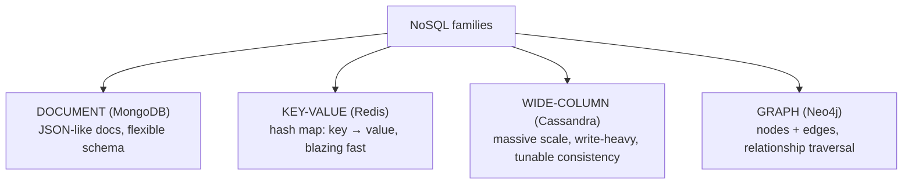
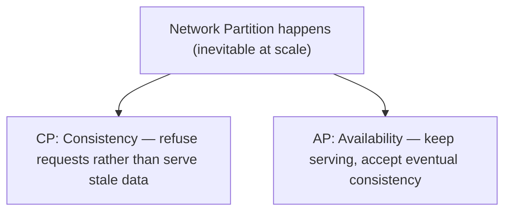
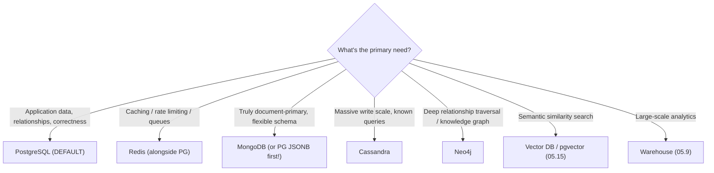

<!-- Module 05 · Lesson 7 — follows ../../../standards/. -->

# 05.7 · NoSQL Databases

[⬅ 05.6 Transactions](05.6-transactions.md) · [🏠 Module](../README.md) · [🗺 Roadmap](../../../ROADMAP.md) · [Next ➡](05.8-data-modeling.md)

> NoSQL didn't replace relational — it added specialized tools for cases relational handles poorly. This lesson covers the four families (**document, key-value, wide-column, graph**), what each is genuinely good at, and — crucially — when *not* to use them.

| | |
|---|---|
| **Module** | `05 · Databases & Data Engineering` |
| **Lesson** | `05.7` |
| **Difficulty** | ⭐⭐⭐ |
| **Estimated study time** | 55 min read |
| **Status** | 🟢 stable |

---

## 1. Learning Objectives

By the end of this lesson you will be able to:

- [ ] Explain what "NoSQL" means and why it emerged.
- [ ] Compare **document, key-value, wide-column,** and **graph** databases.
- [ ] Map each to a real system (MongoDB, Redis, Cassandra, Neo4j) and its use case.
- [ ] Explain the **CAP theorem** and eventual consistency at a practical level.
- [ ] Choose the right database for a given AI workload — and default correctly.

## 2. Prerequisites

- [05.2 Relational](05.2-relational-databases.md) & [05.6 Transactions](05.6-transactions.md) (what you're trading away); [Module 02.3](../../02-Computer-Science/weeks/02.3-data-structures.md) (hash tables, graphs).

---

## 3. Why This Topic Exists

In the 2000s, web-scale companies hit limits relational databases weren't designed for: billions of rows across hundreds of machines, rapidly-changing schemas, and workloads where availability mattered more than perfect consistency. **NoSQL** ("not only SQL") systems made *different trade-offs* — usually sacrificing some ACID guarantees ([05.6](05.6-transactions.md)) and query flexibility to gain horizontal scale and schema flexibility.

For AI Engineers, the practical question is never "SQL or NoSQL?" but **"what's the right tool for *this* data?"** — and knowing the four families lets you answer it. Redis for caching, a document store for flexible payloads, a graph DB for relationships, a vector DB for embeddings ([05.15](05.15-vector-databases.md)) — alongside Postgres as the backbone.

> [!IMPORTANT]
> **NoSQL is not "newer/better than SQL" — it's a set of *specialized trade-offs*.** Each family gives up something relational databases provide (JOINs, ACID, ad-hoc queries, schema enforcement) in exchange for something specific (scale, speed, flexibility, graph traversal). The engineering skill is knowing *what you're giving up*. Choosing NoSQL because it's "modern" — without a specific limitation you're solving — is a well-documented path to pain.

## 4. The Four Families



| Family | Model | Example | Superpower | Give up |
|---|---|---|---|---|
| **Document** | Nested JSON documents | MongoDB | Flexible schema, natural object mapping | JOINs, strict schema |
| **Key-Value** | `key → value` ([hash table](../../02-Computer-Science/weeks/02.3-data-structures.md)) | Redis | Extreme speed (in-memory), simplicity | Querying by value, relationships |
| **Wide-Column** | Rows with dynamic columns, partitioned | Cassandra | Huge write throughput, horizontal scale | JOINs, ad-hoc queries, strong consistency |
| **Graph** | Nodes + edges ([graphs](../../02-Computer-Science/weeks/02.3-data-structures.md)) | Neo4j | Deep relationship traversal | General-purpose querying |

---

## 5. Document Databases (MongoDB)

Store **documents** — nested JSON-like structures — with a flexible schema. A document holds everything about an entity, so you often don't need JOINs.

```json
// One document holds the whole object (denormalized by design)
{
  "_id": "doc_123",
  "title": "Q3 Report",
  "owner": { "id": 42, "email": "a@x.com" },
  "tags": ["finance", "q3"],
  "chunks": [ { "text": "...", "page": 1 } ]
}
```

| ✅ Good for | 🔴 Weak at |
|---|---|
| Rapidly-evolving/unknown schemas | Complex JOINs across collections |
| Nested, self-contained objects | Multi-document transactions (limited) |
| Content/catalog/config data | Ad-hoc analytical queries |
| Fast prototyping | Data integrity (no FKs) |

> [!IMPORTANT]
> **Postgres's `JSONB` column type gives you most of MongoDB's flexibility *inside* a relational database** — with indexing (GIN, [05.5](05.5-query-optimization.md)), ACID ([05.6](05.6-transactions.md)), JOINs, and constraints intact. For most AI applications, a Postgres table with a `JSONB` column for the flexible parts (LLM response metadata, variable config) beats adopting a whole second database. Reach for MongoDB when documents are genuinely the *primary* model and you need its scaling/operational profile — not merely because your data "has some JSON."

---

## 6. Key-Value Stores (Redis)

The simplest model: a giant **hash map** ([Module 02.3](../../02-Computer-Science/weeks/02.3-data-structures.md)) — `key → value`, typically **in memory**, so operations take *microseconds*.

```bash
SET user:42:credits 100          # O(1)
GET user:42:credits
SETEX cache:query:abc 3600 "..."  # value with a TTL (auto-expires)
INCR api:calls:2026-07-09         # atomic counter (no lost update!)
LPUSH jobs:embed "doc_123"        # also: lists, sets, sorted sets, streams
```

| ✅ Good for | 🔴 Weak at |
|---|---|
| **Caching** ([Module 02.11](../../02-Computer-Science/weeks/02.11-system-design-basics.md)) | Querying by value / complex queries |
| Session storage, rate limiting | Relationships |
| Job queues, pub/sub | Durability (memory-first; configurable) |
| Atomic counters | Large datasets (RAM-bound) |

> [!IMPORTANT]
> **Redis is the AI Engineer's caching workhorse** — and caching is the highest-ROI optimization in AI systems ([Module 02.11](../../02-Computer-Science/weeks/02.11-system-design-basics.md)): cache identical LLM prompts, embeddings, and retrieval results, turning a paid, second-long model call into a free, sub-millisecond hit. It's also excellent for **rate limiting** (atomic `INCR` with TTL) and **job queues** — both core to production AI services ([05.14](05.14-performance-scaling.md)/[Module 19](../../19-Production-AI/README.md)). Redis complements Postgres; it doesn't replace it (it's a cache, not your source of truth — memory-first means data loss risk on failure unless configured for durability).

---

## 7. Wide-Column Stores (Cassandra)

Designed for **massive write throughput across many machines** — data is partitioned by a key and distributed, with tunable consistency.

| ✅ Good for | 🔴 Weak at |
|---|---|
| Enormous write volume (telemetry, events, IoT) | JOINs, ad-hoc queries |
| Horizontal scale across data centers | Strong consistency (eventual by default) |
| Time-series/append-heavy data | Anything needing flexible querying |
| High availability | Small/simple workloads (operationally heavy) |

> [!IMPORTANT]
> Cassandra's defining constraint: **you must design tables around your queries** (query-driven modeling) — because there are no JOINs and no ad-hoc queries, you denormalize aggressively and often store the same data multiple ways, once per access pattern. That's the *opposite* of relational flexibility ([05.2](05.2-relational-databases.md)). It's the right trade when you have genuinely massive, known, write-heavy workloads (millions of events/sec) — and badly wrong when your questions change. Most AI teams never need it.

---

## 8. Graph Databases (Neo4j)

Store **nodes** and **edges** as first-class citizens ([Module 02.3](../../02-Computer-Science/weeks/02.3-data-structures.md)), making relationship traversal fast and expressive.

```cypher
// Cypher: find documents cited by documents that Alice authored, 2 hops out
MATCH (u:User {email:'a@x.com'})-[:AUTHORED]->(d:Doc)-[:CITES*1..2]->(cited:Doc)
RETURN cited;
```

| ✅ Good for | 🔴 Weak at |
|---|---|
| Deep/variable-length relationship traversal | General-purpose data storage |
| Recommendations, fraud rings, social graphs | Aggregations at scale |
| **Knowledge graphs** (AI!) | Simple tabular workloads |

> [!IMPORTANT]
> **Graph DBs shine where relationships are the point and traversals are deep.** In SQL, "find friends-of-friends-of-friends" needs a recursive CTE ([05.4](05.4-advanced-sql.md)) or 3 self-joins and gets exponentially slower; in a graph DB it's a natural, fast traversal. **AI relevance:** *knowledge graphs* — structured entity/relationship representations used to ground LLMs (GraphRAG) — are a growing pattern in [Module 13 · RAG](../../13-RAG/README.md). If relationships are incidental (a few FKs), stay relational; if the *graph structure itself* is your data, use a graph DB.

---

## 9. CAP Theorem — The Fundamental Trade-off

In a **distributed** database, when a network partition occurs (machines can't talk), you must choose: stay **consistent** (reject requests) or stay **available** (serve possibly-stale data). You cannot have both.



| Choice | Meaning | Examples |
|---|---|---|
| **CP** | Consistent but may be unavailable during partitions | Relational clusters, MongoDB (configurable) |
| **AP** | Available but eventually consistent | Cassandra, DynamoDB (tunable) |

> [!IMPORTANT]
> **"Eventual consistency" means a read might return stale data** — a write on one node takes time to propagate to others. That's fine for a social feed, and *catastrophic* for a bank balance or an AI credit deduction ([05.6](05.6-transactions.md)). CAP is not an abstract theorem — it directly determines whether your system can give a wrong answer. Note the nuance: CAP applies **only during partitions**, and single-node Postgres isn't distributed, so it sidesteps the trade-off entirely. Distribute only when you must ([05.14](05.14-performance-scaling.md)).

---

## 10. Choosing a Database (The Decision That Matters)



| Typical AI-system stack | Role |
|---|---|
| **PostgreSQL** | Source of truth: users, documents, metadata, evals |
| **Redis** | Cache (prompts/embeddings), rate limits, job queue |
| **Object storage** | Raw files, datasets, model weights ([05.1](05.1-introduction.md)) |
| **Vector DB / pgvector** | Embedding similarity search ([05.15](05.15-vector-databases.md)) |
| *(later)* Warehouse | Analytics at scale ([05.9](05.9-warehouses-lakes.md)) |

> [!TIP]
> **The pragmatic AI stack is: Postgres + Redis + object storage + (pgvector or a vector DB).** That covers the vast majority of AI products, and Postgres alone (with JSONB and pgvector) covers surprisingly many. Add Mongo/Cassandra/Neo4j only when you can articulate the *specific* relational limitation you're hitting. **Polyglot persistence** (many databases) has a real operational cost — each one is another system to secure, back up, monitor, and staff.

---

## 11. Common Mistakes & Best Practices

| Mistake | Better |
|---|---|
| Choosing NoSQL because it's "modern" | Choose by trade-off; default to Postgres |
| Using Mongo to avoid schema design | Schema-on-read still needs schema *discipline* |
| Redis as a source of truth | It's a cache — durability is secondary |
| Cassandra for a small app | Massive operational overhead |
| Ignoring eventual consistency | Know when stale reads are unacceptable |
| Adopting 5 databases early | Polyglot persistence has real ops cost |
| Reaching for Mongo for "some JSON" | Use Postgres `JSONB` |

## 12. Performance Considerations

| System | Note |
|---|---|
| Redis | Microsecond ops (in-memory) — but RAM-bound |
| MongoDB | Fast single-document reads; JOIN-less by design |
| Cassandra | Enormous write throughput; slow ad-hoc reads |
| Neo4j | Fast traversals; poor aggregations |
| Postgres | Excellent all-rounder; scales further than most expect ([05.14](05.14-performance-scaling.md)) |

## 13. Security Considerations

| Risk | Guidance |
|---|---|
| **Default-open NoSQL deployments** | Historically, exposed Mongo/Redis with no auth were mass-breached — always require auth + firewall ([Module 03.15](../../03-Linux/weeks/03.15-security.md)) |
| NoSQL injection | Document queries built from user input are injectable too — validate/parameterize |
| Weaker built-in access control | Relational DBs have mature roles/permissions ([05.13](05.13-database-security.md)) |
| Sensitive data in a cache | Redis stores in memory/disk — protect and TTL it |

> [!CAUTION]
> **Unauthenticated, internet-exposed MongoDB and Redis instances caused some of the largest data breaches of the last decade** — older defaults bound to all interfaces with no password. Always: require authentication, bind to private networks, firewall the port ([Module 03.9](../../03-Linux/weeks/03.9-networking.md)/[03.15](../../03-Linux/weeks/03.15-security.md)), and never expose a database directly to the internet. This applies to *every* database, but NoSQL systems historically shipped with the most dangerous defaults.

## 14. Interview Questions

**Beginner**
1. What are the four NoSQL families, and what is each good at?
2. What is Redis typically used for in an AI system?

**Intermediate**
1. Explain the CAP theorem and what "eventual consistency" means practically.
2. When would you use MongoDB over Postgres — and when is Postgres `JSONB` the better answer?

**Advanced**
1. What do you *give up* with each NoSQL family?
2. Design the database stack for an AI product and justify each component.

**System-design prompt**
- Choose the databases for an AI document-QA product at scale. — *Follow-ups:* Source of truth? Cache? Embeddings? Analytics? What would make you add a graph or wide-column store?

## 15. Summary

| Key idea | Takeaway |
|---|---|
| NoSQL = trade-offs | Gain scale/flexibility; lose JOINs/ACID/ad-hoc queries |
| Document (Mongo) | Flexible nested docs — but try Postgres `JSONB` first |
| Key-value (Redis) | In-memory speed — caching, rate limits, queues |
| Wide-column (Cassandra) | Massive writes, query-driven modeling |
| Graph (Neo4j) | Deep relationship traversal; knowledge graphs |
| CAP | During partitions: consistency *or* availability |
| Default stack | Postgres + Redis + object storage + vector search |

## 16. Cheat Sheet

```text
NoSQL = specialized TRADE-OFFS (gain scale/flexibility, LOSE JOINs/ACID/ad-hoc queries) — NOT "better than SQL"
DOCUMENT (MongoDB): nested JSON docs, flexible schema · ✅ evolving schemas, self-contained objects · 🔴 JOINs, integrity
  ★ TRY POSTGRES JSONB FIRST (flexibility + ACID + JOINs + GIN index)
KEY-VALUE (Redis): hash map, IN-MEMORY, microseconds · ✅ CACHING(★ AI: prompts/embeddings), rate limits (atomic INCR), job queues, sessions
  🔴 not a source of truth (durability secondary), RAM-bound
WIDE-COLUMN (Cassandra): partitioned, huge WRITE throughput, horizontal scale · query-driven modeling (denormalize per access pattern)
  🔴 no JOINs/ad-hoc, eventual consistency · most teams never need it
GRAPH (Neo4j): nodes+edges, deep traversal (friends-of-friends) · ✅ recommendations, fraud, KNOWLEDGE GRAPHS (GraphRAG) · 🔴 general storage
CAP (distributed only, during a PARTITION): choose CONSISTENCY (reject) or AVAILABILITY (serve stale = eventual consistency)
  ⚠️ eventual consistency = reads may be STALE → fine for a feed, fatal for credits/balances
★ PRAGMATIC AI STACK: PostgreSQL(source of truth) + Redis(cache/queue) + object storage(files) + pgvector/vector DB(05.15)
  add Mongo/Cassandra/Neo4j only for a SPECIFIC articulated limitation (polyglot persistence has real ops cost)
SECURITY: NEVER expose a DB to the internet · require auth · firewall (historic Mongo/Redis mass breaches!)
```

## 17. Flashcards

- **Q:** What do you trade away when adopting NoSQL? — **A:** Typically JOINs, full ACID guarantees, ad-hoc query flexibility, and schema enforcement — in exchange for scale, speed, or flexibility.
- **Q:** What is Redis used for in AI systems? — **A:** Caching (identical prompts, embeddings, retrieval results), rate limiting (atomic INCR + TTL), job queues, and sessions — as a complement to Postgres, not a source of truth.
- **Q:** MongoDB vs Postgres JSONB? — **A:** Postgres `JSONB` gives most of the flexibility *with* ACID, JOINs, constraints, and indexing — try it before adopting a second database.
- **Q:** What is the CAP theorem? — **A:** In a distributed system, during a network partition you must choose consistency (reject requests) or availability (serve possibly-stale data) — you can't have both.
- **Q:** When is a graph database the right choice? — **A:** When relationships *are* the data and traversals are deep/variable-length (recommendations, fraud rings, knowledge graphs) — not for incidental FKs.
- **Q:** The pragmatic AI database stack? — **A:** PostgreSQL (source of truth) + Redis (cache/queue) + object storage (files/models) + pgvector or a vector DB (embeddings).

## 18. Hands-on Exercises

> Full set in [`../exercises/`](../exercises/).

- [ ] **(⭐ Redis)** Run Redis; cache a simulated "expensive LLM call" with a TTL; measure the hit vs miss latency.
- [ ] **(⭐⭐ JSONB)** Store a flexible document in a Postgres `JSONB` column; index it (GIN) and query nested fields.
- [ ] **(⭐⭐ Compare)** For 6 workloads, choose the database family and justify the trade-off.
- [ ] **(⭐⭐ Rate limit)** Implement rate limiting with Redis atomic `INCR` + TTL; prove it's race-free ([05.6](05.6-transactions.md)).
- [ ] **(⭐⭐⭐ Graph)** Model a small knowledge graph; write a 2-hop traversal in a recursive CTE ([05.4](05.4-advanced-sql.md)) and compare to how a graph DB would express it.

## 19. Mini Project

> **Cache layer for an AI service.** Build a Redis caching layer in front of a simulated LLM/embedding API: cache by a hash of the prompt, with TTL, hit/miss metrics, and graceful degradation if Redis is down ([Module 02.11](../../02-Computer-Science/weeks/02.11-system-design-basics.md)). Measure the cost/latency savings on a repeated workload. Include the decision doc explaining *why* Redis (not Postgres) for this. This is the single highest-ROI component in AI cost engineering.

## 20. References

- Kleppmann, *DDIA* Ch. 2 & 5–9 (data models, replication, consistency) ([reference standards](../../../standards/reference-standards.md)).
- Redis, MongoDB, Cassandra, Neo4j official docs.
- "CAP Twelve Years Later" (Eric Brewer) — nuance on CAP.

## 21. What's Next

You know the storage options. Now design the *structure*: **data modeling** — ER diagrams, star and snowflake schemas, facts and dimensions — the discipline that shapes analytics and AI datasets.

➡️ **Next:** [05.8 · Data Modeling](05.8-data-modeling.md)

---

### 🔁 Revision checklist
- [ ] I can compare the four NoSQL families and their trade-offs
- [ ] I know when Postgres JSONB beats adopting MongoDB
- [ ] I understand CAP and eventual consistency practically
- [ ] I can justify the Postgres + Redis + object store + vector stack

### 🔗 Spaced-repetition callback
> Recall [Module 02.3's hash tables and graphs](../../02-Computer-Science/weeks/02.3-data-structures.md): Redis *is* a distributed hash map (O(1)), and Neo4j *is* a graph with fast traversal (BFS/DFS, [Module 02.4](../../02-Computer-Science/weeks/02.4-algorithms.md)). And [Module 02.11's caching](../../02-Computer-Science/weeks/02.11-system-design-basics.md) is exactly Redis's role. NoSQL families are CS data structures, productized.
