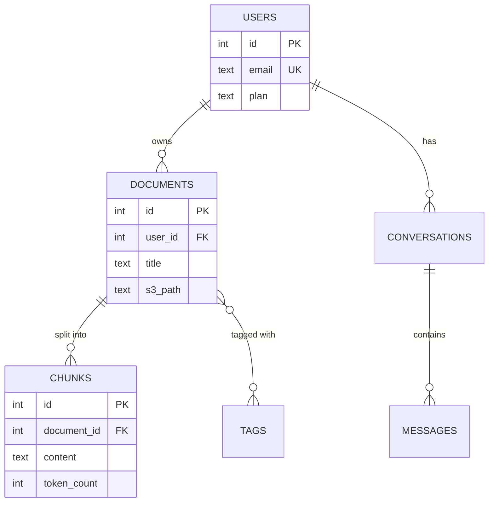
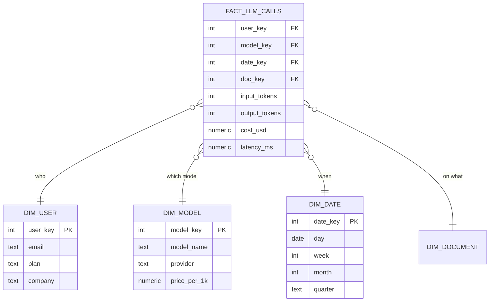
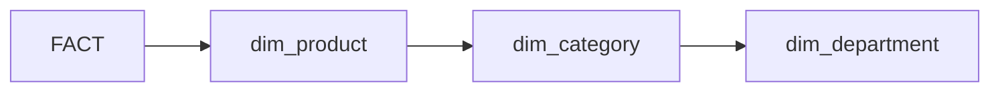
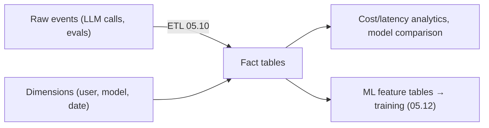

<!-- Module 05 · Lesson 8 — follows ../../../standards/. -->

# 05.8 · Data Modeling

[⬅ 05.7 NoSQL](05.7-nosql.md) · [🏠 Module](../README.md) · [🗺 Roadmap](../../../ROADMAP.md) · [Next ➡](05.9-warehouses-lakes.md)

> Schema design is where data engineering succeeds or fails. This lesson covers **ER diagrams** for transactional systems and the **star/snowflake schemas** (facts and dimensions) that power analytics and AI feature engineering — two different disciplines for two different jobs.

| | |
|---|---|
| **Module** | `05 · Databases & Data Engineering` |
| **Lesson** | `05.8` |
| **Difficulty** | ⭐⭐⭐ |
| **Estimated study time** | 55 min read · 40 min practice |
| **Status** | 🟢 stable |

---

## 1. Learning Objectives

By the end of this lesson you will be able to:

- [ ] Draw and read **ER diagrams** (entities, attributes, relationships, cardinality).
- [ ] Distinguish **OLTP** (transactional) from **OLAP** (analytical) modeling.
- [ ] Design a **star schema** with **fact** and **dimension** tables.
- [ ] Compare **star vs snowflake** schemas.
- [ ] Model AI/ML data (events, features, evaluations) for analytics.

## 2. Prerequisites

- [05.2 Relational Databases](05.2-relational-databases.md) (normalization) and [05.3](05.3-sql-fundamentals.md) (JOINs/aggregation).

---

## 3. Why This Topic Exists

There are **two kinds of data modeling**, and using the wrong one is a classic, costly mistake. **OLTP** modeling (normalized, [05.2](05.2-relational-databases.md)) optimizes an *application*: fast, safe writes and integrity. **OLAP** modeling (star schema, denormalized) optimizes *analytics*: fast aggregations over billions of rows.

Your AI application's Postgres should be normalized. Your analytics warehouse and your ML feature tables should be star-schema'd. Knowing which discipline applies — and why — is what separates a data engineer from someone who just writes SQL.

> [!IMPORTANT]
> **OLTP normalizes to avoid anomalies; OLAP denormalizes to avoid JOINs.** They're opposite optimizations because they have opposite workloads: OLTP does many small reads/writes of *individual rows* (needs integrity); OLAP does few, enormous aggregations over *millions of rows* (needs speed, and data is written once in bulk so redundancy is harmless). Applying the wrong model — a fully normalized warehouse, or a denormalized app database — is a top data-engineering mistake.

## 4. OLTP vs OLAP

| | **OLTP** (transactional) | **OLAP** (analytical) |
|---|---|---|
| Purpose | Run the application | Answer business/ML questions |
| Queries | Many small (`WHERE id = 42`) | Few huge (`SUM over 100M rows`) |
| Writes | Constant, small, concurrent | Bulk loads (ETL, [05.10](05.10-etl-elt.md)) |
| Model | **Normalized** (3NF, [05.2](05.2-relational-databases.md)) | **Denormalized** (star schema) |
| Optimized for | Integrity + write speed | Read/aggregation speed |
| Example | Postgres app DB | Snowflake/BigQuery ([05.9](05.9-warehouses-lakes.md)) |
| Storage | Row-oriented | **Column-oriented** ([05.9](05.9-warehouses-lakes.md)) |

```mermaid
flowchart LR
    APP["App (OLTP): Postgres, normalized"] -->|ETL/ELT (05.10)| WH["Warehouse (OLAP): star schema, columnar"]
    WH --> BI["Dashboards, analytics"]
    WH --> ML["ML features, training sets"]
```

> [!NOTE]
> This is why AI systems have **both**: the application database (OLTP) serves live traffic, and data is periodically piped ([05.10](05.10-etl-elt.md)) into a warehouse (OLAP) where heavy analytics and ML feature engineering run — *without* slowing down the app. Never run a giant analytical query against your production OLTP database ([05.14](05.14-performance-scaling.md)).

---

## 5. ER Diagrams — Modeling for OLTP

An **Entity-Relationship diagram** captures entities (tables), their attributes, and how they relate — the design artifact you produce *before* writing DDL.



| Notation | Meaning |
|---|---|
| `||--o{` | One-to-many (one user, many documents) |
| `}o--o{` | Many-to-many (needs a join table, [05.2](05.2-relational-databases.md)) |
| `||--||` | One-to-one |
| `PK` / `FK` / `UK` | Primary / foreign / unique key |

> [!TIP]
> **Draw the ER diagram before writing `CREATE TABLE`.** It forces you to name entities, decide cardinalities, and spot missing join tables — errors that are trivial on a diagram and expensive in a migrated production schema. Mermaid `erDiagram` (used throughout this handbook) keeps the diagram *in version control alongside the code* ([Module 04](../../04-Git/README.md)) — a living document, not a stale Visio file.

---

## 6. Star Schema — Modeling for OLAP

The **star schema** is the dominant analytical model: one central **fact table** (the events/measurements) surrounded by **dimension tables** (the descriptive context).



| Table type | Contains | Characteristics |
|---|---|---|
| **Fact table** | **Measurements/events** + FKs to dimensions | Huge (billions of rows), narrow, numeric |
| **Dimension table** | Descriptive attributes ("who/what/when/where") | Small, wide, denormalized, text-heavy |

| Fact-table columns | Example |
|---|---|
| **Foreign keys** to dimensions | `user_key`, `model_key`, `date_key` |
| **Measures** (numeric, additive) | `input_tokens`, `cost_usd`, `latency_ms` |

> [!IMPORTANT]
> **The star schema exists to make analytical queries fast and *simple*.** Any business question becomes: *filter the dimensions, aggregate the facts* — one JOIN per dimension, no chains. "What did each customer spend per model last month?" is a single query joining the fact table to 3 dimensions. Dimensions are deliberately **denormalized** ([05.2](05.2-relational-databases.md)) — `dim_user` repeats the company name on every row rather than joining to a company table — because that redundancy costs little (dimensions are small) and saves a JOIN on every query.

> [!TIP]
> **A `dim_date` table is standard and worth building** — it lets you filter/group by week, quarter, fiscal period, holiday, or day-of-week without date arithmetic in every query. It's the most reused dimension in any warehouse.

---

## 7. Snowflake Schema — Normalized Dimensions

A **snowflake schema** normalizes the dimensions (splitting them into sub-dimensions), so the diagram branches like a snowflake.



| | Star | Snowflake |
|---|---|---|
| Dimensions | Denormalized (flat) | Normalized (split into sub-tables) |
| JOINs per query | Fewer | More |
| Query speed | **Faster** | Slower |
| Storage | Slightly more | Slightly less |
| Simplicity | **Simpler** | More complex |

> [!IMPORTANT]
> **Prefer the star schema.** Snowflaking saves a trivial amount of storage (dimensions are tiny compared to fact tables) at the cost of extra JOINs on *every* analytical query, and it makes the model harder for analysts to use. In modern warehouses ([05.9](05.9-warehouses-lakes.md)) where storage is cheap and compute is the cost, star is almost always right. Snowflake only when a dimension is genuinely huge or shared across many facts.

---

## 8. Modeling AI/ML Data

AI systems generate exactly the fact/dimension shape — events with measures, plus context.

| AI data | Model as |
|---|---|
| LLM API calls (tokens, cost, latency) | **Fact** table |
| Model evaluations (metric values per run) | **Fact** table |
| Predictions/inferences | **Fact** table |
| User, model, document, date, prompt-version | **Dimensions** |
| Feature values for training | Fact-like **feature tables** (entity + timestamp + features) |



> [!IMPORTANT]
> **Two AI-specific modeling concerns.** (1) **Point-in-time correctness**: when building a training set, features must reflect what was known *at the time of the event* — joining a user's *current* plan to a 6-month-old prediction leaks future information (**data leakage**, a serious ML bug covered in [Module 08](../../08-Machine-Learning/README.md)). Model this with **effective-dated dimensions** (slowly-changing dimensions) or timestamped feature snapshots. (2) **Slowly Changing Dimensions (SCD Type 2)**: instead of overwriting a changed attribute, insert a new row with `valid_from`/`valid_to` — preserving history so past facts join to the *then-current* dimension values.

---

## 9. Common Mistakes & Best Practices

| Mistake | Better |
|---|---|
| Normalizing a warehouse (3NF) | Star schema — denormalize dimensions |
| Denormalizing the app DB | Normalize OLTP ([05.2](05.2-relational-databases.md)) |
| Running analytics on the OLTP DB | Pipe to a warehouse ([05.9](05.9-warehouses-lakes.md)/[05.14](05.14-performance-scaling.md)) |
| Overwriting dimension attributes | SCD Type 2 (preserve history) |
| Joining current dims to past facts | Point-in-time correctness (avoid leakage!) |
| No `dim_date` | Build one — hugely reused |
| Snowflaking by default | Star unless justified |
| Writing DDL before an ER diagram | Diagram first |

## 10. Performance Considerations

| Principle | Takeaway |
|---|---|
| Star = fewer JOINs | Faster analytical queries |
| Fact tables are huge | Partition by date ([05.14](05.14-performance-scaling.md)) |
| Columnar storage | Warehouses scan only needed columns ([05.9](05.9-warehouses-lakes.md)) |
| Pre-aggregations | Materialized views/rollups ([05.4](05.4-advanced-sql.md)) |
| Dimensions are small | Denormalizing them costs almost nothing |

## 11. Security Considerations

| Risk | Guidance |
|---|---|
| PII duplicated across denormalized dims | Minimize/pseudonymize PII in the warehouse |
| Warehouse holds *everything* | Broad access = broad exposure; use row/column-level security ([05.13](05.13-database-security.md)) |
| Retained history (SCD) | Complicates "right to be forgotten" — plan deletion paths |
| Analysts querying raw user data | Expose aggregated/masked views ([05.4](05.4-advanced-sql.md)) |

> [!CAUTION]
> Warehouses centralize *all* your data, which makes them a high-value target and a compliance concern. Denormalized dimensions can **duplicate PII across many rows/tables**, and SCD history *preserves* old values — both complicate GDPR deletion requests. Pseudonymize identifiers, minimize PII in analytical models, and design a deletion strategy before you accumulate years of data ([05.13](05.13-database-security.md)).

## 12. Interview Questions

**Beginner**
1. What's the difference between OLTP and OLAP modeling?
2. What are fact and dimension tables?

**Intermediate**
1. Why are star-schema dimensions denormalized?
2. Star vs snowflake — which and why?

**Advanced**
1. What is a Slowly Changing Dimension (Type 2) and why does it matter for ML?
2. Explain point-in-time correctness and how bad modeling causes data leakage.

**System-design prompt**
- Design the analytical model for an AI product's LLM usage (cost, latency, quality per user/model/day). — *Follow-ups:* Facts vs dimensions? Which measures? How do you handle a user changing plans (SCD)? How do you avoid leakage when building training features?

## 13. Summary

| Key idea | Takeaway |
|---|---|
| Two disciplines | OLTP normalizes; OLAP denormalizes |
| ER diagram | Design before DDL; captures entities + cardinality |
| Star schema | Fact table (measures + FKs) + denormalized dimensions |
| Snowflake | Normalized dims — more JOINs; usually avoid |
| `dim_date` | Standard, hugely reusable |
| AI modeling | Facts = LLM calls/evals/predictions; watch point-in-time correctness |

## 14. Cheat Sheet

```text
TWO MODELING DISCIPLINES:
  OLTP (app, Postgres): NORMALIZED 3NF · many small reads/writes · integrity + write speed
  OLAP (warehouse):     DENORMALIZED star · few HUGE aggregations · read speed · bulk loads (ETL) · COLUMNAR
  ⚠️ never run big analytics on the OLTP DB → pipe to a warehouse (05.9/05.10)
ER DIAGRAM (before DDL!): entities + attributes + cardinality
  ||--o{ one-to-many · }o--o{ many-to-many(join table) · ||--|| one-to-one · PK/FK/UK
STAR SCHEMA (★ default for analytics):
  FACT table = events/measurements: FKs to dims + MEASURES (tokens, cost_usd, latency_ms) — huge, narrow, numeric
  DIMENSION tables = who/what/when/where (user, model, date, document) — small, wide, DENORMALIZED
  → any question = filter dims + aggregate facts (one JOIN per dim, no chains)
  ★ always build a dim_date (week/month/quarter/holiday without date math)
SNOWFLAKE = normalized dimensions → MORE JOINs, slower → prefer STAR (storage is cheap, compute is the cost)
AI MODELING: facts = LLM calls / evals / predictions · dims = user, model, prompt-version, date
  ⚠️ POINT-IN-TIME CORRECTNESS: join features as they were AT EVENT TIME (else DATA LEAKAGE — Module 08)
  SCD TYPE 2: don't overwrite a changed attribute → new row with valid_from/valid_to (preserves history)
```

## 15. Flashcards

- **Q:** OLTP vs OLAP modeling? — **A:** OLTP is normalized (integrity, fast small writes) for applications; OLAP is denormalized (star schema, fast aggregations) for analytics — opposite optimizations for opposite workloads.
- **Q:** What are fact and dimension tables? — **A:** The fact table holds events/measurements (numeric measures + FKs) and is huge; dimensions hold descriptive context (who/what/when) and are small and denormalized.
- **Q:** Why are star-schema dimensions denormalized? — **A:** Dimensions are tiny compared to fact tables, so the redundancy costs little — and it saves a JOIN on every analytical query.
- **Q:** Star vs snowflake? — **A:** Snowflake normalizes dimensions (more JOINs, slower, more complex) to save trivial storage — prefer star, since storage is cheap and compute is the cost.
- **Q:** What is SCD Type 2? — **A:** A Slowly Changing Dimension that, instead of overwriting a changed attribute, inserts a new row with `valid_from`/`valid_to` — preserving history so past facts join to the then-current values.
- **Q:** What is point-in-time correctness? — **A:** Features must reflect what was known *at the time of the event*; joining current attribute values to historical facts leaks future information into training data (data leakage).

## 16. Hands-on Exercises

> Full set in [`../exercises/`](../exercises/).

- [ ] **(⭐ ER)** Draw an ER diagram (Mermaid) for an AI document-QA app; identify cardinalities and join tables.
- [ ] **(⭐⭐ Star)** Design a star schema for LLM usage: fact table + user/model/date dimensions; write the DDL.
- [ ] **(⭐⭐ Query)** Write the analytical query "cost per user per model last month" against your star schema.
- [ ] **(⭐⭐ dim_date)** Build and populate a `dim_date` table; use it to aggregate by week and quarter.
- [ ] **(⭐⭐⭐ SCD)** Implement SCD Type 2 for a user's plan changes; show a past fact joining to the then-current plan.
- [ ] **(⭐⭐⭐ Leakage)** Demonstrate data leakage by joining a *current* dimension value to a historical fact; fix with point-in-time joins.

## 17. Mini Project

> **Data Warehouse Design (this module's showcase, v4).** Design the analytical warehouse for an AI product: star schema with fact tables (LLM calls, evaluations) and dimensions (user, model, prompt version, date), including SCD Type 2 on the user dimension. Deliver: ER/star diagram, full DDL, seed data, the 6 key business queries (cost per model, latency p95 by day, quality trend, top users), and a written note on point-in-time correctness. This is core data-engineering work and directly feeds [05.9](05.9-warehouses-lakes.md)–[05.12](05.12-ai-data-workflows.md).

## 18. References

- Kimball & Ross, *The Data Warehouse Toolkit* — the definitive star-schema text ([reference standards](../../../standards/reference-standards.md)).
- Inmon vs Kimball (warehouse modeling philosophies).
- dbt docs on dimensional modeling.

## 19. What's Next

You can model for analytics. Now the systems that *hold* those models at scale: **data warehouses, lakes, and lakehouses** — and how to choose among Snowflake, BigQuery, Redshift, and Databricks.

➡️ **Next:** [05.9 · Data Warehouses & Lakes](05.9-warehouses-lakes.md)

---

### 🔁 Revision checklist
- [ ] I distinguish OLTP and OLAP modeling
- [ ] I can draw an ER diagram and a star schema
- [ ] I know why dimensions are denormalized (and why star > snowflake)
- [ ] I understand SCD Type 2 and point-in-time correctness

### 🔗 Spaced-repetition callback
> Recall [05.2's normalization vs denormalization](05.2-relational-databases.md): this lesson is that trade-off applied at *system* scale — normalize the app (anomalies matter), denormalize the warehouse (JOIN cost matters). And [Module 02.11's tradeoffs](../../02-Computer-Science/weeks/02.11-system-design-basics.md) reappear: there's no universally right model, only the right one for the workload.
