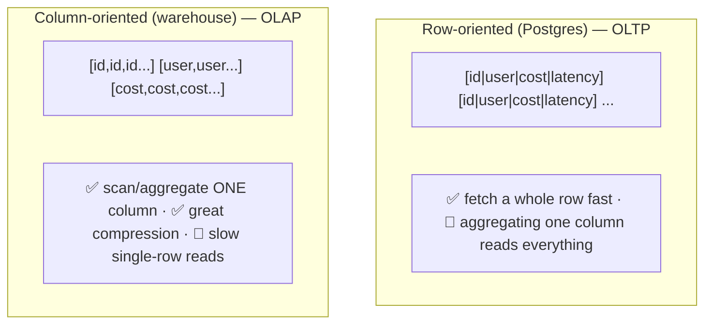
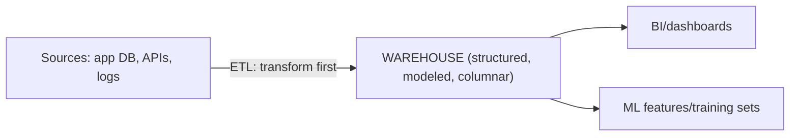
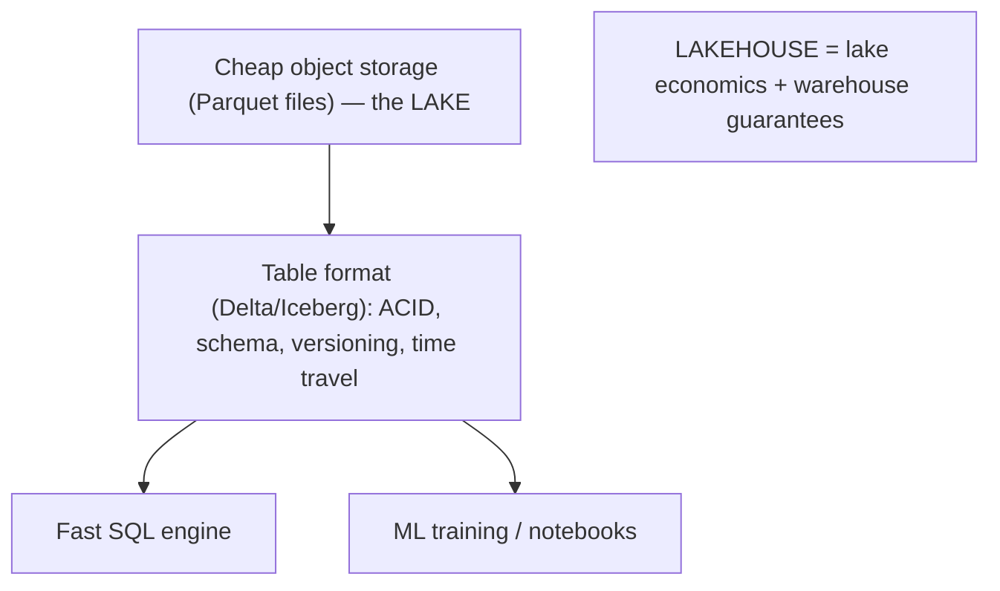
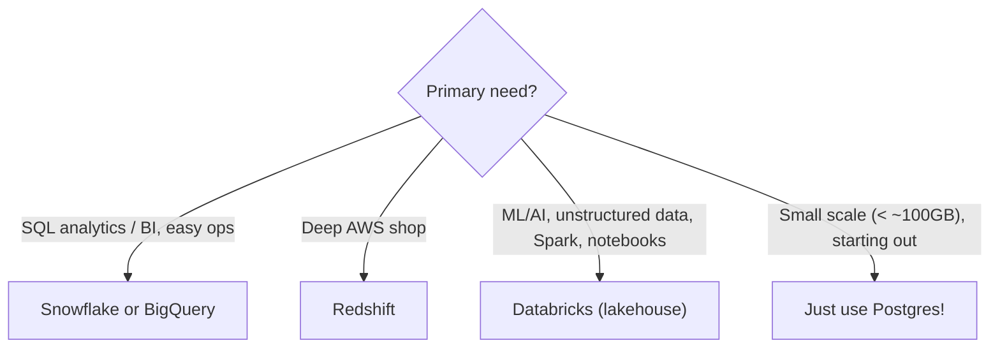
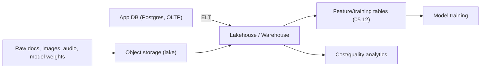

<!-- Module 05 · Lesson 9 — follows ../../../standards/. -->

# 05.9 · Data Warehouses & Lakes

[⬅ 05.8 Data Modeling](05.8-data-modeling.md) · [🏠 Module](../README.md) · [🗺 Roadmap](../../../ROADMAP.md) · [Next ➡](05.10-etl-elt.md)

> Where do you put *all* your data — terabytes of events, logs, documents, and training sets? Not in Postgres. This lesson covers **warehouses** (structured, fast analytics), **lakes** (raw, cheap, any format), and the **lakehouse** that merges them — plus how to choose among Snowflake, BigQuery, Redshift, and Databricks.

| | |
|---|---|
| **Module** | `05 · Databases & Data Engineering` |
| **Lesson** | `05.9` |
| **Difficulty** | ⭐⭐⭐ |
| **Estimated study time** | 50 min read |
| **Status** | 🟢 stable |

---

## 1. Learning Objectives

By the end of this lesson you will be able to:

- [ ] Explain what a **data warehouse** is and why **columnar storage** makes it fast.
- [ ] Explain a **data lake** and its trade-offs (including the "data swamp").
- [ ] Explain the **lakehouse** and why it emerged.
- [ ] Compare **Snowflake, BigQuery, Redshift,** and **Databricks**.
- [ ] Choose the right platform for an AI workload.

## 2. Prerequisites

- [05.8 Data Modeling](05.8-data-modeling.md) (OLAP/star schema) and [Module 02.10 File Systems](../../02-Computer-Science/weeks/02.10-file-systems.md) (object storage, Parquet).

---

## 3. Why This Topic Exists

Your production Postgres ([05.2](05.2-relational-databases.md)) is optimized for the *application*, not for scanning 500 million rows to compute quarterly metrics — and running that query would slow down live traffic ([05.14](05.14-performance-scaling.md)). Analytics needs a separate system, purpose-built to scan enormous data fast and cheaply.

For AI Engineers, these systems hold the *training data*, the *evaluation history*, and the *usage analytics* that drive model decisions. Understanding where they fit — and their cost model — is essential, because warehouse bills can dwarf your GPU bills if used carelessly.

> [!IMPORTANT]
> **The defining innovation of the warehouse is columnar storage.** A row-store (Postgres) keeps each row's fields together — great for "give me *this user*" (OLTP). A **column-store** keeps each *column* together — so `SELECT AVG(cost) FROM 500M rows` reads *only* the `cost` column, skipping every other field. That's often a 10–100× reduction in I/O ([Module 02.1 "data movement dominates"](../../02-Computer-Science/weeks/02.1-how-computers-work.md)), plus far better compression (similar values sit together). Columnar is *why* warehouses are fast at analytics and slow at single-row lookups.

## 4. Row vs Column Storage



| | Row store | Column store |
|---|---|---|
| Reads for `SELECT *` on 1 row | Fast | Slow |
| Reads for `SUM(col)` on 500M rows | Slow (reads all fields) | **Fast** (reads one column) |
| Compression | Modest | **Excellent** (similar values adjacent) |
| Writes | Fast, row-at-a-time | Bulk/batch preferred |
| Used by | Postgres, MySQL (OLTP) | Snowflake, BigQuery, Parquet (OLAP) |

> [!NOTE]
> **Parquet** ([Module 02.10](../../02-Computer-Science/weeks/02.10-file-systems.md)) is the columnar *file format* underpinning most lakes and lakehouses — the same idea, stored in object storage. When you save a dataset as Parquet instead of CSV, you get columnar reads and compression for free, which is why it's the standard for ML datasets.

---

## 5. Data Warehouse

A **data warehouse** is a system optimized for analytical queries over **structured, cleaned, modeled** data (star schemas, [05.8](05.8-data-modeling.md)).



| ✅ Strengths | 🔴 Limitations |
|---|---|
| Very fast SQL analytics at scale | Requires structure/schema up front |
| Governed, clean, trusted data | Poor fit for unstructured data (images, raw text) |
| Mature BI ecosystem | Storage more expensive than a lake |
| Great for known questions | Less flexible for exploratory/raw data |

---

## 6. Data Lake

A **data lake** stores **raw data in any format** (CSV, JSON, Parquet, images, audio, PDFs) in cheap **object storage** ([Module 02.10](../../02-Computer-Science/weeks/02.10-file-systems.md)) — schema-on-read, transform later.

| ✅ Strengths | 🔴 Limitations |
|---|---|
| Cheap, unlimited storage | No schema enforcement → quality chaos |
| **Any format** — perfect for AI's unstructured data | No ACID/transactions |
| Store now, decide later (schema-on-read) | Slow/awkward querying without extra layers |
| Ideal for ML training data | Governance is hard |

> [!WARNING]
> **The "data swamp" is the classic data-lake failure**: teams dump everything in with no schema, catalog, ownership, or documentation — and within a year nobody knows what any of it is, whether it's current, or whether it's trustworthy. A lake without **governance** (catalog, schemas, ownership, quality checks — [05.11](05.11-data-pipelines.md)) becomes write-only storage. Cheap storage is not the same as useful data.

> [!IMPORTANT]
> **AI is the killer use case for data lakes** — training data is often unstructured (text, images, audio) and enormous, exactly what warehouses handle badly and lakes handle naturally ([05.1](05.1-introduction.md)). Your raw documents, scraped corpora, and model checkpoints live in a lake (object storage); their *metadata* lives in a database; their *aggregate analytics* live in a warehouse.

---

## 7. Lakehouse — The Convergence

A **lakehouse** puts warehouse-like features (schema, ACID transactions, fast SQL, time travel) *on top of* cheap lake storage — via open table formats (**Delta Lake**, **Apache Iceberg**, Hudi).



| | Warehouse | Lake | **Lakehouse** |
|---|---|---|---|
| Data types | Structured | Any | Any |
| Schema | Enforced (write) | On read | Enforced (with evolution) |
| ACID | ✅ | ❌ | ✅ |
| Cost | Higher | Lowest | Low |
| SQL performance | Excellent | Poor | Very good |
| ML/unstructured | Weak | Strong | Strong |

> [!IMPORTANT]
> **The lakehouse exists because AI/ML teams needed both**: cheap storage for enormous unstructured training data (lake) *and* reliable, ACID, queryable tables for analytics and feature engineering (warehouse) — without maintaining two copies of everything. Formats like **Delta Lake** and **Iceberg** add a transaction log over Parquet files, giving ACID, schema evolution, and **time travel** (query the table as of last Tuesday — invaluable for reproducible training sets, [05.12](05.12-ai-data-workflows.md)/[Module 04.6](../../04-Git/weeks/04.6-tags-releases.md)). It's the modern default for ML data platforms.

---

## 8. The Platforms Compared

| Platform | Type | Strengths | Notes |
|---|---|---|---|
| **Snowflake** | Cloud warehouse | Easy, elastic, separates storage/compute; multi-cloud | Excellent SQL analytics; premium pricing |
| **BigQuery** | Cloud warehouse (GCP) | Serverless — no cluster to manage; huge scale | Pay-per-byte-scanned (watch costs!) |
| **Redshift** | Cloud warehouse (AWS) | Deep AWS integration; mature | More cluster management than the above |
| **Databricks** | **Lakehouse** (Delta Lake) | Best for ML/AI: Spark, notebooks, MLflow, unstructured data | The ML-team default |



> [!IMPORTANT]
> **Two decisive practical points.** (1) **Storage/compute separation** (Snowflake, BigQuery, lakehouses) is the modern architecture — you store data cheaply and spin compute up/down independently, so idle storage costs almost nothing and you pay for queries. (2) **Cost model is the biggest operational trap**: BigQuery charges *per byte scanned*, so `SELECT *` on a 10 TB table costs real money, and a careless dashboard refreshing every minute can burn thousands. **Partition and cluster your tables, select only needed columns ([05.3](05.3-sql-fundamentals.md)), and set query cost limits.** Warehouse bills surprise more teams than GPU bills.

> [!TIP]
> **Don't adopt a warehouse until you need one.** Postgres comfortably handles analytics into the tens/hundreds of GB (especially with a read replica, [05.14](05.14-performance-scaling.md), and materialized views, [05.4](05.4-advanced-sql.md)). Adding Snowflake/Databricks to a small startup is premature complexity and cost. The signal to move: analytics queries are slowing production, or data exceeds what one machine can scan in acceptable time.

---

## 9. Where AI Data Lives — Putting It Together



| AI artifact | Home |
|---|---|
| Live app data (users, docs, conversations) | **Postgres** (OLTP) |
| Raw unstructured data (PDFs, images, corpora) | **Lake** (object storage) |
| Model weights, checkpoints | **Object storage** ([Module 04.9](../../04-Git/weeks/04.9-large-files.md)) |
| Cleaned/modeled analytics (usage, cost, evals) | **Warehouse/lakehouse** (star schema, [05.8](05.8-data-modeling.md)) |
| Training/feature tables | **Lakehouse** (versioned, time-travel) |
| Embeddings | **Vector DB / pgvector** ([05.15](05.15-vector-databases.md)) |

---

## 10. Common Mistakes & Best Practices

| Mistake | Better |
|---|---|
| Running analytics on the production OLTP DB | Pipe to a warehouse ([05.10](05.10-etl-elt.md)) |
| Adopting a warehouse too early | Postgres until you hit real limits |
| Data lake without governance | Catalog, schemas, ownership → avoid the swamp |
| `SELECT *` in BigQuery | Costs money per byte scanned |
| No partitioning on huge tables | Partition/cluster (usually by date) |
| Two copies (lake + warehouse) drifting | Lakehouse (one copy, both capabilities) |
| CSV for large datasets | **Parquet** (columnar, compressed) |

## 11. Performance Considerations

| Principle | Takeaway |
|---|---|
| Columnar storage | Read only the columns you need |
| Partitioning (by date) | Skip irrelevant data entirely ([05.14](05.14-performance-scaling.md)) |
| Parquet > CSV | Columnar + compressed ([Module 02.10](../../02-Computer-Science/weeks/02.10-file-systems.md)) |
| Separation of storage/compute | Scale each independently |
| Pre-aggregate | Rollup tables/materialized views ([05.4](05.4-advanced-sql.md)) |

## 12. Security Considerations

| Risk | Guidance |
|---|---|
| Warehouse centralizes everything | High-value target — strict access control ([05.13](05.13-database-security.md)) |
| Broad analyst access to PII | Row/column-level security; masked views |
| Lake with open bucket permissions | Misconfigured object storage = classic breach ([Module 03.15](../../03-Linux/weeks/03.15-security.md)) |
| Data retention/deletion | Plan for GDPR deletion across lake + warehouse |
| Cost as a DoS | Set query cost limits/quotas |

> [!CAUTION]
> **Publicly-readable object-storage buckets are one of the most common cloud breaches** — a misconfigured lake exposes your entire raw data estate (documents, PII, model weights) to anyone. Enforce private-by-default buckets, least-privilege IAM, and encryption ([Module 03.15](../../03-Linux/weeks/03.15-security.md)/[05.13](05.13-database-security.md)). The lake holds your most sensitive raw material — protect it accordingly.

## 13. Interview Questions

**Beginner**
1. What is a data warehouse, and why is columnar storage fast for analytics?
2. What's a data lake, and what's a "data swamp"?

**Intermediate**
1. Warehouse vs lake vs lakehouse — compare.
2. Why is BigQuery's cost model a trap, and how do you control it?

**Advanced**
1. Why did the lakehouse emerge, and what do Delta/Iceberg add over raw Parquet?
2. When should a team *not* adopt a warehouse?

**System-design prompt**
- Design the data platform for an AI company: app data, raw documents, model artifacts, usage analytics, training sets. — *Follow-ups:* What goes where? Warehouse or lakehouse? How do you control cost? How do you keep it governed and secure?

## 14. Summary

| Key idea | Takeaway |
|---|---|
| Columnar storage | Why warehouses are fast at analytics |
| Warehouse | Structured, modeled, governed, fast SQL |
| Lake | Raw, any format, cheap — but risks a swamp |
| Lakehouse | Lake economics + ACID/schema/time travel (ML default) |
| Platforms | Snowflake/BigQuery (SQL), Redshift (AWS), Databricks (ML) |
| Don't adopt early | Postgres goes further than you think |
| Cost | Warehouse bills surprise teams — partition, select columns |

## 15. Cheat Sheet

```text
WHY NOT POSTGRES FOR ANALYTICS: OLTP row-store; big scans slow production → separate analytical system
★ COLUMNAR STORAGE = the warehouse innovation: store each COLUMN together
  → SUM(cost) over 500M rows reads ONLY the cost column (10-100× less I/O) + great compression
  row-store(Postgres/OLTP): fast single row · column-store(warehouse/OLAP): fast aggregations, slow single-row
WAREHOUSE: structured, modeled (star 05.8), governed, fast SQL · 🔴 needs schema, poor for unstructured
DATA LAKE: RAW any format in cheap object storage, schema-on-read · ✅ AI's unstructured data, cheap, flexible
  🔴 no schema/ACID → ⚠️ DATA SWAMP (no catalog/ownership = write-only storage)
LAKEHOUSE (★ ML default) = lake storage + Delta Lake/Iceberg table format → ACID + schema + TIME TRAVEL over Parquet
PLATFORMS: Snowflake(easy, elastic, multi-cloud) · BigQuery(serverless; ⚠️ PAY PER BYTE SCANNED!) ·
  Redshift(AWS) · Databricks(LAKEHOUSE, Spark, notebooks, MLflow — best for ML/AI)
  ★ < ~100GB / starting out → JUST USE POSTGRES (don't adopt a warehouse early!)
COST TRAPS: SELECT * on BigQuery = $$$ · always PARTITION (by date) + cluster + select only needed columns
FORMAT: Parquet (columnar, compressed) >> CSV for any large dataset
AI DATA HOMES: app→Postgres · raw docs/models→lake(object storage) · analytics/features→lakehouse · embeddings→vector DB(05.15)
SECURITY: private-by-default buckets (public buckets = classic breach!) · least-privilege · plan GDPR deletion
```

## 16. Flashcards

- **Q:** Why is columnar storage fast for analytics? — **A:** It stores each column together, so an aggregation reads only the needed column (skipping all other fields) — 10–100× less I/O — plus it compresses far better.
- **Q:** Warehouse vs lake? — **A:** Warehouse = structured, modeled, governed, fast SQL (schema-on-write); lake = raw data in any format in cheap object storage (schema-on-read), ideal for AI's unstructured data but prone to becoming a swamp.
- **Q:** What is a data swamp? — **A:** A data lake without governance (no catalog, schemas, ownership, or quality checks) — nobody knows what the data is or whether it's trustworthy, so it becomes write-only storage.
- **Q:** What is a lakehouse, and what do Delta/Iceberg add? — **A:** Warehouse features on cheap lake storage — a table format adds ACID transactions, schema enforcement/evolution, and time travel over Parquet files.
- **Q:** What's BigQuery's main cost trap? — **A:** It charges per byte scanned — `SELECT *` on huge tables costs real money; partition/cluster tables and select only needed columns.
- **Q:** When should you *not* adopt a warehouse? — **A:** Early/at small scale — Postgres (with read replicas and materialized views) handles analytics well into the tens/hundreds of GB.

## 17. Hands-on Exercises

> Full set in [`../exercises/`](../exercises/).

- [ ] **(⭐ Conceptual)** Explain why `SUM(cost)` over 500M rows is far faster on a column store; sketch both layouts.
- [ ] **(⭐⭐ Parquet)** Save a dataset as CSV and as Parquet; compare file size and the time to read one column.
- [ ] **(⭐⭐ Compare)** For 5 scenarios, choose warehouse / lake / lakehouse / Postgres and justify.
- [ ] **(⭐⭐ Cost)** Given a BigQuery pricing model, compute the cost of `SELECT *` vs selecting 2 columns on a 5 TB table.
- [ ] **(⭐⭐⭐ Design)** Design the data-platform layout for an AI company (app, raw docs, models, analytics, features).

## 18. Mini Project

> **Data platform architecture doc.** Produce the platform design for an AI company: which systems (Postgres, object-storage lake, lakehouse/warehouse, Redis, vector DB), what data lives where, the flow between them (with a Mermaid architecture diagram), the file formats (Parquet), partitioning strategy, cost controls, and the governance plan (catalog, ownership, retention) that prevents a data swamp. This is a genuine staff-level artifact and sets up [05.10](05.10-etl-elt.md)–[05.12](05.12-ai-data-workflows.md).

## 19. References

- Kleppmann, *DDIA* Ch. 3 (column-oriented storage) ([reference standards](../../../standards/reference-standards.md)).
- "Lakehouse: A New Generation of Open Platforms" (Databricks paper); Delta Lake & Apache Iceberg docs.
- Snowflake / BigQuery / Redshift / Databricks documentation.

## 20. What's Next

You know where data lives. Now how it *gets* there: **ETL and ELT** — ingestion, transformation, validation, batch vs streaming, and the orchestration (Airflow) that runs it all.

➡️ **Next:** [05.10 · ETL & ELT](05.10-etl-elt.md)

---

### 🔁 Revision checklist
- [ ] I can explain columnar storage and why it's fast
- [ ] I can compare warehouse, lake, and lakehouse
- [ ] I know the four platforms and when each fits
- [ ] I know the cost traps and when *not* to adopt a warehouse

### 🔗 Spaced-repetition callback
> Recall [Module 02.1's "moving data is expensive"](../../02-Computer-Science/weeks/02.1-how-computers-work.md) and [Module 02.10's Parquet/columnar](../../02-Computer-Science/weeks/02.10-file-systems.md): columnar storage is that principle industrialized — read *less data* by storing columns together. And [05.8's star schema](05.8-data-modeling.md) is what you put *inside* the warehouse.
